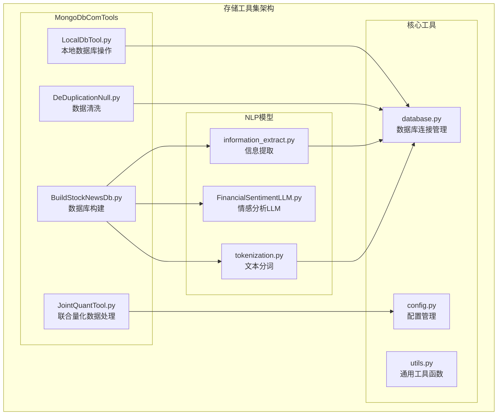
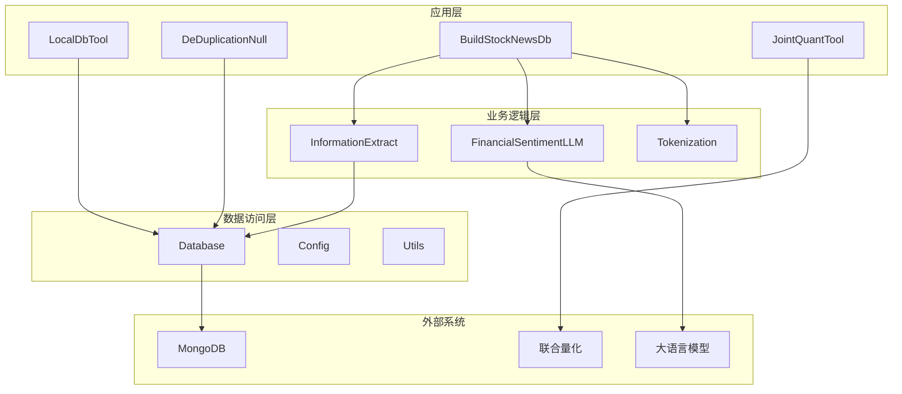
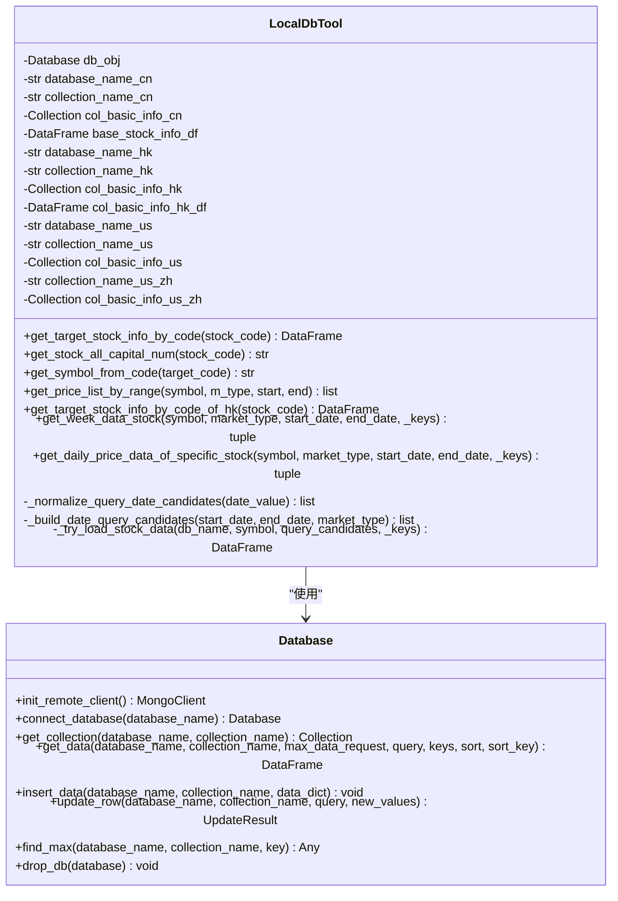
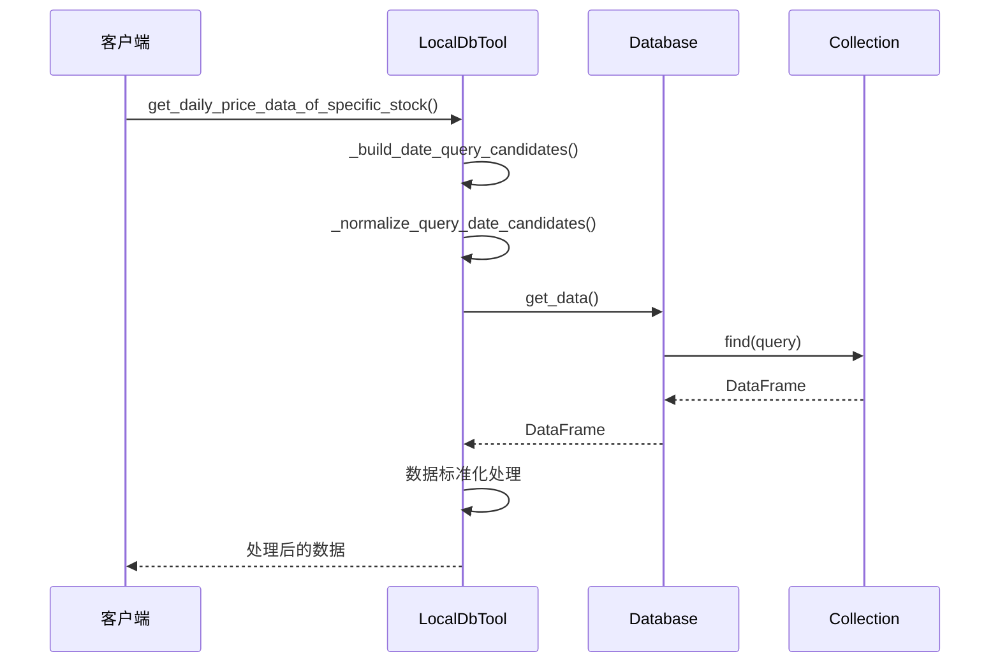
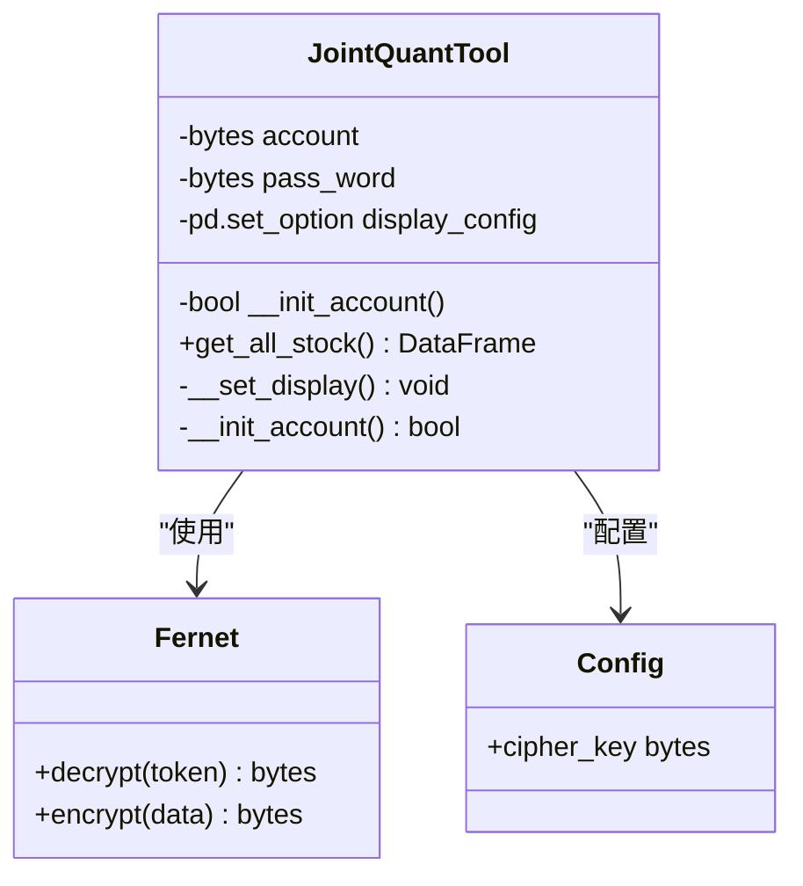
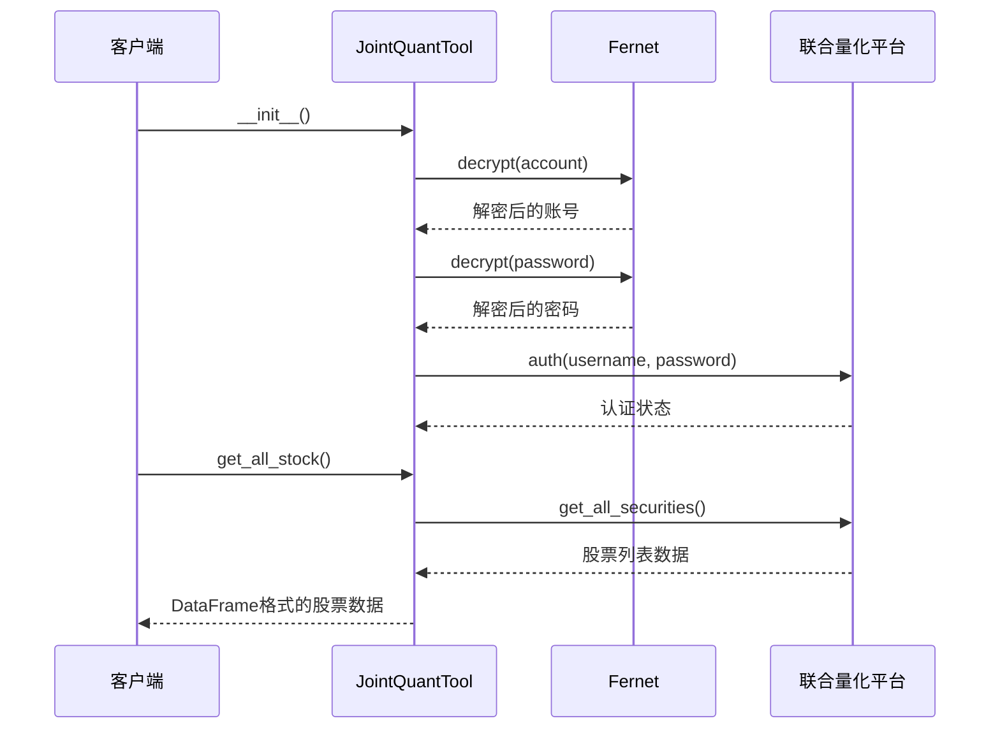
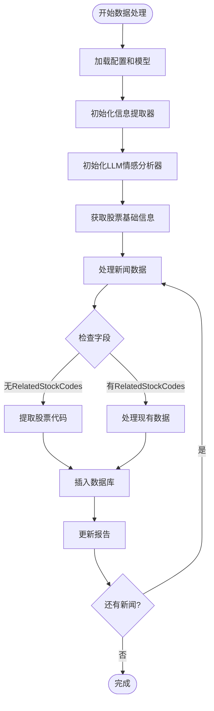
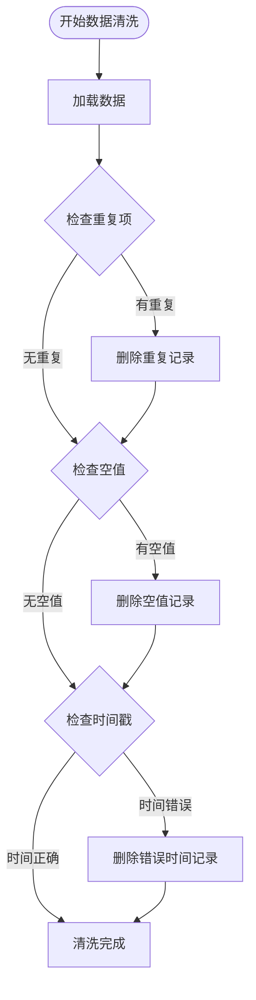
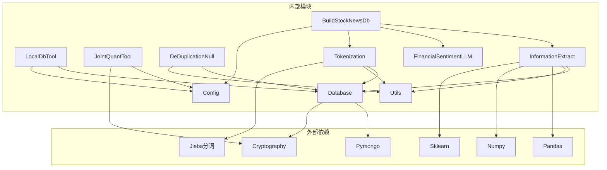

# 存储工具集

<cite>
**本文档引用的文件**
- [LocalDbTool.py](file://src/MongoDbComTools/LocalDbTool.py)
- [JointQuantTool.py](file://src/MongoDbComTools/JointQuantTool.py)
- [BuildStockNewsDb.py](file://src/MongoDbComTools/BuildStockNewsDb.py)
- [DeDuplicationNull.py](file://src/MongoDbComTools/DeDuplicationNull.py)
- [database.py](file://src/Utils/database.py)
- [config.py](file://src/Utils/config.py)
- [information_extract.py](file://src/NlpModel/information_extract.py)
- [FinancialSentimentLLM.py](file://src/NlpModel/FinancialSentimentLLM.py)
- [tokenization.py](file://src/NlpModel/tokenization.py)
- [utils.py](file://src/Utils/utils.py)
</cite>

## 目录
1. [简介](#简介)
2. [项目结构](#项目结构)
3. [核心组件](#核心组件)
4. [架构概览](#架构概览)
5. [详细组件分析](#详细组件分析)
6. [依赖关系分析](#依赖关系分析)
7. [性能考虑](#性能考虑)
8. [故障排除指南](#故障排除指南)
9. [结论](#结论)

## 简介

存储工具集是一套专为量化金融数据处理而设计的数据库管理工具集合，主要服务于股票新闻爬取、文本分析和情感计算等场景。该工具集提供了完整的数据生命周期管理能力，包括数据采集、清洗、处理、存储和分析等功能。

该工具集的核心价值在于：
- **多市场数据集成**：支持中国A股、港股、美股等多个市场的数据处理
- **智能数据清洗**：提供去重、空值处理、时间校验等数据质量保证机制
- **情感分析集成**：内置机器学习和大语言模型的情感分析能力
- **灵活的数据处理**：支持批量数据处理和增量更新机制

## 项目结构

存储工具集采用模块化的组织方式，按照功能职责进行清晰的层次划分：

**图表来源**
- [LocalDbTool.py:1-288](file://src/MongoDbComTools/LocalDbTool.py#L1-L288)
- [database.py:36-176](file://src/Utils/database.py#L36-L176)
- [config.py:1-455](file://src/Utils/config.py#L1-L455)

**章节来源**
- [LocalDbTool.py:1-288](file://src/MongoDbComTools/LocalDbTool.py#L1-L288)
- [database.py:36-176](file://src/Utils/database.py#L36-L176)
- [config.py:1-455](file://src/Utils/config.py#L1-L455)

## 核心组件

存储工具集包含四个核心组件，每个组件都承担着特定的数据管理职责：

### 1. LocalDbTool - 本地数据库操作工具

LocalDbTool是整个工具集的核心组件，负责处理本地MongoDB数据库的各种操作，包括数据查询、价格数据获取、市场数据处理等。

**主要功能特性：**
- 多市场数据访问（中国A股、港股、美股）
- 股票基本信息查询
- 日线、周线数据处理
- 日期范围查询优化
- 数据标准化处理

### 2. JointQuantTool - 联合量化数据处理工具

JointQuantTool专门用于与联合量化平台进行数据交互，提供授权认证、股票列表获取等核心功能。

**核心能力：**
- 自动化账户认证
- 股票基础信息获取
- 查询计数管理
- 版本信息跟踪

### 3. BuildStockNewsDb - 股票新闻数据库构建工具

BuildStockNewsDb负责构建和维护股票新闻数据库，实现从原始新闻数据到结构化股票新闻数据的转换。

**关键功能：**
- 新闻数据聚合和分类
- 股票代码识别和关联
- 情感分数计算
- 数据去重和完整性检查

### 4. DeDuplicationNull - 数据清洗工具

DeDuplicationNull提供完整的数据质量保证机制，包括去重、空值清理和时间验证等功能。

**数据质量保障：**
- URL级别的去重处理
- 空值检测和删除
- 时间戳有效性验证
- 批量数据处理优化

**章节来源**
- [LocalDbTool.py:10-288](file://src/MongoDbComTools/LocalDbTool.py#L10-L288)
- [JointQuantTool.py:11-51](file://src/MongoDbComTools/JointQuantTool.py#L11-L51)
- [BuildStockNewsDb.py:19-241](file://src/MongoDbComTools/BuildStockNewsDb.py#L19-L241)
- [DeDuplicationNull.py:15-122](file://src/MongoDbComTools/DeDuplicationNull.py#L15-L122)

## 架构概览

存储工具集采用了分层架构设计，确保了良好的可扩展性和维护性：

**图表来源**
- [database.py:36-176](file://src/Utils/database.py#L36-L176)
- [information_extract.py:26-424](file://src/NlpModel/information_extract.py#L26-L424)
- [FinancialSentimentLLM.py:5-167](file://src/NlpModel/FinancialSentimentLLM.py#L5-L167)

## 详细组件分析

### LocalDbTool 组件分析

LocalDbTool是存储工具集的核心数据库操作组件，提供了完整的本地数据库访问和数据处理能力。

#### 类结构设计

**图表来源**
- [LocalDbTool.py:10-288](file://src/MongoDbComTools/LocalDbTool.py#L10-L288)
- [database.py:36-176](file://src/Utils/database.py#L36-L176)

#### 数据查询流程

LocalDbTool实现了智能的数据查询机制，支持多种日期格式和查询条件：

**图表来源**
- [LocalDbTool.py:226-276](file://src/MongoDbComTools/LocalDbTool.py#L226-L276)
- [database.py:94-172](file://src/Utils/database.py#L94-L172)

#### 关键功能实现

**多市场数据支持：**
- 支持中国A股、港股、美股三个市场的数据访问
- 统一的数据库命名规范和集合管理
- 市场类型自动识别和路由

**智能日期处理：**
- 支持多种日期格式输入（YYYY-MM-DD, YYYY/MM/DD, YYYYMMDD等）
- 自动日期规范化和候选查询生成
- 跨市场日期格式差异化处理

**数据标准化：**
- 自动计算交易金额（成交量 × 价格均值）
- 时间索引设置和数据排序
- 周线数据重采样和聚合

**章节来源**
- [LocalDbTool.py:10-288](file://src/MongoDbComTools/LocalDbTool.py#L10-L288)

### JointQuantTool 组件分析

JointQuantTool专注于与联合量化平台的数据交互，提供了完整的认证和数据获取能力。

#### 认证机制设计

**图表来源**
- [JointQuantTool.py:11-51](file://src/MongoDbComTools/JointQuantTool.py#L11-L51)

#### 数据获取流程

**图表来源**
- [JointQuantTool.py:26-38](file://src/MongoDbComTools/JointQuantTool.py#L26-L38)

#### 安全特性

**加密存储：**
- 账号密码使用Fernet对称加密存储
- 密钥通过配置文件管理
- 运行时解密后进行认证

**显示控制：**
- 自动设置pandas显示选项
- 控制台输出格式化
- 数据展示优化

**章节来源**
- [JointQuantTool.py:11-51](file://src/MongoDbComTools/JointQuantTool.py#L11-L51)

### BuildStockNewsDb 组件分析

BuildStockNewsDb是存储工具集中最复杂的组件，负责构建和维护股票新闻数据库。

#### 数据处理架构

**图表来源**
- [BuildStockNewsDb.py:19-241](file://src/MongoDbComTools/BuildStockNewsDb.py#L19-L241)

#### 核心处理流程

**新闻数据处理：**
- 支持多种新闻源的数据格式
- 自动识别和提取股票相关信息
- 去重机制防止重复数据
- 情感分数计算和更新

**数据建模：**
- 为每个股票创建独立的新闻集合
- 使用MD5作为唯一标识符
- 标准化数据格式和字段
- 支持增量更新机制

**章节来源**
- [BuildStockNewsDb.py:19-241](file://src/MongoDbComTools/BuildStockNewsDb.py#L19-L241)

### DeDuplicationNull 组件分析

DeDuplicationNull提供了完整的数据质量保证机制，确保数据库中数据的准确性和一致性。

#### 数据清洗策略

**图表来源**
- [DeDuplicationNull.py:15-122](file://src/MongoDbComTools/DeDuplicationNull.py#L15-L122)

#### 批量处理优化

**时间范围处理：**
- 按日期范围进行批处理
- 优化查询性能
- 减少内存占用

**去重算法：**
- 基于URL的精确去重
- ID集合差集计算
- 原子性删除操作

**章节来源**
- [DeDuplicationNull.py:15-122](file://src/MongoDbComTools/DeDuplicationNull.py#L15-L122)

## 依赖关系分析

存储工具集的依赖关系体现了清晰的分层架构和模块化设计：

**图表来源**
- [database.py:5-10](file://src/Utils/database.py#L5-L10)
- [information_extract.py:4-16](file://src/NlpModel/information_extract.py#L4-L16)

### 关键依赖特性

**数据库连接管理：**
- 自动重连机制（最多5次尝试）
- 指数退避策略
- 连接池优化（最大200个连接）

**数据处理依赖：**
- Pandas用于数据结构化处理
- NumPy用于数值计算
- Scikit-learn用于机器学习模型

**安全依赖：**
- Fernet对称加密
- 配置文件密钥管理
- 运行时解密机制

**章节来源**
- [database.py:15-33](file://src/Utils/database.py#L15-L33)
- [information_extract.py:4-16](file://src/NlpModel/information_extract.py#L4-L16)

## 性能考虑

存储工具集在设计时充分考虑了性能优化，特别是在大数据量处理场景下的表现。

### 数据库性能优化

**连接池管理：**
- 最大连接数设置为200
- 自动重连机制减少连接中断影响
- 服务器选择超时时间为5秒

**查询优化策略：**
- 智能日期查询候选生成
- 条件查询优化
- 分页和限制机制

### 内存管理

**批量处理：**
- 分段处理大数据集
- 内存使用监控
- 及时释放资源

**数据结构优化：**
- DataFrame优先用于结构化数据
- 字典缓存常用数据
- 增量更新减少内存占用

### 并发处理

**异步操作：**
- 独立的NLP处理模块
- 线程安全的数据访问
- 锁机制保护共享资源

## 故障排除指南

### 常见问题及解决方案

**数据库连接问题：**
- 检查MongoDB服务状态
- 验证IP和端口配置
- 确认网络连接可用性

**认证失败：**
- 验证加密密钥正确性
- 检查联合量化账户信息
- 确认解密过程正常

**数据处理异常：**
- 检查数据格式兼容性
- 验证字段映射关系
- 确认模型文件完整性

### 调试技巧

**日志分析：**
- 启用详细日志级别
- 监控关键操作时间
- 分析错误堆栈信息

**性能监控：**
- 监控数据库响应时间
- 检查内存使用情况
- 分析CPU使用率

**章节来源**
- [database.py:15-33](file://src/Utils/database.py#L15-L33)
- [utils.py:25-27](file://src/Utils/utils.py#L25-L27)

## 结论

存储工具集提供了一套完整、高效、可靠的数据库管理解决方案，特别适用于量化金融领域的数据处理需求。通过模块化的架构设计和丰富的功能特性，该工具集能够满足从数据采集、清洗、处理到存储的全流程需求。

**核心优势：**
- **多市场支持**：统一处理中国A股、港股、美股数据
- **智能数据处理**：自动识别股票代码、计算情感分数
- **数据质量保证**：完善的去重和验证机制
- **性能优化**：高效的批量处理和内存管理
- **安全性**：加密存储和认证机制

**应用场景：**
- 股票新闻情感分析
- 多数据源整合
- 实时数据同步
- 历史数据归档
- 数据质量监控

该工具集为量化金融研究和应用提供了坚实的数据基础设施，能够有效支撑复杂的数据分析和决策制定需求。