# 数据存储系统

<cite>
**本文引用的文件**
- [database.py](file://src/Utils/database.py)
- [items.py](file://src/Utils/items.py)
- [pipelines.py](file://src/pipelines.py)
- [LocalDbTool.py](file://src/MongoDbComTools/LocalDbTool.py)
- [BuildStockNewsDb.py](file://src/MongoDbComTools/BuildStockNewsDb.py)
- [DeDuplicationNull.py](file://src/MongoDbComTools/DeDuplicationNull.py)
- [BaseSpider.py](file://src/MarketNewsSpiderWithScrapy/BaseSpider.py)
- [BasePlayCrawler.py](file://src/MarketNewsSpiderWithScrapy/BasePlayCrawler.py)
- [east_money_spider.py](file://src/MarketNewsSpiderWithScrapy/east_money_spider.py)
- [net_ease_spider.py](file://src/MarketNewsSpiderWithScrapy/net_ease_spider.py)
- [run_scripy_spider.py](file://src/run_scripy_spider.py)
- [settings.py](file://src/settings.py)
- [config.py](file://src/Utils/config.py)
- [utils.py](file://src/Utils/utils.py)
- [README.md](file://README.md)
</cite>

## 目录
1. [简介](#简介)
2. [项目结构](#项目结构)
3. [核心组件](#核心组件)
4. [架构总览](#架构总览)
5. [详细组件分析](#详细组件分析)
6. [依赖分析](#依赖分析)
7. [性能考虑](#性能考虑)
8. [故障排除指南](#故障排除指南)
9. [结论](#结论)
10. [附录](#附录)

## 简介
本文件面向数据存储系统，围绕MongoDB数据库设计与数据管道（pipelines）进行深入技术说明。内容涵盖：
- 数据库设计理念与数据模型架构
- 数据管道的清洗、验证与转换流程
- 连接管理、连接池配置与性能优化策略
- 数据去重机制的实现原理与最佳实践
- 数据模型定义（如TweetItem、StockInfo等）
- 导入导出工具与批量处理策略
- 索引优化、查询性能调优与备份恢复机制
- 实际配置示例与故障排除指南

## 项目结构
该项目采用“Scrapy + Playwright + MongoDB”的采集与存储体系，核心模块如下：
- 抓取层：基于Scrapy与Playwright的爬虫，负责从多家财经站点采集新闻
- 数据模型层：定义统一的新闻条目结构
- 管道层：将抓取结果写入MongoDB，并进行去重与清洗
- 工具层：本地数据库读取、批量处理、去重与空值清理
- 配置层：数据库、站点、模型路径等集中配置

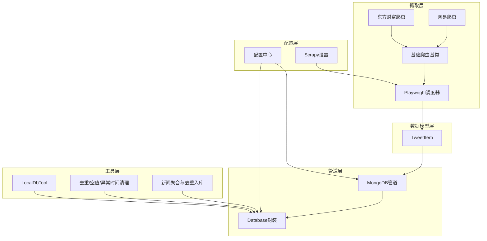

图表来源
- [BaseSpider.py:13-149](file://src/MarketNewsSpiderWithScrapy/BaseSpider.py#L13-L149)
- [BasePlayCrawler.py:21-120](file://src/MarketNewsSpiderWithScrapy/BasePlayCrawler.py#L21-L120)
- [east_money_spider.py:5-78](file://src/MarketNewsSpiderWithScrapy/east_money_spider.py#L5-L78)
- [net_ease_spider.py:9-68](file://src/MarketNewsSpiderWithScrapy/net_ease_spider.py#L9-L68)
- [items.py:5-18](file://src/Utils/items.py#L5-L18)
- [pipelines.py:8-56](file://src/pipelines.py#L8-L56)
- [database.py:36-176](file://src/Utils/database.py#L36-L176)
- [LocalDbTool.py:10-288](file://src/MongoDbComTools/LocalDbTool.py#L10-L288)
- [DeDuplicationNull.py:15-122](file://src/MongoDbComTools/DeDuplicationNull.py#L15-L122)
- [BuildStockNewsDb.py:19-241](file://src/MongoDbComTools/BuildStockNewsDb.py#L19-L241)
- [config.py:1-455](file://src/Utils/config.py#L1-L455)
- [settings.py:1-49](file://src/settings.py#L1-L49)

章节来源
- [README.md:1-33](file://README.md#L1-L33)
- [config.py:39-455](file://src/Utils/config.py#L39-L455)

## 核心组件
- Database：封装MongoClient初始化、集合操作、查询与更新、自动重连装饰器
- TweetItem：统一的新闻数据模型字段
- MongoDBPipeline：Scrapy管道，按来源数据库与集合写入，处理重复键
- LocalDbTool：按日期范围查询股票行情，支持多市场（A/H/US），并进行数据规范化
- BuildStockNewsDb：将分散来源的新闻聚合到“按股票”维度的集合，实现MD5去重
- DeDuplicationNull：按日期粒度对URL去重，删除空值与异常时间记录
- BaseSpider/Playwright调度器：统一的新闻采集流程，生成TweetItem并交由管道入库

章节来源
- [database.py:36-176](file://src/Utils/database.py#L36-L176)
- [items.py:5-18](file://src/Utils/items.py#L5-L18)
- [pipelines.py:8-56](file://src/pipelines.py#L8-L56)
- [LocalDbTool.py:10-288](file://src/MongoDbComTools/LocalDbTool.py#L10-L288)
- [BuildStockNewsDb.py:19-241](file://src/MongoDbComTools/BuildStockNewsDb.py#L19-L241)
- [DeDuplicationNull.py:15-122](file://src/MongoDbComTools/DeDuplicationNull.py#L15-L122)
- [BaseSpider.py:13-149](file://src/MarketNewsSpiderWithScrapy/BaseSpider.py#L13-L149)
- [BasePlayCrawler.py:21-120](file://src/MarketNewsSpiderWithScrapy/BasePlayCrawler.py#L21-L120)

## 架构总览
下图展示从爬虫到MongoDB的端到端数据流，包括数据清洗、验证与转换：

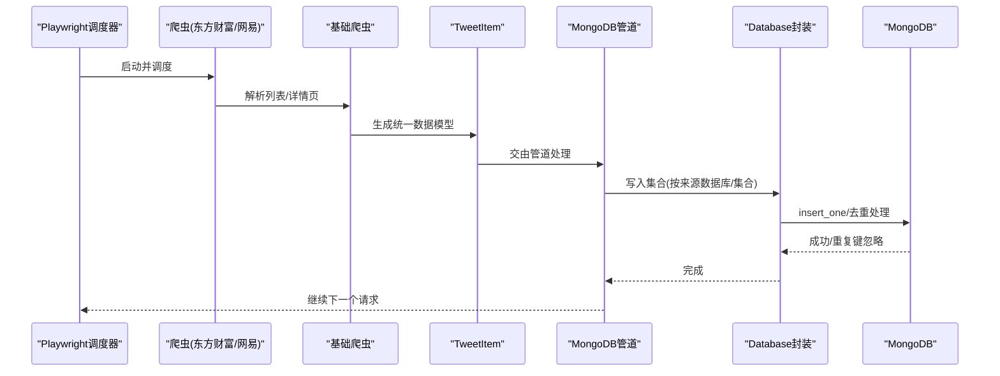

图表来源
- [BasePlayCrawler.py:41-118](file://src/MarketNewsSpiderWithScrapy/BasePlayCrawler.py#L41-L118)
- [BaseSpider.py:41-146](file://src/MarketNewsSpiderWithScrapy/BaseSpider.py#L41-L146)
- [east_money_spider.py:21-78](file://src/MarketNewsSpiderWithScrapy/east_money_spider.py#L21-L78)
- [net_ease_spider.py:31-66](file://src/MarketNewsSpiderWithScrapy/net_ease_spider.py#L31-L66)
- [pipelines.py:25-56](file://src/pipelines.py#L25-L56)
- [database.py:78-88](file://src/Utils/database.py#L78-L88)

## 详细组件分析

### 数据库连接与管理（Database）
- 连接池与超时：最大连接池大小、服务器选择超时、自动重连装饰器
- 查询与更新：支持条件查询、字段投影、排序、批量读取并转DataFrame
- 写入与去重：insert_one，捕获重复键异常并静默处理

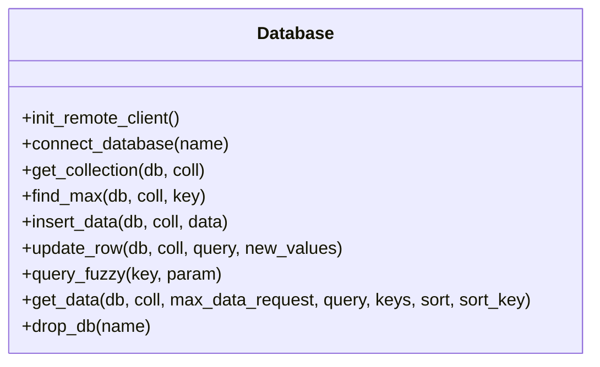

图表来源
- [database.py:36-176](file://src/Utils/database.py#L36-L176)

章节来源
- [database.py:44-60](file://src/Utils/database.py#L44-L60)
- [database.py:94-172](file://src/Utils/database.py#L94-L172)

### 数据模型定义（TweetItem）
- 字段覆盖URL、日期、标题、相关股票代码、文章正文、词频统计、分类、标签、情感分数等
- 作为Scrapy Item，确保不同来源的新闻在入库前具备一致结构

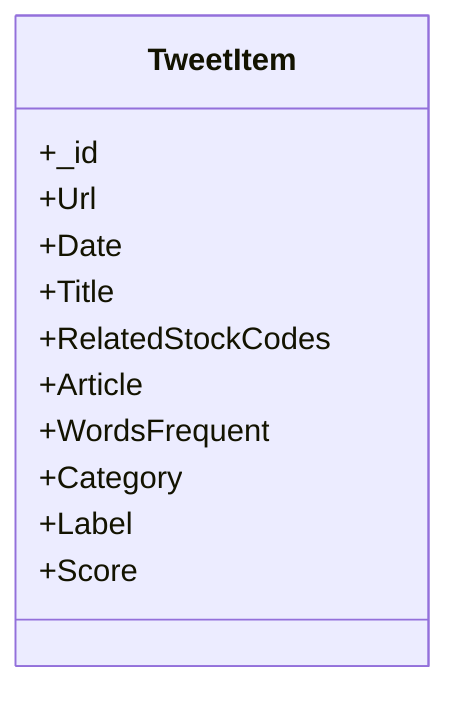

图表来源
- [items.py:5-18](file://src/Utils/items.py#L5-L18)

章节来源
- [items.py:5-18](file://src/Utils/items.py#L5-L18)

### 数据管道（MongoDBPipeline）
- 按来源爬虫名称映射到不同的数据库与集合
- 使用insert_one写入，捕获重复键异常，避免重复入库

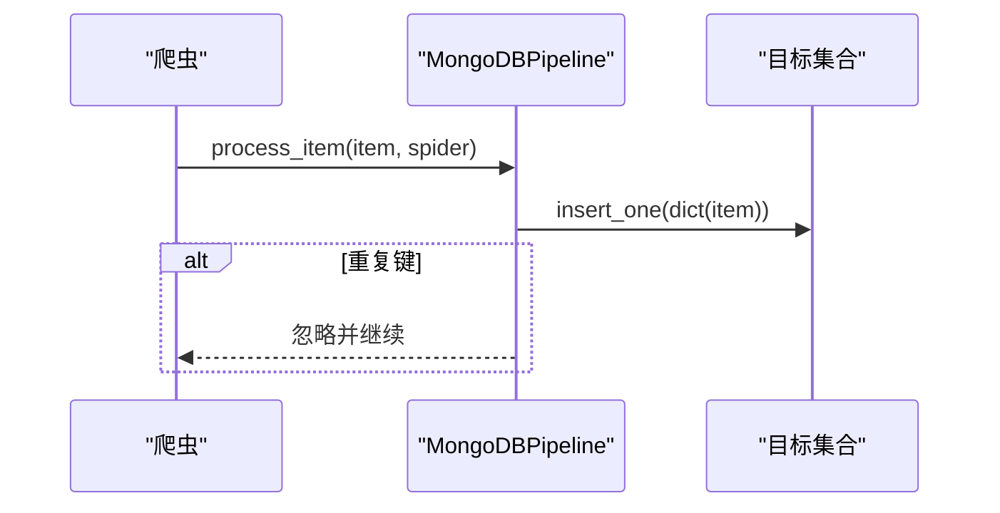

图表来源
- [pipelines.py:25-56](file://src/pipelines.py#L25-L56)

章节来源
- [pipelines.py:8-56](file://src/pipelines.py#L8-L56)

### 数据清洗与转换（BaseSpider）
- 文本清洗：去除多余空白、换行、全角字符，统一分隔
- 股票代码抽取：基于预定义词典，识别新闻中的股票名称与代码
- 情感打分融合：ML与LLM打分融合，输出统一标签与分数
- MD5去重：基于URL生成唯一_id，避免重复入库

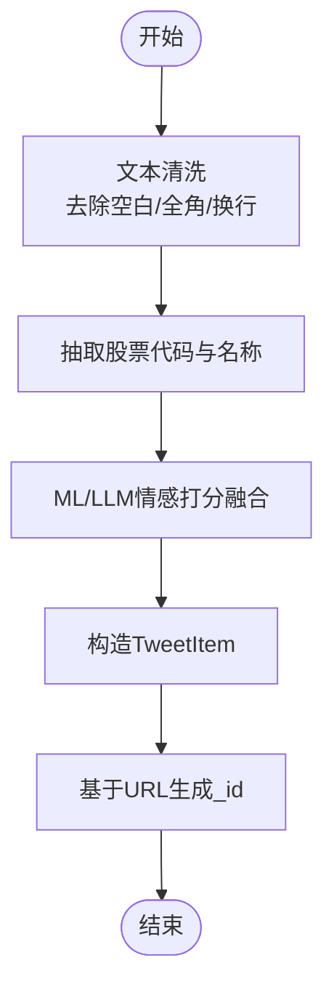

图表来源
- [BaseSpider.py:41-146](file://src/MarketNewsSpiderWithScrapy/BaseSpider.py#L41-L146)

章节来源
- [BaseSpider.py:41-146](file://src/MarketNewsSpiderWithScrapy/BaseSpider.py#L41-L146)

### 数据聚合与去重（BuildStockNewsDb）
- 将分散来源的新闻按“股票”维度聚合到独立集合
- 基于“日期+URL”的MD5作为_id，避免重复
- 支持增量处理（start_date过滤）

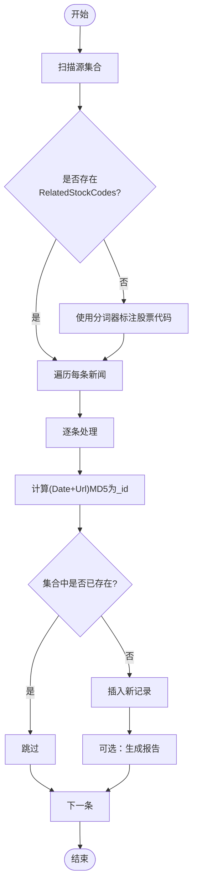

图表来源
- [BuildStockNewsDb.py:157-241](file://src/MongoDbComTools/BuildStockNewsDb.py#L157-L241)

章节来源
- [BuildStockNewsDb.py:67-134](file://src/MongoDbComTools/BuildStockNewsDb.py#L67-L134)
- [BuildStockNewsDb.py:157-241](file://src/MongoDbComTools/BuildStockNewsDb.py#L157-L241)

### 本地数据库读取与批量处理（LocalDbTool）
- 支持A/H/US三大市场基础信息与行情读取
- 按日期范围构建查询候选，支持多种日期格式归一化
- 支持周线聚合与索引设置，便于后续分析

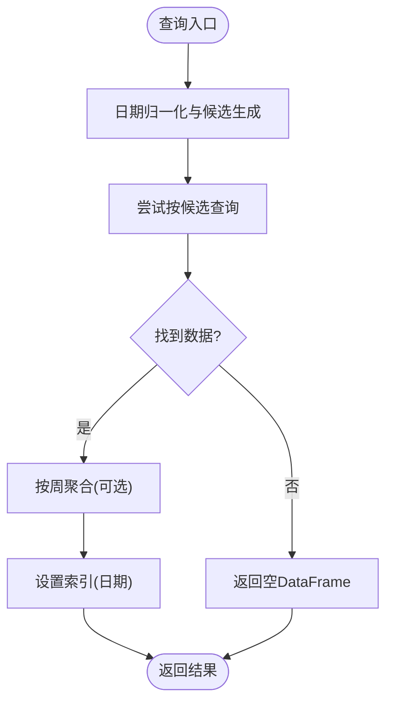

图表来源
- [LocalDbTool.py:127-276](file://src/MongoDbComTools/LocalDbTool.py#L127-L276)

章节来源
- [LocalDbTool.py:10-288](file://src/MongoDbComTools/LocalDbTool.py#L10-L288)

### 去重与数据质量（DeDuplicationNull）
- 按日期粒度对URL去重，删除重复记录
- 清理空字符串字段（除RelatedStockCodes外）
- 删除未来日期等异常记录

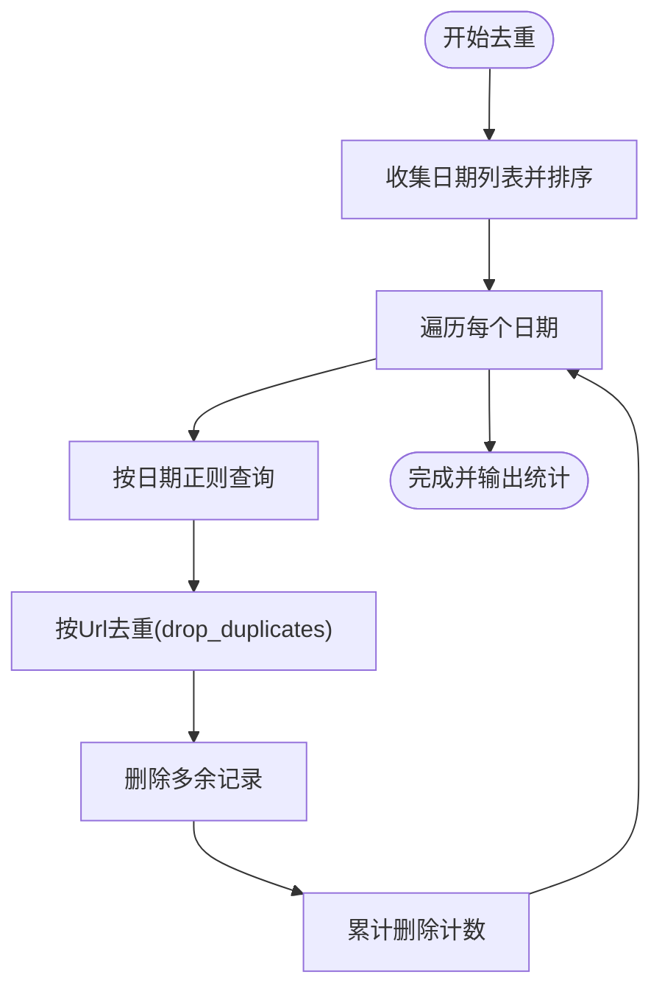

图表来源
- [DeDuplicationNull.py:22-62](file://src/MongoDbComTools/DeDuplicationNull.py#L22-L62)

章节来源
- [DeDuplicationNull.py:15-122](file://src/MongoDbComTools/DeDuplicationNull.py#L15-L122)

### 爬虫与调度（Playwright + Scrapy）
- Playwright调度器并发启动多个爬虫，共享浏览器实例但隔离上下文
- 爬虫继承基础类，统一生成TweetItem并交由管道入库

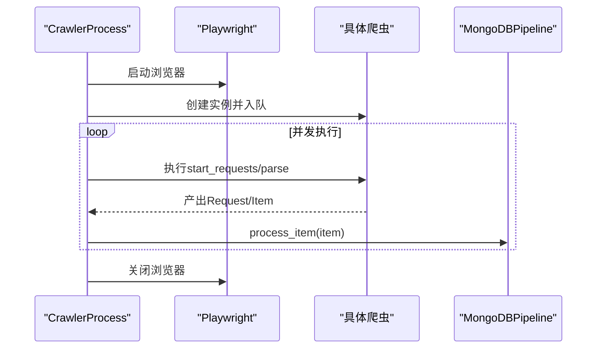

图表来源
- [BasePlayCrawler.py:41-118](file://src/MarketNewsSpiderWithScrapy/BasePlayCrawler.py#L41-L118)
- [run_scripy_spider.py:117-145](file://src/run_scripy_spider.py#L117-L145)

章节来源
- [BasePlayCrawler.py:21-120](file://src/MarketNewsSpiderWithScrapy/BasePlayCrawler.py#L21-L120)
- [run_scripy_spider.py:117-145](file://src/run_scripy_spider.py#L117-L145)

## 依赖分析
- 组件耦合
  - 爬虫依赖基础类与信息抽取模块，最终统一产出TweetItem
  - 管道依赖Database封装，直接写入MongoDB
  - 工具类依赖Database与配置中心，提供查询与聚合能力
- 外部依赖
  - PyMongo、Pandas、Scrapy、Playwright、Fernet（加密）
- 潜在风险
  - 管道层对重复键异常的静默处理可能掩盖业务问题，建议增加审计日志
  - 日期解析与查询候选生成需保证一致性，避免漏查或误查

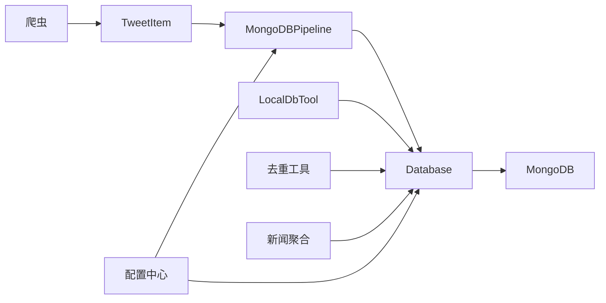

图表来源
- [pipelines.py:8-56](file://src/pipelines.py#L8-L56)
- [database.py:36-176](file://src/Utils/database.py#L36-L176)
- [LocalDbTool.py:10-288](file://src/MongoDbComTools/LocalDbTool.py#L10-L288)
- [DeDuplicationNull.py:15-122](file://src/MongoDbComTools/DeDuplicationNull.py#L15-L122)
- [BuildStockNewsDb.py:19-241](file://src/MongoDbComTools/BuildStockNewsDb.py#L19-L241)
- [config.py:1-455](file://src/Utils/config.py#L1-L455)

章节来源
- [config.py:39-455](file://src/Utils/config.py#L39-L455)

## 性能考虑
- 连接池与超时
  - 最大连接池大小：200
  - 服务器选择超时：5000ms
  - 自动重连：指数退避，最多5次尝试
- 查询与读取
  - get_data支持keys投影与排序，减少网络与内存开销
  - 分批读取max_data_request，避免一次性载入过多数据
- 写入与去重
  - insert_one + 唯一索引（_id）可有效避免重复
  - 建议在高频写入场景启用批量写入（如bulk_write）以提升吞吐
- 爬取并发
  - Scrapy并发请求数：50
  - 下载延迟：1秒
  - Playwright并发爬取多个站点，减少等待时间

章节来源
- [database.py:50-60](file://src/Utils/database.py#L50-L60)
- [database.py:94-172](file://src/Utils/database.py#L94-L172)
- [settings.py:18-30](file://src/settings.py#L18-L30)
- [BasePlayCrawler.py:41-118](file://src/MarketNewsSpiderWithScrapy/BasePlayCrawler.py#L41-L118)

## 故障排除指南
- 连接异常与断连
  - 现象：AutoReconnect异常
  - 处理：自动重连装饰器已启用；检查网络与MongoDB实例状态
- 重复键冲突
  - 现象：DuplicateKeyError
  - 处理：管道层已捕获并忽略；建议确认_id生成策略（URL MD5）是否合理
- 查询无结果
  - 现象：get_data返回None
  - 处理：确认查询条件、集合是否存在、字段是否正确
- 日期解析不一致
  - 现象：按日期查询失败
  - 处理：使用日期归一化函数，确保输入格式统一
- 空值与异常时间
  - 现象：入库后出现空字符串或未来日期
  - 处理：运行去重/空值/异常时间清理脚本

章节来源
- [database.py:15-33](file://src/Utils/database.py#L15-L33)
- [pipelines.py:48-56](file://src/pipelines.py#L48-L56)
- [LocalDbTool.py:127-215](file://src/MongoDbComTools/LocalDbTool.py#L127-L215)
- [DeDuplicationNull.py:72-113](file://src/MongoDbComTools/DeDuplicationNull.py#L72-L113)

## 结论
本数据存储系统以MongoDB为核心，结合Scrapy与Playwright实现了高并发、可扩展的新闻采集与存储。通过统一的数据模型、管道层的去重与清洗、以及工具层的批量处理与质量保障，系统能够稳定支撑后续的分析与建模需求。建议在生产环境中进一步完善索引策略、监控与告警，并考虑引入批量写入与审计日志以增强可靠性与可观测性。

## 附录

### 数据模型定义（补充）
- TweetItem字段
  - _id：唯一标识（URL MD5）
  - Url：原文链接
  - Date：发布时间
  - Title：标题
  - RelatedStockCodes：JSON格式的股票代码与名称映射
  - Article：正文
  - WordsFrequent：关键词频率
  - Category：新闻分类
  - Label：情感标签（利好/利空）
  - Score：情感分数

章节来源
- [items.py:5-18](file://src/Utils/items.py#L5-L18)

### 配置示例（关键项）
- 数据库连接
  - IP与端口：本地默认IP与27017端口
  - 连接池：最大200
- 爬虫并发
  - 并发请求数：50
  - 下载超时：3秒
  - 下载延迟：1秒
- 站点数据库映射
  - 东方财富、金融界、每经网、网易、上证、中金、美通社等

章节来源
- [config.py:13-16](file://src/Utils/config.py#L13-L16)
- [config.py:55-450](file://src/Utils/config.py#L55-L450)
- [settings.py:18-30](file://src/settings.py#L18-L30)

### 索引优化与查询调优建议
- 建议索引
  - _id：默认唯一索引，用于去重
  - Date：按日期查询与范围查询
  - Url：URL去重
  - RelatedStockCodes：若频繁按股票过滤，可建立复合索引
- 查询优化
  - 使用keys投影仅返回必要字段
  - 使用sort与limit减少结果集
  - 对日期范围查询使用归一化候选，避免全表扫描

章节来源
- [database.py:104-172](file://src/Utils/database.py#L104-L172)
- [LocalDbTool.py:175-215](file://src/MongoDbComTools/LocalDbTool.py#L175-L215)

### 备份与恢复机制
- 建议策略
  - 使用mongodump/mongorestore定期备份
  - 对高频写入集合开启副本集与WALS
  - 监控磁盘空间与慢查询日志
- 恢复流程
  - 从最近备份恢复至测试环境验证
  - 逐步切换流量并验证数据完整性

[本节为通用实践建议，无需特定文件引用]