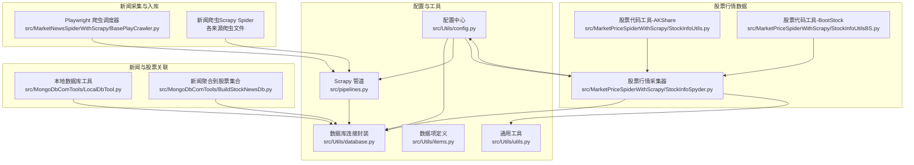
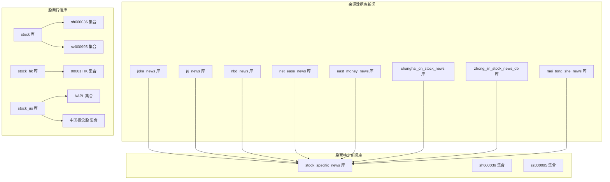
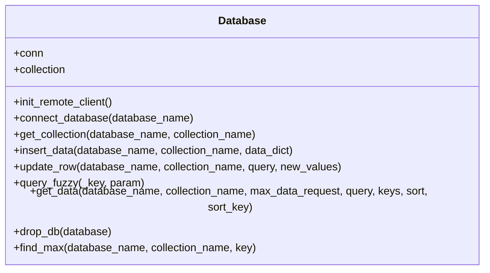
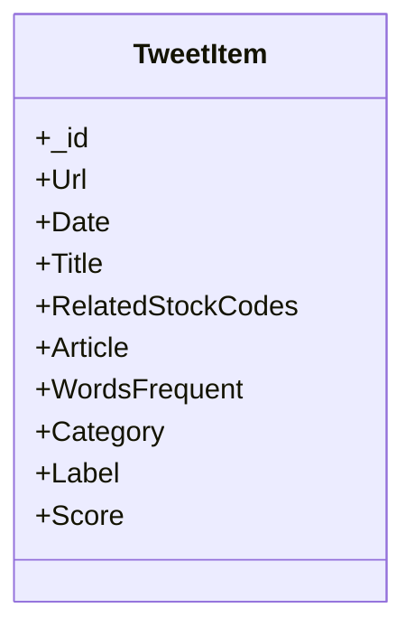
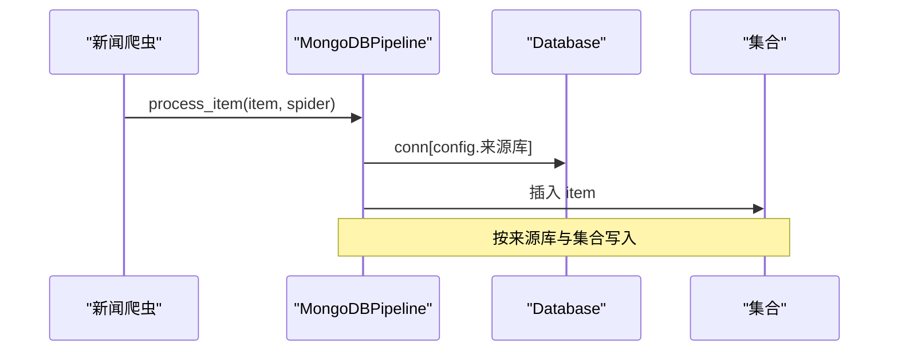
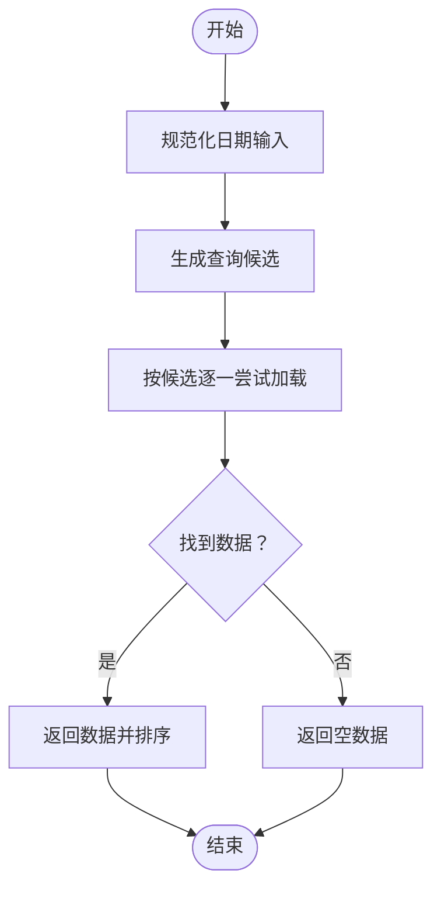
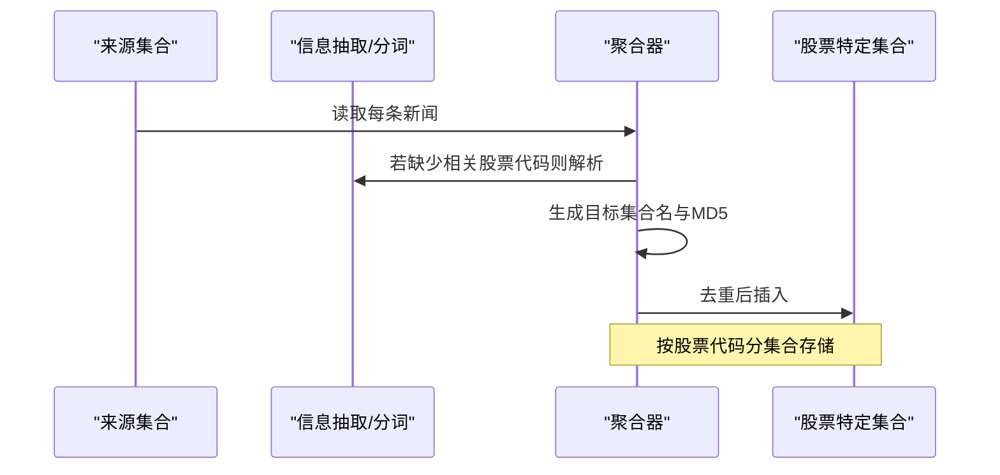
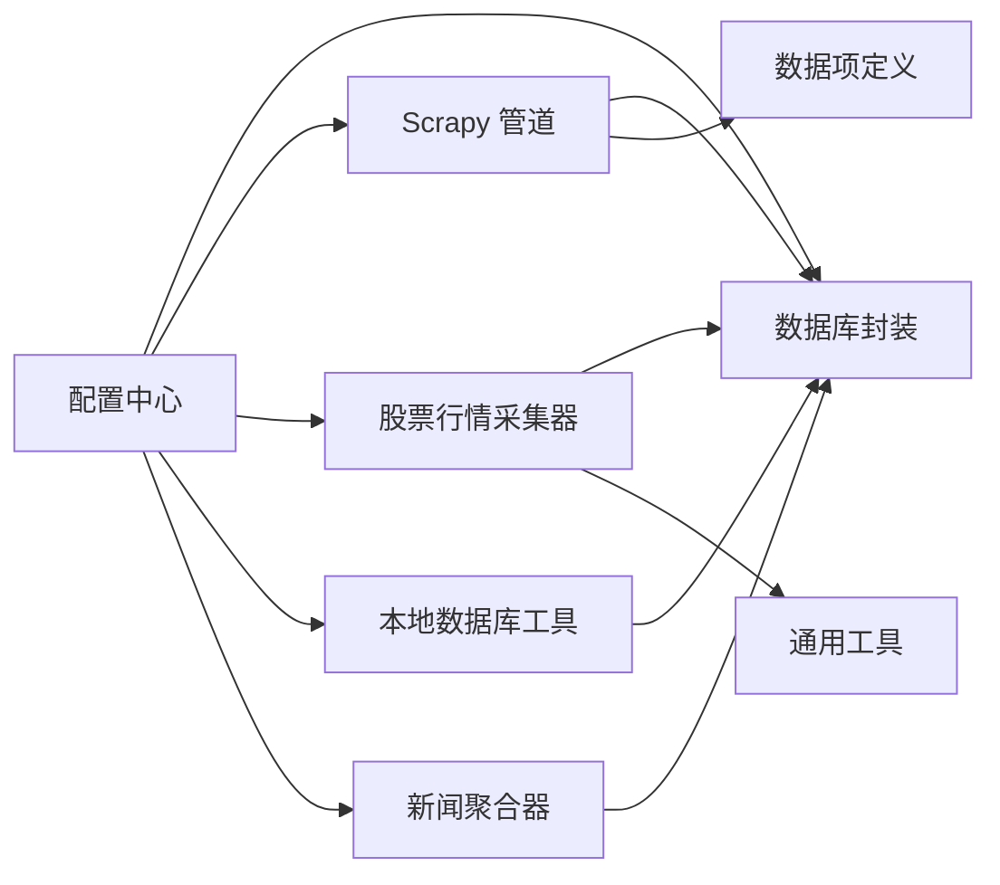

# 数据库架构设计

<cite>
**本文引用的文件**   
- [src/Utils/database.py](file://src/Utils/database.py)
- [src/Utils/items.py](file://src/Utils/items.py)
- [src/Utils/config.py](file://src/Utils/config.py)
- [src/Utils/utils.py](file://src/Utils/utils.py)
- [src/pipelines.py](file://src/pipelines.py)
- [src/MarketNewsSpiderWithScrapy/BasePlayCrawler.py](file://src/MarketNewsSpiderWithScrapy/BasePlayCrawler.py)
- [src/MarketPriceSpiderWithScrapy/StockInfoSpyder.py](file://src/MarketPriceSpiderWithScrapy/StockInfoSpyder.py)
- [src/MarketPriceSpiderWithScrapy/StockInfoUtils.py](file://src/MarketPriceSpiderWithScrapy/StockInfoUtils.py)
- [src/MarketPriceSpiderWithScrapy/StockInfoUtilsBS.py](file://src/MarketPriceSpiderWithScrapy/StockInfoUtilsBS.py)
- [src/MongoDbComTools/LocalDbTool.py](file://src/MongoDbComTools/LocalDbTool.py)
- [src/MongoDbComTools/BuildStockNewsDb.py](file://src/MongoDbComTools/BuildStockNewsDb.py)
</cite>

## 目录
1. [简介](#简介)
2. [项目结构](#项目结构)
3. [核心组件](#核心组件)
4. [架构总览](#架构总览)
5. [详细组件分析](#详细组件分析)
6. [依赖分析](#依赖分析)
7. [性能考量](#性能考量)
8. [故障排查指南](#故障排查指南)
9. [结论](#结论)
10. [附录](#附录)

## 简介
本文件面向数据库架构设计，系统性梳理该项目中基于 MongoDB 的数据组织与访问模式，覆盖以下主题：
- 整体设计理念与架构布局
- 集合（Collection）组织方式与按新闻来源的数据库设计思路
- 数据模型定义（重点：TweetItem、StockInfo 等核心结构）
- 数据库连接管理机制（连接池、连接复用、异常处理）
- 索引设计原则与性能优化建议
- 数据分区、分片策略与集群部署方案
- 实际配置示例与最佳实践

## 项目结构
该项目采用“功能模块+工具层”的分层组织方式，数据库相关能力主要集中在工具层与业务模块：
- 工具层：数据库连接封装、通用配置、通用工具
- 业务模块：新闻采集与入库（Scrapy 管道）、股票行情数据采集与入库、新闻与股票关联处理
- 数据组织：按来源数据库分库、按股票代码分集合；新闻按来源数据库分库，再按股票代码分集合

图表来源
- [src/Utils/config.py:1-455](file://src/Utils/config.py#L1-L455)
- [src/Utils/database.py:1-176](file://src/Utils/database.py#L1-L176)
- [src/pipelines.py:1-56](file://src/pipelines.py#L1-L56)
- [src/MarketNewsSpiderWithScrapy/BasePlayCrawler.py:1-120](file://src/MarketNewsSpiderWithScrapy/BasePlayCrawler.py#L1-L120)
- [src/MarketPriceSpiderWithScrapy/StockInfoSpyder.py:1-881](file://src/MarketPriceSpiderWithScrapy/StockInfoSpyder.py#L1-L881)
- [src/MongoDbComTools/LocalDbTool.py:1-288](file://src/MongoDbComTools/LocalDbTool.py#L1-L288)
- [src/MongoDbComTools/BuildStockNewsDb.py:1-241](file://src/MongoDbComTools/BuildStockNewsDb.py#L1-L241)

章节来源
- [src/Utils/config.py:1-455](file://src/Utils/config.py#L1-L455)
- [src/Utils/database.py:1-176](file://src/Utils/database.py#L1-L176)
- [src/pipelines.py:1-56](file://src/pipelines.py#L1-L56)
- [src/MarketNewsSpiderWithScrapy/BasePlayCrawler.py:1-120](file://src/MarketNewsSpiderWithScrapy/BasePlayCrawler.py#L1-L120)
- [src/MarketPriceSpiderWithScrapy/StockInfoSpyder.py:1-881](file://src/MarketPriceSpiderWithScrapy/StockInfoSpyder.py#L1-L881)
- [src/MongoDbComTools/LocalDbTool.py:1-288](file://src/MongoDbComTools/LocalDbTool.py#L1-L288)
- [src/MongoDbComTools/BuildStockNewsDb.py:1-241](file://src/MongoDbComTools/BuildStockNewsDb.py#L1-L241)

## 核心组件
- 数据库连接封装：统一初始化客户端、提供集合获取、查询、插入、更新等操作，并内置自动重连装饰器
- 配置中心：集中管理数据库地址、端口、各来源数据库与集合命名、模型路径等
- Scrapy 管道：按来源将采集到的新闻数据写入对应数据库/集合
- 股票行情采集器：批量拉取并入库股票行情数据，支持多市场（A/H/美中概）
- 新闻与股票关联：将新闻按涉及的股票代码拆分并写入“股票特定新闻”数据库，按股票代码分集合
- 本地数据库工具：提供跨市场行情查询、日期范围查询候选构造、数据排序与键选择等

章节来源
- [src/Utils/database.py:36-176](file://src/Utils/database.py#L36-L176)
- [src/Utils/config.py:39-50](file://src/Utils/config.py#L39-L50)
- [src/pipelines.py:8-56](file://src/pipelines.py#L8-L56)
- [src/MarketPriceSpiderWithScrapy/StockInfoSpyder.py:39-84](file://src/MarketPriceSpiderWithScrapy/StockInfoSpyder.py#L39-L84)
- [src/MongoDbComTools/BuildStockNewsDb.py:19-53](file://src/MongoDbComTools/BuildStockNewsDb.py#L19-L53)
- [src/MongoDbComTools/LocalDbTool.py:10-44](file://src/MongoDbComTools/LocalDbTool.py#L10-L44)

## 架构总览
整体架构围绕“来源数据库 + 股票代码集合”的双维度组织：
- 来源数据库：按新闻来源划分（如 jqka、jrj、nbd、net_ease、east_money、shanghai、zhong_jin、mei_tong_she）
- 股票数据库：按股票代码划分（如 000001.XSHE、sh600036、sz000995 等），用于存放某股票的新闻或行情
- 行情数据：按市场（cn/hk/us/us_zh）分库，集合名为股票代码，文档包含 OHLCV、金额等字段
- 新闻数据：按来源数据库分库，集合名为来源爬虫生成的数据表名，文档包含标题、URL、正文、相关股票代码等

图表来源
- [src/Utils/config.py:55-449](file://src/Utils/config.py#L55-L449)
- [src/pipelines.py:8-22](file://src/pipelines.py#L8-L22)
- [src/MarketNewsSpiderWithScrapy/StockInfoSpyder.py:44-75](file://src/MarketNewsSpiderWithScrapy/StockInfoSpyder.py#L44-L75)
- [src/MongoDbComTools/BuildStockNewsDb.py:62-83](file://src/MongoDbComTools/BuildStockNewsDb.py#L62-L83)

## 详细组件分析

### 数据库连接与管理
- 初始化：通过配置中心读取主机与端口，设置连接超时与最大连接池大小
- 客户端复用：单例持有 MongoClient，避免重复创建
- 自动重连：对查询函数使用装饰器进行指数回退重试
- 基础操作：提供集合获取、插入、更新、模糊查询、带键选择的查询、排序等

图表来源
- [src/Utils/database.py:36-176](file://src/Utils/database.py#L36-L176)

章节来源
- [src/Utils/database.py:36-176](file://src/Utils/database.py#L36-L176)
- [src/Utils/config.py:13-16](file://src/Utils/config.py#L13-L16)

### 数据模型定义
- TweetItem：用于新闻/推文类数据的字段集合，包含标识、URL、日期、标题、相关股票代码、正文、词频、类别、标签、分数等
- StockInfo：股票基础信息与行情数据的字段集合，包含代码、名称、集合命名等

图表来源
- [src/Utils/items.py:5-18](file://src/Utils/items.py#L5-L18)

章节来源
- [src/Utils/items.py:5-18](file://src/Utils/items.py#L5-L18)

### 集合组织与数据流
- 来源数据库与集合：Scrapy 管道根据爬虫名称将数据写入对应来源数据库与集合
- 股票特定新闻：将来源新闻中的“相关股票代码”解析后，按股票代码分集合写入“stock_specific_news”库
- 股票行情：按市场分库，集合名为股票代码，文档包含日期、开盘/收盘/最高/最低、成交量、金额等

图表来源
- [src/pipelines.py:25-46](file://src/pipelines.py#L25-L46)
- [src/Utils/config.py:55-449](file://src/Utils/config.py#L55-L449)

章节来源
- [src/pipelines.py:8-56](file://src/pipelines.py#L8-L56)
- [src/MarketNewsSpiderWithScrapy/StockInfoSpyder.py:44-75](file://src/MarketPriceSpiderWithScrapy/StockInfoSpyder.py#L44-L75)
- [src/MongoDbComTools/BuildStockNewsDb.py:67-134](file://src/MongoDbComTools/BuildStockNewsDb.py#L67-L134)

### 查询与日期范围处理
- 日期规范化：支持多种日期格式输入，统一生成候选查询条件
- 查询候选组合：根据起止日期生成多个查询条件，提高匹配率
- 数据加载：按候选条件依次尝试，成功即返回结果；支持键选择与排序

图表来源
- [src/MongoDbComTools/LocalDbTool.py:127-224](file://src/MongoDbComTools/LocalDbTool.py#L127-L224)

章节来源
- [src/MongoDbComTools/LocalDbTool.py:127-224](file://src/MongoDbComTools/LocalDbTool.py#L127-L224)

### 新闻到股票的聚合流程
- 解析来源集合键：若未包含“相关股票代码”，则通过分词工具更新
- 迭代来源数据：逐条提取相关股票代码，生成目标集合名（股票代码前缀）
- 去重与插入：以 MD5 作为文档 ID，避免重复；可选生成报告

图表来源
- [src/MongoDbComTools/BuildStockNewsDb.py:157-239](file://src/MongoDbComTools/BuildStockNewsDb.py#L157-L239)

章节来源
- [src/MongoDbComTools/BuildStockNewsDb.py:157-239](file://src/MongoDbComTools/BuildStockNewsDb.py#L157-L239)

## 依赖分析
- 组件耦合
  - 管道依赖配置中心与数据库封装
  - 股票行情采集器依赖配置中心、数据库封装与行情工具库
  - 本地数据库工具依赖数据库封装与配置中心
  - 新闻聚合器依赖数据库封装与配置中心
- 外部依赖
  - MongoDB 客户端（PyMongo）
  - Scrapy 生态（管道、调度器）
  - 第三方行情接口（AKShare、JoinQuant）

图表来源
- [src/Utils/config.py:1-455](file://src/Utils/config.py#L1-L455)
- [src/Utils/database.py:1-176](file://src/Utils/database.py#L1-L176)
- [src/pipelines.py:1-56](file://src/pipelines.py#L1-L56)
- [src/MarketPriceSpiderWithScrapy/StockInfoSpyder.py:1-881](file://src/MarketPriceSpiderWithScrapy/StockInfoSpyder.py#L1-L881)
- [src/MongoDbComTools/LocalDbTool.py:1-288](file://src/MongoDbComTools/LocalDbTool.py#L1-L288)
- [src/MongoDbComTools/BuildStockNewsDb.py:1-241](file://src/MongoDbComTools/BuildStockNewsDb.py#L1-L241)

章节来源
- [src/Utils/config.py:1-455](file://src/Utils/config.py#L1-L455)
- [src/Utils/database.py:1-176](file://src/Utils/database.py#L1-L176)
- [src/pipelines.py:1-56](file://src/pipelines.py#L1-L56)
- [src/MarketPriceSpiderWithScrapy/StockInfoSpyder.py:1-881](file://src/MarketPriceSpiderWithScrapy/StockInfoSpyder.py#L1-L881)
- [src/MongoDbComTools/LocalDbTool.py:1-288](file://src/MongoDbComTools/LocalDbTool.py#L1-L288)
- [src/MongoDbComTools/BuildStockNewsDb.py:1-241](file://src/MongoDbComTools/BuildStockNewsDb.py#L1-L241)

## 性能考量
- 连接池与复用
  - 使用较大的连接池上限，减少连接创建开销
  - 单例持有客户端，避免频繁初始化
- 自动重连与退避
  - 对查询函数启用自动重连装饰器，指数回退降低抖动
- 查询优化
  - 优先使用带索引的过滤字段（如日期、股票代码）
  - 使用键选择仅返回必要字段，减少网络与序列化开销
  - 对大结果集分批处理，避免一次性加载过多数据
- 写入优化
  - 使用 MD5 作为文档 ID，避免重复写入
  - 批量写入场景下考虑使用批量接口（如后续扩展）
- 分区与分片建议
  - 按时间分区：对行情集合按日期建立范围分区，便于归档与清理
  - 按业务域分片：来源新闻与股票特定新闻分库，降低热点冲突
  - 分片键选择：以“股票代码”或“日期”作为分片键，结合查询模式
- 集群部署
  - 主从复制：保障高可用与读扩展
  - 分片集群：水平扩展存储与计算，配合合适的分片键

## 故障排查指南
- 连接异常
  - 现象：连接中断、AutoReconnect 错误
  - 处理：检查网络与防火墙；确认连接池大小与超时配置；利用自动重连装饰器
- 写入冲突
  - 现象：重复插入触发去重
  - 处理：确保文档 ID 唯一（如 MD5）；在入库前先查询是否存在
- 查询为空
  - 现象：查询返回空
  - 处理：核对集合名与数据库名；检查键选择与过滤条件；确认数据是否已入库
- 日期范围问题
  - 现象：查询不到数据或范围不正确
  - 处理：使用日期规范化与候选生成逻辑，确保多种格式均被覆盖

章节来源
- [src/Utils/database.py:15-34](file://src/Utils/database.py#L15-L34)
- [src/pipelines.py:48-56](file://src/pipelines.py#L48-L56)
- [src/MongoDbComTools/LocalDbTool.py:127-224](file://src/MongoDbComTools/LocalDbTool.py#L127-L224)

## 结论
本项目采用“来源数据库 + 股票代码集合”的双维度组织，实现了新闻与行情数据的清晰分离与高效访问。通过统一的数据库封装、配置中心与管道机制，保证了数据采集与入库的一致性与可维护性。建议在生产环境中进一步完善索引策略、引入分片与集群部署，并持续优化查询与写入路径。

## 附录

### 数据库配置示例（摘自配置中心）
- 数据库地址与端口
  - 主机：本地回环或内网地址
  - 端口：默认 27017
- 来源数据库与集合命名
  - 新闻来源数据库：jqka、jrj、nbd、net_ease、east_money、shanghai、zhong_jin、mei_tong_she
  - 股票特定新闻库：stock_specific_news
  - 股票行情库：stock（A股）、stock_hk（港股）、stock_us（美股/中概）
- 模型与设备配置
  - LLM 模型路径与设备类型（GPU 或 CPU）

章节来源
- [src/Utils/config.py:13-16](file://src/Utils/config.py#L13-L16)
- [src/Utils/config.py:55-449](file://src/Utils/config.py#L55-L449)
- [src/Utils/config.py:452-455](file://src/Utils/config.py#L452-L455)

### 最佳实践清单
- 连接管理
  - 使用单例客户端与合理连接池上限
  - 对易断网场景启用自动重连与指数回退
- 数据建模
  - 为高频查询字段建立索引（如日期、股票代码）
  - 文档 ID 使用 MD5，避免重复写入
- 查询与写入
  - 优先使用键选择与投影，减少数据传输
  - 对大结果集分页或分批处理
- 部署与运维
  - 采用主从复制与分片集群
  - 按时间与业务域进行分区与分片
  - 定期监控慢查询与连接池使用情况