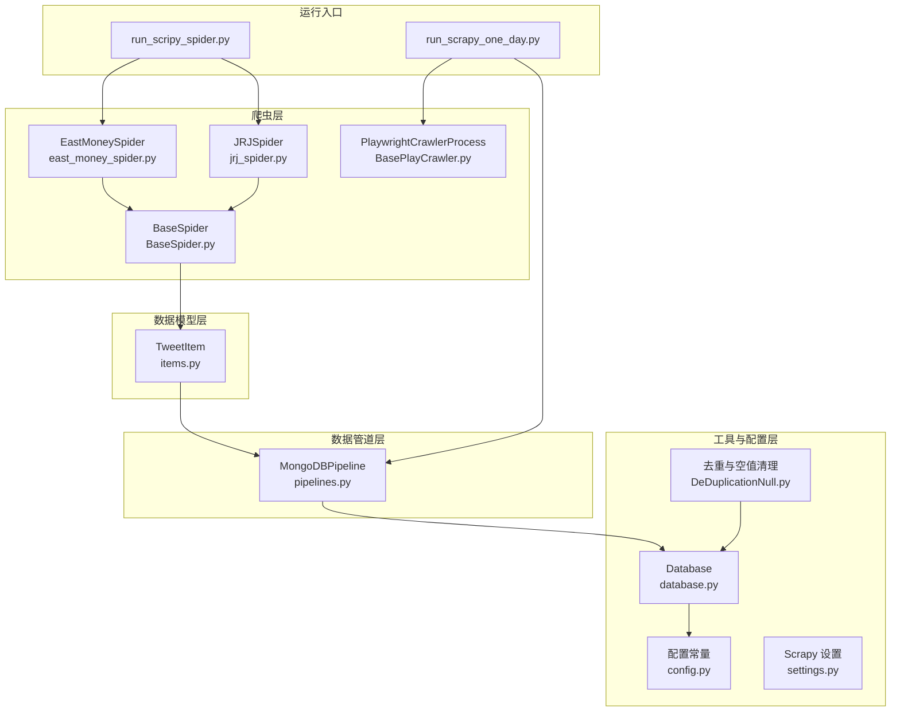
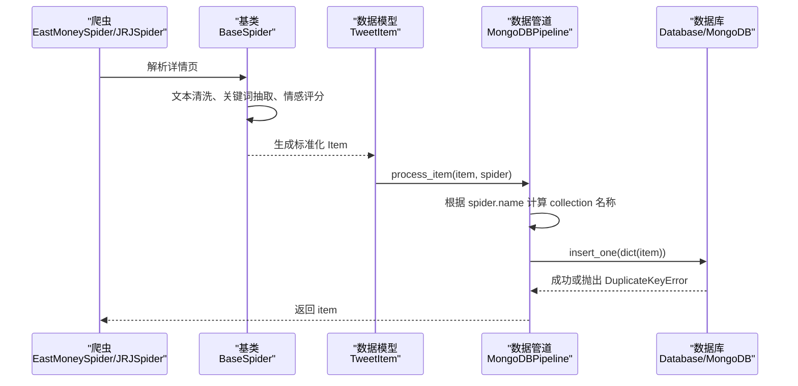
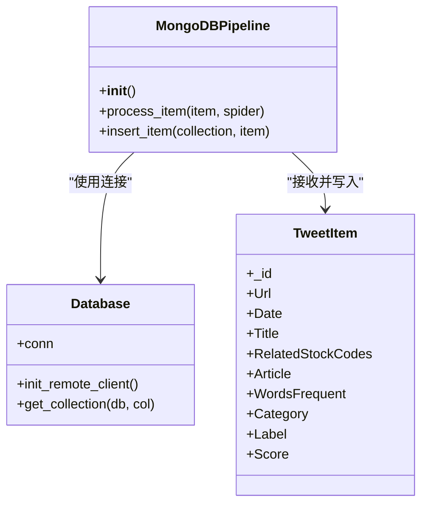
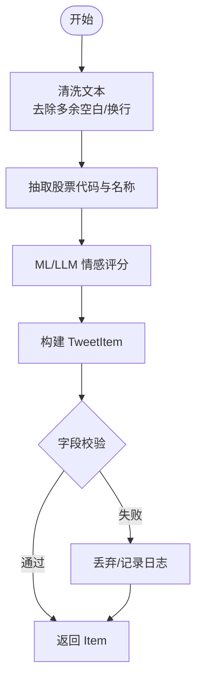
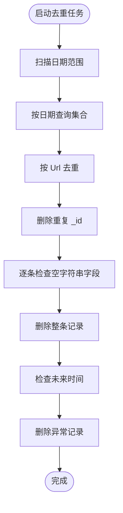
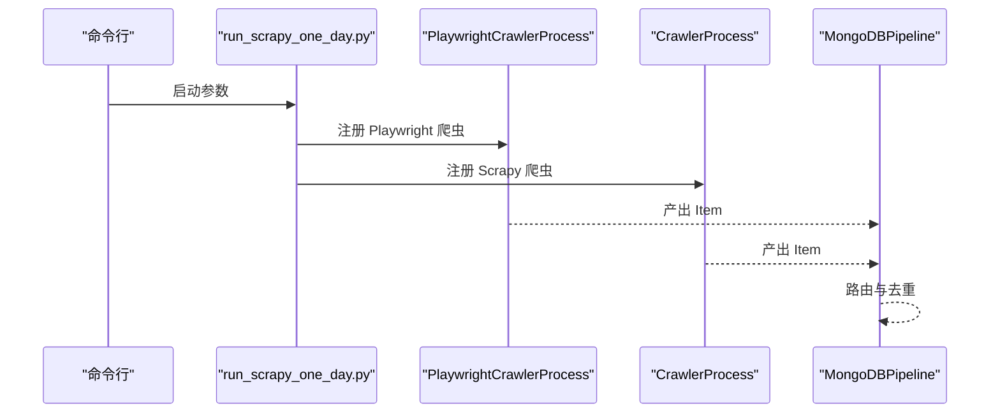
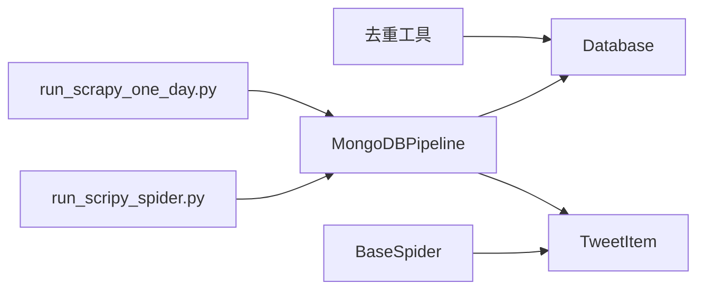

# 数据管道处理

<cite>
**本文引用的文件**
- [pipelines.py](file://src/pipelines.py)
- [settings.py](file://src/settings.py)
- [items.py](file://src/Utils/items.py)
- [DeDuplicationNull.py](file://src/MongoDbComTools/DeDuplicationNull.py)
- [database.py](file://src/Utils/database.py)
- [config.py](file://src/Utils/config.py)
- [BaseSpider.py](file://src/MarketNewsSpiderWithScrapy/BaseSpider.py)
- [BasePlayCrawler.py](file://src/MarketNewsSpiderWithScrapy/BasePlayCrawler.py)
- [east_money_spider.py](file://src/MarketNewsSpiderWithScrapy/east_money_spider.py)
- [jrj_spider.py](file://src/MarketNewsSpiderWithScrapy/jrj_spider.py)
- [run_scripy_spider.py](file://src/run_scripy_spider.py)
- [run_scrapy_one_day.py](file://src/run_scrapy_one_day.py)
</cite>

## 目录
1. [简介](#简介)
2. [项目结构](#项目结构)
3. [核心组件](#核心组件)
4. [架构总览](#架构总览)
5. [详细组件分析](#详细组件分析)
6. [依赖分析](#依赖分析)
7. [性能考虑](#性能考虑)
8. [故障排查指南](#故障排查指南)
9. [结论](#结论)
10. [附录](#附录)

## 简介
本技术文档围绕基于 Scrapy 的数据管道处理展开，系统性阐述从爬虫抓取、数据清洗与验证、到 MongoDB 存储与去重的完整流程。重点包括：
- 数据清洗与验证：空值处理、重复数据检测、数据格式标准化
- MongoDBPipeline 类的实现机制：数据路由、单条插入、异常处理
- 去重机制：DuplicateKeyError 异常处理与重复识别方法
- 数据质量控制：完整性检查与异常数据过滤
- 性能优化：批量操作、连接池管理、并发处理
- 实际配置示例与调试方法

## 项目结构
该项目采用模块化组织，数据管道主要由以下层次构成：
- 爬虫层：基于 Scrapy 和 Playwright 的多种来源爬虫
- 数据模型层：统一的 Item 定义
- 数据管道层：MongoDBPipeline 负责入库与去重
- 工具与配置层：数据库连接、配置常量、去重与空值清理工具
- 运行入口：集中调度多个爬虫并生成报告

**图示来源**
- [east_money_spider.py:1-78](file://src/MarketNewsSpiderWithScrapy/east_money_spider.py#L1-L78)
- [jrj_spider.py:1-94](file://src/MarketNewsSpiderWithScrapy/jrj_spider.py#L1-L94)
- [BaseSpider.py:1-149](file://src/MarketNewsSpiderWithScrapy/BaseSpider.py#L1-L149)
- [items.py:1-18](file://src/Utils/items.py#L1-L18)
- [pipelines.py:1-56](file://src/pipelines.py#L1-L56)
- [database.py:1-176](file://src/Utils/database.py#L1-L176)
- [config.py:1-455](file://src/Utils/config.py#L1-L455)
- [DeDuplicationNull.py:1-122](file://src/MongoDbComTools/DeDuplicationNull.py#L1-L122)
- [settings.py:1-49](file://src/settings.py#L1-L49)
- [run_scripy_spider.py:1-145](file://src/run_scripy_spider.py#L1-L145)
- [run_scrapy_one_day.py:1-195](file://src/run_scrapy_one_day.py#L1-L195)

**章节来源**
- [settings.py:1-49](file://src/settings.py#L1-L49)
- [config.py:1-455](file://src/Utils/config.py#L1-L455)

## 核心组件
- MongoDBPipeline：负责将 Item 路由到不同数据库与集合，并执行单条插入与去重处理
- TweetItem：统一的数据模型字段定义
- Database：封装 MongoDB 连接、自动重连、查询与插入等通用能力
- 去重与空值清理工具：按日期与 URL 去重、删除空字符串字段、修正未来时间等
- 爬虫基类与派生爬虫：统一清洗与评分逻辑，生成标准化 Item

**章节来源**
- [pipelines.py:8-56](file://src/pipelines.py#L8-L56)
- [items.py:5-18](file://src/Utils/items.py#L5-L18)
- [database.py:36-176](file://src/Utils/database.py#L36-L176)
- [DeDuplicationNull.py:15-122](file://src/MongoDbComTools/DeDuplicationNull.py#L15-L122)
- [BaseSpider.py:13-149](file://src/MarketNewsSpiderWithScrapy/BaseSpider.py#L13-L149)

## 架构总览
数据从各来源爬虫产出，经过 BaseSpider 的清洗与评分，生成 TweetItem；随后进入 Scrapy 数据管道，由 MongoDBPipeline 路由到对应的数据库与集合，最终写入 MongoDB。同时，独立工具可对历史数据进行去重与空值清理。

**图示来源**
- [east_money_spider.py:21-78](file://src/MarketNewsSpiderWithScrapy/east_money_spider.py#L21-L78)
- [jrj_spider.py:51-94](file://src/MarketNewsSpiderWithScrapy/jrj_spider.py#L51-L94)
- [BaseSpider.py:41-146](file://src/MarketNewsSpiderWithScrapy/BaseSpider.py#L41-L146)
- [items.py:5-18](file://src/Utils/items.py#L5-L18)
- [pipelines.py:25-56](file://src/pipelines.py#L25-L56)
- [database.py:78-81](file://src/Utils/database.py#L78-L81)

## 详细组件分析

### MongoDBPipeline 类实现机制
- 数据路由
  - 通过 spider.name 推导 collection 名称（将 spider 名称中的 “spider” 替换为 “data”），并映射到预设的数据库名常量
  - 支持多个来源：jrj、jqka、nbd、net_ease、east_money、shanghai、zhong_jin、mei_tong
- 单条插入
  - 使用 insert_one(dict(item)) 进行单条写入
  - 捕获 DuplicateKeyError 并静默忽略，避免重复数据导致中断
- 错误处理策略
  - 未捕获的异常会冒泡至 Scrapy，影响后续流程；建议在生产环境补充更完善的日志与重试策略

**图示来源**
- [pipelines.py:8-56](file://src/pipelines.py#L8-L56)
- [database.py:36-61](file://src/Utils/database.py#L36-L61)
- [items.py:5-18](file://src/Utils/items.py#L5-L18)

**章节来源**
- [pipelines.py:25-56](file://src/pipelines.py#L25-L56)

### 数据清洗、验证与转换
- 文本清洗
  - 移除全角空格、回车符，合并多余空白，统一段落格式
- 关键词抽取与情感评分
  - 从文章中抽取股票名称与代码，结合 ML 与 LLM 模型输出标签与分数
- 标识符生成
  - 使用 URL 的 MD5 作为 _id，确保唯一性并支持去重
- 字段标准化
  - 统一日期、标题、URL、正文、分类、标签、分数等字段

**图示来源**
- [BaseSpider.py:41-146](file://src/MarketNewsSpiderWithScrapy/BaseSpider.py#L41-L146)

**章节来源**
- [BaseSpider.py:41-146](file://src/MarketNewsSpiderWithScrapy/BaseSpider.py#L41-L146)

### 数据去重机制
- DuplicateKeyError 异常处理
  - 在 insert_one 时捕获 DuplicateKeyError，避免重复数据入库中断
- 历史数据去重
  - 按日期范围扫描，基于 URL 去重，删除重复 _id
  - 删除空字符串字段的整条记录
  - 过滤未来时间的异常数据

**图示来源**
- [DeDuplicationNull.py:22-62](file://src/MongoDbComTools/DeDuplicationNull.py#L22-L62)
- [DeDuplicationNull.py:72-88](file://src/MongoDbComTools/DeDuplicationNull.py#L72-L88)
- [DeDuplicationNull.py:99-113](file://src/MongoDbComTools/DeDuplicationNull.py#L99-L113)

**章节来源**
- [DeDuplicationNull.py:15-122](file://src/MongoDbComTools/DeDuplicationNull.py#L15-L122)

### 数据质量控制
- 完整性检查
  - 通过空值清理工具删除缺失关键字段的记录
- 异常数据过滤
  - 基于日期范围与正则匹配定位异常
  - 删除未来时间与无效时间的记录
- 日志与监控
  - 使用 logging 输出关键步骤与错误信息，便于问题定位

**章节来源**
- [DeDuplicationNull.py:72-88](file://src/MongoDbComTools/DeDuplicationNull.py#L72-L88)
- [DeDuplicationNull.py:99-113](file://src/MongoDbComTools/DeDuplicationNull.py#L99-L113)

### 数据管道运行与调度
- 多来源爬虫调度
  - run_scripy_spider.py：集中注册与启动多个来源的爬虫
  - run_scrapy_one_day.py：支持 Playwright 与 Scrapy 双通道，生成汇总报告
- 配置与常量
  - settings.py：设置并发、下载延迟、中间件与管道
  - config.py：定义数据库名、爬虫配置、模型路径等

**图示来源**
- [run_scrapy_one_day.py:32-80](file://src/run_scrapy_one_day.py#L32-L80)
- [run_scripy_spider.py:117-142](file://src/run_scripy_spider.py#L117-L142)
- [settings.py:32-34](file://src/settings.py#L32-L34)
- [config.py:55-450](file://src/Utils/config.py#L55-L450)

**章节来源**
- [run_scrapy_one_day.py:32-195](file://src/run_scrapy_one_day.py#L32-L195)
- [run_scripy_spider.py:117-145](file://src/run_scripy_spider.py#L117-L145)
- [settings.py:32-34](file://src/settings.py#L32-L34)
- [config.py:55-450](file://src/Utils/config.py#L55-L450)

## 依赖分析
- 组件耦合
  - MongoDBPipeline 依赖 Database 提供的连接与集合访问
  - 爬虫依赖 BaseSpider 的清洗与评分逻辑，统一生成 TweetItem
  - 去重工具依赖 Database 查询与删除能力
- 外部依赖
  - MongoDB：pymongo、连接池与自动重连
  - Scrapy/Playwright：异步爬取与请求处理
  - 日志：Python logging

**图示来源**
- [pipelines.py:8-56](file://src/pipelines.py#L8-L56)
- [database.py:36-176](file://src/Utils/database.py#L36-L176)
- [BaseSpider.py:13-149](file://src/MarketNewsSpiderWithScrapy/BaseSpider.py#L13-L149)
- [DeDuplicationNull.py:15-122](file://src/MongoDbComTools/DeDuplicationNull.py#L15-L122)
- [run_scripy_spider.py:117-145](file://src/run_scripy_spider.py#L117-L145)
- [run_scrapy_one_day.py:32-80](file://src/run_scrapy_one_day.py#L32-L80)

**章节来源**
- [pipelines.py:8-56](file://src/pipelines.py#L8-L56)
- [database.py:36-176](file://src/Utils/database.py#L36-L176)
- [BaseSpider.py:13-149](file://src/MarketNewsSpiderWithScrapy/BaseSpider.py#L13-L149)
- [DeDuplicationNull.py:15-122](file://src/MongoDbComTools/DeDuplicationNull.py#L15-L122)
- [run_scripy_spider.py:117-145](file://src/run_scripy_spider.py#L117-L145)
- [run_scrapy_one_day.py:32-80](file://src/run_scrapy_one_day.py#L32-L80)

## 性能考虑
- 连接池管理
  - Database 初始化时设置最大连接池大小，减少连接开销
  - 自动重连装饰器在网络抖动时提升稳定性
- 并发与延迟
  - settings 中设置 CONCURRENT_REQUESTS、DOWNLOAD_DELAY 控制并发与速率
- 批量操作建议
  - 当前使用 insert_one 单条插入；在高吞吐场景可考虑批量写入（如 insert_many）并配合事务与错误收集
- 网络与超时
  - DOWNLOADER_MIDDLEWARES 中禁用不必要的中间件，减少额外开销
- 日志级别
  - 生产环境建议降低日志级别，避免频繁 I/O 影响性能

**章节来源**
- [database.py:50-60](file://src/Utils/database.py#L50-L60)
- [database.py:15-33](file://src/Utils/database.py#L15-L33)
- [settings.py:18-30](file://src/settings.py#L18-L30)

## 故障排查指南
- DuplicateKeyError
  - 现象：重复主键导致插入失败
  - 处理：MongoDBPipeline 已捕获并忽略；若需记录可增加日志
- 插入失败或超时
  - 检查 MongoDB 连接、认证与网络；确认 Database 的自动重连装饰器生效
- 空值或异常数据
  - 使用 DeDuplicationNull 的空值清理与未来时间过滤功能
- 爬虫解析异常
  - 检查 BaseSpider 的清洗与解析逻辑，确保字段存在且格式正确
- 调试方法
  - 增加 logging 输出，定位具体步骤
  - 分批运行爬虫，缩小问题范围
  - 使用 run_scrapy_one_day.py 的报告生成功能核对入库结果

**章节来源**
- [pipelines.py:53-56](file://src/pipelines.py#L53-L56)
- [database.py:15-33](file://src/Utils/database.py#L15-L33)
- [DeDuplicationNull.py:72-88](file://src/MongoDbComTools/DeDuplicationNull.py#L72-L88)
- [DeDuplicationNull.py:99-113](file://src/MongoDbComTools/DeDuplicationNull.py#L99-L113)
- [BaseSpider.py:41-146](file://src/MarketNewsSpiderWithScrapy/BaseSpider.py#L41-L146)
- [run_scrapy_one_day.py:81-195](file://src/run_scrapy_one_day.py#L81-L195)

## 结论
该数据管道以 Scrapy 为核心，结合 Playwright 实现多源异构数据采集，通过统一的 Item 模型与 MongoDBPipeline 完成数据清洗、验证与入库。DuplicateKeyError 的捕获与历史数据去重工具共同保障了入库的稳定与一致性。建议在高并发场景引入批量写入与更细粒度的日志与监控，以进一步提升性能与可观测性。

## 附录
- 配置示例要点
  - ITEM_PIPELINES：启用 MongoDBPipeline
  - CONCURRENT_REQUESTS、DOWNLOAD_DELAY：平衡吞吐与稳定性
  - DOWNLOADER_MIDDLEWARES：按需启用代理与禁用冗余中间件
- 调试建议
  - 使用 run_scripy_spider.py 或 run_scrapy_one_day.py 的参数控制运行范围
  - 逐步注释与启用爬虫，定位问题来源
  - 通过 DeDuplicationNull 工具定期清理历史脏数据