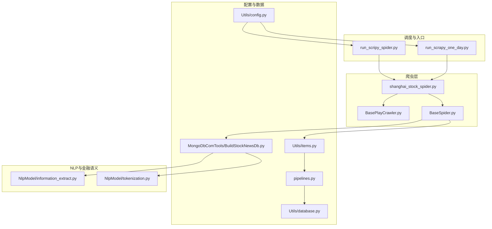
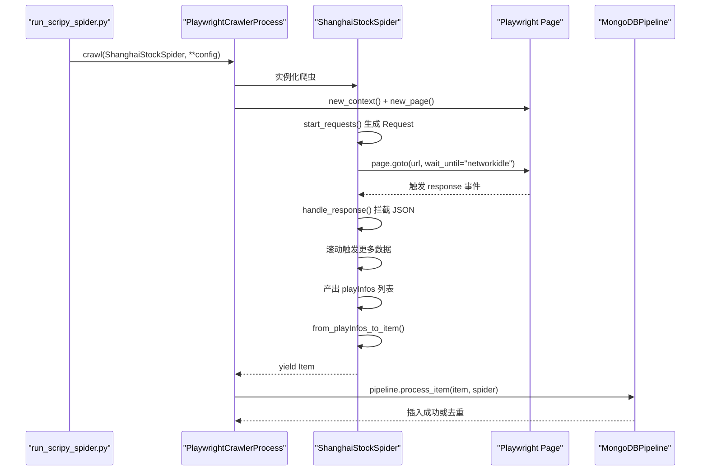
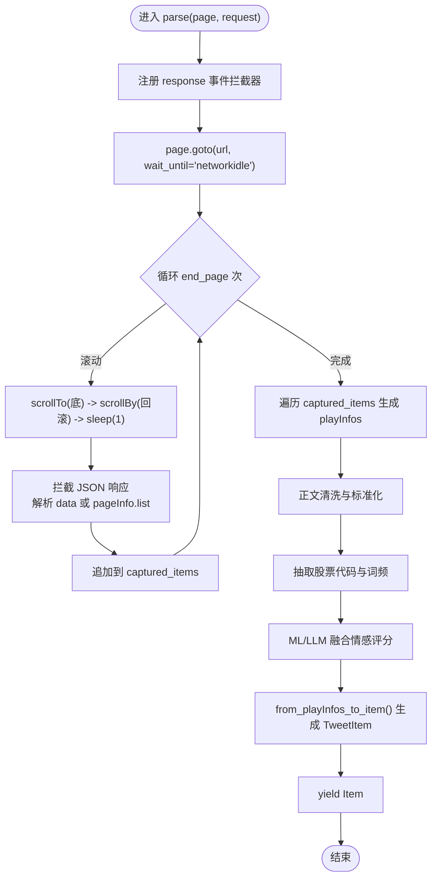
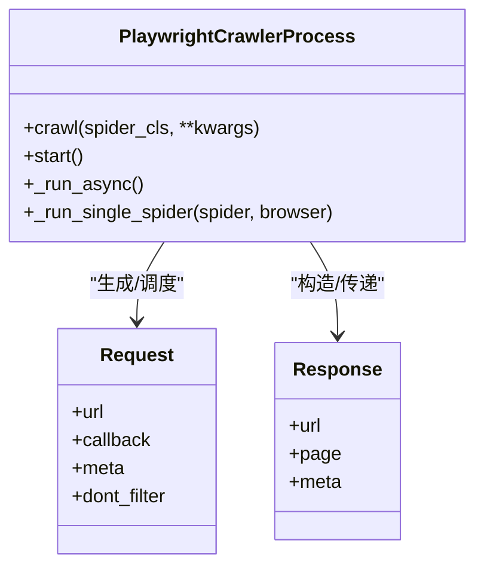
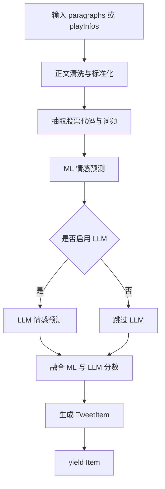
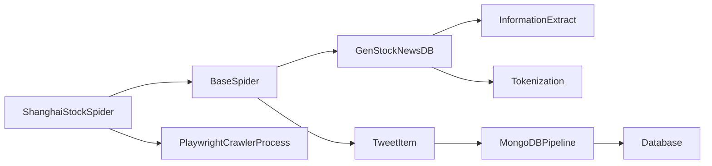

# 上海证券报爬虫

<cite>
**本文引用的文件**
- [shanghai_stock_spider.py](file://src/MarketNewsSpiderWithScrapy/shanghai_stock_spider.py)
- [BasePlayCrawler.py](file://src/MarketNewsSpiderWithScrapy/BasePlayCrawler.py)
- [BaseSpider.py](file://src/MarketNewsSpiderWithScrapy/BaseSpider.py)
- [run_scripy_spider.py](file://src/run_scripy_spider.py)
- [run_scrapy_one_day.py](file://src/run_scrapy_one_day.py)
- [config.py](file://src/Utils/config.py)
- [items.py](file://src/Utils/items.py)
- [pipelines.py](file://src/pipelines.py)
- [BuildStockNewsDb.py](file://src/MongoDbComTools/BuildStockNewsDb.py)
- [database.py](file://src/Utils/database.py)
- [information_extract.py](file://src/NlpModel/information_extract.py)
- [tokenization.py](file://src/NlpModel/tokenization.py)
- [README.md](file://README.md)
</cite>

## 目录
1. [引言](#引言)
2. [项目结构](#项目结构)
3. [核心组件](#核心组件)
4. [架构总览](#架构总览)
5. [详细组件分析](#详细组件分析)
6. [依赖关系分析](#依赖关系分析)
7. [性能考量](#性能考量)
8. [故障排查指南](#故障排查指南)
9. [结论](#结论)
10. [附录](#附录)

## 引言
本技术文档面向上海证券报（上证报）爬虫实现，系统性阐述其在金融新闻网站结构下的解析策略、异步页面加载与AJAX拦截、元素选择器技巧、详情页正文提取机制、专业术语与金融概念处理、与BasePlayCrawler的集成方式、自定义爬取策略、以及反爬虫应对策略与最佳实践。文档同时给出可追溯的源码路径，帮助读者快速定位实现细节。

## 项目结构
项目采用模块化组织，围绕“Scrapy + Playwright”的异步爬虫体系构建，涵盖多个新闻源的统一调度与入库流程。上证报相关入口位于 MarketNewsSpiderWithScrapy 目录，配置集中于 Utils/config.py，数据模型与管道位于 Utils/items.py 与 pipelines.py，NLP与金融情感分析位于 NlpModel 与 MongoDbComTools。

图表来源
- [run_scripy_spider.py:117-142](file://src/run_scripy_spider.py#L117-L142)
- [run_scrapy_one_day.py:43-59](file://src/run_scrapy_one_day.py#L43-L59)
- [shanghai_stock_spider.py:6-14](file://src/MarketNewsSpiderWithScrapy/shanghai_stock_spider.py#L6-L14)
- [BasePlayCrawler.py:27-33](file://src/MarketNewsSpiderWithScrapy/BasePlayCrawler.py#L27-L33)
- [BaseSpider.py:13-33](file://src/MarketNewsSpiderWithScrapy/BaseSpider.py#L13-L33)
- [config.py:266-314](file://src/Utils/config.py#L266-L314)
- [items.py:5-18](file://src/Utils/items.py#L5-L18)
- [pipelines.py:8-46](file://src/pipelines.py#L8-L46)
- [database.py:36-60](file://src/Utils/database.py#L36-L60)
- [BuildStockNewsDb.py:19-53](file://src/MongoDbComTools/BuildStockNewsDb.py#L19-L53)
- [information_extract.py:26-60](file://src/NlpModel/information_extract.py#L26-L60)
- [tokenization.py:11-24](file://src/NlpModel/tokenization.py#L11-L24)

章节来源
- [README.md:1-33](file://README.md#L1-L33)
- [run_scripy_spider.py:117-142](file://src/run_scripy_spider.py#L117-L142)
- [run_scrapy_one_day.py:43-59](file://src/run_scrapy_one_day.py#L43-L59)
- [config.py:266-314](file://src/Utils/config.py#L266-L314)

## 核心组件
- 上证报爬虫实现：ShanghaiStockSpider，继承自BaseSpider，使用Playwright异步解析，注册AJAX拦截器，滚动加载更多，解析JSON数据并产出标准Item。
- 基础爬虫框架：BaseSpider封装了通用的正文清洗、股票代码与关键词抽取、ML/LLM情感融合评分、以及从playInfos到Item的转换。
- 异步调度器：PlaywrightCrawlerProcess负责并发启动Playwright浏览器、为每个爬虫分配独立Context、统一调度回调与入库。
- 数据模型与管道：TweetItem作为统一数据结构，MongoDBPipeline按爬虫名映射到不同数据库集合，避免重复写入。
- NLP与金融语义：InformationExtract与Tokenization负责金融文本的特征提取、股票代码识别、情感建模与融合评分。

章节来源
- [shanghai_stock_spider.py:6-60](file://src/MarketNewsSpiderWithScrapy/shanghai_stock_spider.py#L6-L60)
- [BaseSpider.py:13-149](file://src/MarketNewsSpiderWithScrapy/BaseSpider.py#L13-L149)
- [BasePlayCrawler.py:21-120](file://src/MarketNewsSpiderWithScrapy/BasePlayCrawler.py#L21-L120)
- [items.py:5-18](file://src/Utils/items.py#L5-L18)
- [pipelines.py:8-56](file://src/pipelines.py#L8-L56)
- [BuildStockNewsDb.py:19-53](file://src/MongoDbComTools/BuildStockNewsDb.py#L19-L53)
- [information_extract.py:26-60](file://src/NlpModel/information_extract.py#L26-L60)
- [tokenization.py:11-103](file://src/NlpModel/tokenization.py#L11-L103)

## 架构总览
上证报爬虫属于“Playwright + BasePlayCrawler + BaseSpider + NLP + Pipeline”的异步流水线。入口脚本根据配置批量启动多个爬虫实例，每个实例独立创建浏览器上下文，解析目标站点的异步内容，抽取新闻列表项，再进行正文清洗与金融语义标注，最终写入MongoDB。

图表来源
- [run_scripy_spider.py:90-96](file://src/run_scripy_spider.py#L90-L96)
- [BasePlayCrawler.py:41-118](file://src/MarketNewsSpiderWithScrapy/BasePlayCrawler.py#L41-L118)
- [shanghai_stock_spider.py:13-59](file://src/MarketNewsSpiderWithScrapy/shanghai_stock_spider.py#L13-L59)
- [pipelines.py:25-46](file://src/pipelines.py#L25-L46)

## 详细组件分析

### 组件A：ShanghaiStockSpider（上证报爬虫）
- 继承关系：继承BaseSpider，复用通用的正文清洗、股票代码抽取、情感评分与Item转换。
- 异步解析：使用Playwright page.goto等待网络空闲，注册response事件拦截AJAX返回的JSON数据，解析data/pageInfo节点的list字段，累积到captured_items。
- 滚动加载：循环滚动至底部并轻微回滚，触发懒加载接口，等待响应拦截，控制sleep间隔确保数据拦截。
- 时间格式处理：从shareInfo.dateInfo提取年、月、日、时、分，若缺失则回退到当天日期；最终拼接为“YYYY-MM-DD HH:MM”。
- 标准化产出：将标题、URL、摘要、发布时间、来源组装为playInfos，调用from_playInfos_to_item生成TweetItem并yield。

图表来源
- [shanghai_stock_spider.py:16-59](file://src/MarketNewsSpiderWithScrapy/shanghai_stock_spider.py#L16-L59)

章节来源
- [shanghai_stock_spider.py:6-60](file://src/MarketNewsSpiderWithScrapy/shanghai_stock_spider.py#L6-L60)

### 组件B：BasePlayCrawler（异步调度与回调）
- Request/Response模拟：提供与Scrapy兼容的Request/Response对象，适配不同爬虫类型。
- 并发执行：PlaywrightCrawlerProcess统一启动浏览器，为每个爬虫创建独立Context，避免Cookie干扰并节省资源；并发gather所有任务。
- 回调调度：对非“shanghai/jqka/mei_tong”类爬虫，先goto再回调；对特定爬虫传入page对象直接调用parse。
- 入库与计数：回调生成的字典或Item交由MongoDBPipeline处理，自动去重并统计抓取数量。

图表来源
- [BasePlayCrawler.py:21-120](file://src/MarketNewsSpiderWithScrapy/BasePlayCrawler.py#L21-L120)

章节来源
- [BasePlayCrawler.py:21-120](file://src/MarketNewsSpiderWithScrapy/BasePlayCrawler.py#L21-L120)

### 组件C：BaseSpider（通用正文清洗与情感评分）
- 正文清洗：将段落p标签展开、去除全角空格与换行、合并为单行文本，保留必要空白。
- 股票代码抽取：基于词典匹配与切词统计，输出股票代码与词频JSON。
- 情感评分：ML模型与LLM模型融合打分，综合结果决定Label与Score。
- Item生成：统一字段包括_id、Url、Date、Title、RelatedStockCodes、Article、WordsFrequent、Category、Label、Score。

图表来源
- [BaseSpider.py:41-146](file://src/MarketNewsSpiderWithScrapy/BaseSpider.py#L41-L146)

章节来源
- [BaseSpider.py:41-146](file://src/MarketNewsSpiderWithScrapy/BaseSpider.py#L41-L146)

### 组件D：配置与入口（上证报特有分类与时间格式）
- 分类与URL：上证报包含“公司聚集”“公告解读”“公告快讯”“产业聚焦”等频道，分别对应不同的start_url与end_page。
- 时间格式：parse中对shareInfo.dateInfo进行容错处理，缺失字段回退到当前日期，最终统一为“YYYY-MM-DD HH:MM”。

章节来源
- [config.py:266-314](file://src/Utils/config.py#L266-L314)
- [shanghai_stock_spider.py:38-49](file://src/MarketNewsSpiderWithScrapy/shanghai_stock_spider.py#L38-L49)

### 组件E：数据模型与入库（MongoDBPipeline）
- 字段结构：TweetItem包含_id、Url、Date、Title、RelatedStockCodes、Article、WordsFrequent、Category、Label、Score。
- 集合映射：根据spider.name前缀映射到不同数据库集合，避免冲突。
- 去重策略：insert_one时捕获DuplicateKeyError，忽略重复记录。

章节来源
- [items.py:5-18](file://src/Utils/items.py#L5-L18)
- [pipelines.py:8-56](file://src/pipelines.py#L8-L56)

### 组件F：NLP与金融语义（InformationExtract/Tokenization）
- 金融词典与停用词：jieba加载用户词典与停用词，提升金融文本切词质量。
- 股票代码识别：直接在原文中检索股票名称，结合切词统计输出代码与词频。
- 情感建模：加载预训练模型与TF-IDF向量，支持二分类情感预测与规则标签融合。

章节来源
- [BuildStockNewsDb.py:19-53](file://src/MongoDbComTools/BuildStockNewsDb.py#L19-L53)
- [information_extract.py:26-60](file://src/NlpModel/information_extract.py#L26-L60)
- [tokenization.py:11-103](file://src/NlpModel/tokenization.py#L11-L103)

## 依赖关系分析
- 上证报爬虫依赖BaseSpider提供的通用正文清洗与情感评分能力。
- BaseSpider依赖GenStockNewsDB（含InformationExtract与Tokenization）进行金融语义处理。
- 入库依赖MongoDBPipeline与Database，后者提供自动重连与连接池配置。
- 调度依赖PlaywrightCrawlerProcess，统一管理浏览器生命周期与并发。

图表来源
- [shanghai_stock_spider.py:6-10](file://src/MarketNewsSpiderWithScrapy/shanghai_stock_spider.py#L6-L10)
- [BaseSpider.py:13-33](file://src/MarketNewsSpiderWithScrapy/BaseSpider.py#L13-L33)
- [BuildStockNewsDb.py:19-53](file://src/MongoDbComTools/BuildStockNewsDb.py#L19-L53)
- [pipelines.py:8-22](file://src/pipelines.py#L8-L22)
- [database.py:36-60](file://src/Utils/database.py#L36-L60)
- [BasePlayCrawler.py:21-33](file://src/MarketNewsSpiderWithScrapy/BasePlayCrawler.py#L21-L33)

章节来源
- [shanghai_stock_spider.py:6-10](file://src/MarketNewsSpiderWithScrapy/shanghai_stock_spider.py#L6-L10)
- [BaseSpider.py:13-33](file://src/MarketNewsSpiderWithScrapy/BaseSpider.py#L13-L33)
- [pipelines.py:8-22](file://src/pipelines.py#L8-L22)
- [database.py:36-60](file://src/Utils/database.py#L36-L60)
- [BasePlayCrawler.py:21-33](file://src/MarketNewsSpiderWithScrapy/BasePlayCrawler.py#L21-L33)

## 性能考量
- 并发与上下文隔离：PlaywrightCrawlerProcess为每个爬虫创建独立Context，减少Cookie干扰并提升稳定性。
- 网络等待策略：使用wait_until="networkidle"确保AJAX数据加载完成，避免过早解析导致遗漏。
- 滚动触发策略：通过scrollTo+scrollBy+sleep组合触发懒加载接口，平衡速度与可靠性。
- 数据清洗与去重：统一的正文清洗与MongoDB去重，降低无效数据入库成本。
- LLM评分可选：当LLM模型路径未配置时，仅使用ML模型，减少延迟。

章节来源
- [BasePlayCrawler.py:41-62](file://src/MarketNewsSpiderWithScrapy/BasePlayCrawler.py#L41-L62)
- [shanghai_stock_spider.py:29-35](file://src/MarketNewsSpiderWithScrapy/shanghai_stock_spider.py#L29-L35)
- [pipelines.py:48-56](file://src/pipelines.py#L48-L56)
- [BuildStockNewsDb.py:46-52](file://src/MongoDbComTools/BuildStockNewsDb.py#L46-L52)

## 故障排查指南
- 页面未加载完整：确认wait_until设置为"networkidle"，并检查AJAX拦截器是否正确注册。
- 懒加载数据缺失：适当增加滚动次数与sleep间隔，确保接口响应被拦截。
- 时间字段异常：检查shareInfo.dateInfo字段是否存在，缺失时回退到当前日期。
- 入库重复：MongoDBPipeline已内置去重，若仍出现重复，检查_id生成逻辑与集合索引。
- LLM不可用：若LLM路径未配置，系统会自动降级为纯ML模型；可在配置中启用LLM并检查设备类型。

章节来源
- [shanghai_stock_spider.py:18-28](file://src/MarketNewsSpiderWithScrapy/shanghai_stock_spider.py#L18-L28)
- [shanghai_stock_spider.py:42-49](file://src/MarketNewsSpiderWithScrapy/shanghai_stock_spider.py#L42-L49)
- [pipelines.py:48-56](file://src/pipelines.py#L48-L56)
- [BuildStockNewsDb.py:46-52](file://src/MongoDbComTools/BuildStockNewsDb.py#L46-L52)

## 结论
上证报爬虫通过Playwright异步解析与AJAX拦截，结合BaseSpider的通用清洗与金融语义处理，实现了对上证报多频道新闻的稳定抓取与入库。其架构具备良好的扩展性与可维护性，适合在其他金融新闻源中复用与定制。

## 附录
- 入口脚本：run_scripy_spider.py与run_scrapy_one_day.py分别用于批量与每日调度。
- 配置中心：Utils/config.py集中管理各站点的分类、URL与分页策略。
- 数据库连接：Utils/database.py提供自动重连与连接池配置，保障高并发稳定性。

章节来源
- [run_scripy_spider.py:90-96](file://src/run_scripy_spider.py#L90-L96)
- [run_scrapy_one_day.py:43-59](file://src/run_scrapy_one_day.py#L43-L59)
- [config.py:266-314](file://src/Utils/config.py#L266-L314)
- [database.py:36-60](file://src/Utils/database.py#L36-L60)