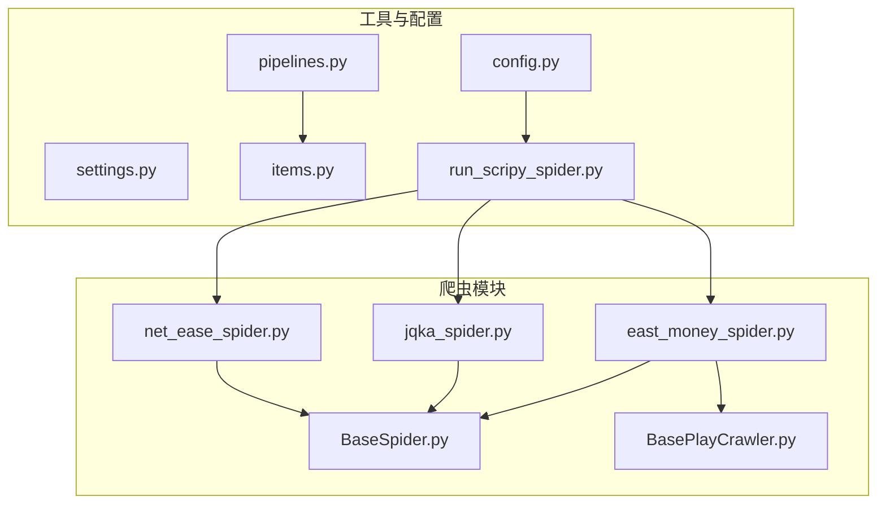
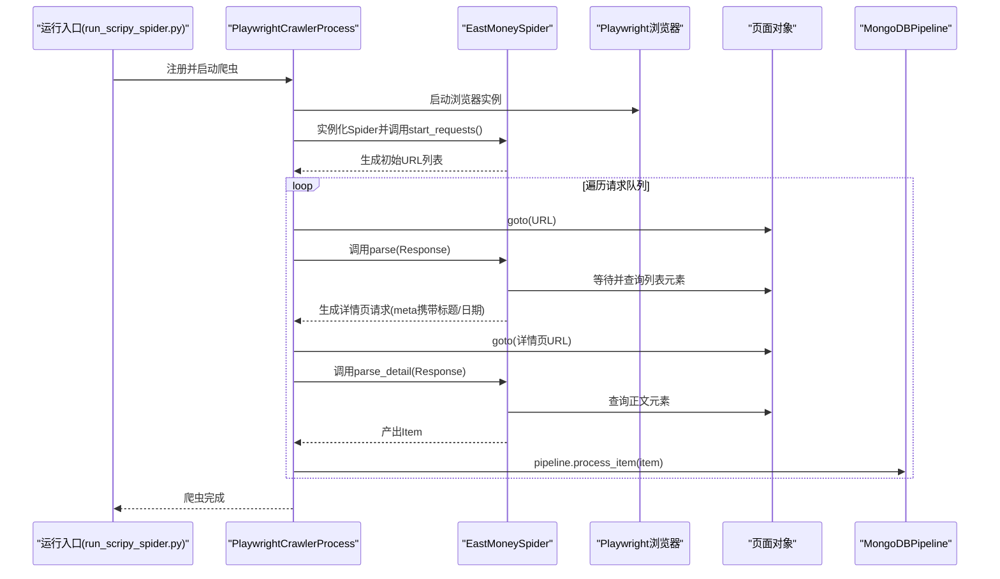
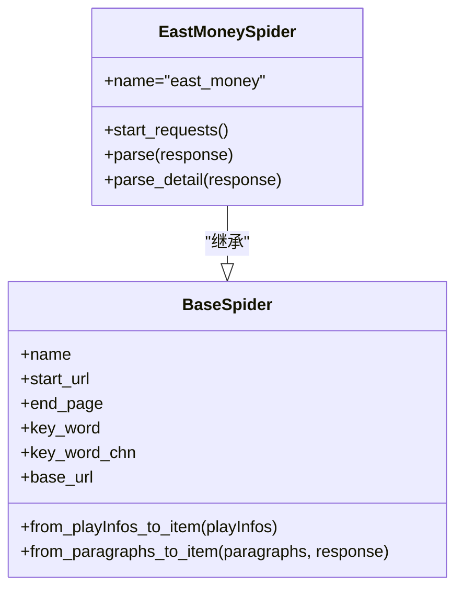
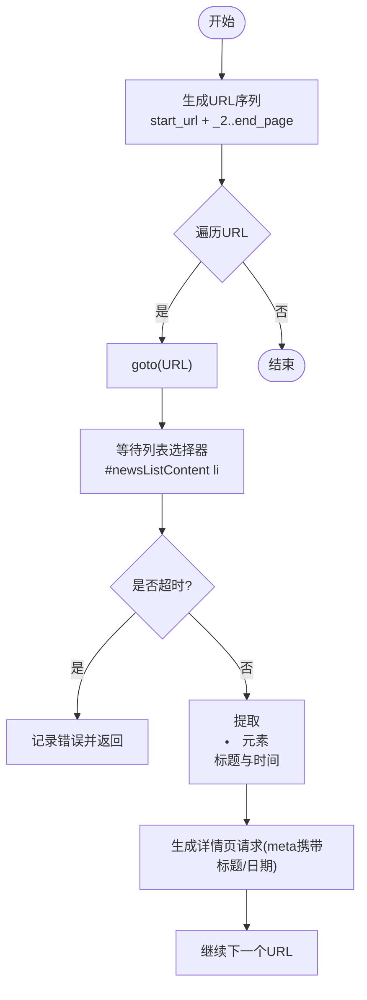
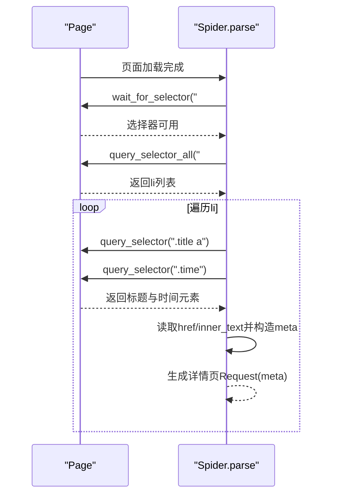
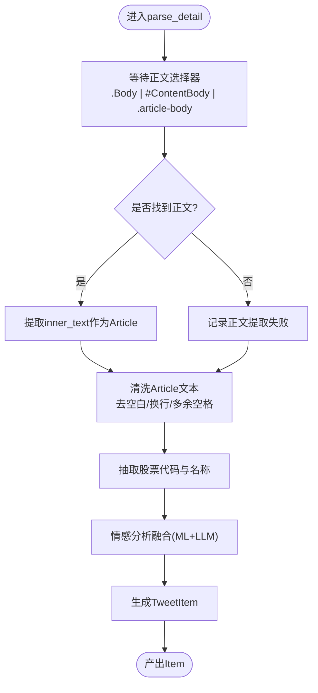
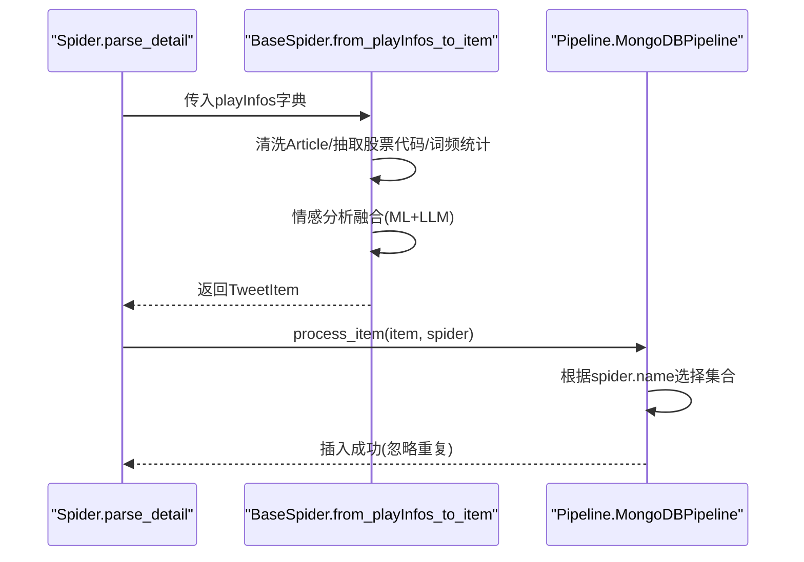
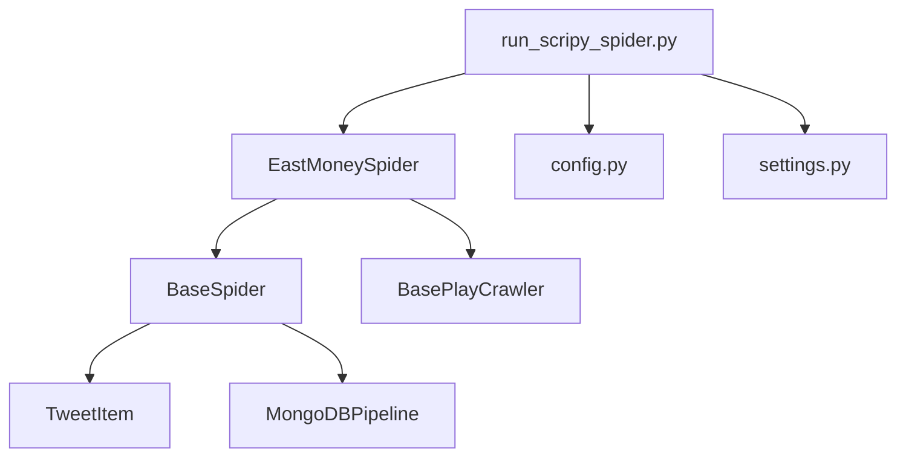

# 东方财富爬虫

<cite>
**本文档引用的文件**
- [east_money_spider.py](file://src/MarketNewsSpiderWithScrapy/east_money_spider.py)
- [BaseSpider.py](file://src/MarketNewsSpiderWithScrapy/BaseSpider.py)
- [BasePlayCrawler.py](file://src/MarketNewsSpiderWithScrapy/BasePlayCrawler.py)
- [items.py](file://src/Utils/items.py)
- [settings.py](file://src/settings.py)
- [pipelines.py](file://src/pipelines.py)
- [run_scripy_spider.py](file://src/run_scripy_spider.py)
- [config.py](file://src/Utils/config.py)
- [net_ease_spider.py](file://src/MarketNewsSpiderWithScrapy/net_ease_spider.py)
- [jqka_spider.py](file://src/MarketNewsSpiderWithScrapy/jqka_spider.py)
</cite>

## 目录
1. [简介](#简介)
2. [项目结构](#项目结构)
3. [核心组件](#核心组件)
4. [架构总览](#架构总览)
5. [详细组件分析](#详细组件分析)
6. [依赖关系分析](#依赖关系分析)
7. [性能考虑](#性能考虑)
8. [故障排除指南](#故障排除指南)
9. [结论](#结论)

## 简介
本技术文档面向东方财富网新闻爬取系统的实现，系统采用异步Playwright驱动的Scrapy风格爬虫框架，专门针对东方财富网的新闻列表页与详情页结构进行定制化解析。文档将深入讲解以下要点：
- 新闻列表页结构与详情页布局的适配策略
- 异步请求处理机制，包括start_requests中的URL生成策略与分页处理
- parse方法中元素选择器的使用，重点说明#newsListContent li选择器及.title a、.time选择器的提取逻辑
- parse_detail方法中的正文提取机制，涵盖.Body、#ContentBody、.article-body等不同选择器的兼容性处理
- 财富号与普通新闻页面结构差异的处理方式
- 元数据传递机制与数据标准化输出格式

## 项目结构
项目采用模块化组织，核心爬虫位于MarketNewsSpiderWithScrapy目录，通用基类与工具位于Utils目录，配置信息集中于Utils/config.py，运行入口在run_scripy_spider.py中。

**图表来源**
- [east_money_spider.py:1-78](file://src/MarketNewsSpiderWithScrapy/east_money_spider.py#L1-L78)
- [BaseSpider.py:1-149](file://src/MarketNewsSpiderWithScrapy/BaseSpider.py#L1-L149)
- [BasePlayCrawler.py:1-120](file://src/MarketNewsSpiderWithScrapy/BasePlayCrawler.py#L1-L120)
- [config.py:196-264](file://src/Utils/config.py#L196-L264)
- [run_scripy_spider.py:78-87](file://src/run_scripy_spider.py#L78-L87)

**章节来源**
- [east_money_spider.py:1-78](file://src/MarketNewsSpiderWithScrapy/east_money_spider.py#L1-L78)
- [BaseSpider.py:1-149](file://src/MarketNewsSpiderWithScrapy/BaseSpider.py#L1-L149)
- [BasePlayCrawler.py:1-120](file://src/MarketNewsSpiderWithScrapy/BasePlayCrawler.py#L1-L120)
- [config.py:196-264](file://src/Utils/config.py#L196-L264)
- [run_scripy_spider.py:78-87](file://src/run_scripy_spider.py#L78-L87)

## 核心组件
- 东方财富Spider：继承自BaseSpider，实现start_requests、parse、parse_detail三个关键方法，专门处理东方财富网的列表页与详情页。
- BaseSpider：提供通用的数据清洗、情感分析融合、MongoDB存储等通用能力。
- BasePlayCrawler：提供异步Playwright驱动的Request/Response模拟与CrawlerProcess调度。
- 配置系统：通过config.py集中管理各站点的数据库名、起始URL、关键词、分类、分页数等参数。
- 运行入口：run_scripy_spider.py负责批量注册多个站点爬虫并启动。

**章节来源**
- [east_money_spider.py:5-78](file://src/MarketNewsSpiderWithScrapy/east_money_spider.py#L5-L78)
- [BaseSpider.py:13-149](file://src/MarketNewsSpiderWithScrapy/BaseSpider.py#L13-L149)
- [BasePlayCrawler.py:6-120](file://src/MarketNewsSpiderWithScrapy/BasePlayCrawler.py#L6-L120)
- [config.py:196-264](file://src/Utils/config.py#L196-L264)
- [run_scripy_spider.py:78-87](file://src/run_scripy_spider.py#L78-L87)

## 架构总览
系统采用“异步Playwright + 自定义调度器”的架构，与传统Scrapy的同步HTTP请求不同，该系统通过Playwright在真实浏览器环境中渲染页面，从而更好地适配前端动态加载的新闻列表页。

**图表来源**
- [run_scripy_spider.py:78-87](file://src/run_scripy_spider.py#L78-L87)
- [BasePlayCrawler.py:41-118](file://src/MarketNewsSpiderWithScrapy/BasePlayCrawler.py#L41-L118)
- [east_money_spider.py:12-76](file://src/MarketNewsSpiderWithScrapy/east_money_spider.py#L12-L76)
- [pipelines.py:25-46](file://src/pipelines.py#L25-L46)

## 详细组件分析

### 东方财富Spider实现
- 继承关系：EastMoneySpider -> BaseSpider
- 关键方法：
  - start_requests：生成列表页URL序列，支持多页分页
  - parse：等待列表页加载，提取每条新闻的标题链接与时间，并传递至详情页解析
  - parse_detail：等待并提取正文内容，兼容财富号与普通新闻的不同结构

**图表来源**
- [BaseSpider.py:13-149](file://src/MarketNewsSpiderWithScrapy/BaseSpider.py#L13-L149)
- [east_money_spider.py:5-78](file://src/MarketNewsSpiderWithScrapy/east_money_spider.py#L5-L78)

**章节来源**
- [east_money_spider.py:5-78](file://src/MarketNewsSpiderWithScrapy/east_money_spider.py#L5-L78)
- [BaseSpider.py:100-146](file://src/MarketNewsSpiderWithScrapy/BaseSpider.py#L100-L146)

### 异步请求处理与分页策略
- URL生成策略：从start_url开始，按需生成后续页码URL，例如将.html替换为_2.html、_3.html等，最多生成end_page页。
- 分页处理：通过列表页URL集合逐一发起请求，每个请求对应一页新闻列表。
- 超时控制：列表页等待选择器超时设置为50秒，详情页正文等待超时为5秒，避免长时间阻塞。

**图表来源**
- [east_money_spider.py:12-51](file://src/MarketNewsSpiderWithScrapy/east_money_spider.py#L12-L51)

**章节来源**
- [east_money_spider.py:12-51](file://src/MarketNewsSpiderWithScrapy/east_money_spider.py#L12-L51)

### 列表页解析与元素选择器
- 列表页等待：使用wait_for_selector等待#newsListContent li出现，确保动态内容加载完成。
- 元素提取：对每个li元素，使用.query_selector分别提取.title a与.time节点，获取href、文本与时间字符串。
- 元数据传递：将标题与日期封装为meta字典，随详情页请求传递，保证详情页能直接使用这些字段。

**图表来源**
- [east_money_spider.py:21-51](file://src/MarketNewsSpiderWithScrapy/east_money_spider.py#L21-L51)

**章节来源**
- [east_money_spider.py:21-51](file://src/MarketNewsSpiderWithScrapy/east_money_spider.py#L21-L51)

### 详情页正文提取与兼容性处理
- 正文等待与选择：等待.Body、#ContentBody或.article-body三者之一出现，提升对不同页面结构的兼容性。
- 文本提取：若找到正文元素，则提取inner_text作为Article字段；若失败则记录日志并保留空内容。
- 数据标准化：通过BaseSpider的from_playInfos_to_item方法，统一清洗Article文本、识别股票代码、计算词频、进行情感分析融合，并生成标准Item。

**图表来源**
- [east_money_spider.py:53-76](file://src/MarketNewsSpiderWithScrapy/east_money_spider.py#L53-L76)
- [BaseSpider.py:100-146](file://src/MarketNewsSpiderWithScrapy/BaseSpider.py#L100-L146)

**章节来源**
- [east_money_spider.py:53-76](file://src/MarketNewsSpiderWithScrapy/east_money_spider.py#L53-L76)
- [BaseSpider.py:100-146](file://src/MarketNewsSpiderWithScrapy/BaseSpider.py#L100-L146)

### 财富号与普通新闻结构差异处理
- 选择器兼容：通过组合选择器.Body、#ContentBody、.article-body，同时覆盖财富号与普通新闻的常见正文容器。
- 结构差异：财富号页面与普通新闻页面在正文容器标签上可能存在差异，系统通过优先级选择器实现自动适配，减少人工维护成本。
- 错误降级：若三种选择器均未命中，系统记录失败并继续流程，保证整体稳定性。

**章节来源**
- [east_money_spider.py:60-67](file://src/MarketNewsSpiderWithScrapy/east_money_spider.py#L60-L67)

### 元数据传递与数据标准化输出
- 元数据传递：parse阶段将标题与日期封装为meta字典，随Request传递至详情页，parse_detail直接从response.meta读取。
- 标准化输出：from_playInfos_to_item统一处理Article清洗、股票代码抽取、词频统计、情感分析融合，并填充TweetItem的标准字段，包括_id、Url、Date、Title、RelatedStockCodes、Article、WordsFrequent、Category、Label、Score。
- 数据库存储：MongoDBPipeline根据spider.name自动选择对应的数据库集合，避免重复入库。

**图表来源**
- [east_money_spider.py:68-76](file://src/MarketNewsSpiderWithScrapy/east_money_spider.py#L68-L76)
- [BaseSpider.py:100-146](file://src/MarketNewsSpiderWithScrapy/BaseSpider.py#L100-L146)
- [pipelines.py:25-46](file://src/pipelines.py#L25-L46)

**章节来源**
- [east_money_spider.py:68-76](file://src/MarketNewsSpiderWithScrapy/east_money_spider.py#L68-L76)
- [BaseSpider.py:100-146](file://src/MarketNewsSpiderWithScrapy/BaseSpider.py#L100-L146)
- [pipelines.py:25-46](file://src/pipelines.py#L25-L46)

## 依赖关系分析
- EastMoneySpider依赖BaseSpider进行数据处理与存储，依赖BasePlayCrawler提供的异步调度与Playwright环境。
- 配置系统通过config.py集中管理东方财富网的数据库名、起始URL、关键词、分类、分页数等参数，运行入口run_scripy_spider.py批量注册并启动爬虫。
- settings.py提供Scrapy基础配置，如并发请求数、下载延迟、User-Agent池等，影响整体运行效率与稳定性。

**图表来源**
- [east_money_spider.py:1-3](file://src/MarketNewsSpiderWithScrapy/east_money_spider.py#L1-L3)
- [BaseSpider.py:5-9](file://src/MarketNewsSpiderWithScrapy/BaseSpider.py#L5-L9)
- [run_scripy_spider.py:78-87](file://src/run_scripy_spider.py#L78-L87)
- [config.py:196-264](file://src/Utils/config.py#L196-L264)
- [settings.py:18-34](file://src/settings.py#L18-L34)

**章节来源**
- [east_money_spider.py:1-3](file://src/MarketNewsSpiderWithScrapy/east_money_spider.py#L1-L3)
- [BaseSpider.py:5-9](file://src/MarketNewsSpiderWithScrapy/BaseSpider.py#L5-L9)
- [run_scripy_spider.py:78-87](file://src/run_scripy_spider.py#L78-L87)
- [config.py:196-264](file://src/Utils/config.py#L196-L264)
- [settings.py:18-34](file://src/settings.py#L18-L34)

## 性能考虑
- 异步并发：PlaywrightCrawlerProcess通过asyncio.gather并发运行多个爬虫实例，显著提升吞吐量。
- 浏览器上下文隔离：每个爬虫使用独立的浏览器上下文，避免Cookie干扰并节省内存资源。
- 超时控制：列表页与正文提取分别设置合理超时，防止长时间阻塞导致资源浪费。
- 数据清洗与情感分析：在from_playInfos_to_item中统一进行文本清洗与情感分析，减少重复计算。
- 数据库写入：MongoDBPipeline按spider.name选择集合，避免重复入库并提高写入效率。

[本节为通用性能讨论，无需特定文件引用]

## 故障排除指南
- 列表页加载超时：检查#newsListContent li选择器是否正确，适当调整等待超时时间。
- 正文提取失败：确认.BODY、#ContentBody、.article-body选择器是否覆盖目标页面结构，必要时增加新的选择器。
- 元数据缺失：确保parse阶段正确构造meta字典并传递至详情页请求。
- 数据库写入异常：检查MongoDB连接配置与集合命名规则，确认spider.name与数据库映射一致。

**章节来源**
- [east_money_spider.py:27-30](file://src/MarketNewsSpiderWithScrapy/east_money_spider.py#L27-L30)
- [east_money_spider.py:65-67](file://src/MarketNewsSpiderWithScrapy/east_money_spider.py#L65-L67)
- [pipelines.py:25-46](file://src/pipelines.py#L25-L46)

## 结论
东方财富爬虫通过异步Playwright驱动与自定义调度器，实现了对东方财富网复杂动态页面的稳定抓取。系统在列表页解析、详情页正文提取、元数据传递与数据标准化等方面具备良好的可扩展性与兼容性。通过合理的超时控制与数据库写入策略，能够在保证稳定性的同时提升整体性能。建议在未来版本中进一步增强对新页面结构的自动适配能力，并优化情感分析模型的融合策略。