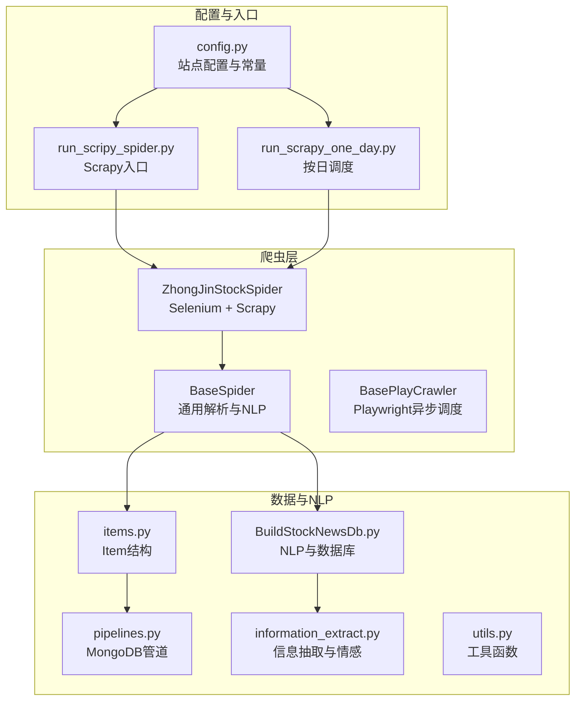
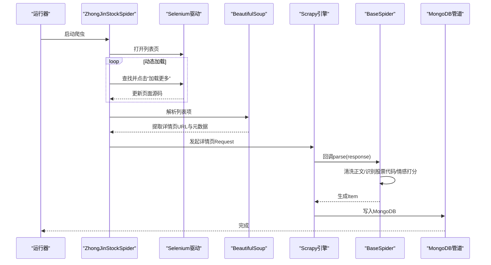
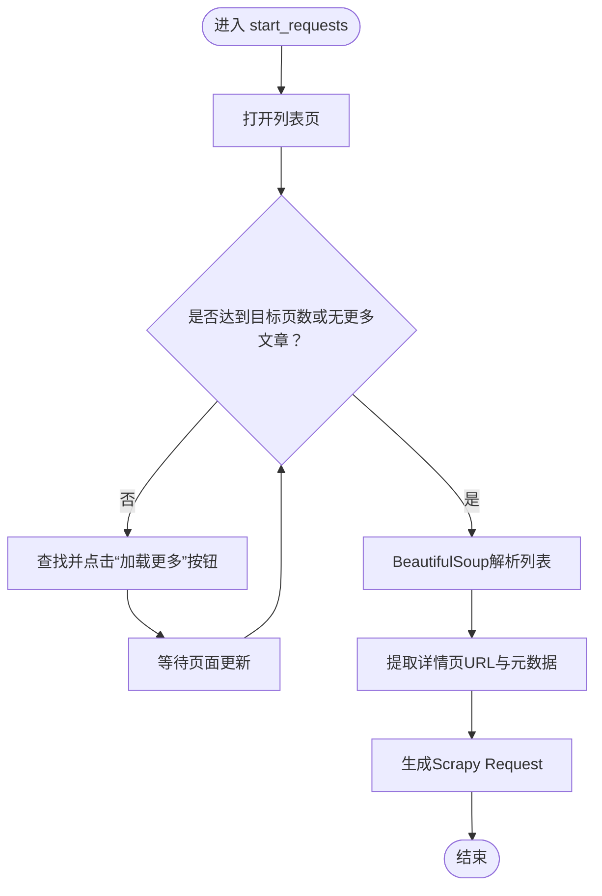
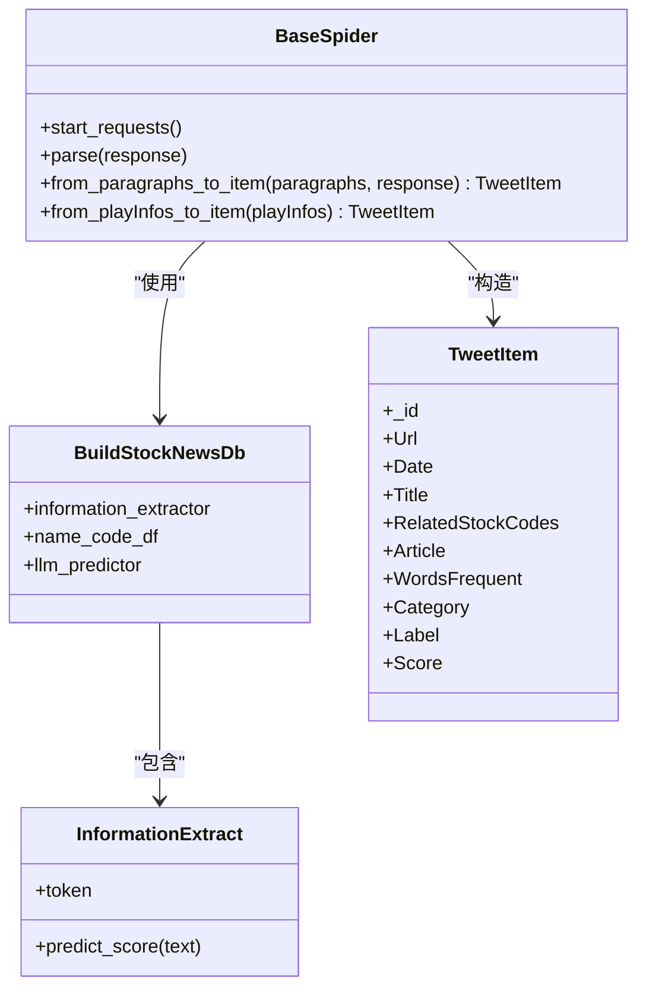
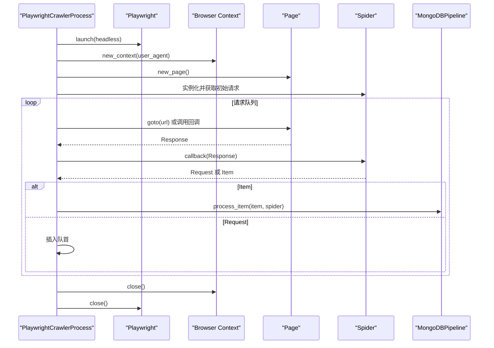
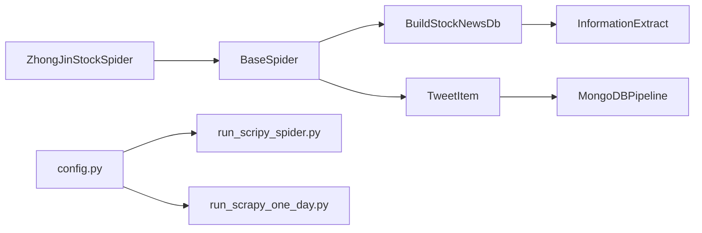

# 中金在线爬虫

<cite>
**本文引用的文件**
- [zhong_jin_spider.py](file://src/MarketNewsSpiderWithScrapy/zhong_jin_spider.py)
- [BaseSpider.py](file://src/MarketNewsSpiderWithScrapy/BaseSpider.py)
- [BasePlayCrawler.py](file://src/MarketNewsSpiderWithScrapy/BasePlayCrawler.py)
- [config.py](file://src/Utils/config.py)
- [run_scripy_spider.py](file://src/run_scripy_spider.py)
- [run_scrapy_one_day.py](file://src/run_scrapy_one_day.py)
- [items.py](file://src/Utils/items.py)
- [pipelines.py](file://src/pipelines.py)
- [BuildStockNewsDb.py](file://src/MongoDbComTools/BuildStockNewsDb.py)
- [information_extract.py](file://src/NlpModel/information_extract.py)
- [utils.py](file://src/Utils/utils.py)
- [README.md](file://README.md)
</cite>

## 目录
1. [简介](#简介)
2. [项目结构](#项目结构)
3. [核心组件](#核心组件)
4. [架构总览](#架构总览)
5. [详细组件分析](#详细组件分析)
6. [依赖关系分析](#依赖关系分析)
7. [性能考量](#性能考量)
8. [故障排查指南](#故障排查指南)
9. [结论](#结论)
10. [附录](#附录)

## 简介
本文件面向中金在线（cnfol）新闻爬虫的实现与集成，系统性梳理其页面结构、动态加载机制、列表页解析策略、详情页正文提取流程，以及与基类爬虫（BaseSpider）和异步爬虫（BasePlayCrawler）的集成方式。文档还提供反爬虫应对策略与数据质量保障措施，帮助读者快速理解并扩展该爬虫体系。

## 项目结构
中金在线爬虫位于 MarketNewsSpiderWithScrapy 目录下，采用 Scrapy 与 Selenium 结合的方式处理动态加载页面；同时通过统一的配置中心（config.py）管理多个站点的爬虫参数，并通过管道（pipelines.py）写入 MongoDB。整体结构如下图所示：

图表来源
- [zhong_jin_spider.py:1-110](file://src/MarketNewsSpiderWithScrapy/zhong_jin_spider.py#L1-L110)
- [BaseSpider.py:1-149](file://src/MarketNewsSpiderWithScrapy/BaseSpider.py#L1-L149)
- [BasePlayCrawler.py:1-120](file://src/MarketNewsSpiderWithScrapy/BasePlayCrawler.py#L1-L120)
- [config.py:316-396](file://src/Utils/config.py#L316-L396)
- [run_scripy_spider.py:99-144](file://src/run_scripy_spider.py#L99-L144)
- [run_scrapy_one_day.py:30-79](file://src/run_scrapy_one_day.py#L30-L79)
- [items.py:1-18](file://src/Utils/items.py#L1-L18)
- [pipelines.py:1-56](file://src/pipelines.py#L1-L56)
- [BuildStockNewsDb.py:1-200](file://src/MongoDbComTools/BuildStockNewsDb.py#L1-L200)
- [information_extract.py:1-200](file://src/NlpModel/information_extract.py#L1-L200)
- [utils.py:1-200](file://src/Utils/utils.py#L1-L200)

章节来源
- [README.md:1-33](file://README.md#L1-L33)
- [config.py:316-396](file://src/Utils/config.py#L316-L396)
- [run_scripy_spider.py:99-144](file://src/run_scripy_spider.py#L99-L144)
- [run_scrapy_one_day.py:30-79](file://src/run_scrapy_one_day.py#L30-L79)

## 核心组件
- ZhongJinStockSpider：继承自 BaseSpider，负责中金在线列表页的动态加载与详情页请求派发。
- BaseSpider：提供通用解析逻辑、标题与正文提取、股票代码识别、情感打分融合（ML与LLM）及 Item 构造。
- BasePlayCrawler：提供 Playwright 异步调度器，支持并发运行多个爬虫实例，统一处理请求队列与管道输出。
- 配置中心（config.py）：集中管理各站点的起始 URL、分类关键词、目标页数等。
- 管道（pipelines.py）：按站点名称将 Item 写入对应的数据库集合。
- NLP与数据库（BuildStockNewsDb、information_extract）：提供股票代码识别、情感分析与模型加载。

章节来源
- [zhong_jin_spider.py:29-110](file://src/MarketNewsSpiderWithScrapy/zhong_jin_spider.py#L29-L110)
- [BaseSpider.py:13-149](file://src/MarketNewsSpiderWithScrapy/BaseSpider.py#L13-L149)
- [BasePlayCrawler.py:21-120](file://src/MarketNewsSpiderWithScrapy/BasePlayCrawler.py#L21-L120)
- [config.py:316-396](file://src/Utils/config.py#L316-L396)
- [pipelines.py:8-56](file://src/pipelines.py#L8-L56)
- [BuildStockNewsDb.py:19-53](file://src/MongoDbComTools/BuildStockNewsDb.py#L19-L53)
- [information_extract.py:26-60](file://src/NlpModel/information_extract.py#L26-L60)

## 架构总览
中金在线爬虫采用“Selenium + Scrapy”的组合模式：
- 列表页：使用 Selenium 打开页面，循环点击“加载更多”按钮，直到达到目标页数或提示“无更多文章”，随后用 BeautifulSoup 解析列表项并发起详情页请求。
- 详情页：使用 Scrapy 的 Request 回调解析正文，交由 BaseSpider 的通用方法进行正文清洗、股票代码识别与情感打分。

图表来源
- [zhong_jin_spider.py:36-102](file://src/MarketNewsSpiderWithScrapy/zhong_jin_spider.py#L36-L102)
- [BaseSpider.py:41-98](file://src/MarketNewsSpiderWithScrapy/BaseSpider.py#L41-L98)
- [pipelines.py:25-46](file://src/pipelines.py#L25-L46)

## 详细组件分析

### ZhongJinStockSpider 组件分析
- 动态加载策略
  - 使用 Selenium 打开起始 URL，循环查找并点击“加载更多”按钮，直到文本变为“无更多文章”或达到 end_page。
  - 当按钮处于“正在加载”状态时，通过 JavaScript focus 目标元素并短暂等待，避免误判。
- 列表页解析
  - 使用 BeautifulSoup 解析页面，定位包含新闻列表的容器，遍历 li 节点，提取 a 标签 href 作为详情页 URL，同时提取标题与时间。
  - 对时间字段进行年份修正，确保与当前日期一致。
- 详情页请求派发
  - 将详情页 URL 与标题、日期等元数据封装为 Scrapy Request，交由 parse 回调处理。

图表来源
- [zhong_jin_spider.py:36-102](file://src/MarketNewsSpiderWithScrapy/zhong_jin_spider.py#L36-L102)

章节来源
- [zhong_jin_spider.py:29-110](file://src/MarketNewsSpiderWithScrapy/zhong_jin_spider.py#L29-L110)

### BaseSpider 组件分析
- 正文提取与清洗
  - 支持段落 p 标签与非段落文本的提取，去除多余空白字符与全角空格，合并为单一文章字符串。
- 股票代码与名称识别
  - 通过 BuildStockNewsDb 的信息抽取模块，结合股票名称/代码映射表，识别新闻中涉及的股票。
- 情感打分融合
  - 若配置了 LLM 模型路径，则先用 ML 模型打分，再用 LLM 模型打分，二者融合得到最终 Label 与 Score。
- Item 构造
  - 生成标准化 TweetItem，包含 URL、日期、标题、正文、相关股票代码、词频统计、分类、标签与分数等字段。

图表来源
- [BaseSpider.py:41-146](file://src/MarketNewsSpiderWithScrapy/BaseSpider.py#L41-L146)
- [BuildStockNewsDb.py:19-53](file://src/MongoDbComTools/BuildStockNewsDb.py#L19-L53)
- [information_extract.py:26-60](file://src/NlpModel/information_extract.py#L26-L60)
- [items.py:5-18](file://src/Utils/items.py#L5-L18)

章节来源
- [BaseSpider.py:13-149](file://src/MarketNewsSpiderWithScrapy/BaseSpider.py#L13-L149)
- [BuildStockNewsDb.py:19-200](file://src/MongoDbComTools/BuildStockNewsDb.py#L19-L200)
- [information_extract.py:1-200](file://src/NlpModel/information_extract.py#L1-L200)
- [items.py:1-18](file://src/Utils/items.py#L1-L18)

### BasePlayCrawler 组件分析
- 异步调度
  - 使用 async/await 与 Playwright 启动 Chromium 浏览器，为每个爬虫实例创建独立上下文，避免 Cookie 干扰并节省资源。
- 请求队列与回调
  - 维护请求队列，按顺序取出请求并执行 goto 或自定义回调；对回调生成器逐个处理，支持 Request 与 Item 的混合产出。
- 管道集成
  - 将 Item 交由 MongoDBPipeline 写入对应数据库集合。

图表来源
- [BasePlayCrawler.py:21-120](file://src/MarketNewsSpiderWithScrapy/BasePlayCrawler.py#L21-L120)
- [pipelines.py:25-46](file://src/pipelines.py#L25-L46)

章节来源
- [BasePlayCrawler.py:1-120](file://src/MarketNewsSpiderWithScrapy/BasePlayCrawler.py#L1-L120)
- [pipelines.py:1-56](file://src/pipelines.py#L1-L56)

### 集成与入口
- run_scripy_spider.py
  - 提供批量启动命令行入口，支持按类别启动中金在线爬虫（个股资讯、市场测评、板块聚焦、创业板资讯、市场掘金、股市要闻、主力动向）。
- run_scrapy_one_day.py
  - 按日调度脚本，区分基于 Playwright 的爬虫与基于 Scrapy 的爬虫，分别启动异步与同步进程。

章节来源
- [run_scripy_spider.py:99-144](file://src/run_scripy_spider.py#L99-L144)
- [run_scrapy_one_day.py:30-79](file://src/run_scrapy_one_day.py#L30-L79)

## 依赖关系分析
- ZhongJinStockSpider 依赖 BaseSpider 提供的正文清洗、股票识别与情感打分能力。
- BaseSpider 依赖 BuildStockNewsDb 与 information_extract 完成 NLP 任务。
- pipelines.py 根据 spider.name 将 Item 写入对应数据库集合，实现数据落库。
- config.py 提供统一的站点配置，便于批量启动与参数管理。

图表来源
- [zhong_jin_spider.py:29-110](file://src/MarketNewsSpiderWithScrapy/zhong_jin_spider.py#L29-L110)
- [BaseSpider.py:41-146](file://src/MarketNewsSpiderWithScrapy/BaseSpider.py#L41-L146)
- [BuildStockNewsDb.py:19-53](file://src/MongoDbComTools/BuildStockNewsDb.py#L19-L53)
- [information_extract.py:26-60](file://src/NlpModel/information_extract.py#L26-L60)
- [items.py:5-18](file://src/Utils/items.py#L5-L18)
- [pipelines.py:25-46](file://src/pipelines.py#L25-L46)
- [config.py:316-396](file://src/Utils/config.py#L316-L396)
- [run_scripy_spider.py:99-144](file://src/run_scripy_spider.py#L99-L144)
- [run_scrapy_one_day.py:30-79](file://src/run_scrapy_one_day.py#L30-L79)

## 性能考量
- 动态加载优化
  - 使用随机睡眠与 focus 触发，降低被检测概率，同时提升稳定性。
  - 限制最大页数（end_page），避免无限加载导致资源耗尽。
- 并发与资源
  - 异步爬虫（BasePlayCrawler）通过独立上下文减少 Cookie 干扰与内存占用。
  - Scrapy 设置合理的 DOWNLOAD_DELAY 与 CONCURRENT_REQUESTS，平衡吞吐与反爬虫风险。
- 数据质量
  - 正文清洗与去重（MongoDB 去重）减少噪声。
  - 股票代码识别与情感融合提升下游分析准确性。

[本节为通用建议，无需列出具体文件来源]

## 故障排查指南
- 列表页未加载更多
  - 检查“加载更多”按钮的 XPath 是否正确，确认页面是否出现“正在加载”状态。
  - 参考路径：[zhong_jin_spider.py:48-62](file://src/MarketNewsSpiderWithScrapy/zhong_jin_spider.py#L48-L62)
- 详情页解析失败
  - 确认详情页容器选择器是否匹配实际页面结构，检查 BaseSpider 的正文提取逻辑。
  - 参考路径：[BaseSpider.py:104-108](file://src/MarketNewsSpiderWithScrapy/BaseSpider.py#L104-L108)
- 数据未入库
  - 检查 spider.name 与数据库集合命名是否一致，确认 pipelines.py 的路由逻辑。
  - 参考路径：[pipelines.py:25-46](file://src/pipelines.py#L25-L46)
- 情感打分异常
  - 确认 LLM 模型路径与设备类型配置，检查 BuildStockNewsDb 的初始化逻辑。
  - 参考路径：[BuildStockNewsDb.py:46-52](file://src/MongoDbComTools/BuildStockNewsDb.py#L46-L52)

章节来源
- [zhong_jin_spider.py:36-102](file://src/MarketNewsSpiderWithScrapy/zhong_jin_spider.py#L36-L102)
- [BaseSpider.py:104-146](file://src/MarketNewsSpiderWithScrapy/BaseSpider.py#L104-L146)
- [pipelines.py:25-46](file://src/pipelines.py#L25-L46)
- [BuildStockNewsDb.py:46-52](file://src/MongoDbComTools/BuildStockNewsDb.py#L46-L52)

## 结论
中金在线爬虫通过 Selenium + Scrapy 的组合，有效应对了中金在线的动态加载与复杂页面结构。其与 BaseSpider 的深度集成提供了强大的正文清洗、股票识别与情感分析能力；配合统一配置中心与管道系统，实现了可扩展、可维护的新闻采集流水线。异步调度器（BasePlayCrawler）进一步提升了并发效率。建议在生产环境中结合随机延时、User-Agent 轮换与代理池等策略，持续优化反爬虫对抗能力与稳定性。

[本节为总结性内容，无需列出具体文件来源]

## 附录
- 启动命令参考
  - 启动全部爬虫：python run_scripy_spider.py all
  - 启动中金在线爬虫：python run_scripy_spider.py zhongjin
  - 按日调度：python run_scrapy_one_day.py
- 关键配置项
  - 中金在线站点配置：见 config.py 中 ZHONG_JIN_* 相关字典
  - 数据库集合命名：见 pipelines.py 中按 spider.name 的路由逻辑

章节来源
- [run_scripy_spider.py:117-144](file://src/run_scripy_spider.py#L117-L144)
- [run_scrapy_one_day.py:30-79](file://src/run_scrapy_one_day.py#L30-L79)
- [config.py:316-396](file://src/Utils/config.py#L316-L396)
- [pipelines.py:25-46](file://src/pipelines.py#L25-L46)