# 媒体爬虫实现

<cite>
**本文引用的文件**
- [BaseSpider.py](file://src/MarketNewsSpiderWithScrapy/BaseSpider.py)
- [BasePlayCrawler.py](file://src/MarketNewsSpiderWithScrapy/BasePlayCrawler.py)
- [items.py](file://src/Utils/items.py)
- [config.py](file://src/Utils/config.py)
- [settings.py](file://src/settings.py)
- [east_money_spider.py](file://src/MarketNewsSpiderWithScrapy/east_money_spider.py)
- [net_ease_spider.py](file://src/MarketNewsSpiderWithScrapy/net_ease_spider.py)
- [shanghai_stock_spider.py](file://src/MarketNewsSpiderWithScrapy/shanghai_stock_spider.py)
- [jrj_spider.py](file://src/MarketNewsSpiderWithScrapy/jrj_spider.py)
- [nbd_spider.py](file://src/MarketNewsSpiderWithScrapy/nbd_spider.py)
- [jqka_spider.py](file://src/MarketNewsSpiderWithScrapy/jqka_spider.py)
- [zhong_jin_spider.py](file://src/MarketNewsSpiderWithScrapy/zhong_jin_spider.py)
- [mei_tong_spider.py](file://src/MarketNewsSpiderWithScrapy/mei_tong_spider.py)
- [pipelines.py](file://src/pipelines.py)
- [run_scripy_spider.py](file://src/run_scripy_spider.py)
</cite>

## 目录
1. [简介](#简介)
2. [项目结构](#项目结构)
3. [核心组件](#核心组件)
4. [架构总览](#架构总览)
5. [详细组件分析](#详细组件分析)
6. [依赖分析](#依赖分析)
7. [性能考虑](#性能考虑)
8. [故障排查指南](#故障排查指南)
9. [结论](#结论)
10. [附录](#附录)

## 简介
本技术文档面向媒体爬虫实现，系统性梳理了8个主流财经媒体的爬取策略与实现细节，覆盖东方财富、网易财经、上海证券报、金融界、每经网、中金在线、美通社等平台。文档从网站结构特点、URL模式、页面布局与数据提取方法入手，阐述反爬虫应对策略与适配机制，给出各媒体的配置参数、爬取范围与数据格式转换规则，并通过序列图与流程图展示解析过程，最后提供调试技巧与常见问题解决方案。

## 项目结构
项目采用Scrapy与Playwright/Selenium混合架构，按“媒体模块 + 工具模块 + 配置模块 + 管道模块”的方式组织，便于扩展与维护。

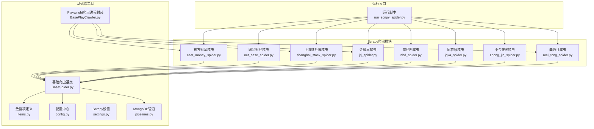

图表来源
- [run_scripy_spider.py:117-142](file://src/run_scripy_spider.py#L117-L142)
- [BaseSpider.py:13-33](file://src/MarketNewsSpiderWithScrapy/BaseSpider.py#L13-L33)
- [BasePlayCrawler.py:21-62](file://src/MarketNewsSpiderWithScrapy/BasePlayCrawler.py#L21-L62)
- [pipelines.py:8-46](file://src/pipelines.py#L8-L46)
- [config.py:439-450](file://src/Utils/config.py#L439-L450)

章节来源
- [run_scripy_spider.py:117-142](file://src/run_scripy_spider.py#L117-L142)
- [config.py:439-450](file://src/Utils/config.py#L439-L450)

## 核心组件
- 基础爬虫基类：统一初始化、股票代码映射、正文清洗、情感打分融合、Item构造与字段标准化。
- Playwright爬虫进程封装：并发调度、UA轮换、上下文隔离、异步请求队列与回调处理。
- 数据项定义：统一的字段集合，确保跨媒体输出一致。
- 配置中心：集中管理各媒体的数据库名、起始URL、关键词、中文分类、基础URL与最大页数。
- 管道：按媒体名称路由到对应数据库集合，去重入库。

章节来源
- [BaseSpider.py:13-149](file://src/MarketNewsSpiderWithScrapy/BaseSpider.py#L13-L149)
- [BasePlayCrawler.py:21-120](file://src/MarketNewsSpiderWithScrapy/BasePlayCrawler.py#L21-L120)
- [items.py:5-18](file://src/Utils/items.py#L5-L18)
- [config.py:439-450](file://src/Utils/config.py#L439-L450)
- [pipelines.py:8-56](file://src/pipelines.py#L8-L56)

## 架构总览
整体架构由“运行入口 -> 爬虫实例 -> 解析回调 -> 数据清洗与建模 -> 管道入库”构成。部分媒体采用Playwright或Selenium驱动真实浏览器，以应对AJAX与反爬策略；其余媒体使用Scrapy直接HTTP解析。

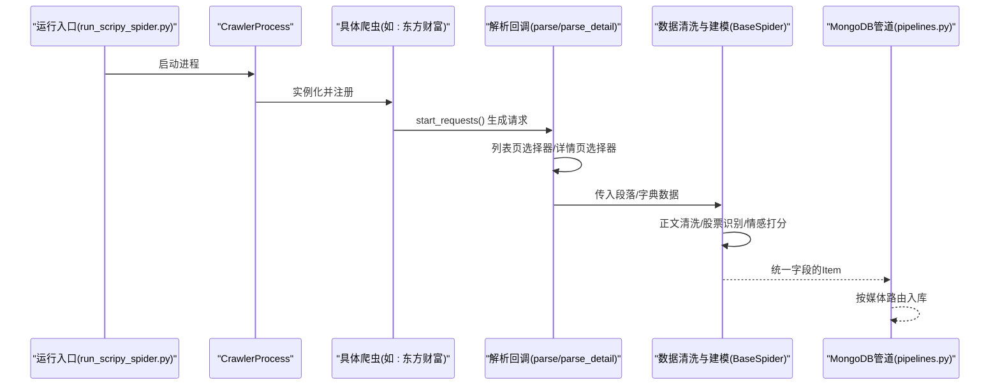

图表来源
- [run_scripy_spider.py:117-142](file://src/run_scripy_spider.py#L117-L142)
- [east_money_spider.py:21-78](file://src/MarketNewsSpiderWithScrapy/east_money_spider.py#L21-L78)
- [BaseSpider.py:41-146](file://src/MarketNewsSpiderWithScrapy/BaseSpider.py#L41-L146)
- [pipelines.py:25-46](file://src/pipelines.py#L25-L46)

## 详细组件分析

### 东方财富爬虫
- 网站结构与URL模式
  - 列表页URL按页码后缀变化，支持多类别频道。
  - 详情页通过列表项中的链接进入，正文容器存在多种CSS类名以兼容不同富文本形态。
- 页面布局与数据提取
  - 列表页等待目标容器加载，遍历列表项提取标题、时间与链接。
  - 详情页等待正文容器出现，兼容普通新闻与财富号两种结构。
- 反爬虫应对与适配
  - 使用Playwright异步等待与超时控制，避免过早DOM访问。
  - 详情页对多个正文容器进行降级匹配，提升鲁棒性。
- 配置参数与爬取范围
  - 支持多频道配置，最大页数可调。
- 数据格式转换
  - 标准化为统一字段，正文清洗后交由情感模型与股票识别处理。

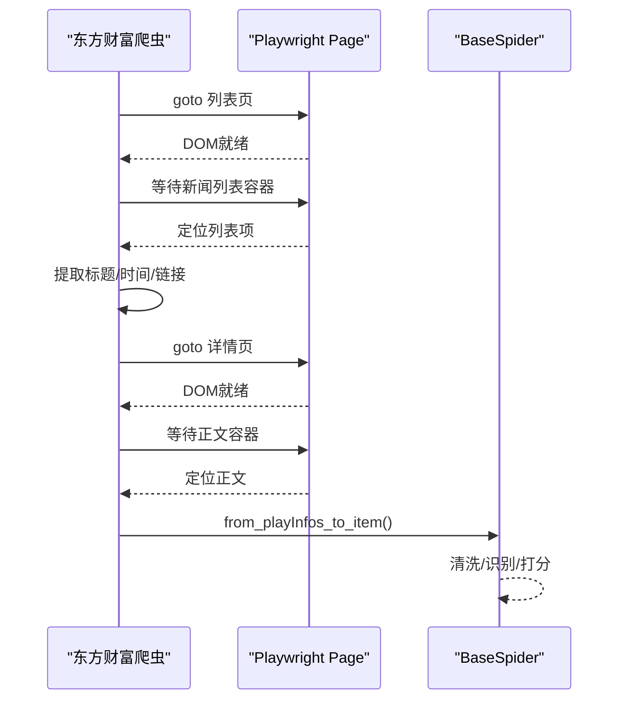

图表来源
- [east_money_spider.py:21-78](file://src/MarketNewsSpiderWithScrapy/east_money_spider.py#L21-L78)
- [BaseSpider.py:100-146](file://src/MarketNewsSpiderWithScrapy/BaseSpider.py#L100-L146)

章节来源
- [east_money_spider.py:12-78](file://src/MarketNewsSpiderWithScrapy/east_money_spider.py#L12-L78)
- [config.py:196-264](file://src/Utils/config.py#L196-L264)

### 网易财经爬虫
- 网站结构与URL模式
  - 列表页URL按“_数字.html”后缀分页，详情页为独立页面。
- 页面布局与数据提取
  - 列表页解析左侧区域，定位新闻项并提取标题与时间。
  - 详情页正文位于特定容器内，使用BeautifulSoup解析。
- 反爬虫应对与适配
  - 使用Scrapy Request与BeautifulSoup，避免复杂JS渲染。
- 配置参数与爬取范围
  - 支持多频道，最大页数可配置。
- 数据格式转换
  - 将段落集合交给基类进行统一清洗与建模。

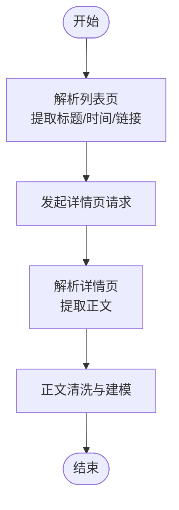

图表来源
- [net_ease_spider.py:15-68](file://src/MarketNewsSpiderWithScrapy/net_ease_spider.py#L15-L68)
- [BaseSpider.py:41-98](file://src/MarketNewsSpiderWithScrapy/BaseSpider.py#L41-L98)

章节来源
- [net_ease_spider.py:15-68](file://src/MarketNewsSpiderWithScrapy/net_ease_spider.py#L15-L68)
- [config.py:171-193](file://src/Utils/config.py#L171-L193)

### 上海证券报爬虫
- 网站结构与URL模式
  - 采用AJAX分页，列表页通过拦截JSON响应获取数据。
- 页面布局与数据提取
  - 通过滚动触发展开，拦截返回的新闻列表，组装标准字段。
- 反爬虫应对与适配
  - 使用Playwright事件监听与滚动模拟，规避静态页面加载不足。
- 配置参数与爬取范围
  - 最大翻页次数可配置，自动拼接日期时间字段。
- 数据格式转换
  - 直接使用摘要作为Article，统一字段交由基类处理。

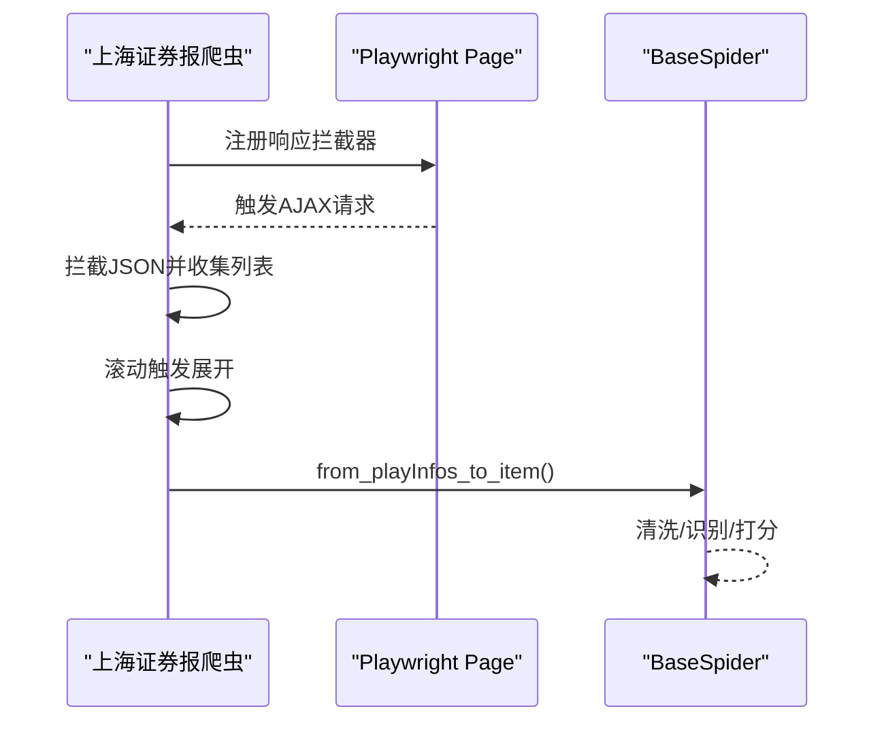

图表来源
- [shanghai_stock_spider.py:16-60](file://src/MarketNewsSpiderWithScrapy/shanghai_stock_spider.py#L16-L60)
- [BaseSpider.py:100-146](file://src/MarketNewsSpiderWithScrapy/BaseSpider.py#L100-L146)

章节来源
- [shanghai_stock_spider.py:16-60](file://src/MarketNewsSpiderWithScrapy/shanghai_stock_spider.py#L16-L60)
- [config.py:266-314](file://src/Utils/config.py#L266-L314)

### 金融界爬虫
- 网站结构与URL模式
  - 列表页存在“加载更多”按钮，详情页发布时间需正则匹配。
- 页面布局与数据提取
  - 循环点击加载更多，定位新闻项并提取标题与链接。
  - 详情页等待正文容器，提取发布时间与正文。
- 反爬虫应对与适配
  - 显式等待与点击交互，正则提取时间，增强稳定性。
- 配置参数与爬取范围
  - 最大翻页次数可配置。
- 数据格式转换
  - 统一字段交由基类处理。

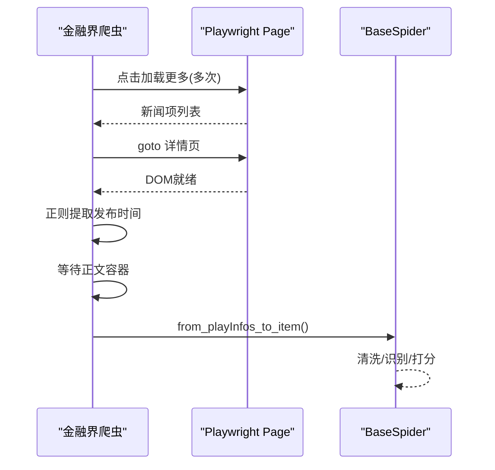

图表来源
- [jrj_spider.py:17-94](file://src/MarketNewsSpiderWithScrapy/jrj_spider.py#L17-L94)
- [BaseSpider.py:100-146](file://src/MarketNewsSpiderWithScrapy/BaseSpider.py#L100-L146)

章节来源
- [jrj_spider.py:14-94](file://src/MarketNewsSpiderWithScrapy/jrj_spider.py#L14-L94)
- [config.py:72-121](file://src/Utils/config.py#L72-L121)

### 每经网爬虫
- 网站结构与URL模式
  - 列表页URL按“/page/{num}”分页，详情页为独立页面。
- 页面布局与数据提取
  - 列表页解析新闻卡片，提取标题与链接；详情页正文位于指定容器。
- 反爬虫应对与适配
  - 使用BeautifulSoup解析，避免复杂JS渲染。
- 配置参数与爬取范围
  - 支持多频道，最大页数可配置。
- 数据格式转换
  - 统一字段交由基类处理。

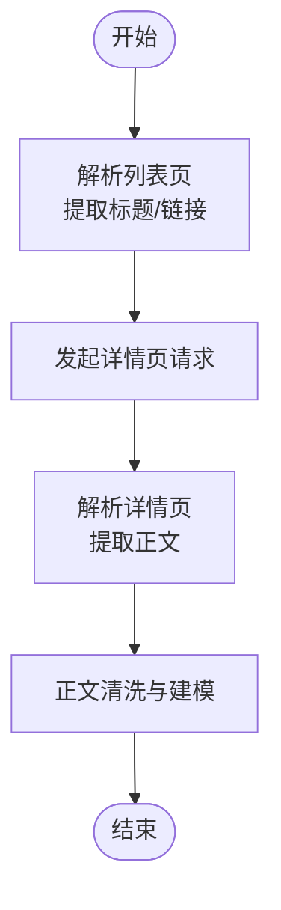

图表来源
- [nbd_spider.py:27-67](file://src/MarketNewsSpiderWithScrapy/nbd_spider.py#L27-L67)
- [BaseSpider.py:41-98](file://src/MarketNewsSpiderWithScrapy/BaseSpider.py#L41-L98)

章节来源
- [nbd_spider.py:13-67](file://src/MarketNewsSpiderWithScrapy/nbd_spider.py#L13-L67)
- [config.py:122-169](file://src/Utils/config.py#L122-L169)

### 中金在线爬虫
- 网站结构与URL模式
  - 使用Selenium驱动Chrome，通过“加载更多”按钮分页。
- 页面布局与数据提取
  - 通过XPath定位按钮，循环点击直至“无更多文章”，解析列表项并进入详情页。
- 反爬虫应对与适配
  - 无头模式、随机延时与滚动，降低检测概率。
- 配置参数与爬取范围
  - 最大翻页次数可配置。
- 数据格式转换
  - 统一字段交由基类处理。

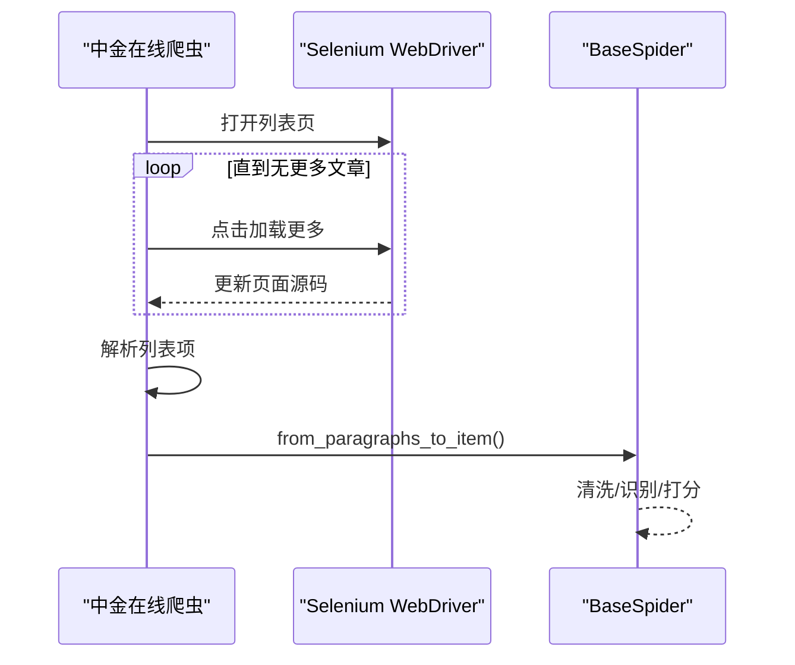

图表来源
- [zhong_jin_spider.py:36-110](file://src/MarketNewsSpiderWithScrapy/zhong_jin_spider.py#L36-L110)
- [BaseSpider.py:41-98](file://src/MarketNewsSpiderWithScrapy/BaseSpider.py#L41-L98)

章节来源
- [zhong_jin_spider.py:29-110](file://src/MarketNewsSpiderWithScrapy/zhong_jin_spider.py#L29-L110)
- [config.py:316-396](file://src/Utils/config.py#L316-L396)

### 同花顺爬虫
- 网站结构与URL模式
  - 列表页存在瀑布流与“加载更多”按钮，采用滚动与点击结合的方式展开。
- 页面布局与数据提取
  - 通过选择器定位新闻项，补全相对链接，构造标准字段。
- 反爬虫应对与适配
  - 滚动触发展开、点击“加载更多”，等待网络空闲。
- 配置参数与爬取范围
  - 最大翻页次数可配置。
- 数据格式转换
  - 统一字段交由基类处理。

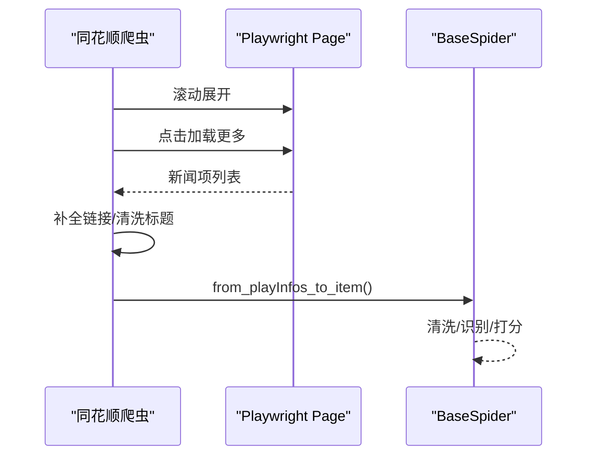

图表来源
- [jqka_spider.py:18-80](file://src/MarketNewsSpiderWithScrapy/jqka_spider.py#L18-L80)
- [BaseSpider.py:100-146](file://src/MarketNewsSpiderWithScrapy/BaseSpider.py#L100-L146)

章节来源
- [jqka_spider.py:8-80](file://src/MarketNewsSpiderWithScrapy/jqka_spider.py#L8-L80)
- [config.py:55-69](file://src/Utils/config.py#L55-L69)

### 美通社爬虫
- 网站结构与URL模式
  - 列表页URL按“-页码.shtml”变化，详情页为独立页面。
- 页面布局与数据提取
  - 列表页解析卡片与链接，详情页解析标题、公司与正文。
- 反爬虫应对与适配
  - 自定义人类行为模拟（滚动、鼠标移动、平滑滚动），检测拦截页并跳过。
- 配置参数与爬取范围
  - 最大页数可配置。
- 数据格式转换
  - 统一字段交由基类处理。

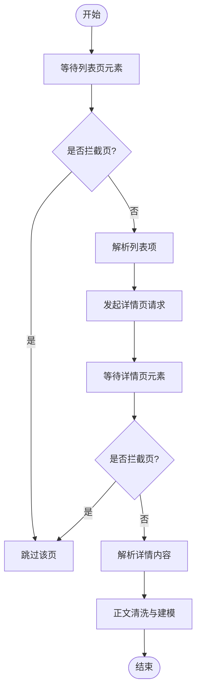

图表来源
- [mei_tong_spider.py:201-267](file://src/MarketNewsSpiderWithScrapy/mei_tong_spider.py#L201-L267)
- [BaseSpider.py:100-146](file://src/MarketNewsSpiderWithScrapy/BaseSpider.py#L100-L146)

章节来源
- [mei_tong_spider.py:167-267](file://src/MarketNewsSpiderWithScrapy/mei_tong_spider.py#L167-L267)
- [config.py:398-437](file://src/Utils/config.py#L398-L437)

## 依赖分析
- 组件耦合
  - 各媒体爬虫均继承自BaseSpider，共享数据清洗、情感打分与Item标准化能力。
  - 管道按媒体名称路由，避免跨库污染。
- 外部依赖
  - Scrapy、Playwright、Selenium、BeautifulSoup、MongoDB。
- 潜在循环依赖
  - 无直接循环导入，运行入口与配置中心解耦良好。

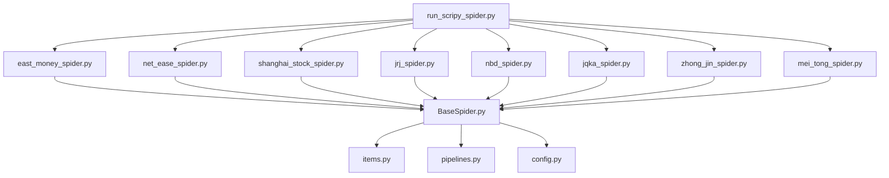

图表来源
- [BaseSpider.py:13-33](file://src/MarketNewsSpiderWithScrapy/BaseSpider.py#L13-L33)
- [pipelines.py:8-46](file://src/pipelines.py#L8-L46)
- [config.py:439-450](file://src/Utils/config.py#L439-L450)
- [run_scripy_spider.py:117-142](file://src/run_scripy_spider.py#L117-L142)

章节来源
- [BaseSpider.py:13-149](file://src/MarketNewsSpiderWithScrapy/BaseSpider.py#L13-L149)
- [pipelines.py:8-56](file://src/pipelines.py#L8-L56)
- [run_scripy_spider.py:117-142](file://src/run_scripy_spider.py#L117-L142)

## 性能考虑
- 并发与延迟
  - Scrapy设置中启用高并发与下载延迟，平衡吞吐与风控。
- 浏览器资源
  - Playwright共享Browser但为每个爬虫创建独立Context，减少内存占用。
- 数据清洗与建模
  - 正文清洗与股票识别、情感打分在基类统一处理，避免重复计算。
- 管道入库
  - 按媒体路由入库，减少集合冲突与锁竞争。

章节来源
- [settings.py:18-47](file://src/settings.py#L18-L47)
- [BasePlayCrawler.py:45-62](file://src/MarketNewsSpiderWithScrapy/BasePlayCrawler.py#L45-L62)
- [pipelines.py:25-46](file://src/pipelines.py#L25-L46)

## 故障排查指南
- 列表页加载超时
  - 现象：等待选择器超时或无新闻项。
  - 处理：增加等待时间、检查选择器是否随版本更新。
- 详情页拦截页
  - 现象：标题或内容包含“人机验证/请稍候”等关键字。
  - 处理：检测拦截页并跳过，必要时调整UA或启用代理。
- 正文提取失败
  - 现象：正文容器不存在或为空。
  - 处理：提供多个候选选择器，降级匹配；记录URL以便人工核验。
- 数据库插入异常
  - 现象：重复键错误。
  - 处理：捕获DuplicateKeyError并忽略，保证幂等性。

章节来源
- [east_money_spider.py:27-30](file://src/MarketNewsSpiderWithScrapy/east_money_spider.py#L27-L30)
- [mei_tong_spider.py:37-38](file://src/MarketNewsSpiderWithScrapy/mei_tong_spider.py#L37-L38)
- [mei_tong_spider.py:210-212](file://src/MarketNewsSpiderWithScrapy/mei_tong_spider.py#L210-L212)
- [pipelines.py:53-55](file://src/pipelines.py#L53-L55)

## 结论
本项目通过统一的基类与管道设计，实现了8个主流财经媒体的稳定爬取。针对不同媒体的结构差异，采用Scrapy、Playwright与Selenium相结合的策略，既保证了效率也提升了鲁棒性。配置中心集中管理各媒体参数，便于扩展与维护。建议后续持续关注目标站点结构变化，完善选择器与拦截页检测，进一步优化并发与延迟参数。

## 附录
- 运行入口与媒体注册
  - 通过运行脚本按参数选择媒体批量启动。
- 数据项字段说明
  - 统一字段包括：_id、Url、Date、Title、RelatedStockCodes、Article、WordsFrequent、Category、Label、Score。

章节来源
- [run_scripy_spider.py:117-142](file://src/run_scripy_spider.py#L117-L142)
- [items.py:5-18](file://src/Utils/items.py#L5-L18)