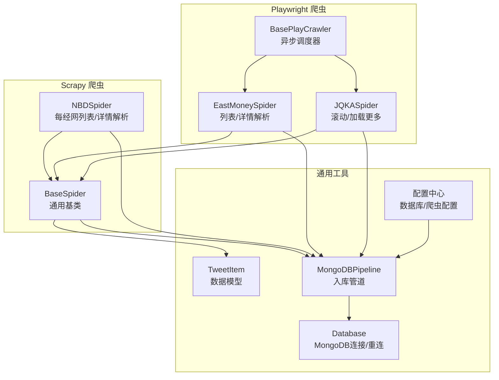
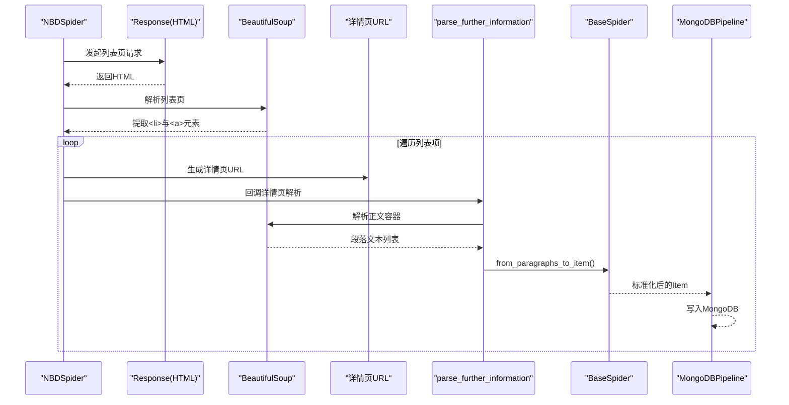
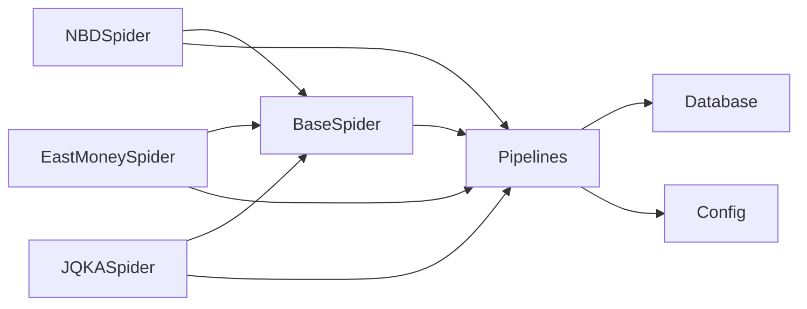

# 每经网爬虫

<cite>
**本文引用的文件**
- [nbd_spider.py](file://src/MarketNewsSpiderWithScrapy/nbd_spider.py)
- [BaseSpider.py](file://src/MarketNewsSpiderWithScrapy/BaseSpider.py)
- [BasePlayCrawler.py](file://src/MarketNewsSpiderWithScrapy/BasePlayCrawler.py)
- [east_money_spider.py](file://src/MarketNewsSpiderWithScrapy/east_money_spider.py)
- [jqka_spider.py](file://src/MarketNewsSpiderWithScrapy/jqka_spider.py)
- [items.py](file://src/Utils/items.py)
- [pipelines.py](file://src/pipelines.py)
- [config.py](file://src/Utils/config.py)
- [database.py](file://src/Utils/database.py)
- [run_scripy_spider.py](file://src/run_scripy_spider.py)
- [run_scrapy_one_day.py](file://src/run_scrapy_one_day.py)
- [settings.py](file://src/settings.py)
</cite>

## 目录
1. [简介](#简介)
2. [项目结构](#项目结构)
3. [核心组件](#核心组件)
4. [架构总览](#架构总览)
5. [详细组件分析](#详细组件分析)
6. [依赖分析](#依赖分析)
7. [性能考量](#性能考量)
8. [故障排查指南](#故障排查指南)
9. [结论](#结论)
10. [附录](#附录)

## 简介
本技术文档面向每经网（NBD）爬虫实现，系统性阐述其在经济新闻领域的专业性与时效性特征，覆盖新闻分类与列表页结构、异步页面解析与元素提取、详情页正文处理机制（含经济评论与市场分析文章）、parse_detail 方法中的正文清理与标准化流程、以及反爬虫应对策略与稳定性保障措施。文档同时提供可直接定位到源码位置的参考路径，便于快速查阅与二次开发。

## 项目结构
该项目采用“Scrapy + Playwright”混合架构，按“媒体来源 + 爬虫类型”的方式组织模块：
- MarketNewsSpiderWithScrapy：各媒体爬虫实现与通用基类
- Utils：配置、数据库、数据模型等通用工具
- pipelines.py：统一的MongoDB入库管道
- run_* 脚本：批量调度与每日运行入口

图表来源
- [nbd_spider.py:1-67](file://src/MarketNewsSpiderWithScrapy/nbd_spider.py#L1-L67)
- [BaseSpider.py:1-149](file://src/MarketNewsSpiderWithScrapy/BaseSpider.py#L1-L149)
- [BasePlayCrawler.py:1-120](file://src/MarketNewsSpiderWithScrapy/BasePlayCrawler.py#L1-L120)
- [east_money_spider.py:1-78](file://src/MarketNewsSpiderWithScrapy/east_money_spider.py#L1-L78)
- [jqka_spider.py:1-80](file://src/MarketNewsSpiderWithScrapy/jqka_spider.py#L1-L80)
- [items.py:1-18](file://src/Utils/items.py#L1-L18)
- [pipelines.py:1-56](file://src/pipelines.py#L1-L56)
- [config.py:122-169](file://src/Utils/config.py#L122-L169)
- [database.py:36-176](file://src/Utils/database.py#L36-L176)

章节来源
- [run_scripy_spider.py:59-68](file://src/run_scripy_spider.py#L59-L68)
- [run_scrapy_one_day.py:43-79](file://src/run_scrapy_one_day.py#L43-L79)

## 核心组件
- 每经网爬虫（NBDSpider）：基于BeautifulSoup解析列表页，提取子链接并进入详情页；详情页通过段落容器聚合正文，交由基类进行清洗与标准化。
- 通用基类（BaseSpider）：封装从段落列表到标准Item的转换流程，负责正文清理、去重、股票代码与关键词抽取、情感打分融合（ML与LLM）等。
- 异步调度器（BasePlayCrawler）：为Playwright驱动的爬虫提供统一的异步启动、并发执行与请求队列管理。
- 数据模型（TweetItem）：定义入库字段，确保不同来源的数据结构一致。
- 入库管道（MongoDBPipeline）：按来源自动路由到对应数据库集合，并处理重复键异常。
- 配置中心（config.py）：集中管理各媒体的数据库名、起始URL、分类标签、分页数等。
- 数据库工具（Database）：提供MongoDB连接、自动重连与查询封装。

章节来源
- [nbd_spider.py:7-67](file://src/MarketNewsSpiderWithScrapy/nbd_spider.py#L7-L67)
- [BaseSpider.py:13-149](file://src/MarketNewsSpiderWithScrapy/BaseSpider.py#L13-L149)
- [BasePlayCrawler.py:21-120](file://src/MarketNewsSpiderWithScrapy/BasePlayCrawler.py#L21-L120)
- [items.py:5-18](file://src/Utils/items.py#L5-L18)
- [pipelines.py:8-56](file://src/pipelines.py#L8-L56)
- [config.py:122-169](file://src/Utils/config.py#L122-L169)
- [database.py:36-176](file://src/Utils/database.py#L36-L176)

## 架构总览
每经网爬虫属于Scrapy生态下的静态HTML解析型爬虫。其工作流如下：
- 列表页：构造分页URL，发起HTTP请求，使用BeautifulSoup解析列表项，提取标题、时间与详情页链接。
- 详情页：对详情页进行段落级正文提取，调用基类的正文清理与标准化流程，生成标准Item。
- 入库：通过MongoDBPipeline按来源写入对应集合。

图表来源
- [nbd_spider.py:13-64](file://src/MarketNewsSpiderWithScrapy/nbd_spider.py#L13-L64)
- [BaseSpider.py:41-99](file://src/MarketNewsSpiderWithScrapy/BaseSpider.py#L41-L99)
- [pipelines.py:25-46](file://src/pipelines.py#L25-L46)

## 详细组件分析

### 每经网爬虫（NBDSpider）
- 列表页解析
  - 动态构造分页URL，支持多页遍历。
  - 使用BeautifulSoup查找列表容器与条目，提取标题、时间与链接。
- 详情页解析
  - 通过回调进入详情页，定位正文容器，提取段落文本。
  - 将段落列表交由基类进行统一的正文清理与标准化处理。
- 关键实现参考
  - 分页URL构造与请求派发：[nbd_spider.py:13-26](file://src/MarketNewsSpiderWithScrapy/nbd_spider.py#L13-L26)
  - 列表项提取与详情页回调：[nbd_spider.py:27-59](file://src/MarketNewsSpiderWithScrapy/nbd_spider.py#L27-L59)
  - 详情页正文提取与Item生成：[nbd_spider.py:61-64](file://src/MarketNewsSpiderWithScrapy/nbd_spider.py#L61-L64)

章节来源
- [nbd_spider.py:7-67](file://src/MarketNewsSpiderWithScrapy/nbd_spider.py#L7-L67)

### 通用基类（BaseSpider）——正文清理与标准化
- 正文清理流程
  - 逐段提取文本，去除多余空白与换行符，合并为单一字符串。
  - 统一空白字符，避免冗余空格与换行影响后续分析。
- 标准化处理
  - 股票代码与名称抽取：调用内置信息抽取器，返回JSON化的关联关系与词频统计。
  - 情感打分融合：结合ML与LLM模型输出，综合得到最终标签与分数。
- 关键实现参考
  - 段落到Item转换与清理逻辑：[BaseSpider.py:41-99](file://src/MarketNewsSpiderWithScrapy/BaseSpider.py#L41-L99)
  - Playwright场景下的清理与抽取：[BaseSpider.py:100-146](file://src/MarketNewsSpiderWithScrapy/BaseSpider.py#L100-L146)

章节来源
- [BaseSpider.py:41-146](file://src/MarketNewsSpiderWithScrapy/BaseSpider.py#L41-L146)

### 异步调度器（BasePlayCrawler）与Playwright爬虫
- 异步调度
  - 统一启动浏览器实例，为每个爬虫创建独立上下文，避免Cookie干扰并节省资源。
  - 并发执行多个爬虫任务，支持自定义User-Agent池。
- Playwright爬虫示例（以东方财富为例）
  - 列表页等待与元素选择：通过等待目标选择器确保内容加载完成。
  - 详情页正文提取：兼容多种正文容器选择器，提升适配性。
- 关键实现参考
  - 异步主循环与并发执行：[BasePlayCrawler.py:41-62](file://src/MarketNewsSpiderWithScrapy/BasePlayCrawler.py#L41-L62)
  - 单爬虫调度与请求队列处理：[BasePlayCrawler.py:64-118](file://src/MarketNewsSpiderWithScrapy/BasePlayCrawler.py#L64-L118)
  - 东方财富列表/详情解析流程：[east_money_spider.py:21-77](file://src/MarketNewsSpiderWithScrapy/east_money_spider.py#L21-L77)

章节来源
- [BasePlayCrawler.py:21-120](file://src/MarketNewsSpiderWithScrapy/BasePlayCrawler.py#L21-L120)
- [east_money_spider.py:5-78](file://src/MarketNewsSpiderWithScrapy/east_money_spider.py#L5-L78)

### 数据模型与入库管道
- 数据模型（TweetItem）
  - 字段覆盖URL、日期、标题、关联股票、正文、词频、分类、标签、分数等，满足统一存储与分析需求。
- 入库管道（MongoDBPipeline）
  - 自动按来源选择数据库与集合，避免重复写入。
  - 与Database工具配合，提供自动重连与查询能力。
- 关键实现参考
  - 数据模型定义：[items.py:5-18](file://src/Utils/items.py#L5-L18)
  - 集合路由与写入：[pipelines.py:25-46](file://src/pipelines.py#L25-L46)
  - 数据库连接与重连装饰器：[database.py:15-60](file://src/Utils/database.py#L15-L60)

章节来源
- [items.py:5-18](file://src/Utils/items.py#L5-L18)
- [pipelines.py:8-56](file://src/pipelines.py#L8-L56)
- [database.py:36-176](file://src/Utils/database.py#L36-L176)

### 新闻分类与页面结构
- 每经网分类配置
  - 包含“重磅推荐”“A股动态”“道达投资手记”“火山财富”等多个栏目，分别对应不同的起始URL与分页策略。
- 页面结构要点
  - 列表页：通过特定容器类名定位新闻列表，逐条提取标题、时间与链接。
  - 详情页：正文通常位于特定容器内，需按段落提取后统一清理。
- 关键实现参考
  - 分类配置与数据库映射：[config.py:122-169](file://src/Utils/config.py#L122-L169)
  - 列表页解析与详情页回调：[nbd_spider.py:27-64](file://src/MarketNewsSpiderWithScrapy/nbd_spider.py#L27-L64)

章节来源
- [config.py:122-169](file://src/Utils/config.py#L122-L169)
- [nbd_spider.py:27-64](file://src/MarketNewsSpiderWithScrapy/nbd_spider.py#L27-L64)

### 经济评论与市场分析文章的特殊处理
- 适用范围
  - 适用于评论类与分析类文章，这些文章通常段落数量较多、排版复杂，需要更稳健的段落提取与清理策略。
- 处理策略
  - 优先按段落容器提取，若无段落则直接取文本，保证完整性。
  - 清理过程中去除全角空格与换行符，统一空白字符，避免噪声干扰。
- 关键实现参考
  - 段落到Item转换与清理逻辑：[BaseSpider.py:41-99](file://src/MarketNewsSpiderWithScrapy/BaseSpider.py#L41-L99)

章节来源
- [BaseSpider.py:41-99](file://src/MarketNewsSpiderWithScrapy/BaseSpider.py#L41-L99)

### parse_detail 方法中的正文清理与标准化处理逻辑
- 清理步骤
  - 遍历段落容器，提取段落文本或直接取容器文本。
  - 连续去除全角空格与换行符，再统一拆分与合并，确保文本规整。
- 标准化步骤
  - 调用信息抽取器识别股票代码与名称，生成关联关系与词频统计。
  - 融合ML与LLM情感打分，输出最终标签与分数。
- 关键实现参考
  - 清理与标准化流程：[BaseSpider.py:41-99](file://src/MarketNewsSpiderWithScrapy/BaseSpider.py#L41-L99)

章节来源
- [BaseSpider.py:41-99](file://src/MarketNewsSpiderWithScrapy/BaseSpider.py#L41-L99)

### 反爬虫机制应对策略与稳定性保障
- 反爬虫应对
  - 请求头与User-Agent轮换：通过配置中心提供多User-Agent池，降低被识别风险。
  - 下载延迟与并发控制：合理设置DOWNLOAD_DELAY与CONCURRENT_REQUESTS，避免触发限速。
  - 代理中间件：启用HttpProxy中间件，必要时可接入代理池。
- 稳定性保障
  - 自动重连装饰器：对MongoDB操作进行指数退避重试，提升网络抖动下的稳定性。
  - 重复键异常处理：入库时捕获DuplicateKeyError，避免中断。
  - 异步调度隔离：Playwright爬虫使用独立上下文，减少会话干扰。
- 关键实现参考
  - 请求头与并发设置：[settings.py:14-30](file://src/settings.py#L14-L30)
  - 自动重连装饰器与数据库连接：[database.py:15-60](file://src/Utils/database.py#L15-L60)
  - 入库重复键处理：[pipelines.py:48-56](file://src/pipelines.py#L48-L56)
  - 异步调度隔离与并发执行：[BasePlayCrawler.py:45-62](file://src/MarketNewsSpiderWithScrapy/BasePlayCrawler.py#L45-L62)

章节来源
- [settings.py:14-30](file://src/settings.py#L14-L30)
- [database.py:15-60](file://src/Utils/database.py#L15-L60)
- [pipelines.py:48-56](file://src/pipelines.py#L48-L56)
- [BasePlayCrawler.py:45-62](file://src/MarketNewsSpiderWithScrapy/BasePlayCrawler.py#L45-L62)

## 依赖分析
- 组件耦合
  - NBDSpider依赖BaseSpider进行正文清理与Item生成。
  - 所有爬虫通过MongoDBPipeline统一入库，降低耦合度。
- 外部依赖
  - BeautifulSoup用于静态HTML解析。
  - Playwright用于动态内容加载与交互。
  - MongoDB用于数据持久化。
- 循环依赖
  - 未发现直接循环导入；各模块职责清晰，通过管道与配置中心解耦。

图表来源
- [nbd_spider.py:3](file://src/MarketNewsSpiderWithScrapy/nbd_spider.py#L3)
- [BaseSpider.py:7](file://src/MarketNewsSpiderWithScrapy/BaseSpider.py#L7)
- [pipelines.py:4](file://src/pipelines.py#L4)
- [config.py:122-169](file://src/Utils/config.py#L122-L169)
- [database.py:36-176](file://src/Utils/database.py#L36-L176)

## 性能考量
- 列表页解析
  - 使用BeautifulSoup解析，适合静态结构；对于动态内容建议采用Playwright方案。
- 详情页正文提取
  - 优先按段落容器提取，减少DOM遍历成本；清理阶段避免正则过度匹配，提高吞吐。
- 入库性能
  - 使用MongoDB单条插入，结合自动重连与去重策略，平衡一致性与性能。
- 并发与稳定性
  - 合理设置并发与延迟，避免站点限速；对MongoDB操作使用指数退避重试。

## 故障排查指南
- 列表页未加载完成
  - 现象：列表项缺失或为空。
  - 排查：检查等待选择器是否正确，适当增加超时时间。
  - 参考：[BasePlayCrawler.py:94](file://src/MarketNewsSpiderWithScrapy/BasePlayCrawler.py#L94)
- 详情页正文提取失败
  - 现象：正文为空或部分缺失。
  - 排查：确认正文容器选择器是否适配目标页面，必要时增加备用选择器。
  - 参考：[east_money_spider.py:61-66](file://src/MarketNewsSpiderWithScrapy/east_money_spider.py#L61-L66)
- 入库重复键错误
  - 现象：日志出现DuplicateKeyError。
  - 处理：入库管道已捕获该异常，不影响整体流程；如需去重可调整索引策略。
  - 参考：[pipelines.py:53-56](file://src/pipelines.py#L53-L56)
- MongoDB连接异常
  - 现象：AutoReconnect异常导致断连。
  - 处理：启用自动重连装饰器，系统将自动指数退避重试。
  - 参考：[database.py:24-33](file://src/Utils/database.py#L24-L33)

章节来源
- [BasePlayCrawler.py:94](file://src/MarketNewsSpiderWithScrapy/BasePlayCrawler.py#L94)
- [east_money_spider.py:61-66](file://src/MarketNewsSpiderWithScrapy/east_money_spider.py#L61-L66)
- [pipelines.py:53-56](file://src/pipelines.py#L53-L56)
- [database.py:24-33](file://src/Utils/database.py#L24-L33)

## 结论
每经网爬虫在Scrapy与BeautifulSoup基础上，实现了稳定高效的列表页解析与详情页正文提取，并通过通用基类完成统一的清理、标准化与情感分析。结合MongoDB自动重连与入库去重策略，整体具备良好的稳定性与可维护性。对于动态内容与复杂布局，可借鉴Playwright爬虫的异步调度与等待策略，进一步提升适配性与鲁棒性。

## 附录
- 运行入口
  - 批量调度脚本：[run_scripy_spider.py:117-142](file://src/run_scripy_spider.py#L117-L142)
  - 每日运行脚本（混合Scrapy/Playwright）：[run_scrapy_one_day.py:32-80](file://src/run_scrapy_one_day.py#L32-L80)
- 配置中心
  - 每经网分类配置与数据库映射：[config.py:122-169](file://src/Utils/config.py#L122-L169)