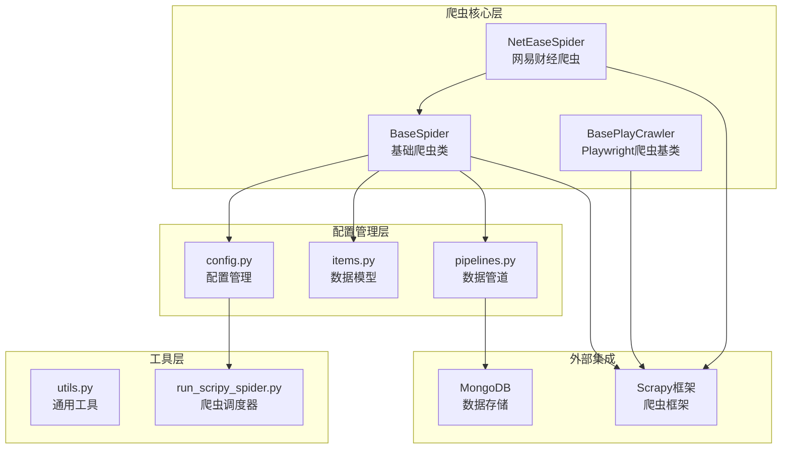
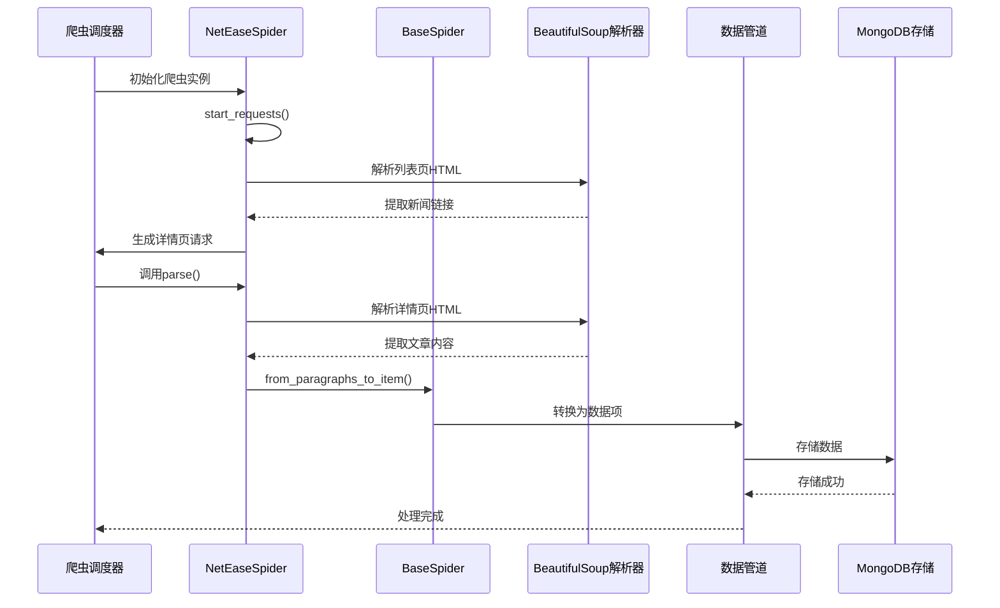
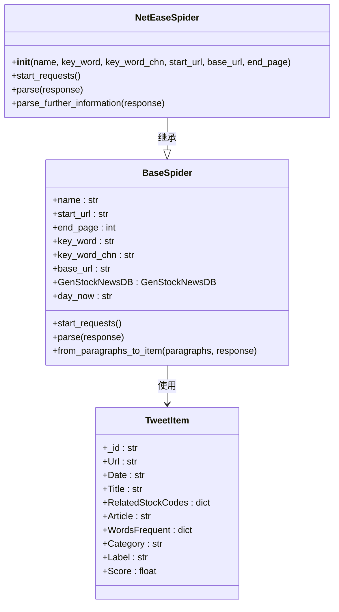
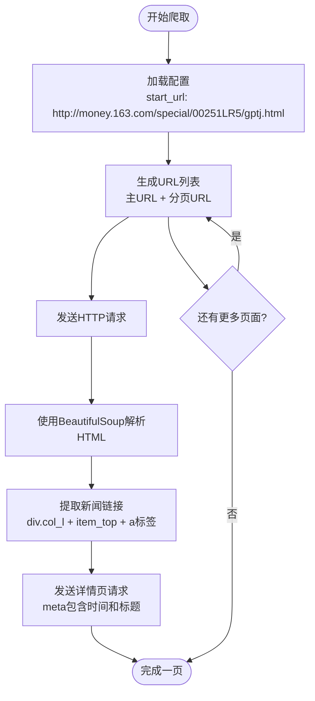
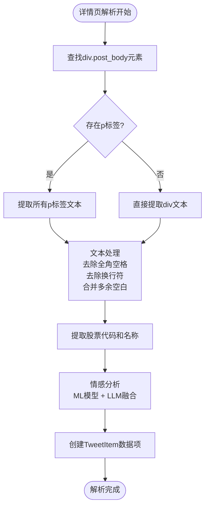
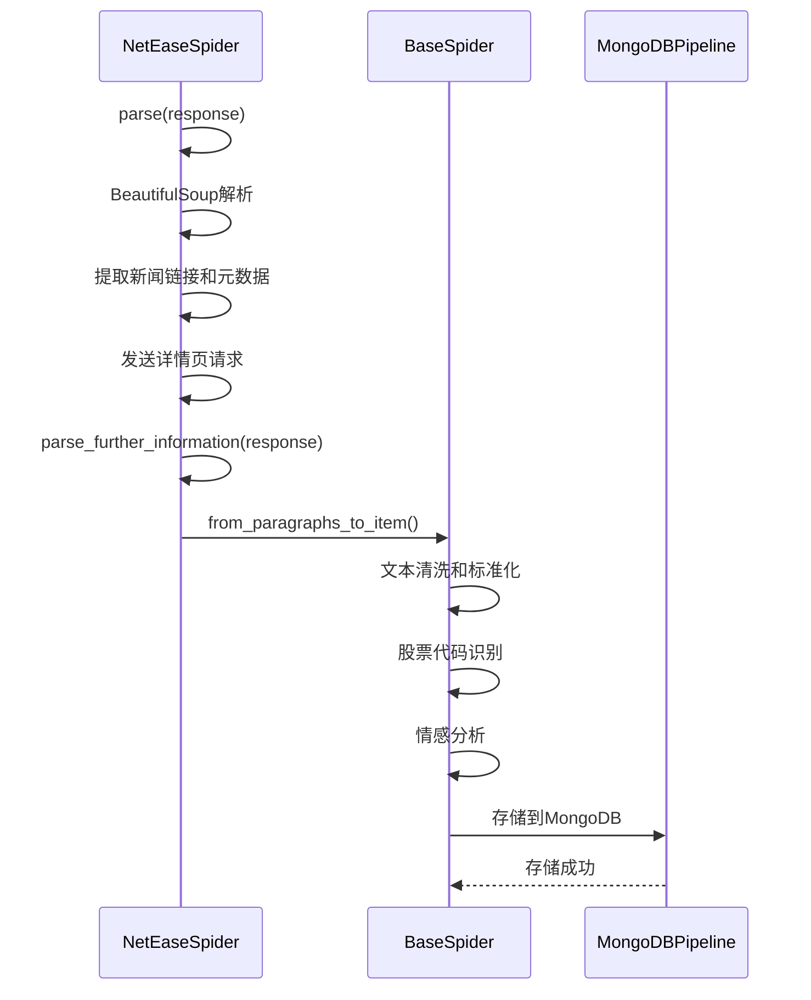
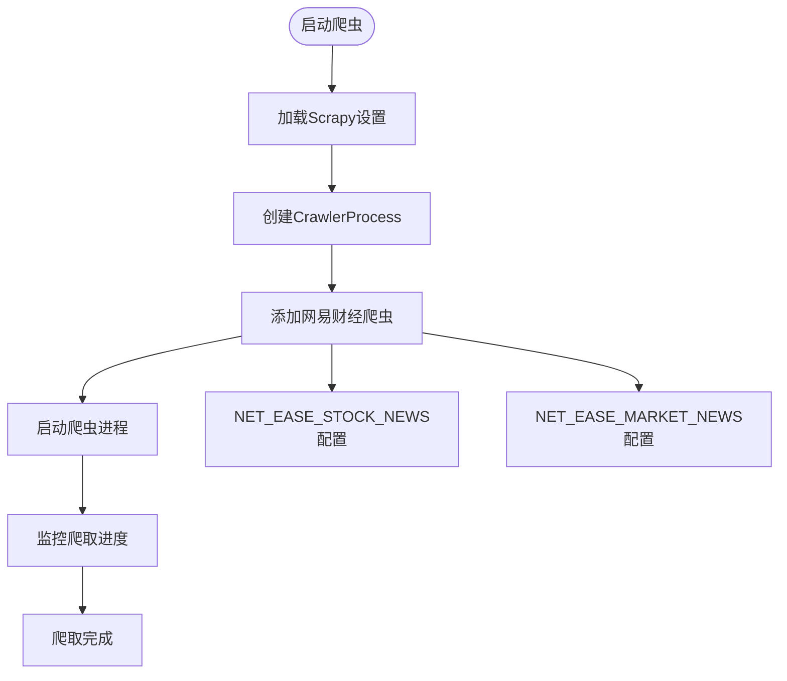
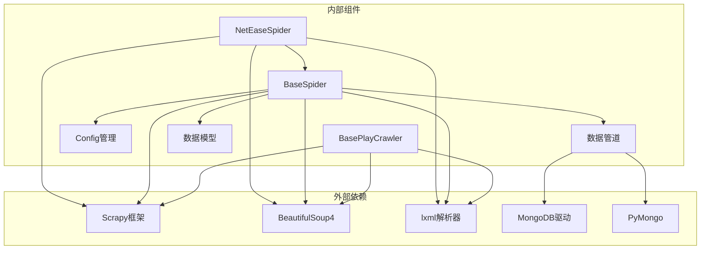
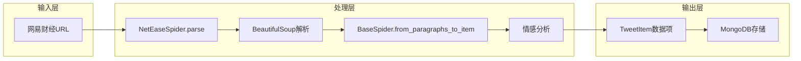

# 网易财经爬虫

<cite>
**本文档引用的文件**
- [net_ease_spider.py](file://src/MarketNewsSpiderWithScrapy/net_ease_spider.py)
- [BaseSpider.py](file://src/MarketNewsSpiderWithScrapy/BaseSpider.py)
- [BasePlayCrawler.py](file://src/MarketNewsSpiderWithScrapy/BasePlayCrawler.py)
- [run_scripy_spider.py](file://src/run_scripy_spider.py)
- [config.py](file://src/Utils/config.py)
- [items.py](file://src/Utils/items.py)
- [pipelines.py](file://src/pipelines.py)
- [utils.py](file://src/Utils/utils.py)
- [README.md](file://README.md)
</cite>

## 目录
1. [简介](#简介)
2. [项目结构](#项目结构)
3. [核心组件](#核心组件)
4. [架构概览](#架构概览)
5. [详细组件分析](#详细组件分析)
6. [依赖分析](#依赖分析)
7. [性能考虑](#性能考虑)
8. [故障排除指南](#故障排除指南)
9. [结论](#结论)
10. [附录](#附录)

## 简介
本项目是一个基于Scrapy框架的多新闻源爬虫系统，专门用于采集网易财经网的新闻内容。网易财经爬虫实现了以下核心功能：
- 网易新闻URL模式解析和列表页加载机制
- 异步等待selector的使用和超时处理策略
- 新闻详情页正文提取和特殊标签处理
- 与BasePlayCrawler的继承关系和自定义parse方法实现
- 错误处理和异常捕获的最佳实践

该项目采用模块化设计，支持多种新闻源的统一管理，并集成了情感分析和股票代码识别功能。

## 项目结构
项目采用分层架构设计，主要包含以下模块：

**图表来源**
- [net_ease_spider.py:1-68](file://src/MarketNewsSpiderWithScrapy/net_ease_spider.py#L1-L68)
- [BaseSpider.py:1-149](file://src/MarketNewsSpiderWithScrapy/BaseSpider.py#L1-L149)
- [config.py:1-455](file://src/Utils/config.py#L1-L455)

**章节来源**
- [README.md:1-33](file://README.md#L1-L33)
- [run_scripy_spider.py:1-145](file://src/run_scripy_spider.py#L1-L145)

## 核心组件
网易财经爬虫系统的核心组件包括：

### 1. NetEaseSpider类
这是网易财经爬虫的主要实现类，继承自BaseSpider，专门处理网易新闻的爬取逻辑。

### 2. BaseSpider基类
提供了通用的爬虫功能，包括：
- 数据项转换和标准化
- 股票代码识别和情感分析
- 文章正文提取和清洗

### 3. 配置管理系统
通过config.py集中管理所有爬虫的配置信息，包括：
- URL模式和端点设置
- 数据库连接配置
- 爬取规则和限制

### 4. 数据管道系统
负责将爬取的数据存储到MongoDB中，并进行去重处理。

**章节来源**
- [net_ease_spider.py:9-68](file://src/MarketNewsSpiderWithScrapy/net_ease_spider.py#L9-L68)
- [BaseSpider.py:13-149](file://src/MarketNewsSpiderWithScrapy/BaseSpider.py#L13-L149)
- [config.py:171-193](file://src/Utils/config.py#L171-L193)

## 架构概览
网易财经爬虫采用分层架构，实现了清晰的关注点分离：

**图表来源**
- [net_ease_spider.py:15-68](file://src/MarketNewsSpiderWithScrapy/net_ease_spider.py#L15-L68)
- [BaseSpider.py:41-98](file://src/MarketNewsSpiderWithScrapy/BaseSpider.py#L41-L98)
- [pipelines.py:25-46](file://src/pipelines.py#L25-L46)

## 详细组件分析

### NetEaseSpider组件分析

#### 类结构和继承关系

**图表来源**
- [BaseSpider.py:13-149](file://src/MarketNewsSpiderWithScrapy/BaseSpider.py#L13-L149)
- [net_ease_spider.py:9-68](file://src/MarketNewsSpiderWithScrapy/net_ease_spider.py#L9-L68)
- [items.py:5-18](file://src/Utils/items.py#L5-L18)

#### URL模式和列表页加载机制
网易财经采用了特殊的URL模式，通过模板替换生成多页URL：

**图表来源**
- [net_ease_spider.py:15-30](file://src/MarketNewsSpiderWithScrapy/net_ease_spider.py#L15-L30)
- [net_ease_spider.py:31-59](file://src/MarketNewsSpiderWithScrapy/net_ease_spider.py#L31-L59)

#### 详情页正文提取算法
网易财经详情页的正文提取采用了多层次的解析策略：

**图表来源**
- [net_ease_spider.py:61-68](file://src/MarketNewsSpiderWithScrapy/net_ease_spider.py#L61-L68)
- [BaseSpider.py:41-98](file://src/MarketNewsSpiderWithScrapy/BaseSpider.py#L41-L98)

**章节来源**
- [net_ease_spider.py:9-68](file://src/MarketNewsSpiderWithScrapy/net_ease_spider.py#L9-L68)
- [BaseSpider.py:41-98](file://src/MarketNewsSpiderWithScrapy/BaseSpider.py#L41-L98)

### BaseSpider组件分析

#### 数据项转换和标准化
BaseSpider提供了强大的数据项转换功能，包括：

1. **文本清洗**：去除全角空格、换行符，合并多余空白字符
2. **股票代码识别**：通过正则表达式和词典匹配识别股票代码
3. **情感分析**：结合传统机器学习模型和LLM进行情感评分融合

#### 自定义parse方法实现细节
虽然网易财经爬虫直接继承了BaseSpider的parse方法，但其实现了自定义的解析流程：

**图表来源**
- [net_ease_spider.py:31-68](file://src/MarketNewsSpiderWithScrapy/net_ease_spider.py#L31-L68)
- [BaseSpider.py:41-98](file://src/MarketNewsSpiderWithScrapy/BaseSpider.py#L41-L98)

**章节来源**
- [BaseSpider.py:13-149](file://src/MarketNewsSpiderWithScrapy/BaseSpider.py#L13-L149)

### 配置管理系统分析

#### 网易财经配置详解
网易财经爬虫的配置信息集中在config.py中：

| 配置项 | 值 | 描述 |
|--------|-----|------|
| name | net_ease_stock_specific_news_spider | 爬虫名称 |
| start_url | http://money.163.com/special/00251LR5/gptj.html | 列表页起始URL |
| key_word | stock_specific_news | 关键词标识 |
| key_word_chn | 个股资讯 | 中文分类名称 |
| base_url | http://money.163.com/ | 基础URL |
| end_page | 21 | 最大爬取页数 |

#### 爬虫调度和启动流程

**图表来源**
- [run_scripy_spider.py:71-75](file://src/run_scripy_spider.py#L71-L75)
- [config.py:171-193](file://src/Utils/config.py#L171-L193)

**章节来源**
- [config.py:171-193](file://src/Utils/config.py#L171-L193)
- [run_scripy_spider.py:71-75](file://src/run_scripy_spider.py#L71-L75)

## 依赖分析

### 组件间依赖关系

**图表来源**
- [net_ease_spider.py:4-6](file://src/MarketNewsSpiderWithScrapy/net_ease_spider.py#L4-L6)
- [BaseSpider.py:6-10](file://src/MarketNewsSpiderWithScrapy/BaseSpider.py#L6-L10)
- [pipelines.py:4](file://src/pipelines.py#L4)

### 数据流分析
网易财经爬虫的数据流遵循标准的爬虫工作流程：

**图表来源**
- [net_ease_spider.py:31-68](file://src/MarketNewsSpiderWithScrapy/net_ease_spider.py#L31-L68)
- [BaseSpider.py:41-98](file://src/MarketNewsSpiderWithScrapy/BaseSpider.py#L41-L98)
- [pipelines.py:25-46](file://src/pipelines.py#L25-L46)

**章节来源**
- [net_ease_spider.py:1-68](file://src/MarketNewsSpiderWithScrapy/net_ease_spider.py#L1-L68)
- [BaseSpider.py:1-149](file://src/MarketNewsSpiderWithScrapy/BaseSpider.py#L1-L149)

## 性能考虑

### 网易财经爬取性能优化策略

#### 1. URL生成优化
- 使用列表推导式生成分页URL，避免循环中的重复计算
- 通过条件表达式优化URL格式化逻辑

#### 2. HTML解析优化
- 使用lxml解析器提高解析速度
- 采用选择器缓存减少DOM查询开销

#### 3. 内存管理
- 及时释放BeautifulSoup对象
- 控制单次处理的数据量

#### 4. 网络请求优化
- 合理设置请求间隔，避免对目标服务器造成压力
- 使用连接池复用HTTP连接

## 故障排除指南

### 常见问题和解决方案

#### 1. 网页结构变化导致解析失败
**问题描述**：网易财经网页结构调整，导致BeautifulSoup选择器失效

**解决方案**：
- 实施更健壮的选择器匹配策略
- 添加备用解析方案
- 使用CSS选择器和XPath双重验证

#### 2. 网络请求超时
**问题描述**：网络不稳定导致请求超时

**解决方案**：
- 实施指数退避重试机制
- 设置合理的超时时间
- 添加代理轮换功能

#### 3. 数据重复存储
**问题描述**：相同新闻重复存储到数据库

**解决方案**：
- 使用MD5哈希作为唯一标识
- 实施数据库去重检查
- 添加幂等性保证

#### 4. 内存泄漏
**问题描述**：长时间运行后内存占用持续增长

**解决方案**：
- 定期清理BeautifulSoup对象
- 实施内存使用监控
- 优化数据结构存储

**章节来源**
- [pipelines.py:48-56](file://src/pipelines.py#L48-L56)
- [BaseSpider.py:84-98](file://src/MarketNewsSpiderWithScrapy/BaseSpider.py#L84-L98)

## 结论
网易财经爬虫项目展现了良好的软件工程实践，具有以下特点：

### 技术优势
1. **模块化设计**：清晰的层次结构和职责分离
2. **可扩展性**：易于添加新的新闻源和功能
3. **稳定性**：完善的错误处理和异常捕获机制
4. **性能优化**：合理的资源管理和内存控制

### 架构特色
1. **继承体系**：BaseSpider提供统一的基础功能
2. **配置驱动**：集中化的配置管理
3. **数据管道**：标准化的数据处理流程
4. **情感分析**：集成的文本分析能力

### 改进建议
1. **监控系统**：添加实时监控和告警机制
2. **缓存策略**：实施多级缓存提升性能
3. **并发控制**：优化并发爬取策略
4. **日志系统**：增强日志记录和分析能力

该项目为金融数据爬取提供了可靠的基础设施，可以作为其他新闻源爬虫的参考实现。

## 附录

### 代码示例路径
以下是一些关键实现的代码示例路径：

#### 网易财经URL生成
[URL生成逻辑:15-30](file://src/MarketNewsSpiderWithScrapy/net_ease_spider.py#L15-L30)

#### HTML解析和链接提取
[HTML解析实现:31-59](file://src/MarketNewsSpiderWithScrapy/net_ease_spider.py#L31-L59)

#### 正文提取和数据转换
[正文提取算法:61-68](file://src/MarketNewsSpiderWithScrapy/net_ease_spider.py#L61-L68)

#### 数据项创建和存储
[数据项转换:41-98](file://src/MarketNewsSpiderWithScrapy/BaseSpider.py#L41-L98)

#### MongoDB存储配置
[MongoDB管道:25-46](file://src/pipelines.py#L25-L46)

### 配置示例
网易财经爬虫的配置示例位于：
[配置文件:171-193](file://src/Utils/config.py#L171-L193)

### 爬虫启动脚本
[爬虫调度器:71-75](file://src/run_scripy_spider.py#L71-L75)