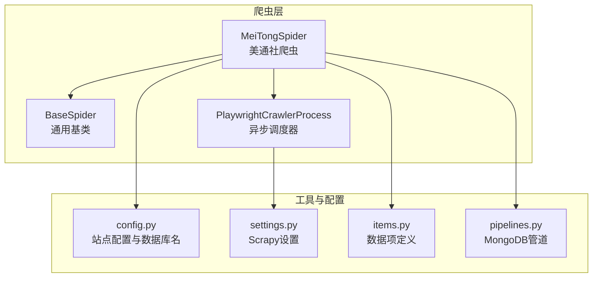
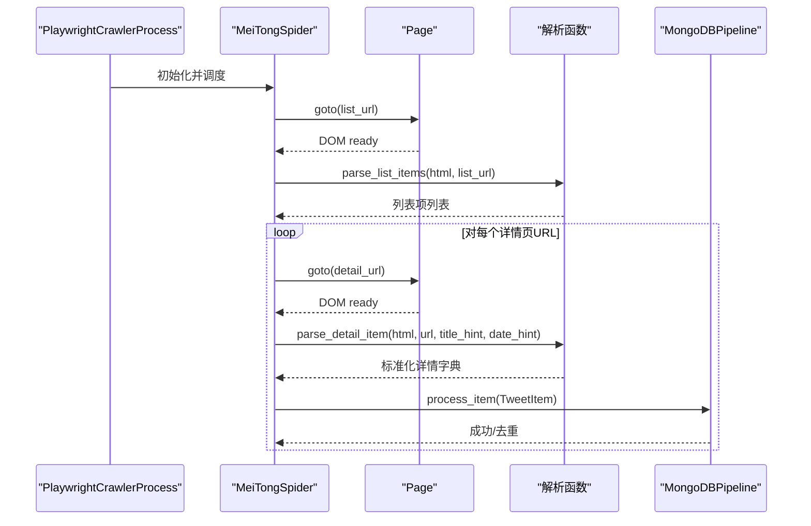
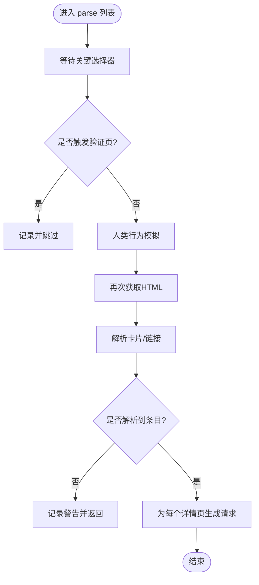
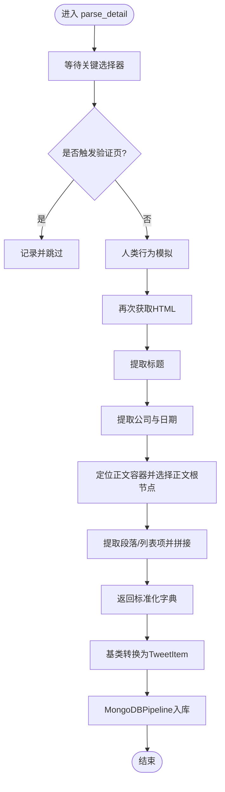
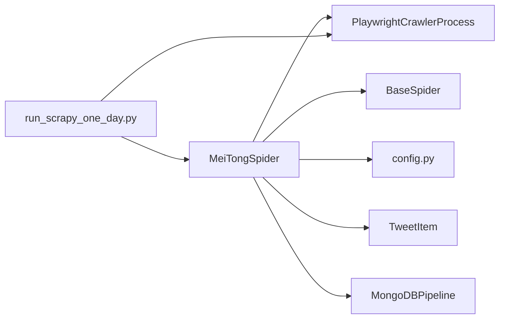

# 美通社爬虫

<cite>
**本文引用的文件**
- [mei_tong_spider.py](file://src/MarketNewsSpiderWithScrapy/mei_tong_spider.py)
- [BaseSpider.py](file://src/MarketNewsSpiderWithScrapy/BaseSpider.py)
- [BasePlayCrawler.py](file://src/MarketNewsSpiderWithScrapy/BasePlayCrawler.py)
- [items.py](file://src/Utils/items.py)
- [settings.py](file://src/settings.py)
- [pipelines.py](file://src/pipelines.py)
- [config.py](file://src/Utils/config.py)
- [run_scrapy_one_day.py](file://src/run_scrapy_one_day.py)
</cite>

## 目录
1. [简介](#简介)
2. [项目结构](#项目结构)
3. [核心组件](#核心组件)
4. [架构总览](#架构总览)
5. [详细组件分析](#详细组件分析)
6. [依赖分析](#依赖分析)
7. [性能考量](#性能考量)
8. [故障排查指南](#故障排查指南)
9. [结论](#结论)
10. [附录](#附录)

## 简介
本技术文档围绕“美通社（PR Newswire）爬虫”展开，系统性说明其企业新闻与PR稿的专业特性、新闻分类机制、列表页解析策略、异步页面处理与内容提取、详情页正文处理（含企业公告与商业新闻的特殊格式）、标准化新闻模板与企业信息提取、parse_detail方法中的信息抽取与数据清洗逻辑，以及反爬虫应对策略与数据准确性保障措施。文档面向具备一定技术背景的读者，同时尽量以图示与路径指引的方式降低理解门槛。

## 项目结构
本项目采用Scrapy与Playwright结合的异步爬虫架构，美通社爬虫位于MarketNewsSpiderWithScrapy目录下，配合通用基类、请求封装、管道与配置模块协同工作。

图表来源
- [mei_tong_spider.py:167-267](file://src/MarketNewsSpiderWithScrapy/mei_tong_spider.py#L167-L267)
- [BaseSpider.py:13-149](file://src/MarketNewsSpiderWithScrapy/BaseSpider.py#L13-L149)
- [BasePlayCrawler.py:21-120](file://src/MarketNewsSpiderWithScrapy/BasePlayCrawler.py#L21-L120)
- [config.py:398-437](file://src/Utils/config.py#L398-L437)
- [settings.py:1-49](file://src/settings.py#L1-L49)
- [items.py:5-18](file://src/Utils/items.py#L5-L18)
- [pipelines.py:8-56](file://src/pipelines.py#L8-L56)

章节来源
- [mei_tong_spider.py:1-267](file://src/MarketNewsSpiderWithScrapy/mei_tong_spider.py#L1-L267)
- [BaseSpider.py:1-149](file://src/MarketNewsSpiderWithScrapy/BaseSpider.py#L1-L149)
- [BasePlayCrawler.py:1-120](file://src/MarketNewsSpiderWithScrapy/BasePlayCrawler.py#L1-L120)
- [config.py:1-455](file://src/Utils/config.py#L1-L455)
- [settings.py:1-49](file://src/settings.py#L1-L49)
- [items.py:1-18](file://src/Utils/items.py#L1-L18)
- [pipelines.py:1-56](file://src/pipelines.py#L1-L56)

## 核心组件
- 美通社爬虫（MeiTongSpider）
  - 继承自BaseSpider，负责列表页与详情页的异步解析与数据产出。
  - 使用Playwright异步渲染页面，规避JavaScript渲染导致的静态HTML解析问题。
- 通用基类（BaseSpider）
  - 提供从段落到Item的转换、ML与LLM情感融合打分、MD5去重等通用能力。
- 异步调度器（PlaywrightCrawlerProcess）
  - 封装Playwright生命周期，统一UA、上下文隔离、并发调度与回调处理。
- 数据项（TweetItem）
  - 定义统一字段，便于入库与后续分析。
- 管道（MongoDBPipeline）
  - 按爬虫名称路由到不同数据库集合，自动去重。
- 配置（config.py）
  - 定义美通社各频道起始URL、分页规则、数据库名等。

章节来源
- [mei_tong_spider.py:167-267](file://src/MarketNewsSpiderWithScrapy/mei_tong_spider.py#L167-L267)
- [BaseSpider.py:13-149](file://src/MarketNewsSpiderWithScrapy/BaseSpider.py#L13-L149)
- [BasePlayCrawler.py:21-120](file://src/MarketNewsSpiderWithScrapy/BasePlayCrawler.py#L21-L120)
- [items.py:5-18](file://src/Utils/items.py#L5-L18)
- [pipelines.py:8-56](file://src/pipelines.py#L8-L56)
- [config.py:398-437](file://src/Utils/config.py#L398-L437)

## 架构总览
美通社爬虫采用“Playwright异步渲染 + Scrapy回调”的混合模式：
- 列表页：通过Playwright等待关键选择器加载，执行人类行为模拟，再解析卡片或链接，生成详情页请求。
- 详情页：同样等待关键元素加载，解析标题、日期、来源与正文，产出标准Item并通过管道入库。

图表来源
- [BasePlayCrawler.py:41-118](file://src/MarketNewsSpiderWithScrapy/BasePlayCrawler.py#L41-L118)
- [mei_tong_spider.py:201-267](file://src/MarketNewsSpiderWithScrapy/mei_tong_spider.py#L201-L267)
- [pipelines.py:25-46](file://src/pipelines.py#L25-L46)

## 详细组件分析

### 列表页解析策略与新闻分类机制
- 列表页选择器与卡片解析
  - 优先匹配新闻卡片容器，提取标题链接、信息文本（日期/来源）、摘要与主题标签。
  - 若未找到卡片结构，则回退到所有指向故事页的链接，保证覆盖率。
- 分页构建
  - 通过正则替换将基础URL中的页码后缀替换为当前页，支持多频道分页。
- 新闻分类
  - 美通社按频道划分（如专题、头条、上市公司新闻稿），配置中分别给出起始URL与分页上限，爬虫据此生成不同频道的列表请求。

图表来源
- [mei_tong_spider.py:201-233](file://src/MarketNewsSpiderWithScrapy/mei_tong_spider.py#L201-L233)
- [mei_tong_spider.py:59-117](file://src/MarketNewsSpiderWithScrapy/mei_tong_spider.py#L59-L117)

章节来源
- [mei_tong_spider.py:59-117](file://src/MarketNewsSpiderWithScrapy/mei_tong_spider.py#L59-L117)
- [config.py:400-437](file://src/Utils/config.py#L400-L437)

### 详情页正文处理机制（企业公告与商业新闻）
- 标题提取
  - 优先使用特定标题选择器，若不存在则回退到页面首H1或任意H1。
- 企业与时间提取
  - 从公司区块中提取公司名称与链接；同时从公司区块文本中正则匹配日期时间字符串作为最终日期。
- 正文提取
  - 定位正文容器，筛选直系子节点中非类名且非指定排除ID的div，取文本最长的div作为正文根节点。
  - 在正文根节点内提取段落与列表项，拼接为规范化文章正文。
- 输出标准化
  - 返回包含标题、URL、日期、来源、正文的标准字典，交由基类转换为Item。

图表来源
- [mei_tong_spider.py:234-267](file://src/MarketNewsSpiderWithScrapy/mei_tong_spider.py#L234-L267)
- [mei_tong_spider.py:120-164](file://src/MarketNewsSpiderWithScrapy/mei_tong_spider.py#L120-L164)
- [BaseSpider.py:100-146](file://src/MarketNewsSpiderWithScrapy/BaseSpider.py#L100-L146)

章节来源
- [mei_tong_spider.py:120-164](file://src/MarketNewsSpiderWithScrapy/mei_tong_spider.py#L120-L164)
- [BaseSpider.py:100-146](file://src/MarketNewsSpiderWithScrapy/BaseSpider.py#L100-L146)

### parse_detail方法的信息抽取与数据清洗逻辑
- 信息抽取
  - 标题：优先级选择器 -> 回退到页面H1。
  - 来源：公司区块中的链接文本。
  - 日期：优先使用详情页提供的日期提示，其次从公司区块文本中正则匹配。
  - 正文：正文容器内选择最长文本的div作为根，提取p/li节点并拼接。
- 数据清洗
  - 统一空白字符为单空格并去除首尾空白。
  - 去除全角换行符与多余换行，确保段落连贯。
  - 生成MD5作为唯一标识，避免重复入库。

章节来源
- [mei_tong_spider.py:120-164](file://src/MarketNewsSpiderWithScrapy/mei_tong_spider.py#L120-L164)
- [BaseSpider.py:100-146](file://src/MarketNewsSpiderWithScrapy/BaseSpider.py#L100-L146)

### 异步页面处理与内容提取实现
- 异步渲染
  - 使用Playwright等待关键选择器，避免静态HTML解析遗漏动态内容。
- 人类行为模拟
  - 随机延时与滚动、鼠标移动，降低被识别为机器人概率。
- 回调与并发
  - 通过自定义调度器统一管理浏览器生命周期与并发请求队列，支持多爬虫并发运行。

章节来源
- [BasePlayCrawler.py:41-118](file://src/MarketNewsSpiderWithScrapy/BasePlayCrawler.py#L41-L118)
- [mei_tong_spider.py:41-57](file://src/MarketNewsSpiderWithScrapy/mei_tong_spider.py#L41-L57)

### 反爬虫机制应对策略
- 验证页检测
  - 通过标题与内容关键词判断是否进入人机验证页，一旦命中立即跳过该页。
- UA轮换与上下文隔离
  - 随机UA与独立上下文，减少指纹关联与Cookie干扰。
- 人类行为模拟
  - 随机滚动、鼠标移动，模拟真实用户行为。
- 超时与重试
  - 列表页与详情页分别设置超时阈值，避免长时间等待。

章节来源
- [mei_tong_spider.py:18-24](file://src/MarketNewsSpiderWithScrapy/mei_tong_spider.py#L18-L24)
- [BasePlayCrawler.py:70-74](file://src/MarketNewsSpiderWithScrapy/BasePlayCrawler.py#L70-L74)
- [mei_tong_spider.py:13-16](file://src/MarketNewsSpiderWithScrapy/mei_tong_spider.py#L13-L16)

### 数据准确性保障措施
- 标准化输出
  - 统一字段命名与清洗规则，确保入库一致性。
- 去重机制
  - 基于URL的MD5生成唯一ID，MongoDB管道捕获重复键异常并忽略。
- 情感打分融合
  - ML与LLM打分融合，提升新闻情绪标注的稳定性与准确性。

章节来源
- [BaseSpider.py:100-146](file://src/MarketNewsSpiderWithScrapy/BaseSpider.py#L100-L146)
- [pipelines.py:48-56](file://src/pipelines.py#L48-L56)

## 依赖分析
- 美通社爬虫依赖
  - BaseSpider：通用数据转换与情感打分。
  - PlaywrightCrawlerProcess：异步调度与浏览器生命周期管理。
  - config：频道配置与数据库名映射。
  - items：统一数据结构。
  - pipelines：MongoDB入库与去重。
- 运行入口
  - run_scrapy_one_day：集中调度Playwright爬虫（含美通社）与Scrapy爬虫。

图表来源
- [mei_tong_spider.py:167-267](file://src/MarketNewsSpiderWithScrapy/mei_tong_spider.py#L167-L267)
- [BaseSpider.py:13-149](file://src/MarketNewsSpiderWithScrapy/BaseSpider.py#L13-L149)
- [BasePlayCrawler.py:21-120](file://src/MarketNewsSpiderWithScrapy/BasePlayCrawler.py#L21-L120)
- [config.py:398-437](file://src/Utils/config.py#L398-L437)
- [items.py:5-18](file://src/Utils/items.py#L5-L18)
- [pipelines.py:8-56](file://src/pipelines.py#L8-L56)
- [run_scrapy_one_day.py:43-64](file://src/run_scrapy_one_day.py#L43-L64)

章节来源
- [run_scrapy_one_day.py:43-64](file://src/run_scrapy_one_day.py#L43-L64)

## 性能考量
- 并发与资源
  - Playwright单浏览器多上下文，减少内存占用与Cookie干扰；并发数受系统与目标站点限制。
- 渲染与等待
  - 关键选择器等待与人类行为模拟增加时延，建议合理设置超时与重试次数。
- 数据清洗成本
  - 正文拼接与清洗在详情页阶段进行，避免后续处理复杂度上升。
- 存储吞吐
  - MongoDB单次插入，重复键异常忽略，适合高并发场景下的快速去重。

[本节为通用指导，无需具体文件引用]

## 故障排查指南
- 列表页为空或解析失败
  - 检查选择器是否匹配当前页面结构；确认是否触发验证页。
  - 查看日志中“解析失败”警告与“未解析到数据”提示。
- 详情页为空或标题缺失
  - 确认等待的关键选择器是否存在；检查人类行为是否执行。
  - 核对正则匹配日期的时间格式是否变化。
- 验证页拦截
  - 观察标题与内容是否包含阻断关键词；适当提高等待超时或调整UA。
- 入库重复
  - 确认MD5生成与去重逻辑；检查MongoDB集合索引是否正确。

章节来源
- [mei_tong_spider.py:201-233](file://src/MarketNewsSpiderWithScrapy/mei_tong_spider.py#L201-L233)
- [mei_tong_spider.py:234-267](file://src/MarketNewsSpiderWithScrapy/mei_tong_spider.py#L234-L267)
- [pipelines.py:48-56](file://src/pipelines.py#L48-L56)

## 结论
美通社爬虫通过Playwright异步渲染与人类行为模拟有效规避了动态内容与反爬虫挑战，结合统一的数据清洗与情感打分机制，实现了高质量的企业新闻与PR稿采集。其模块化设计便于扩展至其他新闻源，同时通过管道与配置中心化管理，提升了可维护性与可复用性。

[本节为总结，无需具体文件引用]

## 附录
- 如何运行美通社爬虫
  - 使用集中脚本启动Playwright爬虫（包含美通社），自动遍历配置中的各频道。
  - 参考路径：[run_scrapy_one_day.py:43-64](file://src/run_scrapy_one_day.py#L43-L64)
- 美通社频道配置
  - 包括专题、头条、上市公司新闻稿等频道的起始URL与分页上限。
  - 参考路径：[config.py:400-437](file://src/Utils/config.py#L400-L437)
- 数据项字段
  - 统一字段定义，便于下游分析与可视化。
  - 参考路径：[items.py:5-18](file://src/Utils/items.py#L5-L18)