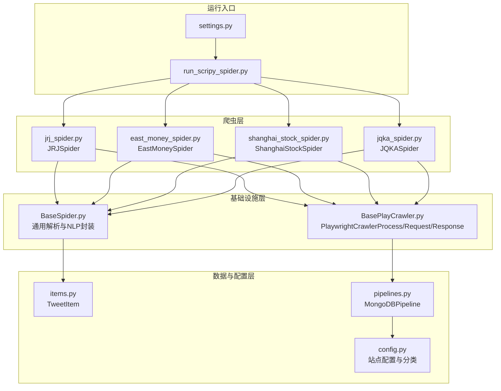
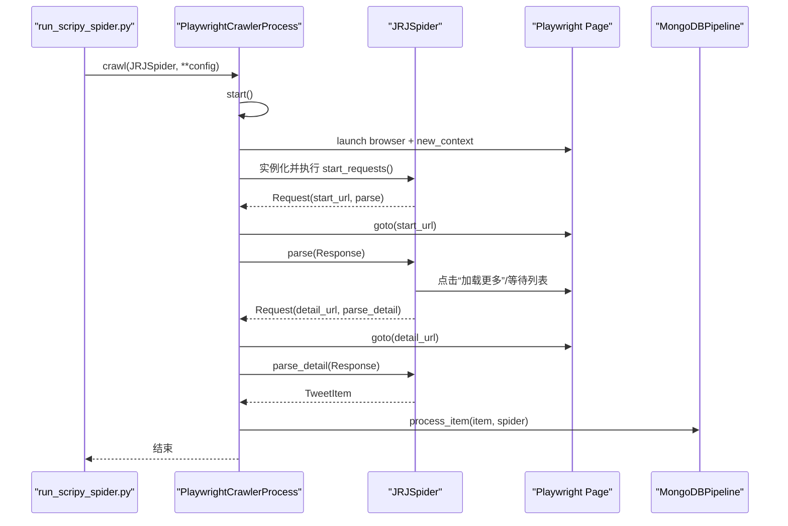
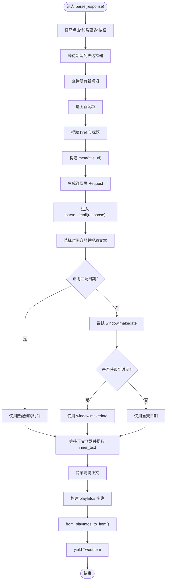
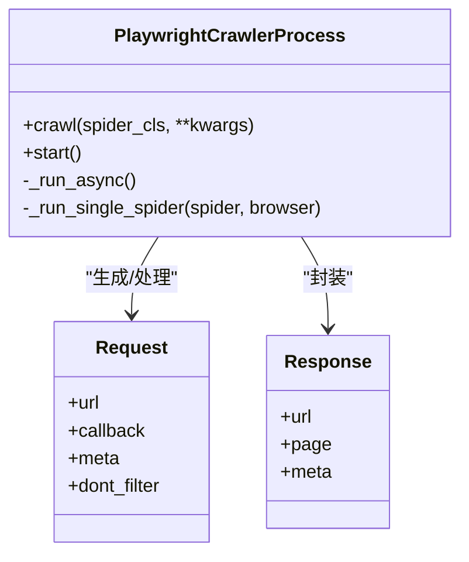
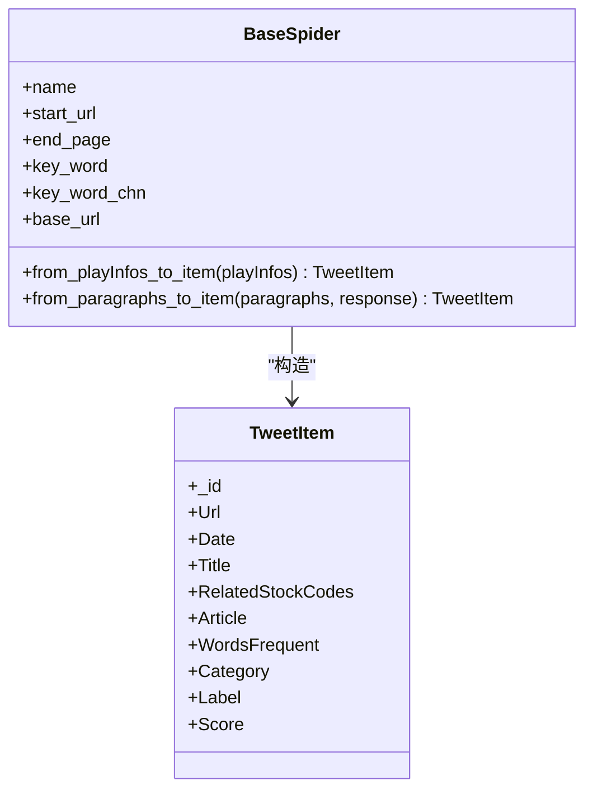
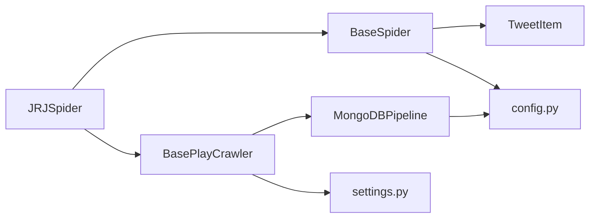

# 金融界爬虫

<cite>
**本文引用的文件**
- [jrj_spider.py](file://src/MarketNewsSpiderWithScrapy/jrj_spider.py)
- [BasePlayCrawler.py](file://src/MarketNewsSpiderWithScrapy/BasePlayCrawler.py)
- [BaseSpider.py](file://src/MarketNewsSpiderWithScrapy/BaseSpider.py)
- [config.py](file://src/Utils/config.py)
- [items.py](file://src/Utils/items.py)
- [pipelines.py](file://src/pipelines.py)
- [run_scripy_spider.py](file://src/run_scripy_spider.py)
- [README.md](file://README.md)
- [east_money_spider.py](file://src/MarketNewsSpiderWithScrapy/east_money_spider.py)
- [shanghai_stock_spider.py](file://src/MarketNewsSpiderWithScrapy/shanghai_stock_spider.py)
- [jqka_spider.py](file://src/MarketNewsSpiderWithScrapy/jqka_spider.py)
- [settings.py](file://src/settings.py)
</cite>

## 目录
1. [简介](#简介)
2. [项目结构](#项目结构)
3. [核心组件](#核心组件)
4. [架构总览](#架构总览)
5. [详细组件分析](#详细组件分析)
6. [依赖分析](#依赖分析)
7. [性能考虑](#性能考虑)
8. [故障排查指南](#故障排查指南)
9. [结论](#结论)
10. [附录](#附录)

## 简介
本技术文档面向金融界（jrj.com）爬虫实现，系统性梳理其页面结构解析、新闻分类机制、异步请求与页面元素等待逻辑、详情页正文提取与金融术语处理、时间戳转换、与BasePlayCrawler的继承关系及自定义parse方法的实现细节，并提供反爬虫应对与性能优化建议。文档同时结合配置与运行脚本，给出可操作的实践路径。

## 项目结构
该项目采用Scrapy风格的模块化组织，围绕“新闻爬虫 + 文本分析 + 数据存储”三层展开：
- 爬虫层：各站点爬虫（如金融界、东方财富、上证资讯等）继承统一基类，实现列表页与详情页解析。
- 基础设施层：通用爬虫调度器（PlaywrightCrawlerProcess）、通用Spider基类（BaseSpider）。
- 数据与配置层：MongoDB管道、项目配置（含各站点URL与分类）、Scrapy设置。

图表来源
- [run_scripy_spider.py:117-142](file://src/run_scripy_spider.py#L117-L142)
- [BasePlayCrawler.py:21-62](file://src/MarketNewsSpiderWithScrapy/BasePlayCrawler.py#L21-L62)
- [BaseSpider.py:13-33](file://src/MarketNewsSpiderWithScrapy/BaseSpider.py#L13-L33)
- [config.py:72-120](file://src/Utils/config.py#L72-L120)
- [pipelines.py:8-46](file://src/pipelines.py#L8-L46)
- [items.py:5-17](file://src/Utils/items.py#L5-L17)

章节来源
- [README.md:1-33](file://README.md#L1-L33)
- [run_scripy_spider.py:44-56](file://src/run_scripy_spider.py#L44-L56)
- [config.py:72-120](file://src/Utils/config.py#L72-L120)

## 核心组件
- JRJSpider：金融界新闻爬虫，负责列表页“加载更多”、新闻项定位与详情页请求；详情页提取发布时间与正文，调用通用NLP流程生成Item。
- PlaywrightCrawlerProcess：自定义异步调度器，支持多爬虫并发、独立上下文、统一Pipeline处理。
- BaseSpider：通用解析与NLP封装，提供from_playInfos_to_item统一构造TweetItem，集成股票代码识别与情感打分。
- 配置中心：集中管理各站点分类、URL、数据库命名空间与端到端参数。
- 管道：按站点名称路由至对应数据库集合，去重入库。

章节来源
- [jrj_spider.py:7-94](file://src/MarketNewsSpiderWithScrapy/jrj_spider.py#L7-L94)
- [BasePlayCrawler.py:21-120](file://src/MarketNewsSpiderWithScrapy/BasePlayCrawler.py#L21-L120)
- [BaseSpider.py:100-146](file://src/MarketNewsSpiderWithScrapy/BaseSpider.py#L100-L146)
- [config.py:72-120](file://src/Utils/config.py#L72-L120)
- [pipelines.py:8-46](file://src/pipelines.py#L8-L46)

## 架构总览
金融界爬虫采用“自定义调度器 + 继承基类”的架构：
- 自定义调度器：PlaywrightCrawlerProcess负责启动Chromium、创建独立上下文、并发调度爬虫、统一处理回调生成的Request与Item。
- 继承基类：JRJSpider继承BaseSpider，复用通用NLP与Item构造逻辑，仅实现列表页与详情页解析。
- 数据流：列表页解析产出详情页URL与元数据，详情页解析产出正文与时间，统一转换为TweetItem并写入MongoDB。

图表来源
- [run_scripy_spider.py:44-56](file://src/run_scripy_spider.py#L44-L56)
- [BasePlayCrawler.py:41-118](file://src/MarketNewsSpiderWithScrapy/BasePlayCrawler.py#L41-L118)
- [jrj_spider.py:14-94](file://src/MarketNewsSpiderWithScrapy/jrj_spider.py#L14-L94)
- [pipelines.py:25-46](file://src/pipelines.py#L25-L46)

## 详细组件分析

### JRJSpider：列表页与详情页解析
- 列表页解析
  - 动态加载处理：循环点击“加载更多”按钮，每次点击后等待2秒，确保AJAX内容渲染完成。
  - 新闻项定位：等待选择器出现后查询所有新闻项，提取链接与标题，构造元数据并生成详情页请求。
- 详情页解析
  - 时间戳提取：优先从特定选择器中提取文本并正则匹配标准日期格式；若失败则尝试从window变量读取；最终回退为当天日期。
  - 正文提取：等待正文容器出现后提取inner_text，进行简单清洗，构造playInfos字典。
  - Item生成：调用BaseSpider的from_playInfos_to_item，完成股票代码识别与情感打分，返回TweetItem。

图表来源
- [jrj_spider.py:17-94](file://src/MarketNewsSpiderWithScrapy/jrj_spider.py#L17-L94)
- [BaseSpider.py:100-146](file://src/MarketNewsSpiderWithScrapy/BaseSpider.py#L100-L146)

章节来源
- [jrj_spider.py:17-94](file://src/MarketNewsSpiderWithScrapy/jrj_spider.py#L17-L94)
- [BaseSpider.py:100-146](file://src/MarketNewsSpiderWithScrapy/BaseSpider.py#L100-L146)

### BasePlayCrawler：异步调度与回调处理
- Request/Response：模拟Scrapy的Request与Response，便于在异步环境中复用回调函数。
- PlaywrightCrawlerProcess：
  - 启动Chromium，为每个爬虫创建独立上下文，避免Cookie互相影响并节省内存。
  - 统一调度：支持start_requests生成初始请求，循环处理回调返回的Request或Item。
  - 回调处理：对异步回调生成器进行迭代，将Request插入队首继续处理，将Item交由Pipeline处理。
  - 特殊站点兼容：对部分站点（如上证资讯、同花顺）直接传入page与request，走自定义parse(page, request)流程。

图表来源
- [BasePlayCrawler.py:6-20](file://src/MarketNewsSpiderWithScrapy/BasePlayCrawler.py#L6-L20)
- [BasePlayCrawler.py:21-120](file://src/MarketNewsSpiderWithScrapy/BasePlayCrawler.py#L21-L120)

章节来源
- [BasePlayCrawler.py:21-120](file://src/MarketNewsSpiderWithScrapy/BasePlayCrawler.py#L21-L120)

### BaseSpider：通用解析与NLP封装
- from_playInfos_to_item：对正文进行清洗，调用信息抽取模块识别股票代码与名称，融合ML与LLM情感打分，构造TweetItem并设置字段。
- 通用字段：_id（URL MD5）、Url、Date、Title、RelatedStockCodes、Article、WordsFrequent、Category、Label、Score。

图表来源
- [BaseSpider.py:100-146](file://src/MarketNewsSpiderWithScrapy/BaseSpider.py#L100-L146)
- [items.py:5-17](file://src/Utils/items.py#L5-L17)

章节来源
- [BaseSpider.py:100-146](file://src/MarketNewsSpiderWithScrapy/BaseSpider.py#L100-L146)
- [items.py:5-17](file://src/Utils/items.py#L5-L17)

### 配置与运行：金融界分类与URL
- 金融界分类：研报精选、公告精选、机会情报、A股头条等，每类对应不同的起始URL与分类标签。
- 运行入口：run_scripy_spider.py按命令行参数批量添加多个爬虫任务，统一启动。

章节来源
- [config.py:72-120](file://src/Utils/config.py#L72-L120)
- [run_scripy_spider.py:44-56](file://src/run_scripy_spider.py#L44-L56)

### 数据存储：MongoDB管道与集合路由
- 按站点名称路由：jrj_news路由到jrj数据库集合，自动去重插入。
- 插件注册：settings.py中启用MongoDBPipeline，实现统一入库。

章节来源
- [pipelines.py:8-46](file://src/pipelines.py#L8-L46)
- [settings.py:32-47](file://src/settings.py#L32-L47)

## 依赖分析
- 组件耦合
  - JRJSpider依赖BaseSpider（通用NLP与Item构造）、BasePlayCrawler（异步调度与回调处理）。
  - BasePlayCrawler依赖pipelines（统一入库）与settings（用户代理池等）。
  - BaseSpider依赖Utils.items（TweetItem）与MongoDB工具（GenStockNewsDB）。
- 外部依赖
  - Playwright（异步浏览器）、MongoDB（存储）、Scrapy（框架约定）。

图表来源
- [jrj_spider.py:7-94](file://src/MarketNewsSpiderWithScrapy/jrj_spider.py#L7-L94)
- [BasePlayCrawler.py:21-120](file://src/MarketNewsSpiderWithScrapy/BasePlayCrawler.py#L21-L120)
- [BaseSpider.py:100-146](file://src/MarketNewsSpiderWithScrapy/BaseSpider.py#L100-L146)
- [pipelines.py:8-46](file://src/pipelines.py#L8-L46)
- [settings.py:32-47](file://src/settings.py#L32-L47)
- [config.py:72-120](file://src/Utils/config.py#L72-L120)
- [items.py:5-17](file://src/Utils/items.py#L5-L17)

章节来源
- [jrj_spider.py:7-94](file://src/MarketNewsSpiderWithScrapy/jrj_spider.py#L7-L94)
- [BasePlayCrawler.py:21-120](file://src/MarketNewsSpiderWithScrapy/BasePlayCrawler.py#L21-L120)
- [BaseSpider.py:100-146](file://src/MarketNewsSpiderWithScrapy/BaseSpider.py#L100-L146)
- [pipelines.py:8-46](file://src/pipelines.py#L8-L46)
- [settings.py:32-47](file://src/settings.py#L32-L47)
- [config.py:72-120](file://src/Utils/config.py#L72-L120)
- [items.py:5-17](file://src/Utils/items.py#L5-L17)

## 性能考虑
- 浏览器并发与上下文隔离：每个爬虫使用独立上下文，减少Cookie干扰并提升内存效率。
- 等待策略：列表页与详情页分别设置合理超时，避免长时间阻塞；详情页正文等待时间较短，兼顾稳定性。
- 加载更多策略：固定点击次数与等待间隔，平衡数据完整性与耗时。
- 数据清洗：统一清洗正文空白字符，减少后续NLP处理开销。
- 用户代理轮换：随机选择UA，降低被识别风险。

章节来源
- [BasePlayCrawler.py:41-118](file://src/MarketNewsSpiderWithScrapy/BasePlayCrawler.py#L41-L118)
- [jrj_spider.py:17-94](file://src/MarketNewsSpiderWithScrapy/jrj_spider.py#L17-L94)
- [BaseSpider.py:100-146](file://src/MarketNewsSpiderWithScrapy/BaseSpider.py#L100-L146)

## 故障排查指南
- 列表页加载超时
  - 现象：等待选择器超时或无新闻项。
  - 排查：检查网络环境、目标站点结构变化、等待超时阈值是否过低。
  - 参考实现：列表页等待选择器与异常捕获。
- 详情页正文为空
  - 现象：正文容器未出现或内容被隐藏。
  - 排查：确认选择器是否正确、页面是否完全渲染、是否存在动态注入。
  - 参考实现：详情页正文等待与回退策略。
- 时间戳提取失败
  - 现象：未匹配到日期或window变量为空。
  - 排查：检查页面结构、正则表达式、window变量可用性。
  - 参考实现：正则匹配与window.makedate回退。
- 反爬虫与验证码
  - 现象：出现人机验证或访问受限。
  - 应对：增加UA轮换、随机延时、模拟滚动与鼠标移动、限制请求频率。
  - 参考实现：通用反爬策略（见其他站点实现思路）。

章节来源
- [jrj_spider.py:25-31](file://src/MarketNewsSpiderWithScrapy/jrj_spider.py#L25-L31)
- [jrj_spider.py:56-70](file://src/MarketNewsSpiderWithScrapy/jrj_spider.py#L56-L70)
- [jrj_spider.py:64-70](file://src/MarketNewsSpiderWithScrapy/jrj_spider.py#L64-L70)
- [shanghai_stock_spider.py:17-28](file://src/MarketNewsSpiderWithScrapy/shanghai_stock_spider.py#L17-L28)
- [mei_tong_spider.py:41-53](file://src/MarketNewsSpiderWithScrapy/mei_tong_spider.py#L41-L53)

## 结论
金融界爬虫通过“自定义调度器 + 继承基类”的方式，实现了稳定的异步解析与统一的数据处理链路。其列表页“加载更多”与详情页正文提取策略清晰，时间戳提取具备多源回退机制，配合通用NLP与情感打分，能够高效产出可用于后续分析的结构化数据。建议在生产环境中进一步完善反爬虫应对与性能监控，持续适配目标站点结构变化。

## 附录
- 代码示例路径（不展示具体代码内容）
  - 列表页“加载更多”与新闻项提取：[jrj_spider.py:21-32](file://src/MarketNewsSpiderWithScrapy/jrj_spider.py#L21-L32)
  - 详情页时间戳提取与正文提取：[jrj_spider.py:56-79](file://src/MarketNewsSpiderWithScrapy/jrj_spider.py#L56-L79)
  - 详情页正文清洗与Item生成：[jrj_spider.py:79-91](file://src/MarketNewsSpiderWithScrapy/jrj_spider.py#L79-L91)
  - 异步调度器主循环与回调处理：[BasePlayCrawler.py:41-118](file://src/MarketNewsSpiderWithScrapy/BasePlayCrawler.py#L41-L118)
  - 通用NLP与Item构造：[BaseSpider.py:100-146](file://src/MarketNewsSpiderWithScrapy/BaseSpider.py#L100-L146)
  - 金融界分类配置：[config.py:72-120](file://src/Utils/config.py#L72-L120)
  - 运行入口批量添加金融界任务：[run_scripy_spider.py:44-56](file://src/run_scripy_spider.py#L44-L56)
  - MongoDB管道路由与去重：[pipelines.py:25-46](file://src/pipelines.py#L25-L46)
  - Scrapy插件注册与UA配置：[settings.py:32-47](file://src/settings.py#L32-L47)