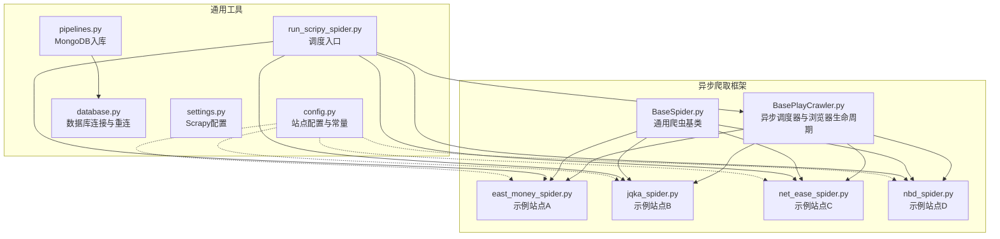
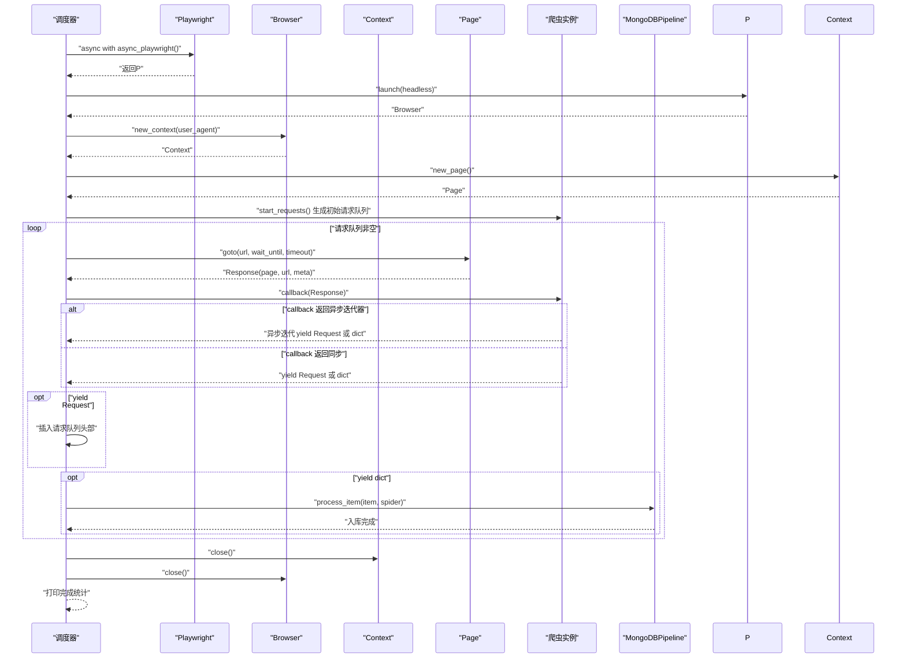
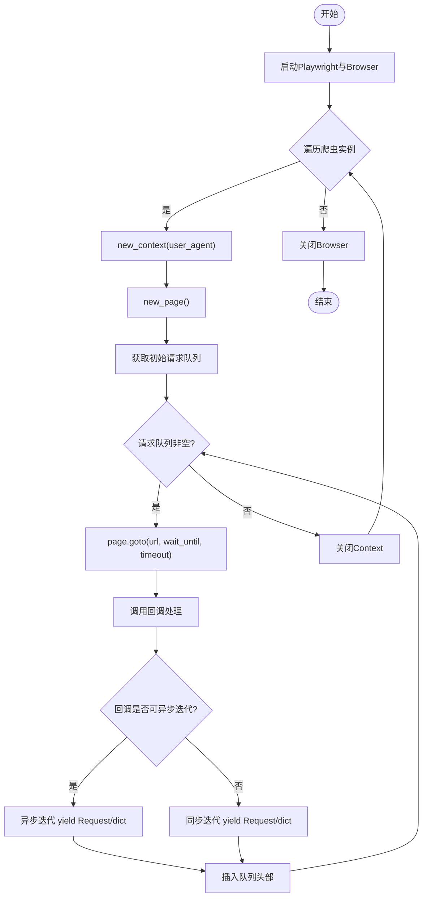
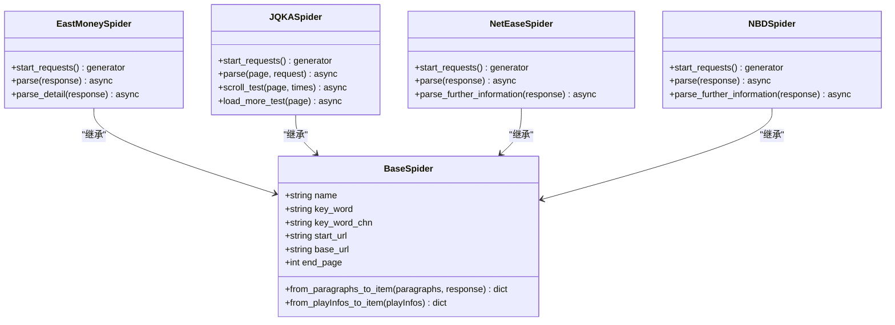
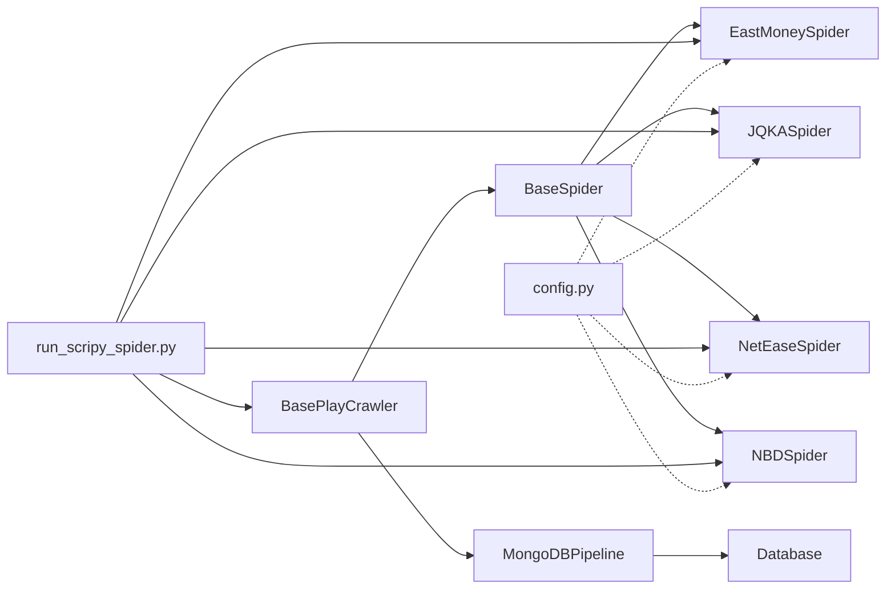

# 异步爬取机制

<cite>
**本文引用的文件**
- [BasePlayCrawler.py](file://src/MarketNewsSpiderWithScrapy/BasePlayCrawler.py)
- [BaseSpider.py](file://src/MarketNewsSpiderWithScrapy/BaseSpider.py)
- [east_money_spider.py](file://src/MarketNewsSpiderWithScrapy/east_money_spider.py)
- [jqka_spider.py](file://src/MarketNewsSpiderWithScrapy/jqka_spider.py)
- [net_ease_spider.py](file://src/MarketNewsSpiderWithScrapy/net_ease_spider.py)
- [nbd_spider.py](file://src/MarketNewsSpiderWithScrapy/nbd_spider.py)
- [pipelines.py](file://src/pipelines.py)
- [config.py](file://src/Utils/config.py)
- [database.py](file://src/Utils/database.py)
- [settings.py](file://src/settings.py)
- [run_scripy_spider.py](file://src/run_scripy_spider.py)
- [README.md](file://README.md)
</cite>

## 目录
1. [引言](#引言)
2. [项目结构](#项目结构)
3. [核心组件](#核心组件)
4. [架构总览](#架构总览)
5. [详细组件分析](#详细组件分析)
6. [依赖分析](#依赖分析)
7. [性能考量](#性能考量)
8. [故障排查指南](#故障排查指南)
9. [结论](#结论)
10. [附录](#附录)

## 引言
本文件面向“异步爬取机制”的技术文档，聚焦于基于异步IO与Playwright的爬取架构设计与性能优化策略。我们将深入解析BasePlayCrawler中的异步请求处理、并发控制与资源管理机制；对比异步与同步爬取在吞吐量、内存占用与用户体验方面的优势；给出可操作的配置参数调优指南（并发数、超时、重试）；总结错误处理与异常恢复策略；提供高并发稳定性与可靠性保障措施；并给出调试与性能监控方法。

## 项目结构
该项目采用模块化组织，围绕“新闻爬取—文本分析—数据库入库”的主线展开。与异步爬取直接相关的核心目录与文件如下：
- MarketNewsSpiderWithScrapy：自研异步爬虫框架与各站点爬虫实现
- Utils：通用配置、数据库连接与加密工具
- pipelines.py：统一的MongoDB入库管道
- settings.py：Scrapy基础配置（用于对比参考）
- run_scripy_spider.py：批量调度入口

图表来源
- [BasePlayCrawler.py:1-120](file://src/MarketNewsSpiderWithScrapy/BasePlayCrawler.py#L1-L120)
- [BaseSpider.py:1-149](file://src/MarketNewsSpiderWithScrapy/BaseSpider.py#L1-L149)
- [east_money_spider.py:1-78](file://src/MarketNewsSpiderWithScrapy/east_money_spider.py#L1-L78)
- [jqka_spider.py:1-80](file://src/MarketNewsSpiderWithScrapy/jqka_spider.py#L1-L80)
- [net_ease_spider.py:1-68](file://src/MarketNewsSpiderWithScrapy/net_ease_spider.py#L1-L68)
- [nbd_spider.py:1-67](file://src/MarketNewsSpiderWithScrapy/nbd_spider.py#L1-L67)
- [pipelines.py:1-56](file://src/pipelines.py#L1-L56)
- [config.py:1-455](file://src/Utils/config.py#L1-L455)
- [database.py:1-176](file://src/Utils/database.py#L1-L176)
- [settings.py:1-49](file://src/settings.py#L1-L49)
- [run_scripy_spider.py:1-145](file://src/run_scripy_spider.py#L1-L145)

章节来源
- [README.md:1-33](file://README.md#L1-L33)
- [run_scripy_spider.py:117-142](file://src/run_scripy_spider.py#L117-L142)

## 核心组件
- 异步调度器与浏览器生命周期：负责启动Playwright、按站点并发执行、统一关闭浏览器与上下文，确保资源可控释放。
- 爬虫基类：提供通用的数据清洗、特征抽取与入库项构造流程。
- 站点爬虫：继承基类，定义起始URL、分页策略、列表/详情解析逻辑，并通过异步回调yield新的请求或数据项。
- 数据入库管道：统一将不同站点产出的条目写入对应集合，具备去重能力。
- 通用配置与数据库：集中管理站点配置、数据库连接参数与自动重连策略。

章节来源
- [BasePlayCrawler.py:21-120](file://src/MarketNewsSpiderWithScrapy/BasePlayCrawler.py#L21-L120)
- [BaseSpider.py:13-149](file://src/MarketNewsSpiderWithScrapy/BaseSpider.py#L13-L149)
- [pipelines.py:8-56](file://src/pipelines.py#L8-L56)
- [config.py:55-450](file://src/Utils/config.py#L55-L450)
- [database.py:36-176](file://src/Utils/database.py#L36-L176)

## 架构总览
异步爬取的整体流程如下：
- 初始化：创建Playwright实例，按配置启动Chromium（可无头）。
- 并发调度：为每个爬虫实例创建独立的浏览器上下文与页面，将多个爬虫任务并发执行。
- 页面交互：对列表页等待元素加载、解析链接，进入详情页提取正文；或由站点特定逻辑直接构造数据项。
- 数据产出：回调函数yield Request（新增待爬URL）或yield dict（数据项），调度器统一处理。
- 入库与统计：数据项交由MongoDBPipeline入库，统计抓取数量。
- 资源回收：关闭上下文与浏览器，打印完成信息。

图表来源
- [BasePlayCrawler.py:41-118](file://src/MarketNewsSpiderWithScrapy/BasePlayCrawler.py#L41-L118)
- [pipelines.py:25-46](file://src/pipelines.py#L25-L46)

## 详细组件分析

### 组件A：异步调度器与浏览器生命周期（BasePlayCrawler）
- 异步主循环：使用asyncio.gather并发执行多个爬虫任务；每个任务拥有独立的Context与Page，避免Cookie与状态互相影响，同时降低内存占用。
- 超时与等待：列表页等待元素出现时设置timeout；详情页通过wait_until控制导航时机。
- 请求队列：支持在回调中yield Request，调度器将其插入队列头部，便于优先处理新发现的URL。
- 错误处理：捕获单个请求异常并记录，不影响其他并发任务；最终统一关闭上下文与浏览器。
- 资源管理：每个爬虫独立Context，减少跨任务干扰；浏览器在所有任务完成后统一关闭。

图表来源
- [BasePlayCrawler.py:41-118](file://src/MarketNewsSpiderWithScrapy/BasePlayCrawler.py#L41-L118)

章节来源
- [BasePlayCrawler.py:21-120](file://src/MarketNewsSpiderWithScrapy/BasePlayCrawler.py#L21-L120)

### 组件B：通用爬虫基类（BaseSpider）
- 通用初始化：注入关键词、起始URL、分页范围、股票映射字典等。
- 文章清洗与特征抽取：将段落合并、去除多余空白、抽取股票代码与分词，供后续情感分析与标签打分。
- 数据项构造：生成标准字段（标题、日期、URL、正文、相关股票、分类、标签、分数等），并计算MD5作为唯一标识。
- 与站点爬虫协作：通过继承该基类，各站点仅需实现start_requests与parse/parse_detail等方法。

图表来源
- [BaseSpider.py:13-149](file://src/MarketNewsSpiderWithScrapy/BaseSpider.py#L13-L149)
- [east_money_spider.py:5-78](file://src/MarketNewsSpiderWithScrapy/east_money_spider.py#L5-L78)
- [jqka_spider.py:8-80](file://src/MarketNewsSpiderWithScrapy/jqka_spider.py#L8-L80)
- [net_ease_spider.py:9-68](file://src/MarketNewsSpiderWithScrapy/net_ease_spider.py#L9-L68)
- [nbd_spider.py:7-67](file://src/MarketNewsSpiderWithScrapy/nbd_spider.py#L7-L67)

章节来源
- [BaseSpider.py:13-149](file://src/MarketNewsSpiderWithScrapy/BaseSpider.py#L13-L149)

### 组件C：站点爬虫（示例）
- 东方财富（EastMoneySpider）：生成多页URL，列表页等待元素出现后提取标题与时间，跳转详情页提取正文，最后yield数据项。
- 同花顺（JQKASpider）：通过滚动与“加载更多”按钮模拟瀑布流加载，定位新闻项后直接构造数据项（Article为空，Date为当天）。
- 网易（NetEaseSpider）：传统静态HTML解析，BeautifulSoup提取列表与详情正文。
- 每经网（NBDSpider）：类似网易，解析列表与详情正文。

章节来源
- [east_money_spider.py:12-78](file://src/MarketNewsSpiderWithScrapy/east_money_spider.py#L12-L78)
- [jqka_spider.py:15-80](file://src/MarketNewsSpiderWithScrapy/jqka_spider.py#L15-L80)
- [net_ease_spider.py:15-68](file://src/MarketNewsSpiderWithScrapy/net_ease_spider.py#L15-L68)
- [nbd_spider.py:13-67](file://src/MarketNewsSpiderWithScrapy/nbd_spider.py#L13-L67)

### 组件D：数据入库管道（MongoDBPipeline）
- 集合路由：根据spider.name选择对应数据库与集合，实现多站点数据隔离。
- 去重策略：使用insert_one并在DuplicateKeyError时忽略，避免重复入库。
- 与数据库工具协作：通过Database封装连接池与自动重连，提升稳定性。

章节来源
- [pipelines.py:8-56](file://src/pipelines.py#L8-L56)
- [database.py:36-176](file://src/Utils/database.py#L36-L176)

## 依赖分析
- 组件耦合与内聚
  - BasePlayCrawler与各站点爬虫通过回调协议解耦，仅依赖Request/Response约定与异步迭代器。
  - BaseSpider提供高内聚的数据清洗与特征抽取逻辑，被多个站点复用。
  - pipelines与database通过统一接口对接，降低耦合。
- 外部依赖
  - Playwright用于真实浏览器环境与动态内容渲染。
  - PyMongo用于MongoDB写入，配合Database的自动重连装饰器增强鲁棒性。
  - Scrapy配置（settings.py）用于对比参考，展示传统并发与下载策略。

图表来源
- [BasePlayCrawler.py:21-120](file://src/MarketNewsSpiderWithScrapy/BasePlayCrawler.py#L21-L120)
- [BaseSpider.py:13-149](file://src/MarketNewsSpiderWithScrapy/BaseSpider.py#L13-L149)
- [pipelines.py:8-56](file://src/pipelines.py#L8-L56)
- [database.py:36-176](file://src/Utils/database.py#L36-L176)
- [run_scripy_spider.py:117-142](file://src/run_scripy_spider.py#L117-L142)
- [config.py:55-450](file://src/Utils/config.py#L55-L450)

章节来源
- [run_scripy_spider.py:117-142](file://src/run_scripy_spider.py#L117-L142)

## 性能考量
- 吞吐量提升
  - 并发执行：每个爬虫独立Context/Page，使用asyncio.gather并发调度，显著提升整体吞吐。
  - 流水线化：列表页与详情页解析分离，回调中可立即yield新请求，缩短空闲时间。
- 内存占用优化
  - 独立Context隔离Cookie与状态，避免跨任务污染；任务结束后及时关闭，降低内存峰值。
  - 列表页等待元素出现时设置合理timeout，避免长时间阻塞。
- 用户体验改善
  - 无头模式可配置，便于在服务器上运行；日志输出明确任务进度与错误，便于排障。
- 配置参数调优指南
  - 并发数：根据CPU与网络带宽调整，建议从较低并发开始逐步提升，观察错误率与延迟。
  - 超时控制：列表页等待元素timeout建议≥30秒，详情页等待渲染timeout建议≥5秒；结合wait_until选择合适的时机。
  - 重试机制：可在回调中对偶发失败的URL进行有限次重试（如最多3次），并指数退避。
  - 下载延迟：若目标站点限流明显，可适当增加DOWNLOAD_DELAY（参考settings.py中的默认值）。
  - User-Agent轮换：随机选择UA，降低被反爬识别概率。
- 实际性能测试与优化建议
  - 建议在相同网络环境下分别测试不同并发数下的QPS、P95延迟与错误率，选取最优组合。
  - 对于高负载站点，优先使用独立Context与合理的超时策略，避免单点阻塞。
  - 使用数据库批量写入（如批量insert）可进一步降低入库开销（当前pipeline为逐条insert，可评估优化）。
- 高并发稳定性与可靠性保障
  - 自动重连：Database提供graceful_auto_reconnect装饰器，自动指数退避重连，降低断连影响。
  - 去重与幂等：以URL哈希为键的去重策略，避免重复入库。
  - 资源回收：统一关闭Context与Browser，防止句柄泄漏。
  - 错误隔离：单个请求异常不影响其他并发任务，确保系统整体可用性。

章节来源
- [BasePlayCrawler.py:41-118](file://src/MarketNewsSpiderWithScrapy/BasePlayCrawler.py#L41-L118)
- [database.py:15-34](file://src/Utils/database.py#L15-L34)
- [settings.py:18-47](file://src/settings.py#L18-L47)

## 故障排查指南
- 常见问题与定位
  - 列表页元素未出现：检查wait_for_selector选择器与timeout设置；确认目标站点结构变化。
  - 详情页正文提取失败：确认等待元素与选择器；对异常URL进行重试。
  - 数据库写入失败：关注DuplicateKeyError与连接异常；启用自动重连装饰器。
  - 超时与阻塞：适当提高timeout与wait_until；必要时降低并发数。
- 调试工具与方法
  - 日志输出：利用调度器与爬虫中的print输出，跟踪任务进度与错误URL。
  - 无头/有头切换：通过settings中的headless选项切换，便于本地调试页面行为。
  - 断点与单步：在回调中对关键步骤添加断点，观察Response/page状态。
  - 性能监控：记录每任务耗时、QPS、错误率，绘制趋势图以便优化。

章节来源
- [BasePlayCrawler.py:86-118](file://src/MarketNewsSpiderWithScrapy/BasePlayCrawler.py#L86-L118)
- [pipelines.py:48-56](file://src/pipelines.py#L48-L56)
- [database.py:15-34](file://src/Utils/database.py#L15-L34)

## 结论
本异步爬取机制通过Playwright的真实浏览器渲染能力与asyncio并发调度，实现了高吞吐、低耦合与强扩展性的新闻采集体系。其核心优势在于：
- 异步IO与并发控制：显著提升整体吞吐与资源利用率。
- 独立Context与严格的资源回收：降低内存占用与跨任务干扰。
- 统一的回调协议与数据项构造：简化站点适配成本。
- 完备的错误处理与自动重连：在高并发场景下保障稳定性与可靠性。

建议在生产环境中结合站点特性与网络条件，持续优化并发数、超时与重试策略，并配合数据库批量写入与监控体系，获得更佳的性能与稳定性。

## 附录
- 配置参考
  - 并发与超时：参考settings.py中的CONCURRENT_REQUESTS、DOWNLOAD_TIMEOUT等；异步部分可按站点回调设置wait_until与timeout。
  - 站点配置：通过config.py集中管理各站点的起始URL、分页范围与数据库命名。
- 调度入口
  - run_scripy_spider.py提供批量调度入口，支持按类别启动多个站点爬虫。

章节来源
- [settings.py:18-47](file://src/settings.py#L18-L47)
- [config.py:55-450](file://src/Utils/config.py#L55-L450)
- [run_scripy_spider.py:117-142](file://src/run_scripy_spider.py#L117-L142)