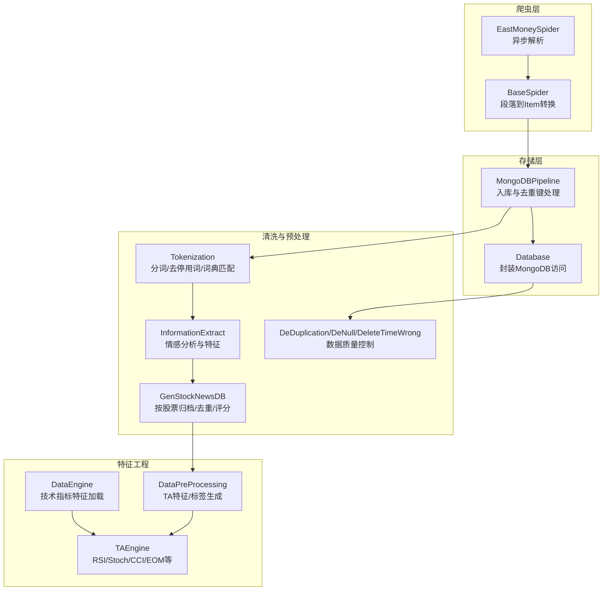
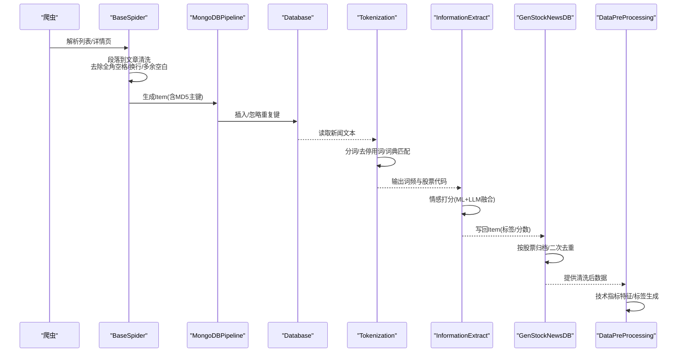
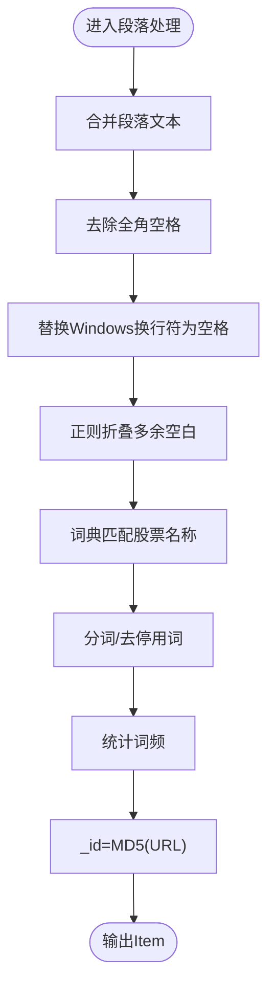
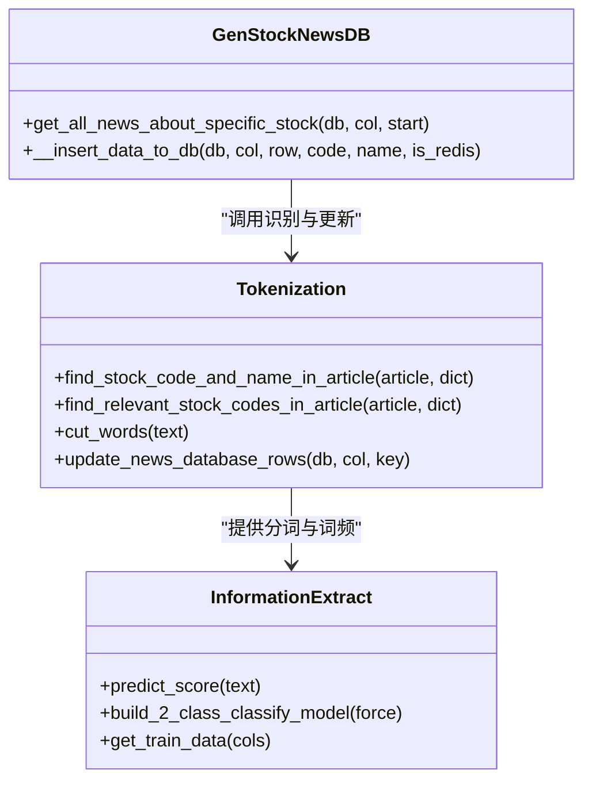
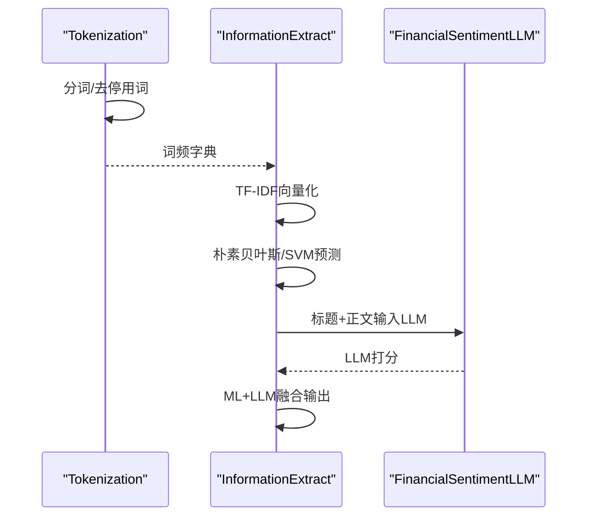
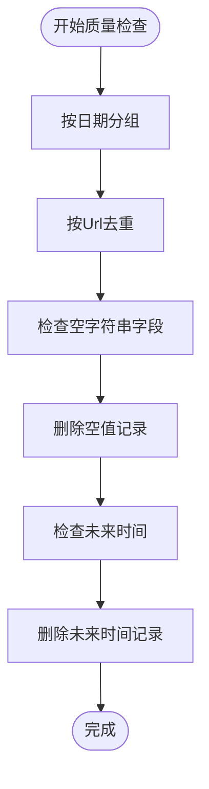
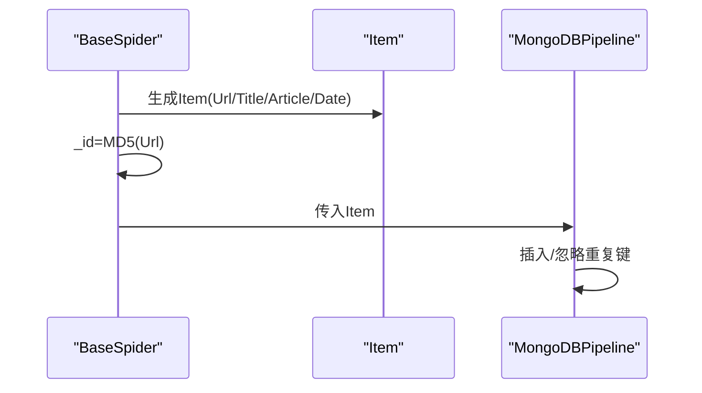
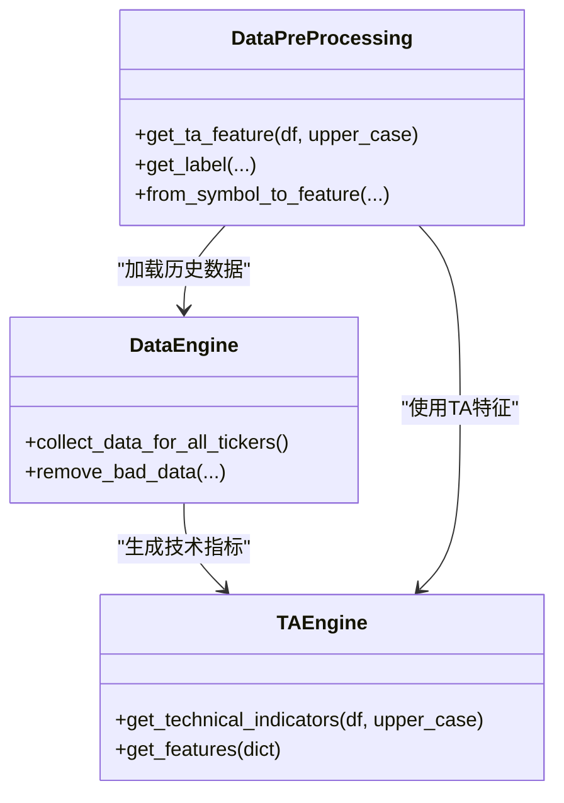
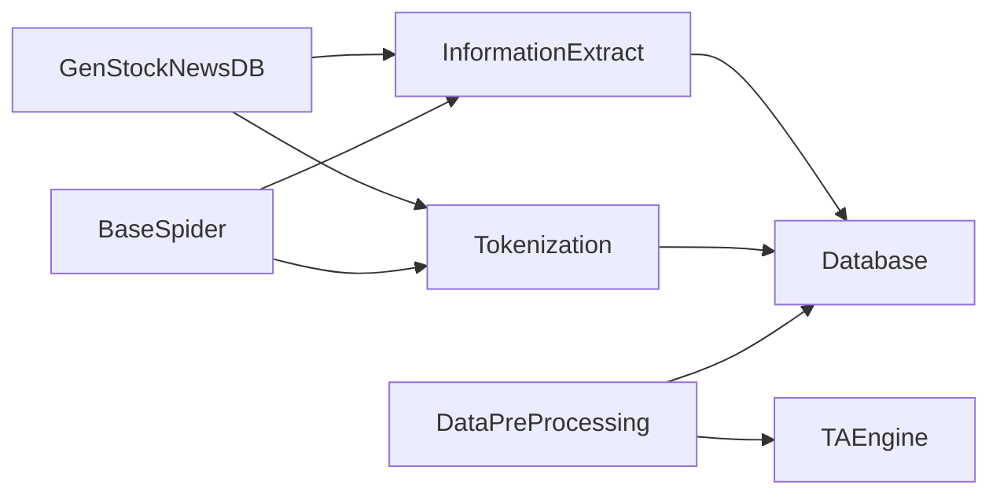

# 数据处理与清洗

<cite>
**本文引用的文件**
- [src/NlpModel/DataPreProcessing.py](file://src/NlpModel/DataPreProcessing.py)
- [src/MongoDbComTools/DeDuplicationNull.py](file://src/MongoDbComTools/DeDuplicationNull.py)
- [src/ThirdPartyToolSurpriver/detection_engine.py](file://src/ThirdPartyToolSurpriver/detection_engine.py)
- [src/Utils/utils.py](file://src/Utils/utils.py)
- [src/pipelines.py](file://src/pipelines.py)
- [src/MarketNewsSpiderWithScrapy/BaseSpider.py](file://src/MarketNewsSpiderWithScrapy/BaseSpider.py)
- [src/MarketNewsSpiderWithScrapy/east_money_spider.py](file://src/MarketNewsSpiderWithScrapy/east_money_spider.py)
- [src/ThirdPartyToolSurpriver/data_loader.py](file://src/ThirdPartyToolSurpriver/data_loader.py)
- [src/ThirdPartyToolSurpriver/feature_generator.py](file://src/ThirdPartyToolSurpriver/feature_generator.py)
- [src/Utils/items.py](file://src/Utils/items.py)
- [src/Utils/config.py](file://src/Utils/config.py)
- [src/NlpModel/tokenization.py](file://src/NlpModel/tokenization.py)
- [src/Utils/database.py](file://src/Utils/database.py)
- [src/NlpModel/information_extract.py](file://src/NlpModel/information_extract.py)
- [src/MongoDbComTools/BuildStockNewsDb.py](file://src/MongoDbComTools/BuildStockNewsDb.py)
</cite>

## 目录
1. [引言](#引言)
2. [项目结构](#项目结构)
3. [核心组件](#核心组件)
4. [架构总览](#架构总览)
5. [详细组件分析](#详细组件分析)
6. [依赖分析](#依赖分析)
7. [性能考虑](#性能考虑)
8. [故障排查指南](#故障排查指南)
9. [结论](#结论)
10. [附录](#附录)

## 引言
本技术文档围绕“数据处理与清洗”主题，系统梳理从新闻爬取到文本预处理、实体识别、情感分析、特征工程、数据质量控制与去重、以及最终特征产出的全流程。文档重点覆盖以下方面：
- 爬取数据的预处理：文本清理、格式标准化、段落处理与空白字符清理
- 股票代码与名称的自动识别：基于词典匹配与分词策略
- 情感分析前的文本预处理：分词、去停用词、特征提取
- 数据质量检查与异常数据处理：空值删除、时间异常过滤、重复项清理
- MD5 去重与主键生成：基于 URL 或复合键的哈希去重
- 数据格式转换与标准化：统一字段、统一日期格式、统一数值类型
- 完整性验证与错误标记：缺失字段检测、异常值过滤
- 性能优化与批量处理策略：批处理、管道化、缓存与索引

## 项目结构
该项目采用模块化组织方式，围绕“爬虫 -> 存储 -> 清洗 -> 特征 -> 模型”的流水线展开。关键目录与职责如下：
- MarketNewsSpiderWithScrapy：Scrapy 爬虫基类与各站点实现，负责页面解析、正文抽取与基础清洗
- NlpModel：文本预处理、分词、停用词、情感分析模型与特征工程
- MongoDbComTools：数据库工具，包括去重、空值清理、时间异常清理
- ThirdPartyToolSurpriver：第三方异常检测工具（技术指标特征生成与异常检测）
- Utils：通用配置、数据库封装、工具函数、Scrapy Item 定义
- pipelines.py：Scrapy Pipeline，负责入库与重复键处理

**图表来源**
- [src/MarketNewsSpiderWithScrapy/BaseSpider.py:41-98](file://src/MarketNewsSpiderWithScrapy/BaseSpider.py#L41-L98)
- [src/MarketNewsSpiderWithScrapy/east_money_spider.py:21-77](file://src/MarketNewsSpiderWithScrapy/east_money_spider.py#L21-L77)
- [src/pipelines.py:25-56](file://src/pipelines.py#L25-L56)
- [src/Utils/database.py:94-172](file://src/Utils/database.py#L94-L172)
- [src/NlpModel/tokenization.py:27-75](file://src/NlpModel/tokenization.py#L27-L75)
- [src/NlpModel/information_extract.py:219-235](file://src/NlpModel/information_extract.py#L219-L235)
- [src/MongoDbComTools/BuildStockNewsDb.py:157-238](file://src/MongoDbComTools/BuildStockNewsDb.py#L157-L238)
- [src/NlpModel/DataPreProcessing.py:34-40](file://src/NlpModel/DataPreProcessing.py#L34-L40)
- [src/ThirdPartyToolSurpriver/data_loader.py:148-224](file://src/ThirdPartyToolSurpriver/data_loader.py#L148-L224)
- [src/ThirdPartyToolSurpriver/feature_generator.py:31-161](file://src/ThirdPartyToolSurpriver/feature_generator.py#L31-L161)

**章节来源**
- [src/Utils/config.py:55-450](file://src/Utils/config.py#L55-L450)
- [src/Utils/items.py:5-17](file://src/Utils/items.py#L5-L17)

## 核心组件
- 文本预处理与情感分析
  - 分词与去停用词：基于结巴分词或 pkuseg，结合中文停用词表与用户词典
  - 股票代码与名称识别：直接字符串匹配词典，同时统计词频
  - 情感打分：朴素贝叶斯与 SVM 的 TF-IDF 向量融合，输出“利好/利空”及置信度
- 爬取数据清洗
  - 段落到文章：合并段落、去除全角空格、换行符替换为空格、多余空白折叠
  - URL 去重：MD5 哈希作为主键，避免重复入库
- 数据质量控制
  - 去重：按 URL 去重，逐日扫描，删除重复记录
  - 空值清理：删除空字符串字段的记录
  - 时间异常清理：删除未来时间的记录
- 特征工程
  - 技术指标特征：RSI、Stochastic、CCI、Ease of Movement、成交量变化率等
  - 标签生成：基于周涨跌幅区间划分多分类或二分类标签
- 存储与归档
  - 按股票代码归档至独立集合，统一主键与字段结构

**章节来源**
- [src/NlpModel/tokenization.py:27-103](file://src/NlpModel/tokenization.py#L27-L103)
- [src/NlpModel/information_extract.py:219-235](file://src/NlpModel/information_extract.py#L219-L235)
- [src/MarketNewsSpiderWithScrapy/BaseSpider.py:41-98](file://src/MarketNewsSpiderWithScrapy/BaseSpider.py#L41-L98)
- [src/MongoDbComTools/DeDuplicationNull.py:22-88](file://src/MongoDbComTools/DeDuplicationNull.py#L22-L88)
- [src/ThirdPartyToolSurpriver/feature_generator.py:31-161](file://src/ThirdPartyToolSurpriver/feature_generator.py#L31-L161)
- [src/NlpModel/DataPreProcessing.py:119-301](file://src/NlpModel/DataPreProcessing.py#L119-L301)
- [src/MongoDbComTools/BuildStockNewsDb.py:157-238](file://src/MongoDbComTools/BuildStockNewsDb.py#L157-L238)

## 架构总览
下图展示从爬取到入库、清洗、特征生成与质量控制的整体流程。

**图表来源**
- [src/MarketNewsSpiderWithScrapy/east_money_spider.py:21-77](file://src/MarketNewsSpiderWithScrapy/east_money_spider.py#L21-L77)
- [src/MarketNewsSpiderWithScrapy/BaseSpider.py:41-98](file://src/MarketNewsSpiderWithScrapy/BaseSpider.py#L41-L98)
- [src/pipelines.py:25-56](file://src/pipelines.py#L25-L56)
- [src/Utils/database.py:94-172](file://src/Utils/database.py#L94-L172)
- [src/NlpModel/tokenization.py:27-103](file://src/NlpModel/tokenization.py#L27-L103)
- [src/NlpModel/information_extract.py:219-235](file://src/NlpModel/information_extract.py#L219-L235)
- [src/MongoDbComTools/BuildStockNewsDb.py:157-238](file://src/MongoDbComTools/BuildStockNewsDb.py#L157-L238)
- [src/NlpModel/DataPreProcessing.py:119-301](file://src/NlpModel/DataPreProcessing.py#L119-L301)

## 详细组件分析

### 组件A：文本清理与段落处理
- 段落到文章
  - 合并段落元素，逐段提取文本并拼接
  - 去除全角空格与 Windows 换行符，统一替换为单个空格
  - 使用正则对多余空白进行折叠与去噪
- 股票识别
  - 词典匹配：直接在原文中查找股票名称，命中即记录代码
  - 分词统计：对分词结果按频率排序，形成词频字典
- MD5 去重
  - 使用 URL 的 MD5 作为 Item 的主键，入库前去重

**图表来源**
- [src/MarketNewsSpiderWithScrapy/BaseSpider.py:41-98](file://src/MarketNewsSpiderWithScrapy/BaseSpider.py#L41-L98)
- [src/NlpModel/tokenization.py:27-103](file://src/NlpModel/tokenization.py#L27-L103)

**章节来源**
- [src/MarketNewsSpiderWithScrapy/BaseSpider.py:41-98](file://src/MarketNewsSpiderWithScrapy/BaseSpider.py#L41-L98)
- [src/Utils/items.py:5-17](file://src/Utils/items.py#L5-L17)

### 组件B：股票代码与名称识别算法
- 词典策略
  - 从数据库加载股票名称到代码映射，构造字典
  - 在原文中直接进行子串匹配，收集命中股票
- 分词策略
  - 对原文进行中文分词，过滤停用词与非中文词汇
  - 统计词频，形成词频字典，辅助后续情感分析
- 用户词典与停用词
  - 支持加载用户词典与停用词目录，提升识别准确率

**图表来源**
- [src/NlpModel/tokenization.py:27-103](file://src/NlpModel/tokenization.py#L27-L103)
- [src/NlpModel/information_extract.py:219-235](file://src/NlpModel/information_extract.py#L219-L235)
- [src/MongoDbComTools/BuildStockNewsDb.py:157-238](file://src/MongoDbComTools/BuildStockNewsDb.py#L157-L238)

**章节来源**
- [src/NlpModel/tokenization.py:27-103](file://src/NlpModel/tokenization.py#L27-L103)
- [src/Utils/config.py:30-37](file://src/Utils/config.py#L30-L37)

### 组件C：情感分析前的文本预处理
- 分词与去停用词
  - 使用结巴分词或 pkuseg，加载用户词典与停用词目录
  - 过滤非中文、制表符、长度过短的词
- 特征提取
  - 将标题与正文拼接后进行 TF-IDF 向量化
  - 使用朴素贝叶斯与 SVM 进行二分类，输出“利好/利空”与概率
- 模型融合
  - ML 模型与 LLM 模型打分融合，综合输出最终标签与置信度

**图表来源**
- [src/NlpModel/tokenization.py:77-103](file://src/NlpModel/tokenization.py#L77-L103)
- [src/NlpModel/information_extract.py:219-235](file://src/NlpModel/information_extract.py#L219-L235)
- [src/MongoDbComTools/BuildStockNewsDb.py:49-52](file://src/MongoDbComTools/BuildStockNewsDb.py#L49-L52)

**章节来源**
- [src/NlpModel/information_extract.py:260-338](file://src/NlpModel/information_extract.py#L260-L338)
- [src/Utils/config.py:453-454](file://src/Utils/config.py#L453-L454)

### 组件D：数据质量检查与异常处理
- 去重
  - 按日期分组，对每组按 URL 去重，删除重复记录
- 空值清理
  - 删除空字符串字段的记录，避免无效数据污染
- 时间异常清理
  - 删除日期在未来时间的记录，确保时间一致性

**图表来源**
- [src/MongoDbComTools/DeDuplicationNull.py:22-88](file://src/MongoDbComTools/DeDuplicationNull.py#L22-L88)

**章节来源**
- [src/MongoDbComTools/DeDuplicationNull.py:15-113](file://src/MongoDbComTools/DeDuplicationNull.py#L15-L113)

### 组件E：MD5 哈希去重与主键生成
- URL 哈希
  - 使用 URL 的 MD5 作为 Item 的主键，入库前去重
- 复合键哈希
  - 对“日期+URL”组合进行哈希，用于跨库归档场景

**图表来源**
- [src/MarketNewsSpiderWithScrapy/BaseSpider.py:84-98](file://src/MarketNewsSpiderWithScrapy/BaseSpider.py#L84-L98)
- [src/pipelines.py:48-56](file://src/pipelines.py#L48-L56)
- [src/MongoDbComTools/BuildStockNewsDb.py:85-87](file://src/MongoDbComTools/BuildStockNewsDb.py#L85-L87)

**章节来源**
- [src/MarketNewsSpiderWithScrapy/BaseSpider.py:84-98](file://src/MarketNewsSpiderWithScrapy/BaseSpider.py#L84-L98)
- [src/MongoDbComTools/BuildStockNewsDb.py:85-87](file://src/MongoDbComTools/BuildStockNewsDb.py#L85-L87)

### 组件F：技术指标特征与标签生成
- 技术指标特征
  - 计算 RSI、Stochastic、CCI、Ease of Movement、成交量变化率等
  - 计算斜率、相关系数与显著性，形成时间窗口内的趋势特征
- 标签生成
  - 基于周涨跌幅划分多分类或二分类标签
  - 过滤缺失特征与空值，保证特征矩阵一致性

**图表来源**
- [src/ThirdPartyToolSurpriver/feature_generator.py:31-161](file://src/ThirdPartyToolSurpriver/feature_generator.py#L31-L161)
- [src/ThirdPartyToolSurpriver/data_loader.py:148-224](file://src/ThirdPartyToolSurpriver/data_loader.py#L148-L224)
- [src/NlpModel/DataPreProcessing.py:34-301](file://src/NlpModel/DataPreProcessing.py#L34-L301)

**章节来源**
- [src/ThirdPartyToolSurpriver/feature_generator.py:10-186](file://src/ThirdPartyToolSurpriver/feature_generator.py#L10-L186)
- [src/ThirdPartyToolSurpriver/data_loader.py:16-293](file://src/ThirdPartyToolSurpriver/data_loader.py#L16-L293)
- [src/NlpModel/DataPreProcessing.py:119-301](file://src/NlpModel/DataPreProcessing.py#L119-L301)

## 依赖分析
- 组件耦合
  - BaseSpider 依赖 Tokenization 与 InformationExtract 完成文本预处理与情感打分
  - GenStockNewsDB 依赖 Tokenization 完成增量字段更新与按股票归档
  - DataPreProcessing 依赖 TAEngine 与数据库工具生成标签与技术特征
- 外部依赖
  - MongoDB：统一存储与查询
  - Scrapy：异步爬取与 Item 流程
  - 第三方库：jieba、sklearn、ta（技术指标）、pymongo（数据库）

**图表来源**
- [src/MarketNewsSpiderWithScrapy/BaseSpider.py:62-71](file://src/MarketNewsSpiderWithScrapy/BaseSpider.py#L62-L71)
- [src/MongoDbComTools/BuildStockNewsDb.py:180-183](file://src/MongoDbComTools/BuildStockNewsDb.py#L180-L183)
- [src/NlpModel/DataPreProcessing.py:22-29](file://src/NlpModel/DataPreProcessing.py#L22-L29)

**章节来源**
- [src/Utils/database.py:94-172](file://src/Utils/database.py#L94-L172)
- [src/Utils/config.py:39-49](file://src/Utils/config.py#L39-L49)

## 性能考虑
- 批量处理
  - 使用 Scrapy 的异步请求与分页，减少等待时间
  - 数据库批量插入与去重操作按日期分组，降低锁竞争
- 缓存与索引
  - 词典与停用词一次性加载，避免重复 IO
  - MongoDB 集合建立必要索引（如 Date、Url、_id），加速查询与去重
- 特征工程优化
  - 技术指标计算仅保留必要窗口，避免超大数据集
  - 使用稀疏矩阵与向量化操作，降低内存占用
- 并发与资源
  - 多进程/多协程并行处理不同站点与不同股票集合
  - 控制数据库连接池大小与超时参数，提升稳定性

## 故障排查指南
- 爬取失败
  - 检查目标页面选择器是否正确，确认等待与超时设置
  - 查看网络请求状态码与响应体编码
- 文本清洗异常
  - 确认分词模块与停用词路径配置正确
  - 检查正则表达式是否覆盖所有换行与空白变体
- 情感模型未生效
  - 确认模型文件存在且可加载
  - 检查 TF-IDF 向量化词汇表是否一致
- 去重与入库问题
  - 检查 _id 是否为 MD5，确认重复键异常捕获
  - 核对数据库连接参数与权限
- 时间异常
  - 检查日期字符串格式与时区设置
  - 确保未来时间清理逻辑执行

**章节来源**
- [src/MarketNewsSpiderWithScrapy/east_money_spider.py:27-30](file://src/MarketNewsSpiderWithScrapy/east_money_spider.py#L27-L30)
- [src/pipelines.py:52-55](file://src/pipelines.py#L52-L55)
- [src/MongoDbComTools/DeDuplicationNull.py:99-113](file://src/MongoDbComTools/DeDuplicationNull.py#L99-L113)

## 结论
本项目在数据处理与清洗方面形成了从“爬取 -> 清洗 -> 识别 -> 情感 -> 特征 -> 质量控制”的闭环。通过分词与词典匹配实现稳健的股票识别，借助 TF-IDF 与多模型融合提升情感分析效果，配合 MD5 去重与多维质量检查保障数据质量。技术指标特征与标签生成进一步为后续建模提供高质量输入。建议在生产环境中强化索引、缓存与并发控制，持续优化特征窗口与模型阈值，以提升整体吞吐与准确性。

## 附录
- 关键配置
  - 数据库与集合名称、停用词路径、模型路径、分词方法等集中于配置文件
- 字段规范
  - Item 字段包含 Url、Date、Title、Article、RelatedStockCodes、WordsFrequent、Category、Label、Score 等
- 示例流程
  - 爬虫解析 -> 段落清洗 -> 分词与识别 -> 情感打分 -> 归档与去重 -> 特征生成

**章节来源**
- [src/Utils/config.py:30-37](file://src/Utils/config.py#L30-L37)
- [src/Utils/items.py:5-17](file://src/Utils/items.py#L5-L17)
- [src/MarketNewsSpiderWithScrapy/east_money_spider.py:21-77](file://src/MarketNewsSpiderWithScrapy/east_money_spider.py#L21-L77)