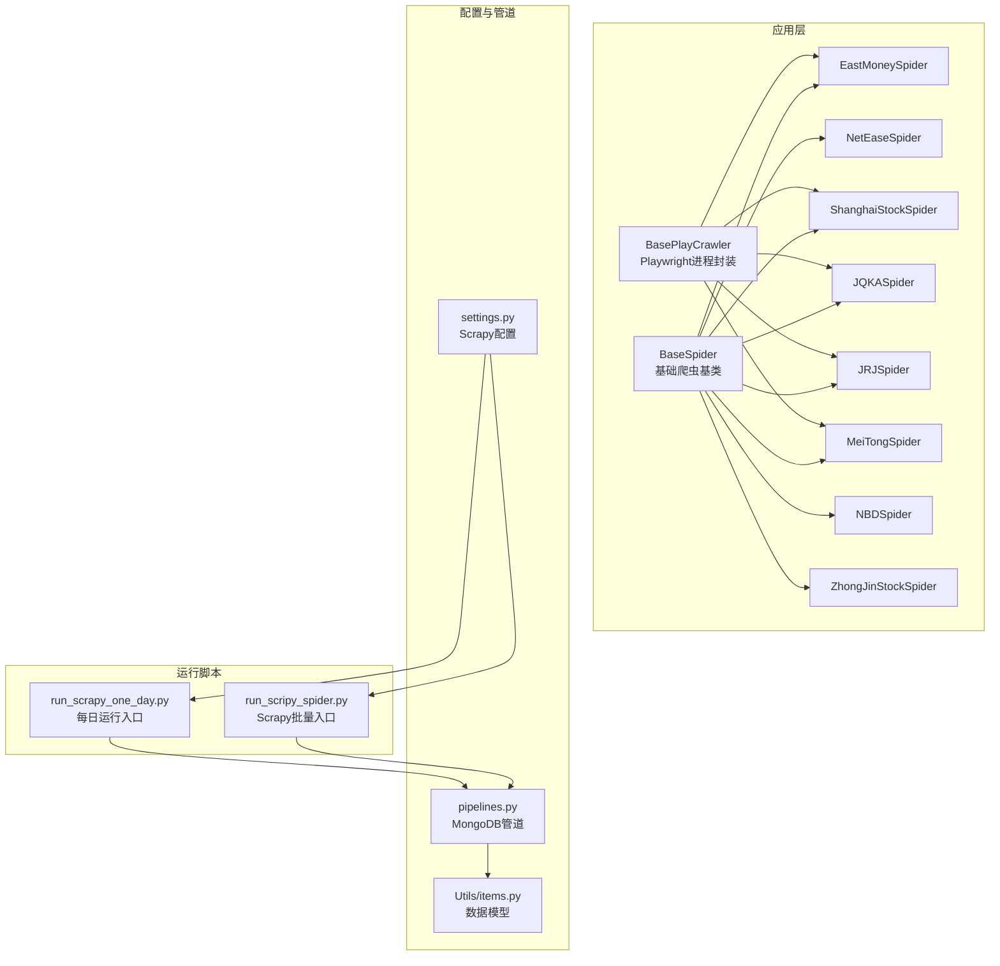
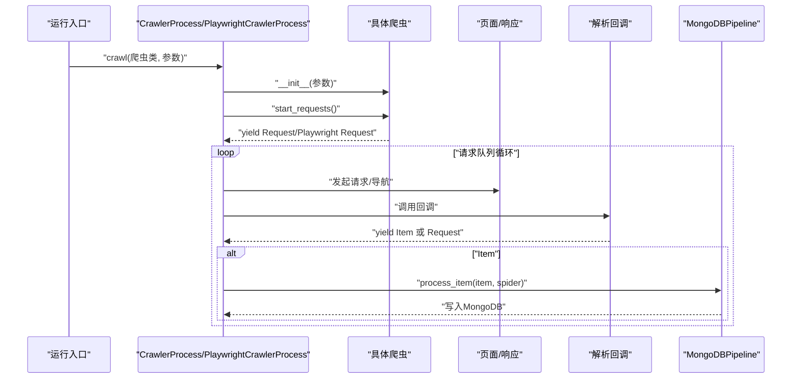
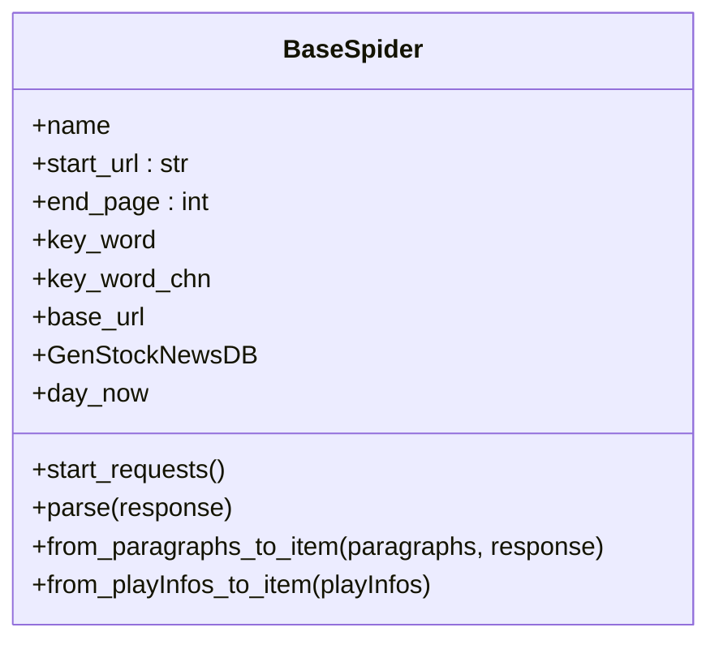
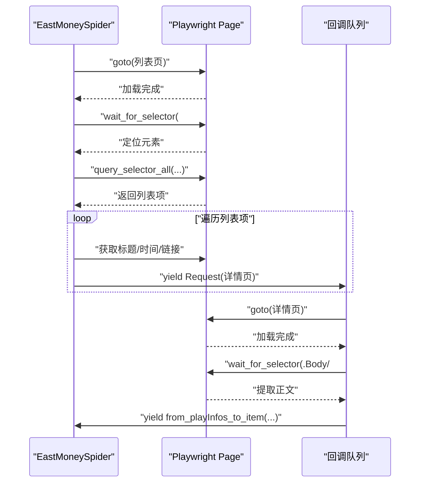
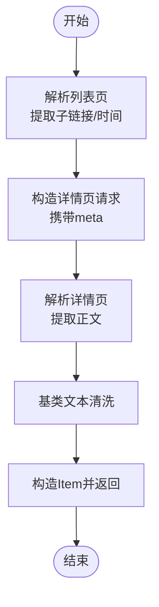
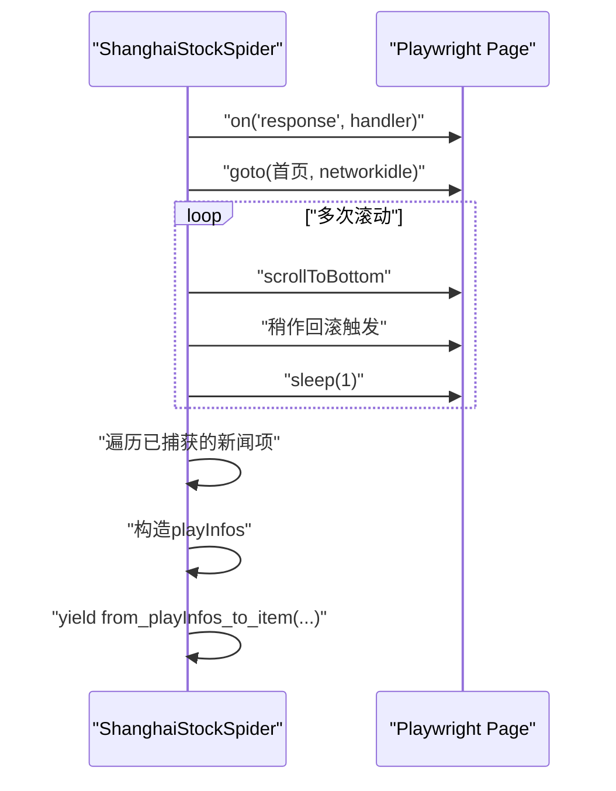
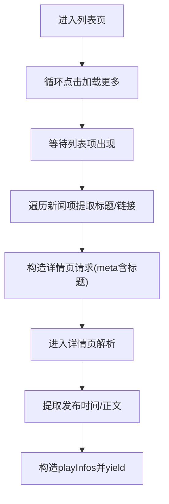
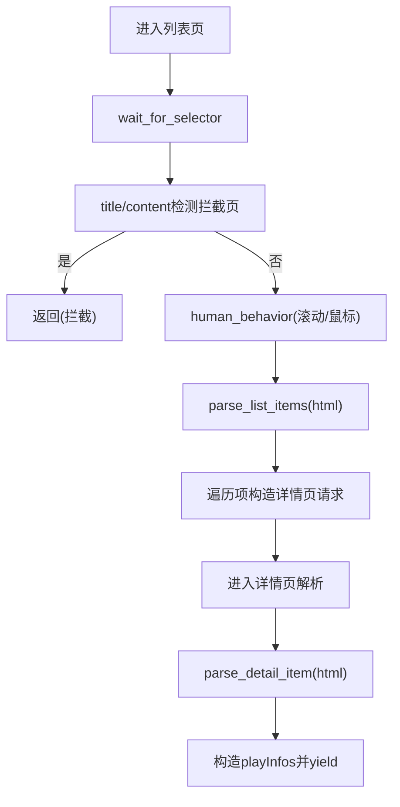
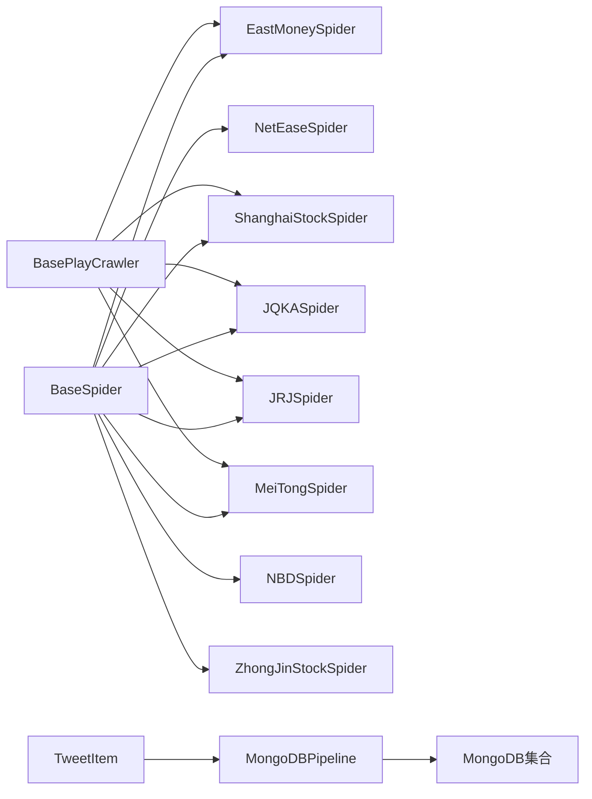

# 新闻爬虫系统

<cite>
**本文引用的文件**   
- [src/MarketNewsSpiderWithScrapy/BaseSpider.py](file://src/MarketNewsSpiderWithScrapy/BaseSpider.py)
- [src/MarketNewsSpiderWithScrapy/BasePlayCrawler.py](file://src/MarketNewsSpiderWithScrapy/BasePlayCrawler.py)
- [src/MarketNewsSpiderWithScrapy/east_money_spider.py](file://src/MarketNewsSpiderWithScrapy/east_money_spider.py)
- [src/MarketNewsSpiderWithScrapy/net_ease_spider.py](file://src/MarketNewsSpiderWithScrapy/net_ease_spider.py)
- [src/MarketNewsSpiderWithScrapy/shanghai_stock_spider.py](file://src/MarketNewsSpiderWithScrapy/shanghai_stock_spider.py)
- [src/MarketNewsSpiderWithScrapy/jqka_spider.py](file://src/MarketNewsSpiderWithScrapy/jqka_spider.py)
- [src/MarketNewsSpiderWithScrapy/jrj_spider.py](file://src/MarketNewsSpiderWithScrapy/jrj_spider.py)
- [src/MarketNewsSpiderWithScrapy/mei_tong_spider.py](file://src/MarketNewsSpiderWithScrapy/mei_tong_spider.py)
- [src/MarketNewsSpiderWithScrapy/nbd_spider.py](file://src/MarketNewsSpiderWithScrapy/nbd_spider.py)
- [src/MarketNewsSpiderWithScrapy/zhong_jin_spider.py](file://src/MarketNewsSpiderWithScrapy/zhong_jin_spider.py)
- [src/settings.py](file://src/settings.py)
- [src/pipelines.py](file://src/pipelines.py)
- [src/Utils/items.py](file://src/Utils/items.py)
- [src/run_scripy_spider.py](file://src/run_scripy_spider.py)
- [src/run_scrapy_one_day.py](file://src/run_scrapy_one_day.py)
</cite>

## 目录
1. [简介](#简介)
2. [项目结构](#项目结构)
3. [核心组件](#核心组件)
4. [架构总览](#架构总览)
5. [详细组件分析](#详细组件分析)
6. [依赖分析](#依赖分析)
7. [性能考虑](#性能考虑)
8. [故障排查指南](#故障排查指南)
9. [结论](#结论)
10. [附录](#附录)

## 简介
本项目是一个基于Scrapy与Playwright的多源财经新闻爬虫系统，覆盖8个主流财经媒体（东方财富、网易财经、上海证券报、金融界、每经网、中金在线、美通社、同花顺）。系统采用统一的BaseSpider基类封装通用逻辑，结合Scrapy与Playwright两种抓取方式，分别用于静态HTML与动态渲染场景；通过自定义Pipeline将数据写入MongoDB，并集成文本挖掘与情感打分模块，最终输出标准化的新闻条目。

## 项目结构
- MarketNewsSpiderWithScrapy：爬虫应用层，包含基类与各媒体爬虫实现
- Utils：通用工具与数据模型
- MongoDbComTools：数据库与信息抽取工具
- NlpModel：自然语言处理与情感分析
- 运行脚本：集中编排各媒体爬虫与生成日报

图表来源
- [src/MarketNewsSpiderWithScrapy/BaseSpider.py:13-149](file://src/MarketNewsSpiderWithScrapy/BaseSpider.py#L13-L149)
- [src/MarketNewsSpiderWithScrapy/BasePlayCrawler.py:21-120](file://src/MarketNewsSpiderWithScrapy/BasePlayCrawler.py#L21-L120)
- [src/MarketNewsSpiderWithScrapy/east_money_spider.py:5-78](file://src/MarketNewsSpiderWithScrapy/east_money_spider.py#L5-L78)
- [src/MarketNewsSpiderWithScrapy/net_ease_spider.py:9-68](file://src/MarketNewsSpiderWithScrapy/net_ease_spider.py#L9-L68)
- [src/MarketNewsSpiderWithScrapy/shanghai_stock_spider.py:6-60](file://src/MarketNewsSpiderWithScrapy/shanghai_stock_spider.py#L6-L60)
- [src/MarketNewsSpiderWithScrapy/jqka_spider.py:8-80](file://src/MarketNewsSpiderWithScrapy/jqka_spider.py#L8-L80)
- [src/MarketNewsSpiderWithScrapy/jrj_spider.py:7-94](file://src/MarketNewsSpiderWithScrapy/jrj_spider.py#L7-L94)
- [src/MarketNewsSpiderWithScrapy/mei_tong_spider.py:167-267](file://src/MarketNewsSpiderWithScrapy/mei_tong_spider.py#L167-L267)
- [src/MarketNewsSpiderWithScrapy/nbd_spider.py:7-67](file://src/MarketNewsSpiderWithScrapy/nbd_spider.py#L7-L67)
- [src/MarketNewsSpiderWithScrapy/zhong_jin_spider.py:29-110](file://src/MarketNewsSpiderWithScrapy/zhong_jin_spider.py#L29-L110)
- [src/settings.py:1-49](file://src/settings.py#L1-L49)
- [src/pipelines.py:8-56](file://src/pipelines.py#L8-L56)
- [src/Utils/items.py:5-18](file://src/Utils/items.py#L5-L18)
- [src/run_scrapy_one_day.py:32-80](file://src/run_scrapy_one_day.py#L32-L80)
- [src/run_scripy_spider.py:117-145](file://src/run_scripy_spider.py#L117-L145)

章节来源
- [src/MarketNewsSpiderWithScrapy/BaseSpider.py:13-149](file://src/MarketNewsSpiderWithScrapy/BaseSpider.py#L13-L149)
- [src/MarketNewsSpiderWithScrapy/BasePlayCrawler.py:21-120](file://src/MarketNewsSpiderWithScrapy/BasePlayCrawler.py#L21-L120)
- [src/settings.py:1-49](file://src/settings.py#L1-L49)

## 核心组件
- BaseSpider：统一的爬虫基类，负责初始化、通用解析与数据项构造，内置文本清洗、股票代码识别、情感打分融合等逻辑。
- BasePlayCrawler：基于Playwright的异步进程封装，支持并发调度、上下文隔离、请求队列与回调处理。
- 各媒体爬虫：继承BaseSpider或使用Playwright流程，针对目标站点的列表页/详情页结构定制解析策略。
- Pipeline：MongoDB写入管道，按爬虫名称路由到对应数据库集合，自动去重。
- 数据模型：TweetItem，标准化字段如URL、标题、正文、相关股票、分类、标签与分数等。

章节来源
- [src/MarketNewsSpiderWithScrapy/BaseSpider.py:13-149](file://src/MarketNewsSpiderWithScrapy/BaseSpider.py#L13-L149)
- [src/MarketNewsSpiderWithScrapy/BasePlayCrawler.py:21-120](file://src/MarketNewsSpiderWithScrapy/BasePlayCrawler.py#L21-L120)
- [src/pipelines.py:8-56](file://src/pipelines.py#L8-L56)
- [src/Utils/items.py:5-18](file://src/Utils/items.py#L5-L18)

## 架构总览
系统采用“配置驱动 + 统一基类 + 多种抓取引擎”的混合架构：
- 静态站点（Scrapy）：适用于列表页可直接解析的站点，使用BeautifulSoup解析与Scrapy Request/Response。
- 动态站点（Playwright）：适用于AJAX瀑布流、反爬严格或需交互的站点，使用异步Playwright会话与回调队列。
- 数据落库：统一通过Pipeline写入MongoDB，按爬虫名映射到不同数据库集合，避免重复写入。

图表来源
- [src/run_scrapy_one_day.py:43-79](file://src/run_scrapy_one_day.py#L43-L79)
- [src/MarketNewsSpiderWithScrapy/BasePlayCrawler.py:34-120](file://src/MarketNewsSpiderWithScrapy/BasePlayCrawler.py#L34-L120)
- [src/pipelines.py:25-46](file://src/pipelines.py#L25-L46)

## 详细组件分析

### BaseSpider 基类设计与扩展机制
- 设计理念
  - 将“站点无关”的通用能力下沉至基类：初始化参数、股票代码字典构建、文本清洗、情感打分融合、Item构造等。
  - 通过继承扩展：各媒体爬虫仅关注自身页面结构与URL生成策略。
- 关键点
  - 股票映射：根据站点类型选择A股或美股映射字典。
  - 文本清洗：去除多余空白、合并段落、统一换行。
  - 情感打分：ML与LLM双模型融合，输出类别与置信度。
  - Item构造：统一字段命名与类型，保证下游处理一致性。

图表来源
- [src/MarketNewsSpiderWithScrapy/BaseSpider.py:13-149](file://src/MarketNewsSpiderWithScrapy/BaseSpider.py#L13-L149)

章节来源
- [src/MarketNewsSpiderWithScrapy/BaseSpider.py:13-149](file://src/MarketNewsSpiderWithScrapy/BaseSpider.py#L13-L149)

### 东方财富（eastmoney）爬取策略
- 抓取方式：Playwright（异步）
- 列表页：等待列表容器加载，解析每条新闻的标题与时间，构造详情页请求。
- 详情页：等待正文容器加载，提取正文文本，构造Item并交由基类处理。
- 特殊点：兼容普通新闻与财富号两类正文容器。

图表来源
- [src/MarketNewsSpiderWithScrapy/east_money_spider.py:21-78](file://src/MarketNewsSpiderWithScrapy/east_money_spider.py#L21-L78)
- [src/MarketNewsSpiderWithScrapy/BasePlayCrawler.py:86-118](file://src/MarketNewsSpiderWithScrapy/BasePlayCrawler.py#L86-L118)

章节来源
- [src/MarketNewsSpiderWithScrapy/east_money_spider.py:5-78](file://src/MarketNewsSpiderWithScrapy/east_money_spider.py#L5-L78)

### 网易财经（netease）爬取策略
- 抓取方式：Scrapy（静态）
- 列表页：BeautifulSoup解析左侧列表，提取子链接与时间信息，传递给详情页解析。
- 详情页：提取正文容器，调用基类文本清洗与Item构造。

图表来源
- [src/MarketNewsSpiderWithScrapy/net_ease_spider.py:31-68](file://src/MarketNewsSpiderWithScrapy/net_ease_spider.py#L31-L68)
- [src/MarketNewsSpiderWithScrapy/BaseSpider.py:41-98](file://src/MarketNewsSpiderWithScrapy/BaseSpider.py#L41-L98)

章节来源
- [src/MarketNewsSpiderWithScrapy/net_ease_spider.py:9-68](file://src/MarketNewsSpiderWithScrapy/net_ease_spider.py#L9-L68)

### 上海证券报（shanghai stock）爬取策略
- 抓取方式：Playwright（异步）
- 动态拦截：注册response拦截器，捕获JSON数据中的新闻列表，模拟滚动触发更多数据。
- Item构造：从原始数据中抽取标题、URL、摘要与发布日期，交由基类处理。

图表来源
- [src/MarketNewsSpiderWithScrapy/shanghai_stock_spider.py:16-60](file://src/MarketNewsSpiderWithScrapy/shanghai_stock_spider.py#L16-L60)
- [src/MarketNewsSpiderWithScrapy/BasePlayCrawler.py:64-118](file://src/MarketNewsSpiderWithScrapy/BasePlayCrawler.py#L64-L118)

章节来源
- [src/MarketNewsSpiderWithScrapy/shanghai_stock_spider.py:6-60](file://src/MarketNewsSpiderWithScrapy/shanghai_stock_spider.py#L6-L60)

### 金融界（jrj）爬取策略
- 抓取方式：Playwright（异步）
- 加载更多：根据end_page循环点击“加载更多”，等待页面更新。
- 列表解析：定位新闻项，提取标题与链接，传递给详情页解析。
- 详情解析：提取发布时间与正文，构造Item。

图表来源
- [src/MarketNewsSpiderWithScrapy/jrj_spider.py:17-94](file://src/MarketNewsSpiderWithScrapy/jrj_spider.py#L17-L94)
- [src/MarketNewsSpiderWithScrapy/BasePlayCrawler.py:86-118](file://src/MarketNewsSpiderWithScrapy/BasePlayCrawler.py#L86-L118)

章节来源
- [src/MarketNewsSpiderWithScrapy/jrj_spider.py:7-94](file://src/MarketNewsSpiderWithScrapy/jrj_spider.py#L7-L94)

### 每经网（nbd）爬取策略
- 抓取方式：Scrapy（静态）
- 分页规则：对URL进行/page/1替换生成多页。
- 列表解析：提取每条新闻的标题、时间与链接，传递给详情页。
- 详情解析：提取正文容器，调用基类处理。

章节来源
- [src/MarketNewsSpiderWithScrapy/nbd_spider.py:7-67](file://src/MarketNewsSpiderWithScrapy/nbd_spider.py#L7-L67)

### 中金在线（zhongjin）爬取策略
- 抓取方式：Selenium（静态）
- 使用Chrome Headless驱动，循环点击“加载更多”，直到按钮文案不再变化。
- 解析列表后，提取标题、时间与链接，传递给详情页。
- 详情解析：提取正文容器，调用基类处理。

章节来源
- [src/MarketNewsSpiderWithScrapy/zhong_jin_spider.py:29-110](file://src/MarketNewsSpiderWithScrapy/zhong_jin_spider.py#L29-L110)

### 美通社（meitong）爬取策略
- 抓取方式：Playwright（异步）
- 反爬应对：检测拦截页关键词、人类行为模拟（滚动、鼠标移动）、随机延时。
- 列表解析：解析卡片式布局，提取标题、URL、摘要、主题标签与列表URL。
- 详情解析：解析标题、日期与正文，构造Item。

图表来源
- [src/MarketNewsSpiderWithScrapy/mei_tong_spider.py:201-267](file://src/MarketNewsSpiderWithScrapy/mei_tong_spider.py#L201-L267)
- [src/MarketNewsSpiderWithScrapy/BasePlayCrawler.py:64-118](file://src/MarketNewsSpiderWithScrapy/BasePlayCrawler.py#L64-L118)

章节来源
- [src/MarketNewsSpiderWithScrapy/mei_tong_spider.py:167-267](file://src/MarketNewsSpiderWithScrapy/mei_tong_spider.py#L167-L267)

### 同花顺（jqka）爬取策略
- 抓取方式：Playwright（异步）
- 动态加载：先滚动，再点击“加载更多”按钮，等待新内容出现。
- 列表解析：定位带特定类名的新闻项，提取标题与链接。
- 特殊点：Article为空，Date为当日日期，Source为爬虫名。

章节来源
- [src/MarketNewsSpiderWithScrapy/jqka_spider.py:8-80](file://src/MarketNewsSpiderWithScrapy/jqka_spider.py#L8-L80)

## 依赖分析
- 组件耦合
  - 各媒体爬虫强依赖BaseSpider，弱依赖Playwright或Scrapy生态。
  - Pipeline与数据库配置解耦，通过爬虫名映射集合。
- 外部依赖
  - MongoDB：作为唯一持久化存储。
  - Playwright/Selenium：动态渲染与反爬对抗。
  - NLP模型：情感打分与股票代码识别。

图表来源
- [src/MarketNewsSpiderWithScrapy/BaseSpider.py:13-149](file://src/MarketNewsSpiderWithScrapy/BaseSpider.py#L13-L149)
- [src/MarketNewsSpiderWithScrapy/BasePlayCrawler.py:21-120](file://src/MarketNewsSpiderWithScrapy/BasePlayCrawler.py#L21-L120)
- [src/pipelines.py:8-56](file://src/pipelines.py#L8-L56)
- [src/Utils/items.py:5-18](file://src/Utils/items.py#L5-L18)

章节来源
- [src/pipelines.py:8-56](file://src/pipelines.py#L8-L56)

## 性能考虑
- 并发与异步
  - PlaywrightCrawlerProcess并发调度多个爬虫实例，共享Browser但独立Context，降低内存占用与Cookie干扰。
- 请求与等待
  - 列表页等待指定选择器稳定后再解析，避免过早读取导致的空数据。
  - 动态加载场景通过滚动+等待+少量sleep平衡稳定性与性能。
- 反爬策略
  - 随机UA、随机延时、人类行为模拟、拦截页检测与跳过。
- 数据落库
  - 使用MongoDB单条插入与DuplicateKey忽略，减少重复写入开销。

章节来源
- [src/MarketNewsSpiderWithScrapy/BasePlayCrawler.py:41-120](file://src/MarketNewsSpiderWithScrapy/BasePlayCrawler.py#L41-L120)
- [src/MarketNewsSpiderWithScrapy/mei_tong_spider.py:41-57](file://src/MarketNewsSpiderWithScrapy/mei_tong_spider.py#L41-L57)
- [src/pipelines.py:48-56](file://src/pipelines.py#L48-L56)

## 故障排查指南
- 列表页未加载完成
  - 现象：解析为空或异常。
  - 处理：增加等待选择器或延长超时；检查站点结构是否变更。
- 拦截页（人机验证/安全验证）
  - 现象：标题或内容包含拦截关键词。
  - 处理：检测拦截页并跳过；必要时更换UA或代理。
- 详情页正文提取失败
  - 现象：正文容器不存在或为空。
  - 处理：放宽选择器或降级到备用选择器；记录URL以便人工核验。
- 数据库重复写入
  - 现象：DuplicateKeyError日志。
  - 处理：Pipeline已忽略重复键；确认去重策略与主键生成逻辑。

章节来源
- [src/MarketNewsSpiderWithScrapy/mei_tong_spider.py:37-38](file://src/MarketNewsSpiderWithScrapy/mei_tong_spider.py#L37-L38)
- [src/MarketNewsSpiderWithScrapy/BasePlayCrawler.py:113-118](file://src/MarketNewsSpiderWithScrapy/BasePlayCrawler.py#L113-L118)
- [src/pipelines.py:48-56](file://src/pipelines.py#L48-L56)

## 结论
该系统通过统一基类与多种抓取引擎的组合，实现了对8个主流财经媒体的高效、稳定抓取。其核心优势在于：
- 可扩展的基类设计，降低各媒体适配成本；
- 混合抓取策略覆盖静态与动态场景；
- 完整的数据清洗、去重与情感打分链路；
- 明确的运行脚本与配置管理，便于日常运维与报表生成。

## 附录

### 运行入口与配置管理
- 每日运行入口：run_scrapy_one_day.py，按配置列表分别启动Playwright与Scrapy进程，生成日报。
- Scrapy批量入口：run_scripy_spider.py，按命令行参数选择媒体批量运行。
- Scrapy配置：settings.py，控制并发、下载延迟、中间件与管道等。

章节来源
- [src/run_scrapy_one_day.py:32-80](file://src/run_scrapy_one_day.py#L32-L80)
- [src/run_scripy_spider.py:117-145](file://src/run_scripy_spider.py#L117-L145)
- [src/settings.py:1-49](file://src/settings.py#L1-L49)