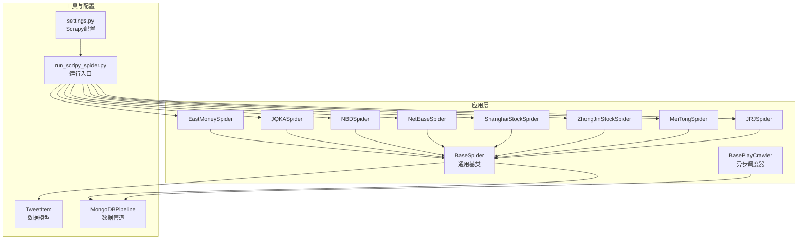
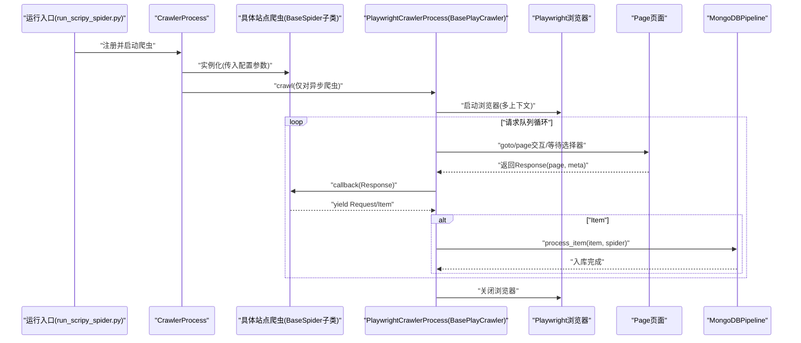
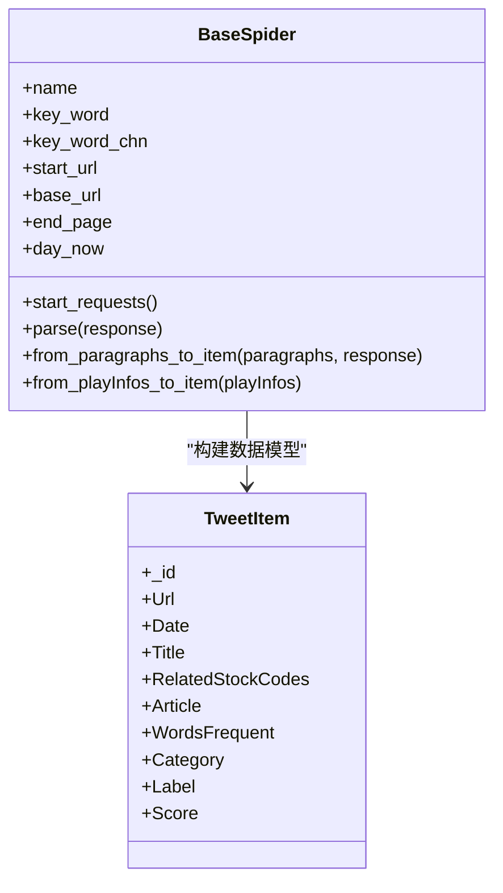
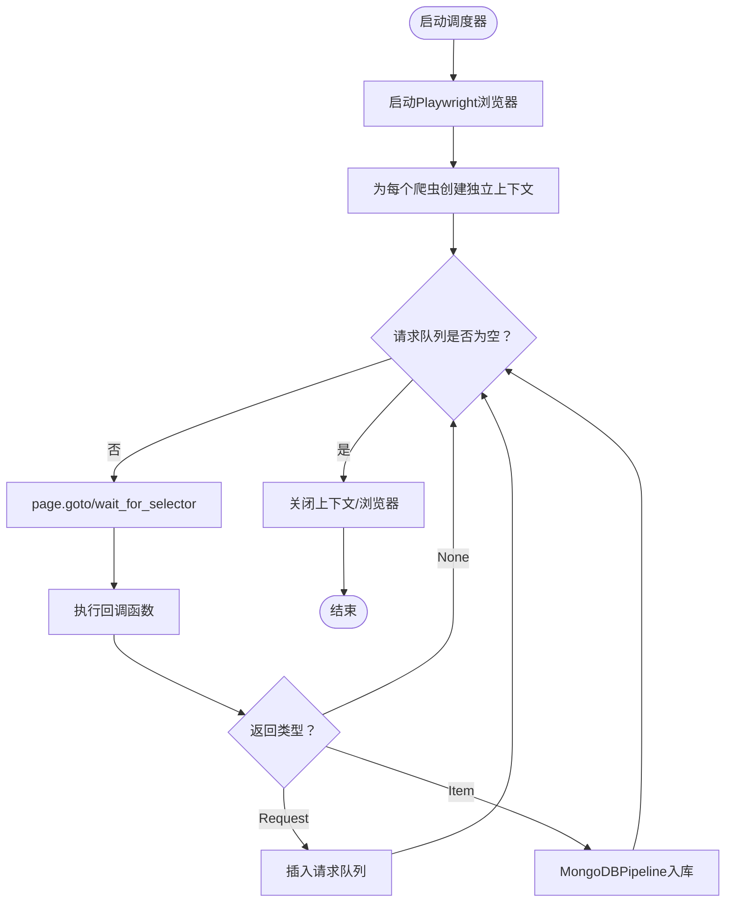
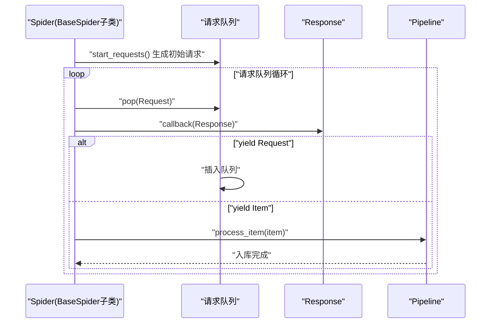
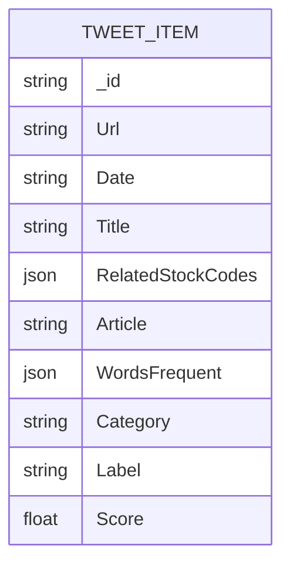
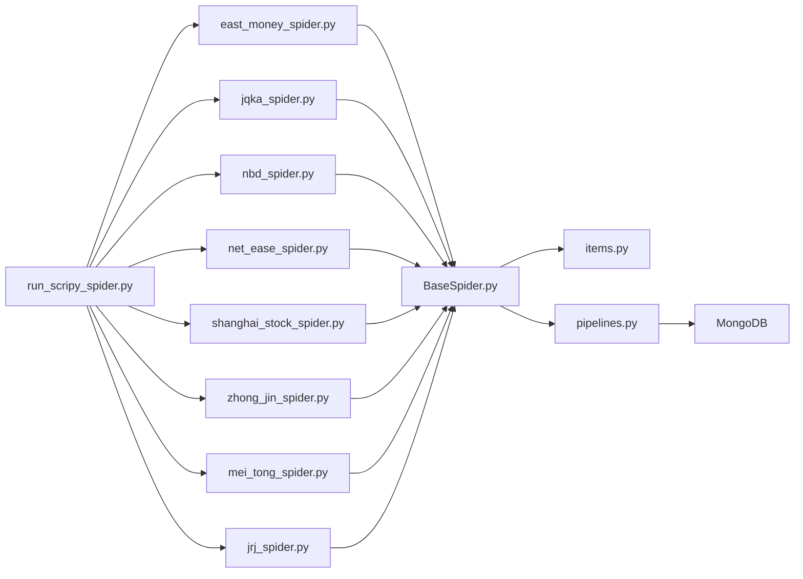

# 爬虫架构设计

<cite>
**本文引用的文件**
- [BaseSpider.py](file://src/MarketNewsSpiderWithScrapy/BaseSpider.py)
- [BasePlayCrawler.py](file://src/MarketNewsSpiderWithScrapy/BasePlayCrawler.py)
- [east_money_spider.py](file://src/MarketNewsSpiderWithScrapy/east_money_spider.py)
- [jqka_spider.py](file://src/MarketNewsSpiderWithScrapy/jqka_spider.py)
- [nbd_spider.py](file://src/MarketNewsSpiderWithScrapy/nbd_spider.py)
- [net_ease_spider.py](file://src/MarketNewsSpiderWithScrapy/net_ease_spider.py)
- [shanghai_stock_spider.py](file://src/MarketNewsSpiderWithScrapy/shanghai_stock_spider.py)
- [zhong_jin_spider.py](file://src/MarketNewsSpiderWithScrapy/zhong_jin_spider.py)
- [mei_tong_spider.py](file://src/MarketNewsSpiderWithScrapy/mei_tong_spider.py)
- [jrj_spider.py](file://src/MarketNewsSpiderWithScrapy/jrj_spider.py)
- [pipelines.py](file://src/pipelines.py)
- [items.py](file://src/Utils/items.py)
- [settings.py](file://src/settings.py)
- [run_scripy_spider.py](file://src/run_scripy_spider.py)
</cite>

## 目录
1. [引言](#引言)
2. [项目结构](#项目结构)
3. [核心组件](#核心组件)
4. [架构总览](#架构总览)
5. [详细组件分析](#详细组件分析)
6. [依赖分析](#依赖分析)
7. [性能考虑](#性能考虑)
8. [故障排查指南](#故障排查指南)
9. [结论](#结论)
10. [附录](#附录)

## 引言
本技术文档围绕“市场新闻爬虫架构”展开，系统性阐述基于 Scrapy 与 Playwright 的双栈爬虫体系：以 BaseSpider 为通用基类，统一初始化参数、属性配置与通用解析方法；以 BasePlayCrawler 为异步调度器，封装 Playwright 浏览器生命周期与并发调度；并结合多个具体站点爬虫（如东方财富、同花顺、每经网、网易财经、上海证券报、中金在线、美通社、金融界）展示继承体系、生命周期管理、请求队列与响应解析的完整流程。文档同时覆盖配置管理、日志记录、错误处理与扩展实践，帮助开发者快速理解并高效扩展新的爬虫类。

## 项目结构
本项目采用“功能域+框架层”的组织方式：
- MarketNewsSpiderWithScrapy：爬虫应用层，包含通用基类与各站点爬虫实现
- Utils：通用工具与数据模型
- 数据管道与配置：pipelines、settings
- 运行入口：run_scripy_spider

图表来源
- [BaseSpider.py:13-149](file://src/MarketNewsSpiderWithScrapy/BaseSpider.py#L13-L149)
- [BasePlayCrawler.py:21-120](file://src/MarketNewsSpiderWithScrapy/BasePlayCrawler.py#L21-L120)
- [east_money_spider.py:5-78](file://src/MarketNewsSpiderWithScrapy/east_money_spider.py#L5-L78)
- [jqka_spider.py:8-80](file://src/MarketNewsSpiderWithScrapy/jqka_spider.py#L8-L80)
- [nbd_spider.py:7-67](file://src/MarketNewsSpiderWithScrapy/nbd_spider.py#L7-L67)
- [net_ease_spider.py:9-68](file://src/MarketNewsSpiderWithScrapy/net_ease_spider.py#L9-L68)
- [shanghai_stock_spider.py:6-60](file://src/MarketNewsSpiderWithScrapy/shanghai_stock_spider.py#L6-L60)
- [zhong_jin_spider.py:29-110](file://src/MarketNewsSpiderWithScrapy/zhong_jin_spider.py#L29-L110)
- [mei_tong_spider.py:167-267](file://src/MarketNewsSpiderWithScrapy/mei_tong_spider.py#L167-L267)
- [jrj_spider.py:7-94](file://src/MarketNewsSpiderWithScrapy/jrj_spider.py#L7-L94)
- [items.py:5-18](file://src/Utils/items.py#L5-L18)
- [pipelines.py:8-56](file://src/pipelines.py#L8-L56)
- [settings.py:1-49](file://src/settings.py#L1-L49)
- [run_scripy_spider.py:1-145](file://src/run_scripy_spider.py#L1-L145)

章节来源
- [settings.py:1-49](file://src/settings.py#L1-L49)
- [run_scripy_spider.py:1-145](file://src/run_scripy_spider.py#L1-L145)

## 核心组件
本节聚焦于两个核心构件：BaseSpider 与 BasePlayCrawler。

- BaseSpider（通用基类）
  - 设计理念：统一爬虫初始化参数、属性配置、通用解析与数据建模，屏蔽站点差异
  - 关键点：
    - 初始化参数：name、key_word、key_word_chn、start_url、base_url、end_page
    - 属性配置：根据站点选择股票代码映射字典、日期标记、日志记录器
    - 通用方法：start_requests（抽象）、parse（抽象）、from_paragraphs_to_item（HTML解析）、from_playInfos_to_item（Playwright解析）
  - 数据模型：TweetItem（统一字段集合）

- BasePlayCrawler（异步调度器）
  - 设计理念：以事件驱动与并发协程为核心，统一浏览器生命周期与请求队列调度
  - 关键点：
    - Request/Response 模型：简化回调与元数据传递
    - PlaywrightCrawlerProcess：并发调度、上下文隔离、统一管道输出
    - 生命周期：启动浏览器 -> 并发运行 -> 关闭浏览器
  - 优势：
    - 统一 UA、上下文隔离、并发高吞吐
    - 回调可异步生成，支持动态扩展请求队列

章节来源
- [BaseSpider.py:13-149](file://src/MarketNewsSpiderWithScrapy/BaseSpider.py#L13-L149)
- [BasePlayCrawler.py:21-120](file://src/MarketNewsSpiderWithScrapy/BasePlayCrawler.py#L21-L120)
- [items.py:5-18](file://src/Utils/items.py#L5-L18)

## 架构总览
下图展示了“站点爬虫 → 基类 → 调度器/管道”的整体交互关系与数据流向。

图表来源
- [run_scripy_spider.py:117-142](file://src/run_scripy_spider.py#L117-L142)
- [BasePlayCrawler.py:34-120](file://src/MarketNewsSpiderWithScrapy/BasePlayCrawler.py#L34-L120)
- [pipelines.py:25-46](file://src/pipelines.py#L25-L46)

## 详细组件分析

### BaseSpider 基类设计与实现
- 初始化参数与属性
  - 参数：name、key_word、key_word_chn、start_url、base_url、end_page
  - 属性：根据站点选择 name_code 映射、day_now、日志器、数据库/NLP 工具
- 通用方法
  - start_requests：由子类实现，生成初始请求序列
  - parse：由子类实现，处理列表页或详情页
  - from_paragraphs_to_item：从 HTML 段落提取正文，识别股票代码与词频，调用 ML/LLM 模型融合打分，构建 TweetItem
  - from_playInfos_to_item：从 Playwright 结构化数据构建 TweetItem，逻辑与上述一致

图表来源
- [BaseSpider.py:13-149](file://src/MarketNewsSpiderWithScrapy/BaseSpider.py#L13-L149)
- [items.py:5-18](file://src/Utils/items.py#L5-L18)

章节来源
- [BaseSpider.py:13-149](file://src/MarketNewsSpiderWithScrapy/BaseSpider.py#L13-L149)
- [items.py:5-18](file://src/Utils/items.py#L5-L18)

### BasePlayCrawler 异步调度器
- 设计要点
  - Request/Response 模型：简化回调与元数据传递
  - PlaywrightCrawlerProcess：并发调度、上下文隔离、统一管道输出
  - 生命周期：启动浏览器 → 并发运行 → 关闭浏览器
- 优势
  - 统一 UA、上下文隔离、并发高吞吐
  - 回调可异步生成，支持动态扩展请求队列

图表来源
- [BasePlayCrawler.py:41-120](file://src/MarketNewsSpiderWithScrapy/BasePlayCrawler.py#L41-L120)

章节来源
- [BasePlayCrawler.py:21-120](file://src/MarketNewsSpiderWithScrapy/BasePlayCrawler.py#L21-L120)

### 爬虫继承体系与生命周期
- 继承体系
  - 所有站点爬虫均继承自 BaseSpider，统一初始化与通用方法
  - 异步站点（如东方财富、金融界、上海证券报、美通社）通过 PlaywrightCrawlerProcess 运行
  - 同步站点（如每经网、网易财经、中金在线）使用 Scrapy CrawlerProcess 运行
- 生命周期
  - 初始化：传参构造、日志器、数据库/NLP 工具准备
  - 列表页：等待选择器、提取链接、构造详情页请求
  - 详情页：提取正文、调用通用方法构建 Item
  - 输出：通过管道入库

图表来源
- [BasePlayCrawler.py:85-118](file://src/MarketNewsSpiderWithScrapy/BasePlayCrawler.py#L85-L118)
- [BaseSpider.py:35-39](file://src/MarketNewsSpiderWithScrapy/BaseSpider.py#L35-L39)

章节来源
- [BasePlayCrawler.py:34-120](file://src/MarketNewsSpiderWithScrapy/BasePlayCrawler.py#L34-L120)
- [BaseSpider.py:35-39](file://src/MarketNewsSpiderWithScrapy/BaseSpider.py#L35-L39)

### 典型站点爬虫实现与解析逻辑

#### 东方财富爬虫（同步 + HTML 解析）
- start_requests：生成分页 URL 列表并 yield Request
- parse：等待列表加载、提取标题/时间/链接，yield 详情页 Request
- parse_detail：等待正文加载、提取正文，yield from_playInfos_to_item

章节来源
- [east_money_spider.py:12-78](file://src/MarketNewsSpiderWithScrapy/east_money_spider.py#L12-L78)

#### 金融界爬虫（异步 + Playwright）
- start_requests：单页入口
- parse：点击“加载更多”，定位新闻项，yield 详情页 Request
- parse_detail：提取发布时间与正文，yield from_playInfos_to_item

章节来源
- [jrj_spider.py:14-94](file://src/MarketNewsSpiderWithScrapy/jrj_spider.py#L14-L94)

#### 上海证券报爬虫（异步 + AJAX 拦截）
- start_requests：单页入口
- parse：注册 response 拦截器，滚动触发分页，收集 JSON 数据，yield from_playInfos_to_item

章节来源
- [shanghai_stock_spider.py:13-60](file://src/MarketNewsSpiderWithScrapy/shanghai_stock_spider.py#L13-L60)

#### 美通社爬虫（异步 + 反爬对抗）
- start_requests：按页生成列表 URL
- parse：等待选择器、检测拦截页、人类行为模拟、解析列表项、yield 详情页 Request
- parse_detail：等待选择器、检测拦截页、解析详情、yield from_playInfos_to_item

章节来源
- [mei_tong_spider.py:186-267](file://src/MarketNewsSpiderWithScrapy/mei_tong_spider.py#L186-L267)

#### 每经网/网易/中金在线（同步 + BeautifulSoup）
- start_requests：生成分页 URL 列表
- parse：BeautifulSoup 解析列表，提取标题/时间/链接，yield 详情页 Request
- parse_further_information：BeautifulSoup 解析正文，yield from_paragraphs_to_item

章节来源
- [nbd_spider.py:13-67](file://src/MarketNewsSpiderWithScrapy/nbd_spider.py#L13-L67)
- [net_ease_spider.py:15-68](file://src/MarketNewsSpiderWithScrapy/net_ease_spider.py#L15-L68)
- [zhong_jin_spider.py:36-110](file://src/MarketNewsSpiderWithScrapy/zhong_jin_spider.py#L36-L110)

#### 同花顺爬虫（异步 + 滚动/加载更多）
- start_requests：单页入口
- parse：滚动/点击“加载更多”，定位头条项，构造 playInfos，yield from_playInfos_to_item

章节来源
- [jqka_spider.py:15-80](file://src/MarketNewsSpiderWithScrapy/jqka_spider.py#L15-L80)

### 数据模型与管道
- TweetItem：统一字段集合，确保各站点输出一致性
- MongoDBPipeline：按站点名称路由到对应数据库集合，去重入库

图表来源
- [items.py:5-18](file://src/Utils/items.py#L5-L18)

章节来源
- [pipelines.py:8-56](file://src/pipelines.py#L8-L56)
- [items.py:5-18](file://src/Utils/items.py#L5-L18)

## 依赖分析
- 组件耦合
  - 爬虫与基类：强依赖（继承与通用方法）
  - 爬虫与管道：弱耦合（通过 process_item 输出）
  - 调度器与爬虫：弱耦合（通过 crawl/start 启动）
- 外部依赖
  - Scrapy、Playwright、BeautifulSoup、MongoDB
- 循环依赖
  - 未发现直接循环依赖，模块职责清晰

图表来源
- [run_scripy_spider.py:1-145](file://src/run_scripy_spider.py#L1-L145)
- [BaseSpider.py:13-149](file://src/MarketNewsSpiderWithScrapy/BaseSpider.py#L13-L149)
- [pipelines.py:8-56](file://src/pipelines.py#L8-L56)

章节来源
- [run_scripy_spider.py:1-145](file://src/run_scripy_spider.py#L1-L145)
- [BaseSpider.py:13-149](file://src/MarketNewsSpiderWithScrapy/BaseSpider.py#L13-L149)
- [pipelines.py:8-56](file://src/pipelines.py#L8-L56)

## 性能考虑
- 并发与调度
  - 使用 PlaywrightCrawlerProcess 并发运行多个爬虫实例，共享浏览器但独立上下文，降低内存占用与 Cookie 干扰
- 请求队列与负载
  - 控制 DOWNLOAD_DELAY、CONCURRENT_REQUESTS，避免目标站点限流
- 页面等待策略
  - 合理设置 wait_until 与超时，避免长时间阻塞
- 数据清洗与去重
  - 正文清洗与 MongoDB 去重，减少无效数据入库

## 故障排查指南
- 列表页加载超时
  - 检查 wait_for_selector 选择器与 wait_until 配置
  - 示例：东方财富列表页等待与异常捕获
- 详情页正文提取失败
  - 切换更健壮的选择器或降级方案
  - 示例：每经网/网易/中金在线的 BeautifulSoup 解析
- 反爬拦截
  - 检测拦截页关键词，增加随机延时与人类行为模拟
  - 示例：美通社的拦截页检测与人类行为函数
- 数据库写入异常
  - 捕获 DuplicateKeyError 并忽略重复项
  - 示例：MongoDBPipeline 的 insert_item

章节来源
- [east_money_spider.py:26-30](file://src/MarketNewsSpiderWithScrapy/east_money_spider.py#L26-L30)
- [nbd_spider.py:61-65](file://src/MarketNewsSpiderWithScrapy/nbd_spider.py#L61-L65)
- [net_ease_spider.py:61-65](file://src/MarketNewsSpiderWithScrapy/net_ease_spider.py#L61-L65)
- [mei_tong_spider.py:210-212](file://src/MarketNewsSpiderWithScrapy/mei_tong_spider.py#L210-L212)
- [pipelines.py:48-56](file://src/pipelines.py#L48-L56)

## 结论
该爬虫架构通过 BaseSpider 统一了初始化与通用解析，借助 BasePlayCrawler 实现了高性能的异步调度与并发执行；配合 Scrapy/Playwright 的选择器与反爬策略，以及 MongoDB 管道的去重入库，形成了稳定、可扩展的新闻采集流水线。开发者可基于继承体系快速扩展新站点，遵循统一的数据模型与错误处理策略，即可高效落地。

## 附录

### 配置管理与运行入口
- settings.py：Scrapy 全局配置（并发、下载、UA、中间件、管道）
- run_scripy_spider.py：按命令行参数批量注册并启动多个站点爬虫

章节来源
- [settings.py:1-49](file://src/settings.py#L1-L49)
- [run_scripy_spider.py:117-142](file://src/run_scripy_spider.py#L117-L142)

### 扩展新爬虫的最佳实践
- 继承 BaseSpider，实现 start_requests 与 parse（或异步 parse）
- 在 parse 中等待选择器、提取链接并 yield 下一页/详情页请求
- 在详情页解析后，调用 from_paragraphs_to_item 或 from_playInfos_to_item 构建 Item
- 在 pipelines 中确认集合路由正确，必要时添加去重与异常处理

章节来源
- [BaseSpider.py:35-39](file://src/MarketNewsSpiderWithScrapy/BaseSpider.py#L35-L39)
- [pipelines.py:25-46](file://src/pipelines.py#L25-L46)