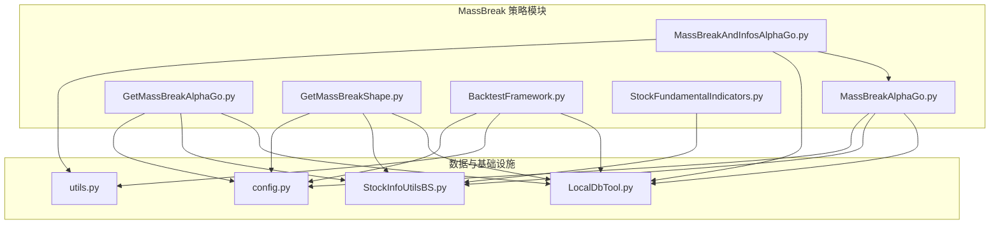
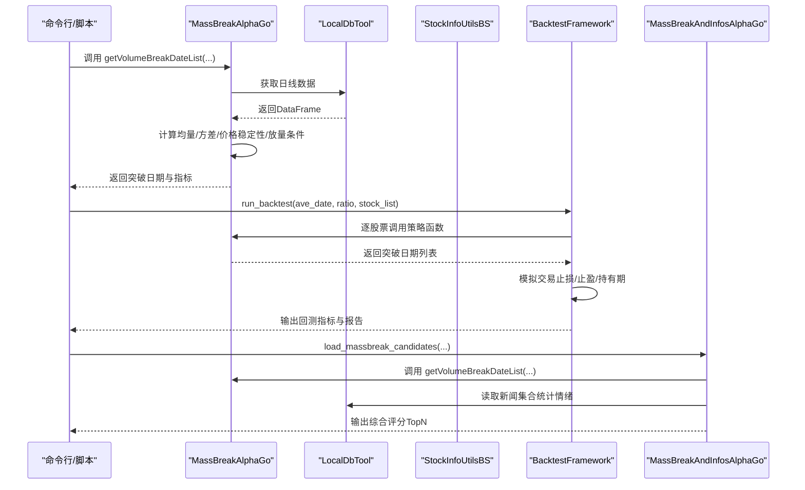
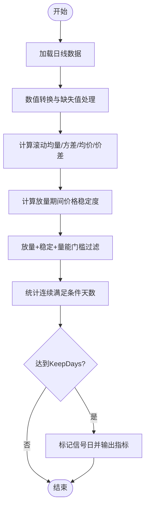
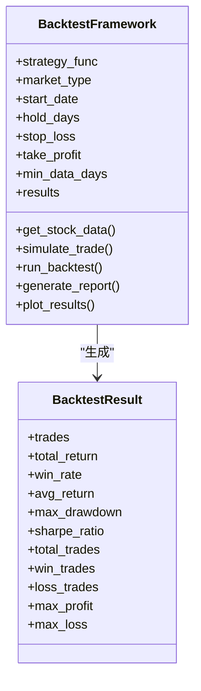
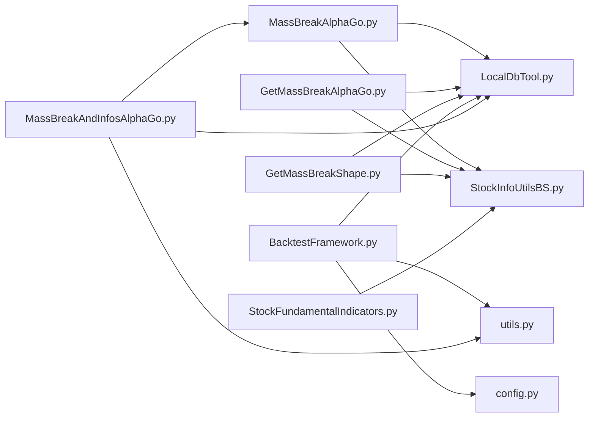

# AlphaGo策略引擎

<cite>
**本文引用的文件**
- [MassBreakAlphaGo.py](file://src/MassBreak/MassBreakAlphaGo.py)
- [GetMassBreakAlphaGo.py](file://src/MassBreak/GetMassBreakAlphaGo.py)
- [GetMassBreakShape.py](file://src/MassBreak/GetMassBreakShape.py)
- [BacktestFramework.py](file://src/MassBreak/BacktestFramework.py)
- [MassBreakAndInfosAlphaGo.py](file://src/MassBreak/MassBreakAndInfosAlphaGo.py)
- [StockFundamentalIndicators.py](file://src/MassBreak/StockFundamentalIndicators.py)
- [LocalDbTool.py](file://src/MongoDbComTools/LocalDbTool.py)
- [StockInfoUtilsBS.py](file://src/MarketPriceSpiderWithScrapy/StockInfoUtilsBS.py)
- [utils.py](file://src/Utils/utils.py)
- [config.py](file://src/Utils/config.py)
- [README.md](file://README.md)
</cite>

## 目录
1. [简介](#简介)
2. [项目结构](#项目结构)
3. [核心组件](#核心组件)
4. [架构总览](#架构总览)
5. [详细组件分析](#详细组件分析)
6. [依赖关系分析](#依赖关系分析)
7. [性能考虑](#性能考虑)
8. [故障排查指南](#故障排查指南)
9. [结论](#结论)
10. [附录](#附录)

## 简介
本文件面向AlphaGo策略引擎，系统性梳理并解释MassBreakAlphaGo的核心算法原理与实现细节，涵盖量价信号识别机制（成交量突破、价格波动检测、趋势判断）、策略参数设置与调优方法（均量窗口、放量倍数、持续天数等）、策略执行流程（信号生成、验证、过滤）、风险控制与止损逻辑、性能优化建议及常见问题解决方案。文档同时提供可操作的参数配置案例与代码示例路径，帮助读者在不同市场条件下快速落地策略。

## 项目结构
该项目以模块化方式组织，MassBreak子系统为核心策略实现区域，配合回测框架、数据库访问工具、股票基础信息获取工具与通用工具集，形成从数据获取到策略执行再到回测评估的完整链路。

**图表来源**
- [MassBreakAlphaGo.py:1-296](file://src/MassBreak/MassBreakAlphaGo.py#L1-L296)
- [GetMassBreakAlphaGo.py:1-130](file://src/MassBreak/GetMassBreakAlphaGo.py#L1-L130)
- [GetMassBreakShape.py:1-128](file://src/MassBreak/GetMassBreakShape.py#L1-L128)
- [BacktestFramework.py:1-498](file://src/MassBreak/BacktestFramework.py#L1-L498)
- [MassBreakAndInfosAlphaGo.py:1-493](file://src/MassBreak/MassBreakAndInfosAlphaGo.py#L1-L493)
- [StockFundamentalIndicators.py:1-210](file://src/MassBreak/StockFundamentalIndicators.py#L1-L210)
- [LocalDbTool.py:1-288](file://src/MongoDbComTools/LocalDbTool.py#L1-L288)
- [StockInfoUtilsBS.py:1-124](file://src/MarketPriceSpiderWithScrapy/StockInfoUtilsBS.py#L1-L124)
- [utils.py:1-251](file://src/Utils/utils.py#L1-L251)
- [config.py:1-455](file://src/Utils/config.py#L1-L455)

**章节来源**
- [README.md:1-33](file://README.md#L1-L33)

## 核心组件
- 量价信号识别器（MassBreakAlphaGo）：基于成交量突破与价格稳定性约束，识别底部盘整后的放量突破信号，并支持“维持放量连续X天”与“开盘涨停特殊处理”增强。
- 基础量价信号器（GetMassBreakAlphaGo）：提供最简版本的量价突破识别，便于对比与基准测试。
- MACD辅助形态识别器（GetMassBreakShape）：在量价突破基础上叠加MACD累积指标，辅助判断多头动能。
- 回测框架（BacktestFramework）：统一策略回测入口，支持自定义持有期、止损止盈、批量股票回测与结果可视化。
- 综合评分器（MassBreakAndInfosAlphaGo）：融合量价信号与新闻情绪，生成综合评分，支持新鲜度衰减与动量调整。
- 基础面指标（StockFundamentalIndicators）：提供PE、PS、PB、营收/利润同比等基础财务指标，辅助过滤与择时。
- 数据访问与工具（LocalDbTool、StockInfoUtilsBS、utils、config）：封装MongoDB访问、股票池获取、显示设置与配置常量。

**章节来源**
- [MassBreakAlphaGo.py:1-296](file://src/MassBreak/MassBreakAlphaGo.py#L1-L296)
- [GetMassBreakAlphaGo.py:1-130](file://src/MassBreak/GetMassBreakAlphaGo.py#L1-L130)
- [GetMassBreakShape.py:1-128](file://src/MassBreak/GetMassBreakShape.py#L1-L128)
- [BacktestFramework.py:1-498](file://src/MassBreak/BacktestFramework.py#L1-L498)
- [MassBreakAndInfosAlphaGo.py:1-493](file://src/MassBreak/MassBreakAndInfosAlphaGo.py#L1-L493)
- [StockFundamentalIndicators.py:1-210](file://src/MassBreak/StockFundamentalIndicators.py#L1-L210)
- [LocalDbTool.py:1-288](file://src/MongoDbComTools/LocalDbTool.py#L1-L288)
- [StockInfoUtilsBS.py:1-124](file://src/MarketPriceSpiderWithScrapy/StockInfoUtilsBS.py#L1-L124)
- [utils.py:1-251](file://src/Utils/utils.py#L1-L251)
- [config.py:1-455](file://src/Utils/config.py#L1-L455)

## 架构总览
MassBreakAlphaGo策略引擎采用“信号识别 + 风险控制 + 综合评分 + 回测评估”的分层架构。数据层通过LocalDbTool与StockInfoUtilsBS接入MongoDB与股票基础信息；策略层由MassBreakAlphaGo与GetMassBreakAlphaGo等模块实现；BacktestFramework负责回测与指标计算；MassBreakAndInfosAlphaGo将量价信号与新闻情绪融合生成最终候选池。

**图表来源**
- [MassBreakAlphaGo.py:104-213](file://src/MassBreak/MassBreakAlphaGo.py#L104-L213)
- [BacktestFramework.py:218-334](file://src/MassBreak/BacktestFramework.py#L218-L334)
- [MassBreakAndInfosAlphaGo.py:91-184](file://src/MassBreak/MassBreakAndInfosAlphaGo.py#L91-L184)
- [LocalDbTool.py:226-276](file://src/MongoDbComTools/LocalDbTool.py#L226-L276)
- [StockInfoUtilsBS.py:37-112](file://src/MarketPriceSpiderWithScrapy/StockInfoUtilsBS.py#L37-L112)

## 详细组件分析

### 量价信号识别器（MassBreakAlphaGo）
- 输入参数
  - 均量窗口（AveDate）：用于计算N日均量与N日价格方差，决定“长期盘整”与“近期波动”的基准。
  - 放量倍数（Ratio）：当日成交量与N日均量的比值阈值，用于识别“放量突破”。
  - 持续天数（KeepDays）：要求放量状态至少维持K天，降低短期噪音。
  - 价格稳定阈值（PriceStableThreshold）：放量期间（KeepDays窗口）价格振幅/均价的比率上限，越小越严格。
  - 是否启用涨停特殊处理（EnableLimitUpSpecial）：针对A股涨跌停制度，避免一字板导致的成交量不明显放大被误过滤。
- 关键指标
  - AvgVolumeLastNDays：N日均量
  - MinVolumeLastNDays：N日最小量（门槛过滤）
  - VarClosePriceLastNDays：N日价格方差（波动程度）
  - ClosePriceLastNDays：N日均价
  - TodayVsLastNDays：最新收盘价与N日均价之差
  - TodayVolumeVsN：当日成交量/N日均量
  - KeepWindowPriceRangeRatio：放量期间价格振幅/均价
  - IsPriceStableInKeepDays：放量期间价格稳定判定
  - VolumeWithStable：放量+价格稳定+量能门槛
  - VolumeOrLimitUp：放量或涨停特例
  - KeepCount：连续满足条件的天数
  - IsSignalDay：达到KeepDays后首日触发信号
- 执行流程
  1) 数据清洗与滚动窗口计算
  2) 价格稳定性约束（KeepDays窗口内振幅/均价）
  3) 放量条件与门槛过滤（均量、最小量）
  4) 连续天数统计与信号确认
  5) 返回突破日期列表与相关指标

**图表来源**
- [MassBreakAlphaGo.py:120-190](file://src/MassBreak/MassBreakAlphaGo.py#L120-L190)

**章节来源**
- [MassBreakAlphaGo.py:104-213](file://src/MassBreak/MassBreakAlphaGo.py#L104-L213)

### 基础量价信号器（GetMassBreakAlphaGo）
- 作用：提供最简量价突破识别，便于对比与基准测试。
- 关键点：使用固定30日窗口与方差作为波动度指标，返回突破日期与上涨幅度等。

**章节来源**
- [GetMassBreakAlphaGo.py:32-66](file://src/MassBreak/GetMassBreakAlphaGo.py#L32-L66)

### MACD辅助形态识别器（GetMassBreakShape）
- 作用：在量价突破基础上叠加MACD累积指标，辅助判断多头动能。
- 关键点：计算EMA(12)、EMA(26)、MACD与MACD累积，结合量价突破输出。

**章节来源**
- [GetMassBreakShape.py:30-66](file://src/MassBreak/GetMassBreakShape.py#L30-L66)

### 回测框架（BacktestFramework）
- 功能：统一策略回测入口，支持自定义持有期、止损止盈、批量股票回测与结果可视化。
- 关键能力
  - 交易模拟：按突破日买入，按持有期或风控条件自动平仓
  - 风控参数：支持策略级与交易级覆盖（hold_days、stop_loss、take_profit）
  - 指标计算：总收益、胜率、平均收益、最大回撤、夏普比率等
  - 结果输出：交易明细CSV、汇总统计、图表绘制

**图表来源**
- [BacktestFramework.py:19-66](file://src/MassBreak/BacktestFramework.py#L19-L66)
- [BacktestFramework.py:34-450](file://src/MassBreak/BacktestFramework.py#L34-L450)

**章节来源**
- [BacktestFramework.py:34-450](file://src/MassBreak/BacktestFramework.py#L34-L450)

### 综合评分器（MassBreakAndInfosAlphaGo）
- 作用：融合量价信号与新闻情绪，生成综合评分，支持新鲜度衰减与动量调整。
- 关键流程
  - 量价信号：调用MassBreakAlphaGo获取突破日期与指标
  - 新闻情绪：按候选股票聚合新闻“利好/利空”数量与情感平衡
  - 评分公式：基础分（按匹配结果分层）+ 新闻项 + 动量项 + 新鲜度项
  - 排序输出：按最终得分TopN导出

**章节来源**
- [MassBreakAndInfosAlphaGo.py:91-407](file://src/MassBreak/MassBreakAndInfosAlphaGo.py#L91-L407)

### 基础面指标（StockFundamentalIndicators）
- 作用：提供PE、PS、PB、营收/利润同比等基础财务指标，辅助过滤与择时。
- 关键点：支持多种输入格式标准化、异常处理与打印输出。

**章节来源**
- [StockFundamentalIndicators.py:37-101](file://src/MassBreak/StockFundamentalIndicators.py#L37-L101)

## 依赖关系分析

**图表来源**
- [MassBreakAlphaGo.py:7-16](file://src/MassBreak/MassBreakAlphaGo.py#L7-L16)
- [GetMassBreakAlphaGo.py:6-17](file://src/MassBreak/GetMassBreakAlphaGo.py#L6-L17)
- [GetMassBreakShape.py:4-15](file://src/MassBreak/GetMassBreakShape.py#L4-L15)
- [BacktestFramework.py:4-16](file://src/MassBreak/BacktestFramework.py#L4-L16)
- [MassBreakAndInfosAlphaGo.py:22-30](file://src/MassBreak/MassBreakAndInfosAlphaGo.py#L22-L30)
- [StockFundamentalIndicators.py:5-7](file://src/MassBreak/StockFundamentalIndicators.py#L5-L7)

**章节来源**
- [LocalDbTool.py:1-47](file://src/MongoDbComTools/LocalDbTool.py#L1-L47)
- [StockInfoUtilsBS.py:1-15](file://src/MarketPriceSpiderWithScrapy/StockInfoUtilsBS.py#L1-L15)
- [utils.py:1-15](file://src/Utils/utils.py#L1-L15)
- [config.py:1-50](file://src/Utils/config.py#L1-L50)

## 性能考虑
- 数据加载与索引
  - 使用LocalDbTool按日期范围查询，避免全表扫描；确保日期字段建立索引。
  - 对HK/US市场采用不同查询候选策略，提升匹配效率。
- 计算优化
  - 滚动窗口优先使用pandas内置rolling，避免显式循环。
  - 使用fillna与replace(0, NA)处理除零与NaN，减少后续分支判断。
- 批量处理
  - 使用tqdm进度条与progress_apply提升大批量股票处理体验。
  - 对股票池进行最大数量限制（max_stocks）以控制内存占用。
- 内存与IO
  - 回测阶段按需加载数据，避免一次性载入过多历史数据。
  - 将中间结果（突破日期、指标）持久化为CSV，便于复用与二次分析。

[本节为通用指导，无需特定文件引用]

## 故障排查指南
- 数据为空或形状不足
  - 现象：返回空列表或指标为-1/0
  - 排查：检查AveDate与KeepDays是否超过可用数据长度；确认股票池列名映射（joint_quant_code/symbol/code）。
- 日期格式不匹配
  - 现象：回测中找不到买入日期
  - 排查：统一使用“YYYY-MM-DD”格式；BacktestFramework内部会尝试多种格式解析。
- 涨停特殊处理
  - 现象：一字板导致成交量不明显放大
  - 处理：启用EnableLimitUpSpecial（默认按市场类型自动判断），或手动覆盖。
- MongoDB连接异常
  - 现象：无法获取股票基础信息或日线数据
  - 排查：检查config中数据库地址与端口；确认集合存在且有数据。
- 回测无交易
  - 现象：总交易次数为0
  - 排查：降低Ratio或延长AveDate；检查止损/止盈阈值是否过于严格。

**章节来源**
- [MassBreakAlphaGo.py:116-125](file://src/MassBreak/MassBreakAlphaGo.py#L116-L125)
- [BacktestFramework.py:103-119](file://src/MassBreak/BacktestFramework.py#L103-L119)
- [LocalDbTool.py:243-276](file://src/MongoDbComTools/LocalDbTool.py#L243-L276)

## 结论
MassBreakAlphaGo策略引擎通过“成交量突破 + 价格稳定性 + 连续天数”三重约束，有效识别底部盘整后的放量突破信号，并结合回测框架与综合评分器形成从信号到评估的闭环。通过合理设置均量窗口、放量倍数与持续天数，可在不同市场环境下获得稳健的信号质量。配合止损止盈与新鲜度衰减等风控手段，可进一步提升策略的稳定性与收益风险比。

[本节为总结，无需特定文件引用]

## 附录

### 策略参数设置与调优技巧
- 均量窗口（AveDate）
  - 作用：衡量“长期盘整”的基准，影响均量与方差的代表性。
  - 调优建议：震荡市场（如周期性行业）可适当增大；成长/热点题材可适度缩小。
  - 参考路径：[MassBreakAlphaGo.py:127-131](file://src/MassBreak/MassBreakAlphaGo.py#L127-L131)
- 放量倍数（Ratio）
  - 作用：衡量“放量突破”的强度。
  - 调优建议：低流动性股票提高Ratio；高换手股票可降低Ratio；结合回测框架进行网格搜索。
  - 参考路径：[MassBreakAlphaGo.py:137-180](file://src/MassBreak/MassBreakAlphaGo.py#L137-L180)
- 持续天数（KeepDays）
  - 作用：过滤短期噪音，强调放量的持续性。
  - 调优建议：震荡市提高KeepDays；趋势市可降低；与PriceStableThreshold协同调整。
  - 参考路径：[MassBreakAlphaGo.py:185-189](file://src/MassBreak/MassBreakAlphaGo.py#L185-L189)
- 价格稳定阈值（PriceStableThreshold）
  - 作用：限定放量期间的价格振幅，避免“放量滞涨”。
  - 调优建议：高位整理后可适当放宽；底部突破后收紧。
  - 参考路径：[MassBreakAlphaGo.py:142-154](file://src/MassBreak/MassBreakAlphaGo.py#L142-L154)
- 涨停特殊处理（EnableLimitUpSpecial）
  - 作用：避免一字板导致的成交量不明显放大被误过滤。
  - 调优建议：A股默认启用；美股/港股默认禁用。
  - 参考路径：[MassBreakAlphaGo.py:156-172](file://src/MassBreak/MassBreakAlphaGo.py#L156-L172)

### 策略执行流程（信号生成、验证、过滤）
- 信号生成
  - 计算滚动均量、方差、均价与价差；计算当日成交量与均量比；计算放量期间价格稳定度。
  - 参考路径：[MassBreakAlphaGo.py:127-154](file://src/MassBreak/MassBreakAlphaGo.py#L127-L154)
- 信号验证
  - 连续天数统计，达到KeepDays后标记为信号日。
  - 参考路径：[MassBreakAlphaGo.py:185-189](file://src/MassBreak/MassBreakAlphaGo.py#L185-L189)
- 过滤与输出
  - 返回突破日期列表、价格方差、最新价差、成交量比、平均信号成交量比与涨停信号日期。
  - 参考路径：[MassBreakAlphaGo.py:191-212](file://src/MassBreak/MassBreakAlphaGo.py#L191-L212)

### 风险控制与止损逻辑
- 止损（stop_loss）
  - 触发条件：持有期内累计收益率跌破设定阈值（如10%）即强制平仓。
  - 设置方式：BacktestFramework构造函数或交易级参数覆盖。
  - 参考路径：[BacktestFramework.py:173-185](file://src/MassBreak/BacktestFramework.py#L173-L185)
- 止盈（take_profit）
  - 触发条件：持有期内累计收益率达到设定阈值（如20%）即强制平仓。
  - 设置方式：同上。
  - 参考路径：[BacktestFramework.py:187-199](file://src/MassBreak/BacktestFramework.py#L187-L199)
- 持有期（hold_days）
  - 控制最大持有时间，避免过度暴露。
  - 参考路径：[BacktestFramework.py:99-101](file://src/MassBreak/BacktestFramework.py#L99-L101)

### 实际参数配置案例
- 基础回测
  - 示例：策略类型=alphago，市场=cn，开始日期=YYYY-MM-DD，均量窗口=30，放量倍数=2.0，持有期=30，止损=0.1，止盈=0.2
  - 参考路径：[BacktestFramework.py:454-497](file://src/MassBreak/BacktestFramework.py#L454-L497)
- 综合评分
  - 示例：市场=cn，开始日期=YYYY-MM-DD，均量窗口=30，放量倍数=2.0，连续天数=2，价格稳定阈值=0.12，最小突破次数=1
  - 参考路径：[MassBreakAndInfosAlphaGo.py:415-492](file://src/MassBreak/MassBreakAndInfosAlphaGo.py#L415-L492)

### 性能优化建议
- 数据层
  - 使用LocalDbTool按日期范围查询，避免全量加载；确保集合索引覆盖date与symbol。
- 计算层
  - 使用pandas内置滚动函数；对NaN/0进行预处理，减少分支判断。
- 批量层
  - 限制股票池规模（max_stocks）；分批处理与结果落盘。
- 回测层
  - 仅在必要时加载额外数据；合并交易明细CSV以便二次分析。

[本节为通用指导，无需特定文件引用]