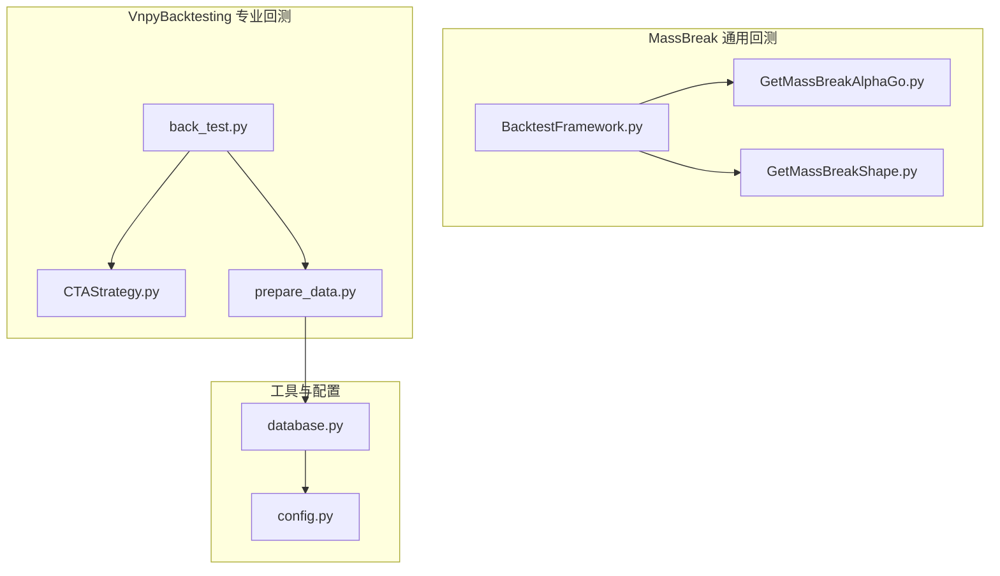
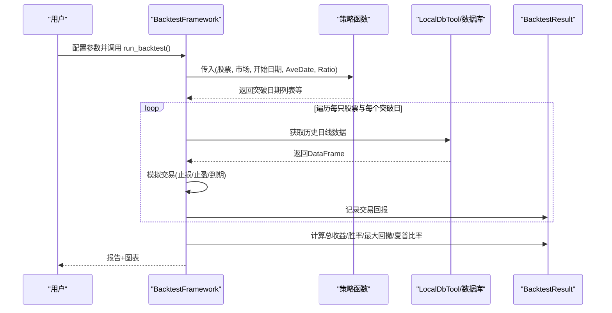
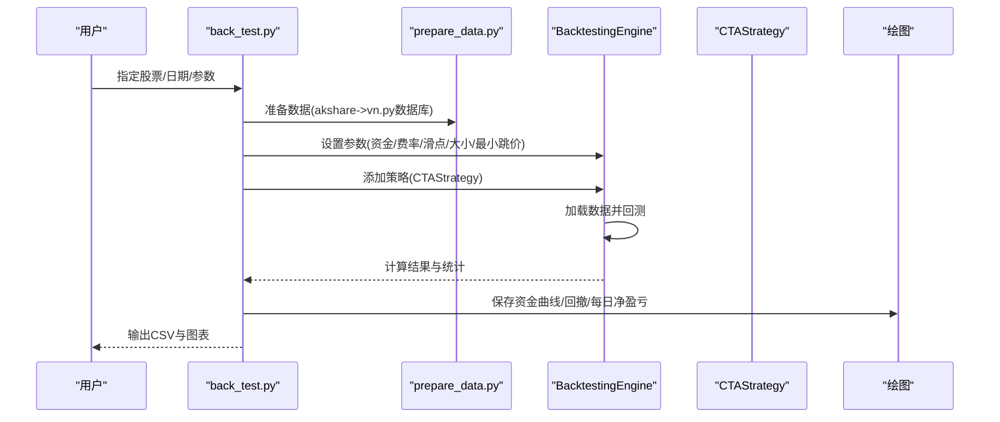
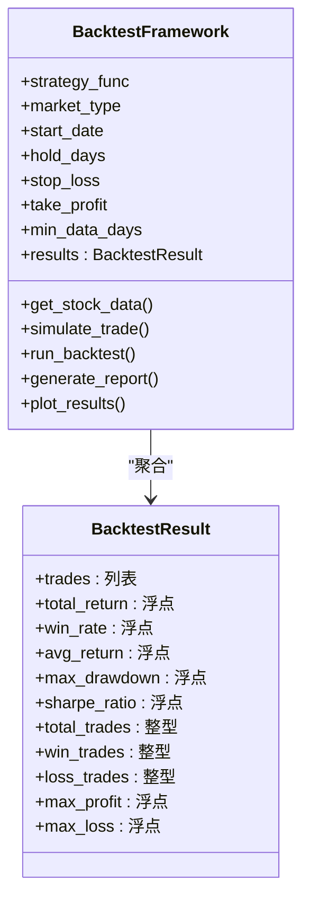
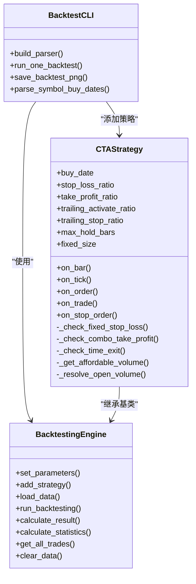
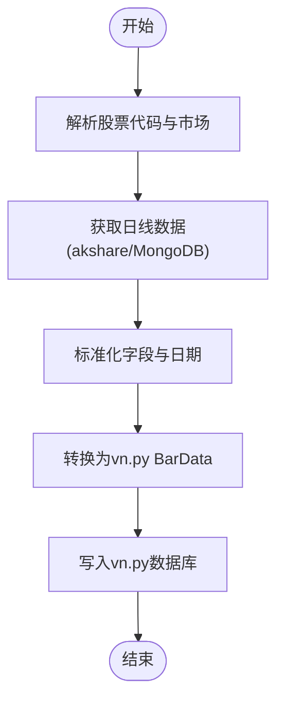
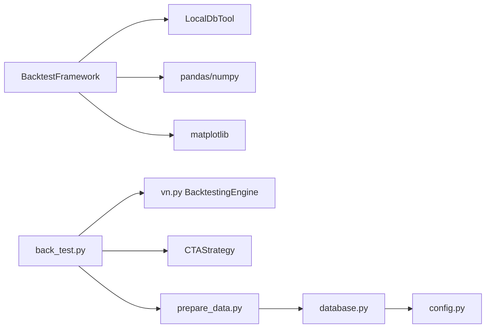

# 回测框架

<cite>
**本文引用的文件**
- [BacktestFramework.py](file://src/MassBreak/BacktestFramework.py)
- [CTAStrategy.py](file://src/VnpyBacktesting/CTAStrategy.py)
- [back_test.py](file://src/VnpyBacktesting/back_test.py)
- [prepare_data.py](file://src/VnpyBacktesting/prepare_data.py)
- [GetMassBreakAlphaGo.py](file://src/MassBreak/GetMassBreakAlphaGo.py)
- [GetMassBreakShape.py](file://src/MassBreak/GetMassBreakShape.py)
- [database.py](file://src/Utils/database.py)
- [config.py](file://src/Utils/config.py)
- [README.md](file://README.md)
</cite>

## 目录
1. [简介](#简介)
2. [项目结构](#项目结构)
3. [核心组件](#核心组件)
4. [架构总览](#架构总览)
5. [详细组件分析](#详细组件分析)
6. [依赖分析](#依赖分析)
7. [性能考虑](#性能考虑)
8. [故障排查指南](#故障排查指南)
9. [结论](#结论)
10. [附录](#附录)

## 简介
本文件系统性梳理并解释该仓库中两个回测框架的设计与实现：
- 通用回测框架：基于策略函数与历史行情数据，模拟交易、计算收益指标、生成可视化图表与报告。
- 基于 vn.py 的专业回测框架：使用 vn.py CTA 回测引擎，支持滑点、手续费、止损止盈、移动止损等真实市场模拟要素。

同时给出策略回测的完整流程、关键参数配置、评估指标计算方法、过拟合检测与策略验证建议，以及性能优化与大规模数据处理的技术要点。

## 项目结构
该项目围绕“新闻与价格数据采集—技术分析—回测验证”主线组织，其中与回测直接相关的主要模块如下：
- MassBreak：通用回测框架与策略适配器
- VnpyBacktesting：基于 vn.py 的专业回测框架
- Utils：数据库与配置工具
- README：整体架构与目标说明

**图表来源**
- [BacktestFramework.py:1-498](file://src/MassBreak/BacktestFramework.py#L1-L498)
- [GetMassBreakAlphaGo.py:1-130](file://src/MassBreak/GetMassBreakAlphaGo.py#L1-L130)
- [GetMassBreakShape.py:1-128](file://src/MassBreak/GetMassBreakShape.py#L1-L128)
- [CTAStrategy.py:1-185](file://src/VnpyBacktesting/CTAStrategy.py#L1-L185)
- [back_test.py:1-287](file://src/VnpyBacktesting/back_test.py#L1-L287)
- [prepare_data.py:1-570](file://src/VnpyBacktesting/prepare_data.py#L1-L570)
- [database.py:1-176](file://src/Utils/database.py#L1-L176)
- [config.py:1-455](file://src/Utils/config.py#L1-L455)

**章节来源**
- [README.md:1-33](file://README.md#L1-L33)

## 核心组件
- 通用回测框架（BacktestFramework）
  - 提供策略函数适配、历史数据获取、单笔交易模拟、批量回测、指标计算与可视化。
- 专业回测框架（vn.py）
  - 基于 vn.py BacktestingEngine，支持滑点、手续费、固定/移动止损止盈、最大持有周期等真实市场要素。
- 策略适配器
  - 将 MassBreak 策略（量能突破）封装为可被通用回测框架调用的函数。
- 数据准备与存储
  - 通过 akshare 获取日线数据，标准化后存入 vn.py 数据库，供专业回测使用。

**章节来源**
- [BacktestFramework.py:34-333](file://src/MassBreak/BacktestFramework.py#L34-L333)
- [CTAStrategy.py:15-185](file://src/VnpyBacktesting/CTAStrategy.py#L15-L185)
- [back_test.py:123-187](file://src/VnpyBacktesting/back_test.py#L123-L187)
- [prepare_data.py:478-528](file://src/VnpyBacktesting/prepare_data.py#L478-L528)

## 架构总览
通用回测框架与专业回测框架分别面向不同场景：
- 通用回测：快速验证策略思想，适合小规模股票池与简单风控逻辑。
- 专业回测：贴近真实市场，支持复杂风控与交易成本建模。

**图表来源**
- [BacktestFramework.py:218-333](file://src/MassBreak/BacktestFramework.py#L218-L333)

**图表来源**
- [back_test.py:123-187](file://src/VnpyBacktesting/back_test.py#L123-L187)
- [prepare_data.py:478-528](file://src/VnpyBacktesting/prepare_data.py#L478-L528)
- [CTAStrategy.py:15-185](file://src/VnpyBacktesting/CTAStrategy.py#L15-L185)

## 详细组件分析

### 通用回测框架 BacktestFramework
- 设计要点
  - 策略函数抽象：通过 strategy_func 接收统一参数，便于替换不同策略。
  - 交易模拟：按突破日买入，按止损/止盈/持有到期三种退出条件计算回报。
  - 指标计算：总收益、胜率、平均收益、最大单笔盈亏、最大回撤、夏普比率。
  - 可视化：收益率分布、累计收益曲线、持有天数分布、退出原因统计。
- 关键流程
  - 获取股票列表与策略结果（突破日期）。
  - 对每个突破日调用 simulate_trade，模拟持有期内的回报与风控触发。
  - 汇总交易记录并计算指标，生成报告与图表。
- 参数配置
  - 市场类型、开始日期、默认持有天数、止损/止盈比例、最少数据天数。
  - 策略参数（AveDate、Ratio）通过策略函数传入，也可在单笔交易覆写。
- 适用场景
  - 快速验证量能突破类策略在历史数据上的表现，适合中小规模回测。

**图表来源**
- [BacktestFramework.py:19-66](file://src/MassBreak/BacktestFramework.py#L19-L66)
- [BacktestFramework.py:34-333](file://src/MassBreak/BacktestFramework.py#L34-L333)

**章节来源**
- [BacktestFramework.py:34-333](file://src/MassBreak/BacktestFramework.py#L34-L333)

### 专业回测框架（vn.py）
- 设计要点
  - 使用 vn.py BacktestingEngine，支持日线级别回测。
  - 策略类 CTAStrategy 实现严格单次开仓、固定止损、组合止盈（固定止盈+移动止盈）、最大持有周期、按资金可承受范围下单。
  - CLI 工具 back_test.py 支持多股票/单股票回测、参数解析、图表保存、结果导出。
- 关键流程
  - 数据准备：akshare 获取日线，标准化后写入 vn.py 数据库。
  - 引擎配置：资金、费率、滑点、合约乘数、最小跳价等。
  - 回测执行：加载数据、运行回测、计算结果与统计、导出交易明细与图表。
- 参数配置
  - 资金、费率、滑点、合约乘数、最小跳价、买入日期、止损比例、止盈比例、移动止盈激活/回调比例、最大持有周期、固定下单手数等。
- 适用场景
  - 需要真实市场模拟（滑点、手续费、涨跌停限制等）的专业回测。

**图表来源**
- [CTAStrategy.py:15-185](file://src/VnpyBacktesting/CTAStrategy.py#L15-L185)
- [back_test.py:123-187](file://src/VnpyBacktesting/back_test.py#L123-L187)

**章节来源**
- [CTAStrategy.py:15-185](file://src/VnpyBacktesting/CTAStrategy.py#L15-L185)
- [back_test.py:123-187](file://src/VnpyBacktesting/back_test.py#L123-L187)

### 数据准备与存储（prepare_data.py）
- 功能概述
  - 解析股票代码、推断交易所、标准化 akshare 日线数据、写入 vn.py 数据库。
  - 支持 cn/us/hk 市场，自动回退到 MongoDB。
- 关键流程
  - 解析输入符号→标准化字段→转换为 vn.py BarData→写入数据库。
- 性能与健壮性
  - 支持重试与代理环境清理，失败时回退到 MongoDB。

**图表来源**
- [prepare_data.py:478-528](file://src/VnpyBacktesting/prepare_data.py#L478-L528)

**章节来源**
- [prepare_data.py:364-437](file://src/VnpyBacktesting/prepare_data.py#L364-L437)
- [prepare_data.py:478-528](file://src/VnpyBacktesting/prepare_data.py#L478-L528)

### 策略适配器（MassBreak 策略）
- AlphaGo 与 Shape 策略
  - 基于量能突破，计算滚动均量、价格方差、MACD 等特征，返回突破日期列表。
  - 适配器将策略函数包装为通用回测框架可调用的形式。
- 使用方式
  - 通过 BacktestFramework(strategy_func=adapter) 运行回测。

**章节来源**
- [GetMassBreakAlphaGo.py:33-65](file://src/MassBreak/GetMassBreakAlphaGo.py#L33-L65)
- [GetMassBreakShape.py:31-66](file://src/MassBreak/GetMassBreakShape.py#L31-L66)
- [BacktestFramework.py:439-448](file://src/MassBreak/BacktestFramework.py#L439-L448)

## 依赖分析
- 通用回测框架
  - 依赖 LocalDbTool 获取历史日线数据，依赖 pandas/numpy 进行指标计算，依赖 matplotlib 进行可视化。
- 专业回测框架
  - 依赖 vn.py BacktestingEngine、CTAStrategy、prepare_data.py 数据准备、database.py/Config 配置。
- 数据层
  - MongoDB 作为历史数据源之一，提供回退能力；akshare 作为主要数据源。

**图表来源**
- [BacktestFramework.py:4-16](file://src/MassBreak/BacktestFramework.py#L4-L16)
- [back_test.py:10-24](file://src/VnpyBacktesting/back_test.py#L10-L24)
- [prepare_data.py:1-20](file://src/VnpyBacktesting/prepare_data.py#L1-L20)
- [database.py:36-61](file://src/Utils/database.py#L36-L61)
- [config.py:39-47](file://src/Utils/config.py#L39-L47)

**章节来源**
- [BacktestFramework.py:4-16](file://src/MassBreak/BacktestFramework.py#L4-L16)
- [back_test.py:10-24](file://src/VnpyBacktesting/back_test.py#L10-L24)
- [prepare_data.py:1-20](file://src/VnpyBacktesting/prepare_data.py#L1-L20)
- [database.py:36-61](file://src/Utils/database.py#L36-L61)
- [config.py:39-47](file://src/Utils/config.py#L39-L47)

## 性能考虑
- 通用回测框架
  - 数据获取与交易模拟均为纯 Python，适合中小规模股票池与少量突破日期。
  - 可通过并行化（如多进程）扩展至更大样本，注意内存与磁盘 IO。
- 专业回测框架
  - vn.py 引擎基于 C++/Cython，性能优异；合理设置数据库连接池与查询索引可提升数据准备效率。
  - 滑点、手续费、最小跳价等参数直接影响回测稳定性与速度，应根据实盘成本设定。
- 大规模数据处理
  - 使用 akshare 时启用代理与重试机制，失败回退到 MongoDB。
  - 数据准备阶段尽量批量写入，减少重复下载与转换。

[本节为通用性能建议，不直接分析具体文件]

## 故障排查指南
- 通用回测
  - 无交易记录：检查策略是否返回有效突破日期、开始日期过滤是否过于严格。
  - 数据缺失：确认 LocalDbTool 能正确读取历史数据，或切换到 MongoDB 回退。
- 专业回测
  - 无历史数据：检查 prepare_data 是否成功写入 vn.py 数据库，确认日期范围与市场类型。
  - 参数异常：核对资金、费率、滑点、合约乘数、最小跳价等是否符合实盘设置。
  - 图表保存失败：确认输出目录存在且有写权限。
- 数据层
  - MongoDB 连接不稳定：利用自动重连装饰器与指数退避策略，适当增大连接池。

**章节来源**
- [BacktestFramework.py:289-301](file://src/MassBreak/BacktestFramework.py#L289-L301)
- [back_test.py:146-154](file://src/VnpyBacktesting/back_test.py#L146-L154)
- [prepare_data.py:401-436](file://src/VnpyBacktesting/prepare_data.py#L401-L436)
- [database.py:15-33](file://src/Utils/database.py#L15-L33)

## 结论
- 通用回测框架适合快速验证策略思想与小规模回测，具备清晰的策略适配接口与可视化能力。
- 专业回测框架更贴近真实市场，支持滑点、手续费、止损止盈、移动止盈等复杂风控，适合精细化策略验证。
- 建议先用通用框架做探索性回测，再用专业框架做深度验证与参数优化。

[本节为总结性内容，不直接分析具体文件]

## 附录

### 回测参数配置清单
- 通用回测（BacktestFramework）
  - 市场类型、开始日期、默认持有天数、止损比例、止盈比例、最少数据天数。
  - 策略参数：AveDate（滚动均值窗口）、Ratio（放量倍数）。
- 专业回测（vn.py）
  - 资金、费率、滑点、合约乘数、最小跳价。
  - 策略参数：买入日期、固定止损比例、固定止盈比例、移动止盈激活比例、移动止盈回调比例、最大持有周期、固定下单手数。

**章节来源**
- [BacktestFramework.py:37-63](file://src/MassBreak/BacktestFramework.py#L37-L63)
- [back_test.py:203-220](file://src/VnpyBacktesting/back_test.py#L203-L220)
- [CTAStrategy.py:30-35](file://src/VnpyBacktesting/CTAStrategy.py#L30-L35)

### 回测结果评估指标
- 通用回测
  - 总收益、胜率、平均收益、最大单笔盈利/亏损、最大回撤、夏普比率（年化）。
- 专业回测
  - 总收益率、年化收益率、最大回撤率、夏普比率、收益回撤比、胜率、总净盈亏、期末资金等。

**章节来源**
- [BacktestFramework.py:311-331](file://src/MassBreak/BacktestFramework.py#L311-L331)
- [back_test.py:26-35](file://src/VnpyBacktesting/back_test.py#L26-L35)

### 策略回测实现流程（两套框架）
- 通用回测
  - 准备：确定策略函数与参数。
  - 运行：遍历股票与突破日，模拟交易并记录回报。
  - 分析：计算指标、生成报告与图表。
- 专业回测
  - 准备：准备数据（akshare→vn.py数据库）。
  - 配置：设置引擎参数与策略参数。
  - 运行：加载数据、回测、统计、导出交易明细与图表。

**章节来源**
- [BacktestFramework.py:218-333](file://src/MassBreak/BacktestFramework.py#L218-L333)
- [back_test.py:123-187](file://src/VnpyBacktesting/back_test.py#L123-L187)
- [prepare_data.py:478-528](file://src/VnpyBacktesting/prepare_data.py#L478-L528)

### 过拟合检测与策略验证方法
- 数据划分
  - 训练集/验证集/测试集：按时间序列划分，避免未来信息泄露。
- 参数扫描
  - 网格搜索或贝叶斯优化，限定参数范围，避免过度拟合。
- 统计显著性检验
  - 使用 t 检验或置换检验评估策略收益显著性。
- 风险控制
  - 引入最大回撤、收益回撤比等稳健指标，避免仅看高收益而忽视风险。
- 多样化验证
  - 不同市场/时间段/风格轮动下验证策略稳定性。

[本节为通用方法论，不直接分析具体文件]

### 性能优化与大规模数据处理建议
- 通用回测
  - 使用多进程/多线程并行回测不同股票或参数组合。
  - 缓存历史数据与中间结果，减少重复 IO。
- 专业回测
  - 合理设置数据库连接池与查询索引，批量写入数据。
  - 控制滑点与手续费参数，避免过度拟合交易成本。
  - 使用代理与重试机制，提高 akshare 数据拉取成功率。

[本节为通用优化建议，不直接分析具体文件]