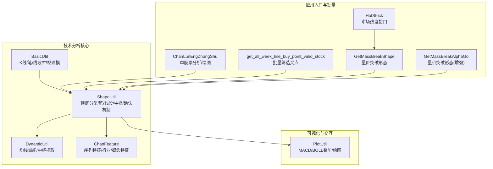
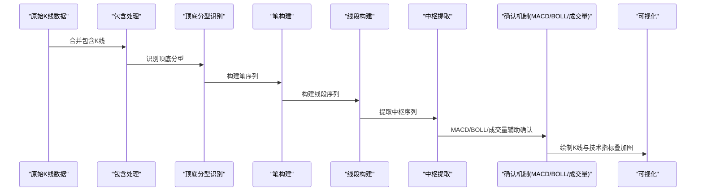
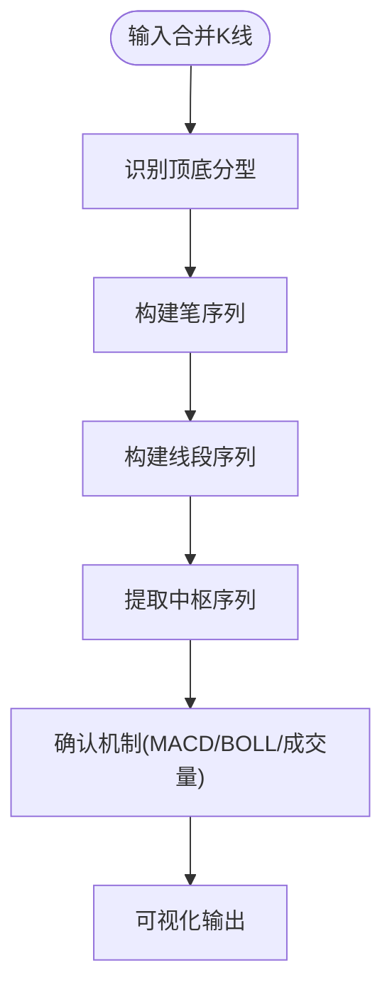
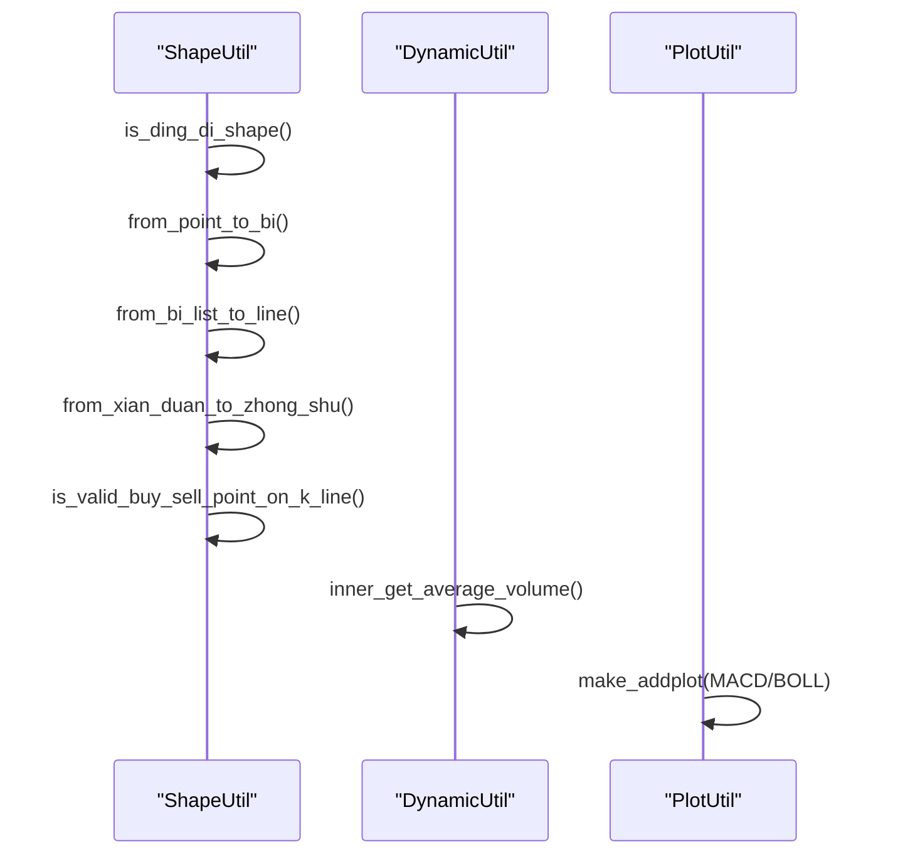
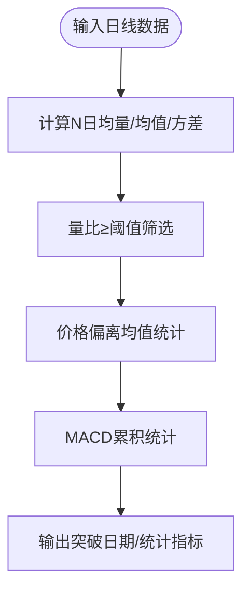
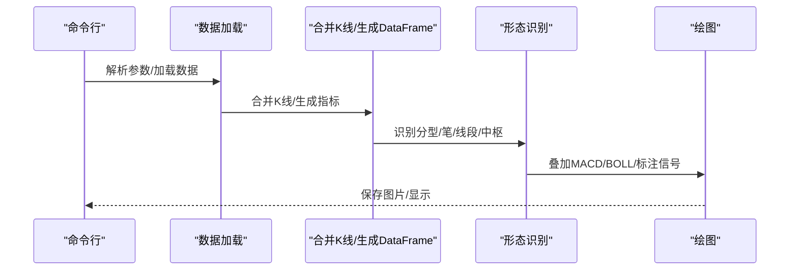
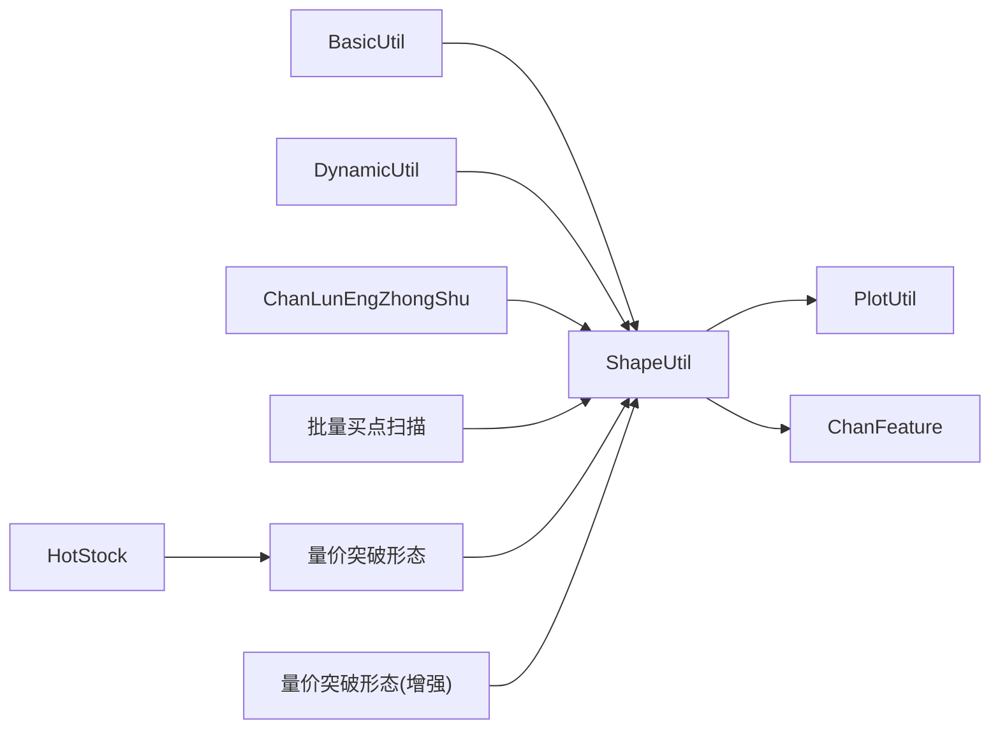

# 形态识别算法

<cite>
**本文引用的文件**   
- [README.md](file://README.md)
- [BasicUtil.py](file://src/ChanUtils/BasicUtil.py)
- [ShapeUtil.py](file://src/ChanUtils/ShapeUtil.py)
- [DynamicUtil.py](file://src/ChanUtils/DynamicUtil.py)
- [PlotUtil.py](file://src/ChanUtils/PlotUtil.py)
- [ChanFeature.py](file://src/ChanUtils/ChanFeature.py)
- [ChanLunEngZhongShu.py](file://src/ChanTechAnalyze/ChanLunEngZhongShu.py)
- [get_all_week_line_buy_point_valid_stock.py](file://src/ChanTechAnalyze/get_all_week_line_buy_point_valid_stock.py)
- [GetMassBreakShape.py](file://src/MassBreak/GetMassBreakShape.py)
- [GetMassBreakAlphaGo.py](file://src/MassBreak/GetMassBreakAlphaGo.py)
- [HotStock.py](file://src/MassBreak/HotStock.py)
</cite>

## 目录
1. [引言](#引言)
2. [项目结构](#项目结构)
3. [核心组件](#核心组件)
4. [架构总览](#架构总览)
5. [详细组件分析](#详细组件分析)
6. [依赖分析](#依赖分析)
7. [性能考量](#性能考量)
8. [故障排查指南](#故障排查指南)
9. [结论](#结论)
10. [附录](#附录)

## 引言
本技术文档聚焦于仓库中的形态识别与技术分析能力，系统梳理缠论驱动的形态识别算法、中枢与线段构建、MACD与布林通道辅助确认机制，以及量价配合与趋势确认策略。文档还提供参数配置指南、可视化展示方法、交互式分析工具说明，并讨论算法在不同市场环境下的适用性与局限性。

## 项目结构
该项目围绕“缠论技术分析”“量价突破形态”“可视化与交互”三大主线展开：
- 技术分析核心：缠论形态识别与中枢/线段构建（BasicUtil、ShapeUtil、DynamicUtil）
- 形态确认与特征工程：MACD/BOLL辅助、成交量放大点、序列特征（ShapeUtil、ChanFeature、PlotUtil）
- 应用入口与批量扫描：命令行入口、批量筛选突破形态（ChanLunEngZhongShu、get_all_week_line_buy_point_valid_stock、GetMassBreakShape、GetMassBreakAlphaGo）
- 市场热度与辅助信息：热点股票与市场热度接口（HotStock）

**图表来源**
- [BasicUtil.py](file://src/ChanUtils/BasicUtil.py)
- [ShapeUtil.py](file://src/ChanUtils/ShapeUtil.py)
- [DynamicUtil.py](file://src/ChanUtils/DynamicUtil.py)
- [ChanFeature.py](file://src/ChanUtils/ChanFeature.py)
- [PlotUtil.py](file://src/ChanUtils/PlotUtil.py)
- [ChanLunEngZhongShu.py](file://src/ChanTechAnalyze/ChanLunEngZhongShu.py)
- [get_all_week_line_buy_point_valid_stock.py](file://src/ChanTechAnalyze/get_all_week_line_buy_point_valid_stock.py)
- [GetMassBreakShape.py](file://src/MassBreak/GetMassBreakShape.py)
- [GetMassBreakAlphaGo.py](file://src/MassBreak/GetMassBreakAlphaGo.py)
- [HotStock.py](file://src/MassBreak/HotStock.py)

**章节来源**
- [README.md](file://README.md)
- [ChanLunEngZhongShu.py](file://src/ChanTechAnalyze/ChanLunEngZhongShu.py)
- [get_all_week_line_buy_point_valid_stock.py](file://src/ChanTechAnalyze/get_all_week_line_buy_point_valid_stock.py)
- [GetMassBreakShape.py](file://src/MassBreak/GetMassBreakShape.py)
- [GetMassBreakAlphaGo.py](file://src/MassBreak/GetMassBreakAlphaGo.py)
- [HotStock.py](file://src/MassBreak/HotStock.py)

## 核心组件
- K线/笔/线段/中枢建模（BasicUtil）
  - 提供K线对象、笔对象、线段对象、中枢对象及其合并/包含关系判定，支撑形态识别基础数据结构。
- 顶底分型与笔/线段/中枢识别（ShapeUtil）
  - 顶底分型识别、笔构建、线段构建、中枢提取、MACD/BOLL辅助确认、买点/卖点确认。
- 动态量能与中枢提取（DynamicUtil）
  - 周期量能阈值、成交量放大点标记、中枢序列提取。
- 特征工程（ChanFeature）
  - 笔/线段序列特征、MACD/Hist聚合特征、中枢强度特征、行业/概念嵌入特征。
- 可视化与交互（PlotUtil）
  - K线蜡烛图叠加MACD柱状图、布林带、中枢上下轨、笔/顶底分型、放量点位标注。

**章节来源**
- [BasicUtil.py](file://src/ChanUtils/BasicUtil.py)
- [ShapeUtil.py](file://src/ChanUtils/ShapeUtil.py)
- [DynamicUtil.py](file://src/ChanUtils/DynamicUtil.py)
- [ChanFeature.py](file://src/ChanUtils/ChanFeature.py)
- [PlotUtil.py](file://src/ChanUtils/PlotUtil.py)

## 架构总览
形态识别算法以“K线→包含处理→顶底分型→笔→线段→中枢→确认机制”的流水线方式工作；同时引入MACD/BOLL与成交量放大点进行确认与增强。

**图表来源**
- [BasicUtil.py](file://src/ChanUtils/BasicUtil.py)
- [ShapeUtil.py](file://src/ChanUtils/ShapeUtil.py)
- [DynamicUtil.py](file://src/ChanUtils/DynamicUtil.py)
- [PlotUtil.py](file://src/ChanUtils/PlotUtil.py)

## 详细组件分析

### 组件A：缠论形态识别与中枢/线段构建
- 顶底分型识别
  - 基于三K线局部极值判定顶/底分型，支持参数化间隔控制（k_param），并进行二次合并与一致性回溯修正。
- 笔构建
  - 依据分型序列，按方向与高低点约束构建笔，记录起止索引、值域与累计成交量。
- 线段构建
  - 以笔为单位，按方向连续组合，遇到破坏则通过“特征序列缺口+后续反向分型”机制判定实际停止点，避免简单笔破坏导致误判。
- 中枢提取
  - 三段线段重叠形成中枢，支持合并与强度度量（中枢区间/中轴、震荡强度比率、时间跨度）。

**图表来源**
- [ShapeUtil.py](file://src/ChanUtils/ShapeUtil.py)
- [BasicUtil.py](file://src/ChanUtils/BasicUtil.py)
- [DynamicUtil.py](file://src/ChanUtils/DynamicUtil.py)
- [PlotUtil.py](file://src/ChanUtils/PlotUtil.py)

**章节来源**
- [ShapeUtil.py](file://src/ChanUtils/ShapeUtil.py)
- [BasicUtil.py](file://src/ChanUtils/BasicUtil.py)
- [DynamicUtil.py](file://src/ChanUtils/DynamicUtil.py)

### 组件B：确认机制与验证算法
- MACD确认
  - 计算MACD柱状图（红/绿）、标准化方向、交叉列表；在周线/日线级别结合柱状面积变化与0轴位置判断趋势与背驰。
- BOLL确认
  - 布林带上下轨与中轨叠加，辅助判断突破位置与强弱区域。
- 成交量确认
  - 周期均量与当日量比阈值触发放量点位，标注买入/卖出信号。
- 买点/卖点判定
  - 结合MACD金叉/死叉、中枢内外位置、价格偏离中枢比例与距离、成交量放大等多因子综合打分。

**图表来源**
- [ShapeUtil.py](file://src/ChanUtils/ShapeUtil.py)
- [DynamicUtil.py](file://src/ChanUtils/DynamicUtil.py)
- [PlotUtil.py](file://src/ChanUtils/PlotUtil.py)

**章节来源**
- [ShapeUtil.py](file://src/ChanUtils/ShapeUtil.py)
- [DynamicUtil.py](file://src/ChanUtils/DynamicUtil.py)
- [PlotUtil.py](file://src/ChanUtils/PlotUtil.py)

### 组件C：量价突破形态识别
- 突破形态定义
  - 以“过去N日均量×倍数”与“价格偏离均值程度”及“MACD累积”等指标筛选突破窗口，强调量价关系与趋势持续性。
- 批量扫描
  - 遍历全市场股票，输出突破日期、价格方差、MACD统计等字段，便于进一步回测与评分。

**图表来源**
- [GetMassBreakShape.py](file://src/MassBreak/GetMassBreakShape.py)
- [GetMassBreakAlphaGo.py](file://src/MassBreak/GetMassBreakAlphaGo.py)

**章节来源**
- [GetMassBreakShape.py](file://src/MassBreak/GetMassBreakShape.py)
- [GetMassBreakAlphaGo.py](file://src/MassBreak/GetMassBreakAlphaGo.py)

### 组件D：可视化与交互式分析
- 可视化要素
  - K线蜡烛图叠加MACD柱状图（红/绿）、信号线、布林带上中下轨；标注顶底分型、笔轨迹、线段轨迹、中枢上下轨、放量点位。
- 交互入口
  - 命令行参数选择市场、代码/符号、周期（日线/周线/分钟线），加载数据、合并K线、识别形态、绘制图形并保存。

**图表来源**
- [ChanLunEngZhongShu.py](file://src/ChanTechAnalyze/ChanLunEngZhongShu.py)
- [PlotUtil.py](file://src/ChanUtils/PlotUtil.py)
- [ShapeUtil.py](file://src/ChanUtils/ShapeUtil.py)

**章节来源**
- [ChanLunEngZhongShu.py](file://src/ChanTechAnalyze/ChanLunEngZhongShu.py)
- [PlotUtil.py](file://src/ChanUtils/PlotUtil.py)

## 依赖分析
- 组件耦合
  - ShapeUtil依赖BasicUtil（数据结构）、DynamicUtil（量能/中枢）、PlotUtil（可视化）。
  - ChanFeature依赖ShapeUtil输出的笔/线段/中枢序列，生成序列特征与行业/概念特征。
  - 批量入口脚本依赖ShapeUtil与数据库/本地数据源。
- 外部依赖
  - 数据加载：pandas、mplfinance、ta（BOLL/MACD）、akshare（市场热度）。
  - 并发与进度：tqdm。

**图表来源**
- [BasicUtil.py](file://src/ChanUtils/BasicUtil.py)
- [ShapeUtil.py](file://src/ChanUtils/ShapeUtil.py)
- [DynamicUtil.py](file://src/ChanUtils/DynamicUtil.py)
- [ChanFeature.py](file://src/ChanUtils/ChanFeature.py)
- [PlotUtil.py](file://src/ChanUtils/PlotUtil.py)
- [ChanLunEngZhongShu.py](file://src/ChanTechAnalyze/ChanLunEngZhongShu.py)
- [get_all_week_line_buy_point_valid_stock.py](file://src/ChanTechAnalyze/get_all_week_line_buy_point_valid_stock.py)
- [GetMassBreakShape.py](file://src/MassBreak/GetMassBreakShape.py)
- [GetMassBreakAlphaGo.py](file://src/MassBreak/GetMassBreakAlphaGo.py)
- [HotStock.py](file://src/MassBreak/HotStock.py)

**章节来源**
- [README.md](file://README.md)

## 性能考量
- 时间复杂度
  - 包含处理与分型识别：O(n)
  - 笔/线段构建：O(n)
  - 中枢提取：O(n)
  - 特征工程：O(n)（序列聚合）
- 空间复杂度
  - 主要受K线/笔/线段/中枢序列长度影响，整体O(n)。
- 优化建议
  - 使用向量化pandas/NumPy替代显式循环。
  - 对长序列采用滑动窗口与增量更新策略。
  - 对MACD/BOLL等指标计算进行缓存复用。

[本节为通用性能讨论，无需具体文件分析]

## 故障排查指南
- 常见异常
  - K线类型不匹配：检查输入数据列名与类型。
  - 索引/方向断层：核对线段合并与方向判定逻辑。
  - 中枢不足：确保线段序列长度≥3。
- 调试手段
  - 开启调试标志查看分型/笔/线段/中枢中间结果。
  - 使用PlotUtil叠加MACD/BOLL与分型标注定位异常点位。
- 参数调优
  - 分型间隔参数k_param、量能阈值v_ratio、MACD交叉窗口、中枢强度阈值等。

**章节来源**
- [ShapeUtil.py](file://src/ChanUtils/ShapeUtil.py)
- [DynamicUtil.py](file://src/ChanUtils/DynamicUtil.py)
- [PlotUtil.py](file://src/ChanUtils/PlotUtil.py)

## 结论
本项目以缠论为核心，构建了从K线到中枢/线段再到确认机制的完整形态识别流程，并融合MACD/BOLL与成交量放大点，形成多因子验证体系。通过可视化与交互式入口，可快速定位潜在形态并进行后续回测与评分。在不同市场环境下，需结合周期选择与参数调优，以提升识别稳定性与泛化能力。

[本节为总结性内容，无需具体文件分析]

## 附录

### 形态识别参数配置指南
- 分型识别
  - k_param：分型之间最小K线间隔，默认3，可按周期调整。
- 笔/线段
  - 方向连续性与破坏判定：保留默认“特征序列缺口+后续反向分型”机制。
- 中枢
  - 中枢长度与强度：通过中枢时间跨度与区间/中轴比率评估。
- 确认机制
  - MACD：0轴位置、柱状面积变化、交叉列表；周线/日线级别阈值不同。
  - BOLL：上下轨与中轨位置，辅助判断突破强弱。
  - 成交量：均量周期与倍数阈值，标注放量点位。
- 特征工程
  - 序列长度归一化、MACD/Hist聚合统计、行业/概念嵌入。

**章节来源**
- [ShapeUtil.py](file://src/ChanUtils/ShapeUtil.py)
- [DynamicUtil.py](file://src/ChanUtils/DynamicUtil.py)
- [ChanFeature.py](file://src/ChanUtils/ChanFeature.py)

### 形态确认机制与验证算法
- 顶底分型
  - 三K线局部极值判定，支持缺口与后续反向分型验证。
- 线段破坏
  - 特征序列缺口+后续反向分型判定实际停止点，避免简单笔破坏误判。
- 买点/卖点
  - MACD金叉/死叉、中枢内外位置、价格偏离与成交量放大综合打分。

**章节来源**
- [ShapeUtil.py](file://src/ChanUtils/ShapeUtil.py)

### 实际案例与可视化
- 单股票分析
  - 命令行参数选择市场/周期/代码，加载数据、合并K线、识别形态、绘制K线+MACD+BOLL+中枢+分型+放量点。
- 批量扫描
  - 遍历全市场股票，筛选满足量价突破条件的日期与统计指标，便于后续回测。

**章节来源**
- [ChanLunEngZhongShu.py](file://src/ChanTechAnalyze/ChanLunEngZhongShu.py)
- [get_all_week_line_buy_point_valid_stock.py](file://src/ChanTechAnalyze/get_all_week_line_buy_point_valid_stock.py)
- [GetMassBreakShape.py](file://src/MassBreak/GetMassBreakShape.py)
- [GetMassBreakAlphaGo.py](file://src/MassBreak/GetMassBreakAlphaGo.py)

### 算法局限性与适用范围
- 局限性
  - 对高频/跳空/流动性差的标的可能存在噪声干扰。
  - 分型与线段判定依赖参数，需结合市场环境动态调整。
- 适用范围
  - 日线/周线为主，分钟线为辅；适合震荡/趋势切换明显的市场阶段。

**章节来源**
- [README.md](file://README.md)