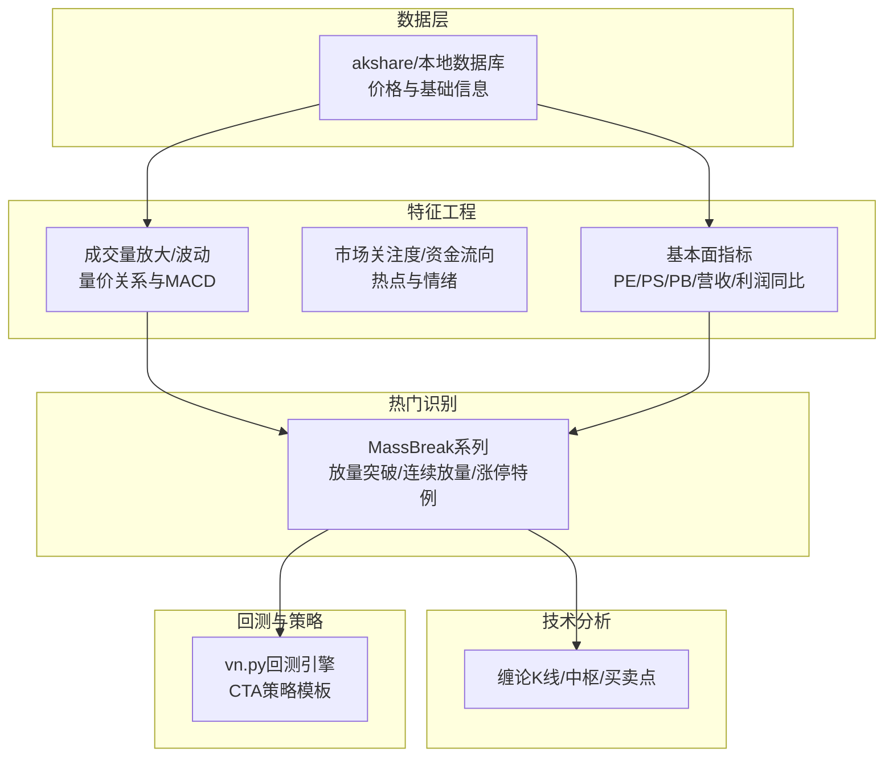
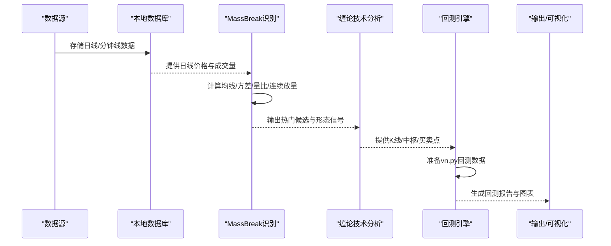
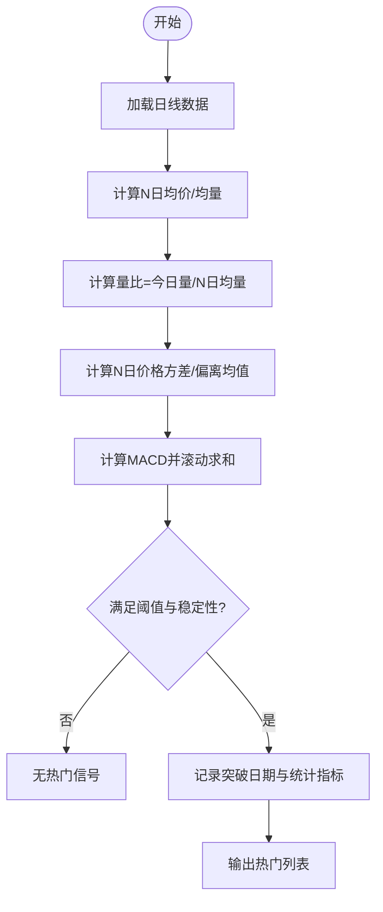
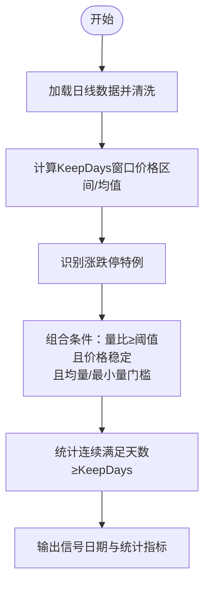
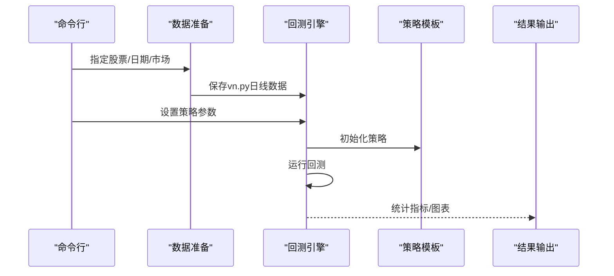
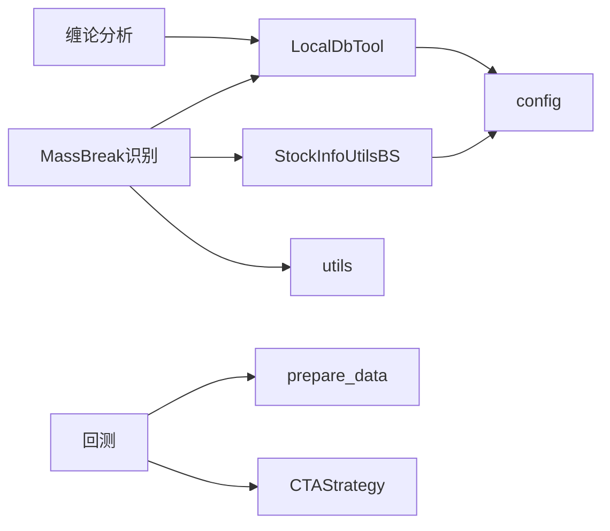

# 热门股票分析

<cite>
**本文引用的文件**
- [README.md](file://README.md)
- [HotStock.py](file://src/MassBreak/HotStock.py)
- [GetMassBreakAlphaGo.py](file://src/MassBreak/GetMassBreakAlphaGo.py)
- [GetMassBreakShape.py](file://src/MassBreak/GetMassBreakShape.py)
- [MassBreakAlphaGo.py](file://src/MassBreak/MassBreakAlphaGo.py)
- [StockFundamentalIndicators.py](file://src/MassBreak/StockFundamentalIndicators.py)
- [LocalDbTool.py](file://src/MongoDbComTools/LocalDbTool.py)
- [StockInfoUtilsBS.py](file://src/MarketPriceSpiderWithScrapy/StockInfoUtilsBS.py)
- [utils.py](file://src/Utils/utils.py)
- [config.py](file://src/Utils/config.py)
- [ChanLunEngZhongShu.py](file://src/ChanTechAnalyze/ChanLunEngZhongShu.py)
- [CTAStrategy.py](file://src/VnpyBacktesting/CTAStrategy.py)
- [back_test.py](file://src/VnpyBacktesting/back_test.py)
- [prepare_data.py](file://src/VnpyBacktesting/prepare_data.py)
</cite>

## 目录
1. [简介](#简介)
2. [项目结构](#项目结构)
3. [核心组件](#核心组件)
4. [架构总览](#架构总览)
5. [详细组件分析](#详细组件分析)
6. [依赖关系分析](#依赖关系分析)
7. [性能考量](#性能考量)
8. [故障排查指南](#故障排查指南)
9. [结论](#结论)
10. [附录](#附录)

## 简介
本项目围绕“热门股票分析”目标，构建了从数据采集、清洗、特征工程、热门识别、技术形态分析到回测验证的完整流水线。系统以成交量放大、价格波动、市场关注度等多维指标为核心，结合板块轮动、资金流向、消息面影响等外部因素，形成可执行的热门股票识别与跟踪方案。系统同时提供回测框架，支持策略参数化与可视化，便于实盘应用与持续优化。

## 项目结构
项目采用模块化组织，主要模块如下：
- MassBreak：热门股票识别与形态分析（量价关系、MACD、连续放量、涨停特例）
- MongoDbComTools：本地数据库访问与价格数据加载
- MarketPriceSpiderWithScrapy：股票基础信息与价格数据抓取
- Utils：通用工具、配置与邮件发送
- ChanTechAnalyze：缠论技术分析（K线、中枢、买卖点）
- VnpyBacktesting：基于vn.py的回测框架与策略
- Fundamentals：基本面指标提取（PE、PS、PB、营收/利润同比）

**章节来源**
- [README.md:1-33](file://README.md#L1-L33)

## 核心组件
- 热门识别（MassBreak）：基于成交量放大与价格稳定性约束，识别底部盘整后放量突破的股票，支持连续放量天数与涨停特例处理。
- 技术分析（缠论）：K线合并、中枢生成、买卖点判定，支撑热门形态的确认与趋势判断。
- 基础设施：本地数据库工具封装、股票池获取、数据准备与回测。
- 市场情绪与资金流：通过市场热度指标与资金流向数据，量化市场关注度与参与意愿。
- 回测框架：策略参数化、数据准备、回测执行与结果统计。

**章节来源**
- [MassBreakAlphaGo.py:104-213](file://src/MassBreak/MassBreakAlphaGo.py#L104-L213)
- [GetMassBreakShape.py:31-66](file://src/MassBreak/GetMassBreakShape.py#L31-L66)
- [GetMassBreakAlphaGo.py:33-65](file://src/MassBreak/GetMassBreakAlphaGo.py#L33-L65)
- [ChanLunEngZhongShu.py:149-174](file://src/ChanTechAnalyze/ChanLunEngZhongShu.py#L149-L174)
- [StockFundamentalIndicators.py:37-101](file://src/MassBreak/StockFundamentalIndicators.py#L37-L101)
- [LocalDbTool.py:226-276](file://src/MongoDbComTools/LocalDbTool.py#L226-L276)
- [StockInfoUtilsBS.py:37-112](file://src/MarketPriceSpiderWithScrapy/StockInfoUtilsBS.py#L37-L112)
- [back_test.py:123-187](file://src/VnpyBacktesting/back_test.py#L123-L187)

## 架构总览
系统整体流程：采集与存储 → 特征工程 → 热门识别 → 技术确认 → 回测验证 → 结果输出与可视化。

**图表来源**
- [LocalDbTool.py:226-276](file://src/MongoDbComTools/LocalDbTool.py#L226-L276)
- [MassBreakAlphaGo.py:104-213](file://src/MassBreak/MassBreakAlphaGo.py#L104-L213)
- [ChanLunEngZhongShu.py:149-174](file://src/ChanTechAnalyze/ChanLunEngZhongShu.py#L149-L174)
- [back_test.py:123-187](file://src/VnpyBacktesting/back_test.py#L123-L187)

## 详细组件分析

### 热门识别算法（量价关系与MACD）
- 输入：日线OHLCV与日期范围
- 关键步骤：
  - 计算N日均价与N日成交量均值，构造“今日量比 = 今日成交量 / N日均量”
  - 计算N日价格方差与价格偏离均值，衡量波动与稳定性
  - 引入MACD滚动求和，辅助趋势确认
  - 过滤条件：量比阈值、价格稳定性窗口、成交量门槛
- 输出：热门突破日期列表、平均方差、价格偏离、累计涨幅、MACD统计

**图表来源**
- [GetMassBreakShape.py:31-66](file://src/MassBreak/GetMassBreakShape.py#L31-L66)
- [GetMassBreakAlphaGo.py:33-65](file://src/MassBreak/GetMassBreakAlphaGo.py#L33-L65)

**章节来源**
- [GetMassBreakShape.py:31-117](file://src/MassBreak/GetMassBreakShape.py#L31-L117)
- [GetMassBreakAlphaGo.py:33-114](file://src/MassBreak/GetMassBreakAlphaGo.py#L33-L114)

### 热门识别（优化版：连续放量与涨停特例）
- 新增约束：
  - 连续放量天数（KeepDays）：仅在持续N天满足放量后才触发
  - 价格稳定性：以KeepDays窗口内最高/最低与均价比衡量，控制震荡幅度
  - 涨停特例：对有涨跌停制度的市场，对“一字涨停”进行特殊处理，避免成交量不明显放大导致漏检
  - 成交量门槛：N日均量与最小量需超过阈值，过滤低流动性标的
- 输出：信号日期、平均方差、最新偏离、量比、平均量比、涨停信号日期与次数

**图表来源**
- [MassBreakAlphaGo.py:104-213](file://src/MassBreak/MassBreakAlphaGo.py#L104-L213)

**章节来源**
- [MassBreakAlphaGo.py:104-296](file://src/MassBreak/MassBreakAlphaGo.py#L104-L296)

### 市场热度与资金流向
- 热度指标来源：市场关注度、机构参与度、历史评分、用户关注指数、市场参与意愿、日度参与意愿、市场成本等
- 实现方式：通过第三方接口获取热点与资金流数据，作为热门识别的补充维度
- 应用建议：将热度指标与量价信号融合，设置权重或阈值，形成综合评分

**章节来源**
- [HotStock.py:10-21](file://src/MassBreak/HotStock.py#L10-L21)

### 基础面指标
- 指标类别：PE（TTM/静态）、PS、PB、总市值、流通市值、最新价、营收同比增长、利润同比增长、扣非利润同比增长
- 数据来源：第三方接口，支持多种输入格式（带/不带市场后缀、纯6位代码）
- 应用建议：剔除低估值陷阱与业绩倒挂标的，优先选择盈利稳健、成长确定性高的股票

**章节来源**
- [StockFundamentalIndicators.py:37-101](file://src/MassBreak/StockFundamentalIndicators.py#L37-L101)

### 技术分析（缠论）
- 功能：K线对象、笔/线段合并、中枢生成、买卖点判定
- 流程：读取日线/周线/分钟线，合并K线，生成中枢，判断买卖点
- 应用：验证热门突破形态，确认趋势延续性与回调风险

**章节来源**
- [ChanLunEngZhongShu.py:149-174](file://src/ChanTechAnalyze/ChanLunEngZhongShu.py#L149-L174)
- [BasicUtil.py:78-98](file://src/ChanUtils/BasicUtil.py#L78-L98)

### 回测框架与策略
- 策略模板：严格单次开仓、固定止损、组合止盈（固定止盈+回撤止盈）、持有天数限制
- 参数：买入日期、止损比例、止盈比例、移动止盈激活与回调幅度、最大持有周期、固定手数
- 流程：准备vn.py数据（akshare→vn.py），运行回测，输出统计指标与图表

**图表来源**
- [prepare_data.py:478-501](file://src/VnpyBacktesting/prepare_data.py#L478-L501)
- [back_test.py:123-187](file://src/VnpyBacktesting/back_test.py#L123-L187)
- [CTAStrategy.py:15-59](file://src/VnpyBacktesting/CTAStrategy.py#L15-L59)

**章节来源**
- [back_test.py:123-287](file://src/VnpyBacktesting/back_test.py#L123-L287)
- [prepare_data.py:478-501](file://src/VnpyBacktesting/prepare_data.py#L478-L501)
- [CTAStrategy.py:15-185](file://src/VnpyBacktesting/CTAStrategy.py#L15-L185)

## 依赖关系分析
- 数据依赖：akshare提供日线/复权数据；本地数据库提供历史数据与基础信息
- 工具依赖：pandas/numpy进行数据处理；tqdm进度条；matplotlib/vnpy绘图与回测
- 配置依赖：config集中管理数据库名、集合名、停用词路径、新闻爬虫配置等

**图表来源**
- [MassBreakAlphaGo.py:7-16](file://src/MassBreak/MassBreakAlphaGo.py#L7-L16)
- [LocalDbTool.py:10-44](file://src/MongoDbComTools/LocalDbTool.py#L10-L44)
- [StockInfoUtilsBS.py:37-54](file://src/MarketPriceSpiderWithScrapy/StockInfoUtilsBS.py#L37-L54)
- [utils.py:60-66](file://src/Utils/utils.py#L60-L66)
- [config.py:39-53](file://src/Utils/config.py#L39-L53)
- [prepare_data.py:17-21](file://src/VnpyBacktesting/prepare_data.py#L17-L21)
- [CTAStrategy.py:15-26](file://src/VnpyBacktesting/CTAStrategy.py#L15-L26)

**章节来源**
- [config.py:39-53](file://src/Utils/config.py#L39-L53)
- [LocalDbTool.py:10-44](file://src/MongoDbComTools/LocalDbTool.py#L10-L44)
- [StockInfoUtilsBS.py:37-54](file://src/MarketPriceSpiderWithScrapy/StockInfoUtilsBS.py#L37-L54)

## 性能考量
- 并行与批处理：批量扫描全市场股票时，利用pandas的progress_apply与tqdm提升交互体验；建议在服务器端使用多进程或分布式任务队列
- 数据缓存：优先使用本地数据库缓存历史数据，减少重复拉取；对高频查询建立索引
- 内存与IO：对长序列滚动计算（均线/方差/量比）采用分块处理；及时释放中间变量，避免内存峰值过高
- 网络与限流：第三方接口存在速率限制，建议增加重试与退避策略；必要时使用代理池

## 故障排查指南
- 数据缺失：检查日期范围与市场类型，确认本地数据库中是否存在对应集合；若无则回退至akshare拉取
- 量价信号异常：核对N日窗口与量比阈值设置；检查是否误删低流动性标的（均量/最小量门槛）
- 缠论分析失败：确认K线合并逻辑与方向一致性；检查顶底分型与笔/线段合并边界
- 回测报错：检查vn.py数据准备阶段是否成功保存；确认策略参数合法性与资金/滑点设置

**章节来源**
- [LocalDbTool.py:226-276](file://src/MongoDbComTools/LocalDbTool.py#L226-L276)
- [MassBreakAlphaGo.py:116-118](file://src/MassBreak/MassBreakAlphaGo.py#L116-L118)
- [prepare_data.py:364-437](file://src/VnpyBacktesting/prepare_data.py#L364-L437)

## 结论
本系统以量价关系为核心，融合市场热度、资金流向与技术形态，形成可落地的热门股票识别与跟踪方案。通过回测框架验证策略可行性，辅以可视化输出，有助于在实盘中持续迭代优化。建议后续引入消息面情感分析与板块轮动因子，进一步提升识别准确率与稳定性。

## 附录
- 实战应用要点
  - 热门识别参数：AveDate（均线窗口）、Ratio（量比阈值）、KeepDays（连续放量天数）、PriceStableThreshold（价格稳定阈值）
  - 技术确认：结合缠论中枢与买卖点，过滤震荡与假突破
  - 回测验证：设定止损/止盈与持有周期，评估胜率与收益回撤比
  - 风险控制：设置最大回撤与单票仓位上限，避免过度集中

- 常见问题
  - 低流动性股票易被误选：提高均量/最小量门槛
  - 涨停一字板无放量：启用涨停特例处理
  - 数据延迟与缺失：定期校验与补采