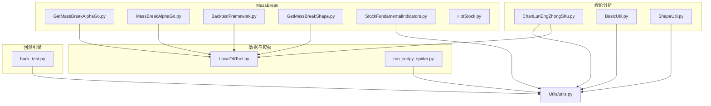
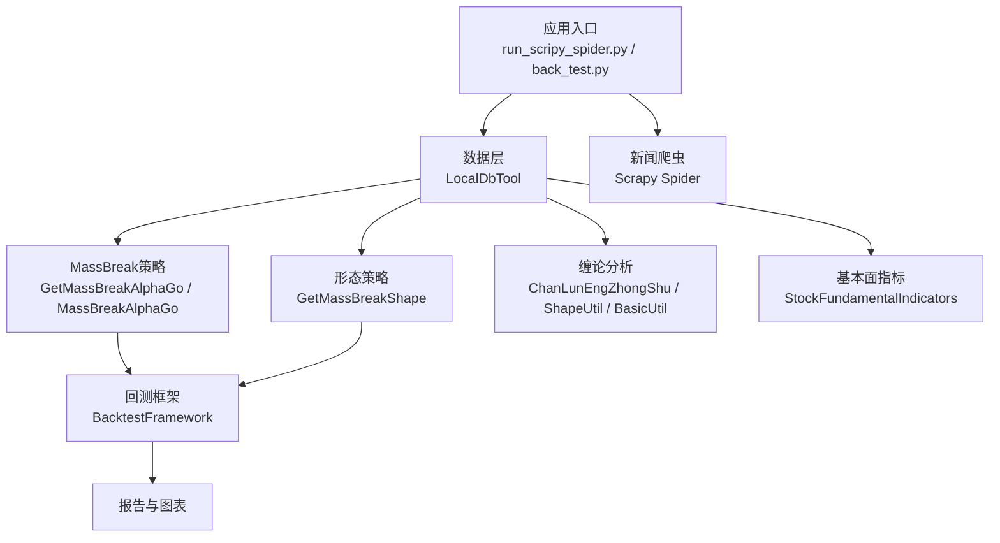
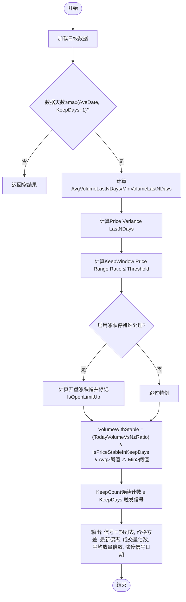
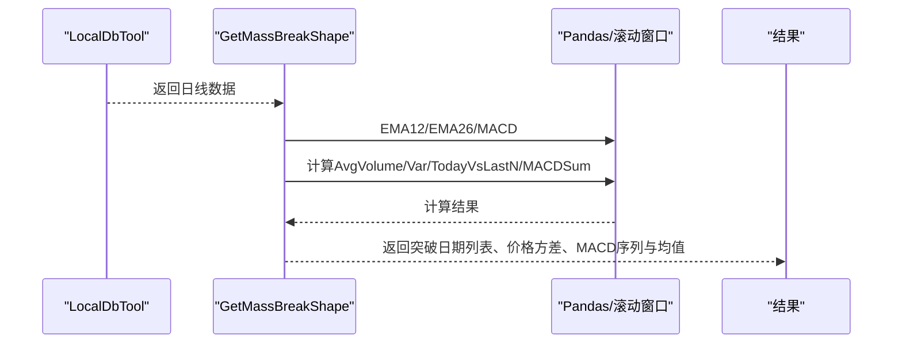
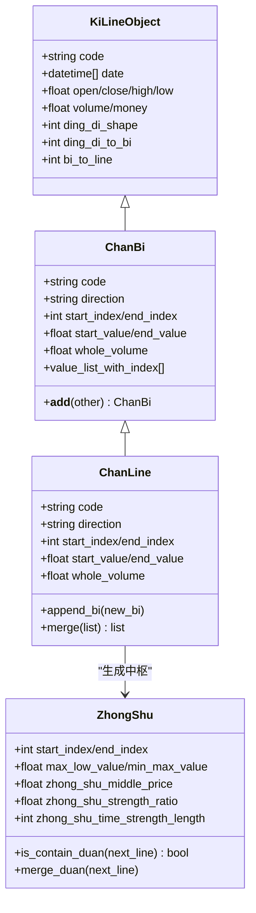
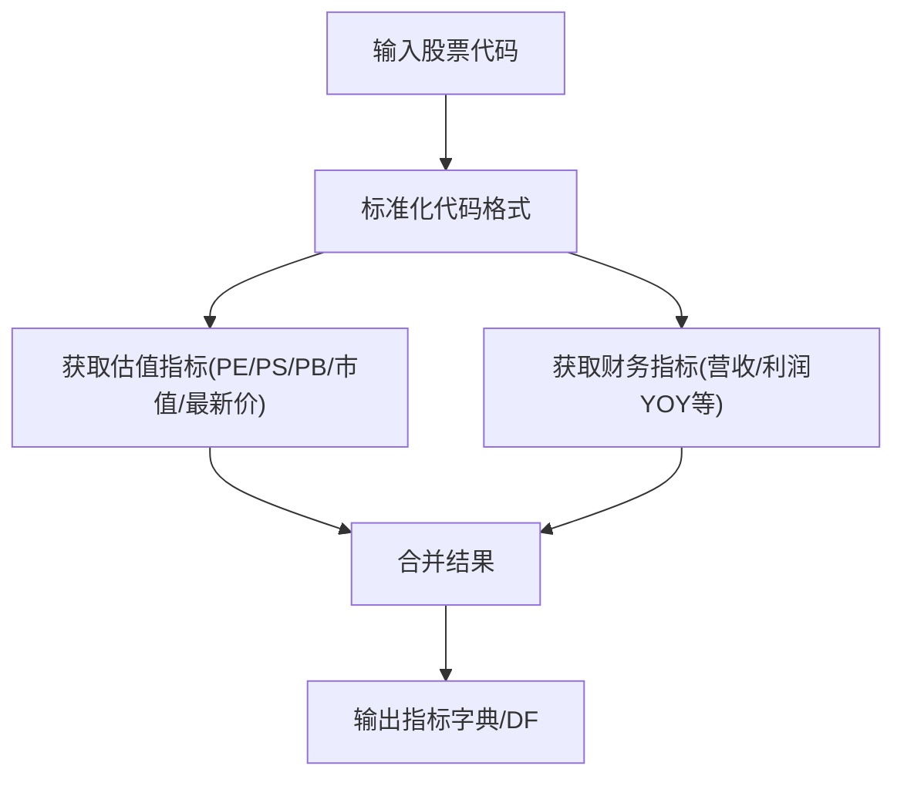
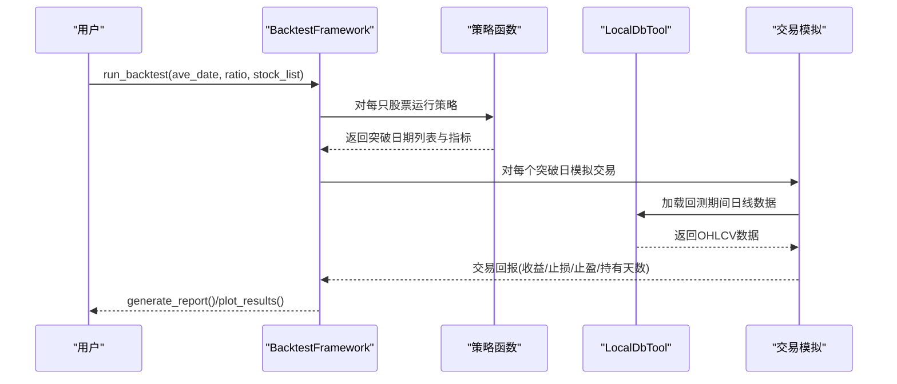
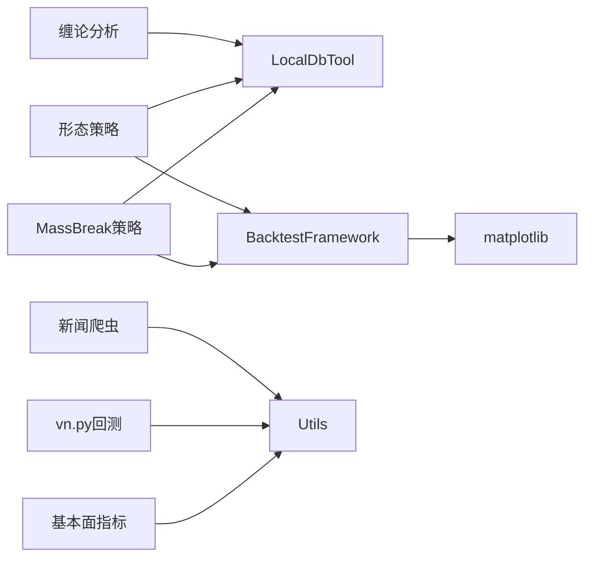

# 牛股挖掘系统

<cite>
**本文引用的文件**   
- [README.md](file://README.md)
- [MassBreak/GetMassBreakAlphaGo.py](file://src/MassBreak/GetMassBreakAlphaGo.py)
- [MassBreak/MassBreakAlphaGo.py](file://src/MassBreak/MassBreakAlphaGo.py)
- [MassBreak/BacktestFramework.py](file://src/MassBreak/BacktestFramework.py)
- [MassBreak/GetMassBreakShape.py](file://src/MassBreak/GetMassBreakShape.py)
- [MassBreak/StockFundamentalIndicators.py](file://src/MassBreak/StockFundamentalIndicators.py)
- [MassBreak/HotStock.py](file://src/MassBreak/HotStock.py)
- [ChanTechAnalyze/ChanLunEngZhongShu.py](file://src/ChanTechAnalyze/ChanLunEngZhongShu.py)
- [ChanUtils/BasicUtil.py](file://src/ChanUtils/BasicUtil.py)
- [ChanUtils/ShapeUtil.py](file://src/ChanUtils/ShapeUtil.py)
- [MongoDbComTools/LocalDbTool.py](file://src/MongoDbComTools/LocalDbTool.py)
- [VnpyBacktesting/back_test.py](file://src/VnpyBacktesting/back_test.py)
- [run_scripy_spider.py](file://src/run_scripy_spider.py)
- [Utils/utils.py](file://src/Utils/utils.py)
</cite>

## 目录
1. [引言](#引言)
2. [项目结构](#项目结构)
3. [核心组件](#核心组件)
4. [架构总览](#架构总览)
5. [详细组件分析](#详细组件分析)
6. [依赖分析](#依赖分析)
7. [性能考虑](#性能考虑)
8. [故障排查指南](#故障排查指南)
9. [结论](#结论)
10. [附录](#附录)

## 引言
本项目旨在构建一套“牛股挖掘系统”，融合量价驱动的MassBreak框架、形态识别与MACD协同的AlphaGo策略、缠论技术分析、基本面指标与新闻情绪分析，并提供可复用的回测框架与可视化报告。系统通过Scrapy采集新闻、通过本地数据库加载历史行情，围绕“底部长期盘整+放量突破”的模式进行自动化扫描与回测验证，辅以缠论中枢与MACD形态学作为二次确认，最终形成可执行的选股池与投资策略。

## 项目结构
项目采用按功能域分层的组织方式，核心模块包括：
- MassBreak：量价突破与回测框架
- ChanTechAnalyze/ChanUtils：缠论技术分析与图形化展示
- MongoDbComTools：本地数据库访问与行情数据加载
- MarketNewsSpiderWithScrapy：新闻爬虫（Scrapy）
- VnpyBacktesting：基于vn.py的策略回测引擎
- Utils：通用工具与配置
- Fundamentals：基本面指标计算

**图表来源**
- [MassBreak/GetMassBreakAlphaGo.py:1-130](file://src/MassBreak/GetMassBreakAlphaGo.py#L1-L130)
- [MassBreak/MassBreakAlphaGo.py:1-296](file://src/MassBreak/MassBreakAlphaGo.py#L1-L296)
- [MassBreak/BacktestFramework.py:1-498](file://src/MassBreak/BacktestFramework.py#L1-L498)
- [MassBreak/GetMassBreakShape.py:1-128](file://src/MassBreak/GetMassBreakShape.py#L1-L128)
- [MassBreak/StockFundamentalIndicators.py:1-210](file://src/MassBreak/StockFundamentalIndicators.py#L1-L210)
- [ChanTechAnalyze/ChanLunEngZhongShu.py:1-185](file://src/ChanTechAnalyze/ChanLunEngZhongShu.py#L1-L185)
- [ChanUtils/BasicUtil.py:1-695](file://src/ChanUtils/BasicUtil.py#L1-L695)
- [ChanUtils/ShapeUtil.py:1-800](file://src/ChanUtils/ShapeUtil.py#L1-L800)
- [MongoDbComTools/LocalDbTool.py:1-288](file://src/MongoDbComTools/LocalDbTool.py#L1-L288)
- [VnpyBacktesting/back_test.py:1-287](file://src/VnpyBacktesting/back_test.py#L1-L287)
- [run_scripy_spider.py:1-145](file://src/run_scripy_spider.py#L1-L145)
- [Utils/utils.py:1-251](file://src/Utils/utils.py#L1-L251)

**章节来源**
- [README.md:1-33](file://README.md#L1-L33)

## 核心组件
- MassBreak量价突破策略：基于均线窗口、成交量均值与方差，识别底部盘整后放量突破的候选股票。
- AlphaGo策略：在量价突破基础上，引入MACD与价格稳定性约束，提升信号质量。
- 缠论技术分析：基于顶底分型、笔、线段与中枢，结合MACD柱状图与BOLL带进行形态学确认。
- 基本面指标：市盈率、市销率、营收/利润同比、总市值等，用于筛选合理估值与成长性。
- 回测框架：支持MassBreak与形态策略的批量回测，输出收益指标与可视化图表。
- 新闻爬虫：Scrapy驱动的多站点新闻采集，支撑情绪分析与事件驱动策略。

**章节来源**
- [MassBreak/GetMassBreakAlphaGo.py:1-130](file://src/MassBreak/GetMassBreakAlphaGo.py#L1-L130)
- [MassBreak/MassBreakAlphaGo.py:1-296](file://src/MassBreak/MassBreakAlphaGo.py#L1-L296)
- [MassBreak/BacktestFramework.py:1-498](file://src/MassBreak/BacktestFramework.py#L1-L498)
- [MassBreak/GetMassBreakShape.py:1-128](file://src/MassBreak/GetMassBreakShape.py#L1-L128)
- [MassBreak/StockFundamentalIndicators.py:1-210](file://src/MassBreak/StockFundamentalIndicators.py#L1-L210)
- [ChanTechAnalyze/ChanLunEngZhongShu.py:1-185](file://src/ChanTechAnalyze/ChanLunEngZhongShu.py#L1-L185)
- [ChanUtils/BasicUtil.py:1-695](file://src/ChanUtils/BasicUtil.py#L1-L695)
- [ChanUtils/ShapeUtil.py:1-800](file://src/ChanUtils/ShapeUtil.py#L1-L800)
- [MongoDbComTools/LocalDbTool.py:1-288](file://src/MongoDbComTools/LocalDbTool.py#L1-L288)
- [VnpyBacktesting/back_test.py:1-287](file://src/VnpyBacktesting/back_test.py#L1-L287)
- [run_scripy_spider.py:1-145](file://src/run_scripy_spider.py#L1-L145)
- [Utils/utils.py:1-251](file://src/Utils/utils.py#L1-L251)

## 架构总览
系统整体分为三层：
- 数据层：本地数据库封装与行情数据加载（LocalDbTool），支持A/H美市场。
- 策略层：MassBreak量价突破、AlphaGo策略、缠论形态学、基本面指标。
- 应用层：回测框架（BacktestFramework）、vn.py回测、新闻爬虫、可视化与报告。

**图表来源**
- [MongoDbComTools/LocalDbTool.py:1-288](file://src/MongoDbComTools/LocalDbTool.py#L1-L288)
- [MassBreak/GetMassBreakAlphaGo.py:1-130](file://src/MassBreak/GetMassBreakAlphaGo.py#L1-L130)
- [MassBreak/MassBreakAlphaGo.py:1-296](file://src/MassBreak/MassBreakAlphaGo.py#L1-L296)
- [MassBreak/GetMassBreakShape.py:1-128](file://src/MassBreak/GetMassBreakShape.py#L1-L128)
- [ChanTechAnalyze/ChanLunEngZhongShu.py:1-185](file://src/ChanTechAnalyze/ChanLunEngZhongShu.py#L1-L185)
- [ChanUtils/ShapeUtil.py:1-800](file://src/ChanUtils/ShapeUtil.py#L1-L800)
- [ChanUtils/BasicUtil.py:1-695](file://src/ChanUtils/BasicUtil.py#L1-L695)
- [MassBreak/StockFundamentalIndicators.py:1-210](file://src/MassBreak/StockFundamentalIndicators.py#L1-L210)
- [MassBreak/BacktestFramework.py:1-498](file://src/MassBreak/BacktestFramework.py#L1-L498)
- [run_scripy_spider.py:1-145](file://src/run_scripy_spider.py#L1-L145)
- [VnpyBacktesting/back_test.py:1-287](file://src/VnpyBacktesting/back_test.py#L1-L287)

## 详细组件分析

### MassBreak量价突破策略（AlphaGo）
设计理念：在底部长期盘整（价格方差小）后，出现持续放量（成交量较N日均量倍数≥Ratio），并在KeepDays内价格保持稳定，从而识别潜在突破信号。优化版本引入“维持放量连续天数”“最低成交量门槛”“开盘涨停特殊处理”等规则，降低误判。

**图表来源**
- [MassBreak/MassBreakAlphaGo.py:105-212](file://src/MassBreak/MassBreakAlphaGo.py#L105-L212)

**章节来源**
- [MassBreak/MassBreakAlphaGo.py:1-296](file://src/MassBreak/MassBreakAlphaGo.py#L1-L296)
- [MassBreak/GetMassBreakAlphaGo.py:1-130](file://src/MassBreak/GetMassBreakAlphaGo.py#L1-L130)

### 形态识别与MACD协同（AlphaGo形态版）
在量价突破基础上，叠加MACD柱状图累积与价格方差，形成“量价+MACD”的双因子确认。通过MACD柱状图正负标准化与交叉序列，辅助判断多头动能增强与买点有效性。

**图表来源**
- [MassBreak/GetMassBreakShape.py:31-66](file://src/MassBreak/GetMassBreakShape.py#L31-L66)
- [MongoDbComTools/LocalDbTool.py:226-276](file://src/MongoDbComTools/LocalDbTool.py#L226-L276)

**章节来源**
- [MassBreak/GetMassBreakShape.py:1-128](file://src/MassBreak/GetMassBreakShape.py#L1-L128)

### 缠论技术分析（中枢与MACD形态学）
通过顶底分型、笔、线段与中枢的构建，结合MACD柱状图方差与金叉/死叉序列，判断周线级别多头占优、日线级别震荡整理中的低吸机会。

**图表来源**
- [ChanUtils/BasicUtil.py:11-695](file://src/ChanUtils/BasicUtil.py#L11-L695)

**章节来源**
- [ChanTechAnalyze/ChanLunEngZhongShu.py:1-185](file://src/ChanTechAnalyze/ChanLunEngZhongShu.py#L1-L185)
- [ChanUtils/BasicUtil.py:1-695](file://src/ChanUtils/BasicUtil.py#L1-L695)
- [ChanUtils/ShapeUtil.py:1-800](file://src/ChanUtils/ShapeUtil.py#L1-L800)

### 基本面指标计算与应用
提供市盈率（TTM/静态）、市销率、市净率、总市值、最新价及营收/利润同比增长等指标，支持多格式股票代码输入与异常处理，便于筛选合理估值与高成长标的。

**图表来源**
- [MassBreak/StockFundamentalIndicators.py:37-101](file://src/MassBreak/StockFundamentalIndicators.py#L37-L101)

**章节来源**
- [MassBreak/StockFundamentalIndicators.py:1-210](file://src/MassBreak/StockFundamentalIndicators.py#L1-L210)

### 回测框架（BacktestFramework）
通用回测框架，支持MassBreak与形态策略，自动扫描突破日期并模拟交易，计算总收益、胜率、平均收益、最大回撤、夏普比率等指标，并生成可视化图表与CSV报告。

**图表来源**
- [MassBreak/BacktestFramework.py:34-333](file://src/MassBreak/BacktestFramework.py#L34-L333)
- [MongoDbComTools/LocalDbTool.py:226-276](file://src/MongoDbComTools/LocalDbTool.py#L226-L276)

**章节来源**
- [MassBreak/BacktestFramework.py:1-498](file://src/MassBreak/BacktestFramework.py#L1-L498)

### vn.py回测（补充）
基于vn.py的回测引擎，支持单票或多票、指定买入日期、滑点/手续费/资金等参数，输出资金曲线、回撤与每日净盈亏图表，并导出CSV。

**章节来源**
- [VnpyBacktesting/back_test.py:1-287](file://src/VnpyBacktesting/back_test.py#L1-L287)

### 新闻爬虫（Scrapy）
通过Scrapy统一调度多个站点的新闻采集任务，支持按配置批量启动，便于后续情绪分析与事件驱动策略。

**章节来源**
- [run_scripy_spider.py:1-145](file://src/run_scripy_spider.py#L1-L145)

## 依赖分析
- 组件耦合与内聚
  - MassBreak策略依赖LocalDbTool加载日线数据，策略函数与回测框架解耦，便于替换与扩展。
  - 缠论分析模块内部高度内聚，通过BasicUtil/ShapeUtil构建笔线中枢，对外暴露统一接口。
  - 回测框架通过策略适配器对接不同策略，具备良好扩展性。
- 外部依赖
  - 数据源：akshare、本地数据库封装（LocalDbTool）。
  - 可视化：matplotlib。
  - 回测：vn.py BacktestingEngine。
  - 爬虫：Scrapy。

**图表来源**
- [MassBreak/BacktestFramework.py:1-498](file://src/MassBreak/BacktestFramework.py#L1-L498)
- [MongoDbComTools/LocalDbTool.py:1-288](file://src/MongoDbComTools/LocalDbTool.py#L1-L288)
- [ChanUtils/ShapeUtil.py:1-800](file://src/ChanUtils/ShapeUtil.py#L1-L800)
- [MassBreak/StockFundamentalIndicators.py:1-210](file://src/MassBreak/StockFundamentalIndicators.py#L1-L210)
- [VnpyBacktesting/back_test.py:1-287](file://src/VnpyBacktesting/back_test.py#L1-L287)
- [run_scripy_spider.py:1-145](file://src/run_scripy_spider.py#L1-L145)
- [Utils/utils.py:1-251](file://src/Utils/utils.py#L1-L251)

## 性能考虑
- 数据加载与缓存
  - LocalDbTool对日期查询进行候选集归一化与排序，建议在批量扫描时复用连接与索引，减少重复查询。
- 策略计算
  - 滚动窗口与EMA/MACD计算可借助向量化（pandas/numpy）加速；对长周期均线与多标的扫描建议分批执行。
- 回测效率
  - BacktestFramework对每只股票逐一回测，建议并行化（进程池）与结果落盘；对交易模拟阶段可缓存关键日期索引。
- 可视化
  - matplotlib绘图建议批量保存至磁盘，避免阻塞主线程。

[本节为通用指导，无需具体文件来源]

## 故障排查指南
- 数据加载失败
  - 检查LocalDbTool的数据库连接与集合名称配置，确认目标股票在基础信息表中存在。
  - 若日期格式不匹配，参考日期候选归一化逻辑，确保输入格式正确。
- 策略无信号
  - 核对AveDate、Ratio、KeepDays与PriceStableThreshold参数；检查成交量门槛与最低成交量阈值是否过高。
  - 对启用涨跌停特例的市场，确认IsOpenLimitUp逻辑是否误判。
- 回测无交易
  - 确认策略返回的突破日期在回测起始日期之后；检查交易模拟中的持有天数与止损止盈阈值。
- vn.py回测无数据
  - 检查数据准备流程与复权参数；确认vt_symbol与市场类型匹配。

**章节来源**
- [MongoDbComTools/LocalDbTool.py:126-215](file://src/MongoDbComTools/LocalDbTool.py#L126-L215)
- [MassBreak/MassBreakAlphaGo.py:105-212](file://src/MassBreak/MassBreakAlphaGo.py#L105-L212)
- [MassBreak/BacktestFramework.py:218-333](file://src/MassBreak/BacktestFramework.py#L218-L333)
- [VnpyBacktesting/back_test.py:123-187](file://src/VnpyBacktesting/back_test.py#L123-L187)

## 结论
本系统以MassBreak量价突破为核心，融合缠论形态学与基本面指标，配合可复用的回测框架，形成从数据采集、策略扫描、二次确认到回测验证的完整链路。通过参数调优与风控设置，可在不同市场环境下提升选股成功率与收益稳定性。建议后续扩展事件驱动与情绪因子，完善多因子融合与动态权重。

[本节为总结性内容，无需具体文件来源]

## 附录
- 实战应用建议
  - 参数调优：从AveDate=30、Ratio=2起步，逐步调整KeepDays与PriceStableThreshold；结合历史波动率设定止损止盈。
  - 筛选标准：优先选择价格方差小、成交量稳步放大、MACD动能增强、估值合理的标的。
  - 风险控制：设置最大回撤上限与单票仓位上限，回测阶段严格验证夏普比率与最大回撤。
- 常见问题
  - 低流动性股票易被误选：提高AvgVolume与MinVolume门槛。
  - 涨停一字板：启用涨跌停特殊处理，避免成交量不放量误判。

[本节为通用指导，无需具体文件来源]