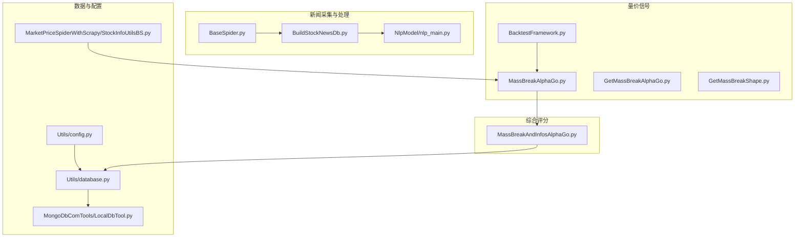
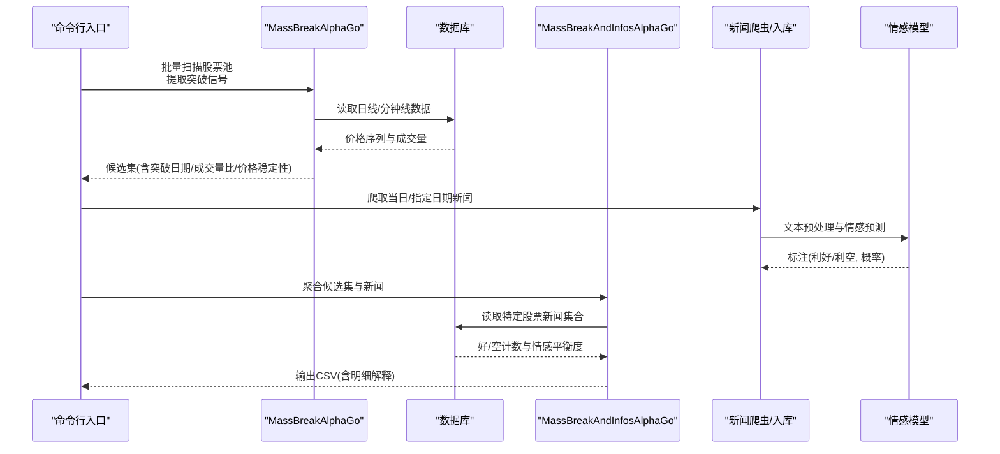
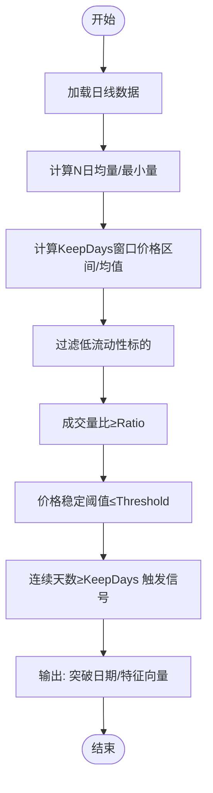
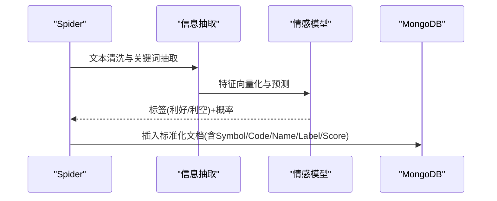
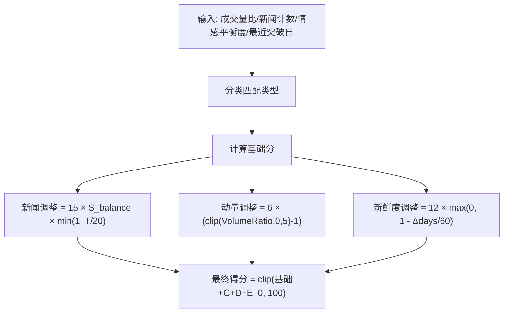
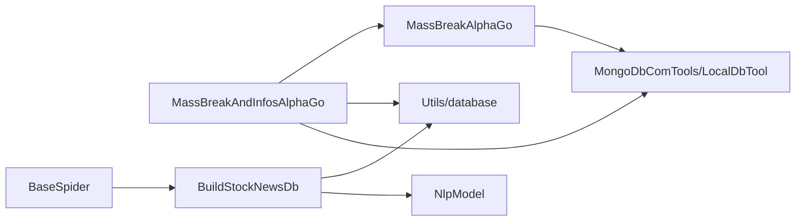

# 综合分析框架

<cite>
**本文引用的文件**   
- [MassBreakAndInfosAlphaGo.py](file://src/MassBreak/MassBreakAndInfosAlphaGo.py)
- [MassBreakAlphaGo.py](file://src/MassBreak/MassBreakAlphaGo.py)
- [GetMassBreakAlphaGo.py](file://src/MassBreak/GetMassBreakAlphaGo.py)
- [GetMassBreakShape.py](file://src/MassBreak/GetMassBreakShape.py)
- [BacktestFramework.py](file://src/MassBreak/BacktestFramework.py)
- [config.py](file://src/Utils/config.py)
- [database.py](file://src/Utils/database.py)
- [LocalDbTool.py](file://src/MongoDbComTools/LocalDbTool.py)
- [StockInfoUtilsBS.py](file://src/MarketPriceSpiderWithScrapy/StockInfoUtilsBS.py)
- [BaseSpider.py](file://src/MarketNewsSpiderWithScrapy/BaseSpider.py)
- [BuildStockNewsDb.py](file://src/MongoDbComTools/BuildStockNewsDb.py)
- [nlp_main.py](file://src/NlpModel/nlp_main.py)
- [README.md](file://README.md)
</cite>

## 目录
1. [引言](#引言)
2. [项目结构](#项目结构)
3. [核心组件](#核心组件)
4. [架构总览](#架构总览)
5. [详细组件分析](#详细组件分析)
6. [依赖分析](#依赖分析)
7. [性能考量](#性能考量)
8. [故障排查指南](#故障排查指南)
9. [结论](#结论)
10. [附录](#附录)

## 引言
本文件面向“MassBreakAndInfosAlphaGo”综合分析框架，系统化梳理其架构设计、数据流、评分体系与参数调优策略。该框架以量价信号（MassBreakAlphaGo）为基础，融合新闻情绪（基于多源爬虫与情感模型）与新鲜度衰减机制，形成可解释、可调参的0-100分综合评分，用于量化择时与选股。文档同时提供评分案例解读、不同市场环境下的适应性调整建议，以及性能优化与大规模数据处理最佳实践。

## 项目结构
项目采用模块化分层组织，围绕“量价信号”“新闻采集与处理”“评分与输出”三大主线展开：
- MassBreak：量价信号识别与批量扫描
- MarketNewsSpiderWithScrapy：多站点新闻爬取与入库
- MongoDbComTools：新闻数据库与文本处理工具
- NlpModel：新闻情感建模与预测
- Utils：数据库连接与全局配置
- MarketPriceSpiderWithScrapy：股票池与价格数据获取
- VnpyBacktesting：回测框架（策略适配）

**图表来源**
- [MassBreakAndInfosAlphaGo.py:1-493](file://src/MassBreak/MassBreakAndInfosAlphaGo.py#L1-L493)
- [MassBreakAlphaGo.py:1-296](file://src/MassBreak/MassBreakAlphaGo.py#L1-L296)
- [GetMassBreakAlphaGo.py:1-130](file://src/MassBreak/GetMassBreakAlphaGo.py#L1-L130)
- [GetMassBreakShape.py:1-128](file://src/MassBreak/GetMassBreakShape.py#L1-L128)
- [BacktestFramework.py:1-498](file://src/MassBreak/BacktestFramework.py#L1-L498)
- [BaseSpider.py:1-149](file://src/MarketNewsSpiderWithScrapy/BaseSpider.py#L1-L149)
- [BuildStockNewsDb.py:1-241](file://src/MongoDbComTools/BuildStockNewsDb.py#L1-L241)
- [nlp_main.py:1-70](file://src/NlpModel/nlp_main.py#L1-L70)
- [config.py:1-455](file://src/Utils/config.py#L1-L455)
- [database.py:1-176](file://src/Utils/database.py#L1-L176)
- [LocalDbTool.py:1-288](file://src/MongoDbComTools/LocalDbTool.py#L1-L288)
- [StockInfoUtilsBS.py:1-124](file://src/MarketPriceSpiderWithScrapy/StockInfoUtilsBS.py#L1-L124)

**章节来源**
- [README.md:1-33](file://README.md#L1-L33)

## 核心组件
- 量价信号模块（MassBreak）
  - 提供“突破窗口内成交量持续放大+价格稳定”的信号识别，支持批量扫描与回测。
- 新闻采集与情感建模
  - 多站点爬虫聚合，基于关键词抽取与情感模型（ML/LLM）标注新闻情绪。
- 综合评分模块（MassBreakAndInfosAlphaGo）
  - 融合量价信号、新闻情绪与新鲜度衰减，输出0-100分及明细解释。
- 数据与配置
  - MongoDB连接、数据库常量、股票池获取、价格数据读取。

**章节来源**
- [MassBreakAlphaGo.py:104-212](file://src/MassBreak/MassBreakAlphaGo.py#L104-L212)
- [MassBreakAndInfosAlphaGo.py:91-184](file://src/MassBreak/MassBreakAndInfosAlphaGo.py#L91-L184)
- [BuildStockNewsDb.py:67-134](file://src/MongoDbComTools/BuildStockNewsDb.py#L67-L134)
- [config.py:39-53](file://src/Utils/config.py#L39-L53)

## 架构总览
MassBreakAndInfosAlphaGo的端到端流程如下：
- 输入：市场类型、起始日期、量价参数（均线窗口、放量倍数、持续天数、价格稳定阈值）、新闻统计起始日期、输出路径等。
- 量价候选生成：通过MassBreakAlphaGo批量扫描股票池，提取突破日期、成交量比、价格稳定性等特征。
- 新闻聚合：按候选股票代码连接特定集合，统计利好/利空数量、情感平衡度。
- 评分计算：按基础分层、新闻调整、动量调整、新鲜度调整合成最终得分。
- 输出：CSV文件（含排名、基础分、新闻调整、动量调整、新鲜度调整、匹配类型等）。

**图表来源**
- [MassBreakAndInfosAlphaGo.py:415-492](file://src/MassBreak/MassBreakAndInfosAlphaGo.py#L415-L492)
- [MassBreakAlphaGo.py:251-286](file://src/MassBreak/MassBreakAlphaGo.py#L251-L286)
- [BuildStockNewsDb.py:157-239](file://src/MongoDbComTools/BuildStockNewsDb.py#L157-L239)
- [BaseSpider.py:41-98](file://src/MarketNewsSpiderWithScrapy/BaseSpider.py#L41-L98)

## 详细组件分析

### 量价信号：MassBreakAlphaGo
- 关键能力
  - 计算N日均量、方差、价格偏离、成交量比、价格稳定窗口（KeepDays）。
  - 过滤低流动性标的（均量/最小量门槛）。
  - 可选“开盘涨停特殊处理”（A股适用）。
  - 输出：突破日期列表、价格方差、最新价格偏离、当日成交量比、信号期平均成交量比、涨停信号日期。
- 批量扫描
  - 自动获取股票池（A/H/NASDAQ），逐个计算信号并落盘CSV。

**图表来源**
- [MassBreakAlphaGo.py:104-212](file://src/MassBreak/MassBreakAlphaGo.py#L104-L212)

**章节来源**
- [MassBreakAlphaGo.py:104-212](file://src/MassBreak/MassBreakAlphaGo.py#L104-L212)
- [MassBreakAlphaGo.py:251-286](file://src/MassBreak/MassBreakAlphaGo.py#L251-L286)

### 新闻采集与情感建模
- 爬虫与入库
  - 多站点爬虫统一抽象，抽取正文、标题、URL、日期等，调用信息抽取与情感模型标注。
  - 将原始新闻按“股票代码”归档至独立集合，字段包含标签（利好/利空）、置信度、原文、相关股票等。
- 情感模型
  - ML与LLM双通道融合，输出类别与概率，用于新闻情绪平衡度计算。

**图表来源**
- [BaseSpider.py:41-98](file://src/MarketNewsSpiderWithScrapy/BaseSpider.py#L41-L98)
- [BuildStockNewsDb.py:67-134](file://src/MongoDbComTools/BuildStockNewsDb.py#L67-L134)
- [nlp_main.py:25-69](file://src/NlpModel/nlp_main.py#L25-L69)

**章节来源**
- [BaseSpider.py:41-98](file://src/MarketNewsSpiderWithScrapy/BaseSpider.py#L41-L98)
- [BuildStockNewsDb.py:67-134](file://src/MongoDbComTools/BuildStockNewsDb.py#L67-L134)
- [nlp_main.py:25-69](file://src/NlpModel/nlp_main.py#L25-L69)

### 综合评分：MassBreakAndInfosAlphaGo
- 数据准备
  - 量价候选：通过load_massbreak_candidates批量生成，包含突破日期、成交量比、价格稳定性等。
  - 新闻聚合：按股票代码连接对应集合，统计利好/利空数量、情感平衡度。
- 评分公式与解释
  - 基础分层（按匹配类型）
    - matched_positive: 72
    - no_match: 52
    - matched_negative: 28
    - matched_neutral: 45
  - 新闻调整：news_adjust = 15 × sentiment_balance × mention_strength；mention_strength = min(1, total_mentions / 20)
  - 动量调整：momentum_adjust = 6 × (clip(TodayVolumeVsN, 0, 5) − 1)
  - 新鲜度调整：recency_adjust = max_score × (1 − days_since_break / decay_days)，其中max_score=12，decay_days=60
  - 最终得分：clip(基础分 + 新闻调整 + 动量调整 + 新鲜度调整, 0, 100)
- 输出字段
  - 排名、基础分、新闻调整、动量调整、新鲜度调整、匹配类型、提及强度、最终得分等。

**图表来源**
- [MassBreakAndInfosAlphaGo.py:306-351](file://src/MassBreak/MassBreakAndInfosAlphaGo.py#L306-L351)

**章节来源**
- [MassBreakAndInfosAlphaGo.py:91-184](file://src/MassBreak/MassBreakAndInfosAlphaGo.py#L91-L184)
- [MassBreakAndInfosAlphaGo.py:187-273](file://src/MassBreak/MassBreakAndInfosAlphaGo.py#L187-L273)
- [MassBreakAndInfosAlphaGo.py:306-407](file://src/MassBreak/MassBreakAndInfosAlphaGo.py#L306-L407)

### 回测框架：BacktestFramework
- 支持两种策略适配（alphago/shape），统一回测流程：
  - 策略执行 → 生成买入信号（突破日）→ 模拟持有期（可配置止盈止损）→ 计算收益指标（总收益、胜率、夏普比率、最大回撤等）。
- 适合对MassBreakAlphaGo评分体系进行策略有效性验证与参数敏感性分析。

**章节来源**
- [BacktestFramework.py:34-333](file://src/MassBreak/BacktestFramework.py#L34-L333)
- [BacktestFramework.py:439-448](file://src/MassBreak/BacktestFramework.py#L439-L448)

## 依赖分析
- 组件耦合
  - MassBreakAndInfosAlphaGo依赖MassBreakAlphaGo生成候选集，依赖数据库读取新闻集合。
  - 新闻侧依赖爬虫与情感模型，入库后按“股票代码”命名集合，形成强关联。
  - 数据访问通过LocalDbTool与Database封装，集中管理连接与查询。
- 外部依赖
  - MongoDB（stock、stock_specific_news）、股票池数据源（baostock）。
  - 情感模型（本地/远程LLM）。

**图表来源**
- [MassBreakAndInfosAlphaGo.py:22-28](file://src/MassBreak/MassBreakAndInfosAlphaGo.py#L22-L28)
- [LocalDbTool.py:10-47](file://src/MongoDbComTools/LocalDbTool.py#L10-L47)
- [database.py:36-63](file://src/Utils/database.py#L36-L63)
- [BuildStockNewsDb.py:19-53](file://src/MongoDbComTools/BuildStockNewsDb.py#L19-L53)

**章节来源**
- [config.py:39-53](file://src/Utils/config.py#L39-L53)
- [LocalDbTool.py:226-276](file://src/MongoDbComTools/LocalDbTool.py#L226-L276)

## 性能考量
- 批处理与并行
  - 使用pandas.progress_apply与tqdm加速批量计算；建议在高并发环境下控制MongoDB连接池大小与查询批大小。
- 数据库优化
  - 为新闻集合按“Symbol/Code/Date”建立索引，提升聚合与时间范围查询效率。
  - 控制聚合管道的match条件与字段投影，减少不必要的数据传输。
- 内存与IO
  - 对长序列滚动窗口计算（均量、方差、价格偏离）时，优先使用向量化操作；必要时分段处理超长序列。
- 模型推理
  - 情感模型建议缓存热点样本，或采用批式推理；LLM调用需考虑限流与重试。
- 回测加速
  - BacktestFramework支持按股票列表回测，可拆分任务并行执行；注意避免重复加载数据。

[本节为通用指导，无需具体文件引用]

## 故障排查指南
- 量价信号为空
  - 检查股票池是否正确加载（MarketPriceSpiderWithScrapy）；确认起始日期与均线窗口合理。
  - 若启用“开盘涨停特殊处理”，确保A股市场标识正确。
- 新闻集合缺失
  - 确认BuildStockNewsDb已完成“按股票归档”；检查目标Symbol是否存在集合。
  - 若使用新版标签（NewLabel），需在调用时启用相应参数。
- MongoDB连接异常
  - 检查Utils/config.py中的IP/端口与认证配置；必要时开启自动重连装饰器。
- 评分异常
  - 核对输入字段（total_mentions、sentiment_balance、TodayVolumeVsN、latest_break_date）是否缺失或格式错误。
  - 检查日期格式与“作为参考日期”的一致性。

**章节来源**
- [MassBreakAndInfosAlphaGo.py:91-184](file://src/MassBreak/MassBreakAndInfosAlphaGo.py#L91-L184)
- [MassBreakAndInfosAlphaGo.py:187-273](file://src/MassBreak/MassBreakAndInfosAlphaGo.py#L187-L273)
- [database.py:15-33](file://src/Utils/database.py#L15-L33)
- [BuildStockNewsDb.py:67-134](file://src/MongoDbComTools/BuildStockNewsDb.py#L67-L134)

## 结论
MassBreakAndInfosAlphaGo通过“量价信号 + 新闻情绪 + 新鲜度衰减”的评分体系，实现了可解释、可调参的综合打分。结合回测框架与大规模数据处理实践，可在不同市场环境下进行参数校准与策略迭代，为量化选股提供稳健支撑。

[本节为总结，无需具体文件引用]

## 附录

### 评分体系设计与参数调优指南
- 基础分层
  - matched_positive: 72；no_match: 52；matched_negative: 28；matched_neutral: 45
  - 建议：根据历史回测胜率与最大回撤微调基础分，使正负样本分布更均衡。
- 新闻调整
  - news_adjust = 15 × sentiment_balance × min(1, total_mentions / 20)
  - 建议：若新闻噪声较大，可降低15的权重；若强调“提及强度”，可适度提高。
- 动量调整
  - momentum_adjust = 6 × (clip(TodayVolumeVsN, 0, 5) − 1)
  - 建议：对极端放量（>5倍）可考虑截断或降权，避免过度放大。
- 新鲜度调整
  - recency_adjust = 12 × max(0, 1 − Δdays/60)
  - 建议：在震荡市延长decay_days，在趋势市缩短以增强时效性。
- 量价参数
  - AveDate：建议30~60；Ratio：2~4；KeepDays：2~5；PriceStableThreshold：0.08~0.15
  - 建议：结合回测框架进行网格搜索，关注夏普比率与最大回撤。

**章节来源**
- [MassBreakAndInfosAlphaGo.py:306-351](file://src/MassBreak/MassBreakAndInfosAlphaGo.py#L306-L351)
- [MassBreakAlphaGo.py:104-212](file://src/MassBreak/MassBreakAlphaGo.py#L104-L212)
- [BacktestFramework.py:218-333](file://src/MassBreak/BacktestFramework.py#L218-L333)

### 数据处理流程（从原始数据到最终评分）
- 量价数据
  - 通过LocalDbTool读取日线数据，计算滚动均量、方差、价格偏离与成交量比。
- 新闻数据
  - 爬虫抽取→信息抽取→情感模型标注→按股票归档至MongoDB。
- 聚合与评分
  - 量价候选集与新闻集合按股票代码合并，计算匹配类型与新鲜度，应用评分公式得到最终得分。

**章节来源**
- [LocalDbTool.py:226-276](file://src/MongoDbComTools/LocalDbTool.py#L226-L276)
- [BuildStockNewsDb.py:157-239](file://src/MongoDbComTools/BuildStockNewsDb.py#L157-L239)
- [MassBreakAndInfosAlphaGo.py:353-407](file://src/MassBreak/MassBreakAndInfosAlphaGo.py#L353-L407)

### 实际评分案例与结果解读
- 案例步骤
  - 选择某日作为“as-of-date”，对候选集计算“距离上次突破天数”→新鲜度调整。
  - 依据新闻集合统计“利好/利空计数与情感平衡度”→新闻调整。
  - 使用当日成交量比计算动量调整。
  - 合成最终得分并排序，查看排名、基础分、各调整项与匹配类型。
- 结果解读
  - 高分样本通常具备近期突破、积极新闻、较强放量与较短新鲜度衰减。
  - 低分样本可能为长期横盘、负面新闻主导或缺乏有效放量。

**章节来源**
- [MassBreakAndInfosAlphaGo.py:353-407](file://src/MassBreak/MassBreakAndInfosAlphaGo.py#L353-L407)

### 不同市场环境下的适应性调整
- A股（含涨跌停制度）
  - 启用“开盘涨停特殊处理”；适当收紧价格稳定阈值；关注集合竞价一字板导致的成交量异常。
- 港股/美股
  - 关闭涨停特殊处理；根据流动性调整均量门槛；对新闻情绪的解读需结合当地监管与披露文化。
- 低波动/高波动市场
  - 低波动：提高价格稳定阈值与新鲜度衰减；高波动：适度放宽阈值并关注极端成交量。

**章节来源**
- [MassBreakAlphaGo.py:156-172](file://src/MassBreak/MassBreakAlphaGo.py#L156-L172)
- [StockInfoUtilsBS.py:37-112](file://src/MarketPriceSpiderWithScrapy/StockInfoUtilsBS.py#L37-L112)