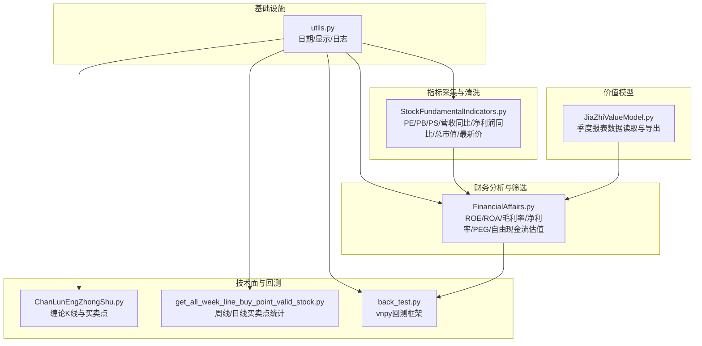
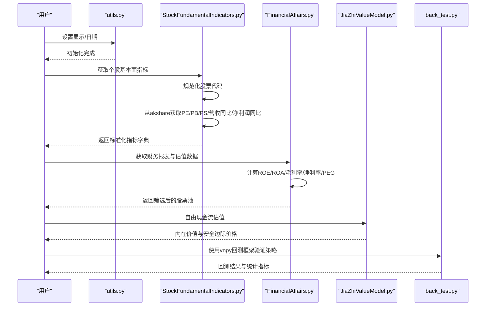
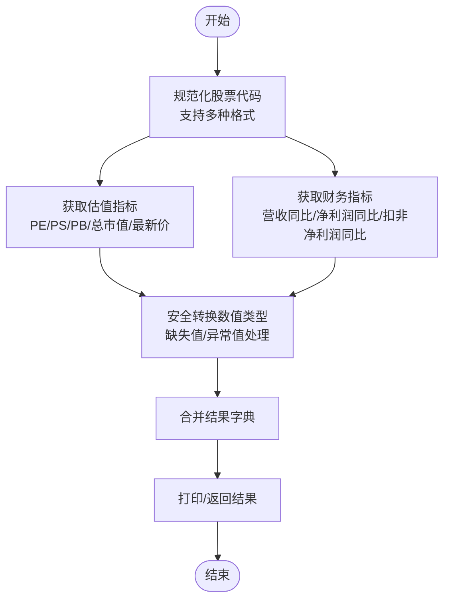
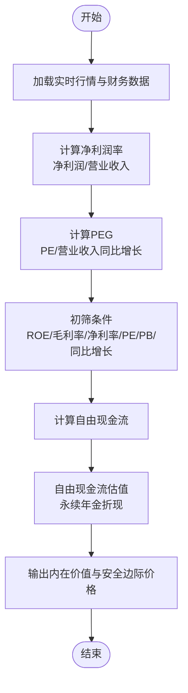
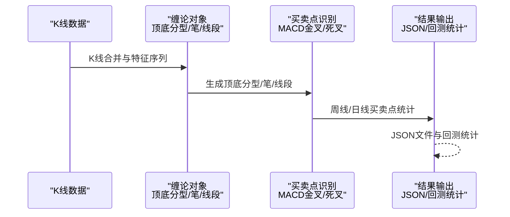
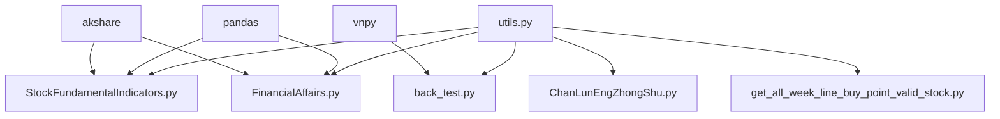

# 股票基本面指标

<cite>
**本文引用的文件**
- [StockFundamentalIndicators.py](file://src/MassBreak/StockFundamentalIndicators.py)
- [FinancialAffairs.py](file://src/FundamentalMarketAnalyze/FinancialAffairs.py)
- [JiaZhiValueModel.py](file://src/FundamentalMarketAnalyze/JiaZhiValueModel.py)
- [README.md](file://README.md)
- [utils.py](file://src/Utils/utils.py)
- [get_all_week_line_buy_point_valid_stock.py](file://src/ChanTechAnalyze/get_all_week_line_buy_point_valid_stock.py)
- [ChanLunEngZhongShu.py](file://src/ChanTechAnalyze/ChanLunEngZhongShu.py)
- [back_test.py](file://src/VnpyBacktesting/back_test.py)
</cite>

## 目录
1. [简介](#简介)
2. [项目结构](#项目结构)
3. [核心组件](#核心组件)
4. [架构概览](#架构概览)
5. [详细组件分析](#详细组件分析)
6. [依赖关系分析](#依赖关系分析)
7. [性能考量](#性能考量)
8. [故障排查指南](#故障排查指南)
9. [结论](#结论)
10. [附录](#附录)

## 简介
本文件系统性梳理仓库中与“股票基本面指标”相关的实现与实践，覆盖指标采集、清洗、估值建模与回测验证的完整流程。重点包括：
- 指标采集：市盈率（PE）、市净率（PB）、市销率（PS）、营业收入同比增长、归属净利润同比增长、扣非净利润同比增长、总市值、最新价等。
- 指标清洗与标准化：统一股票代码格式、缺失值处理、异常值识别与容错。
- 估值与筛选：基于akshare接口的实时估值与财务指标获取，结合ROE、ROA、毛利率、净利率等关键财务指标进行初步筛选。
- 价值模型：基于自由现金流的永续年金估值法，给出内在价值与安全边际价格。
- 回测验证：基于vnpy回测框架，对筛选后的股票池进行回测评估。

本文件旨在帮助读者快速理解并应用这些指标进行选股与策略验证，同时提供异常处理与性能优化建议。

## 项目结构
项目采用模块化组织，与“基本面指标”直接相关的模块如下：
- 基础设施与工具：utils.py 提供日期、显示设置、日志等通用能力。
- 指标采集与清洗：StockFundamentalIndicators.py 提供个股基本面指标的采集与打印。
- 财务分析与筛选：FinancialAffairs.py 提供财务指标筛选、ROE/ROA/毛利率/净利率等关键指标的计算与过滤。
- 价值模型：JiaZhiValueModel.py 展示基于akshare的季度报表数据读取与导出。
- 技术面与回测：ChanLunEngZhongShu.py、get_all_week_line_buy_point_valid_stock.py 展示缠论技术分析与买卖点识别；back_test.py 提供vnpy回测框架的使用示例。

**图表来源**
- [StockFundamentalIndicators.py:1-210](file://src/MassBreak/StockFundamentalIndicators.py#L1-L210)
- [FinancialAffairs.py:1-381](file://src/FundamentalMarketAnalyze/FinancialAffairs.py#L1-L381)
- [JiaZhiValueModel.py:1-24](file://src/FundamentalMarketAnalyze/JiaZhiValueModel.py#L1-L24)
- [utils.py:1-251](file://src/Utils/utils.py#L1-L251)
- [ChanLunEngZhongShu.py:1-185](file://src/ChanTechAnalyze/ChanLunEngZhongShu.py#L1-L185)
- [get_all_week_line_buy_point_valid_stock.py:1-185](file://src/ChanTechAnalyze/get_all_week_line_buy_point_valid_stock.py#L1-L185)
- [back_test.py:1-287](file://src/VnpyBacktesting/back_test.py#L1-L287)

**章节来源**
- [README.md:1-33](file://README.md#L1-L33)

## 核心组件
- 指标采集与清洗模块：负责从akshare获取个股估值与财务指标，统一股票代码格式，安全转换数值类型，处理异常并返回标准化字典。
- 财务分析与筛选模块：基于akshare接口获取财务报表与估值数据，计算ROE、ROA、毛利率、净利率等关键指标，并结合PE/PB阈值与同比增长率进行初筛。
- 价值模型模块：基于自由现金流的永续年金估值法，计算内在价值与安全边际价格，辅助判断是否具备长期投资价值。
- 技术面与回测模块：通过缠论技术分析识别买卖点，结合vnpy回测框架验证策略效果。

**章节来源**
- [StockFundamentalIndicators.py:37-101](file://src/MassBreak/StockFundamentalIndicators.py#L37-L101)
- [FinancialAffairs.py:223-313](file://src/FundamentalMarketAnalyze/FinancialAffairs.py#L223-L313)
- [JiaZhiValueModel.py:12-23](file://src/FundamentalMarketAnalyze/JiaZhiValueModel.py#L12-L23)
- [back_test.py:123-187](file://src/VnpyBacktesting/back_test.py#L123-L187)

## 架构概览
整体架构分为四层：
- 数据接入层：通过akshare接口获取实时行情、估值与财务数据。
- 数据处理层：统一股票代码格式、清洗缺失值、计算衍生指标（如净利润率、PEG）。
- 筛选与建模层：基于财务指标与估值阈值进行初筛，结合自由现金流估值法进行内在价值评估。
- 验证与回测层：利用vnpy回测框架对筛选后的股票池进行回测，评估策略收益与风险。

**图表来源**
- [utils.py:60-66](file://src/Utils/utils.py#L60-L66)
- [StockFundamentalIndicators.py:37-101](file://src/MassBreak/StockFundamentalIndicators.py#L37-L101)
- [FinancialAffairs.py:223-313](file://src/FundamentalMarketAnalyze/FinancialAffairs.py#L223-L313)
- [JiaZhiValueModel.py:12-23](file://src/FundamentalMarketAnalyze/JiaZhiValueModel.py#L12-L23)
- [back_test.py:123-187](file://src/VnpyBacktesting/back_test.py#L123-L187)

## 详细组件分析

### 指标采集与清洗模块（StockFundamentalIndicators.py）
- 功能概述
  - 支持多种股票代码格式输入（如“sh600938”、“600938”、“600938.SH”），统一转换为6位数字与市场后缀。
  - 从akshare获取个股估值（PE TTM、PE 静态、PS、PB、总市值、流通市值、最新价）与财务指标（营业收入同比增长、归属净利润同比增长、扣非净利润同比增长、报告期等）。
  - 安全转换数值类型，处理缺失值与异常值，返回标准化字典。
  - 提供命令行打印接口，便于交互式查看。

- 关键流程
  - 规范化股票代码：根据输入自动识别市场后缀，确保后续接口调用正确。
  - 获取估值指标：调用akshare接口获取最新估值数据，提取PE、PS、PB、总市值、最新价等字段。
  - 获取财务指标：调用akshare接口获取财务分析指标，提取同比增长与绝对值字段。
  - 安全转换：将字符串或NaN转换为浮点数，异常值返回None，避免影响后续分析。

**图表来源**
- [StockFundamentalIndicators.py:10-101](file://src/MassBreak/StockFundamentalIndicators.py#L10-L101)

**章节来源**
- [StockFundamentalIndicators.py:10-101](file://src/MassBreak/StockFundamentalIndicators.py#L10-L101)
- [StockFundamentalIndicators.py:139-146](file://src/MassBreak/StockFundamentalIndicators.py#L139-L146)
- [StockFundamentalIndicators.py:149-197](file://src/MassBreak/StockFundamentalIndicators.py#L149-L197)

### 财务分析与筛选模块（FinancialAffairs.py）
- 功能概述
  - 基于akshare接口获取实时行情与财务数据，计算净利润率、PEG等衍生指标。
  - 结合ROE、ROA、毛利率、净利率、PE/PB阈值与同比增长率进行初筛，形成候选股票池。
  - 计算自由现金流估值，输出内在价值与安全边际价格，辅助判断投资价值。

- 关键流程
  - 获取基础数据：从akshare获取股票实时行情与财务报表数据。
  - 计算财务指标：净利润率 = 净利润 / 营业收入；PEG = PE / 营业收入同比增长。
  - 初筛条件：设定ROE、毛利率、净利率、PE/PB上限与同比增长下限等阈值。
  - 自由现金流估值：基于未来10年自由现金流增长与折现率，计算永续价值与当前估值。

**图表来源**
- [FinancialAffairs.py:107-169](file://src/FundamentalMarketAnalyze/FinancialAffairs.py#L107-L169)
- [FinancialAffairs.py:184-211](file://src/FundamentalMarketAnalyze/FinancialAffairs.py#L184-L211)
- [FinancialAffairs.py:223-313](file://src/FundamentalMarketAnalyze/FinancialAffairs.py#L223-L313)

**章节来源**
- [FinancialAffairs.py:63-169](file://src/FundamentalMarketAnalyze/FinancialAffairs.py#L63-L169)
- [FinancialAffairs.py:184-211](file://src/FundamentalMarketAnalyze/FinancialAffairs.py#L184-L211)
- [FinancialAffairs.py:223-313](file://src/FundamentalMarketAnalyze/FinancialAffairs.py#L223-L313)

### 价值模型模块（JiaZhiValueModel.py）
- 功能概述
  - 展示基于akshare的季度报表数据读取与导出，作为价值选股的基础数据源之一。
  - 通过导出CSV文件，配合后续财务分析与筛选流程。

**章节来源**
- [JiaZhiValueModel.py:12-23](file://src/FundamentalMarketAnalyze/JiaZhiValueModel.py#L12-L23)

### 技术面与回测模块
- 缠论技术分析与买卖点识别：通过K线合并、顶底分型、笔与线段构建，识别MACD金叉/死叉与中枢结构，判断买卖点。
- 周线/日线买卖点统计：对股票池进行周线与日线买卖点统计，输出结果至JSON文件。
- vnpy回测框架：基于vnpy回测引擎，对指定股票与策略参数进行回测，输出收益曲线与统计指标。

**图表来源**
- [ChanLunEngZhongShu.py:113-174](file://src/ChanTechAnalyze/ChanLunEngZhongShu.py#L113-L174)
- [get_all_week_line_buy_point_valid_stock.py:24-52](file://src/ChanTechAnalyze/get_all_week_line_buy_point_valid_stock.py#L24-L52)
- [back_test.py:123-187](file://src/VnpyBacktesting/back_test.py#L123-L187)

**章节来源**
- [ChanLunEngZhongShu.py:113-174](file://src/ChanTechAnalyze/ChanLunEngZhongShu.py#L113-L174)
- [get_all_week_line_buy_point_valid_stock.py:24-52](file://src/ChanTechAnalyze/get_all_week_line_buy_point_valid_stock.py#L24-L52)
- [back_test.py:123-187](file://src/VnpyBacktesting/back_test.py#L123-L187)

## 依赖关系分析
- 外部依赖
  - akshare：用于获取实时行情、估值与财务数据。
  - pandas：用于数据结构化处理与导出。
  - vnpy：用于回测框架集成。
- 内部依赖
  - utils.py：提供日期、显示设置与日志等通用能力，被多个模块复用。
  - StockFundamentalIndicators.py 与 FinancialAffairs.py：共同构成“指标采集—财务分析—筛选”的闭环。
  - 技术面模块与回测模块：与财务分析模块解耦，可独立运行与验证。

**图表来源**
- [StockFundamentalIndicators.py:5-7](file://src/MassBreak/StockFundamentalIndicators.py#L5-L7)
- [FinancialAffairs.py:4-10](file://src/FundamentalMarketAnalyze/FinancialAffairs.py#L4-L10)
- [back_test.py:11-24](file://src/VnpyBacktesting/back_test.py#L11-L24)
- [utils.py:1-14](file://src/Utils/utils.py#L1-L14)

**章节来源**
- [StockFundamentalIndicators.py:5-7](file://src/MassBreak/StockFundamentalIndicators.py#L5-L7)
- [FinancialAffairs.py:4-10](file://src/FundamentalMarketAnalyze/FinancialAffairs.py#L4-L10)
- [back_test.py:11-24](file://src/VnpyBacktesting/back_test.py#L11-L24)
- [utils.py:1-14](file://src/Utils/utils.py#L1-L14)

## 性能考量
- 数据获取频率与并发
  - akshare接口调用存在速率限制，建议在批量获取时控制并发与间隔，避免触发限流。
  - 对于高频回测场景，建议本地缓存关键数据（如PE/PB/ROE/ROA等），减少重复请求。
- 数值处理与内存
  - 使用pandas进行向量化处理，避免逐行循环；对缺失值与异常值进行批处理，提升效率。
  - 对大型股票池进行分批处理与增量写入，降低内存峰值。
- 回测性能
  - 在vnpy回测中合理设置参数（如滑点、手续费、交易单位），避免过度拟合。
  - 对策略参数进行网格/贝叶斯优化时，采用并行计算与早停机制，缩短优化时间。

[本节为通用指导，无需特定文件来源]

## 故障排查指南
- 指标为空或异常
  - 检查股票代码格式是否正确，确保已通过规范化处理。
  - 查看返回字典中的错误键（如“value_error”、“indicator_error”），定位具体接口异常。
  - 对akshare接口返回的空DataFrame进行判空处理，避免后续计算报错。
- 数值转换失败
  - 使用安全转换函数将字符串或NaN转换为浮点数，异常值返回None，避免影响后续分析。
- 回测无历史数据
  - 确认数据准备阶段已完成，检查历史数据是否加载成功。
  - 校验股票代码与市场类型匹配，确保数据可用。

**章节来源**
- [StockFundamentalIndicators.py:74-75](file://src/MassBreak/StockFundamentalIndicators.py#L74-L75)
- [StockFundamentalIndicators.py:96-97](file://src/MassBreak/StockFundamentalIndicators.py#L96-L97)
- [StockFundamentalIndicators.py:139-146](file://src/MassBreak/StockFundamentalIndicators.py#L139-L146)
- [back_test.py:146-154](file://src/VnpyBacktesting/back_test.py#L146-L154)

## 结论
本项目提供了从“指标采集—财务分析—筛选—估值—回测”的完整链路，能够支撑基于基本面的选股策略开发与验证。通过akshare接口与pandas处理，实现了对PE、PB、PS、ROE、ROA、毛利率、净利率等关键指标的高效获取与标准化处理；结合自由现金流估值法与vnpy回测框架，可对策略进行系统性验证。建议在实际应用中关注数据质量、异常处理与性能优化，持续迭代筛选条件与回测参数，以提升策略稳定性与收益风险比。

[本节为总结性内容，无需特定文件来源]

## 附录
- 指标含义与行业对比标准
  - 市盈率（PE）：衡量投资者愿意为每单位盈利支付的价格，需结合行业平均与历史水平进行对比。
  - 市净率（PB）：反映股价相对于净资产的倍数，适用于资产密集型企业。
  - 市销率（PS）：适用于尚未盈利或盈利波动较大的企业，关注营收增长与盈利能力。
  - ROE：净资产收益率，衡量公司运用自有资本的效率，通常应高于行业平均水平。
  - ROA：总资产报酬率，衡量公司整体资产的盈利能力。
  - 销售毛利率/净利率：反映产品竞争力与成本控制能力。
  - 营业收入/净利润同比增长：衡量公司成长性与盈利质量。
- 历史趋势分析方法
  - 对关键指标进行滚动窗口分析（如过去3年/5年的均值与标准差），识别异常波动与拐点。
  - 结合行业景气度与周期性，区分不同阶段的合理估值区间。
- 选股策略权重与组合优化
  - 建议采用多因子打分法，对PE、ROE、ROA、毛利率、净利润同比增长等因子赋予权重，进行归一化与合成评分。
  - 使用最小方差、Black-Litterman或BlackRock优化器进行组合优化，控制组合波动与集中度。
- 数据获取与更新频率
  - 实时行情与估值：建议每日更新；财务报表：按季度/年度更新。
  - 对高频回测场景，建议缓存关键指标并设置定时刷新任务。
- 案例分析与实战建议
  - 选取典型行业（如消费、医药、科技）进行跨周期对比，识别具备稳定ROE与稳健现金流的企业。
  - 结合技术面（MACD金叉/死叉、中枢结构）进行择时，避免在下行周期追高。
  - 对异常指标（如PE骤降、ROE异常上升）进行深入调研，排除一次性收益或财务操纵因素。

[本节为概念性内容，无需特定文件来源]