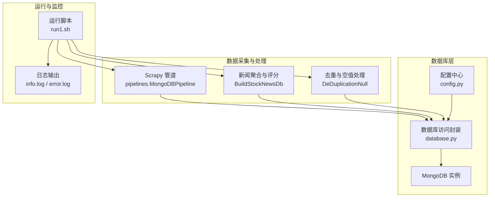
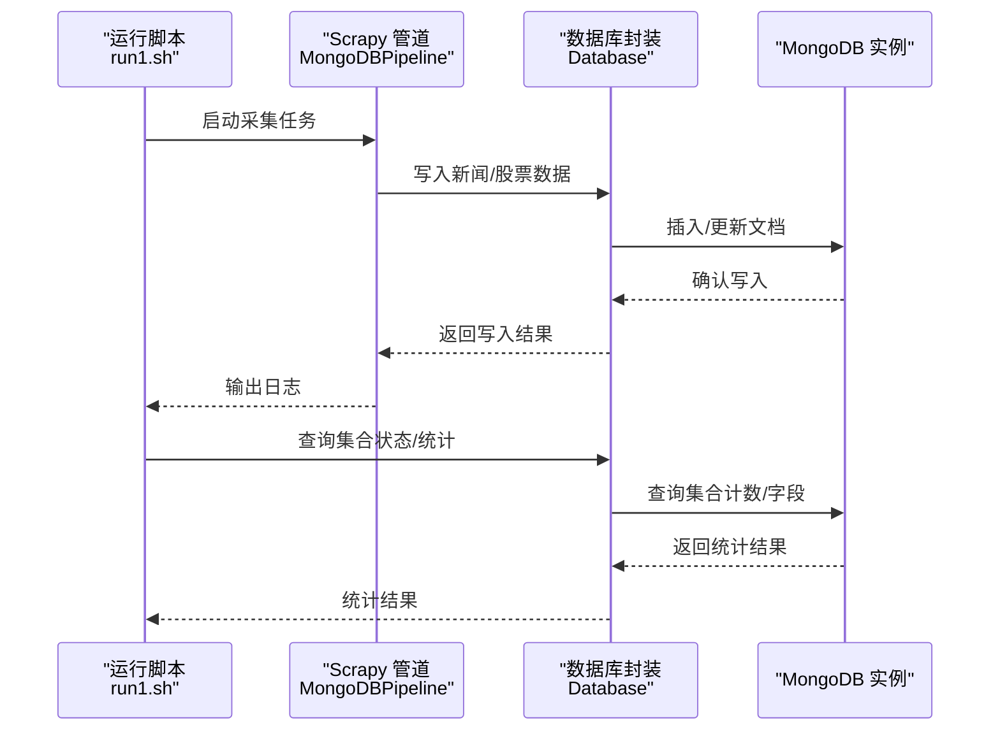
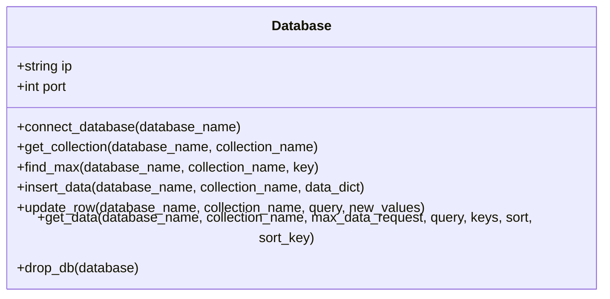
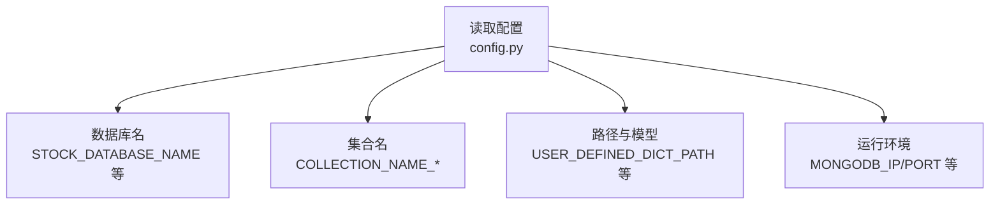
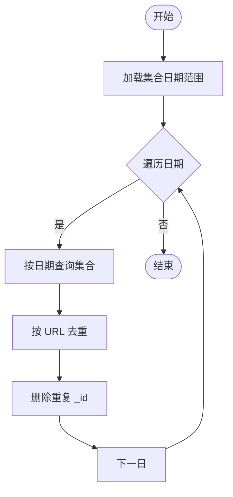
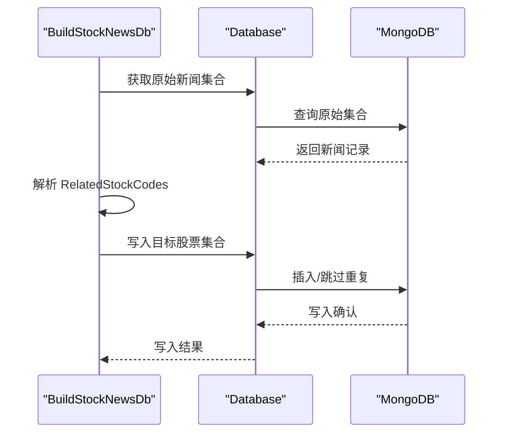
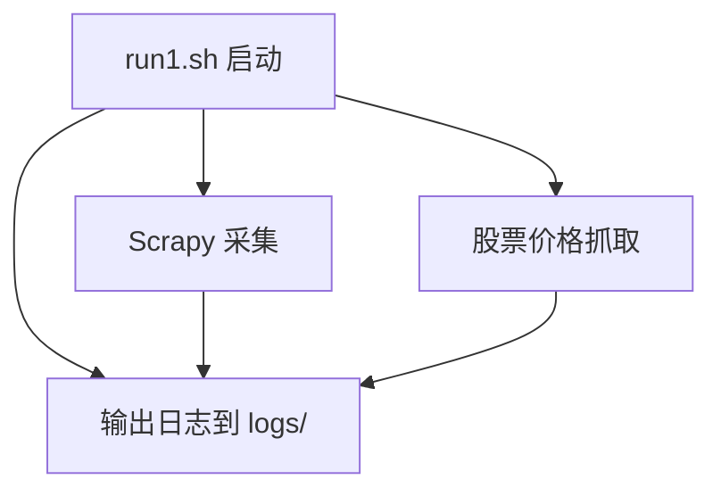
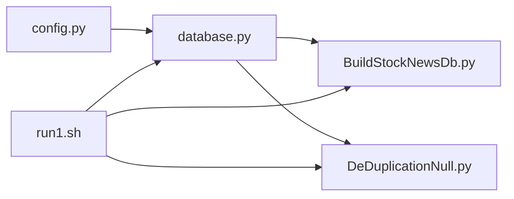

# 备份与恢复

<cite>
**本文引用的文件**
- [README.md](file://README.md)
- [ProblemSolve.md](file://ProblemSolve.md)
- [src/Utils/database.py](file://src/Utils/database.py)
- [src/Utils/config.py](file://src/Utils/config.py)
- [src/MongoDbComTools/LocalDbTool.py](file://src/MongoDbComTools/LocalDbTool.py)
- [src/MongoDbComTools/BuildStockNewsDb.py](file://src/MongoDbComTools/BuildStockNewsDb.py)
- [src/MongoDbComTools/DeDuplicationNull.py](file://src/MongoDbComTools/DeDuplicationNull.py)
- [src/Utils/utils.py](file://src/Utils/utils.py)
- [src/run1.sh](file://src/run1.sh)
- [src/info/week_buy_point_res.json.bak.sh](file://src/info/week_buy_point_res.json.bak.sh)
</cite>

## 目录
1. [简介](#简介)
2. [项目结构](#项目结构)
3. [核心组件](#核心组件)
4. [架构总览](#架构总览)
5. [详细组件分析](#详细组件分析)
6. [依赖分析](#依赖分析)
7. [性能考虑](#性能考虑)
8. [故障排查指南](#故障排查指南)
9. [结论](#结论)
10. [附录](#附录)

## 简介
本文件面向运维与开发团队，系统化梳理本项目的备份与恢复体系，覆盖以下要点：
- 数据备份策略设计与实施：全量备份与增量备份的配置思路与落地建议
- MongoDB 数据库备份与集合级别恢复：结合现有代码中的数据库访问与集合组织方式，给出可操作的备份/恢复步骤
- 自动化脚本与定时任务：基于现有运行脚本与日志输出，设计备份与校验的自动化流程
- 备份数据验证与完整性检查：基于集合计数、字段完整性与时间范围校验的方法
- 灾难恢复计划与演练：从备份到恢复的端到端流程与演练清单
- 存储位置与安全保护：备份介质、归档策略与访问控制
- 恢复测试与验证标准流程：可重复、可审计的验证步骤
- 最佳实践与风险控制：备份窗口、一致性、冗余与回退策略

## 项目结构
该项目以数据采集、清洗、建模与分析为主线，数据库层采用 MongoDB，核心模块包括：
- 数据采集与写入：Scrapy 管道与工具类负责将新闻与股票数据写入 MongoDB
- 数据库访问封装：统一的 Database 类提供连接、查询、插入与更新能力
- 数据清洗与去重：对采集数据按日期与 URL 去重，删除空值与异常时间
- 配置管理：集中定义数据库名称、集合名称、路径等参数
- 运行脚本：提供每日运行与日志输出的入口脚本

**图表来源**
- [src/Utils/database.py](file://src/Utils/database.py)
- [src/Utils/config.py](file://src/Utils/config.py)
- [src/MongoDbComTools/BuildStockNewsDb.py](file://src/MongoDbComTools/BuildStockNewsDb.py)
- [src/MongoDbComTools/DeDuplicationNull.py](file://src/MongoDbComTools/DeDuplicationNull.py)
- [src/run1.sh](file://src/run1.sh)

**章节来源**
- [README.md](file://README.md)
- [src/Utils/config.py](file://src/Utils/config.py)
- [src/Utils/database.py](file://src/Utils/database.py)
- [src/run1.sh](file://src/run1.sh)

## 核心组件
- 数据库访问封装（Database）：提供连接初始化、集合获取、查询、插入、更新与最大值查询等能力，并内置自动重连装饰器，提升稳定性
- 配置中心（config）：集中定义数据库 IP/端口、数据库名、集合名、路径等，便于统一管理
- 数据清洗与去重（DeDuplicationNull）：按日期分批对集合进行去重与空值清理，保障数据质量
- 新闻聚合与评分（BuildStockNewsDb）：将分散的新闻按股票代码聚合到独立集合，支持评分与标签更新
- 运行脚本（run1.sh）：统一调度采集、清洗与聚合任务，并输出日志

**章节来源**
- [src/Utils/database.py](file://src/Utils/database.py)
- [src/Utils/config.py](file://src/Utils/config.py)
- [src/MongoDbComTools/DeDuplicationNull.py](file://src/MongoDbComTools/DeDuplicationNull.py)
- [src/MongoDbComTools/BuildStockNewsDb.py](file://src/MongoDbComTools/BuildStockNewsDb.py)
- [src/run1.sh](file://src/run1.sh)

## 架构总览
下图展示从采集到入库、清洗、聚合与备份的关键路径，以及与 MongoDB 的交互关系。

**图表来源**
- [src/Utils/database.py](file://src/Utils/database.py)
- [src/run1.sh](file://src/run1.sh)

## 详细组件分析

### 数据库访问封装（Database）
- 连接初始化：支持超时与连接池配置，内置自动重连装饰器，降低网络抖动影响
- 集合操作：提供获取集合、查询、插入、更新、最大值查询等方法
- 错误处理：对 AutoReconnect 异常进行指数退避重试，避免瞬时故障导致失败

**图表来源**
- [src/Utils/database.py](file://src/Utils/database.py)

**章节来源**
- [src/Utils/database.py](file://src/Utils/database.py)

### 配置中心（config）
- 数据库与集合命名：集中定义 stock、stock_hk、stock_us 及各新闻库的数据库名与集合名
- 路径与模型：定义停用词、用户词典、模型路径与设备类型等
- 运行环境：定义 MongoDB IP/端口、Redis 等

**图表来源**
- [src/Utils/config.py](file://src/Utils/config.py)

**章节来源**
- [src/Utils/config.py](file://src/Utils/config.py)

### 数据清洗与去重（DeDuplicationNull）
- 去重：按日期分批扫描集合，基于 URL 去除重复记录
- 空值清理：删除关键字段为空的记录
- 时间校验：删除未来时间的异常记录

**图表来源**
- [src/MongoDbComTools/DeDuplicationNull.py](file://src/MongoDbComTools/DeDuplicationNull.py)

**章节来源**
- [src/MongoDbComTools/DeDuplicationNull.py](file://src/MongoDbComTools/DeDuplicationNull.py)

### 新闻聚合与评分（BuildStockNewsDb）
- 聚合：将分散新闻按股票代码拆分并写入独立集合（如 shXXXXXX）
- 标签与评分：可选使用模型或 LLM 对新闻进行情感评分与标签更新
- 报表生成：可选生成最新新闻报表，便于审计与回溯

**图表来源**
- [src/MongoDbComTools/BuildStockNewsDb.py](file://src/MongoDbComTools/BuildStockNewsDb.py)
- [src/Utils/database.py](file://src/Utils/database.py)

**章节来源**
- [src/MongoDbComTools/BuildStockNewsDb.py](file://src/MongoDbComTools/BuildStockNewsDb.py)

### 运行脚本（run1.sh）
- 统一调度：启动 Scrapy 采集、股票价格抓取与回测准备
- 日志输出：将标准输出与错误输出重定向到 logs 目录，便于审计与排障

**图表来源**
- [src/run1.sh](file://src/run1.sh)

**章节来源**
- [src/run1.sh](file://src/run1.sh)

## 依赖分析
- Database 依赖 config 提供的连接参数
- BuildStockNewsDb 依赖 Database 与配置中心，用于集合聚合与写入
- DeDuplicationNull 依赖 Database 与工具函数，用于去重与清理
- 运行脚本依赖上述模块与日志输出

**图表来源**
- [src/Utils/config.py](file://src/Utils/config.py)
- [src/Utils/database.py](file://src/Utils/database.py)
- [src/MongoDbComTools/BuildStockNewsDb.py](file://src/MongoDbComTools/BuildStockNewsDb.py)
- [src/MongoDbComTools/DeDuplicationNull.py](file://src/MongoDbComTools/DeDuplicationNull.py)
- [src/run1.sh](file://src/run1.sh)

**章节来源**
- [src/Utils/config.py](file://src/Utils/config.py)
- [src/Utils/database.py](file://src/Utils/database.py)
- [src/MongoDbComTools/BuildStockNewsDb.py](file://src/MongoDbComTools/BuildStockNewsDb.py)
- [src/MongoDbComTools/DeDuplicationNull.py](file://src/MongoDbComTools/DeDuplicationNull.py)
- [src/run1.sh](file://src/run1.sh)

## 性能考虑
- 连接池与超时：合理设置连接池大小与超时，避免高并发下的连接争用
- 查询优化：对高频查询字段建立索引，减少全表扫描
- 批处理与分页：对大规模去重与清理采用分日期批处理，降低单次事务压力
- 日志与监控：通过 run1.sh 的日志输出与数据库慢查询日志，持续监控性能瓶颈

[本节为通用指导，无需具体文件引用]

## 故障排查指南
- MongoDB 连接问题：检查 MONGODB_IP/PORT 与防火墙，必要时调整超时与连接池参数
- 自动重连：若出现 AutoReconnect，系统会自动重试，建议关注日志中的等待时间与重试次数
- 数据异常：使用 DeDuplicationNull 清理重复与空值，使用 DeleteTimeWrong 校正未来时间
- 日志定位：通过 run1.sh 的日志输出快速定位采集与处理阶段的异常

**章节来源**
- [src/Utils/database.py](file://src/Utils/database.py)
- [src/MongoDbComTools/DeDuplicationNull.py](file://src/MongoDbComTools/DeDuplicationNull.py)
- [src/run1.sh](file://src/run1.sh)

## 结论
本项目已具备较为完善的数据库访问封装、集合组织与数据清洗能力。结合现有脚本与配置，可进一步完善备份与恢复体系：明确全量/增量策略、建立自动化脚本与定时任务、制定验证与演练流程、强化存储与安全保护。通过标准化的备份与恢复流程，可显著提升数据可靠性与业务连续性。

[本节为总结性内容，无需具体文件引用]

## 附录

### 备份与恢复最佳实践
- 备份策略
  - 全量备份：建议在业务低峰期执行，保留完整集合快照
  - 增量备份：基于时间戳或集合变更日志，定期补充差异数据
  - 版本化命名：按日期与版本号命名备份文件，便于检索与回滚
- 自动化与定时任务
  - 使用 crontab 或作业调度系统，定时触发备份脚本
  - 脚本输出日志并记录状态，失败时发送告警
- 验证与完整性检查
  - 集合计数对比：备份前后集合文档数量一致
  - 关键字段完整性：检查必填字段非空
  - 时间范围校验：确保时间字段在预期范围内
- 灾难恢复演练
  - 定期进行恢复演练，验证备份可用性与恢复时间
  - 记录演练过程与耗时，持续优化恢复流程
- 存储与安全
  - 备份介质：本地磁盘+异地存储（如对象存储）
  - 访问控制：限制备份文件访问权限，启用加密传输与静态加密
  - 审计日志：记录备份与恢复操作，确保可追溯

[本节为通用指导，无需具体文件引用]

### 备份与恢复流程（基于现有代码的可操作步骤）
- 全量备份（集合级别）
  - 使用数据库客户端导出目标集合，或通过应用层遍历导出 JSON/CSV
  - 为每个集合生成独立备份文件，包含集合元数据与文档
- 增量备份（集合级别）
  - 基于时间字段（如 Date）筛选新增/修改文档，导出增量数据
  - 与全量备份配合，形成“全量+增量”的组合备份
- 验证与完整性检查
  - 统计集合文档数量，比对备份前后差异
  - 校验关键字段（如 Url、Title、Article 等）完整性
  - 检查时间范围与重复项，确保数据一致性
- 恢复（集合级别）
  - 选择目标备份文件，按集合名称导入
  - 导入后执行去重与空值清理逻辑，确保数据质量
  - 运行一次完整的数据聚合流程，验证下游模块可用性

[本节为通用指导，无需具体文件引用]

### 示例参考文件
- 备份脚本与定时任务示例：可参考 run1.sh 的日志输出与调度方式，扩展为备份与校验脚本
- 备份样例：仓库中存在 JSON 备份脚本样例文件，可用于理解备份格式与命名规范

**章节来源**
- [src/run1.sh](file://src/run1.sh)
- [src/info/week_buy_point_res.json.bak.sh](file://src/info/week_buy_point_res.json.bak.sh)