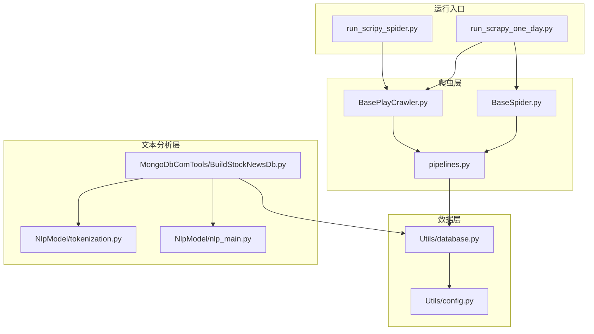
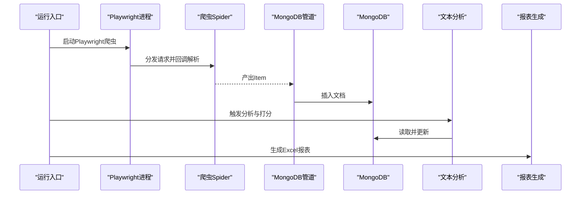
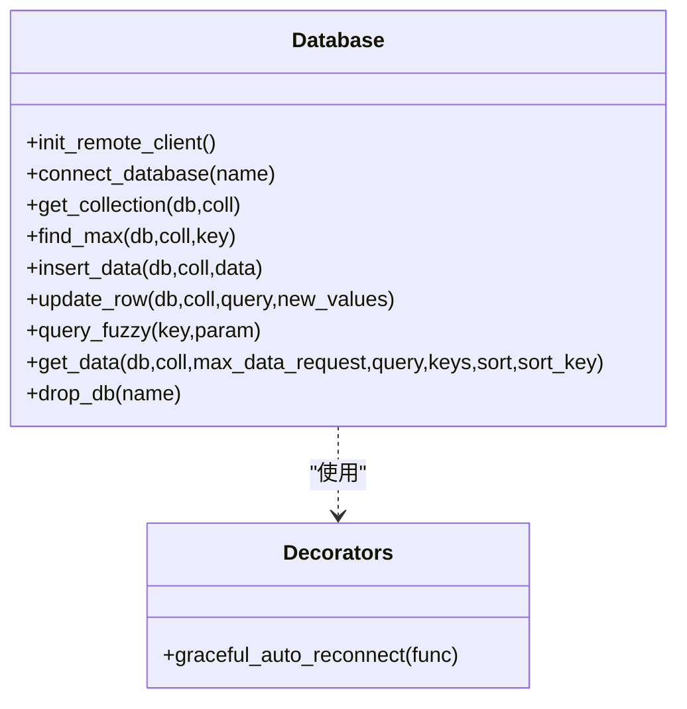
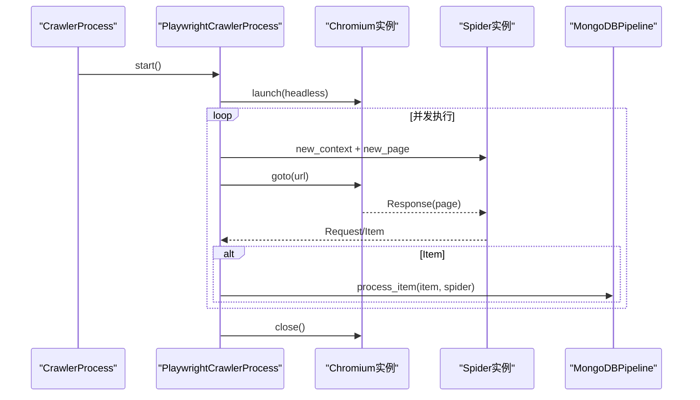
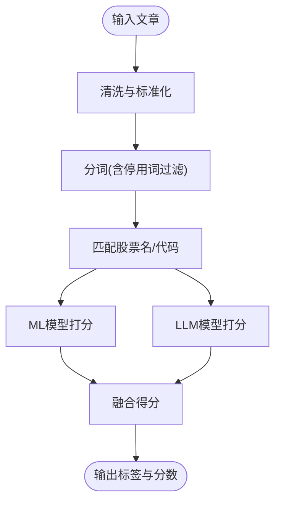
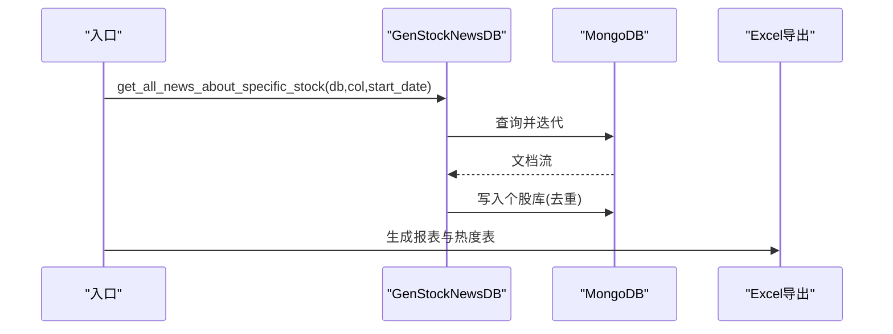
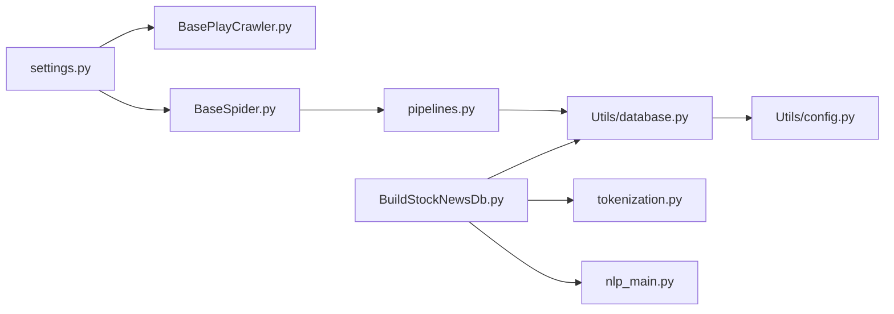

# 性能维护

<cite>
**本文引用的文件**
- [README.md](file://README.md)
- [ProblemSolve.md](file://ProblemSolve.md)
- [src/settings.py](file://src/settings.py)
- [src/Utils/config.py](file://src/Utils/config.py)
- [src/Utils/database.py](file://src/Utils/database.py)
- [src/Utils/utils.py](file://src/Utils/utils.py)
- [src/pipelines.py](file://src/pipelines.py)
- [src/run_scripy_spider.py](file://src/run_scripy_spider.py)
- [src/run_scrapy_one_day.py](file://src/run_scrapy_one_day.py)
- [src/MarketNewsSpiderWithScrapy/BasePlayCrawler.py](file://src/MarketNewsSpiderWithScrapy/BasePlayCrawler.py)
- [src/MarketNewsSpiderWithScrapy/BaseSpider.py](file://src/MarketNewsSpiderWithScrapy/BaseSpider.py)
- [src/MongoDbComTools/BuildStockNewsDb.py](file://src/MongoDbComTools/BuildStockNewsDb.py)
- [src/NlpModel/tokenization.py](file://src/NlpModel/tokenization.py)
- [src/NlpModel/nlp_main.py](file://src/NlpModel/nlp_main.py)
</cite>

## 目录
1. [简介](#简介)
2. [项目结构](#项目结构)
3. [核心组件](#核心组件)
4. [架构总览](#架构总览)
5. [详细组件分析](#详细组件分析)
6. [依赖分析](#依赖分析)
7. [性能考量](#性能考量)
8. [故障排查指南](#故障排查指南)
9. [结论](#结论)
10. [附录](#附录)

## 简介
本技术文档面向运维与开发团队，围绕“新闻爬取—文本分析—情感打分—报表生成”的量化新闻处理流水线，系统化阐述性能监控与维护要点，覆盖以下主题：
- 系统性能监控关键指标与基线设定：CPU、内存、磁盘IO、网络带宽
- Python 应用性能优化：代码优化、内存管理、并发处理
- 数据库性能调优：索引、查询、连接池配置
- 系统容量规划与扩展性设计
- 负载均衡与高可用架构建议
- 性能瓶颈识别与问题诊断方法
- 性能测试与压力测试实施流程
- 性能维护检查清单与维护计划

## 项目结构
该项目采用模块化组织，主要分为：
- 爬虫层：Scrapy 与 Playwright 并行驱动，统一注入管道
- 数据层：MongoDB 存储，管道负责入库
- 文本分析层：分词、关键词抽取、情感打分（ML/LSTM/LLM）
- 工具与配置层：数据库连接、通用工具、运行入口

**图表来源**
- [src/run_scripy_spider.py:117-145](file://src/run_scripy_spider.py#L117-L145)
- [src/run_scrapy_one_day.py:32-80](file://src/run_scrapy_one_day.py#L32-L80)
- [src/MarketNewsSpiderWithScrapy/BasePlayCrawler.py:21-62](file://src/MarketNewsSpiderWithScrapy/BasePlayCrawler.py#L21-L62)
- [src/MarketNewsSpiderWithScrapy/BaseSpider.py:13-34](file://src/MarketNewsSpiderWithScrapy/BaseSpider.py#L13-L34)
- [src/pipelines.py:8-22](file://src/pipelines.py#L8-L22)
- [src/Utils/database.py:36-61](file://src/Utils/database.py#L36-L61)
- [src/Utils/config.py:13-19](file://src/Utils/config.py#L13-L19)
- [src/MongoDbComTools/BuildStockNewsDb.py:19-53](file://src/MongoDbComTools/BuildStockNewsDb.py#L19-L53)
- [src/NlpModel/tokenization.py:11-24](file://src/NlpModel/tokenization.py#L11-L24)
- [src/NlpModel/nlp_main.py:17-31](file://src/NlpModel/nlp_main.py#L17-L31)

**章节来源**
- [README.md:1-33](file://README.md#L1-L33)
- [src/settings.py:18-34](file://src/settings.py#L18-L34)
- [src/Utils/config.py:13-19](file://src/Utils/config.py#L13-L19)

## 核心组件
- 运行入口与并发调度
  - run_scripy_spider.py：集中注册与启动多个爬虫，支持按类别批量运行
  - run_scrapy_one_day.py：分两阶段运行（Playwright 爬虫 + Scrapy 爬虫），并生成报表
- 爬虫与异步调度
  - BasePlayCrawler.py：基于 Playwright 的异步并发调度，共享浏览器实例，独立上下文
  - BaseSpider.py：通用解析与实体抽取、情感打分、生成 Item
- 数据管道与持久化
  - pipelines.py：统一入库，按来源数据库分集合写入
  - Utils/database.py：MongoDB 客户端封装、重连策略、连接池配置
- 文本分析与情感打分
  - NlpModel/tokenization.py：分词、停用词过滤、股票名/代码匹配
  - MongoDbComTools/BuildStockNewsDb.py：聚合新闻至个股库、生成报表
  - NlpModel/nlp_main.py：模型训练与预测入口

**章节来源**
- [src/run_scripy_spider.py:17-145](file://src/run_scripy_spider.py#L17-L145)
- [src/run_scrapy_one_day.py:32-80](file://src/run_scrapy_one_day.py#L32-L80)
- [src/MarketNewsSpiderWithScrapy/BasePlayCrawler.py:21-62](file://src/MarketNewsSpiderWithScrapy/BasePlayCrawler.py#L21-L62)
- [src/MarketNewsSpiderWithScrapy/BaseSpider.py:13-34](file://src/MarketNewsSpiderWithScrapy/BaseSpider.py#L13-L34)
- [src/pipelines.py:8-22](file://src/pipelines.py#L8-L22)
- [src/Utils/database.py:36-61](file://src/Utils/database.py#L36-L61)
- [src/MongoDbComTools/BuildStockNewsDb.py:19-53](file://src/MongoDbComTools/BuildStockNewsDb.py#L19-L53)
- [src/NlpModel/tokenization.py:11-24](file://src/NlpModel/tokenization.py#L11-L24)
- [src/NlpModel/nlp_main.py:17-31](file://src/NlpModel/nlp_main.py#L17-L31)

## 架构总览
整体流程：入口脚本启动爬虫进程 → 爬取网页内容 → 解析生成 Item → 写入 MongoDB → 文本分析与情感打分 → 报表生成。

**图表来源**
- [src/run_scrapy_one_day.py:43-80](file://src/run_scrapy_one_day.py#L43-L80)
- [src/MarketNewsSpiderWithScrapy/BasePlayCrawler.py:64-118](file://src/MarketNewsSpiderWithScrapy/BasePlayCrawler.py#L64-L118)
- [src/MarketNewsSpiderWithScrapy/BaseSpider.py:84-98](file://src/MarketNewsSpiderWithScrapy/BaseSpider.py#L84-L98)
- [src/pipelines.py:25-46](file://src/pipelines.py#L25-L46)
- [src/MongoDbComTools/BuildStockNewsDb.py:157-240](file://src/MongoDbComTools/BuildStockNewsDb.py#L157-L240)

## 详细组件分析

### 组件A：数据库连接与重连策略
- 连接池与超时
  - 最大连接池大小、服务器选择超时、连接超时等参数在客户端初始化处集中配置
- 自动重连装饰器
  - 对常见网络抖动导致的 AutoReconnect 异常进行指数退避重试，降低失败率
- 查询与写入
  - 支持条件查询、模糊匹配、增量更新、最大记录限制等

**图表来源**
- [src/Utils/database.py:36-61](file://src/Utils/database.py#L36-L61)
- [src/Utils/database.py:15-33](file://src/Utils/database.py#L15-L33)
- [src/Utils/database.py:94-172](file://src/Utils/database.py#L94-L172)

**章节来源**
- [src/Utils/database.py:36-61](file://src/Utils/database.py#L36-L61)
- [src/Utils/database.py:94-172](file://src/Utils/database.py#L94-L172)

### 组件B：爬虫并发与异步调度
- 并发控制
  - 全局并发请求数、下载延迟、超时、UA 列表等在设置中集中配置
- 异步 Playwright
  - 共享浏览器实例，独立上下文，避免 Cookie 干扰并节省内存
  - 请求队列与回调处理，支持异步迭代器与页面跳转
- 管道集成
  - 爬取结果直接进入 MongoDB 管道，减少中间态

**图表来源**
- [src/MarketNewsSpiderWithScrapy/BasePlayCrawler.py:21-62](file://src/MarketNewsSpiderWithScrapy/BasePlayCrawler.py#L21-L62)
- [src/MarketNewsSpiderWithScrapy/BasePlayCrawler.py:64-118](file://src/MarketNewsSpiderWithScrapy/BasePlayCrawler.py#L64-L118)
- [src/pipelines.py:25-46](file://src/pipelines.py#L25-L46)

**章节来源**
- [src/settings.py:18-34](file://src/settings.py#L18-L34)
- [src/MarketNewsSpiderWithScrapy/BasePlayCrawler.py:21-62](file://src/MarketNewsSpiderWithScrapy/BasePlayCrawler.py#L21-L62)
- [src/MarketNewsSpiderWithScrapy/BasePlayCrawler.py:64-118](file://src/MarketNewsSpiderWithScrapy/BasePlayCrawler.py#L64-L118)
- [src/pipelines.py:25-46](file://src/pipelines.py#L25-L46)

### 组件C：文本分析与情感打分
- 分词与特征
  - 使用 jieba/pkuseg，加载用户词典与停用词，过滤非中文与空白
- 股票名/代码匹配
  - 基于名称字典匹配，输出相关股票代码与词频
- 情感打分融合
  - ML 与 LLM 结果加权融合，提升稳定性与准确性

**图表来源**
- [src/NlpModel/tokenization.py:77-103](file://src/NlpModel/tokenization.py#L77-L103)
- [src/NlpModel/tokenization.py:50-75](file://src/NlpModel/tokenization.py#L50-L75)
- [src/MarketNewsSpiderWithScrapy/BaseSpider.py:100-146](file://src/MarketNewsSpiderWithScrapy/BaseSpider.py#L100-L146)
- [src/MongoDbComTools/BuildStockNewsDb.py:19-53](file://src/MongoDbComTools/BuildStockNewsDb.py#L19-L53)

**章节来源**
- [src/NlpModel/tokenization.py:77-103](file://src/NlpModel/tokenization.py#L77-L103)
- [src/NlpModel/tokenization.py:50-75](file://src/NlpModel/tokenization.py#L50-L75)
- [src/MarketNewsSpiderWithScrapy/BaseSpider.py:100-146](file://src/MarketNewsSpiderWithScrapy/BaseSpider.py#L100-L146)
- [src/MongoDbComTools/BuildStockNewsDb.py:19-53](file://src/MongoDbComTools/BuildStockNewsDb.py#L19-L53)

### 组件D：报表生成与聚合
- 聚合流程
  - 遍历各来源集合，提取相关股票，写入个股新闻库
  - 生成 Excel 报表，包含新闻明细与热度统计
- 性能注意
  - 大批量写入需关注索引与写屏障；报表导出为离线任务，避免阻塞主线程

**图表来源**
- [src/run_scrapy_one_day.py:81-195](file://src/run_scrapy_one_day.py#L81-L195)
- [src/MongoDbComTools/BuildStockNewsDb.py:157-240](file://src/MongoDbComTools/BuildStockNewsDb.py#L157-L240)

**章节来源**
- [src/run_scrapy_one_day.py:81-195](file://src/run_scrapy_one_day.py#L81-L195)
- [src/MongoDbComTools/BuildStockNewsDb.py:157-240](file://src/MongoDbComTools/BuildStockNewsDb.py#L157-L240)

## 依赖分析
- 组件耦合
  - 爬虫与管道强耦合（直接调用），利于简化数据流但不利于测试隔离
  - 文本分析与数据库耦合，分析过程依赖数据库连接与字典
- 外部依赖
  - MongoDB：连接池、索引、副本集/分片
  - Playwright：浏览器资源与上下文管理
  - LLM：本地模型或 Ollama 服务

**图表来源**
- [src/settings.py:18-34](file://src/settings.py#L18-L34)
- [src/MarketNewsSpiderWithScrapy/BasePlayCrawler.py:21-62](file://src/MarketNewsSpiderWithScrapy/BasePlayCrawler.py#L21-L62)
- [src/MarketNewsSpiderWithScrapy/BaseSpider.py:13-34](file://src/MarketNewsSpiderWithScrapy/BaseSpider.py#L13-L34)
- [src/pipelines.py:8-22](file://src/pipelines.py#L8-L22)
- [src/Utils/database.py:36-61](file://src/Utils/database.py#L36-L61)
- [src/Utils/config.py:13-19](file://src/Utils/config.py#L13-L19)
- [src/MongoDbComTools/BuildStockNewsDb.py:19-53](file://src/MongoDbComTools/BuildStockNewsDb.py#L19-L53)
- [src/NlpModel/tokenization.py:11-24](file://src/NlpModel/tokenization.py#L11-L24)
- [src/NlpModel/nlp_main.py:17-31](file://src/NlpModel/nlp_main.py#L17-L31)

**章节来源**
- [src/settings.py:18-34](file://src/settings.py#L18-L34)
- [src/Utils/config.py:13-19](file://src/Utils/config.py#L13-L19)

## 性能考量
- 硬件资源监控基线
  - CPU：爬虫并发与文本分析峰值 CPU 占用率应控制在 70% 以内，留有余量应对突发流量
  - 内存：单进程内存占用上限建议 2–4 GB，结合垃圾回收与对象复用控制增长
  - 磁盘 IO：写入密集场景下，建议使用 SSD；批量写入时开启合适的写屏障与索引策略
  - 网络带宽：根据并发数与页面大小估算，预留 20% 缓冲
- Python 应用优化
  - 代码优化：避免在热路径中频繁创建临时对象；使用生成器与惰性求值
  - 内存管理：及时释放大型对象引用；利用弱引用避免循环引用；定期触发 GC
  - 并发处理：合理设置并发数与下载延迟；对慢站点增加超时与重试
- 数据库性能调优
  - 连接池：根据并发与延迟调整最大连接数；启用空闲回收
  - 查询：为高频查询字段建立复合索引；避免全表扫描
  - 写入：批量插入、去重策略（哈希 ID）；写屏障与副本集配置
- 容量规划与扩展
  - 垂直扩展：提升 CPU/内存/SSD；水平扩展：分片与副本集
  - 爬虫扩展：多实例部署，任务队列（Redis/消息队列）解耦
- 负载均衡与高可用
  - 多实例运行入口与爬虫进程；数据库使用副本集；前端/任务调度层前置反向代理
- 性能测试与压力测试
  - 基准测试：固定并发与数据规模，测量吞吐与延迟
  - 压力测试：逐步提高并发与数据规模，定位瓶颈（CPU/IO/网络/数据库）
  - 回归测试：每次变更后回归关键路径性能

[本节为通用性能指导，无需特定文件引用]

## 故障排查指南
- MongoDB 文件句柄过多
  - 参考系统级 ulimit 设置与服务端配置，确保 maxfiles 提升至足够值
- 爬虫超时与重定向
  - 下载超时与 UA 列表在设置中集中配置；必要时禁用重定向中间件
- 管道重复写入
  - 管道捕获重复键异常并忽略，避免重复数据
- 文本分析异常
  - 分词模块加载用户词典与停用词；若缺失需检查路径与权限

**章节来源**
- [ProblemSolve.md:18-41](file://ProblemSolve.md#L18-L41)
- [src/settings.py:21-30](file://src/settings.py#L21-L30)
- [src/pipelines.py:48-56](file://src/pipelines.py#L48-L56)
- [src/NlpModel/tokenization.py:12-24](file://src/NlpModel/tokenization.py#L12-L24)

## 结论
通过合理的并发调度、数据库连接池与索引策略、文本分析的轻量化与缓存、以及完善的监控与压测体系，可在保证吞吐的同时维持系统稳定与可扩展性。建议将性能维护纳入日常运维流程，持续观测与优化。

[本节为总结，无需特定文件引用]

## 附录

### A. 性能监控关键指标与基线
- CPU：平均使用率 ≤ 70%，峰值瞬时 ≤ 90%
- 内存：RSS ≤ 2–4 GB/进程，GC 后稳定下降
- 磁盘 IO：写入延迟 ≤ 5ms/写，队列长度 ≤ 10
- 网络：并发连接数 ≤ 连接池上限，带宽利用率 ≤ 80%

[本节为通用指标说明，无需特定文件引用]

### B. 性能维护检查清单（示例）
- 每日
  - 观察爬虫进程存活与异常日志
  - 监控数据库连接池使用率与慢查询
  - 检查磁盘空间与 IO 延迟
- 每周
  - 回顾报表生成耗时与失败重试
  - 评估分词与打分模型效果与资源消耗
- 每月
  - 评估并发配置与数据库索引有效性
  - 进行一次压力测试回归

[本节为通用检查清单，无需特定文件引用]