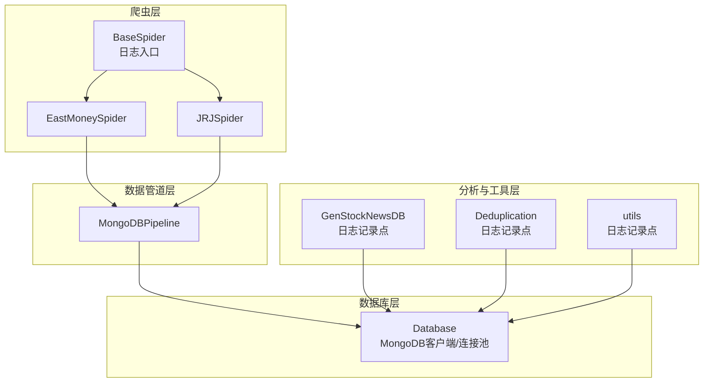
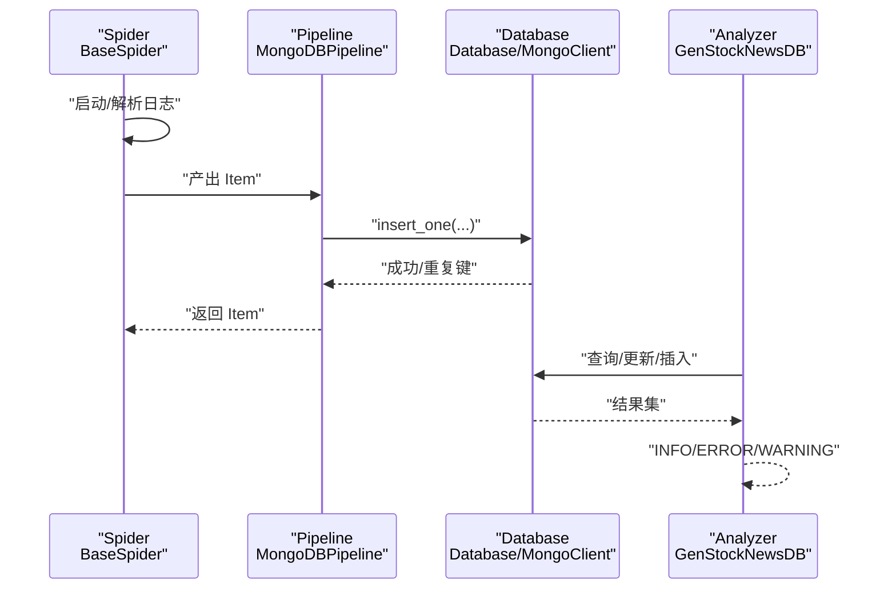
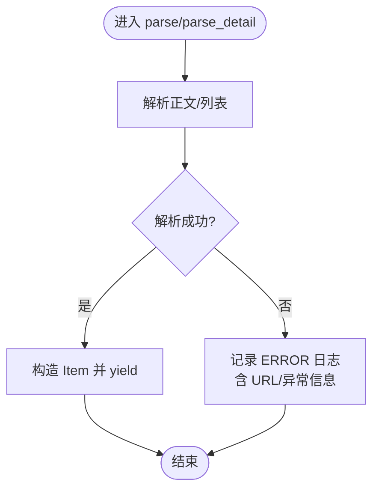
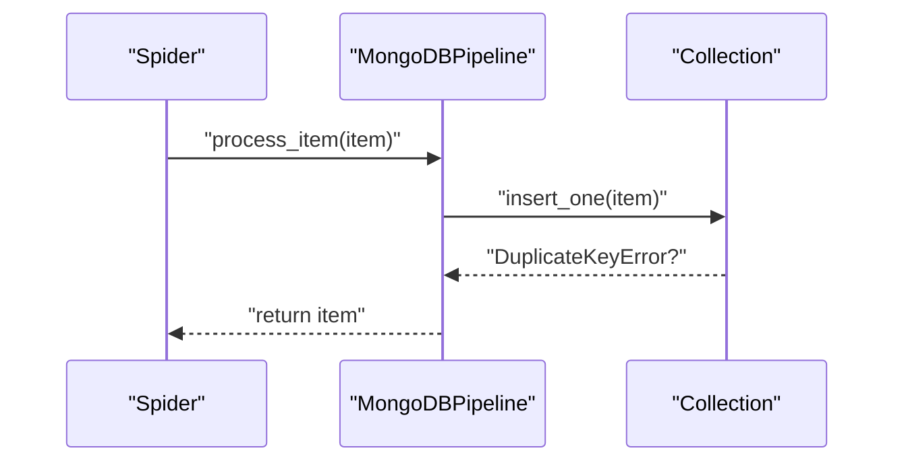
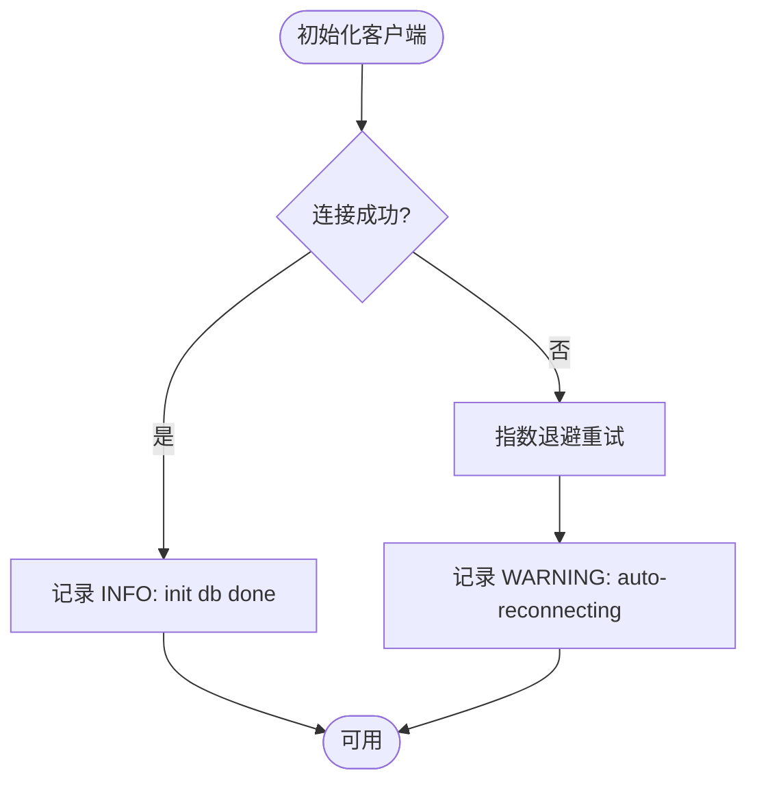
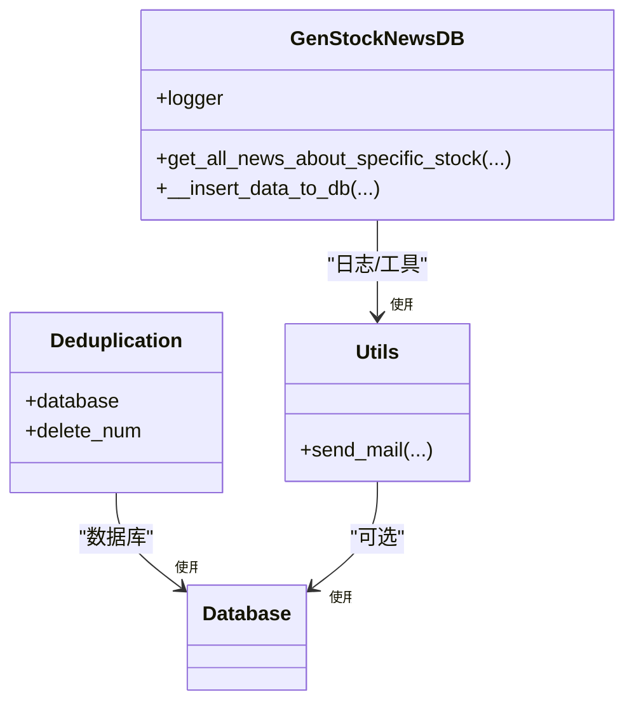
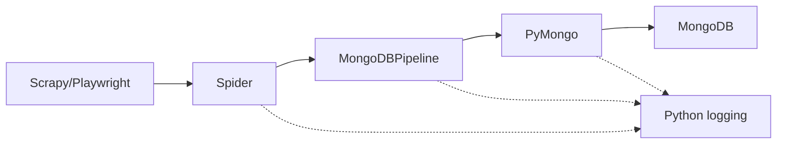

# 日志管理

<cite>
**本文引用的文件**
- [settings.py](file://src/settings.py)
- [pipelines.py](file://src/pipelines.py)
- [database.py](file://src/Utils/database.py)
- [BaseSpider.py](file://src/MarketNewsSpiderWithScrapy/BaseSpider.py)
- [BuildStockNewsDb.py](file://src/MongoDbComTools/BuildStockNewsDb.py)
- [DeDuplicationNull.py](file://src/MongoDbComTools/DeDuplicationNull.py)
- [utils.py](file://src/Utils/utils.py)
- [east_money_spider.py](file://src/MarketNewsSpiderWithScrapy/east_money_spider.py)
- [jrj_spider.py](file://src/MarketNewsSpiderWithScrapy/jrj_spider.py)
- [ProblemSolve.md](file://ProblemSolve.md)
</cite>

## 目录
1. [简介](#简介)
2. [项目结构](#项目结构)
3. [核心组件](#核心组件)
4. [架构总览](#架构总览)
5. [详细组件分析](#详细组件分析)
6. [依赖分析](#依赖分析)
7. [性能考虑](#性能考虑)
8. [故障排查指南](#故障排查指南)
9. [结论](#结论)
10. [附录](#附录)

## 简介
本文件面向运维与开发团队，系统化梳理该量化新闻采集与文本分析项目的日志管理现状与改进建议。重点覆盖以下方面：
- 系统日志的分类与级别设置：爬虫日志、分析日志、数据库日志等
- 日志格式标准化与结构化日志的实现路径
- 日志轮转与归档策略（按时间/大小）
- 日志检索与分析工具使用方法（关键词搜索、统计分析）
- 日志聚合与集中化管理方案
- 日志安全与隐私保护
- 日志监控与告警集成
- 最佳实践与常见问题解决方案

## 项目结构
该项目采用 Scrapy 爬虫框架驱动多站点新闻采集，数据经管道写入 MongoDB，随后由分析模块进行情感分析与聚类。日志主要分布在：
- 爬虫层：Spider 基类与各站点爬虫
- 数据管道层：MongoDB 写入管道
- 数据库访问层：统一数据库封装
- 工具与分析层：通用工具、去重与报告生成
- 配置层：Scrapy 设置与数据库配置

图示来源
- [BaseSpider.py](file://src/MarketNewsSpiderWithScrapy/BaseSpider.py#L32)
- [pipelines.py:25-46](file://src/pipelines.py#L25-L46)
- [database.py:36-60](file://src/Utils/database.py#L36-L60)
- [BuildStockNewsDb.py:19-53](file://src/MongoDbComTools/BuildStockNewsDb.py#L19-L53)
- [DeDuplicationNull.py:15-20](file://src/MongoDbComTools/DeDuplicationNull.py#L15-L20)
- [utils.py:44-58](file://src/Utils/utils.py#L44-L58)

章节来源
- [settings.py:1-49](file://src/settings.py#L1-L49)
- [pipelines.py:1-56](file://src/pipelines.py#L1-L56)
- [database.py:1-176](file://src/Utils/database.py#L1-L176)
- [BaseSpider.py:1-149](file://src/MarketNewsSpiderWithScrapy/BaseSpider.py#L1-L149)
- [BuildStockNewsDb.py:1-241](file://src/MongoDbComTools/BuildStockNewsDb.py#L1-L241)
- [DeDuplicationNull.py:1-20](file://src/MongoDbComTools/DeDuplicationNull.py#L1-L20)
- [utils.py:1-97](file://src/Utils/utils.py#L1-L97)

## 核心组件
- 爬虫日志
  - 爬虫基类提供 logger 实例，便于在启动与解析过程中输出结构化信息
  - 各站点爬虫在解析异常或关键流程节点打印状态
- 数据管道日志
  - MongoDBPipeline 在插入前根据 spider 名称路由集合，并记录重复键警告
- 数据库日志
  - Database 类在初始化、查询、无数据返回等场景输出 INFO/WARNING
  - 自动重连装饰器在连接异常时输出重连等待信息
- 分析与工具日志
  - GenStockNewsDB、Deduplication、utils 等模块在关键步骤输出 INFO/ERROR/WARNING

章节来源
- [BaseSpider.py](file://src/MarketNewsSpiderWithScrapy/BaseSpider.py#L32)
- [pipelines.py:25-46](file://src/pipelines.py#L25-L46)
- [database.py:44-60](file://src/Utils/database.py#L44-L60)
- [database.py:142-147](file://src/Utils/database.py#L142-L147)
- [BuildStockNewsDb.py:152-154](file://src/MongoDbComTools/BuildStockNewsDb.py#L152-L154)
- [DeDuplicationNull.py:8-12](file://src/MongoDbComTools/DeDuplicationNull.py#L8-L12)
- [utils.py:54-57](file://src/Utils/utils.py#L54-L57)

## 架构总览
下图展示从爬取到入库再到分析的关键日志流：

图示来源
- [BaseSpider.py](file://src/MarketNewsSpiderWithScrapy/BaseSpider.py#L32)
- [pipelines.py:25-46](file://src/pipelines.py#L25-L46)
- [database.py:78-88](file://src/Utils/database.py#L78-L88)
- [BuildStockNewsDb.py:135-155](file://src/MongoDbComTools/BuildStockNewsDb.py#L135-L155)

## 详细组件分析

### 组件A：爬虫日志（BaseSpider 与具体站点）
- 日志入口
  - 爬虫基类提供 logger，用于记录启动信息与关键流程
- 站点爬虫
  - 在解析异常时输出错误信息，便于定位页面结构变化或网络问题
- 建议
  - 使用结构化字段（如 spider_name、url、status、exception_type）统一日志格式
  - 区分 INFO/DEBUG/WARNING/ERROR 级别，避免过多 DEBUG 干扰生产环境

图示来源
- [BaseSpider.py](file://src/MarketNewsSpiderWithScrapy/BaseSpider.py#L32)
- [jrj_spider.py:93-94](file://src/MarketNewsSpiderWithScrapy/jrj_spider.py#L93-L94)
- [east_money_spider.py](file://src/MarketNewsSpiderWithScrapy/east_money_spider.py#L66)

章节来源
- [BaseSpider.py](file://src/MarketNewsSpiderWithScrapy/BaseSpider.py#L32)
- [jrj_spider.py:17-50](file://src/MarketNewsSpiderWithScrapy/jrj_spider.py#L17-L50)
- [jrj_spider.py:51-94](file://src/MarketNewsSpiderWithScrapy/jrj_spider.py#L51-L94)
- [east_money_spider.py:21-77](file://src/MarketNewsSpiderWithScrapy/east_money_spider.py#L21-L77)

### 组件B：数据管道日志（MongoDBPipeline）
- 功能
  - 根据 spider 名称将 Item 写入对应数据库/集合
  - 捕获重复键异常，避免重复入库
- 建议
  - 在 process_item 开始与结束记录结构化日志（含 spider、collection、item_id）
  - 对重复键与写入异常分别记录 WARNING/ERROR

图示来源
- [pipelines.py:25-46](file://src/pipelines.py#L25-L46)
- [pipelines.py:48-56](file://src/pipelines.py#L48-L56)

章节来源
- [pipelines.py:1-56](file://src/pipelines.py#L1-L56)

### 组件C：数据库日志（Database）
- 功能
  - 初始化 MongoDB 客户端，设置连接池与超时
  - 查询/插入/更新/去重等操作均输出 INFO/WARNING
  - 自动重连装饰器指数退避重试并记录等待时间
- 建议
  - 在查询无结果时输出明确的 WARNING，便于快速定位数据缺失
  - 记录关键操作耗时，辅助性能分析

图示来源
- [database.py:44-60](file://src/Utils/database.py#L44-L60)
- [database.py:15-33](file://src/Utils/database.py#L15-L33)

章节来源
- [database.py:1-176](file://src/Utils/database.py#L1-L176)

### 组件D：分析与工具日志（GenStockNewsDB、Deduplication、utils）
- GenStockNewsDB
  - 在插入/统计/报告生成等关键节点输出 INFO/ERROR/WARNING
- Deduplication
  - 使用 basicConfig 输出结构化日志，包含时间、文件名、行号、级别、消息
- utils
  - 发送邮件成功/失败时记录 INFO/ERROR

图示来源
- [BuildStockNewsDb.py:19-53](file://src/MongoDbComTools/BuildStockNewsDb.py#L19-L53)
- [DeDuplicationNull.py:8-12](file://src/MongoDbComTools/DeDuplicationNull.py#L8-L12)
- [utils.py:44-58](file://src/Utils/utils.py#L44-L58)

章节来源
- [BuildStockNewsDb.py:1-241](file://src/MongoDbComTools/BuildStockNewsDb.py#L1-L241)
- [DeDuplicationNull.py:1-20](file://src/MongoDbComTools/DeDuplicationNull.py#L1-L20)
- [utils.py:1-97](file://src/Utils/utils.py#L1-L97)

## 依赖分析
- 爬虫依赖 Scrapy 与 Playwright（异步请求与页面解析），日志通过 Spider.logger 输出
- 数据管道依赖 MongoDB，日志通过 Pipeline 输出
- 数据库封装依赖 PyMongo 与加密库，日志贯穿连接、查询、更新、插入
- 分析与工具模块依赖配置与模型，日志用于记录处理进度与异常

图示来源
- [settings.py:1-49](file://src/settings.py#L1-L49)
- [pipelines.py:1-56](file://src/pipelines.py#L1-L56)
- [database.py:1-176](file://src/Utils/database.py#L1-L176)

章节来源
- [settings.py:1-49](file://src/settings.py#L1-L49)
- [pipelines.py:1-56](file://src/pipelines.py#L1-L56)
- [database.py:1-176](file://src/Utils/database.py#L1-L176)

## 性能考虑
- 连接池与超时
  - 数据库连接设置最大池大小与超时，有助于减少连接抖动
- 指数退避重连
  - 自动重连装饰器降低瞬时故障对整体的影响
- 日志开销控制
  - 生产环境建议降低 DEBUG 级别，避免大量细粒度日志影响吞吐

章节来源
- [database.py:50-60](file://src/Utils/database.py#L50-L60)
- [database.py:15-33](file://src/Utils/database.py#L15-L33)

## 故障排查指南
- MongoDB 连接问题
  - 观察自动重连日志与等待时间，确认网络与资源限制
  - 参考系统级 ulimit 与服务状态
- 数据缺失
  - 查询无结果时会输出 WARNING，检查查询条件与索引
- 爬虫解析失败
  - 站点结构变更导致选择器失效，查看 ERROR 日志中的 URL 与异常
- 邮件发送失败
  - 检查 SMTP 配置与凭据，关注 ERROR 日志

章节来源
- [database.py:142-147](file://src/Utils/database.py#L142-L147)
- [ProblemSolve.md:18-40](file://ProblemSolve.md#L18-L40)
- [jrj_spider.py:93-94](file://src/MarketNewsSpiderWithScrapy/jrj_spider.py#L93-L94)
- [utils.py:56-57](file://src/Utils/utils.py#L56-L57)

## 结论
当前项目已具备基础的日志能力：爬虫、管道、数据库与分析模块均有日志输出。建议下一步完善：
- 统一结构化日志格式与字段
- 引入日志轮转与归档策略
- 建立集中化日志平台与检索分析工具
- 强化日志安全与隐私保护
- 集成监控与告警

## 附录

### 日志分类与级别设置建议
- 爬虫日志
  - INFO：启动、URL 列表生成、详情页抓取完成
  - WARNING：页面元素未找到、解析失败但可恢复
  - ERROR：网络超时、解析异常、关键字段缺失
- 分析日志
  - INFO：模型预测完成、报告生成进度
  - WARNING：无相关股票、重复数据
  - ERROR：模型加载失败、数据库异常
- 数据库日志
  - INFO：连接成功、查询/插入完成
  - WARNING：无数据返回、重复键
  - ERROR：认证失败、连接异常

### 日志格式标准化与结构化
- 建议字段
  - 时间戳、级别、模块名、函数名、行号、消息体、附加上下文（如 spider_name、url、count）
- 建议输出
  - JSON 格式便于机器解析与检索
  - 关键事件增加唯一标识（如请求 ID、任务 ID）

### 日志轮转与归档策略
- 按大小轮转
  - 单文件上限与备份数量控制
- 按时间轮转
  - 每日/每周轮转，保留周期内归档
- 归档与清理
  - 压缩归档、保留期满删除

### 日志检索与分析工具
- 关键词搜索
  - 支持正则与布尔组合查询
- 统计分析
  - 按时间、来源、级别统计趋势
  - 异常占比与 TOP 错误类型

### 日志聚合与集中化管理
- 方案
  - 使用日志代理收集（如 Filebeat/Fluent Bit）
  - 存储于集中式存储（如 Elasticsearch/S3）
  - 可视化与仪表盘（如 Kibana/Grafana）

### 日志安全与隐私保护
- 敏感信息脱敏
  - 用户名、密码、Token 替换或屏蔽
- 访问控制
  - 限定日志访问权限与审计
- 合规要求
  - 符合数据最小化与保留期限

### 日志监控与告警集成
- 监控指标
  - 错误率、延迟、吞吐量、连接数
- 告警策略
  - 阈值触发、趋势异常、停机检测