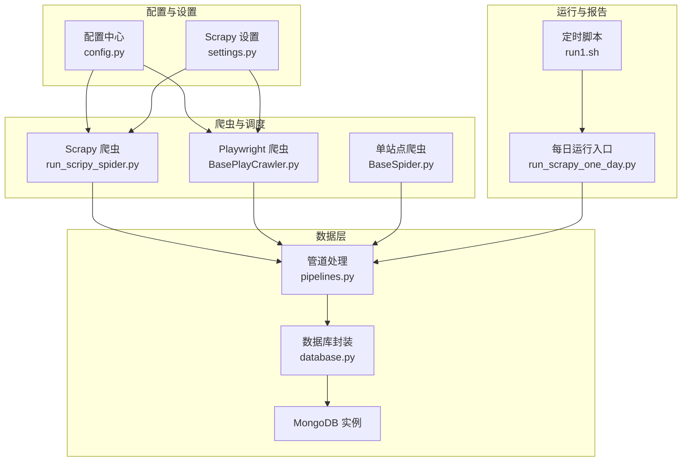
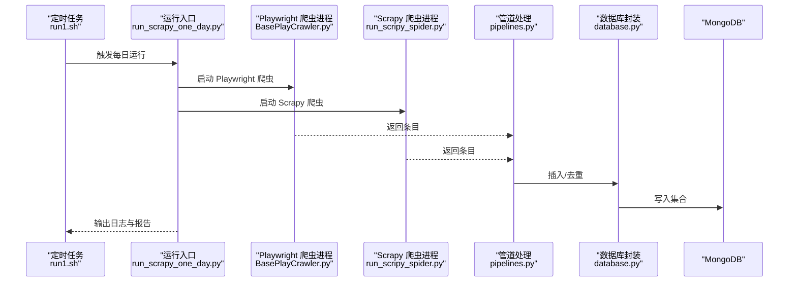
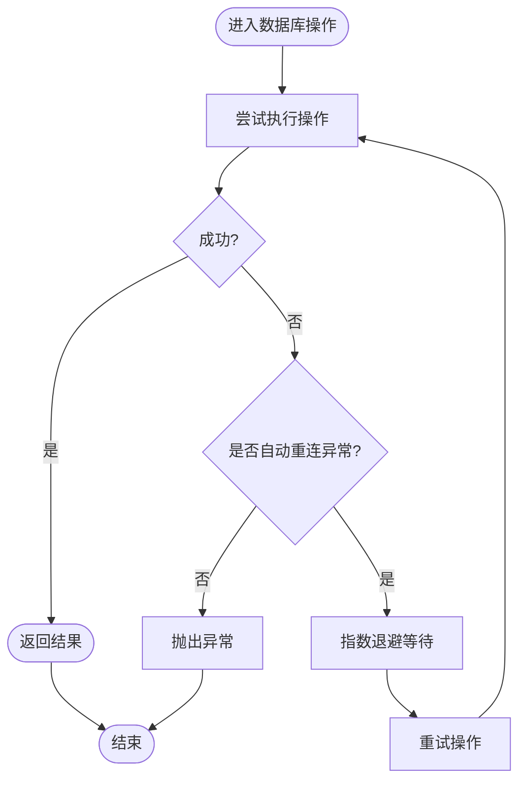
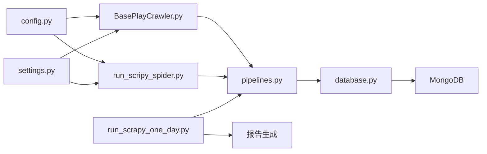

# 监控与运维

<cite>
**本文引用的文件**
- [README.md](file://README.md)
- [ProblemSolve.md](file://ProblemSolve.md)
- [src/Utils/config.py](file://src/Utils/config.py)
- [src/settings.py](file://src/settings.py)
- [src/Utils/database.py](file://src/Utils/database.py)
- [src/pipelines.py](file://src/pipelines.py)
- [src/run1.sh](file://src/run1.sh)
- [src/run_scrapy_one_day.py](file://src/run_scrapy_one_day.py)
- [src/run_scripy_spider.py](file://src/run_scripy_spider.py)
- [src/MarketNewsSpiderWithScrapy/BaseSpider.py](file://src/MarketNewsSpiderWithScrapy/BaseSpider.py)
- [src/MarketNewsSpiderWithScrapy/BasePlayCrawler.py](file://src/MarketNewsSpiderWithScrapy/BasePlayCrawler.py)
- [src/ThirdPartyToolSurpriver/detection_engine.py](file://src/ThirdPartyToolSurpriver/detection_engine.py)
</cite>

## 目录
1. [引言](#引言)
2. [项目结构](#项目结构)
3. [核心组件](#核心组件)
4. [架构总览](#架构总览)
5. [详细组件分析](#详细组件分析)
6. [依赖分析](#依赖分析)
7. [性能考虑](#性能考虑)
8. [故障排查指南](#故障排查指南)
9. [结论](#结论)
10. [附录](#附录)

## 引言
本文件面向监控与运维场景，结合代码库现状，构建一套可落地的监控与运维体系。内容涵盖：
- 指标体系与告警机制建议
- 日志管理配置与分析技巧
- 运维流程标准化与自动化
- 故障诊断与问题排查方法
- 备份恢复与灾难恢复策略
- 性能监控与容量规划
- 运维工具使用与集成方法
- 最佳实践与经验总结

目标是帮助运维人员建立完善的监控体系，确保系统稳定运行与快速故障恢复。

## 项目结构
该项目为量化与新闻爬取分析系统，主要模块包括：
- 爬虫与调度：基于 Scrapy 与 Playwright 的多站点爬虫
- 数据存储：MongoDB 管道与数据库封装
- 配置中心：统一的环境与站点配置
- 运行脚本：定时与批处理入口
- 分析与报告：新闻情感与热度统计

图表来源
- [src/run_scripy_spider.py:117-142](file://src/run_scripy_spider.py#L117-L142)
- [src/MarketNewsSpiderWithScrapy/BasePlayCrawler.py:21-62](file://src/MarketNewsSpiderWithScrapy/BasePlayCrawler.py#L21-L62)
- [src/MarketNewsSpiderWithScrapy/BaseSpider.py:13-34](file://src/MarketNewsSpiderWithScrapy/BaseSpider.py#L13-L34)
- [src/Utils/config.py:439-450](file://src/Utils/config.py#L439-L450)
- [src/settings.py:8-34](file://src/settings.py#L8-L34)
- [src/pipelines.py:8-46](file://src/pipelines.py#L8-L46)
- [src/Utils/database.py:36-61](file://src/Utils/database.py#L36-L61)
- [src/run_scrapy_one_day.py:32-80](file://src/run_scrapy_one_day.py#L32-L80)
- [src/run1.sh:6-8](file://src/run1.sh#L6-L8)

章节来源
- [README.md:1-33](file://README.md#L1-L33)
- [src/Utils/config.py:439-450](file://src/Utils/config.py#L439-L450)
- [src/settings.py:8-34](file://src/settings.py#L8-L34)

## 核心组件
- 配置中心：集中管理数据库、站点、模型路径等配置，支持按平台切换
- 爬虫与调度：Scrapy 爬虫与 Playwright 爬虫并行调度，统一入口与参数传递
- 管道处理：将爬取结果写入对应数据库集合，去重与幂等处理
- 数据库封装：连接池、自动重连、查询与写入接口
- 运行脚本：定时任务与批处理入口，输出标准日志文件

章节来源
- [src/Utils/config.py:13-50](file://src/Utils/config.py#L13-L50)
- [src/MarketNewsSpiderWithScrapy/BasePlayCrawler.py:21-62](file://src/MarketNewsSpiderWithScrapy/BasePlayCrawler.py#L21-L62)
- [src/pipelines.py:8-56](file://src/pipelines.py#L8-L56)
- [src/Utils/database.py:36-61](file://src/Utils/database.py#L36-L61)
- [src/run1.sh:6-8](file://src/run1.sh#L6-L8)

## 架构总览
系统采用“配置驱动 + 爬虫调度 + 管道入库”的分层架构。配置中心提供统一参数，爬虫模块负责数据采集，管道模块负责入库与去重，数据库封装提供稳定的连接与查询能力。

图表来源
- [src/run1.sh:6-8](file://src/run1.sh#L6-L8)
- [src/run_scrapy_one_day.py:32-80](file://src/run_scrapy_one_day.py#L32-L80)
- [src/MarketNewsSpiderWithScrapy/BasePlayCrawler.py:41-62](file://src/MarketNewsSpiderWithScrapy/BasePlayCrawler.py#L41-L62)
- [src/run_scripy_spider.py:117-142](file://src/run_scripy_spider.py#L117-L142)
- [src/pipelines.py:25-46](file://src/pipelines.py#L25-L46)
- [src/Utils/database.py:78-88](file://src/Utils/database.py#L78-L88)

## 详细组件分析

### 组件A：配置中心（config.py）
- 功能要点
  - 数据库地址与端口、Redis 地址与端口
  - 各站点爬虫配置字典与集合命名
  - 机器学习与分词资源路径
  - LLM 模型路径与设备类型
- 监控建议
  - 将敏感配置加密存储，运行时解密
  - 提供配置校验与默认值回退
  - 支持按环境变量覆盖关键参数

章节来源
- [src/Utils/config.py:13-50](file://src/Utils/config.py#L13-L50)
- [src/Utils/config.py:439-450](file://src/Utils/config.py#L439-L450)
- [src/Utils/config.py:452-455](file://src/Utils/config.py#L452-L455)

### 组件B：Scrapy 设置（settings.py）
- 功能要点
  - 并发请求数、下载超时、延迟
  - 下载中间件与代理、Cookie 策略
  - 管道注册与 MongoDB 写入
  - 用户代理池
- 监控建议
  - 记录并发与延迟对成功率的影响
  - 监控代理可用性与失败率
  - 对下载超时与重定向进行告警

章节来源
- [src/settings.py:18-34](file://src/settings.py#L18-L34)
- [src/settings.py:25-30](file://src/settings.py#L25-L30)
- [src/settings.py:36-47](file://src/settings.py#L36-L47)

### 组件C：数据库封装（database.py）
- 功能要点
  - 自动重连装饰器与指数退避
  - 连接池大小、超时配置
  - 查询、插入、更新、模糊匹配
- 监控建议
  - 追踪连接池使用率与等待时间
  - 记录重连次数与耗时
  - 对慢查询与异常返回进行告警

图表来源
- [src/Utils/database.py:15-33](file://src/Utils/database.py#L15-L33)
- [src/Utils/database.py:94-172](file://src/Utils/database.py#L94-L172)

章节来源
- [src/Utils/database.py:36-61](file://src/Utils/database.py#L36-L61)
- [src/Utils/database.py:94-172](file://src/Utils/database.py#L94-L172)

### 组件D：管道处理（pipelines.py）
- 功能要点
  - 按站点选择对应数据库集合
  - 去重键冲突忽略
- 监控建议
  - 统计每站点入库条数与去重数量
  - 记录插入耗时与异常
  - 对重复数据占比进行趋势监控

章节来源
- [src/pipelines.py:8-56](file://src/pipelines.py#L8-L56)

### 组件E：爬虫基类（BaseSpider.py）
- 功能要点
  - 新闻正文清洗、关键词抽取、情感打分
  - 生成唯一 ID、注入字段
- 监控建议
  - 记录解析成功率与字段完整性
  - 监控情感模型与 LLM 预测耗时
  - 对异常 URL 与空正文进行告警

章节来源
- [src/MarketNewsSpiderWithScrapy/BaseSpider.py:41-98](file://src/MarketNewsSpiderWithScrapy/BaseSpider.py#L41-L98)
- [src/MarketNewsSpiderWithScrapy/BaseSpider.py:100-146](file://src/MarketNewsSpiderWithScrapy/BaseSpider.py#L100-L146)

### 组件F：Playwright 爬虫调度（BasePlayCrawler.py）
- 功能要点
  - 多爬虫并发运行、独立上下文
  - 统一请求队列与回调处理
- 监控建议
  - 监控并发任务数与执行耗时
  - 记录页面加载失败与异常回调
  - 对浏览器资源占用进行监控

章节来源
- [src/MarketNewsSpiderWithScrapy/BasePlayCrawler.py:21-62](file://src/MarketNewsSpiderWithScrapy/BasePlayCrawler.py#L21-L62)
- [src/MarketNewsSpiderWithScrapy/BasePlayCrawler.py:64-118](file://src/MarketNewsSpiderWithScrapy/BasePlayCrawler.py#L64-L118)

### 组件G：运行入口与报告（run_scrapy_one_day.py）
- 功能要点
  - 启动 Playwright 与 Scrapy 爬虫
  - 生成新闻汇总与热度报告
- 监控建议
  - 记录每日运行时长与产出条数
  - 报告生成失败与邮件发送状态
  - 对异常日期范围与空数据进行告警

章节来源
- [src/run_scrapy_one_day.py:32-80](file://src/run_scrapy_one_day.py#L32-L80)
- [src/run_scrapy_one_day.py:81-194](file://src/run_scrapy_one_day.py#L81-L194)

### 组件H：第三方异常检测（detection_engine.py）
- 功能要点
  - 异常检测可视化与评分
- 监控建议
  - 将检测结果接入告警系统
  - 结合业务指标设定阈值与分级

章节来源
- [src/ThirdPartyToolSurpriver/detection_engine.py:558-598](file://src/ThirdPartyToolSurpriver/detection_engine.py#L558-L598)

## 依赖分析
- 组件耦合
  - 爬虫依赖配置中心与数据库封装
  - 管道依赖数据库封装与配置中心
  - 运行入口依赖各爬虫与配置中心
- 外部依赖
  - MongoDB、Scrapy、Playwright、pymongo、Fernet

图表来源
- [src/Utils/config.py:439-450](file://src/Utils/config.py#L439-L450)
- [src/settings.py:8-34](file://src/settings.py#L8-L34)
- [src/run_scripy_spider.py:117-142](file://src/run_scripy_spider.py#L117-L142)
- [src/MarketNewsSpiderWithScrapy/BasePlayCrawler.py:21-62](file://src/MarketNewsSpiderWithScrapy/BasePlayCrawler.py#L21-L62)
- [src/pipelines.py:8-22](file://src/pipelines.py#L8-L22)
- [src/Utils/database.py:36-61](file://src/Utils/database.py#L36-L61)
- [src/run_scrapy_one_day.py:32-80](file://src/run_scrapy_one_day.py#L32-L80)

章节来源
- [src/Utils/config.py:439-450](file://src/Utils/config.py#L439-L450)
- [src/settings.py:8-34](file://src/settings.py#L8-L34)
- [src/pipelines.py:8-22](file://src/pipelines.py#L8-L22)
- [src/Utils/database.py:36-61](file://src/Utils/database.py#L36-L61)
- [src/run_scrapy_one_day.py:32-80](file://src/run_scrapy_one_day.py#L32-L80)

## 性能考虑
- 爬虫并发与限速
  - 控制并发请求数与下载延迟，避免目标站点封禁与自身资源瓶颈
  - 对代理池进行健康检查与失败剔除
- 数据库性能
  - 合理设置连接池大小与超时
  - 对高频查询建立索引，避免全表扫描
- 管道吞吐
  - 批量写入与去重策略优化
  - 监控写入延迟与重复数据比例
- 资源监控
  - CPU、内存、磁盘 IO、网络带宽
  - 浏览器进程资源占用与崩溃重启

## 故障排查指南
- 爬虫异常
  - 页面加载失败：检查超时与网络代理
  - 解析为空：确认选择器与编码
  - 代理失效：轮换或替换代理
- 数据库异常
  - 连接中断：启用自动重连与指数退避
  - 写入失败：检查权限、集合大小限制
- 配置问题
  - 站点配置变更：核对配置中心与爬虫映射
  - 路径与模型：确认资源路径与设备类型
- 日志定位
  - 使用 run1.sh 输出的标准日志文件定位异常
  - 结合运行入口的日志与报告生成过程排查

章节来源
- [src/MarketNewsSpiderWithScrapy/BasePlayCrawler.py:113-115](file://src/MarketNewsSpiderWithScrapy/BasePlayCrawler.py#L113-L115)
- [src/Utils/database.py:15-33](file://src/Utils/database.py#L15-L33)
- [src/run1.sh:6-8](file://src/run1.sh#L6-L8)

## 结论
通过配置中心、爬虫调度、管道入库与数据库封装的协同，系统具备了可扩展的数据采集与存储能力。建议在此基础上完善监控与告警、日志分析、自动化运维与容量规划，以保障生产环境的稳定性与可维护性。

## 附录

### A. 指标体系与告警机制（建议）
- 爬虫层
  - 成功率、失败率、超时率、重试率
  - 页面加载时延、解析时延、并发任务数
- 数据层
  - 连接池使用率、等待时间、重连次数
  - 写入 QPS、去重比例、慢查询
- 业务层
  - 每日入库条数、报告生成时长、异常日期范围
- 告警分级
  - P0：服务不可用、大规模失败
  - P1：关键指标异常、性能严重下降
  - P2：一般异常、趋势异常

### B. 日志管理配置与分析技巧
- 日志输出
  - 使用 run1.sh 将标准输出与错误输出重定向到日志文件
  - 爬虫与运行入口分别记录关键事件
- 日志分析
  - 统计失败原因分布与趋势
  - 关联数据库异常与爬虫失败
  - 建立日志检索与聚合规则

章节来源
- [src/run1.sh:6-8](file://src/run1.sh#L6-L8)

### C. 运维流程标准化与自动化
- 标准化
  - 统一配置管理、部署脚本、日志规范
  - 明确故障分级与处置流程
- 自动化
  - 定时任务触发与报告生成
  - 异常检测与自动告警
  - 快速回滚与降级策略

### D. 备份恢复与灾难恢复策略
- 数据备份
  - 定期导出 MongoDB 集合，保留增量与全量
  - 备份文件异地存储与校验
- 恢复演练
  - 定期验证备份可恢复性
  - 制定恢复时间目标与恢复点目标
- 灾难恢复
  - 多机房部署与读写分离
  - 自动故障转移与手动接管流程

### E. 性能监控与容量规划
- 监控项
  - 爬虫并发与资源占用
  - 数据库连接与查询性能
  - 管道吞吐与延迟
- 容量规划
  - 基于历史峰值与增长趋势估算资源
  - 预留安全余量与弹性扩容

### F. 运维工具使用与集成方法
- 工具链
  - 监控：Prometheus/Grafana 或云监控
  - 日志：ELK 或云日志服务
  - 告警：钉钉/企业微信/邮件
  - 异常检测：结合第三方检测引擎
- 集成
  - 将关键指标上报至监控系统
  - 将日志与告警联动
  - 将异常检测结果接入告警

### G. 最佳实践与经验总结
- 配置与安全
  - 敏感配置加密存储，最小权限原则
- 可靠性
  - 自动重连与指数退避，失败告警
- 可观测性
  - 全链路日志与指标，统一检索与告警
- 可维护性
  - 模块化与清晰的职责边界，文档与规范先行