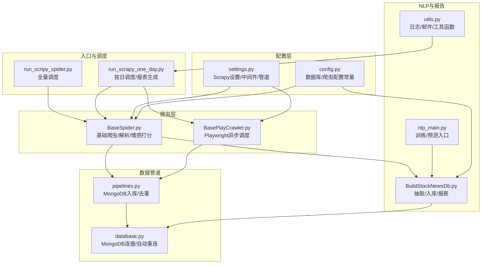
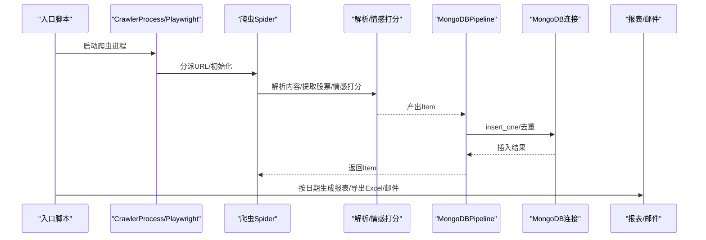
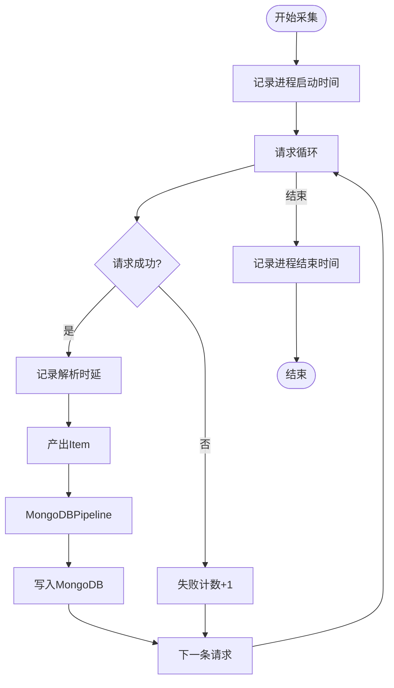
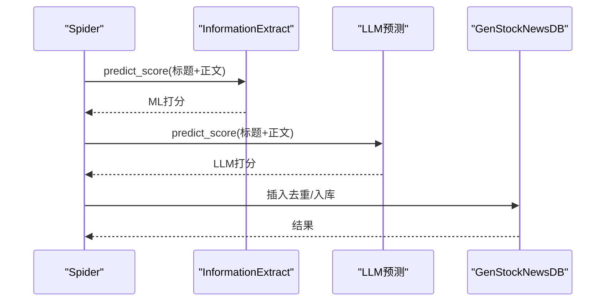
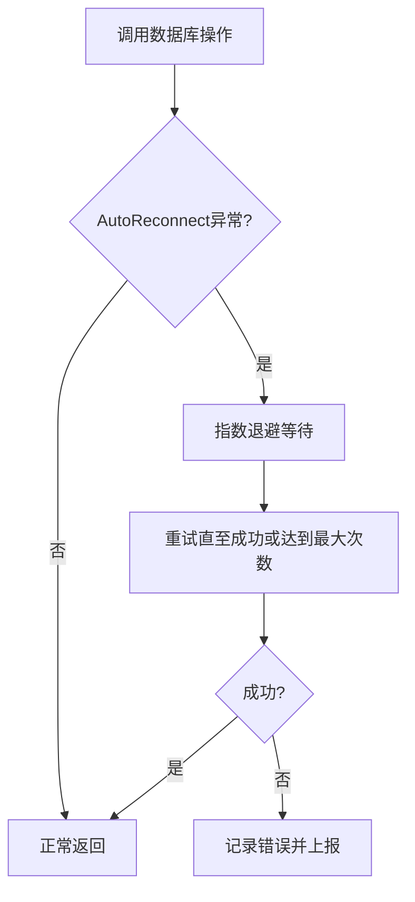
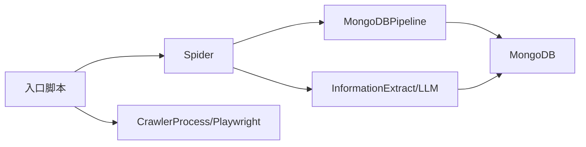

# 系统监控

<cite>
**本文引用的文件**   
- [README.md](file://README.md)
- [settings.py](file://src/settings.py)
- [pipelines.py](file://src/pipelines.py)
- [config.py](file://src/Utils/config.py)
- [database.py](file://src/Utils/database.py)
- [run_scripy_spider.py](file://src/run_scripy_spider.py)
- [run_scrapy_one_day.py](file://src/run_scrapy_one_day.py)
- [BaseSpider.py](file://src/MarketNewsSpiderWithScrapy/BaseSpider.py)
- [BasePlayCrawler.py](file://src/MarketNewsSpiderWithScrapy/BasePlayCrawler.py)
- [BuildStockNewsDb.py](file://src/MongoDbComTools/BuildStockNewsDb.py)
- [utils.py](file://src/Utils/utils.py)
- [nlp_main.py](file://src/NlpModel/nlp_main.py)
</cite>

## 目录
1. [引言](#引言)
2. [项目结构](#项目结构)
3. [核心组件](#核心组件)
4. [架构总览](#架构总览)
5. [详细组件分析](#详细组件分析)
6. [依赖分析](#依赖分析)
7. [性能考量](#性能考量)
8. [故障排查指南](#故障排查指南)
9. [结论](#结论)
10. [附录](#附录)

## 引言
本技术文档面向运维与开发团队，围绕量化投资新闻系统的监控体系建设，提供从指标定义、采集与实时监控、健康检查与异常检测、仪表板设计、性能基线与阈值、告警触发与响应、到监控数据存储与分析的完整方案。系统当前采用Scrapy与Playwright驱动的爬虫框架，结合MongoDB存储与NLP情感分析模块，覆盖“爬虫运行状态、数据处理性能、数据库连接”三大关键监控域。

## 项目结构
系统主要由以下层次构成：
- 配置层：集中管理数据库、Redis、爬虫并发与延迟、代理、下载超时等参数
- 爬虫层：基于Scrapy与Playwright两类引擎，统一接入与调度
- 数据管道层：统一入库与重复键处理
- 数据库层：MongoDB连接池与自动重连封装
- NLP与报告层：文本清洗、分词、情感打分、报表生成
- 工具与日志：通用工具、邮件发送、日志配置

图表来源
- [settings.py:1-49](file://src/settings.py#L1-L49)
- [config.py:1-455](file://src/Utils/config.py#L1-L455)
- [run_scripy_spider.py:117-145](file://src/run_scripy_spider.py#L117-L145)
- [run_scrapy_one_day.py:32-195](file://src/run_scrapy_one_day.py#L32-L195)
- [BaseSpider.py:13-149](file://src/MarketNewsSpiderWithScrapy/BaseSpider.py#L13-L149)
- [BasePlayCrawler.py:21-120](file://src/MarketNewsSpiderWithScrapy/BasePlayCrawler.py#L21-L120)
- [pipelines.py:8-56](file://src/pipelines.py#L8-L56)
- [database.py:36-176](file://src/Utils/database.py#L36-L176)
- [BuildStockNewsDb.py:19-241](file://src/MongoDbComTools/BuildStockNewsDb.py#L19-L241)
- [utils.py:18-251](file://src/Utils/utils.py#L18-L251)
- [nlp_main.py:17-70](file://src/NlpModel/nlp_main.py#L17-L70)

章节来源
- [README.md:1-33](file://README.md#L1-L33)
- [settings.py:1-49](file://src/settings.py#L1-L49)
- [config.py:1-455](file://src/Utils/config.py#L1-L455)

## 核心组件
- 爬虫配置与调度
  - Scrapy设置：并发、下载延迟、超时、中间件、管道
  - 入口脚本：全量与按日调度，区分Playwright与Scrapy爬虫
- 数据管道与入库
  - 统一MongoDB管道，按来源站点选择集合，去重插入
- 数据库连接与重连
  - 自动重连装饰器、连接池大小、超时配置
- NLP与情感分析
  - 文本抽取、分词、情感模型预测、LLM融合打分
- 报表与邮件
  - 按日期聚合、Excel导出、邮件发送

章节来源
- [settings.py:18-34](file://src/settings.py#L18-L34)
- [run_scripy_spider.py:117-145](file://src/run_scripy_spider.py#L117-L145)
- [run_scrapy_one_day.py:32-195](file://src/run_scrapy_one_day.py#L32-L195)
- [pipelines.py:8-56](file://src/pipelines.py#L8-L56)
- [database.py:15-33](file://src/Utils/database.py#L15-L33)
- [BuildStockNewsDb.py:19-53](file://src/MongoDbComTools/BuildStockNewsDb.py#L19-L53)
- [utils.py:18-58](file://src/Utils/utils.py#L18-L58)

## 架构总览
系统监控应覆盖以下链路：
- 爬虫进程生命周期与并发控制
- 请求/响应时延与失败率
- 数据入库吞吐与重复键冲突
- 数据库连接可用性与延迟
- NLP处理时延与模型可用性
- 报表生成与邮件发送

图表来源
- [run_scripy_spider.py:117-145](file://src/run_scripy_spider.py#L117-L145)
- [run_scrapy_one_day.py:32-195](file://src/run_scrapy_one_day.py#L32-L195)
- [BaseSpider.py:41-98](file://src/MarketNewsSpiderWithScrapy/BaseSpider.py#L41-L98)
- [pipelines.py:25-56](file://src/pipelines.py#L25-L56)
- [database.py:78-88](file://src/Utils/database.py#L78-L88)
- [utils.py:30-58](file://src/Utils/utils.py#L30-L58)

## 详细组件分析

### 爬虫运行状态监控
- 指标建议
  - 进程存活：进程PID、启动时间、心跳
  - 并发与节流：并发请求数、下载延迟、超时次数
  - 请求成功率：成功/失败/重试计数
  - 页面解析时延：parse回调耗时分布
  - Item产出速率：每分钟产出条数
- 采集方式
  - 入口脚本记录启动/结束时间与参数
  - Spider内部记录请求开始/结束时间与异常
  - CrawlerProcess/Playwright封装内统计请求队列长度与完成数
- 实时监控
  - Prometheus/Grafana：暴露指标端点，Grafana仪表板展示
  - 告警：失败率超过阈值、解析时延P95超限、进程退出

图表来源
- [run_scripy_spider.py:117-145](file://src/run_scripy_spider.py#L117-L145)
- [run_scrapy_one_day.py:32-195](file://src/run_scrapy_one_day.py#L32-L195)
- [BaseSpider.py:41-98](file://src/MarketNewsSpiderWithScrapy/BaseSpider.py#L41-L98)
- [pipelines.py:25-56](file://src/pipelines.py#L25-L56)

章节来源
- [settings.py:18-34](file://src/settings.py#L18-L34)
- [run_scripy_spider.py:117-145](file://src/run_scripy_spider.py#L117-L145)
- [run_scrapy_one_day.py:32-195](file://src/run_scrapy_one_day.py#L32-L195)
- [BaseSpider.py:41-98](file://src/MarketNewsSpiderWithScrapy/BaseSpider.py#L41-L98)

### 数据处理性能监控
- 指标建议
  - 文本清洗与分词时延
  - 情感模型预测时延（ML/LLM）
  - 股票代码抽取命中率
  - 报表生成时延与导出大小
- 采集方式
  - 在BaseSpider中对解析与预测阶段打点
  - 在BuildStockNewsDb中对抽取、去重、入库阶段打点
  - 在run_scrapy_one_day.py中对报表生成阶段打点
- 实时监控
  - 时延分布直方图/P95/P99
  - 命中率趋势图
  - 报表生成耗时告警

图表来源
- [BaseSpider.py:66-83](file://src/MarketNewsSpiderWithScrapy/BaseSpider.py#L66-L83)
- [BaseSpider.py:114-131](file://src/MarketNewsSpiderWithScrapy/BaseSpider.py#L114-L131)
- [BuildStockNewsDb.py:119-133](file://src/MongoDbComTools/BuildStockNewsDb.py#L119-L133)
- [nlp_main.py:25-68](file://src/NlpModel/nlp_main.py#L25-L68)

章节来源
- [BaseSpider.py:66-83](file://src/MarketNewsSpiderWithScrapy/BaseSpider.py#L66-L83)
- [BaseSpider.py:114-131](file://src/MarketNewsSpiderWithScrapy/BaseSpider.py#L114-L131)
- [BuildStockNewsDb.py:119-133](file://src/MongoDbComTools/BuildStockNewsDb.py#L119-L133)
- [nlp_main.py:25-68](file://src/NlpModel/nlp_main.py#L25-L68)

### 数据库连接监控
- 指标建议
  - 连接池活跃连接数、空闲连接数
  - 连接超时/断开/重连次数
  - 插入QPS、去重命中率
  - 查询/更新时延与错误率
- 采集方式
  - database.py中的自动重连装饰器记录重连事件与等待时长
  - pipelines.py中对insert_one异常进行捕获与计数
  - 对Collection操作前后打点
- 实时监控
  - 连接池饱和与阻塞告警
  - 重连频率激增告警
  - 插入失败率与重复键冲突率

图表来源
- [database.py:15-33](file://src/Utils/database.py#L15-L33)
- [database.py:50-60](file://src/Utils/database.py#L50-L60)
- [pipelines.py:48-56](file://src/pipelines.py#L48-L56)

章节来源
- [database.py:15-33](file://src/Utils/database.py#L15-L33)
- [database.py:50-60](file://src/Utils/database.py#L50-L60)
- [pipelines.py:48-56](file://src/pipelines.py#L48-L56)

### 系统健康检查与异常检测
- 健康检查
  - 爬虫进程存活探测（进程PID/心跳）
  - 数据库连接可用性探测（Ping/最小查询）
  - NLP模型可用性探测（预热/推理一次）
- 异常检测策略
  - 失败率与时延的滑动窗口统计与阈值告警
  - 重连次数的短期激增检测
  - 插入失败与重复键冲突的异常比例检测

章节来源
- [database.py:94-172](file://src/Utils/database.py#L94-L172)
- [pipelines.py:48-56](file://src/pipelines.py#L48-L56)

### 监控仪表板设计与可视化
- 建议面板
  - 爬虫运行态：进程数、并发、失败率、解析时延
  - 数据入库：QPS、重复键冲突、去重命中率
  - 数据库：连接池使用率、重连次数、查询时延
  - NLP：文本处理时延、模型预测时延、命中率
  - 报表：生成耗时、导出大小、邮件发送成功率
- 可视化建议
  - 折线图：趋势与时变
  - 柱状图：各来源站点对比
  - 热力图：按小时/日期的失败分布
  - 告警看板：实时告警列表与级别

### 性能基线与阈值配置
- 基线设定
  - 并发：基于目标站点限速与带宽设定合理上限
  - 下载超时：默认3秒，失败率>1%时下调
  - 解析时延：P95在可接受范围内（如<5秒）
  - 插入QPS：根据MongoDB写入能力设定基线
- 阈值配置
  - 失败率>1%/5分钟
  - 解析P95>10秒
  - 插入失败率>0.1%
  - 重连次数>3次/小时
  - 报表生成>30分钟

章节来源
- [settings.py:21-23](file://src/settings.py#L21-L23)
- [settings.py:18-19](file://src/settings.py#L18-L19)

### 告警触发与响应机制
- 触发条件
  - 多指标同时超阈（避免误报）
  - 连续N个周期超阈
  - 突发性指标异常（如重连次数骤增）
- 响应机制
  - 自动降载/限速
  - 快速修复流程（重启进程/切换代理/扩容连接池）
  - 通知渠道：IM/邮件/电话（分级）

### 监控数据存储与分析
- 存储
  - 时序数据库：Prometheus/InfluxDB
  - 日志：ELK/Fluentd
  - 指标归档：长期保留策略
- 分析
  - 趋势分析与回归预测
  - 根因定位：关联分析（爬虫失败率与数据库重连）
  - A/B实验：变更影响评估

## 依赖分析
- 组件耦合
  - 爬虫与管道：通过process_item耦合，便于统一入库与去重
  - 管道与数据库：直接依赖MongoDB连接对象
  - 爬虫与NLP：通过GenStockNewsDB与InformationExtract耦合
- 外部依赖
  - MongoDB：连接池、自动重连
  - Playwright：异步浏览器驱动
  - Scrapy：请求/响应/中间件/管道
- 潜在风险
  - 管道异常导致数据丢失
  - 数据库重连导致写入延迟
  - NLP模型不可用导致解析停滞

图表来源
- [pipelines.py:25-56](file://src/pipelines.py#L25-L56)
- [database.py:36-60](file://src/Utils/database.py#L36-L60)
- [BaseSpider.py:66-83](file://src/MarketNewsSpiderWithScrapy/BaseSpider.py#L66-L83)
- [run_scripy_spider.py:117-145](file://src/run_scripy_spider.py#L117-L145)
- [run_scrapy_one_day.py:32-195](file://src/run_scrapy_one_day.py#L32-L195)

章节来源
- [pipelines.py:25-56](file://src/pipelines.py#L25-L56)
- [database.py:36-60](file://src/Utils/database.py#L36-L60)
- [BaseSpider.py:66-83](file://src/MarketNewsSpiderWithScrapy/BaseSpider.py#L66-L83)
- [run_scripy_spider.py:117-145](file://src/run_scripy_spider.py#L117-L145)
- [run_scrapy_one_day.py:32-195](file://src/run_scrapy_one_day.py#L32-L195)

## 性能考量
- 爬虫并发与限速
  - 并发请求数与下载延迟需平衡站点限速与吞吐
  - 超时时间过短会导致失败率上升
- 数据库写入
  - 批量写入与索引优化可降低写入延迟
  - 去重键冲突会增加查询成本
- NLP处理
  - 模型加载与预热减少首帧延迟
  - LLM推理成本较高，建议缓存与限流

## 故障排查指南
- 爬虫无输出
  - 检查入口参数与站点URL有效性
  - 查看日志中请求失败与重定向
- 数据未入库
  - 检查DuplicateKeyError与insert异常
  - 核对集合命名与去重键
- 数据库连接异常
  - 观察重连日志与等待时长
  - 检查连接池大小与超时设置
- 报表生成失败
  - 检查日期范围与数据存在性
  - 核对Excel写入权限与磁盘空间

章节来源
- [pipelines.py:48-56](file://src/pipelines.py#L48-L56)
- [database.py:15-33](file://src/Utils/database.py#L15-L33)
- [run_scrapy_one_day.py:81-195](file://src/run_scrapy_one_day.py#L81-L195)

## 结论
通过在爬虫、数据处理、数据库三层建立完善的监控指标与告警机制，结合可视化仪表板与自动化响应流程，可显著提升系统的可观测性与稳定性。建议优先落地失败率、解析时延、插入QPS与数据库重连等关键指标，逐步扩展至NLP与报表维度，持续优化阈值与基线，确保系统在高负载下仍保持可靠运行。

## 附录
- 关键配置参考
  - 并发与延迟：settings.py中的CONCURRENT_REQUESTS与DOWNLOAD_DELAY
  - 下载超时：DOWNLOAD_TIMEOUT
  - 管道与中间件：ITEM_PIPELINES与DOWNLOADER_MIDDLEWARES
  - 数据库连接参数：MONGODB_IP/PORT、连接池与超时
- 建议的监控项清单
  - 爬虫：进程存活、并发、失败率、解析时延、Item产出速率
  - 数据库：连接池使用、重连次数、插入QPS、查询时延
  - NLP：文本处理时延、模型预测时延、命中率
  - 报表：生成耗时、导出大小、邮件发送成功率

章节来源
- [settings.py:18-34](file://src/settings.py#L18-L34)
- [config.py:13-16](file://src/Utils/config.py#L13-L16)
- [config.py:55-450](file://src/Utils/config.py#L55-L450)