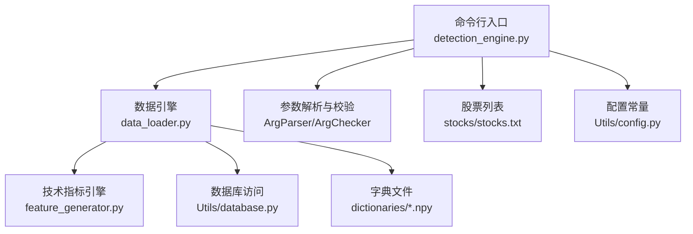
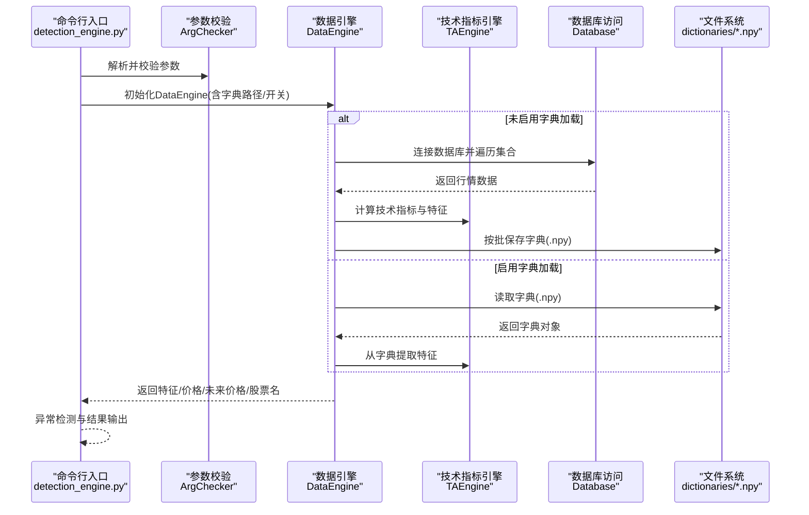
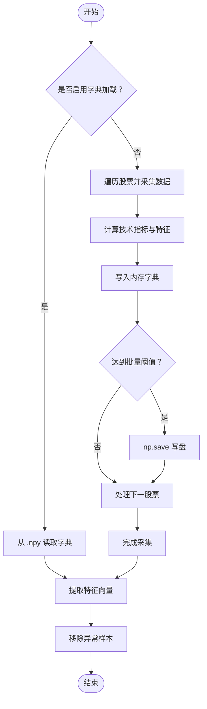
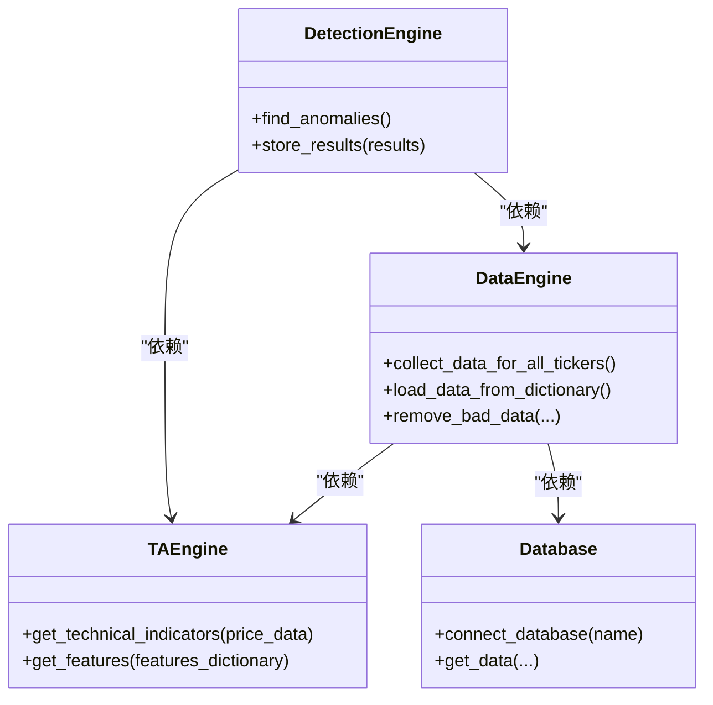

# 字典管理

<cite>
**本文引用的文件**   
- [src/ThirdPartyToolSurpriver/detection_engine.py](file://src/ThirdPartyToolSurpriver/detection_engine.py)
- [src/ThirdPartyToolSurpriver/data_loader.py](file://src/ThirdPartyToolSurpriver/data_loader.py)
- [src/ThirdPartyToolSurpriver/feature_generator.py](file://src/ThirdPartyToolSurpriver/feature_generator.py)
- [src/ThirdPartyToolSurpriver/dictionaries/readme.txt](file://src/ThirdPartyToolSurpriver/dictionaries/readme.txt)
- [src/ThirdPartyToolSurpriver/README.md](file://src/ThirdPartyToolSurpriver/README.md)
- [src/ThirdPartyToolSurpriver/stocks/stocks.txt](file://src/ThirdPartyToolSurpriver/stocks/stocks.txt)
- [src/Utils/config.py](file://src/Utils/config.py)
- [src/Utils/database.py](file://src/Utils/database.py)
</cite>

## 目录
1. [简介](#简介)
2. [项目结构](#项目结构)
3. [核心组件](#核心组件)
4. [架构总览](#架构总览)
5. [详细组件分析](#详细组件分析)
6. [依赖关系分析](#依赖关系分析)
7. [性能考量](#性能考量)
8. [故障排查指南](#故障排查指南)
9. [结论](#结论)
10. [附录](#附录)

## 简介
本文件面向“字典管理”主题，系统梳理 ThirdPartyToolSurpriver 子模块中与数据字典相关的目录与文件，重点说明 dictionaries 目录的作用、data_dict.npy（或 data_dictionary.npy）文件的数据结构与组织方式，并详细阐述字典的加载、保存与更新流程；同时给出命令行参数与操作方法、性能优化策略、备份与恢复方案，以及最佳实践与维护建议。

## 项目结构
围绕字典管理的相关文件主要位于 ThirdPartyToolSurpriver 子模块内，关键位置如下：
- 字典目录：dictionaries/（用于存放数据字典文件）
- 命令行入口：detection_engine.py（解析参数并驱动流程）
- 数据引擎：data_loader.py（负责从数据库采集数据、生成特征、保存/加载字典）
- 技术指标引擎：feature_generator.py（生成技术指标与特征）
- 股票列表：stocks/stocks.txt（指定待分析的股票集合）
- 配置与数据库：Utils/config.py、Utils/database.py（数据库连接与常量）

图表来源
- [src/ThirdPartyToolSurpriver/detection_engine.py:24-99](file://src/ThirdPartyToolSurpriver/detection_engine.py#L24-L99)
- [src/ThirdPartyToolSurpriver/data_loader.py:16-66](file://src/ThirdPartyToolSurpriver/data_loader.py#L16-L66)
- [src/ThirdPartyToolSurpriver/feature_generator.py:10-15](file://src/ThirdPartyToolSurpriver/feature_generator.py#L10-L15)
- [src/ThirdPartyToolSurpriver/stocks/stocks.txt:1-4](file://src/ThirdPartyToolSurpriver/stocks/stocks.txt#L1-L4)
- [src/Utils/database.py:36-63](file://src/Utils/database.py#L36-L63)
- [src/Utils/config.py:39-40](file://src/Utils/config.py#L39-L40)

章节来源
- [src/ThirdPartyToolSurpriver/detection_engine.py:24-99](file://src/ThirdPartyToolSurpriver/detection_engine.py#L24-L99)
- [src/ThirdPartyToolSurpriver/data_loader.py:16-66](file://src/ThirdPartyToolSurpriver/data_loader.py#L16-L66)
- [src/ThirdPartyToolSurpriver/feature_generator.py:10-15](file://src/ThirdPartyToolSurpriver/feature_generator.py#L10-L15)
- [src/ThirdPartyToolSurpriver/stocks/stocks.txt:1-4](file://src/ThirdPartyToolSurpriver/stocks/stocks.txt#L1-L4)
- [src/Utils/database.py:36-63](file://src/Utils/database.py#L36-L63)
- [src/Utils/config.py:39-40](file://src/Utils/config.py#L39-L40)

## 核心组件
- 命令行入口与参数解析：detection_engine.py 提供完整的参数定义与校验逻辑，包括是否从字典加载、是否保存字典、字典路径、历史窗口、最小成交量、测试模式等。
- 数据引擎：data_loader.py 封装了从 MongoDB 采集数据、计算技术指标、构造特征、过滤异常样本、按批次保存字典、从字典加载数据等能力。
- 技术指标引擎：feature_generator.py 负责基于价格序列生成多种技术指标（RSI、Stoch、CCI、EMV、成交量回报等），并提取可用于模型训练的特征向量。
- 字典文件：默认路径为 dictionaries/data_dictionary.npy（或 README 中示例使用的 data_dict.npy），以 NumPy 的 .npy 格式存储 Python 字典对象，键为股票代码，值包含特征字典、当前价格序列、未来价格序列等。
- 股票列表：stocks/stocks.txt 指定本次分析的目标股票集合。
- 配置与数据库：Utils/config.py 定义 STOCK_DATABASE_NAME 等常量；Utils/database.py 提供数据库连接与查询封装。

章节来源
- [src/ThirdPartyToolSurpriver/detection_engine.py:24-99](file://src/ThirdPartyToolSurpriver/detection_engine.py#L24-L99)
- [src/ThirdPartyToolSurpriver/data_loader.py:16-66](file://src/ThirdPartyToolSurpriver/data_loader.py#L16-L66)
- [src/ThirdPartyToolSurpriver/feature_generator.py:10-15](file://src/ThirdPartyToolSurpriver/feature_generator.py#L10-L15)
- [src/ThirdPartyToolSurpriver/dictionaries/readme.txt:1-1](file://src/ThirdPartyToolSurpriver/dictionaries/readme.txt#L1-L1)
- [src/ThirdPartyToolSurpriver/README.md:49-68](file://src/ThirdPartyToolSurpriver/README.md#L49-L68)

## 架构总览
下图展示了从命令行到数据字典的完整调用链路与数据流：

图表来源
- [src/ThirdPartyToolSurpriver/detection_engine.py:158-187](file://src/ThirdPartyToolSurpriver/detection_engine.py#L158-L187)
- [src/ThirdPartyToolSurpriver/data_loader.py:148-224](file://src/ThirdPartyToolSurpriver/data_loader.py#L148-L224)
- [src/ThirdPartyToolSurpriver/feature_generator.py:163-186](file://src/ThirdPartyToolSurpriver/feature_generator.py#L163-L186)
- [src/Utils/database.py:62-104](file://src/Utils/database.py#L62-L104)

## 详细组件分析

### 字典目录与文件命名约定
- dictionaries 目录用于存放所有数据字典文件，便于复用与离线分析。
- 默认字典文件名通常为 data_dictionary.npy 或 data_dict.npy（README 示例使用后者）。实际运行时可通过参数 --data_dictionary_path 自定义路径与文件名。

章节来源
- [src/ThirdPartyToolSurpriver/dictionaries/readme.txt:1-1](file://src/ThirdPartyToolSurpriver/dictionaries/readme.txt#L1-L1)
- [src/ThirdPartyToolSurpriver/README.md:49-68](file://src/ThirdPartyToolSurpriver/README.md#L49-L68)

### data_dict.npy 文件结构与数据组织
- 文件类型：NumPy .npy 文件，保存一个 Python 字典对象。
- 字典键：股票代码字符串（如 "shXXXXXX"、"szXXXXXX" 或纯数字）。
- 字典值：包含以下字段的子字典：
  - features：技术指标字典（由 TAEngine 生成），键为指标名称（如 "rsi-5"、"stochs-10"、"cci-10"、"eom-5"、"daily_log_return"、"volume_returns" 等），值为对应序列或统计量（斜率、R 绝对值、p 值等）。
  - current_prices：当前历史价格序列（包含 Datetime、Open、High、Low、Close、Volume 等列）。
  - future_prices：若处于测试模式，则包含未来若干 bar 的价格序列；否则为空或不参与使用。
- 特征向量：由 TAEngine.get_features() 从 features 中抽取特定键（如 volume_returns、daily_log_return、eom、cci、rsi 等）拼接而成，作为后续异常检测模型的输入。

章节来源
- [src/ThirdPartyToolSurpriver/data_loader.py:173-184](file://src/ThirdPartyToolSurpriver/data_loader.py#L173-L184)
- [src/ThirdPartyToolSurpriver/feature_generator.py:31-161](file://src/ThirdPartyToolSurpriver/feature_generator.py#L31-L161)
- [src/ThirdPartyToolSurpriver/feature_generator.py:163-186](file://src/ThirdPartyToolSurpriver/feature_generator.py#L163-L186)

### 字典的加载、保存与更新流程
- 加载流程（is_load_from_dictionary=1）：
  - data_loader.load_data_from_dictionary() 读取 .npy 文件，逐个股票提取 features/current_prices/future_prices，并调用 TAEngine.get_features() 生成特征向量。
- 保存流程（is_save_dictionary=1）：
  - data_loader.collect_data_for_all_tickers() 在遍历每个股票后，将该股票的上述信息写入内存字典 features_dictionary_for_all_symbols，并在达到一定数量（每 100 只股票）时调用 np.save() 写盘。
- 更新策略：
  - 若已有字典且仅需追加新股票，可先加载旧字典，再将新增股票合并后重新保存。
  - 若需替换或重建字典，可直接清空旧文件并重新采集与保存。

图表来源
- [src/ThirdPartyToolSurpriver/data_loader.py:148-224](file://src/ThirdPartyToolSurpriver/data_loader.py#L148-L224)
- [src/ThirdPartyToolSurpriver/data_loader.py:226-261](file://src/ThirdPartyToolSurpriver/data_loader.py#L226-L261)
- [src/ThirdPartyToolSurpriver/feature_generator.py:163-186](file://src/ThirdPartyToolSurpriver/feature_generator.py#L163-L186)

章节来源
- [src/ThirdPartyToolSurpriver/data_loader.py:148-224](file://src/ThirdPartyToolSurpriver/data_loader.py#L148-L224)
- [src/ThirdPartyToolSurpriver/data_loader.py:226-261](file://src/ThirdPartyToolSurpriver/data_loader.py#L226-L261)

### 命令行参数与操作方法
- 关键参数（来自 detection_engine.py 的 ArgParser）：
  - --top_n：输出前 N 个异常股票
  - --min_volume：最小成交量过滤
  - --history_to_use：用于指标计算的历史长度
  - --is_load_from_dictionary：是否从字典加载
  - --data_dictionary_path：字典文件路径
  - --is_save_dictionary：是否保存字典
  - --data_granularity_minutes：数据粒度（分钟）
  - --is_test：是否进行历史回测
  - --future_bars：保留用于测试的未来 bar 数
  - --volatility_filter：波动率阈值
  - --output_format：输出格式（CLI/JSON）
  - --stock_list：股票列表文件名
- 常见用法：
  - 首次采集并保存字典：设置 --is_load_from_dictionary=0、--is_save_dictionary=1，并指定 --data_dictionary_path。
  - 复用字典进行预测：设置 --is_load_from_dictionary=1、--is_save_dictionary=0。
  - 历史回测：设置 --is_test=1 并合理设置 --future_bars。

章节来源
- [src/ThirdPartyToolSurpriver/detection_engine.py:24-99](file://src/ThirdPartyToolSurpriver/detection_engine.py#L24-L99)
- [src/ThirdPartyToolSurpriver/README.md:49-95](file://src/ThirdPartyToolSurpriver/README.md#L49-L95)

### 数据字典在性能优化中的作用与策略
- 减少重复 IO：
  - 通过字典缓存避免每次从数据库拉取全量数据，显著降低网络与解析开销。
- 批量写盘：
  - 每处理 100 只股票写一次磁盘，减少频繁 IO 对吞吐的影响。
- 特征预处理：
  - 使用 TAEngine.get_features() 仅提取必要特征，缩小特征空间，提高模型训练效率。
- 数据清洗：
  - remove_bad_data() 基于特征长度一致性过滤异常样本，提升下游模型稳定性与速度。

章节来源
- [src/ThirdPartyToolSurpriver/data_loader.py:186-192](file://src/ThirdPartyToolSurpriver/data_loader.py#L186-L192)
- [src/ThirdPartyToolSurpriver/data_loader.py:263-292](file://src/ThirdPartyToolSurpriver/data_loader.py#L263-L292)
- [src/ThirdPartyToolSurpriver/feature_generator.py:163-186](file://src/ThirdPartyToolSurpriver/feature_generator.py#L163-L186)

### 备份与恢复方案
- 备份：
  - 在执行大规模采集前，复制当前字典文件为带时间戳的副本，例如 data_dictionary_YYYYMMDD.npy。
- 恢复：
  - 当采集中断或数据损坏时，使用最近一次可用备份恢复，然后继续增量采集。
- 版本化管理：
  - 为不同参数组合（如不同的历史窗口、粒度）分别保存独立的字典文件，便于对比与回溯。

章节来源
- [src/ThirdPartyToolSurpriver/README.md:49-95](file://src/ThirdPartyToolSurpriver/README.md#L49-L95)

## 依赖关系分析
- detection_engine.py 依赖 data_loader.DataEngine 与 TAEngine，负责参数解析、流程编排与结果输出。
- data_loader.DataEngine 依赖 Utils.database.Database 与 TAEngine，负责数据采集、技术指标计算与字典持久化。
- feature_generator.TAEngine 依赖外部库（如 ta、scipy.stats），负责技术指标与特征提取。
- dictionaries 目录与文件为外部依赖，被 data_loader 读写。

图表来源
- [src/ThirdPartyToolSurpriver/detection_engine.py:158-187](file://src/ThirdPartyToolSurpriver/detection_engine.py#L158-L187)
- [src/ThirdPartyToolSurpriver/data_loader.py:16-66](file://src/ThirdPartyToolSurpriver/data_loader.py#L16-L66)
- [src/ThirdPartyToolSurpriver/feature_generator.py:10-15](file://src/ThirdPartyToolSurpriver/feature_generator.py#L10-L15)
- [src/Utils/database.py:36-63](file://src/Utils/database.py#L36-L63)

章节来源
- [src/ThirdPartyToolSurpriver/detection_engine.py:158-187](file://src/ThirdPartyToolSurpriver/detection_engine.py#L158-L187)
- [src/ThirdPartyToolSurpriver/data_loader.py:16-66](file://src/ThirdPartyToolSurpriver/data_loader.py#L16-L66)
- [src/ThirdPartyToolSurpriver/feature_generator.py:10-15](file://src/ThirdPartyToolSurpriver/feature_generator.py#L10-L15)
- [src/Utils/database.py:36-63](file://src/Utils/database.py#L36-L63)

## 性能考量
- I/O 优化：
  - 批量写盘与延迟写盘策略减少磁盘压力；建议在大批量任务中适当增大批量阈值。
- 内存占用：
  - 字典对象随股票数增长而增大，注意监控内存峰值；必要时分批处理或清理中间变量。
- 数据库连接：
  - 使用 Utils.database.Database 的连接池与自动重连装饰器，避免长连接超时与断连导致的失败。
- 特征维度：
  - 仅提取必要特征，避免冗余指标带来的计算与存储负担。

章节来源
- [src/ThirdPartyToolSurpriver/data_loader.py:186-192](file://src/ThirdPartyToolSurpriver/data_loader.py#L186-L192)
- [src/Utils/database.py:15-33](file://src/Utils/database.py#L15-L33)

## 故障排查指南
- 参数校验失败：
  - data_granularity_minutes 必须为 1/5/10/15/30/60；is_test=1 时 future_bars 需 ≥2；output_format 仅支持 CLI/JSON；stock_list 文件必须存在于 stocks/ 目录。
- 数据库连接问题：
  - 检查 Utils/config.py 中的数据库地址与端口；确认 MongoDB 服务可用；必要时调整连接超时与池大小。
- 波动率过滤导致无样本：
  - 适当降低 VOLATILITY_THRESHOLD；检查历史数据长度是否满足要求。
- 字典损坏或缺失：
  - 使用备份恢复；确认 --data_dictionary_path 正确；确保有写权限。

章节来源
- [src/ThirdPartyToolSurpriver/detection_engine.py:126-156](file://src/ThirdPartyToolSurpriver/detection_engine.py#L126-L156)
- [src/Utils/config.py:13-16](file://src/Utils/config.py#L13-L16)
- [src/Utils/database.py:44-60](file://src/Utils/database.py#L44-L60)

## 结论
字典管理模块通过 dictionaries 目录与 data_dictionary.npy（或 data_dict.npy）文件实现了数据与特征的持久化与复用，配合 detection_engine.py 的参数控制与 data_loader.py 的批量写盘策略，有效提升了整体流程的性能与可维护性。建议在生产环境中实施版本化字典、定期备份与严格的参数校验，以保障稳定性与可追溯性。

## 附录
- 常用命令参考（来自 README 示例）：
  - 首次采集并保存字典：指定 --is_load_from_dictionary=0、--is_save_dictionary=1、--data_dictionary_path。
  - 复用字典进行预测：指定 --is_load_from_dictionary=1、--is_save_dictionary=0。
  - 历史回测：指定 --is_test=1 与合理的 --future_bars。

章节来源
- [src/ThirdPartyToolSurpriver/README.md:49-95](file://src/ThirdPartyToolSurpriver/README.md#L49-L95)