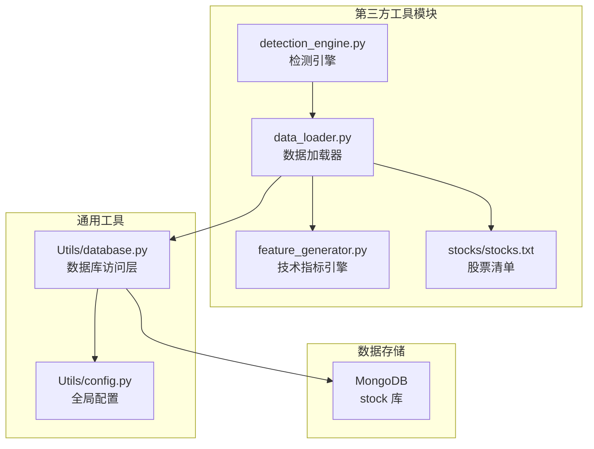
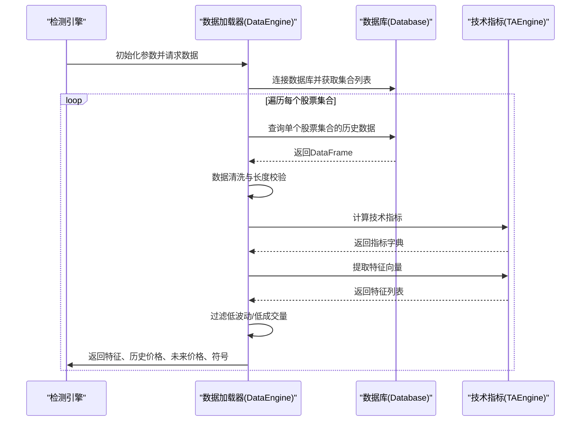
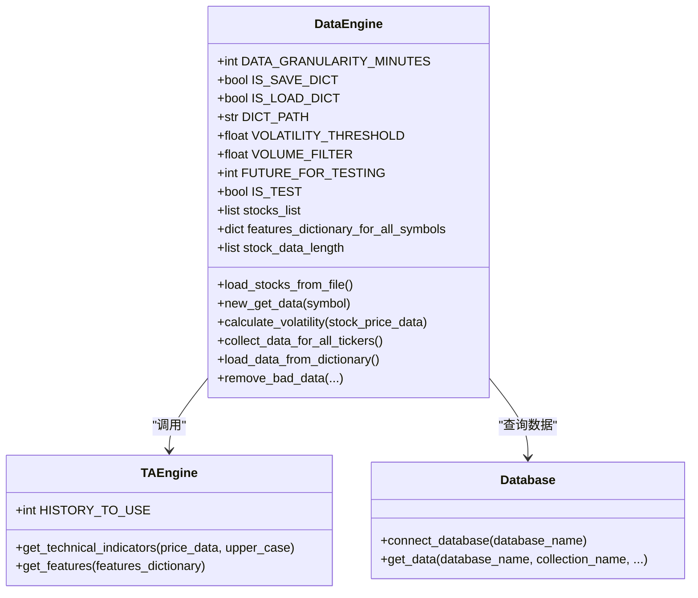
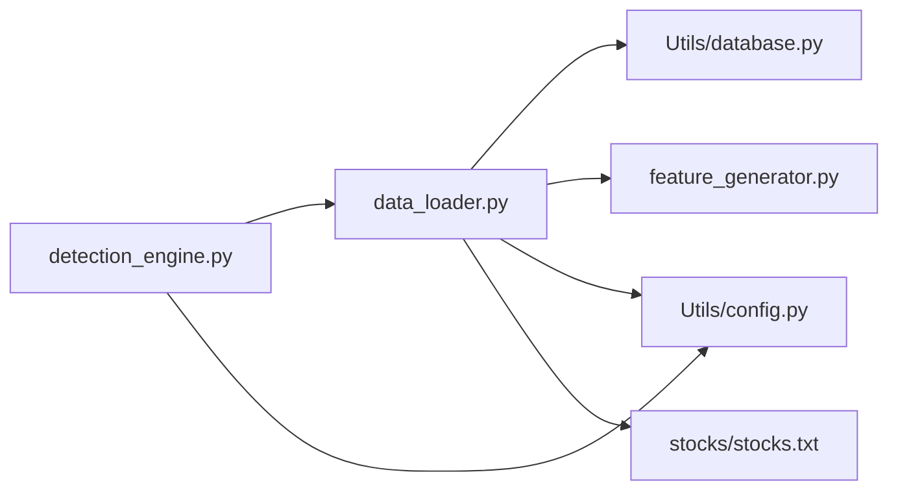

# 数据加载器

<cite>
**本文引用的文件**
- [data_loader.py](file://src/ThirdPartyToolSurpriver/data_loader.py)
- [feature_generator.py](file://src/ThirdPartyToolSurpriver/feature_generator.py)
- [database.py](file://src/Utils/database.py)
- [config.py](file://src/Utils/config.py)
- [detection_engine.py](file://src/ThirdPartyToolSurpriver/detection_engine.py)
- [README.md](file://src/ThirdPartyToolSurpriver/README.md)
- [stocks.txt](file://src/ThirdPartyToolSurpriver/stocks/stocks.txt)
</cite>

## 目录
1. [简介](#简介)
2. [项目结构](#项目结构)
3. [核心组件](#核心组件)
4. [架构总览](#架构总览)
5. [详细组件分析](#详细组件分析)
6. [依赖关系分析](#依赖关系分析)
7. [性能考量](#性能考量)
8. [故障排查指南](#故障排查指南)
9. [结论](#结论)
10. [附录](#附录)

## 简介
本文件面向“数据加载器”模块，系统化阐述 data_loader.py 的实现原理与数据获取机制，覆盖以下关键点：
- 从 MongoDB 加载历史行情数据的完整流程
- 技术指标与特征提取的处理逻辑
- 数据格式转换、清洗与验证策略
- 配置参数与使用示例
- 缓存机制与性能优化
- 异常处理与错误恢复
- 实际加载案例与最佳实践

需要特别说明：当前仓库中 data_loader.py 并未直接对接 Yahoo Finance 或其他外部数据源，而是从 MongoDB 数据库读取已存储的历史行情数据；因此本文将重点解释 MongoDB 数据读取、数据清洗与特征工程的整体流程。

## 项目结构
数据加载器位于第三方工具模块中，与检测引擎、技术指标生成器、数据库访问层协同工作。

图表来源
- [data_loader.py:16-61](file://src/ThirdPartyToolSurpriver/data_loader.py#L16-L61)
- [feature_generator.py:11-15](file://src/ThirdPartyToolSurpriver/feature_generator.py#L11-L15)
- [detection_engine.py:10,176-187:10-187](file://src/ThirdPartyToolSurpriver/detection_engine.py#L10-L187)
- [database.py:36-63](file://src/Utils/database.py#L36-L63)
- [config.py:39](file://src/Utils/config.py#L39)

章节来源
- [data_loader.py:16-61](file://src/ThirdPartyToolSurpriver/data_loader.py#L16-L61)
- [detection_engine.py:10,176-187:10-187](file://src/ThirdPartyToolSurpriver/detection_engine.py#L10-L187)
- [database.py:36-63](file://src/Utils/database.py#L36-L63)
- [config.py:39](file://src/Utils/config.py#L39)

## 核心组件
- 数据加载器 DataEngine：负责从 MongoDB 读取股票历史数据、进行数据清洗与过滤、调用技术指标引擎生成特征，并支持字典缓存与批量加载。
- 技术指标引擎 TAEngine：基于输入的 OHLCV 数据，计算多种技术指标（RSI、Stochastic、Accumulation/Distribution、EOM、CCI、日对数收益、成交量变化等）并抽取特征向量。
- 数据库访问层 Database：封装 MongoDB 连接、查询与自动重连机制，提供统一的数据读取接口。
- 配置模块 config：集中管理数据库地址、端口、默认数据库名等全局配置。

章节来源
- [data_loader.py:16-61](file://src/ThirdPartyToolSurpriver/data_loader.py#L16-L61)
- [feature_generator.py:11-15](file://src/ThirdPartyToolSurpriver/feature_generator.py#L11-L15)
- [database.py:36-63](file://src/Utils/database.py#L36-L63)
- [config.py:39](file://src/Utils/config.py#L39)

## 架构总览
数据流从 MongoDB 读取到 DataEngine，再由 TAEngine 生成技术特征，最终供检测引擎使用。

图表来源
- [detection_engine.py:278-292](file://src/ThirdPartyToolSurpriver/detection_engine.py#L278-L292)
- [data_loader.py:148-224](file://src/ThirdPartyToolSurpriver/data_loader.py#L148-L224)
- [database.py:94-172](file://src/Utils/database.py#L94-L172)
- [feature_generator.py:31-161](file://src/ThirdPartyToolSurpriver/feature_generator.py#L31-L161)

## 详细组件分析

### 数据加载器 DataEngine
DataEngine 是数据加载的核心类，职责包括：
- 初始化数据库连接与配置参数
- 从 MongoDB 读取股票集合数据
- 数据清洗与过滤（长度、波动率、成交量）
- 调用技术指标引擎生成特征
- 支持字典缓存与批量保存

关键实现要点：
- 数据库连接：通过 Database 类连接 MongoDB，默认数据库名为 stock。
- 股票清单：从 stocks/stocks.txt 读取待分析的股票列表。
- 数据读取：按集合名逐一查询，集合命名规则与股票代码映射。
- 数据清洗：剔除样本过少、波动率过低、成交量不足的数据。
- 特征生成：委托 TAEngine 完成技术指标计算与特征抽取。
- 缓存：支持将中间结果以 NumPy 数组形式持久化到 dictionaries 目录。

章节来源
- [data_loader.py:16-61](file://src/ThirdPartyToolSurpriver/data_loader.py#L16-L61)
- [data_loader.py:67-137](file://src/ThirdPartyToolSurpriver/data_loader.py#L67-L137)
- [data_loader.py:148-224](file://src/ThirdPartyToolSurpriver/data_loader.py#L148-L224)
- [data_loader.py:226-261](file://src/ThirdPartyToolSurpriver/data_loader.py#L226-L261)
- [data_loader.py:263-292](file://src/ThirdPartyToolSurpriver/data_loader.py#L263-L292)

#### 类关系图

图表来源
- [data_loader.py:16-61](file://src/ThirdPartyToolSurpriver/data_loader.py#L16-L61)
- [feature_generator.py:11-15](file://src/ThirdPartyToolSurpriver/feature_generator.py#L11-L15)
- [database.py:36-63](file://src/Utils/database.py#L36-L63)

### 技术指标引擎 TAEngine
TAEngine 负责从 OHLCV 数据中提取技术指标并生成特征向量：
- 指标类型：RSI、Stochastic Oscillator、Accumulation/Distribution、Ease of Movement、CCI、日对数收益、成交量变化等。
- 特征抽取：仅选取部分指标序列及其回归斜率、相关系数等统计特征，形成固定长度的特征向量。

章节来源
- [feature_generator.py:31-161](file://src/ThirdPartyToolSurpriver/feature_generator.py#L31-L161)
- [feature_generator.py:163-185](file://src/ThirdPartyToolSurpriver/feature_generator.py#L163-L185)

### 数据库访问层 Database
Database 封装了 MongoDB 的连接与查询逻辑：
- 自动重连装饰器：在网络抖动或连接中断时自动指数退避重试。
- 查询接口：支持按键选择字段、限制最大条数、排序等。
- DataFrame 输出：将查询结果转换为 Pandas DataFrame，便于后续处理。

章节来源
- [database.py:15-33](file://src/Utils/database.py#L15-L33)
- [database.py:94-172](file://src/Utils/database.py#L94-L172)

### 参数与配置
- 数据库配置：默认数据库名为 stock，可通过 config 模块设置。
- 股票清单：位于 stocks/stocks.txt，每行一个股票代码。
- 检测引擎参数：通过命令行传入，DataEngine 接收并驱动数据加载与特征生成。

章节来源
- [config.py:39](file://src/Utils/config.py#L39)
- [stocks.txt:1-4](file://src/ThirdPartyToolSurpriver/stocks/stocks.txt#L1-L4)
- [detection_engine.py:24-98](file://src/ThirdPartyToolSurpriver/detection_engine.py#L24-L98)

## 依赖关系分析
- DataEngine 依赖 Database 进行数据读取，依赖 TAEngine 进行特征生成。
- DetectionEngine 作为入口，组合 DataEngine 与其他组件。
- FeatureGenerator 与 Database 之间无直接耦合，通过 DataEngine 间接协作。

图表来源
- [detection_engine.py:10,176-187:10-187](file://src/ThirdPartyToolSurpriver/detection_engine.py#L10-L187)
- [data_loader.py:16-61](file://src/ThirdPartyToolSurpriver/data_loader.py#L16-L61)
- [database.py:36-63](file://src/Utils/database.py#L36-L63)
- [config.py:39](file://src/Utils/config.py#L39)
- [stocks.txt:1-4](file://src/ThirdPartyToolSurpriver/stocks/stocks.txt#L1-L4)

## 性能考量
- 批量保存字典：每处理一定数量的股票后，将中间结果保存至 dictionaries 目录，避免重复计算与内存压力。
- 进度可视化：使用进度条显示处理进度，提升可观测性。
- 数据清洗前置：在特征生成前进行波动率与成交量过滤，减少无效计算。
- 自动重连：数据库层采用指数退避重连，提高稳定性与吞吐能力。

章节来源
- [data_loader.py:186-191](file://src/ThirdPartyToolSurpriver/data_loader.py#L186-L191)
- [data_loader.py:167-171](file://src/ThirdPartyToolSurpriver/data_loader.py#L167-L171)
- [database.py:15-33](file://src/Utils/database.py#L15-L33)

## 故障排查指南
- 数据为空或集合不存在：数据库查询返回空时会记录警告日志，检查集合命名与数据是否导入。
- 网络不稳定导致连接失败：启用自动重连装饰器，系统会自动重试并等待指数退避时间。
- 数据长度不足：当某股票数据样本过少时会被跳过，确认数据采集完整性。
- 低波动/低成交量过滤：若波动率或成交量低于阈值会被过滤，可适当调整阈值参数。
- 字典加载失败：确保 dictionaries 目录存在且路径正确，文件权限可读写。

章节来源
- [database.py:141-147](file://src/Utils/database.py#L141-L147)
- [database.py:21-31](file://src/Utils/database.py#L21-L31)
- [data_loader.py:96-98](file://src/ThirdPartyToolSurpriver/data_loader.py#L96-L98)
- [data_loader.py:167-171](file://src/ThirdPartyToolSurpriver/data_loader.py#L167-L171)
- [data_loader.py:197-201](file://src/ThirdPartyToolSurpriver/data_loader.py#L197-L201)

## 结论
本数据加载器模块以 MongoDB 为核心数据源，结合技术指标引擎与严格的清洗过滤策略，实现了稳定高效的数据准备流程。通过字典缓存与自动重连机制，显著提升了运行效率与可靠性。尽管当前未直接对接 Yahoo Finance 等外部数据源，但模块设计具备良好的扩展性，可在保持现有接口不变的前提下接入新的数据源。

## 附录

### 使用示例与参数说明
- 命令行参数（来自检测引擎）：
  - top_n：输出前 N 个异常股票
  - min_volume：最小成交量过滤
  - history_to_use：用于分析的历史条数
  - is_load_from_dictionary / is_save_dictionary：是否从字典加载/保存字典
  - data_granularity_minutes：数据粒度（分钟）
  - is_test / future_bars：是否测试及保留未来条数
  - volatility_filter：波动率阈值
  - output_format：输出格式（CLI/JSON）
  - stock_list：股票清单文件名

- 示例命令（来自 README）：
  - 首次运行并保存字典
  - 从字典加载并直接预测
  - 历史回测模式

章节来源
- [detection_engine.py:24-98](file://src/ThirdPartyToolSurpriver/detection_engine.py#L24-L98)
- [README.md:49-68](file://src/ThirdPartyToolSurpriver/README.md#L49-L68)
- [README.md:88-95](file://src/ThirdPartyToolSurpriver/README.md#L88-L95)

### 数据格式与字段
- 输入数据：OHLCV（日期、开盘价、最高价、最低价、收盘价、成交量）
- 输出数据：特征向量、历史价格序列、未来价格序列、股票符号
- 技术指标：RSI、Stochastic、Accumulation/Distribution、EOM、CCI、日对数收益、成交量变化等

章节来源
- [data_loader.py:100-137](file://src/ThirdPartyToolSurpriver/data_loader.py#L100-L137)
- [feature_generator.py:31-161](file://src/ThirdPartyToolSurpriver/feature_generator.py#L31-L161)

### 最佳实践
- 合理设置波动率与成交量阈值，避免噪声数据影响模型效果
- 使用字典缓存加速重复分析任务
- 在生产环境中启用自动重连与日志监控
- 对于新数据源接入，建议保持 DataEngine 的接口不变，新增适配层