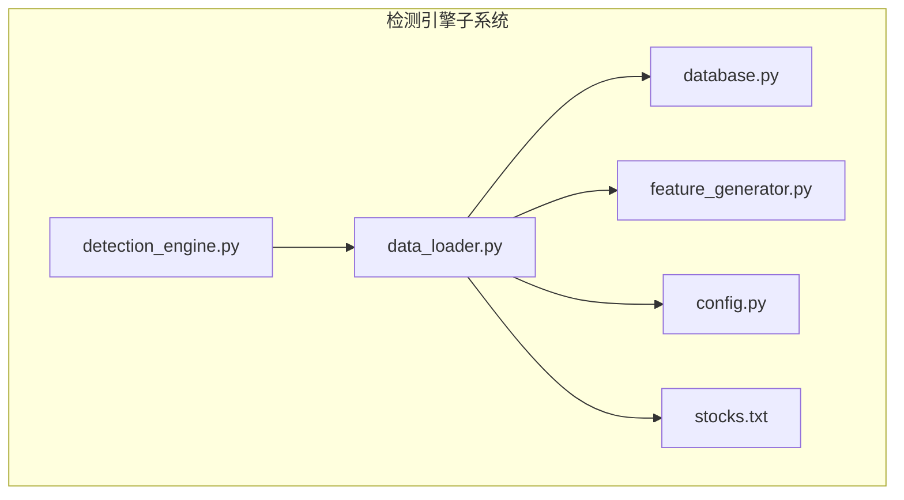
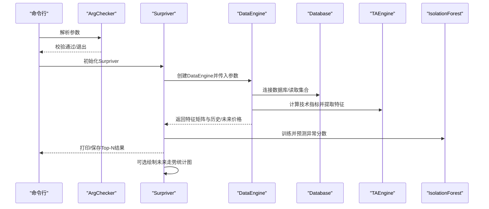
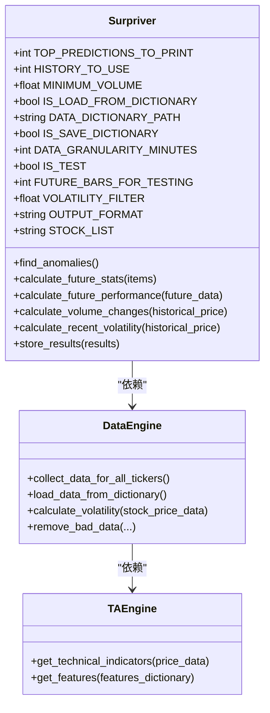
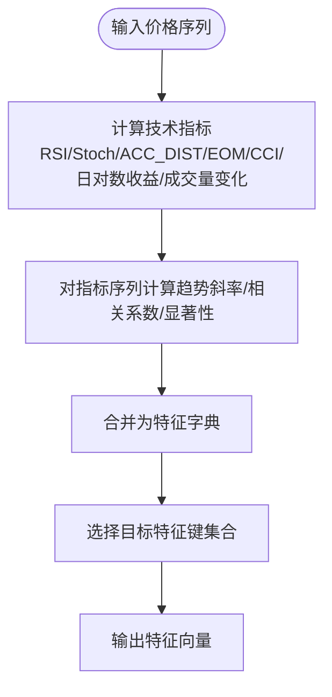
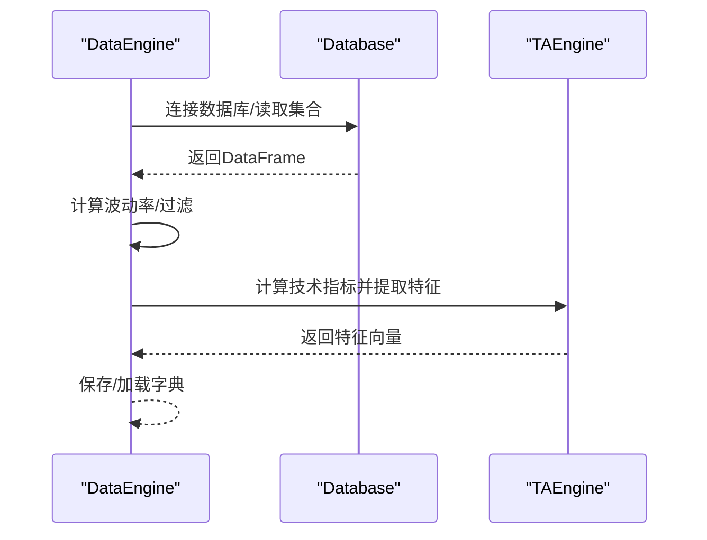
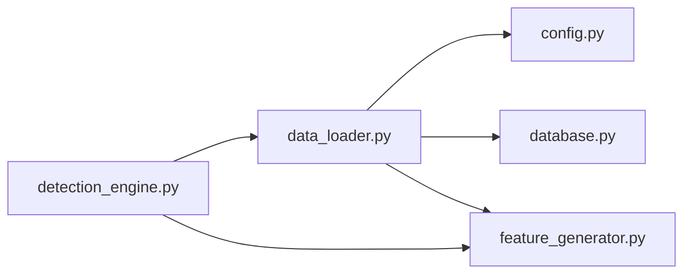
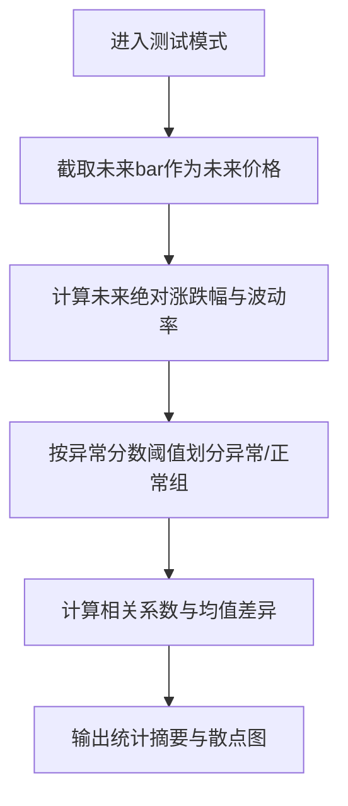

# 检测引擎

<cite>
**本文引用的文件列表**
- [detection_engine.py](file://src/ThirdPartyToolSurpriver/detection_engine.py)
- [feature_generator.py](file://src/ThirdPartyToolSurpriver/feature_generator.py)
- [data_loader.py](file://src/ThirdPartyToolSurpriver/data_loader.py)
- [config.py](file://src/Utils/config.py)
- [database.py](file://src/Utils/database.py)
- [stocks.txt](file://src/ThirdPartyToolSurpriver/stocks/stocks.txt)
- [README.md](file://README.md)
</cite>

## 目录
1. [简介](#简介)
2. [项目结构](#项目结构)
3. [核心组件](#核心组件)
4. [架构总览](#架构总览)
5. [详细组件分析](#详细组件分析)
6. [依赖关系分析](#依赖关系分析)
7. [性能与资源特性](#性能与资源特性)
8. [命令行参数与使用指南](#命令行参数与使用指南)
9. [历史数据测试与验证策略](#历史数据测试与验证策略)
10. [性能评估指标与结果分析](#性能评估指标与结果分析)
11. [故障排查](#故障排查)
12. [结论](#结论)
13. [附录：常见检测案例与参数调优建议](#附录常见检测案例与参数调优建议)

## 简介
本文件面向“检测引擎”模块，系统化阐述其在量化研究中的异常检测机制与实现细节。该模块以时间序列价格与交易量为基础，结合技术指标特征，采用孤立森林(Isolation Forest)进行无监督异常检测，输出异常分数并支持未来走势统计分析，用于筛选潜在异动股票。文档覆盖：
- 核心算法与异常检测机制
- 特征工程与机器学习模型训练/推理流程
- 异常分数计算与股票筛选逻辑
- 命令行参数配置与使用方法
- 历史数据测试与验证策略
- 性能评估指标与结果分析方法
- 实际检测案例与参数调优建议

## 项目结构
检测引擎位于第三方工具目录下，主要由以下文件构成：
- detection_engine.py：主入口与异常检测流程控制
- feature_generator.py：技术指标特征生成器
- data_loader.py：数据加载与过滤（MongoDB）
- config.py：数据库与全局配置
- database.py：MongoDB访问封装
- stocks.txt：待检测股票列表
- README.md：项目背景与整体说明

图表来源
- [detection_engine.py:1-599](file://src/ThirdPartyToolSurpriver/detection_engine.py#L1-L599)
- [feature_generator.py:1-186](file://src/ThirdPartyToolSurpriver/feature_generator.py#L1-L186)
- [data_loader.py:1-293](file://src/ThirdPartyToolSurpriver/data_loader.py#L1-L293)
- [config.py:1-455](file://src/Utils/config.py#L1-L455)
- [database.py:1-176](file://src/Utils/database.py#L1-L176)
- [stocks.txt:1-4](file://src/ThirdPartyToolSurpriver/stocks/stocks.txt#L1-L4)

章节来源
- [detection_engine.py:1-599](file://src/ThirdPartyToolSurpriver/detection_engine.py#L1-L599)
- [feature_generator.py:1-186](file://src/ThirdPartyToolSurpriver/feature_generator.py#L1-L186)
- [data_loader.py:1-293](file://src/ThirdPartyToolSurpriver/data_loader.py#L1-L293)
- [config.py:1-455](file://src/Utils/config.py#L1-L455)
- [database.py:1-176](file://src/Utils/database.py#L1-L176)
- [stocks.txt:1-4](file://src/ThirdPartyToolSurpriver/stocks/stocks.txt#L1-L4)
- [README.md:1-33](file://README.md#L1-L33)

## 核心组件
- 异常检测器 Surpriver：负责收集数据、训练/推理、输出与可视化
- 技术指标引擎 TAEngine：提取RSI、Stochastic、Accumulation Distribution、Ease of Movement、CCI、日对数收益、成交量变化等特征
- 数据引擎 DataEngine：从MongoDB读取历史价格数据，按参数过滤，构造特征矩阵
- 配置与数据库：提供数据库连接、集合名称、默认参数等

章节来源
- [detection_engine.py:158-599](file://src/ThirdPartyToolSurpriver/detection_engine.py#L158-L599)
- [feature_generator.py:11-186](file://src/ThirdPartyToolSurpriver/feature_generator.py#L11-L186)
- [data_loader.py:16-293](file://src/ThirdPartyToolSurpriver/data_loader.py#L16-L293)
- [config.py:39-40](file://src/Utils/config.py#L39-L40)
- [database.py:36-176](file://src/Utils/database.py#L36-L176)

## 架构总览
检测引擎采用“数据加载-特征工程-异常检测-结果输出”的流水线式架构。核心流程如下：
- 参数校验与初始化
- 从MongoDB加载历史价格数据，按分钟粒度与历史窗口聚合
- 计算技术指标并提取特征向量
- 使用孤立森林训练并预测异常分数
- 输出Top-N异常股票，可选保存JSON或绘制未来走势散点图

图表来源
- [detection_engine.py:121-118](file://src/ThirdPartyToolSurpriver/detection_engine.py#L121-L118)
- [detection_engine.py:272-431](file://src/ThirdPartyToolSurpriver/detection_engine.py#L272-L431)
- [data_loader.py:86-137](file://src/ThirdPartyToolSurpriver/data_loader.py#L86-L137)
- [feature_generator.py:31-161](file://src/ThirdPartyToolSurpriver/feature_generator.py#L31-L161)
- [database.py:94-172](file://src/Utils/database.py#L94-L172)

## 详细组件分析

### 异常检测器 Surpriver
- 功能职责
  - 参数解析与校验
  - 组织数据采集、特征提取、异常检测与结果输出
  - 提供未来走势统计与可视化
- 关键方法
  - find_anomalies：主流程，训练模型、排序输出、可选保存JSON、绘制未来走势散点图
  - calculate_future_stats：计算异常与未来绝对涨跌幅的相关性、均值差异等统计
  - calculate_future_performance：计算未来一段时间内绝对涨跌幅与波动率
  - calculate_volume_changes/calculate_recent_volatility：计算成交量与近期波动率统计
- 异常分数含义
  - 使用孤立森林的decision_function返回值作为异常分数；越低越异常
  - 通过阈值（如小于0）判定异常股票

图表来源
- [detection_engine.py:158-599](file://src/ThirdPartyToolSurpriver/detection_engine.py#L158-L599)
- [data_loader.py:16-293](file://src/ThirdPartyToolSurpriver/data_loader.py#L16-L293)
- [feature_generator.py:11-186](file://src/ThirdPartyToolSurpriver/feature_generator.py#L11-L186)

章节来源
- [detection_engine.py:158-599](file://src/ThirdPartyToolSurpriver/detection_engine.py#L158-L599)

### 技术指标引擎 TAEngine
- 功能职责
  - 基于价格序列计算多种技术指标，形成特征字典
  - 对部分指标计算趋势斜率、相关系数与显著性，增强判别能力
- 指标清单
  - RSI（窗口5/10/15）、Stochastic（窗口5/10/15）、Accumulation Distribution、Ease of Movement（窗口5/10/20）、CCI（窗口5/10/20）
  - 日对数收益、成交量变化率及其趋势
- 特征提取
  - 仅提取volume_returns、daily_log_return、eom、cci、rsi等关键特征，便于后续模型输入

图表来源
- [feature_generator.py:31-185](file://src/ThirdPartyToolSurpriver/feature_generator.py#L31-L185)

章节来源
- [feature_generator.py:11-186](file://src/ThirdPartyToolSurpriver/feature_generator.py#L11-L186)

### 数据引擎 DataEngine
- 功能职责
  - 从MongoDB读取历史价格数据，支持测试模式截取未来片段
  - 计算波动率、过滤低成交量与低波动股票
  - 生成特征字典并保存/加载到本地字典文件
- 数据来源
  - 通过Database类连接MongoDB，读取集合数据并转换为DataFrame
- 过滤策略
  - 最小成交量阈值、历史波动率阈值、空值剔除、长度一致性清洗

图表来源
- [data_loader.py:86-293](file://src/ThirdPartyToolSurpriver/data_loader.py#L86-L293)
- [database.py:94-172](file://src/Utils/database.py#L94-L172)

章节来源
- [data_loader.py:16-293](file://src/ThirdPartyToolSurpriver/data_loader.py#L16-L293)
- [database.py:36-176](file://src/Utils/database.py#L36-L176)
- [config.py:39-40](file://src/Utils/config.py#L39-L40)

## 依赖关系分析
- 外部库
  - sklearn.ensemble.IsolationForest：异常检测
  - ta（technical-analysis-library）：技术指标计算
  - numpy/pandas/matplotlib：数值与绘图
  - pymongo：MongoDB访问
- 内部模块
  - detection_engine依赖data_loader、feature_generator
  - data_loader依赖config、database、feature_generator
  - database依赖config与加密模块

图表来源
- [detection_engine.py:9-12](file://src/ThirdPartyToolSurpriver/detection_engine.py#L9-L12)
- [data_loader.py:6-11](file://src/ThirdPartyToolSurpriver/data_loader.py#L6-L11)
- [feature_generator.py:2-4](file://src/ThirdPartyToolSurpriver/feature_generator.py#L2-L4)
- [database.py:5-10](file://src/Utils/database.py#L5-L10)

章节来源
- [detection_engine.py:1-20](file://src/ThirdPartyToolSurpriver/detection_engine.py#L1-L20)
- [data_loader.py:1-14](file://src/ThirdPartyToolSurpriver/data_loader.py#L1-L14)
- [feature_generator.py:1-8](file://src/ThirdPartyToolSurpriver/feature_generator.py#L1-L8)
- [database.py:1-11](file://src/Utils/database.py#L1-L11)

## 性能与资源特性
- 时间复杂度
  - 特征生成：对每只股票遍历历史窗口，计算多个指标，整体近似O(N*S*K)，其中N为股票数、S为历史窗口长度、K为指标数量
  - 孤立森林训练：O(N*S*log(S))，取决于样本数与树数量
- 空间复杂度
  - 特征矩阵大小约为N*(特征维度)
  - 可选保存字典文件，减少重复计算
- 资源消耗
  - MongoDB读取与pandas转换为主要IO瓶颈
  - 可通过批量处理、字典缓存与并行策略优化

[本节为通用性能讨论，不直接分析具体文件，故无章节来源]

## 命令行参数与使用指南
- 参数一览
  - --top_n：输出Top-N异常股票，默认25
  - --min_volume：最小平均成交量阈值，默认5000
  - --history_to_use：历史窗口长度（分钟级bar数量），默认7
  - --is_load_from_dictionary：是否从字典加载数据，默认0（否）
  - --data_dictionary_path：字典文件路径，默认“dictionaries/data_dictionary.npy”
  - --is_save_dictionary：是否保存字典，默认1（是）
  - --data_granularity_minutes：数据粒度（1/5/10/15/30/60），默认15
  - --is_test：是否测试模式（需要未来bar），默认1
  - --future_bars：测试时保留的未来bar数量，默认25
  - --volatility_filter：波动率阈值，默认0.05
  - --output_format：输出格式（CLI/JSON），默认CLI
  - --stock_list：股票列表文件名，默认“stocks.txt”
- 使用示例
  - 测试模式：python detection_engine.py --is_test 1 --future_bars 25 --top_n 25 --min_volume 5000 --data_granularity_minutes 60 --history_to_use 14 --is_load_from_dictionary 0 --data_dictionary_path 'dictionaries/feature_dict.npy' --is_save_dictionary 1 --output_format 'CLI'

章节来源
- [detection_engine.py:24-98](file://src/ThirdPartyToolSurpriver/detection_engine.py#L24-L98)
- [detection_engine.py:113-118](file://src/ThirdPartyToolSurpriver/detection_engine.py#L113-L118)

## 历史数据测试与验证策略
- 测试模式说明
  - 当is_test=1时，会从历史数据中截取未来若干bar作为“未来价格”，用于验证异常检测的有效性
  - 未来bar数量需≥2，否则提示退出
- 统计指标
  - 计算异常分数与未来绝对涨跌幅的相关系数
  - 分组比较异常与正常股票的未来绝对涨跌幅均值、未来波动率、历史波动率
- 可视化
  - 绘制异常分数与未来绝对涨跌幅的散点图，异常股票标记为负分

图表来源
- [detection_engine.py:451-588](file://src/ThirdPartyToolSurpriver/detection_engine.py#L451-L588)
- [detection_engine.py:272-431](file://src/ThirdPartyToolSurpriver/detection_engine.py#L272-L431)

章节来源
- [detection_engine.py:140-146](file://src/ThirdPartyToolSurpriver/detection_engine.py#L140-L146)
- [detection_engine.py:451-588](file://src/ThirdPartyToolSurpriver/detection_engine.py#L451-L588)

## 性能评估指标与结果分析
- 主要指标
  - 异常分数与未来绝对涨跌幅的相关系数（越接近-1越好）
  - 异常组与正常组未来绝对涨跌幅均值差异
  - 异常组与正常组未来波动率与历史波动率均值差异
- 结果解读
  - 若异常组未来绝对涨跌幅显著高于正常组且波动率更低，则说明异常检测具有一定预测价值
  - 需结合业务场景设定阈值与筛选条件

章节来源
- [detection_engine.py:494-556](file://src/ThirdPartyToolSurpriver/detection_engine.py#L494-L556)

## 故障排查
- 常见问题
  - 未找到股票列表文件：检查stocks目录下的文件是否存在
  - 未来bar数量不足：测试模式下future_bars需≥2
  - 输出格式非法：仅支持CLI/JSON
  - 数据粒度不在允许集合：仅支持1/5/10/15/30/60分钟
  - MongoDB连接失败：确认IP/端口与网络连通性
  - 字典文件损坏：删除旧字典后重新生成
- 建议
  - 启用字典缓存以提升重复运行效率
  - 在测试模式下先观察相关系数与均值差异，再调整阈值

章节来源
- [detection_engine.py:126-156](file://src/ThirdPartyToolSurpriver/detection_engine.py#L126-L156)
- [database.py:44-60](file://src/Utils/database.py#L44-L60)

## 结论
检测引擎通过技术指标特征与孤立森林异常检测，实现了对异动股票的快速筛选与未来走势统计验证。其优势在于：
- 特征工程简洁有效，覆盖价格、成交量与趋势信息
- 支持历史测试与可视化，便于评估模型有效性
- 参数灵活，适合不同周期与市场的适配

建议在实际应用中结合基本面与新闻情绪信号，进一步提升检测精度与稳定性。

[本节为总结性内容，不直接分析具体文件，故无章节来源]

## 附录：常见检测案例与参数调优建议
- 案例1：日线级别异动检测
  - 参数设置：data_granularity_minutes=60，history_to_use=14，is_test=1，future_bars=25
  - 适用场景：捕捉日内突发异动后的次日/次周期走势
- 案例2：高频异动检测
  - 参数设置：data_granularity_minutes=15，history_to_use=7，is_test=1，future_bars=10
  - 适用场景：捕捉短期超短期异动
- 参数调优建议
  - 增大top_n以扩大候选池，再结合未来绝对涨跌幅阈值二次筛选
  - 调整min_volume与volatility_filter以过滤噪声
  - 在测试模式下观察相关系数与均值差异，逐步优化阈值
  - 启用字典缓存以降低重复运行成本

章节来源
- [detection_engine.py:24-98](file://src/ThirdPartyToolSurpriver/detection_engine.py#L24-L98)
- [detection_engine.py:494-556](file://src/ThirdPartyToolSurpriver/detection_engine.py#L494-L556)