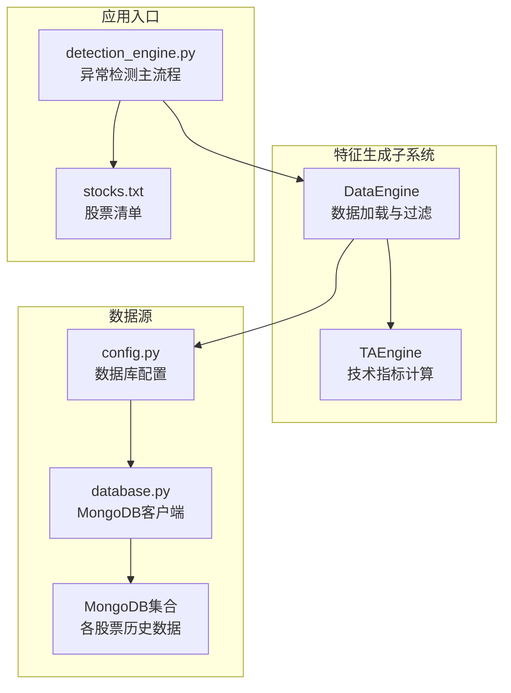
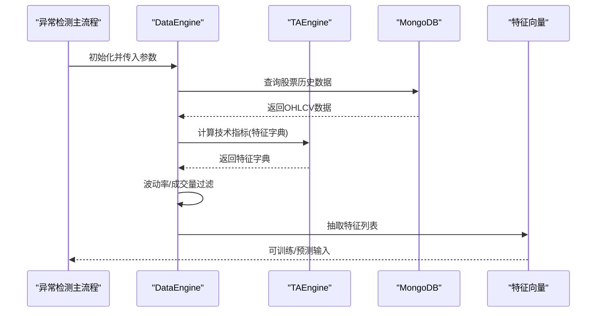
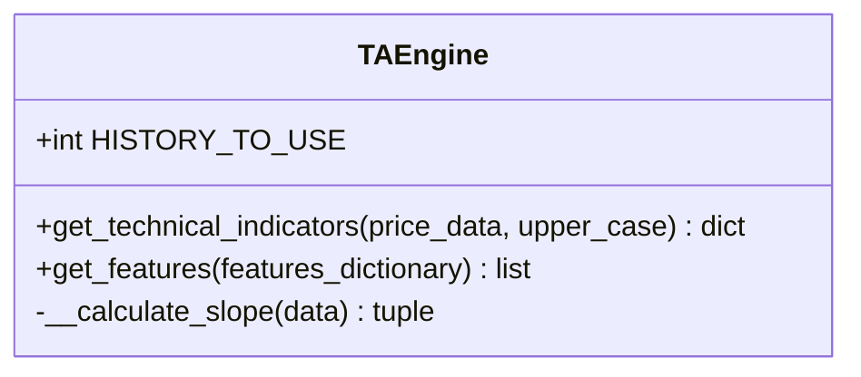
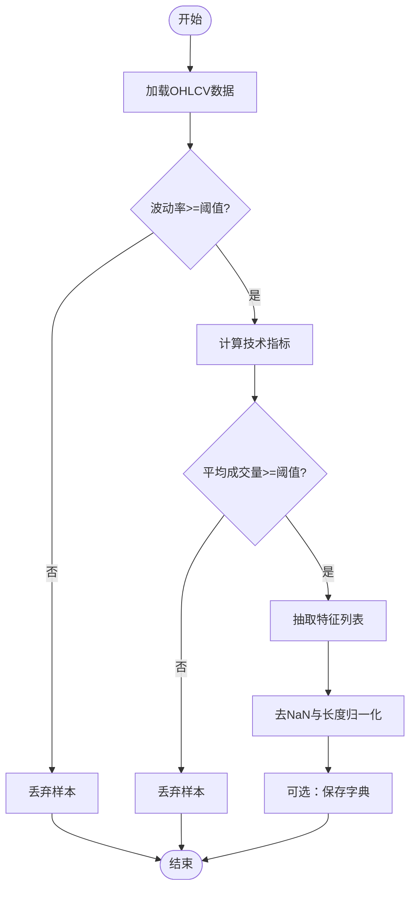
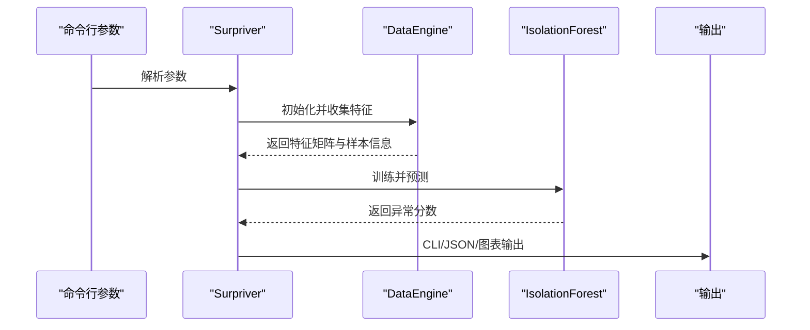
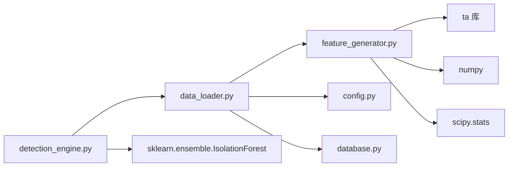

# 特征生成器

<cite>
**本文引用的文件**
- [feature_generator.py](file://src/ThirdPartyToolSurpriver/feature_generator.py)
- [data_loader.py](file://src/ThirdPartyToolSurpriver/data_loader.py)
- [detection_engine.py](file://src/ThirdPartyToolSurpriver/detection_engine.py)
- [config.py](file://src/Utils/config.py)
- [database.py](file://src/Utils/database.py)
- [stocks.txt](file://src/ThirdPartyToolSurpriver/stocks/stocks.txt)
- [README.md](file://README.md)
</cite>

## 目录
1. [引言](#引言)
2. [项目结构](#项目结构)
3. [核心组件](#核心组件)
4. [架构总览](#架构总览)
5. [详细组件分析](#详细组件分析)
6. [依赖分析](#依赖分析)
7. [性能考虑](#性能考虑)
8. [故障排查指南](#故障排查指南)
9. [结论](#结论)
10. [附录](#附录)

## 引言
本文件面向“特征生成器”模块，系统化梳理并解释特征工程实现与技术指标计算方法，覆盖以下关键主题：
- 价格与成交量回报特征的生成逻辑
- 技术指标的计算公式与参数设置
- 特征选择与组合策略
- 特征标准化与缩放处理
- 特征质量评估与特征重要性分析
- 实际使用案例与优化建议

本模块以 TAEngine 为核心，基于第三方技术分析库对 OHLCV 数据进行批量特征提取，并通过 DataEngine 统一加载与过滤数据，最终供异常检测流程使用。

## 项目结构
特征生成器位于 ThirdPartyToolSurpriver 子模块中，主要文件与职责如下：
- feature_generator.py：定义 TAEngine，负责技术指标计算与特征抽取
- data_loader.py：封装数据引擎，负责从 MongoDB 加载历史价格数据、过滤低波动/低成交量样本、调用 TAEngine 生成特征字典并导出特征列表
- detection_engine.py：参数解析、异常检测主流程、结果统计与可视化
- config.py：数据库连接配置
- database.py：MongoDB 客户端封装
- stocks.txt：待分析股票列表
- README.md：项目背景与模块定位

**图表来源**
- [feature_generator.py:11-186](file://src/ThirdPartyToolSurpriver/feature_generator.py#L11-L186)
- [data_loader.py:16-293](file://src/ThirdPartyToolSurpriver/data_loader.py#L16-L293)
- [detection_engine.py:158-599](file://src/ThirdPartyToolSurpriver/detection_engine.py#L158-L599)
- [config.py:36-40](file://src/Utils/config.py#L36-L40)
- [database.py:36-176](file://src/Utils/database.py#L36-L176)
- [stocks.txt:1-4](file://src/ThirdPartyToolSurpriver/stocks/stocks.txt#L1-L4)

**章节来源**
- [feature_generator.py:11-186](file://src/ThirdPartyToolSurpriver/feature_generator.py#L11-L186)
- [data_loader.py:16-293](file://src/ThirdPartyToolSurpriver/data_loader.py#L16-L293)
- [detection_engine.py:158-599](file://src/ThirdPartyToolSurpriver/detection_engine.py#L158-L599)
- [config.py:36-40](file://src/Utils/config.py#L36-L40)
- [database.py:36-176](file://src/Utils/database.py#L36-L176)
- [stocks.txt:1-4](file://src/ThirdPartyToolSurpriver/stocks/stocks.txt#L1-L4)
- [README.md:1-33](file://README.md#L1-L33)

## 核心组件
- TAEngine
  - 职责：接收 OHLCV DataFrame，计算多种技术指标，附加趋势斜率与拟合统计，形成特征字典；按预设键集合抽取特征向量
  - 关键能力：
    - 斜率与相关性统计：对时间序列指标进行线性回归，输出斜率、相关系数绝对值与 p 值
    - 多窗口技术指标：RSI、Stochastic Oscillator、Ease of Movement、CCI 等
    - 价格与成交量回报：日对数收益、成交量同比变化
- DataEngine
  - 职责：从 MongoDB 加载各股票历史数据，进行波动率与成交量过滤，调用 TAEngine 生成特征字典与特征向量，支持从中间字典加载以加速重跑
  - 关键能力：
    - 波动率阈值过滤：剔除低波动股票
    - 成交量阈值过滤：剔除近期平均成交量过低样本
    - 数据一致性清洗：长度归一化与 NaN 过滤
- detection_engine.py
  - 职责：参数解析、调用 DataEngine 收集特征，使用 Isolation Forest 进行异常检测，输出统计与可视化

**章节来源**
- [feature_generator.py:11-186](file://src/ThirdPartyToolSurpriver/feature_generator.py#L11-L186)
- [data_loader.py:16-293](file://src/ThirdPartyToolSurpriver/data_loader.py#L16-L293)
- [detection_engine.py:158-599](file://src/ThirdPartyToolSurpriver/detection_engine.py#L158-L599)

## 架构总览
特征生成器的运行链路如下：
- 输入：MongoDB 中各股票的历史 OHLCV 数据
- 处理：DataEngine 加载数据 → TAEngine 计算技术指标 → DataEngine 过滤与清洗 → 输出特征向量
- 应用：Isolation Forest 对特征向量进行异常检测

**图表来源**
- [data_loader.py:148-224](file://src/ThirdPartyToolSurpriver/data_loader.py#L148-L224)
- [feature_generator.py:31-161](file://src/ThirdPartyToolSurpriver/feature_generator.py#L31-L161)
- [detection_engine.py:272-293](file://src/ThirdPartyToolSurpriver/detection_engine.py#L272-L293)

## 详细组件分析

### TAEngine：技术指标与特征生成
- 接口与职责
  - get_technical_indicators(price_data, upper_case): 基于 OHLCV 计算多类技术指标，返回字典
  - get_features(features_dictionary): 从字典中抽取选定键对应的特征序列
- 技术指标与参数
  - RSI：窗口大小为 5/10/15；附加斜率、相关系数绝对值与 p 值
  - 随机震荡指标 Stochastic Oscillator：窗口大小为 5/10/15；平滑窗口为窗口的 1/3；附加斜率、相关系数绝对值与 p 值
  - 价量指标 Acc Dist Index：无窗口参数；附加斜率、相关系数绝对值与 p 值
  - Ease of Movement：窗口大小为 5/10/20；附加斜率、相关系数绝对值与 p 值
  - CCI：窗口大小为 5/10/20；常数项为 0.015；附加斜率、相关系数绝对值与 p 值
  - 日对数收益：使用对数收益率序列
  - 成交量回报：对非零成交量序列计算相邻周期回报率，再计算斜率、相关系数绝对值与 p 值
- 特征选择与组合
  - get_features 默认抽取 keys_to_use = ["volume_returns", "daily_log_return", "eom", "cci", "rsi"] 对应的所有值（包括斜率与统计量）
  - 若需扩展指标，可在 keys_to_use 中加入新键或调整匹配逻辑
- 斜率与统计量计算
  - 使用线性回归计算时间序列的斜率、相关系数绝对值与 p 值，作为趋势强度与显著性指标

**图表来源**
- [feature_generator.py:11-186](file://src/ThirdPartyToolSurpriver/feature_generator.py#L11-L186)

**章节来源**
- [feature_generator.py:11-186](file://src/ThirdPartyToolSurpriver/feature_generator.py#L11-L186)

### DataEngine：数据加载、过滤与特征抽取
- 数据加载
  - 从 MongoDB 读取各股票历史数据，转换为 DataFrame 并标准化列名
  - 支持测试模式：分离未来价格用于后续回测统计
- 过滤策略
  - 波动率过滤：按收盘价标准差设定阈值，剔除低波动样本
  - 成交量过滤：按最近 N 个周期平均成交量设定阈值，剔除低成交量样本
- 特征生成与清洗
  - 调用 TAEngine 生成特征字典
  - get_features 抽取特征列表
  - 移除 NaN 与长度不一致样本，确保输入维度一致
- 字典缓存
  - 支持将中间结果保存为字典文件，便于后续直接加载

**图表来源**
- [data_loader.py:148-224](file://src/ThirdPartyToolSurpriver/data_loader.py#L148-L224)
- [data_loader.py:263-292](file://src/ThirdPartyToolSurpriver/data_loader.py#L263-L292)

**章节来源**
- [data_loader.py:16-293](file://src/ThirdPartyToolSurpriver/data_loader.py#L16-L293)

### detection_engine.py：异常检测与结果统计
- 参数解析与校验
  - 支持 top_n、最小成交量、历史期数、是否从字典加载、数据粒度、测试模式、未来周期、波动率阈值、输出格式、股票清单等参数
- 异常检测
  - 使用 Isolation Forest 对特征向量进行训练与打分
  - 输出异常分数、成交量与波动率统计，支持 CLI/JSON 输出
- 结果统计与可视化
  - 计算未来绝对价格变化总和与波动率，比较异常与正常样本的差异
  - 绘制异常分数与未来绝对变化的关系散点图

**图表来源**
- [detection_engine.py:272-427](file://src/ThirdPartyToolSurpriver/detection_engine.py#L272-L427)
- [detection_engine.py:451-588](file://src/ThirdPartyToolSurpriver/detection_engine.py#L451-L588)

**章节来源**
- [detection_engine.py:158-599](file://src/ThirdPartyToolSurpriver/detection_engine.py#L158-L599)

## 依赖分析
- 外部库
  - 技术分析库：ta（RSI、Stochastic、Acc Dist、EOM、CCI、日对数收益）
  - 数值与统计：numpy、scipy.stats.linregress
  - 机器学习：sklearn.ensemble.IsolationForest
- 内部模块
  - config.py：数据库主机、端口、默认数据库名
  - database.py：MongoDB 客户端初始化与数据查询
  - feature_generator.py：技术指标计算与特征抽取
  - data_loader.py：数据加载、过滤与特征生成
  - detection_engine.py：参数解析、异常检测与结果输出

**图表来源**
- [feature_generator.py:2-6](file://src/ThirdPartyToolSurpriver/feature_generator.py#L2-L6)
- [data_loader.py:6-13](file://src/ThirdPartyToolSurpriver/data_loader.py#L6-L13)
- [detection_engine.py:9-14](file://src/ThirdPartyToolSurpriver/detection_engine.py#L9-L14)
- [config.py:36-40](file://src/Utils/config.py#L36-L40)
- [database.py:36-176](file://src/Utils/database.py#L36-L176)

**章节来源**
- [feature_generator.py:2-6](file://src/ThirdPartyToolSurpriver/feature_generator.py#L2-L6)
- [data_loader.py:6-13](file://src/ThirdPartyToolSurpriver/data_loader.py#L6-L13)
- [detection_engine.py:9-14](file://src/ThirdPartyToolSurpriver/detection_engine.py#L9-L14)
- [config.py:36-40](file://src/Utils/config.py#L36-L40)
- [database.py:36-176](file://src/Utils/database.py#L36-L176)

## 性能考虑
- 计算复杂度
  - 线性回归（斜率统计）对每个时间序列执行 O(T) 计算，T 为序列长度；整体随指标数量与历史期数线性增长
  - 技术指标计算由 ta 库完成，通常为 O(T)；特征抽取为 O(K)（K 为指标数量）
- I/O 与内存
  - MongoDB 查询与 Pandas 转换为主要开销；建议合理设置历史期数与过滤阈值
  - 中间字典缓存可显著减少重复计算
- 并行化
  - 当前实现为顺序遍历股票；可考虑多进程/多线程并行加载与特征计算（注意共享资源与锁）

[本节为通用性能讨论，无需特定文件来源]

## 故障排查指南
- 常见问题与定位
  - 数据缺失或列名不一致：检查 MongoDB 集合字段与 DataEngine 列名映射
  - 波动率/成交量过滤导致样本过少：适当降低 VOLATILITY_THRESHOLD 或 VOLUME_FILTER
  - NaN 导致特征向量异常：确认 get_features 抽取前已做 NaN 过滤
  - 参数非法：ArgChecker 对数据粒度、测试周期、输出格式、股票清单进行校验
- 建议
  - 在特征生成前后打印关键统计量（如特征长度分布、NaN 比例）
  - 对异常检测结果进行交叉验证与回测统计，评估稳定性

**章节来源**
- [data_loader.py:167-201](file://src/ThirdPartyToolSurpriver/data_loader.py#L167-L201)
- [data_loader.py:263-292](file://src/ThirdPartyToolSurpriver/data_loader.py#L263-L292)
- [detection_engine.py:121-156](file://src/ThirdPartyToolSurpriver/detection_engine.py#L121-L156)

## 结论
特征生成器通过 TAEngine 将 OHLCV 数据转化为可解释、可量化的特征集合，结合 DataEngine 的过滤与清洗策略，为异常检测提供了稳健的输入。模块具备良好的扩展性：可通过调整 keys_to_use 与技术指标参数灵活组合特征；通过中间字典缓存提升迭代效率；通过 Isolation Forest 实现快速异常识别与统计分析。

[本节为总结性内容，无需特定文件来源]

## 附录

### 技术指标与参数速查
- RSI：窗口 5/10/15；附加斜率、相关系数绝对值、p 值
- Stochastic Oscillator：窗口 5/10/15；平滑窗口 = 窗口/3；附加斜率、相关系数绝对值、p 值
- Acc Dist Index：无窗口；附加斜率、相关系数绝对值、p 值
- Ease of Movement：窗口 5/10/20；附加斜率、相关系数绝对值、p 值
- CCI：窗口 5/10/20；常数 0.015；附加斜率、相关系数绝对值、p 值
- 日对数收益：对收盘价取对数差分
- 成交量回报：对非零成交量序列计算相邻周期回报率，再计算斜率、相关系数绝对值、p 值

**章节来源**
- [feature_generator.py:31-161](file://src/ThirdPartyToolSurpriver/feature_generator.py#L31-L161)

### 特征选择与组合策略
- 默认策略：抽取 volume_returns、daily_log_return、eom、cci、rsi 对应值（含斜率与统计量）
- 扩展建议：
  - 新增指标键：在 keys_to_use 中添加新键，或调整匹配规则
  - 窗口敏感性：对不同窗口的同一指标进行组合，观察稳定性
  - 统计量融合：将斜率、相关系数绝对值、p 值作为趋势强度与显著性特征

**章节来源**
- [feature_generator.py:164-185](file://src/ThirdPartyToolSurpriver/feature_generator.py#L164-L185)

### 特征标准化与缩放处理
- 当前实现未对特征进行全局标准化或缩放
- 建议：
  - 使用 MinMaxScaler 或 StandardScaler 对特征进行归一化/标准化
  - 分别对不同量纲指标（价格、成交量、比率类指标）采用合适策略
  - 在训练/测试集上分别拟合并应用，避免数据泄露

[本节为通用建议，无需特定文件来源]

### 特征质量评估与重要性分析
- 质量评估
  - 缺失值比例：通过 np.isnan 判断并剔除
  - 维度一致性：通过 Counter 统计长度分布，保留最常见长度
  - 波动率与成交量过滤：提升样本代表性
- 重要性分析
  - 可使用树模型（如随机森林/梯度提升）的特征重要性排序
  - 也可基于业务直觉与统计显著性（p 值）筛选关键指标

**章节来源**
- [data_loader.py:193-194](file://src/ThirdPartyToolSurpriver/data_loader.py#L193-L194)
- [data_loader.py:269-272](file://src/ThirdPartyToolSurpriver/data_loader.py#L269-L272)

### 实际使用案例与优化建议
- 使用案例
  - 通过 detection_engine.py 的参数控制历史期数、最小成交量、波动率阈值等，运行异常检测并输出结果
  - 可将中间字典保存到本地，后续直接加载以节省时间
- 优化建议
  - 并行化：对不同股票并行计算特征，注意线程安全与资源竞争
  - 指标缓存：对高频计算指标（如 EMA/RSI）启用缓存
  - 动态阈值：根据市场阶段（牛市/熊市/震荡）动态调整过滤阈值
  - 可视化：结合 detection_engine 的图表输出，进一步探索异常样本的特征分布

**章节来源**
- [detection_engine.py:272-427](file://src/ThirdPartyToolSurpriver/detection_engine.py#L272-L427)
- [data_loader.py:186-192](file://src/ThirdPartyToolSurpriver/data_loader.py#L186-L192)