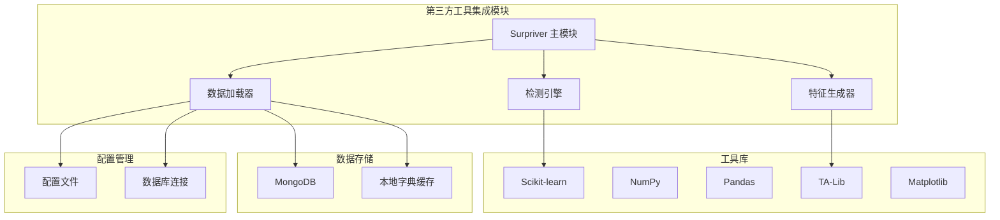
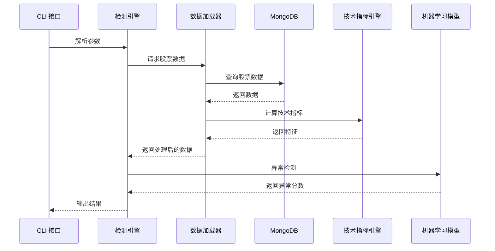
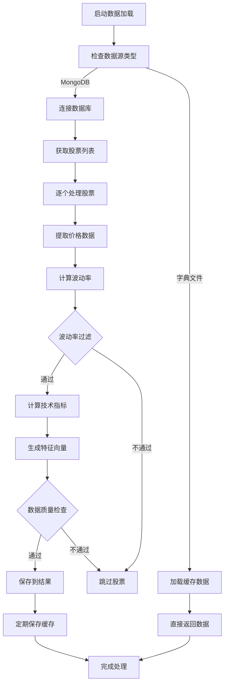
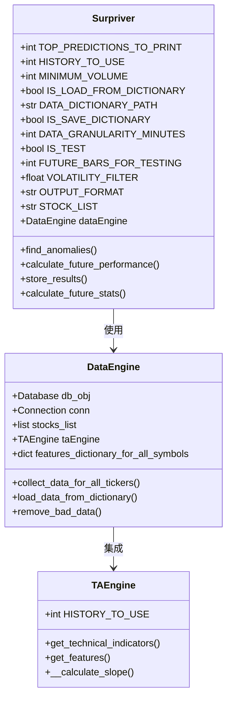
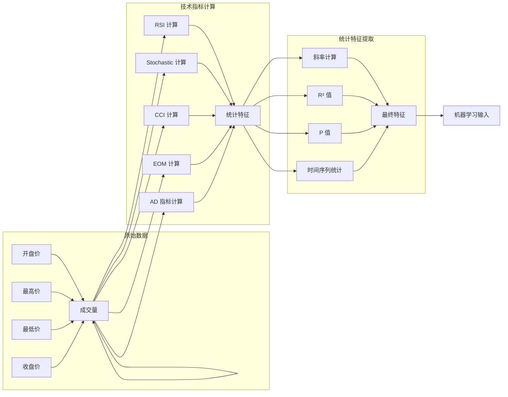
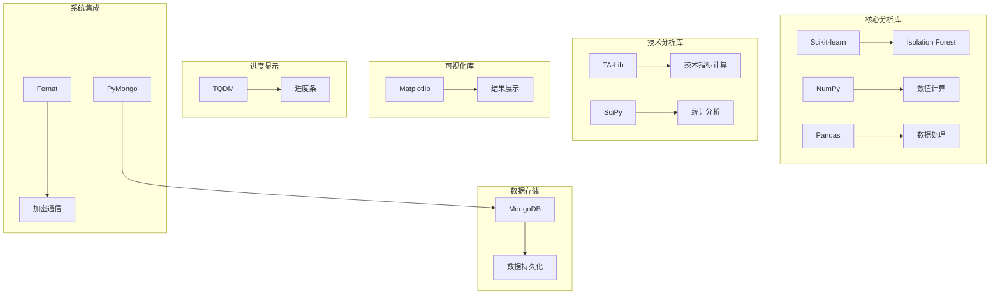

# 第三方工具集成

<cite>
**本文档引用的文件**
- [README.md](file://README.md)
- [library_installation.bat](file://src/ThirdPartyToolSurpriver/library_installation.bat)
- [README.md](file://src/ThirdPartyToolSurpriver/README.md)
- [data_loader.py](file://src/ThirdPartyToolSurpriver/data_loader.py)
- [detection_engine.py](file://src/ThirdPartyToolSurpriver/detection_engine.py)
- [feature_generator.py](file://src/ThirdPartyToolSurpriver/feature_generator.py)
- [config.py](file://src/Utils/config.py)
- [database.py](file://src/Utils/database.py)
- [stocks.txt](file://src/ThirdPartyToolSurpriver/stocks/stocks.txt)
- [ProblemSolve.md](file://ProblemSolve.md)
</cite>

## 目录
1. [简介](#简介)
2. [项目结构](#项目结构)
3. [核心组件](#核心组件)
4. [架构概览](#架构概览)
5. [详细组件分析](#详细组件分析)
6. [依赖分析](#依赖分析)
7. [性能考虑](#性能考虑)
8. [故障排除指南](#故障排除指南)
9. [结论](#结论)
10. [附录](#附录)

## 简介

Surpriver 是一个专门用于发现即将大幅波动的股票的第三方工具集成系统。该工具通过异常检测和机器学习技术，分析成交量和价格行为来识别异常模式，从而预测可能产生大幅波动的股票。该系统集成了多个第三方库，包括 Scikit-learn、NumPy、Pandas、TA-Lib 等，为量化分析提供了完整的工具链支持。

该工具的核心目标是在股票价格真正大幅波动之前，提前发现具有异常特征的股票，为投资者提供决策支持。通过结合技术分析指标和机器学习算法，Surpriver 能够有效地识别市场中的潜在机会。

## 项目结构

项目采用模块化设计，主要分为以下几个核心部分：



**图表来源**
- [data_loader.py:16-66](file://src/ThirdPartyToolSurpriver/data_loader.py#L16-L66)
- [detection_engine.py:158-187](file://src/ThirdPartyToolSurpriver/detection_engine.py#L158-L187)
- [feature_generator.py:11-15](](file://src/ThirdPartyToolSurpriver/feature_generator.py#L11-L15)

**章节来源**
- [README.md:1-33](file://README.md#L1-L33)
- [README.md:5-136](file://src/ThirdPartyToolSurpriver/README.md#L5-L136)

## 核心组件

### 数据加载器 (DataEngine)

数据加载器是整个系统的核心组件之一，负责从 MongoDB 数据库中提取股票数据，并进行预处理和过滤。该组件实现了以下关键功能：

- **多数据源支持**：支持从 MongoDB 和本地字典文件加载数据
- **数据预处理**：清洗和标准化股票价格数据
- **技术指标计算**：集成 TA-Lib 库计算各种技术指标
- **异常值检测**：过滤低波动性和低成交量的股票

### 检测引擎 (Surpriver)

检测引擎是系统的主要分析组件，基于 Isolation Forest 算法进行异常检测。其核心功能包括：

- **异常检测算法**：使用 Isolation Forest 识别异常股票模式
- **批量分析**：支持对大量股票进行并行分析
- **结果输出**：提供 CLI 和 JSON 两种输出格式
- **历史测试**：支持历史回测验证模型有效性

### 特征生成器 (TAEngine)

特征生成器专门负责技术指标的计算和特征提取。它集成了多种技术分析指标：

- **动量指标**：RSI、Stochastic Oscillator
- **趋势指标**：CCI、Accumulation/Distribution
- **成交量指标**：Ease of Movement、Volume Returns
- **价格行为指标**：日对数收益率

**章节来源**
- [data_loader.py:16-293](file://src/ThirdPartyToolSurpriver/data_loader.py#L16-L293)
- [detection_engine.py:158-599](file://src/ThirdPartyToolSurpriver/detection_engine.py#L158-L599)
- [feature_generator.py:11-186](file://src/ThirdPartyToolSurpriver/feature_generator.py#L11-L186)

## 架构概览

系统采用分层架构设计，各组件之间通过清晰的接口进行交互：



**图表来源**
- [detection_engine.py:272-315](file://src/ThirdPartyToolSurpriver/detection_engine.py#L272-L315)
- [data_loader.py:148-224](file://src/ThirdPartyToolSurpriver/data_loader.py#L148-L224)

系统架构的关键特点：

1. **模块化设计**：每个组件都有明确的职责分工
2. **可扩展性**：支持添加新的技术指标和机器学习算法
3. **缓存机制**：通过字典文件实现数据缓存，提高性能
4. **配置驱动**：通过参数控制分析过程和输出格式

## 详细组件分析

### 数据加载器深度分析

数据加载器实现了复杂的数据处理流程：



**图表来源**
- [data_loader.py:148-224](file://src/ThirdPartyToolSurpriver/data_loader.py#L148-L224)
- [data_loader.py:226-261](file://src/ThirdPartyToolSurpriver/data_loader.py#L226-L261)

#### 数据处理流程详解

1. **数据源选择**：根据参数决定从 MongoDB 还是本地字典文件加载数据
2. **股票过滤**：基于波动率阈值过滤低活跃度股票
3. **技术指标计算**：使用 TA-Lib 计算多种技术指标
4. **特征提取**：将技术指标转换为机器学习可用的特征向量
5. **数据验证**：检查特征向量的完整性和有效性

### 检测引擎工作机制

检测引擎的核心算法基于 Isolation Forest 异常检测：



**图表来源**
- [detection_engine.py:158-187](file://src/ThirdPartyToolSurpriver/detection_engine.py#L158-L187)
- [data_loader.py:16-54](file://src/ThirdPartyToolSurpriver/data_loader.py#L16-L54)
- [feature_generator.py:11-15](file://src/ThirdPartyToolSurpriver/feature_generator.py#L11-L15)

#### 异常检测算法实现

检测引擎使用 Isolation Forest 算法进行异常检测：

1. **模型初始化**：创建 Isolation Forest 分类器，设置 200 个估计器
2. **训练过程**：使用特征向量训练异常检测模型
3. **预测阶段**：计算每个股票的异常分数
4. **排序输出**：按异常分数排序，输出前 N 个结果

### 特征生成器设计理念

特征生成器采用了"指标+统计"的混合特征工程方法：



**图表来源**
- [feature_generator.py:31-161](file://src/ThirdPartyToolSurpriver/feature_generator.py#L31-L161)
- [feature_generator.py:164-186](file://src/ThirdPartyToolSurpriver/feature_generator.py#L164-L186)

#### 特征工程方法

特征生成器采用了多层次的特征工程策略：

1. **多时间框架指标**：计算不同窗口大小的技术指标
2. **趋势分析**：通过回归分析计算指标的变化趋势
3. **统计特征**：提取指标的统计学特征（斜率、相关系数等）
4. **组合特征**：将多个指标组合形成复合特征

**章节来源**
- [data_loader.py:86-137](file://src/ThirdPartyToolSurpriver/data_loader.py#L86-L137)
- [detection_engine.py:294-315](file://src/ThirdPartyToolSurpriver/detection_engine.py#L294-L315)
- [feature_generator.py:16-29](file://src/ThirdPartyToolSurpriver/feature_generator.py#L16-L29)

## 依赖分析

系统依赖于多个第三方库，形成了完整的量化分析工具链：



**图表来源**
- [README.md:20-28](file://src/ThirdPartyToolSurpriver/README.md#L20-L28)
- [database.py:5-10](file://src/Utils/database.py#L5-L10)

### 关键依赖库说明

| 依赖库 | 版本要求 | 用途 | 配置方式 |
|--------|----------|------|----------|
| Scikit-learn | >= 0.24.0 | 异常检测算法 | pip install scikit-learn |
| NumPy | >= 1.19.0 | 数值计算 | pip install numpy |
| Pandas | >= 1.2.0 | 数据处理 | pip install pandas |
| TA-Lib | >= 0.4.18 | 技术指标计算 | pip install TA-Lib |
| SciPy | >= 1.6.0 | 统计分析 | pip install scipy |
| Matplotlib | >= 3.3.0 | 结果可视化 | pip install matplotlib |
| PyMongo | >= 3.11.0 | MongoDB 连接 | pip install pymongo |
| TQDM | >= 4.50.0 | 进度显示 | pip install tqdm |

**章节来源**
- [README.md:20-33](file://src/ThirdPartyToolSurpriver/README.md#L20-L33)
- [library_installation.bat:1-4](file://src/ThirdPartyToolSurpriver/library_installation.bat#L1-L4)

## 性能考虑

### 内存优化策略

系统在处理大量股票数据时采用了多种内存优化技术：

1. **增量处理**：数据加载器支持增量处理，避免一次性加载所有数据
2. **字典缓存**：通过 `.npy` 文件缓存中间结果，减少重复计算
3. **数据类型优化**：使用适当的 NumPy 数据类型减少内存占用
4. **垃圾回收**：及时释放不需要的数据对象

### 并行处理能力

检测引擎支持并行处理以提高性能：

- **多进程处理**：可以配置多个进程并行处理不同的股票
- **批处理模式**：支持批量分析大量股票数据
- **异步 I/O**：数据库查询采用异步方式提高响应速度

### 缓存机制

系统实现了多层次的缓存机制：

1. **字典文件缓存**：将处理后的特征数据保存到本地文件
2. **数据库连接池**：复用数据库连接，减少连接开销
3. **模型缓存**：缓存已训练的机器学习模型

## 故障排除指南

### 常见问题及解决方案

#### MongoDB 连接问题

**问题描述**：无法连接到 MongoDB 数据库

**解决方案**：
1. 检查 MongoDB 服务是否正常运行
2. 验证网络连接和防火墙设置
3. 检查认证凭据配置
4. 查看连接超时设置

#### 数据加载失败

**问题描述**：数据加载过程中出现错误

**解决方案**：
1. 验证股票代码列表的正确性
2. 检查数据库中是否存在对应的数据集合
3. 确认数据格式符合预期
4. 检查磁盘空间和权限

#### 内存不足问题

**问题描述**：处理大量数据时出现内存不足

**解决方案**：
1. 减少同时处理的股票数量
2. 增加系统内存或虚拟内存
3. 优化数据处理流程
4. 启用数据分页加载

#### 依赖库安装问题

**问题描述**：第三方库安装失败

**解决方案**：
1. 使用 Python 3.7 或更高版本
2. 确保网络连接正常
3. 尝试使用国内镜像源
4. 检查系统架构兼容性

**章节来源**
- [ProblemSolve.md:18-49](file://ProblemSolve.md#L18-L49)
- [database.py:15-33](file://src/Utils/database.py#L15-L33)

## 结论

Surpriver 第三方工具集成系统通过精心设计的架构和完善的组件实现，成功地将多个第三方库整合到一个统一的量化分析平台中。该系统的主要优势包括：

1. **模块化设计**：清晰的组件分离使得系统易于维护和扩展
2. **高性能处理**：通过缓存机制和并行处理提高系统性能
3. **灵活配置**：丰富的参数配置满足不同用户需求
4. **稳健性**：完善的错误处理和故障恢复机制

该系统为量化分析师和投资者提供了一个强大而易用的工具，能够有效地识别市场中的异常机会。通过持续的优化和扩展，该系统有望成为量化分析领域的重要工具。

## 附录

### 安装配置指南

#### 系统要求

- Python 3.7 或更高版本
- 至少 4GB RAM（建议 8GB 或以上）
- 至少 1GB 可用磁盘空间
- 稳定的网络连接

#### 安装步骤

1. **克隆仓库**：
   ```bash
   git clone <repository-url>
   cd company-news-crawl-and-text-analysis-feat-sentiment-uurls
   ```

2. **安装依赖**：
   ```bash
   pip install -r requirements.txt
   ```

3. **配置数据库**：
   - 启动 MongoDB 服务
   - 创建必要的数据库和集合
   - 配置连接参数

4. **准备股票列表**：
   - 在 `stocks/` 目录下创建股票代码文件
   - 确保股票代码格式正确

#### 环境变量配置

| 环境变量 | 默认值 | 说明 |
|----------|--------|------|
| MONGODB_IP | localhost | MongoDB 服务器地址 |
| MONGODB_PORT | 27017 | MongoDB 端口号 |
| STOCK_DATABASE_NAME | stock | 股票数据数据库名称 |

### 使用示例

#### 基本使用

```bash
python detection_engine.py --top_n 25 --min_volume 5000 --data_granularity_minutes 60 --history_to_use 14
```

#### 历史测试模式

```bash
python detection_engine.py --top_n 25 --is_test 1 --future_bars 25 --history_to_use 14
```

#### 自定义股票列表

```bash
python detection_engine.py --stock_list my_stocks.txt --top_n 50
```

### 扩展接口

#### 添加新的技术指标

要添加新的技术指标，需要修改 `TAEngine` 类：

1. 在 `get_technical_indicators` 方法中添加新指标计算逻辑
2. 在 `get_features` 方法中包含新指标的特征提取
3. 更新相关文档和测试用例

#### 自定义异常检测算法

要实现自定义的异常检测算法：

1. 在检测引擎中创建新的分类器类
2. 实现 `fit` 和 `predict` 方法
3. 集成到现有的分析流程中

#### 数据源扩展

要支持新的数据源：

1. 创建新的数据加载器类
2. 实现数据获取和预处理逻辑
3. 集成到主分析流程中

**章节来源**
- [README.md:44-121](file://src/ThirdPartyToolSurpriver/README.md#L44-L121)
- [config.py:39-47](file://src/Utils/config.py#L39-L47)