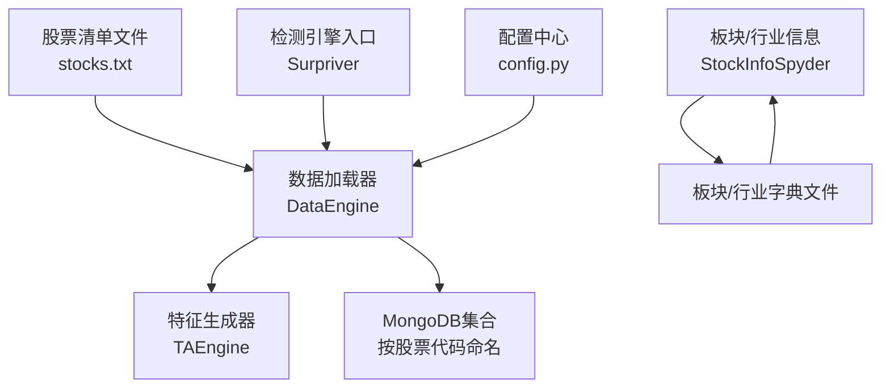
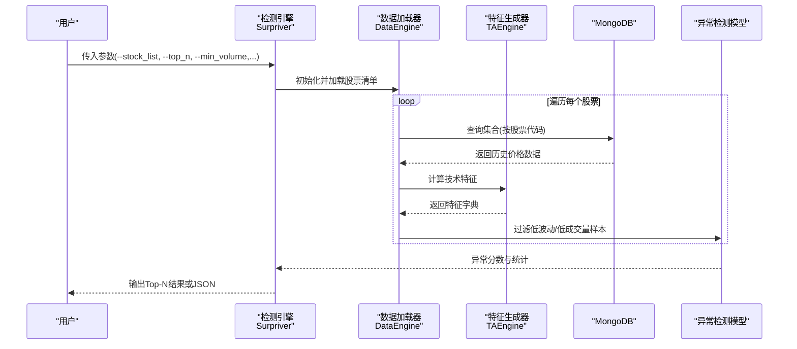
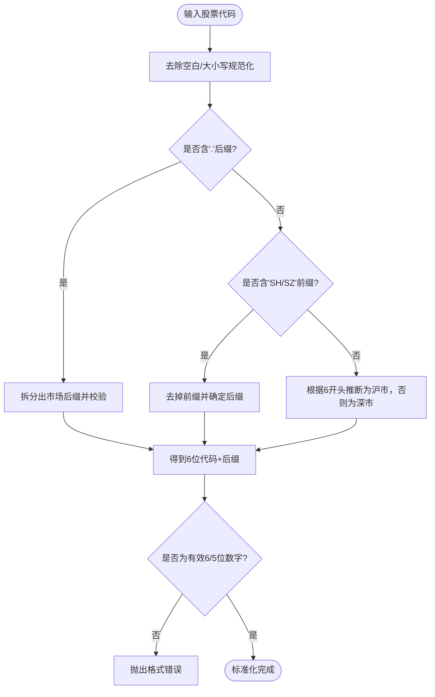
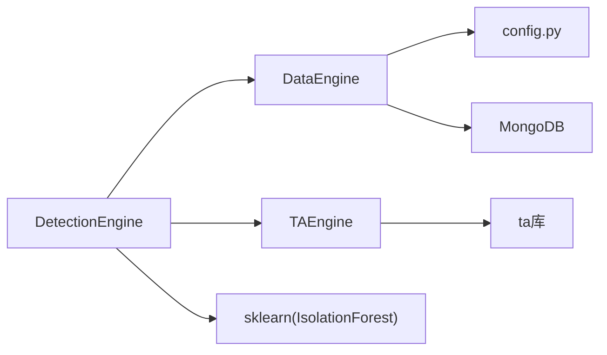

# 股票列表管理

<cite>
**本文引用的文件**
- [src/ThirdPartyToolSurpriver/stocks/stocks.txt](file://src/ThirdPartyToolSurpriver/stocks/stocks.txt)
- [src/ThirdPartyToolSurpriver/data_loader.py](file://src/ThirdPartyToolSurpriver/data_loader.py)
- [src/ThirdPartyToolSurpriver/detection_engine.py](file://src/ThirdPartyToolSurpriver/detection_engine.py)
- [src/ThirdPartyToolSurpriver/feature_generator.py](file://src/ThirdPartyToolSurpriver/feature_generator.py)
- [src/ThirdPartyToolSurpriver/README.md](file://src/ThirdPartyToolSurpriver/README.md)
- [src/Utils/config.py](file://src/Utils/config.py)
- [src/MarketPriceSpiderWithScrapy/StockInfoSpyder.py](file://src/MarketPriceSpiderWithScrapy/StockInfoSpyder.py)
- [src/MassBreak/StockFundamentalIndicators.py](file://src/MassBreak/StockFundamentalIndicators.py)
- [src/MassBreak/MassBreakAndInfosAlphaGo.py](file://src/MassBreak/MassBreakAndInfosAlphaGo.py)
- [src/VnpyBacktesting/prepare_data.py](file://src/VnpyBacktesting/prepare_data.py)
</cite>

## 目录
1. [简介](#简介)
2. [项目结构](#项目结构)
3. [核心组件](#核心组件)
4. [架构总览](#架构总览)
5. [详细组件分析](#详细组件分析)
6. [依赖关系分析](#依赖关系分析)
7. [性能考量](#性能考量)
8. [故障排查指南](#故障排查指南)
9. [结论](#结论)
10. [附录](#附录)

## 简介
本文件面向“股票列表管理”模块，系统化梳理第三方工具surpriver中股票清单的文件格式、命名规范、标准化与验证机制，并给出添加、删除、更新操作方法；解释不同市场与板块的分类管理思路；总结过滤与筛选策略；提供维护最佳实践与更新频率建议；最后说明股票列表与检测引擎的集成方式。

## 项目结构
围绕“股票列表管理”，本仓库的关键位置如下：
- 股票清单文件：ThirdPartyToolSurpriver/stocks/stocks.txt
- 数据加载与特征工程：ThirdPartyToolSurpriver/data_loader.py、ThirdPartyToolSurpriver/feature_generator.py
- 检测引擎入口：ThirdPartyToolSurpriver/detection_engine.py
- 配置与数据库：Utils/config.py
- 市场与板块信息维护：MarketPriceSpiderWithScrapy/StockInfoSpyder.py
- 股票代码标准化与校验：MassBreak/StockFundamentalIndicators.py、MassBreak/MassBreakAndInfosAlphaGo.py、VnpyBacktesting/prepare_data.py

图表来源
- [src/ThirdPartyToolSurpriver/data_loader.py:46-78](file://src/ThirdPartyToolSurpriver/data_loader.py#L46-L78)
- [src/ThirdPartyToolSurpriver/detection_engine.py:176-187](file://src/ThirdPartyToolSurpriver/detection_engine.py#L176-L187)
- [src/ThirdPartyToolSurpriver/feature_generator.py:11-15](file://src/ThirdPartyToolSurpriver/feature_generator.py#L11-L15)
- [src/Utils/config.py:39-53](file://src/Utils/config.py#L39-L53)
- [src/MarketPriceSpiderWithScrapy/StockInfoSpyder.py:98-112](file://src/MarketPriceSpiderWithScrapy/StockInfoSpyder.py#L98-L112)

章节来源
- [src/ThirdPartyToolSurpriver/stocks/stocks.txt:1-4](file://src/ThirdPartyToolSurpriver/stocks/stocks.txt#L1-L4)
- [src/ThirdPartyToolSurpriver/data_loader.py:46-78](file://src/ThirdPartyToolSurpriver/data_loader.py#L46-L78)
- [src/ThirdPartyToolSurpriver/detection_engine.py:176-187](file://src/ThirdPartyToolSurpriver/detection_engine.py#L176-L187)
- [src/Utils/config.py:39-53](file://src/Utils/config.py#L39-L53)

## 核心组件
- 股票清单文件：位于ThirdPartyToolSurpriver/stocks/，默认文件名为stocks.txt，每行一个股票代码，支持去重与排序。
- 数据加载器DataEngine：负责从MongoDB读取股票数据，执行波动率与成交量过滤，生成特征字典。
- 特征生成器TAEngine：基于价格与成交量序列提取RSI、Stoch、CCI、EOM、日对数收益等特征。
- 检测引擎Surpriver：封装参数校验、异常检测与结果输出，串联DataEngine与TAEngine。
- 配置中心config：定义数据库名、集合名、板块/行业字典路径等。
- 板块/行业维护：通过StockInfoSpyder定期更新概念与行业字段，供后续筛选使用。

章节来源
- [src/ThirdPartyToolSurpriver/data_loader.py:16-66](file://src/ThirdPartyToolSurpriver/data_loader.py#L16-L66)
- [src/ThirdPartyToolSurpriver/feature_generator.py:11-186](file://src/ThirdPartyToolSurpriver/feature_generator.py#L11-L186)
- [src/ThirdPartyToolSurpriver/detection_engine.py:158-599](file://src/ThirdPartyToolSurpriver/detection_engine.py#L158-L599)
- [src/Utils/config.py:39-53](file://src/Utils/config.py#L39-L53)
- [src/MarketPriceSpiderWithScrapy/StockInfoSpyder.py:98-177](file://src/MarketPriceSpiderWithScrapy/StockInfoSpyder.py#L98-L177)

## 架构总览
检测引擎以“股票清单文件”为输入，DataEngine按清单逐个读取MongoDB集合，TAEngine生成特征，IsolationForest进行异常检测，最终输出Top-N候选。

图表来源
- [src/ThirdPartyToolSurpriver/detection_engine.py:272-427](file://src/ThirdPartyToolSurpriver/detection_engine.py#L272-L427)
- [src/ThirdPartyToolSurpriver/data_loader.py:148-224](file://src/ThirdPartyToolSurpriver/data_loader.py#L148-L224)
- [src/ThirdPartyToolSurpriver/feature_generator.py:31-161](file://src/ThirdPartyToolSurpriver/feature_generator.py#L31-L161)

## 详细组件分析

### 股票清单文件格式与命名规则
- 文件位置：ThirdPartyToolSurpriver/stocks/stocks.txt
- 格式要求：
  - 每行一个股票代码，去除换行符后作为原始符号。
  - 读取后进行去重与排序，确保唯一性与稳定顺序。
- 命名规则：
  - 默认文件名为stocks.txt；可通过命令行参数--stock_list指定其他文件名。
  - 参数校验会检查该文件在stocks目录下是否存在。

章节来源
- [src/ThirdPartyToolSurpriver/stocks/stocks.txt:1-4](file://src/ThirdPartyToolSurpriver/stocks/stocks.txt#L1-L4)
- [src/ThirdPartyToolSurpriver/data_loader.py:46-78](file://src/ThirdPartyToolSurpriver/data_loader.py#L46-L78)
- [src/ThirdPartyToolSurpriver/detection_engine.py:153-155](file://src/ThirdPartyToolSurpriver/detection_engine.py#L153-L155)

### 股票代码标准化与验证机制
- 标准化目标：
  - 统一6位数字代码，去除市场前缀(sh/sz)或后缀(.SH/.SZ)，并推断市场类型。
- 关键实现点：
  - MassBreak/StockFundamentalIndicators.py：提供normalize_stock_code，支持“sh600938”、“sz000547”、“600938”、“600938.SH”等输入，输出(6位代码, 市场后缀)。
  - MassBreak/MassBreakAndInfosAlphaGo.py：对A股代码使用正则过滤非个股标的，避免指数等无效标的进入分析池。
  - VnpyBacktesting/prepare_data.py：对A股代码进行zfill(6)补齐，对港股进行zfill(5)补齐，统一长度与格式。
- 验证要点：
  - 非法格式直接抛错或跳过，保证后续流程稳定性。
  - 建议在写入清单前先做标准化与校验，避免重复与歧义。

图表来源
- [src/MassBreak/StockFundamentalIndicators.py:10-34](file://src/MassBreak/StockFundamentalIndicators.py#L10-L34)
- [src/MassBreak/MassBreakAndInfosAlphaGo.py:128-140](file://src/MassBreak/MassBreakAndInfosAlphaGo.py#L128-L140)
- [src/VnpyBacktesting/prepare_data.py:107-117](file://src/VnpyBacktesting/prepare_data.py#L107-L117)

章节来源
- [src/MassBreak/StockFundamentalIndicators.py:10-34](file://src/MassBreak/StockFundamentalIndicators.py#L10-L34)
- [src/MassBreak/MassBreakAndInfosAlphaGo.py:128-140](file://src/MassBreak/MassBreakAndInfosAlphaGo.py#L128-L140)
- [src/VnpyBacktesting/prepare_data.py:107-117](file://src/VnpyBacktesting/prepare_data.py#L107-L117)

### 股票列表的添加、删除与更新
- 添加：
  - 将新代码追加到stocks.txt，建议先进行标准化与校验，再保存。
  - 重新运行检测引擎，DataEngine会自动读取新清单。
- 删除：
  - 直接从stocks.txt移除对应行，保存后即可生效。
- 更新：
  - 可通过命令行参数--stock_list切换至其他清单文件，实现多套策略的快速切换。
  - 若需批量更新，可结合板块/行业字典文件，先在StockInfoSpyder中维护概念/行业字段，再在上层筛选逻辑中使用。

章节来源
- [src/ThirdPartyToolSurpriver/detection_engine.py:93-97](file://src/ThirdPartyToolSurpriver/detection_engine.py#L93-L97)
- [src/ThirdPartyToolSurpriver/data_loader.py:46-78](file://src/ThirdPartyToolSurpriver/data_loader.py#L46-L78)

### 不同市场与板块的分类管理
- 市场维度：
  - A股：通过6位代码与市场后缀识别；支持sh/sz前缀或.SH/.SZ后缀。
  - 港股：通过5位代码与SEHK交换标识；支持HK前缀或zfill(5)补齐。
  - 美股：通过独立数据库与集合管理，概念/行业信息由外部工具维护。
- 板块/行业维度：
  - 通过StockInfoSpyder定期抓取并写入概念/行业字段，生成cn_stock_concept_dict_file.txt与cn_stock_industry_dict_file.txt。
  - 上层筛选可基于这些字段进行过滤，例如排除指数类标的。

章节来源
- [src/MarketPriceSpiderWithScrapy/StockInfoSpyder.py:98-177](file://src/MarketPriceSpiderWithScrapy/StockInfoSpyder.py#L98-L177)
- [src/Utils/config.py:52-53](file://src/Utils/config.py#L52-L53)
- [src/MassBreak/MassBreakAndInfosAlphaGo.py:128-140](file://src/MassBreak/MassBreakAndInfosAlphaGo.py#L128-L140)

### 股票数据的过滤与筛选策略
- 数据质量过滤：
  - 波动率阈值：剔除历史波动过低的样本。
  - 成交量阈值：剔除近期平均成交量过低的样本。
  - 缺失值处理：移除特征列表存在NaN的样本。
- 时间窗口与粒度：
  - 历史窗口(history_to_use)与数据粒度(data_granularity_minutes)影响特征生成与检测效果。
- 结果筛选：
  - Top-N输出；测试模式下可计算未来绝对涨跌幅与波动率，辅助评估异常分数的有效性。

章节来源
- [src/ThirdPartyToolSurpriver/data_loader.py:167-201](file://src/ThirdPartyToolSurpriver/data_loader.py#L167-L201)
- [src/ThirdPartyToolSurpriver/feature_generator.py:163-186](file://src/ThirdPartyToolSurpriver/feature_generator.py#L163-L186)
- [src/ThirdPartyToolSurpriver/detection_engine.py:294-323](file://src/ThirdPartyToolSurpriver/detection_engine.py#L294-L323)

### 股票列表与检测引擎的集成方式
- 参数驱动：
  - --stock_list：指定stocks目录下的清单文件名，默认stocks.txt。
  - --top_n：输出Top-N异常股票。
  - --min_volume、--volatility_filter：设置成交量与波动率阈值。
  - --history_to_use、--data_granularity_minutes：控制特征窗口与粒度。
- 运行流程：
  - ArgChecker校验参数与清单文件存在性。
  - Surpriver初始化DataEngine与TAEngine。
  - DataEngine按清单读取MongoDB集合，生成特征字典。
  - Surpriver调用IsolationForest进行异常检测并输出结果。

章节来源
- [src/ThirdPartyToolSurpriver/detection_engine.py:24-98](file://src/ThirdPartyToolSurpriver/detection_engine.py#L24-L98)
- [src/ThirdPartyToolSurpriver/detection_engine.py:121-156](file://src/ThirdPartyToolSurpriver/detection_engine.py#L121-L156)
- [src/ThirdPartyToolSurpriver/detection_engine.py:272-427](file://src/ThirdPartyToolSurpriver/detection_engine.py#L272-L427)

## 依赖关系分析
- 外部依赖：
  - MongoDB：按股票代码命名集合存储历史价格数据。
  - 技术分析库：ta库用于RSI、Stoch、CCI、EOM等指标计算。
  - 机器学习库：sklearn IsolationForest用于异常检测。
- 内部耦合：
  - DetectionEngine依赖DataEngine与TAEngine。
  - DataEngine依赖配置中心与数据库工具。
  - 板块/行业信息由StockInfoSpyder维护，供上层筛选使用。

图表来源
- [src/ThirdPartyToolSurpriver/detection_engine.py:176-187](file://src/ThirdPartyToolSurpriver/detection_engine.py#L176-L187)
- [src/ThirdPartyToolSurpriver/data_loader.py:31-34](file://src/ThirdPartyToolSurpriver/data_loader.py#L31-L34)
- [src/ThirdPartyToolSurpriver/feature_generator.py:2-6](file://src/ThirdPartyToolSurpriver/feature_generator.py#L2-L6)

章节来源
- [src/ThirdPartyToolSurpriver/detection_engine.py:176-187](file://src/ThirdPartyToolSurpriver/detection_engine.py#L176-L187)
- [src/ThirdPartyToolSurpriver/data_loader.py:31-34](file://src/ThirdPartyToolSurpriver/data_loader.py#L31-L34)
- [src/ThirdPartyToolSurpriver/feature_generator.py:2-6](file://src/ThirdPartyToolSurpriver/feature_generator.py#L2-L6)

## 性能考量
- 数据加载：
  - 对每个股票读取完整历史数据，建议在MongoDB建立索引以提升查询效率。
  - 可考虑分批加载与缓存特征字典，减少重复计算。
- 特征计算：
  - 技术指标计算复杂度与历史窗口成正比，合理设置history_to_use。
- 异常检测：
  - IsolationForest训练与预测开销与样本数量相关，建议先做数据质量过滤。

## 故障排查指南
- 清单文件不存在：
  - 症状：参数校验阶段直接退出。
  - 处理：确认--stock_list指向的文件存在于stocks目录。
- 股票代码格式错误：
  - 症状：标准化/补齐失败或正则过滤导致样本缺失。
  - 处理：在写入清单前统一为6位数字或明确市场后缀。
- 数据不足：
  - 症状：波动率计算或特征生成失败。
  - 处理：延长历史窗口或调整阈值；检查MongoDB集合是否存在。
- 输出格式问题：
  - 症状：--output_format非法。
  - 处理：仅允许CLI或JSON。

章节来源
- [src/ThirdPartyToolSurpriver/detection_engine.py:133-155](file://src/ThirdPartyToolSurpriver/detection_engine.py#L133-L155)
- [src/ThirdPartyToolSurpriver/data_loader.py:96-137](file://src/ThirdPartyToolSurpriver/data_loader.py#L96-L137)
- [src/ThirdPartyToolSurpriver/feature_generator.py:163-186](file://src/ThirdPartyToolSurpriver/feature_generator.py#L163-L186)

## 结论
本模块通过“标准化的股票代码 + 规范化的清单文件 + 完整的数据加载与特征工程 + 严谨的过滤与异常检测”，实现了可维护、可扩展的股票列表管理与检测流程。建议在日常维护中坚持“先标准化、后写入、再验证”的原则，并结合板块/行业信息与历史窗口参数，持续优化筛选策略与更新频率。

## 附录
- 常用命令参考（来自README）
  - 直接预测今日Top-N异常股票
  - 历史回测模式
  - 指定其他清单文件(--stock_list)

章节来源
- [src/ThirdPartyToolSurpriver/README.md:44-121](file://src/ThirdPartyToolSurpriver/README.md#L44-L121)