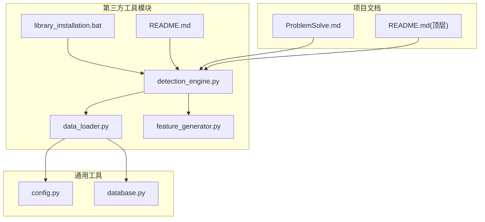
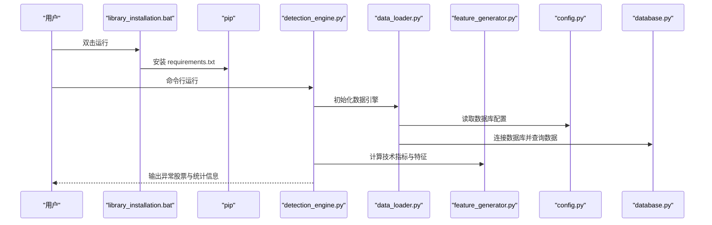
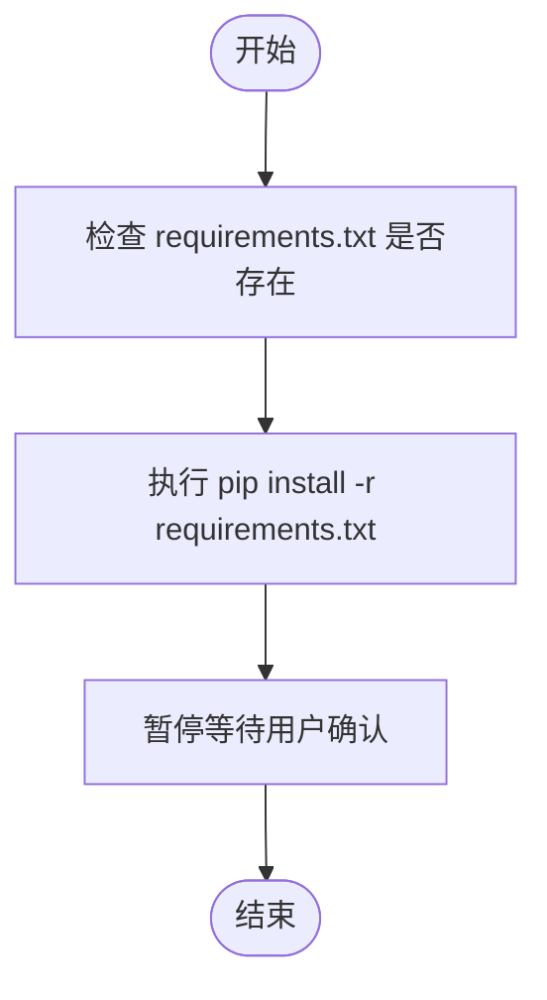
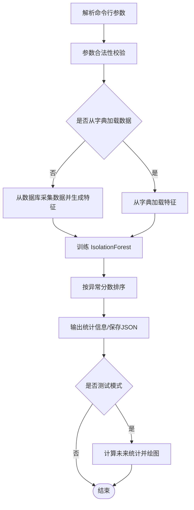
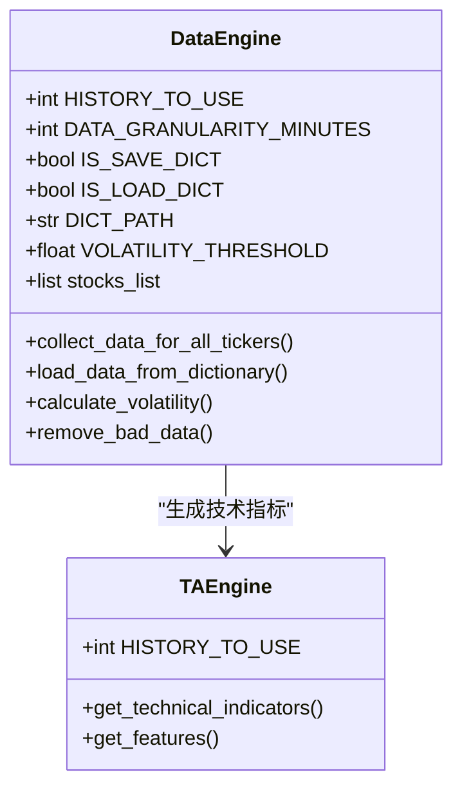
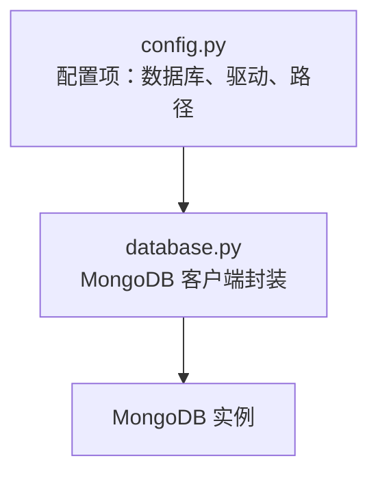
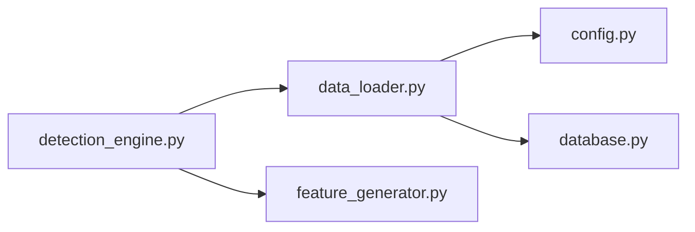

# 配置与环境设置

<cite>
**本文引用的文件**
- [library_installation.bat](file://src/ThirdPartyToolSurpriver/library_installation.bat)
- [README.md](file://src/ThirdPartyToolSurpriver/README.md)
- [detection_engine.py](file://src/ThirdPartyToolSurpriver/detection_engine.py)
- [data_loader.py](file://src/ThirdPartyToolSurpriver/data_loader.py)
- [feature_generator.py](file://src/ThirdPartyToolSurpriver/feature_generator.py)
- [config.py](file://src/Utils/config.py)
- [database.py](file://src/Utils/database.py)
- [ProblemSolve.md](file://ProblemSolve.md)
- [README.md](file://README.md)
</cite>

## 目录
1. [简介](#简介)
2. [项目结构](#项目结构)
3. [核心组件](#核心组件)
4. [架构总览](#架构总览)
5. [详细组件分析](#详细组件分析)
6. [依赖分析](#依赖分析)
7. [性能考虑](#性能考虑)
8. [故障排除指南](#故障排除指南)
9. [结论](#结论)
10. [附录](#附录)

## 简介
本指南面向需要在本地或容器环境中部署“Surpriver”第三方工具的用户，提供从 Python 环境配置、依赖安装、Docker 容器化部署到运行参数与环境变量的完整说明。文档同时覆盖跨平台兼容性与系统要求，并给出常见安装问题的排查建议。

## 项目结构
Surpriver 工具位于 ThirdPartyToolSurpriver 目录下，主要由以下模块组成：
- 启动与依赖安装：library_installation.bat
- 运行入口与参数解析：detection_engine.py
- 数据加载与预处理：data_loader.py
- 技术指标与特征生成：feature_generator.py
- 配置与数据库连接：config.py、database.py
- 使用说明与示例：README.md
- 常见问题与排错：ProblemSolve.md
- 顶层项目说明：README.md

图表来源
- [library_installation.bat:1-4](file://src/ThirdPartyToolSurpriver/library_installation.bat#L1-L4)
- [detection_engine.py:1-599](file://src/ThirdPartyToolSurpriver/detection_engine.py#L1-L599)
- [data_loader.py:1-293](file://src/ThirdPartyToolSurpriver/data_loader.py#L1-L293)
- [feature_generator.py:1-186](file://src/ThirdPartyToolSurpriver/feature_generator.py#L1-L186)
- [config.py:1-455](file://src/Utils/config.py#L1-L455)
- [database.py:1-176](file://src/Utils/database.py#L1-L176)
- [README.md:1-136](file://src/ThirdPartyToolSurpriver/README.md#L1-L136)
- [ProblemSolve.md:1-68](file://ProblemSolve.md#L1-L68)
- [README.md:1-33](file://README.md#L1-L33)

章节来源
- [README.md:1-136](file://src/ThirdPartyToolSurpriver/README.md#L1-L136)
- [README.md:1-33](file://README.md#L1-L33)

## 核心组件
- 依赖安装脚本：通过 Windows 批处理调用 pip，从 requirements.txt 安装所需包。
- 运行引擎：解析命令行参数，加载数据，训练异常检测模型，输出预测结果。
- 数据引擎：从 MongoDB 加载历史价格与交易量数据，生成特征字典。
- 特征引擎：基于 ta 库计算技术指标，提取用于异常检测的特征向量。
- 配置与数据库：集中管理数据库地址、端口、驱动路径等配置项。

章节来源
- [library_installation.bat:1-4](file://src/ThirdPartyToolSurpriver/library_installation.bat#L1-L4)
- [detection_engine.py:1-599](file://src/ThirdPartyToolSurpriver/detection_engine.py#L1-L599)
- [data_loader.py:1-293](file://src/ThirdPartyToolSurpriver/data_loader.py#L1-L293)
- [feature_generator.py:1-186](file://src/ThirdPartyToolSurpriver/feature_generator.py#L1-L186)
- [config.py:1-455](file://src/Utils/config.py#L1-L455)
- [database.py:1-176](file://src/Utils/database.py#L1-L176)

## 架构总览
下图展示了从启动脚本到运行引擎的整体流程，以及数据与配置的交互关系。

图表来源
- [library_installation.bat:1-4](file://src/ThirdPartyToolSurpriver/library_installation.bat#L1-L4)
- [detection_engine.py:1-599](file://src/ThirdPartyToolSurpriver/detection_engine.py#L1-L599)
- [data_loader.py:1-293](file://src/ThirdPartyToolSurpriver/data_loader.py#L1-L293)
- [feature_generator.py:1-186](file://src/ThirdPartyToolSurpriver/feature_generator.py#L1-L186)
- [config.py:1-455](file://src/Utils/config.py#L1-L455)
- [database.py:1-176](file://src/Utils/database.py#L1-L176)

## 详细组件分析

### 依赖安装脚本：library_installation.bat
- 功能：静默执行 pip 安装，从当前目录的 requirements.txt 安装依赖，完成后暂停以便查看输出。
- 适用场景：Windows 环境快速安装依赖。
- 注意事项：需确保已安装 Python 与 pip，并在同目录下存在 requirements.txt。

图表来源
- [library_installation.bat:1-4](file://src/ThirdPartyToolSurpriver/library_installation.bat#L1-L4)

章节来源
- [library_installation.bat:1-4](file://src/ThirdPartyToolSurpriver/library_installation.bat#L1-L4)

### 运行引擎：detection_engine.py
- 参数解析：支持 top_n、min_volume、history_to_use、data_granularity_minutes、is_load_from_dictionary、data_dictionary_path、is_save_dictionary、is_test、future_bars、volatility_filter、output_format、stock_list 等。
- 校验逻辑：对时间粒度、测试参数、输出格式、股票列表文件进行校验。
- 主流程：根据是否加载字典决定从数据库采集数据或从字典加载；训练 IsolationForest 异常检测模型；输出前 N 个异常股票及其统计信息；可选保存结果为 JSON 并绘制未来表现散点图。

图表来源
- [detection_engine.py:1-599](file://src/ThirdPartyToolSurpriver/detection_engine.py#L1-L599)

章节来源
- [detection_engine.py:1-599](file://src/ThirdPartyToolSurpriver/detection_engine.py#L1-L599)

### 数据引擎：data_loader.py
- 职责：从 MongoDB 读取股票历史 OHLCV 数据，过滤低波动与低成交量股票，生成技术指标字典，构建特征矩阵。
- 关键点：支持测试模式截取未来一段时间用于回测；可按需保存/加载特征字典以提升效率；内置体积与波动率过滤。

图表来源
- [data_loader.py:1-293](file://src/ThirdPartyToolSurpriver/data_loader.py#L1-L293)
- [feature_generator.py:1-186](file://src/ThirdPartyToolSurpriver/feature_generator.py#L1-L186)

章节来源
- [data_loader.py:1-293](file://src/ThirdPartyToolSurpriver/data_loader.py#L1-L293)
- [feature_generator.py:1-186](file://src/ThirdPartyToolSurpriver/feature_generator.py#L1-L186)

### 配置与数据库：config.py、database.py
- config.py：定义数据库 IP/端口、ChromeDriver 路径、停用词与模型路径、数据库名称等；根据操作系统类型设置 GPU 模式与驱动路径。
- database.py：封装 MongoDB 连接、查询、插入、更新等操作，提供自动重连装饰器，增强稳定性。

图表来源
- [config.py:1-455](file://src/Utils/config.py#L1-L455)
- [database.py:1-176](file://src/Utils/database.py#L1-L176)

章节来源
- [config.py:1-455](file://src/Utils/config.py#L1-L455)
- [database.py:1-176](file://src/Utils/database.py#L1-L176)

## 依赖分析
- 第三方工具模块内部依赖关系清晰：运行引擎依赖数据引擎与特征引擎；数据引擎依赖配置与数据库模块。
- 外部依赖：ta、scipy、sklearn、numpy、pandas、matplotlib、tqdm 等，详见 README 的包清单与安装说明。

图表来源
- [detection_engine.py:1-599](file://src/ThirdPartyToolSurpriver/detection_engine.py#L1-L599)
- [data_loader.py:1-293](file://src/ThirdPartyToolSurpriver/data_loader.py#L1-L293)
- [feature_generator.py:1-186](file://src/ThirdPartyToolSurpriver/feature_generator.py#L1-L186)
- [config.py:1-455](file://src/Utils/config.py#L1-L455)
- [database.py:1-176](file://src/Utils/database.py#L1-L176)

章节来源
- [README.md:19-33](file://src/ThirdPartyToolSurpriver/README.md#L19-L33)

## 性能考虑
- 特征生成与模型训练：建议在具备足够内存的环境中运行，避免大规模数据导致内存不足。
- 数据缓存：优先使用特征字典进行复用，减少重复下载与计算。
- 可视化：测试模式下的绘图会占用额外资源，仅在需要时启用。
- 数据库连接：database.py 提供自动重连机制，建议合理设置超时与连接池大小。

[本节为通用指导，无需列出具体文件来源]

## 故障排除指南
- MongoDB 连接失败或文件句柄过多
  - 可参考系统限制调整 maxfiles，或检查服务状态与防火墙设置。
- pip 安装依赖失败
  - 确认网络可达与镜像源可用；必要时手动安装特定版本或离线包。
- ChromeDriver 权限问题
  - 确保可执行权限正确，或在 config.py 中修正驱动路径。
- Matplotlib 字体显示异常
  - 按照 ProblemSolve.md 中的指引修改字体目录与配置文件。
- macOS 平台编译依赖
  - 按照 config.py 注释提示安装 clang 或相应工具链。

章节来源
- [ProblemSolve.md:1-68](file://ProblemSolve.md#L1-L68)
- [config.py:1-455](file://src/Utils/config.py#L1-L455)

## 结论
通过本指南，您可以在本地或容器环境中完成 Surpriver 工具的环境准备与运行。建议优先使用 requirements.txt 统一安装依赖，结合特征字典提升运行效率，并在测试模式下验证模型效果。遇到问题时，可依据故障排除章节逐步定位与解决。

[本节为总结性内容，无需列出具体文件来源]

## 附录

### Python 环境配置与包管理最佳实践
- 使用虚拟环境隔离依赖，避免全局污染。
- 使用 requirements.txt 统一声明依赖与版本，便于复现。
- 定期更新 pip 与 setuptools，确保安装过程稳定。
- 对于编译型依赖，提前安装对应系统工具链（如 macOS 的 Xcode Command Line Tools）。

[本节为通用指导，无需列出具体文件来源]

### Docker 容器化部署方案与步骤
- 使用 README.md 中提供的 docker build 与 docker-compose 指令进行容器化。
- 将宿主机目录映射到容器内，确保数据字典与股票列表文件可访问。
- 在容器内执行 detection_engine.py 的命令行参数，注意路径与权限。

章节来源
- [README.md:35-42](file://src/ThirdPartyToolSurpriver/README.md#L35-L42)

### requirements.txt 依赖项与版本要求说明
- 包清单与安装方式请参阅 README 的“Packages”与“pip install -r requirements.txt”说明。
- 若未提供精确版本号，请在生产环境中锁定关键包版本，以保证一致性。

章节来源
- [README.md:19-33](file://src/ThirdPartyToolSurpriver/README.md#L19-L33)

### 环境变量与路径设置
- 数据库与驱动路径：在 config.py 中集中配置，按操作系统类型自动切换。
- 特征字典与股票列表：默认路径在 detection_engine.py 中定义，可在运行时通过参数覆盖。
- ChromeDriver：根据操作系统类型在 config.py 中设置路径。

章节来源
- [config.py:1-455](file://src/Utils/config.py#L1-L455)
- [detection_engine.py:1-599](file://src/ThirdPartyToolSurpriver/detection_engine.py#L1-L599)

### 常见安装问题与解决方案
- Homebrew 相关：若安装失败，可参考 ProblemSolve.md 中的安装/卸载脚本与常用命令。
- MongoDB 与 Redis：按文档指引安装服务并启动，检查端口与权限。
- pip 包安装：对于特殊包，可采用直接下载安装的方式。
- Matplotlib 字体：按指引修改字体目录与配置文件。

章节来源
- [ProblemSolve.md:1-68](file://ProblemSolve.md#L1-L68)

### 跨平台兼容性与系统要求
- Windows：使用 library_installation.bat 安装依赖；确保 Python 与 pip 可用。
- macOS：按 config.py 注释安装 clang；注意 ChromeDriver 路径与权限。
- Linux：按 README 的 docker 方案部署，或自行安装依赖。

章节来源
- [config.py:1-455](file://src/Utils/config.py#L1-L455)
- [README.md:35-42](file://src/ThirdPartyToolSurpriver/README.md#L35-L42)
- [README.md:1-33](file://README.md#L1-L33)