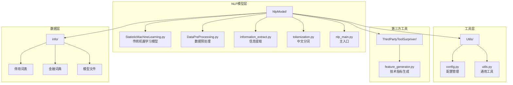
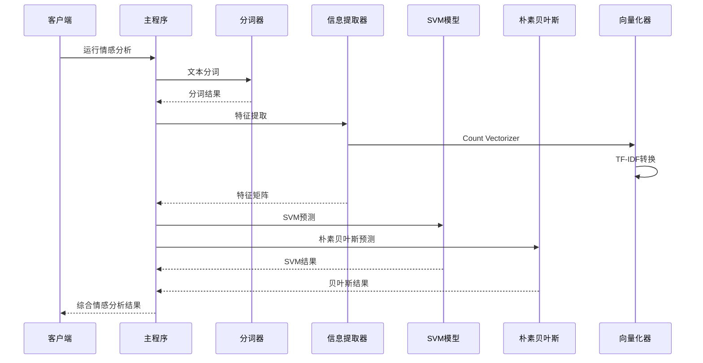
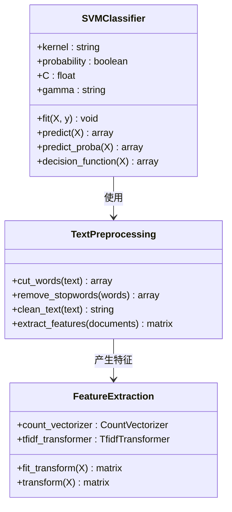
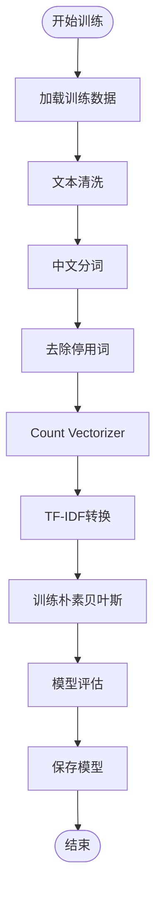
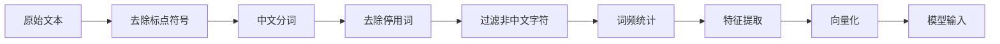
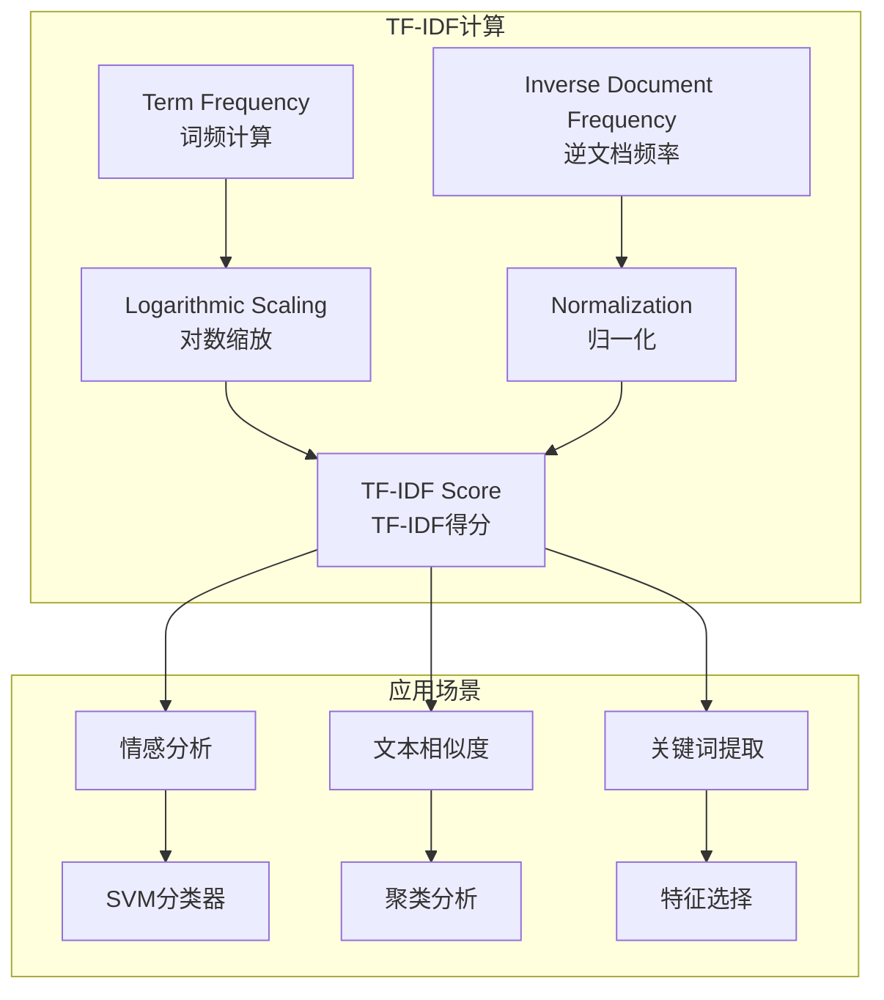
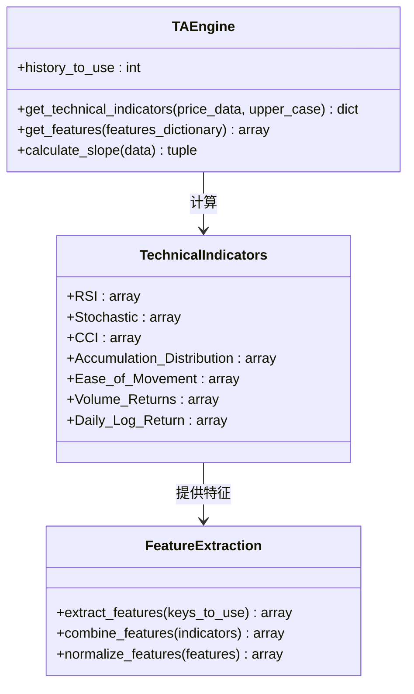
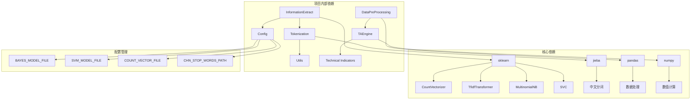

# 传统机器学习模型

<cite>
**本文档引用的文件**
- [StatisticMachineLearning.py](file://src/NlpModel/StatisticMachineLearning.py)
- [DataPreProcessing.py](file://src/NlpModel/DataPreProcessing.py)
- [information_extract.py](file://src/NlpModel/information_extract.py)
- [tokenization.py](file://src/NlpModel/tokenization.py)
- [nlp_main.py](file://src/NlpModel/nlp_main.py)
- [config.py](file://src/Utils/config.py)
- [feature_generator.py](file://src/ThirdPartyToolSurpriver/feature_generator.py)
- [utils.py](file://src/Utils/utils.py)
- [README.md](file://README.md)
</cite>

## 目录
1. [简介](#简介)
2. [项目结构](#项目结构)
3. [核心组件](#核心组件)
4. [架构概览](#架构概览)
5. [详细组件分析](#详细组件分析)
6. [依赖关系分析](#依赖关系分析)
7. [性能考虑](#性能考虑)
8. [故障排除指南](#故障排除指南)
9. [结论](#结论)

## 简介

本项目专注于传统机器学习模型在情感分析中的应用，特别是统计机器学习方法。项目实现了多种经典算法，包括支持向量机(SVM)、朴素贝叶斯分类器，以及集成学习方法如XGBoost和LightGBM。系统采用完整的数据预处理流水线，从文本清洗、特征工程到向量化处理，为金融新闻的情感分析提供了端到端的解决方案。

该项目特别针对中文金融新闻文本，结合了中文分词技术、停用词过滤、TF-IDF特征提取等关键技术，形成了一个完整的传统机器学习情感分析系统。

## 项目结构

项目采用模块化的组织方式，主要分为以下几个核心模块：

**图表来源**
- [nlp_main.py:1-70](file://src/NlpModel/nlp_main.py#L1-L70)
- [config.py:1-455](file://src/Utils/config.py#L1-L455)

**章节来源**
- [README.md:1-33](file://README.md#L1-L33)
- [config.py:29-38](file://src/Utils/config.py#L29-L38)

## 核心组件

### 传统机器学习模型

项目实现了多种传统机器学习算法，主要用于情感分析任务：

1. **支持向量机(SVM)**：使用线性核函数进行二分类情感分析
2. **朴素贝叶斯分类器**：基于多项式分布的文本分类算法
3. **XGBoost**：梯度提升决策树算法
4. **LightGBM**：基于决策树的学习框架

### 数据预处理管道

系统提供了完整的数据预处理流水线：

1. **文本清洗**：去除特殊字符、数字、英文等无关内容
2. **中文分词**：使用jieba和pkuseg分词器
3. **特征工程**：从文本中提取情感词汇特征
4. **向量化**：Count Vectorizer和TF-IDF转换

### 技术指标生成

对于股票价格数据，系统还实现了技术分析指标生成：

- RSI相对强弱指数
- Stochastic震荡指标  
- CCI商品通道指数
- 成交量相关指标
- 日对数收益率

**章节来源**
- [StatisticMachineLearning.py:7-161](file://src/NlpModel/StatisticMachineLearning.py#L7-L161)
- [information_extract.py:26-424](file://src/NlpModel/information_extract.py#L26-L424)
- [DataPreProcessing.py:17-304](file://src/NlpModel/DataPreProcessing.py#L17-L304)

## 架构概览

系统采用分层架构设计，确保各组件职责清晰、耦合度低：

**图表来源**
- [nlp_main.py:17-70](file://src/NlpModel/nlp_main.py#L17-L70)
- [information_extract.py:260-338](file://src/NlpModel/information_extract.py#L260-L338)

## 详细组件分析

### 支持向量机(SVM)实现

SVM是项目中最核心的传统机器学习算法之一，专门用于情感分析任务：

#### 核心实现特点

**图表来源**
- [information_extract.py:332-338](file://src/NlpModel/information_extract.py#L332-L338)
- [tokenization.py:77-103](file://src/NlpModel/tokenization.py#L77-L103)

#### 参数调优策略

SVM的关键参数包括：
- **C参数**：控制正则化强度，防止过拟合
- **kernel函数**：线性核适合高维稀疏数据
- **概率输出**：启用概率预测以获得置信度

**章节来源**
- [information_extract.py:332-338](file://src/NlpModel/information_extract.py#L332-L338)

### 朴素贝叶斯模型

朴素贝叶斯分类器在文本分类任务中表现出色，特别适合高维稀疏的文本特征：

#### 实现细节

**图表来源**
- [information_extract.py:260-338](file://src/NlpModel/information_extract.py#L260-L338)

#### 优势特点

1. **快速训练**：朴素贝叶斯算法训练速度快
2. **内存效率**：适合大规模文本数据
3. **多语言支持**：天然支持中文文本处理
4. **概率输出**：提供预测置信度

**章节来源**
- [information_extract.py:314-330](file://src/NlpModel/information_extract.py#L314-L330)

### 数据预处理流水线

系统实现了完整的文本预处理流水线，确保输入数据的质量：

#### 预处理步骤

**图表来源**
- [tokenization.py:77-103](file://src/NlpModel/tokenization.py#L77-L103)

#### 关键技术

1. **中文分词**：支持jieba和pkuseg两种分词器
2. **停用词过滤**：使用多套停用词表
3. **自定义词典**：金融领域专用词汇
4. **文本清洗**：去除HTML标签、特殊字符等

**章节来源**
- [tokenization.py:11-103](file://src/NlpModel/tokenization.py#L11-L103)
- [utils.py:171-186](file://src/Utils/utils.py#L171-L186)

### TF-IDF特征提取

TF-IDF是文本挖掘中的经典特征提取方法，在项目中得到了广泛应用：

#### 技术原理

**图表来源**
- [information_extract.py:294-311](file://src/NlpModel/information_extract.py#L294-L311)

#### 实现特点

1. **动态词典**：根据训练数据构建词汇表
2. **阈值过滤**：过滤低频和高频词汇
3. **概率输出**：支持概率预测
4. **模型持久化**：保存向量化器以便后续使用

**章节来源**
- [information_extract.py:294-311](file://src/NlpModel/information_extract.py#L294-L311)

### 技术指标生成引擎

对于股票价格数据，系统实现了专业的技术分析指标生成：

#### 指标类型

**图表来源**
- [feature_generator.py:11-186](file://src/ThirdPartyToolSurpriver/feature_generator.py#L11-L186)

#### 指标计算

系统实现了以下技术指标：
- **RSI相对强弱指数**：5, 10, 15周期
- **Stochastic震荡指标**：5, 10, 15周期
- **CCI商品通道指数**：5, 10, 20周期
- **成交量指标**：EOM、成交量回报率
- **趋势指标**：日对数收益率、斜率分析

**章节来源**
- [feature_generator.py:31-161](file://src/ThirdPartyToolSurpriver/feature_generator.py#L31-L161)

## 依赖关系分析

系统采用了清晰的模块化设计，各组件之间的依赖关系如下：

**图表来源**
- [information_extract.py:5-16](file://src/NlpModel/information_extract.py#L5-L16)
- [config.py:30-37](file://src/Utils/config.py#L30-L37)

**章节来源**
- [config.py:30-37](file://src/Utils/config.py#L30-L37)
- [information_extract.py:5-16](file://src/NlpModel/information_extract.py#L5-L16)

## 性能考虑

### 训练性能优化

1. **特征维度控制**：通过CountVectorizer的max_df参数过滤高频词汇
2. **内存管理**：使用稀疏矩阵存储TF-IDF特征
3. **并行处理**：利用多核CPU加速模型训练
4. **缓存机制**：模型和向量化器的持久化存储

### 推理性能优化

1. **模型压缩**：保存训练好的模型文件
2. **向量化器复用**：避免重复构建词汇表
3. **批量处理**：支持批量文本情感分析
4. **内存优化**：合理控制文本长度和特征数量

### 算法复杂度分析

- **SVM训练复杂度**：O(n²)到O(n³)，其中n为样本数
- **朴素贝叶斯训练复杂度**：O(V×C)，V为词汇表大小，C为类别数
- **TF-IDF计算复杂度**：O(D×V)，D为文档数，V为词汇表大小
- **特征提取复杂度**：O(T×W)，T为文本长度，W为词汇匹配

## 故障排除指南

### 常见问题及解决方案

#### 1. 中文分词问题

**问题描述**：中文分词结果不准确或报错

**解决方案**：
- 检查自定义词典路径配置
- 验证停用词文件编码格式
- 确认jieba分词器版本兼容性

#### 2. 模型加载失败

**问题描述**：无法加载保存的模型文件

**解决方案**：
- 检查模型文件路径和权限
- 验证pickle文件完整性
- 确认Python版本和依赖包版本一致

#### 3. 内存不足错误

**问题描述**：训练过程中出现内存溢出

**解决方案**：
- 减少特征维度（max_df参数）
- 降低CountVectorizer的词汇表大小
- 使用更高效的特征选择方法

#### 4. 性能问题

**问题描述**：模型训练或推理速度慢

**解决方案**：
- 启用并行处理（n_jobs参数）
- 使用更高效的向量化器
- 优化特征工程流程

**章节来源**
- [information_extract.py:97-107](file://src/NlpModel/information_extract.py#L97-L107)
- [config.py:30-37](file://src/Utils/config.py#L30-L37)

## 结论

本项目成功实现了传统机器学习在情感分析领域的完整解决方案。通过结合SVM、朴素贝叶斯等经典算法与现代文本处理技术，系统在中文金融新闻情感分析任务中展现了良好的性能。

### 主要成就

1. **完整的预处理流水线**：从文本清洗到特征向量化的一站式解决方案
2. **多算法对比**：同时实现SVM和朴素贝叶斯，便于算法选择和比较
3. **中文优化**：专门针对中文文本的特点进行了优化
4. **可扩展性**：模块化设计便于功能扩展和维护

### 应用价值

- **金融新闻监控**：实时分析新闻情感，辅助投资决策
- **市场情绪分析**：监测市场整体情绪变化
- **风险预警**：识别潜在的负面新闻信号
- **内容质量评估**：自动评估新闻内容的重要性

### 未来发展

1. **深度学习集成**：结合传统方法与深度学习的优势
2. **多模态融合**：结合文本、价格、成交量等多源信息
3. **实时处理**：优化流式数据处理能力
4. **模型在线学习**：支持模型的持续更新和优化