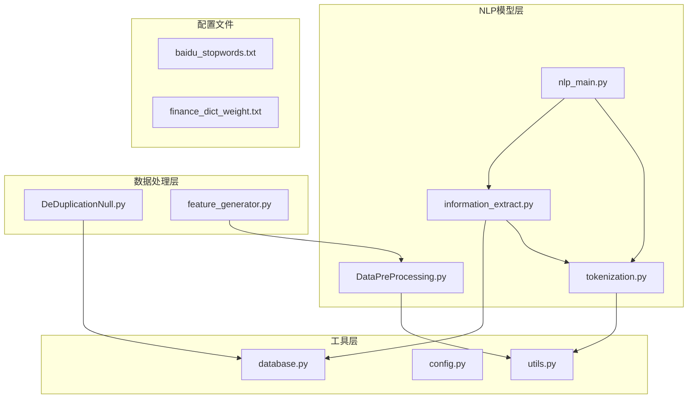
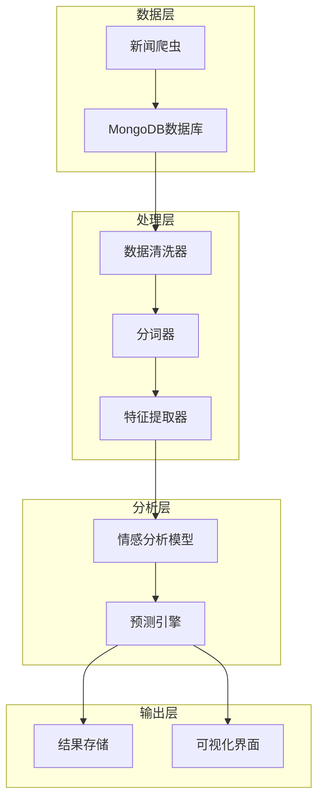
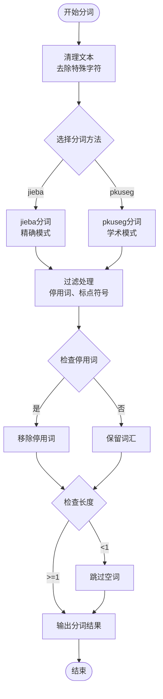
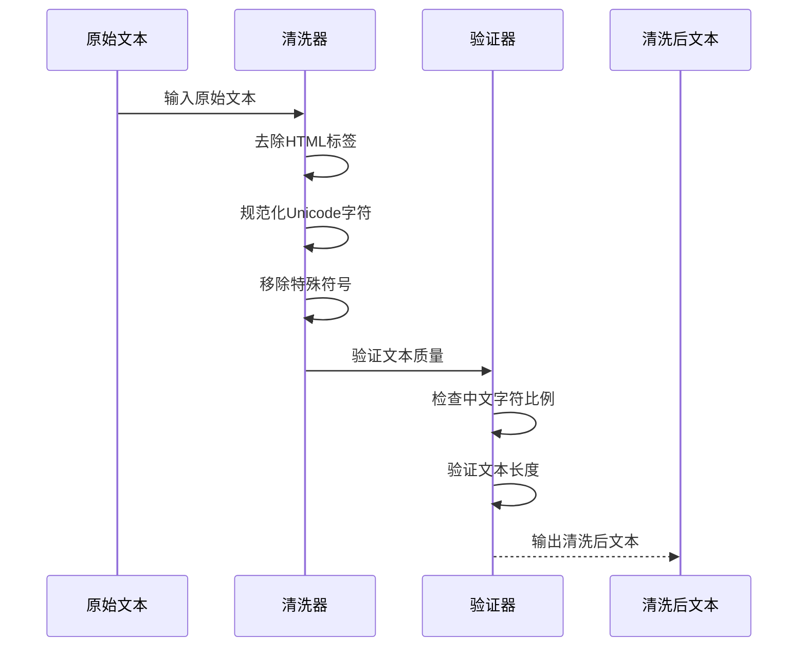
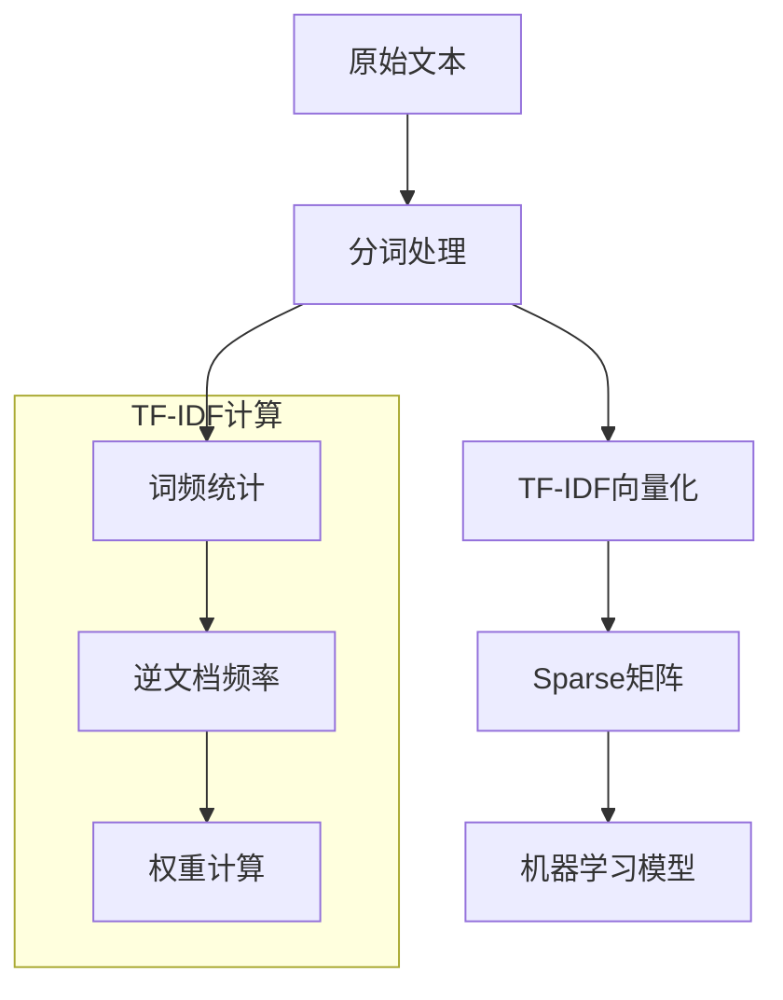
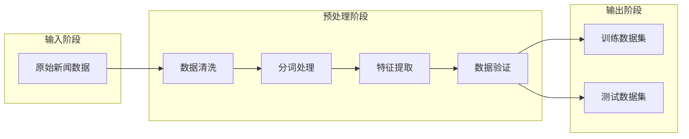
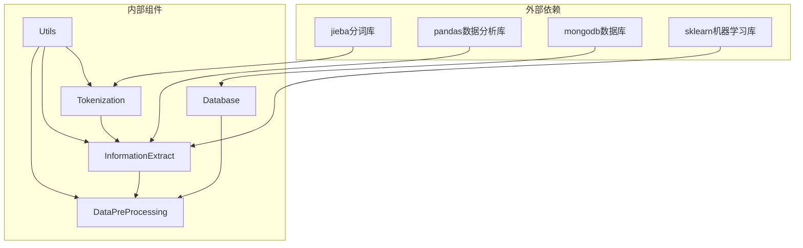

# 文本预处理流程

<cite>
**本文档引用的文件**
- [DataPreProcessing.py](file://src/NlpModel/DataPreProcessing.py)
- [tokenization.py](file://src/NlpModel/tokenization.py)
- [information_extract.py](file://src/NlpModel/information_extract.py)
- [nlp_main.py](file://src/NlpModel/nlp_main.py)
- [DeDuplicationNull.py](file://src/MongoDbComTools/DeDuplicationNull.py)
- [utils.py](file://src/Utils/utils.py)
- [config.py](file://src/Utils/config.py)
- [database.py](file://src/Utils/database.py)
- [feature_generator.py](file://src/ThirdPartyToolSurpriver/feature_generator.py)
- [baidu_stopwords.txt](file://src/info/stopwords/baidu_stopwords.txt)
- [finance_dict_weight.txt](file://src/info/finance_dict_weight.txt)
</cite>

## 目录
1. [简介](#简介)
2. [项目结构](#项目结构)
3. [核心组件](#核心组件)
4. [架构概览](#架构概览)
5. [详细组件分析](#详细组件分析)
6. [依赖关系分析](#依赖关系分析)
7. [性能考虑](#性能考虑)
8. [故障排除指南](#故障排除指南)
9. [结论](#结论)

## 简介

本文档详细介绍了新闻文本从原始状态到可分析状态的完整处理流程。该项目专注于中文新闻文本的情感分析和特征提取，涵盖了从数据爬取、预处理、分词、特征提取到最终建模的完整流水线。

该系统采用模块化设计，主要包含以下核心功能：
- 新闻文本的清洗和标准化
- 中文分词算法的实现和优化
- 特征提取和向量化技术
- 数据预处理管道的设计
- 性能优化和内存管理策略

## 项目结构

项目采用分层架构设计，主要目录结构如下：

**图表来源**
- [DataPreProcessing.py:1-304](file://src/NlpModel/DataPreProcessing.py#L1-L304)
- [tokenization.py:1-169](file://src/NlpModel/tokenization.py#L1-L169)
- [information_extract.py:1-424](file://src/NlpModel/information_extract.py#L1-L424)

**章节来源**
- [DataPreProcessing.py:1-304](file://src/NlpModel/DataPreProcessing.py#L1-L304)
- [tokenization.py:1-169](file://src/NlpModel/tokenization.py#L1-L169)
- [information_extract.py:1-424](file://src/NlpModel/information_extract.py#L1-L424)

## 核心组件

### 数据预处理管道

数据预处理管道是整个系统的核心，负责将原始新闻数据转换为机器学习模型可用的格式。主要组件包括：

1. **数据清洗器**：去除噪声、标准化格式
2. **分词器**：中文分词算法实现
3. **特征提取器**：文本特征向量化
4. **数据验证器**：确保数据质量

### 分词算法实现

系统实现了多种分词算法，支持不同的分词策略：

- **jieba分词**：基于精确模式的中文分词
- **pkuseg分词**：北京大学分词工具
- **自定义词典**：支持金融领域专业词汇

### 特征提取技术

系统集成了多种特征提取方法：

- **统计特征**：词频统计、情感词典匹配
- **机器学习特征**：TF-IDF向量化
- **技术指标特征**：基于股价数据的技术分析指标

**章节来源**
- [tokenization.py:11-103](file://src/NlpModel/tokenization.py#L11-L103)
- [information_extract.py:26-60](file://src/NlpModel/information_extract.py#L26-L60)
- [feature_generator.py:11-186](file://src/ThirdPartyToolSurpriver/feature_generator.py#L11-L186)

## 架构概览

系统采用分层架构，各层职责明确：

**图表来源**
- [DataPreProcessing.py:17-32](file://src/NlpModel/DataPreProcessing.py#L17-L32)
- [tokenization.py:11-24](file://src/NlpModel/tokenization.py#L11-L24)
- [information_extract.py:26-57](file://src/NlpModel/information_extract.py#L26-L57)

## 详细组件分析

### 分词器组件

分词器是文本预处理的核心组件，实现了完整的中文分词流程：

#### 分词算法原理

**图表来源**
- [tokenization.py:77-103](file://src/NlpModel/tokenization.py#L77-L103)

#### 分词性能优化

系统采用了多项性能优化策略：

1. **缓存机制**：用户自定义词典加载后缓存
2. **批量处理**：支持批量文本分词处理
3. **内存管理**：及时释放中间变量内存
4. **算法选择**：根据文本特点选择最优分词方法

**章节来源**
- [tokenization.py:11-103](file://src/NlpModel/tokenization.py#L11-L103)

### 数据清洗组件

数据清洗组件负责处理新闻文本中的噪声和异常值：

#### 清洗流程

**图表来源**
- [DeDuplicationNull.py:22-62](file://src/MongoDbComTools/DeDuplicationNull.py#L22-L62)

#### 清洗技术详解

系统实现了三种主要的清洗技术：

1. **去重处理**：基于URL的重复内容检测
2. **空值处理**：删除包含空值的记录
3. **时间修正**：修正未来日期的异常数据

**章节来源**
- [DeDuplicationNull.py:15-88](file://src/MongoDbComTools/DeDuplicationNull.py#L15-L88)

### 特征提取组件

特征提取组件将文本转换为数值向量，供机器学习模型使用：

#### 向量化流程

**图表来源**
- [information_extract.py:294-311](file://src/NlpModel/information_extract.py#L294-L311)

#### 特征类型

系统支持多种特征类型：

1. **词袋模型特征**：基于词汇频率的简单特征
2. **TF-IDF特征**：考虑词汇重要性的高级特征
3. **情感词典特征**：基于预定义情感词典的特征
4. **技术指标特征**：结合股价数据的技术分析特征

**章节来源**
- [information_extract.py:294-338](file://src/NlpModel/information_extract.py#L294-L338)
- [feature_generator.py:31-161](file://src/ThirdPartyToolSurpriver/feature_generator.py#L31-L161)

### 数据预处理管道

数据预处理管道整合了所有预处理步骤，形成完整的数据处理流水线：

#### 管道设计

**图表来源**
- [DataPreProcessing.py:119-301](file://src/NlpModel/DataPreProcessing.py#L119-L301)

#### 管道优化

系统在管道设计中考虑了以下优化策略：

1. **并行处理**：多个数据源的并行处理
2. **增量更新**：支持增量数据的处理
3. **内存优化**：大数据集的内存管理
4. **错误恢复**：处理过程中的错误恢复机制

**章节来源**
- [DataPreProcessing.py:17-32](file://src/NlpModel/DataPreProcessing.py#L17-L32)

## 依赖关系分析

系统各组件之间的依赖关系如下：

**图表来源**
- [tokenization.py:1-10](file://src/NlpModel/tokenization.py#L1-L10)
- [information_extract.py:1-16](file://src/NlpModel/information_extract.py#L1-L16)
- [DataPreProcessing.py:1-12](file://src/NlpModel/DataPreProcessing.py#L1-L12)

**章节来源**
- [config.py:1-455](file://src/Utils/config.py#L1-L455)
- [database.py:1-176](file://src/Utils/database.py#L1-L176)

## 性能考虑

### 内存管理优化

系统在内存管理方面采用了多项优化策略：

1. **流式处理**：大数据集的流式读取和处理
2. **垃圾回收**：及时释放不再使用的对象
3. **数据类型优化**：使用高效的数据类型存储
4. **缓存策略**：合理使用缓存减少重复计算

### 并行处理优化

系统支持多线程和多进程并行处理：

1. **分词并行化**：多个文本的并行分词处理
2. **特征提取并行化**：多个样本的并行特征提取
3. **数据加载并行化**：数据库查询的并行执行

### 缓存机制

系统实现了多层次的缓存机制：

1. **词典缓存**：分词词典的内存缓存
2. **模型缓存**：训练好的机器学习模型缓存
3. **中间结果缓存**：预处理中间结果的缓存

## 故障排除指南

### 常见问题及解决方案

#### 分词失败问题

**问题描述**：分词过程中出现异常或分词结果不准确

**解决方案**：
1. 检查输入文本的编码格式
2. 验证分词词典文件的完整性
3. 调整分词参数设置

#### 内存不足问题

**问题描述**：处理大数据集时出现内存溢出

**解决方案**：
1. 使用流式处理替代一次性加载
2. 增加虚拟内存配置
3. 优化数据结构存储

#### 性能问题

**问题描述**：预处理速度过慢影响整体效率

**解决方案**：
1. 启用并行处理机制
2. 优化算法实现
3. 使用更高效的存储格式

**章节来源**
- [utils.py:18-27](file://src/Utils/utils.py#L18-L27)
- [database.py:15-33](file://src/Utils/database.py#L15-L33)

## 结论

本文档详细介绍了新闻文本预处理系统的完整实现。该系统通过模块化的架构设计，实现了从原始文本到可分析数据的完整转换流程。

### 主要优势

1. **模块化设计**：各组件职责明确，易于维护和扩展
2. **性能优化**：采用多种优化策略提升处理效率
3. **内存管理**：合理的内存使用策略适应大数据处理需求
4. **错误处理**：完善的错误处理和恢复机制

### 应用价值

该预处理系统为新闻文本的情感分析提供了高质量的数据基础，能够有效支持：
- 股票价格预测
- 市场情绪分析
- 投资决策支持
- 风险评估

通过持续的优化和改进，该系统能够适应不断变化的业务需求和技术环境。