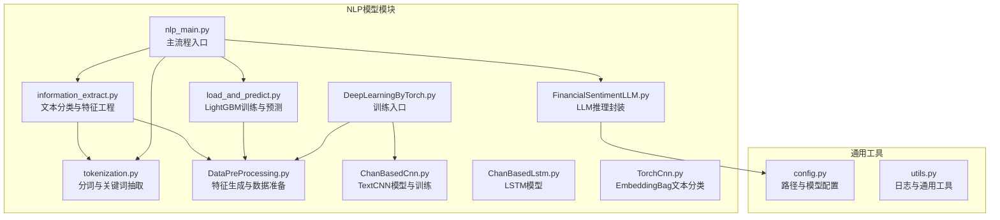
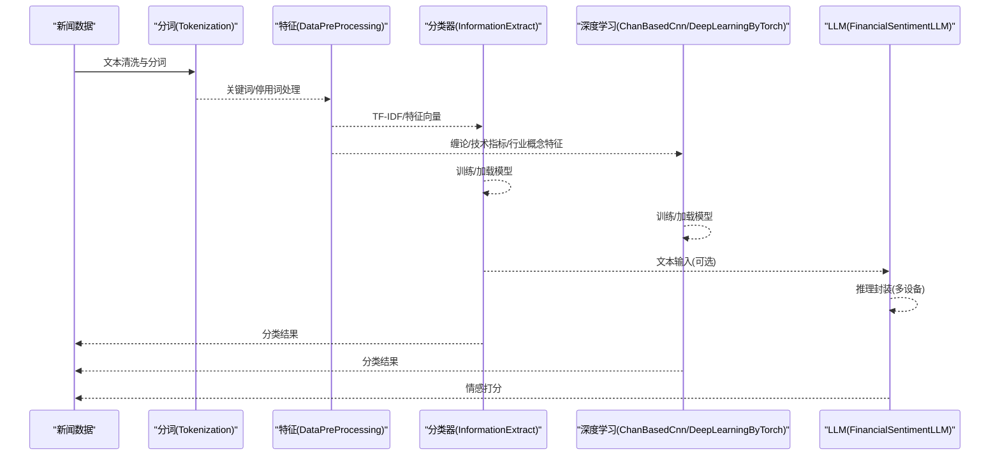
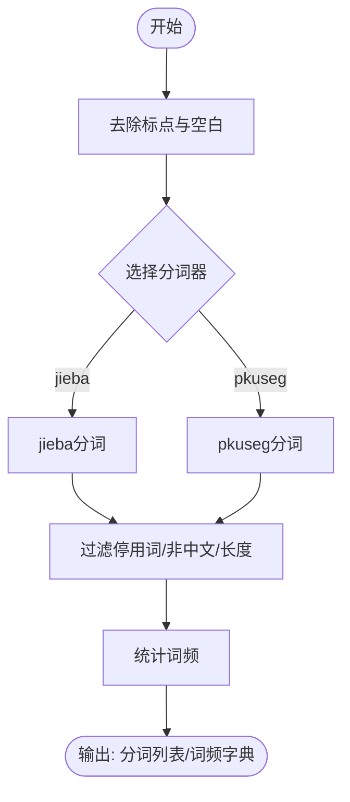
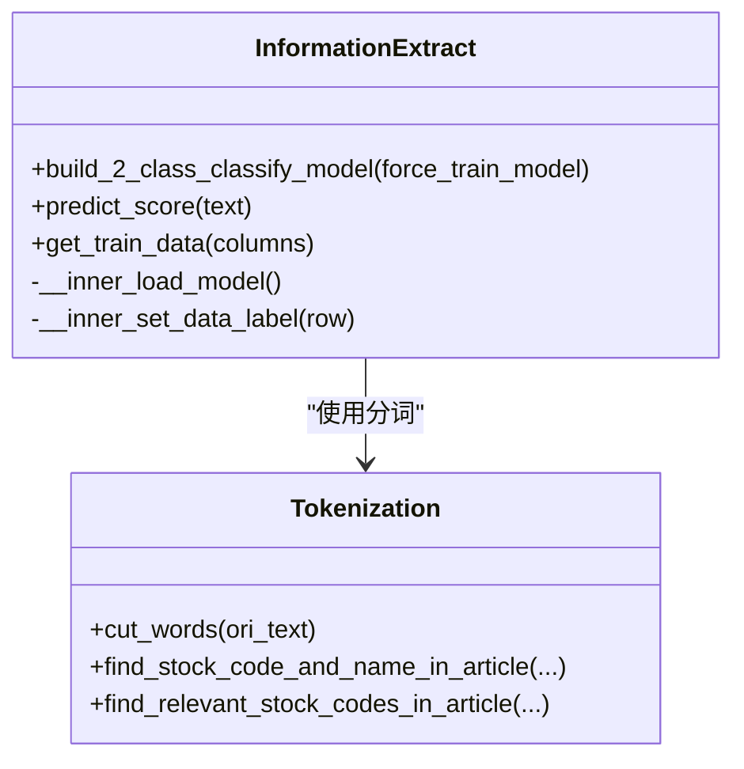
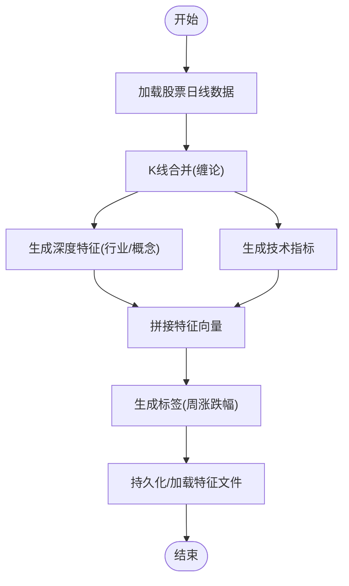
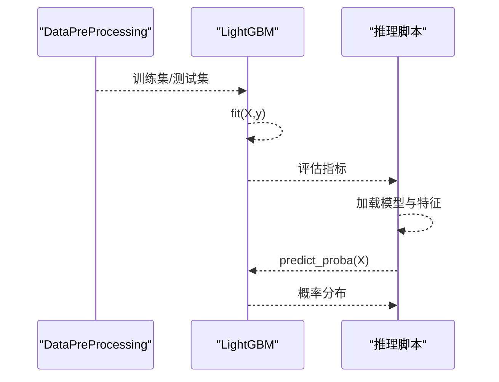
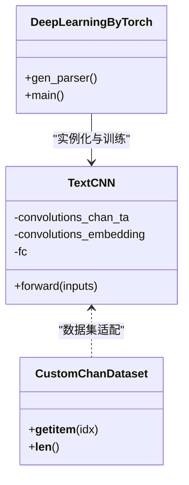
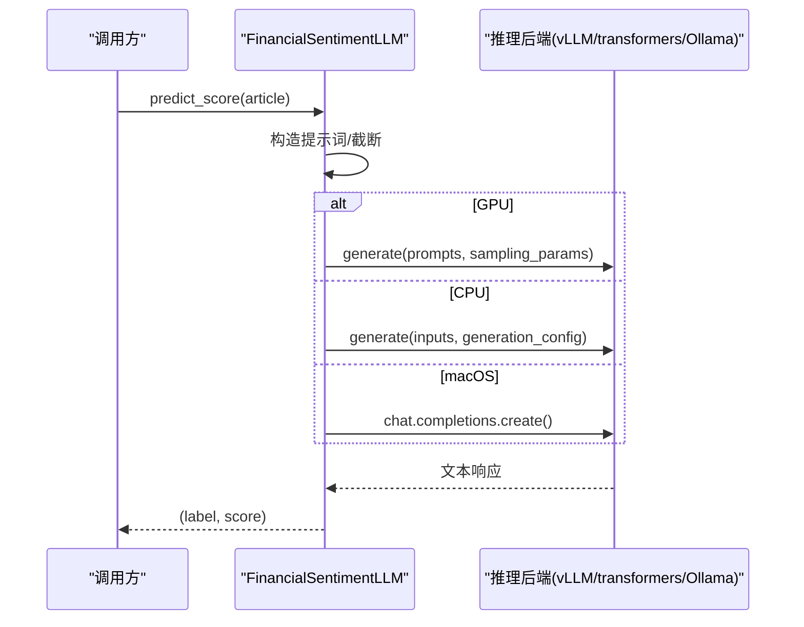
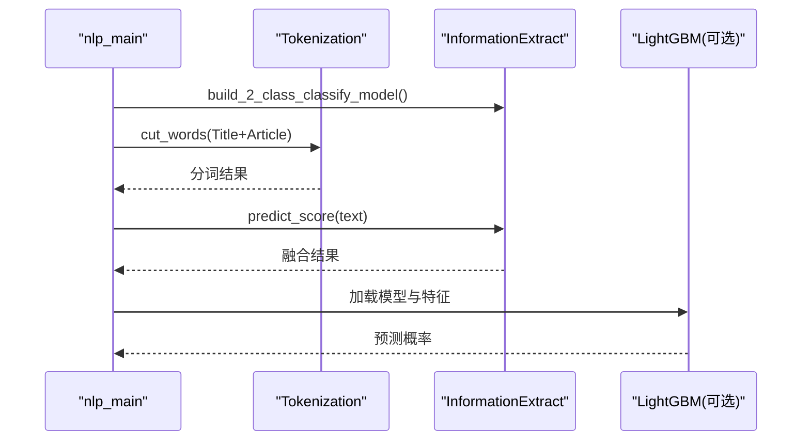
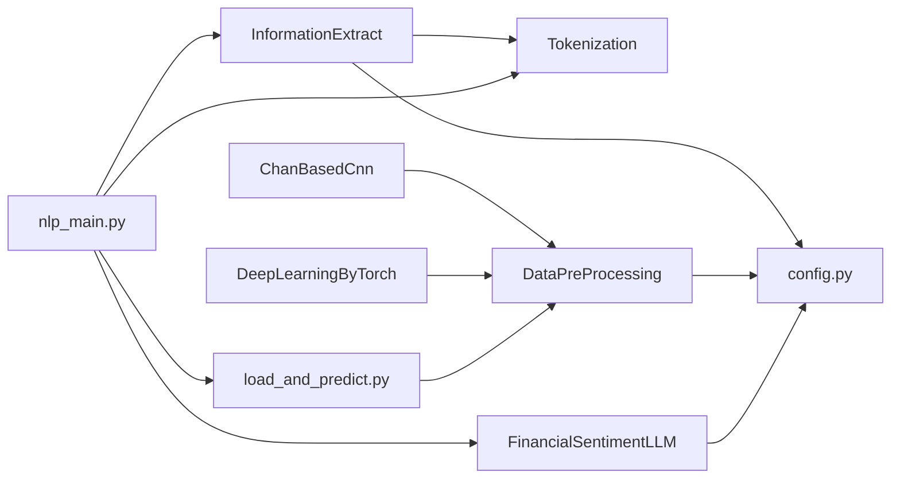

# 模型集成与部署

<cite>
**本文引用的文件**   
- [nlp_main.py](file://src/NlpModel/nlp_main.py)
- [information_extract.py](file://src/NlpModel/information_extract.py)
- [tokenization.py](file://src/NlpModel/tokenization.py)
- [load_and_predict.py](file://src/NlpModel/load_and_predict.py)
- [DataPreProcessing.py](file://src/NlpModel/DataPreProcessing.py)
- [FinancialSentimentLLM.py](file://src/NlpModel/FinancialSentimentLLM.py)
- [ChanBasedCnn.py](file://src/NlpModel/ChanBasedCnn.py)
- [ChanBasedLstm.py](file://src/NlpModel/ChanBasedLstm.py)
- [TorchCnn.py](file://src/NlpModel/TorchCnn.py)
- [DeepLearningByTorch.py](file://src/NlpModel/DeepLearningByTorch.py)
- [config.py](file://src/Utils/config.py)
- [utils.py](file://src/Utils/utils.py)
- [README.md](file://README.md)
</cite>

## 目录
1. [引言](#引言)
2. [项目结构](#项目结构)
3. [核心组件](#核心组件)
4. [架构总览](#架构总览)
5. [详细组件分析](#详细组件分析)
6. [依赖分析](#依赖分析)
7. [性能考虑](#性能考虑)
8. [故障排除指南](#故障排除指南)
9. [结论](#结论)
10. [附录](#附录)

## 引言
本文件面向模型集成与部署场景，系统性梳理仓库中已实现的多种NLP与深度学习模型，覆盖文本预处理、特征工程、传统机器学习分类器、深度学习CNN/LSTM模型、以及大语言模型（LLM）的推理封装。文档重点阐述：
- 多模型协同工作机制与选择策略
- 模型保存、加载与推理优化
- 批量处理与实时预测的实现思路
- 性能监控与质量评估方法
- 版本管理与A/B测试策略
- 更新与维护最佳实践
- 部署示例与故障排除

## 项目结构
项目采用按功能域划分的模块化组织方式，NLP相关逻辑集中在 src/NlpModel 下，通用配置与工具位于 src/Utils。整体结构如下图所示：

**图表来源**
- [nlp_main.py:1-70](file://src/NlpModel/nlp_main.py#L1-L70)
- [information_extract.py:1-424](file://src/NlpModel/information_extract.py#L1-L424)
- [tokenization.py:1-169](file://src/NlpModel/tokenization.py#L1-L169)
- [load_and_predict.py:1-79](file://src/NlpModel/load_and_predict.py#L1-L79)
- [DataPreProcessing.py:1-304](file://src/NlpModel/DataPreProcessing.py#L1-L304)
- [ChanBasedCnn.py:1-390](file://src/NlpModel/ChanBasedCnn.py#L1-L390)
- [ChanBasedLstm.py:1-147](file://src/NlpModel/ChanBasedLstm.py#L1-L147)
- [TorchCnn.py:1-307](file://src/NlpModel/TorchCnn.py#L1-L307)
- [DeepLearningByTorch.py:1-119](file://src/NlpModel/DeepLearningByTorch.py#L1-L119)
- [FinancialSentimentLLM.py:1-167](file://src/NlpModel/FinancialSentimentLLM.py#L1-L167)
- [config.py:1-455](file://src/Utils/config.py#L1-L455)
- [utils.py:1-251](file://src/Utils/utils.py#L1-L251)

**章节来源**
- [README.md:1-33](file://README.md#L1-L33)
- [config.py:1-455](file://src/Utils/config.py#L1-L455)

## 核心组件
- 文本预处理与分词：Tokenization 提供中文分词、去停用词、股票代码识别等能力，支撑后续特征提取与建模。
- 文本分类与特征工程：InformationExtract 负责从数据库读取标注数据，构造训练集/测试集，训练朴素贝叶斯与SVM分类器，并提供统一的预测接口。
- 特征工程与数据准备：DataPreProcessing 负责从行情数据生成技术指标、缠论深度特征、行业/概念特征等，形成统一的特征矩阵。
- 传统机器学习：load_and_predict 展示了LightGBM的训练与预测流程，可用于快速验证与线上推理。
- 深度学习模型：ChanBasedCnn 提供TextCNN模型；ChanBasedLstm 提供LSTM模型；TorchCnn 展示EmbeddingBag文本分类；DeepLearningByTorch 作为训练入口整合特征与模型。
- 大语言模型（LLM）：FinancialSentimentLLM 提供跨平台（GPU/CPU/Ollama）的金融情感打分推理封装，支持多设备自动切换。
- 主流程入口：nlp_main 聚合上述组件，演示从数据到预测的端到端流程。

**章节来源**
- [tokenization.py:1-169](file://src/NlpModel/tokenization.py#L1-L169)
- [information_extract.py:1-424](file://src/NlpModel/information_extract.py#L1-L424)
- [DataPreProcessing.py:1-304](file://src/NlpModel/DataPreProcessing.py#L1-L304)
- [load_and_predict.py:1-79](file://src/NlpModel/load_and_predict.py#L1-L79)
- [ChanBasedCnn.py:1-390](file://src/NlpModel/ChanBasedCnn.py#L1-L390)
- [ChanBasedLstm.py:1-147](file://src/NlpModel/ChanBasedLstm.py#L1-L147)
- [TorchCnn.py:1-307](file://src/NlpModel/TorchCnn.py#L1-L307)
- [DeepLearningByTorch.py:1-119](file://src/NlpModel/DeepLearningByTorch.py#L1-L119)
- [FinancialSentimentLLM.py:1-167](file://src/NlpModel/FinancialSentimentLLM.py#L1-L167)
- [nlp_main.py:1-70](file://src/NlpModel/nlp_main.py#L1-L70)

## 架构总览
下图展示从新闻文本到最终预测结果的总体流程，涵盖传统ML与深度学习两条路径，以及LLM的可选接入。

**图表来源**
- [nlp_main.py:17-69](file://src/NlpModel/nlp_main.py#L17-L69)
- [information_extract.py:260-338](file://src/NlpModel/information_extract.py#L260-L338)
- [DataPreProcessing.py:104-301](file://src/NlpModel/DataPreProcessing.py#L104-L301)
- [ChanBasedCnn.py:155-261](file://src/NlpModel/ChanBasedCnn.py#L155-L261)
- [FinancialSentimentLLM.py:108-166](file://src/NlpModel/FinancialSentimentLLM.py#L108-L166)

## 详细组件分析

### 文本预处理与分词（Tokenization）
- 功能要点
  - 支持 jieba 与 pkuseg 两种分词引擎，可加载用户词典与停用词表
  - 提供股票名称/代码识别、词频统计、关键词抽取
  - 数据库增量更新：对历史新闻补充相关股票代码字段
- 设计模式
  - 工厂式初始化：根据配置选择分词器与词典
  - 流水线式处理：清洗 -> 分词 -> 过滤 -> 统计
- 性能与复杂度
  - 分词与过滤为 O(n) 级别，适合批量处理
  - 停用词与用户词典加载为 O(k)（k为词典规模）

**图表来源**
- [tokenization.py:77-103](file://src/NlpModel/tokenization.py#L77-L103)

**章节来源**
- [tokenization.py:1-169](file://src/NlpModel/tokenization.py#L1-L169)

### 文本分类与特征工程（InformationExtract）
- 功能要点
  - 从数据库聚合多源新闻，构造带标签的训练集
  - 文本向量化：CountVectorizer + TfidfTransformer
  - 训练与持久化：朴素贝叶斯与SVM模型，保存至本地
  - 预测融合：对同一文本分别调用NB/SVM，归一化后融合得到最终置信度
- 模型选择策略
  - 二分类：利好/利空，基于规则与模型共同打标
  - 集成策略：将NB与SVM的概率输出相加并归一化，提升鲁棒性
- 部署要点
  - 模型加载：joblib加载本地持久化模型
  - 预处理一致：复用相同的CountVectorizer与TfidfTransformer

**图表来源**
- [information_extract.py:26-60](file://src/NlpModel/information_extract.py#L26-L60)
- [tokenization.py:11-24](file://src/NlpModel/tokenization.py#L11-L24)

**章节来源**
- [information_extract.py:1-424](file://src/NlpModel/information_extract.py#L1-L424)

### 特征工程与数据准备（DataPreProcessing）
- 功能要点
  - 技术指标：基于TAEngine生成历史窗口内的技术特征
  - 缠论深度特征：基于K线合并与ChanSourceDataObject生成序列特征
  - 行业/概念特征：拼接行业与概念维度的嵌入特征
  - 标签生成：基于周涨跌幅划分多分类或二分类标签
- 数据流
  - 从行情数据生成K线 -> 合并与特征 -> 技术指标 -> 深度特征 -> 统一DataFrame -> 持久化/加载

**图表来源**
- [DataPreProcessing.py:87-301](file://src/NlpModel/DataPreProcessing.py#L87-L301)

**章节来源**
- [DataPreProcessing.py:1-304](file://src/NlpModel/DataPreProcessing.py#L1-L304)

### 传统机器学习（LightGBM）
- 训练流程
  - 加载特征文件 -> 二值化标签 -> 划分训练/测试集 -> 训练LightGBM -> 评估混淆矩阵与准确率
- 推理流程
  - 加载模型与特征 -> 预测概率 -> 过滤阈值 -> 输出排序结果

**图表来源**
- [load_and_predict.py:19-78](file://src/NlpModel/load_and_predict.py#L19-L78)
- [DataPreProcessing.py:104-137](file://src/NlpModel/DataPreProcessing.py#L104-L137)

**章节来源**
- [load_and_predict.py:1-79](file://src/NlpModel/load_and_predict.py#L1-L79)

### 深度学习模型（TextCNN/LSTM/EmbeddingBag）
- TextCNN（ChanBasedCnn）
  - 输入：缠论序列特征、技术指标、行业/概念嵌入
  - 结构：卷积+池化+全连接，支持多分支融合
  - 训练：DataLoader批处理、早停、最佳模型保存
- LSTM（ChanBasedLstm）
  - 字符级RNN，演示训练与采样流程
- EmbeddingBag（TorchCnn）
  - 适用于变长文本分类，使用offsets避免padding
- 训练入口（DeepLearningByTorch）
  - 参数化训练流程，整合DataPreProcessing与TextCNN

**图表来源**
- [ChanBasedCnn.py:155-261](file://src/NlpModel/ChanBasedCnn.py#L155-L261)
- [ChanBasedCnn.py:83-148](file://src/NlpModel/ChanBasedCnn.py#L83-L148)
- [DeepLearningByTorch.py:69-118](file://src/NlpModel/DeepLearningByTorch.py#L69-L118)

**章节来源**
- [ChanBasedCnn.py:1-390](file://src/NlpModel/ChanBasedCnn.py#L1-L390)
- [ChanBasedLstm.py:1-147](file://src/NlpModel/ChanBasedLstm.py#L1-L147)
- [TorchCnn.py:1-307](file://src/NlpModel/TorchCnn.py#L1-L307)
- [DeepLearningByTorch.py:1-119](file://src/NlpModel/DeepLearningByTorch.py#L1-L119)

### 大语言模型（LLM）推理封装（FinancialSentimentLLM）
- 自动设备选择
  - GPU：vLLM + sampling_params
  - CPU：transformers + AutoModel/AutoTokenizer
  - macOS：Ollama OpenAI兼容客户端
- 推理流程
  - 构造金融领域提示词 -> 调用推理后端 -> 解析JSON -> 归一化输出

**图表来源**
- [FinancialSentimentLLM.py:108-166](file://src/NlpModel/FinancialSentimentLLM.py#L108-L166)

**章节来源**
- [FinancialSentimentLLM.py:1-167](file://src/NlpModel/FinancialSentimentLLM.py#L1-L167)

### 主流程入口（nlp_main）
- 聚合各模块：分词、信息抽取、特征向量化、SVM/NB预测、LightGBM推理
- 示例流程：构建二分类模型 -> 对未知样本进行特征提取 -> TF-IDF向量 -> SVM/NB预测 -> 输出结果

**图表来源**
- [nlp_main.py:17-69](file://src/NlpModel/nlp_main.py#L17-L69)

**章节来源**
- [nlp_main.py:1-70](file://src/NlpModel/nlp_main.py#L1-L70)

## 依赖分析
- 模块耦合
  - InformationExtract 依赖 Tokenization 与数据库配置
  - DataPreProcessing 依赖行情爬虫与特征生成工具
  - 深度学习模块依赖 DataPreProcessing 的特征输出
  - LLM 依赖配置文件中的模型路径与运行后端
- 外部依赖
  - sklearn（朴素贝叶斯、SVM、特征工程）
  - lightgbm（梯度提升树）
  - torch/torchnlp（深度学习）
  - vLLM/transformers/openai（LLM推理）

**图表来源**
- [information_extract.py:47-51](file://src/NlpModel/information_extract.py#L47-L51)
- [config.py:30-53](file://src/Utils/config.py#L30-L53)
- [DataPreProcessing.py:17-32](file://src/NlpModel/DataPreProcessing.py#L17-L32)
- [ChanBasedCnn.py:1-14](file://src/NlpModel/ChanBasedCnn.py#L1-L14)
- [DeepLearningByTorch.py:10-13](file://src/NlpModel/DeepLearningByTorch.py#L10-L13)
- [FinancialSentimentLLM.py:30-49](file://src/NlpModel/FinancialSentimentLLM.py#L30-L49)
- [load_and_predict.py:1-16](file://src/NlpModel/load_and_predict.py#L1-L16)
- [nlp_main.py:17-25](file://src/NlpModel/nlp_main.py#L17-L25)

**章节来源**
- [config.py:1-455](file://src/Utils/config.py#L1-L455)

## 性能考虑
- 特征工程
  - 技术指标与深度特征需对齐时间窗口，避免未来数据泄露
  - 行业/概念特征建议进行归一化或标准化
- 传统模型
  - TF-IDF向量化与SVM/NB可在线上快速部署，注意向量化器与模型的一致性
  - LightGBM训练参数（叶子数、学习率、正则）影响收敛速度与泛化
- 深度学习
  - TextCNN/LSTM需合理设置序列长度与批次大小，利用GPU加速
  - Early stopping与最佳模型保存减少过拟合
- LLM
  - GPU模式优先；CPU模式启用bf16与cache以提升吞吐
  - Ollama模式适合本地开发与低延迟推理

[本节为通用指导，无需特定文件来源]

## 故障排除指南
- 模型加载失败
  - 检查模型文件是否存在与路径配置是否正确
  - 确认向量化器与模型版本一致
- 推理异常
  - LLM：确认后端服务可用（vLLM/transformers/Ollama），检查提示词格式与截断长度
  - 深度学习：检查特征维度与模型输入形状一致性
- 数据不一致
  - 特征文件未更新或标签生成逻辑变更导致维度不匹配，需强制更新特征文件
- 性能问题
  - LightGBM：调整学习率与叶子数；深度学习：增大batch size或使用混合精度

**章节来源**
- [information_extract.py:97-107](file://src/NlpModel/information_extract.py#L97-L107)
- [config.py:30-53](file://src/Utils/config.py#L30-L53)
- [FinancialSentimentLLM.py:108-166](file://src/NlpModel/FinancialSentimentLLM.py#L108-L166)
- [ChanBasedCnn.py:336-389](file://src/NlpModel/ChanBasedCnn.py#L336-L389)

## 结论
本项目提供了从文本预处理、特征工程到多模型（传统ML、深度学习、LLM）的完整流水线。通过统一的特征生成与模型封装，能够灵活选择与组合不同模型以满足业务需求。建议在生产环境中引入版本化管理、A/B测试与持续监控，确保模型稳定性与可追溯性。

[本节为总结，无需特定文件来源]

## 附录

### 模型选择与协同机制
- 选择策略
  - 短文本、高实时性：SVM/NB（TF-IDF）
  - 复杂序列特征：TextCNN/LSTM
  - 金融语义理解：LLM（可选接入）
- 协同机制
  - 多模型输出融合（概率加权/阈值投票）
  - 业务规则与模型结果结合（如InformationExtract的规则打标）

[本节为概念性内容，无需特定文件来源]

### 部署流程与最佳实践
- 模型保存与加载
  - 传统模型：joblib持久化向量化器与分类器
  - 深度学习：保存state_dict与配置参数
  - LLM：根据设备类型选择vLLM/transformers/Ollama
- 批量处理与实时预测
  - 批量：DataLoader/特征文件批量加载
  - 实时：封装推理函数，缓存热点模型
- 性能监控与质量评估
  - 指标：准确率、召回率、F1、混淆矩阵
  - A/B测试：双流或多流对比，灰度发布
- 版本管理与更新
  - 特征版本与模型版本解耦，版本号写入元数据
  - 回滚策略：蓝绿部署或滚动回滚

[本节为通用指导，无需特定文件来源]