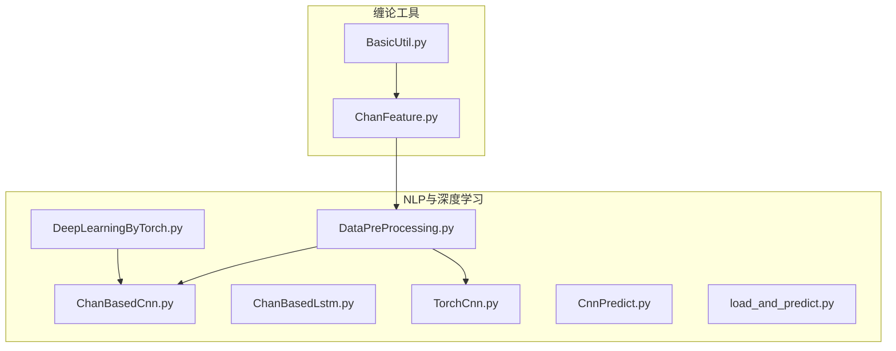
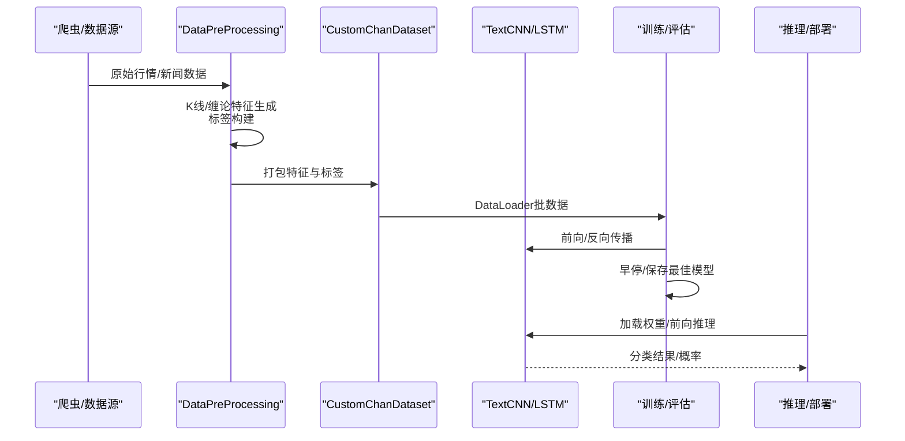
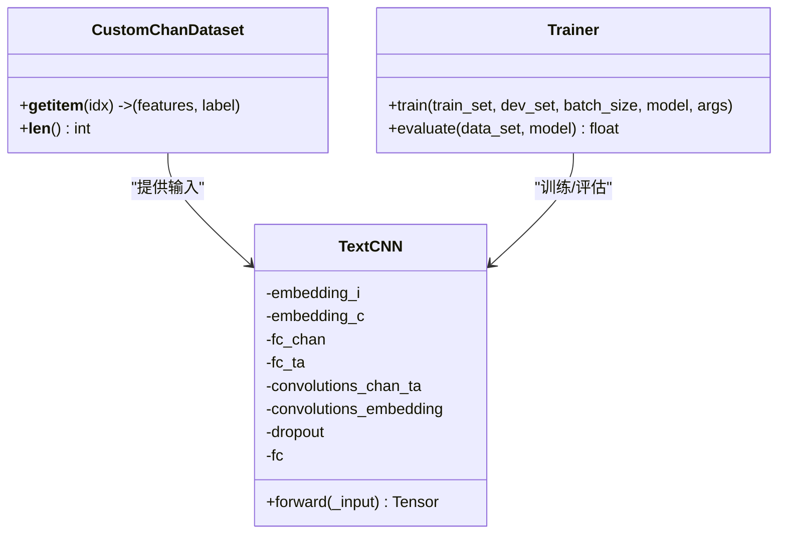
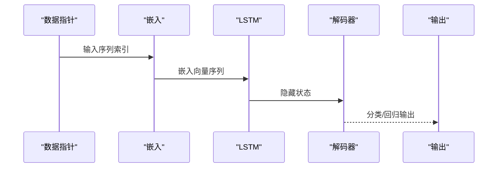
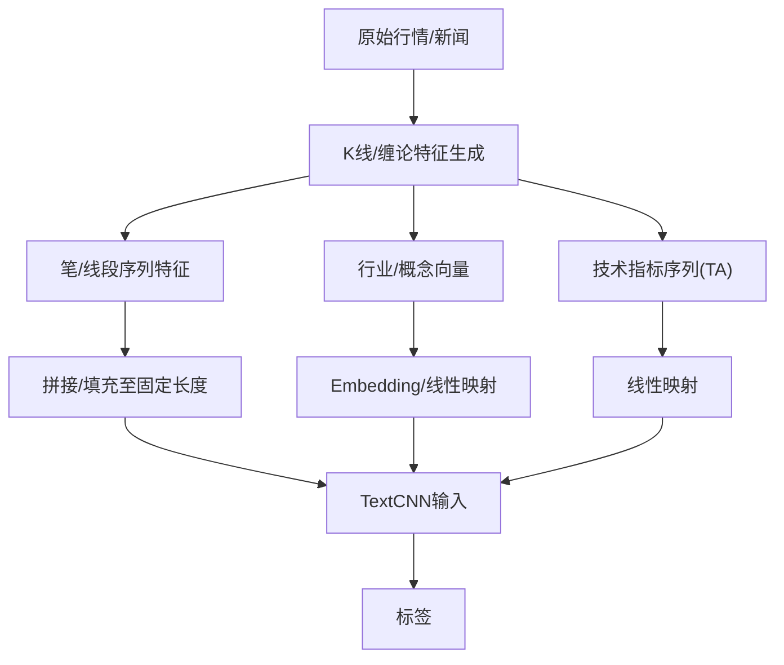
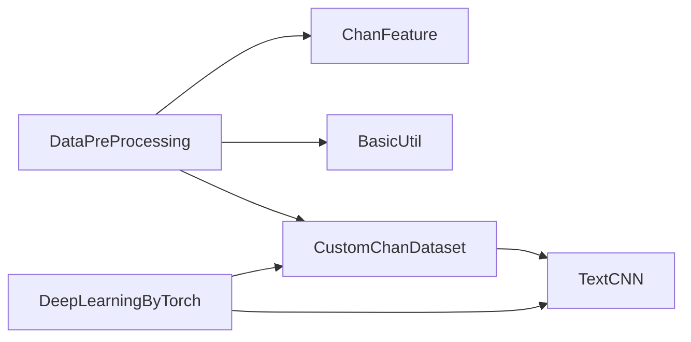

# 深度学习模型

<cite>
**本文引用的文件列表**
- [README.md](file://README.md)
- [ChanBasedCnn.py](file://src/NlpModel/ChanBasedCnn.py)
- [ChanBasedLstm.py](file://src/NlpModel/ChanBasedLstm.py)
- [DeepLearningByTorch.py](file://src/NlpModel/DeepLearningByTorch.py)
- [DataPreProcessing.py](file://src/NlpModel/DataPreProcessing.py)
- [TorchCnn.py](file://src/NlpModel/TorchCnn.py)
- [CnnPredict.py](file://src/NlpModel/CnnPredict.py)
- [load_and_predict.py](file://src/NlpModel/load_and_predict.py)
- [BasicUtil.py](file://src/ChanUtils/BasicUtil.py)
- [ChanFeature.py](file://src/ChanUtils/ChanFeature.py)
</cite>

## 目录
1. [简介](#简介)
2. [项目结构](#项目结构)
3. [核心组件](#核心组件)
4. [架构总览](#架构总览)
5. [详细组件分析](#详细组件分析)
6. [依赖关系分析](#依赖关系分析)
7. [性能考量](#性能考量)
8. [故障排查指南](#故障排查指南)
9. [结论](#结论)
10. [附录](#附录)

## 简介
本文件面向“基于PyTorch的CNN与LSTM在情感分析中的应用”，系统梳理仓库中与NLP与深度学习相关的核心模块，重点覆盖：
- ChanBasedCnn：融合技术分析序列与行业/概念嵌入的文本分类CNN模型
- ChanBasedLstm：基于字符级LSTM的文本生成与分类思路
- 训练策略与评估流程
- 数据预处理与特征工程
- 模型部署与推理流程
- 性能对比与实践建议

同时，结合项目背景，说明该模型如何服务于“公司新闻爬取与情感分析”的业务目标。

章节来源
- [README.md:1-33](file://README.md#L1-L33)

## 项目结构
与深度学习模型直接相关的目录与文件如下：
- src/NlpModel：NLP与深度学习相关模块
  - ChanBasedCnn.py：CNN模型、数据集、训练与评估
  - ChanBasedLstm.py：LSTM模型与训练示例
  - DeepLearningByTorch.py：训练入口与参数解析
  - DataPreProcessing.py：数据预处理与特征工程
  - TorchCnn.py：EmbeddingBag + CNN文本分类参考实现
  - CnnPredict.py：文本预测脚本
  - load_and_predict.py：LightGBM基线预测脚本
- src/ChanUtils：缠论基础工具与特征生成
  - BasicUtil.py：K线、笔、线段等对象定义
  - ChanFeature.py：深度特征生成（笔/线段序列、行业/概念向量）

图表来源
- [DeepLearningByTorch.py:69-118](file://src/NlpModel/DeepLearningByTorch.py#L69-L118)
- [ChanBasedCnn.py:83-149](file://src/NlpModel/ChanBasedCnn.py#L83-L149)
- [DataPreProcessing.py:17-32](file://src/NlpModel/DataPreProcessing.py#L17-L32)
- [ChanFeature.py:64-156](file://src/ChanUtils/ChanFeature.py#L64-L156)
- [BasicUtil.py:11-98](file://src/ChanUtils/BasicUtil.py#L11-L98)

章节来源
- [README.md:1-33](file://README.md#L1-L33)
- [DeepLearningByTorch.py:69-118](file://src/NlpModel/DeepLearningByTorch.py#L69-L118)
- [ChanBasedCnn.py:83-149](file://src/NlpModel/ChanBasedCnn.py#L83-L149)
- [DataPreProcessing.py:17-32](file://src/NlpModel/DataPreProcessing.py#L17-L32)
- [ChanFeature.py:64-156](file://src/ChanUtils/ChanFeature.py#L64-L156)
- [BasicUtil.py:11-98](file://src/ChanUtils/BasicUtil.py#L11-L98)

## 核心组件
- 文本CNN（TextCNN）：融合“技术分析序列”与“行业/概念嵌入”，经多核卷积与池化提取局部特征，再拼接全连接分类。
- 字符级LSTM（RNN）：可作为文本生成或分类的基础单元，演示了LSTM的前向传播、损失与优化。
- 数据集与预处理：CustomChanDataset将技术序列、TA特征、行业/概念向量打包；DataPreProcessing负责从K线到深度特征的生成与标签构建。
- 训练与评估：DeepLearningByTorch提供参数解析与训练入口；ChanBasedCnn内置训练循环、早停与保存逻辑；评估采用交叉熵与准确率。
- 推理与部署：CnnPredict提供单句预测流程；TorchCnn展示EmbeddingBag + 线性层的文本分类范式。

章节来源
- [ChanBasedCnn.py:155-261](file://src/NlpModel/ChanBasedCnn.py#L155-L261)
- [ChanBasedLstm.py:12-27](file://src/NlpModel/ChanBasedLstm.py#L12-L27)
- [DataPreProcessing.py:119-301](file://src/NlpModel/DataPreProcessing.py#L119-L301)
- [DeepLearningByTorch.py:30-66](file://src/NlpModel/DeepLearningByTorch.py#L30-L66)
- [CnnPredict.py:9-27](file://src/NlpModel/CnnPredict.py#L9-L27)
- [TorchCnn.py:25-48](file://src/NlpModel/TorchCnn.py#L25-L48)

## 架构总览
整体流程：数据采集与清洗 → 缠论特征工程 → 技术分析序列与TA特征构造 → 模型训练与评估 → 推理与部署。

图表来源
- [DataPreProcessing.py:119-301](file://src/NlpModel/DataPreProcessing.py#L119-L301)
- [ChanBasedCnn.py:83-149](file://src/NlpModel/ChanBasedCnn.py#L83-L149)
- [ChanBasedCnn.py:336-390](file://src/NlpModel/ChanBasedCnn.py#L336-L390)
- [DeepLearningByTorch.py:69-118](file://src/NlpModel/DeepLearningByTorch.py#L69-L118)

## 详细组件分析

### TextCNN（ChanBasedCnn）
- 输入结构
  - 技术分析序列：形状为(W×D)，经线性映射至D维
  - 行业/概念嵌入：分别通过Embedding映射至D维，拼接后作为另一通道
  - 技术指标（TA）：线性映射至D维，拼接后作为另一通道
- 卷积与池化
  - 使用多核卷积（Ks）提取局部特征，随后对时间维做全局最大池化，得到固定维度表示
  - 分别对“技术序列+TA”和“行业/概念”执行相同流程，最后拼接
- 分类头
  - Dropout后接入全连接层，输出类别logits
- 训练与评估
  - 优化器：Adam（可配置学习率）
  - 损失：交叉熵
  - 早停：按dev间隔评估，超过阈值则保存最佳模型
  - 评估：准确率与平均损失

图表来源
- [ChanBasedCnn.py:155-261](file://src/NlpModel/ChanBasedCnn.py#L155-L261)
- [ChanBasedCnn.py:83-149](file://src/NlpModel/ChanBasedCnn.py#L83-L149)
- [ChanBasedCnn.py:336-390](file://src/NlpModel/ChanBasedCnn.py#L336-L390)

章节来源
- [ChanBasedCnn.py:155-261](file://src/NlpModel/ChanBasedCnn.py#L155-L261)
- [ChanBasedCnn.py:83-149](file://src/NlpModel/ChanBasedCnn.py#L83-L149)
- [ChanBasedCnn.py:336-390](file://src/NlpModel/ChanBasedCnn.py#L336-L390)

### LSTM（ChanBasedLstm）
- 结构要点
  - 嵌入层将字符索引映射到向量空间
  - LSTM堆叠多层，输出映射到词汇表大小
  - 前向传播返回输出与隐藏状态，解码器线性映射到类别
- 训练流程
  - 随机截断序列作为输入/目标
  - 交叉熵损失，Adam优化
  - 每轮保存权重并采样生成文本

图表来源
- [ChanBasedLstm.py:12-27](file://src/NlpModel/ChanBasedLstm.py#L12-L27)
- [ChanBasedLstm.py:77-111](file://src/NlpModel/ChanBasedLstm.py#L77-L111)

章节来源
- [ChanBasedLstm.py:12-27](file://src/NlpModel/ChanBasedLstm.py#L12-L27)
- [ChanBasedLstm.py:77-111](file://src/NlpModel/ChanBasedLstm.py#L77-L111)

### 数据预处理与特征工程
- 数据来源与标签
  - 通过行情数据与周线标签构建二分类/多分类标签
  - 过滤未来数据，确保时间一致性
- 缠论特征
  - 从K线生成笔/线段序列，构造顶底、长度、角度、成交量、MACD/Hist等序列
  - 行业/概念向量化为one-hot或稀疏向量
- 技术指标（TA）
  - 基于历史窗口生成指标序列，统一长度后拼接
- 数据集封装
  - CustomChanDataset将技术序列、TA向量、行业/概念向量与标签打包，供DataLoader迭代

图表来源
- [DataPreProcessing.py:119-301](file://src/NlpModel/DataPreProcessing.py#L119-L301)
- [ChanFeature.py:64-156](file://src/ChanUtils/ChanFeature.py#L64-L156)
- [BasicUtil.py:11-98](file://src/ChanUtils/BasicUtil.py#L11-L98)

章节来源
- [DataPreProcessing.py:119-301](file://src/NlpModel/DataPreProcessing.py#L119-L301)
- [ChanFeature.py:64-156](file://src/ChanUtils/ChanFeature.py#L64-L156)
- [BasicUtil.py:11-98](file://src/ChanUtils/BasicUtil.py#L11-L98)

### 训练策略与超参数
- 优化器与损失
  - TextCNN：Adam优化器，交叉熵损失
  - LSTM：Adam优化器，交叉熵损失
- 关键超参数
  - 学习率、卷积核数量与尺寸、dropout、batch size、epoch、早停步数、日志/保存间隔
- 早停与保存
  - 定期在验证集评估，记录最佳准确率并保存模型快照

章节来源
- [ChanBasedCnn.py:336-390](file://src/NlpModel/ChanBasedCnn.py#L336-L390)
- [DeepLearningByTorch.py:30-66](file://src/NlpModel/DeepLearningByTorch.py#L30-L66)
- [ChanBasedLstm.py:77-111](file://src/NlpModel/ChanBasedLstm.py#L77-L111)

### 推理与部署
- 单句预测
  - CnnPredict提供从文本到数值化的标准流程，加载模型与字典，输出类别
- 模型保存与加载
  - TextCNN支持按步数保存权重；TorchCnn提供保存/加载范式
- 集成建议
  - 将特征工程与模型封装为服务接口，统一输入格式与输出结构

章节来源
- [CnnPredict.py:9-27](file://src/NlpModel/CnnPredict.py#L9-L27)
- [ChanBasedCnn.py:264-269](file://src/NlpModel/ChanBasedCnn.py#L264-L269)
- [TorchCnn.py:257-266](file://src/NlpModel/TorchCnn.py#L257-L266)

## 依赖关系分析
- 模块内聚与耦合
  - TextCNN与CustomChanDataset强耦合，前者依赖后者提供的张量结构
  - DataPreProcessing与缠论工具（BasicUtil、ChanFeature）紧密协作
  - DeepLearningByTorch作为训练入口，聚合数据与模型
- 外部依赖
  - PyTorch（nn、optim、functional）、Pandas、NumPy
  - 第三方特征引擎（TAEngine）与数据库访问（StockInfoSpyder）

图表来源
- [DataPreProcessing.py:17-32](file://src/NlpModel/DataPreProcessing.py#L17-L32)
- [ChanFeature.py:64-156](file://src/ChanUtils/ChanFeature.py#L64-L156)
- [BasicUtil.py:11-98](file://src/ChanUtils/BasicUtil.py#L11-L98)
- [ChanBasedCnn.py:83-149](file://src/NlpModel/ChanBasedCnn.py#L83-L149)
- [DeepLearningByTorch.py:69-118](file://src/NlpModel/DeepLearningByTorch.py#L69-L118)

章节来源
- [DataPreProcessing.py:17-32](file://src/NlpModel/DataPreProcessing.py#L17-L32)
- [ChanFeature.py:64-156](file://src/ChanUtils/ChanFeature.py#L64-L156)
- [BasicUtil.py:11-98](file://src/ChanUtils/BasicUtil.py#L11-L98)
- [ChanBasedCnn.py:83-149](file://src/NlpModel/ChanBasedCnn.py#L83-L149)
- [DeepLearningByTorch.py:69-118](file://src/NlpModel/DeepLearningByTorch.py#L69-L118)

## 性能考量
- 计算效率
  - 使用GPU设备（若可用）可显著加速训练与推理
  - EmbeddingBag在变长序列处理上更高效，适合大规模文本分类
- 正则化与过拟合
  - dropout与早停机制有助于缓解过拟合
  - 合理设置学习率与batch size
- 数据质量
  - 确保标签不泄漏未来信息，避免数据污染
  - 对序列进行填充/截断，保持批次内一致形状

[本节为通用指导，无需特定文件引用]

## 故障排查指南
- 训练不收敛或震荡
  - 检查学习率设置；尝试降低学习率或使用学习率调度
  - 确认损失函数与标签类型匹配（交叉熵需整数标签）
- 内存不足
  - 减小batch size或缩短序列长度
  - 使用更小的嵌入维度与卷积核数量
- 评估指标异常
  - 检查评估阶段是否切换为eval模式并禁用梯度
  - 确认标签与预测维度一致

章节来源
- [ChanBasedCnn.py:336-390](file://src/NlpModel/ChanBasedCnn.py#L336-L390)
- [TorchCnn.py:140-158](file://src/NlpModel/TorchCnn.py#L140-L158)

## 结论
本项目以“缠论技术分析序列 + 行业/概念嵌入 + 技术指标”为输入，构建了可扩展的文本分类深度学习流水线。TextCNN在该多模态输入上具备良好的表达能力，配合早停与保存策略，可在有限资源下稳定训练。LSTM展示了字符级建模的可行性，可用于生成或分类任务。结合数据预处理与特征工程，模型可服务于新闻情感分析与市场信号挖掘。

[本节为总结，无需特定文件引用]

## 附录
- 实践建议
  - 超参数搜索：网格/贝叶斯优化探索学习率、卷积核尺寸与数量、dropout
  - 模型集成：CNN + LSTM 或与其他特征（如LightGBM）集成
  - A/B测试：线上灰度发布，对比深度学习与传统模型效果
- 与传统方法的关系
  - 传统ML（如LightGBM）在特征工程成熟场景下仍具高效性；深度学习在复杂非线性与多模态融合方面更具潜力
  - 可将深度学习作为特征抽取器，与传统模型结合提升整体性能

[本节为通用指导，无需特定文件引用]