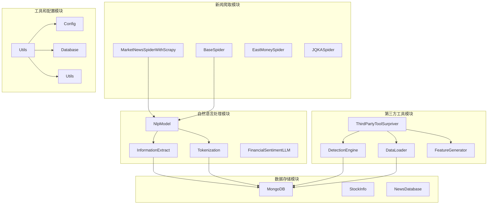
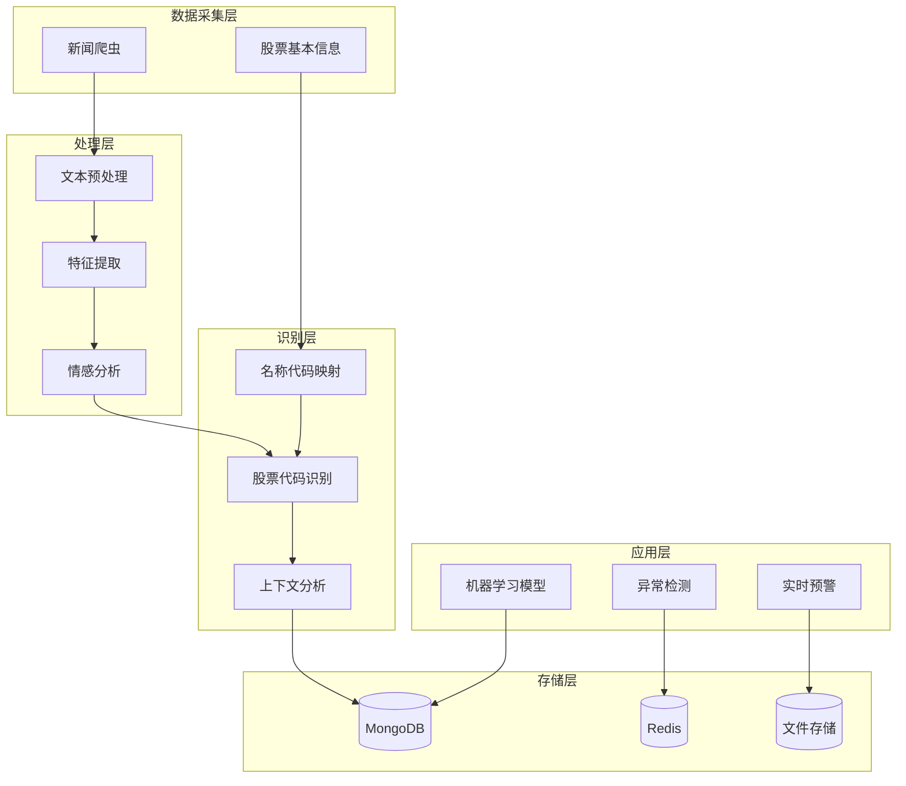
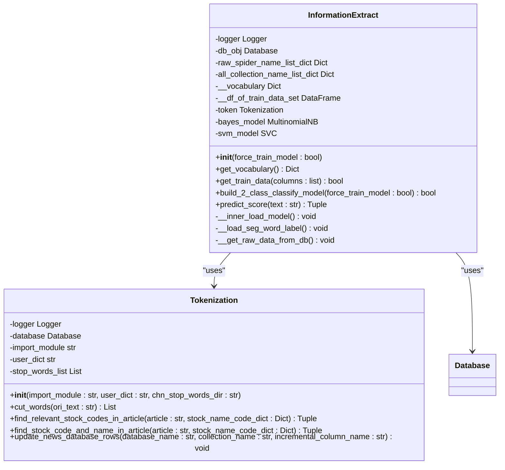
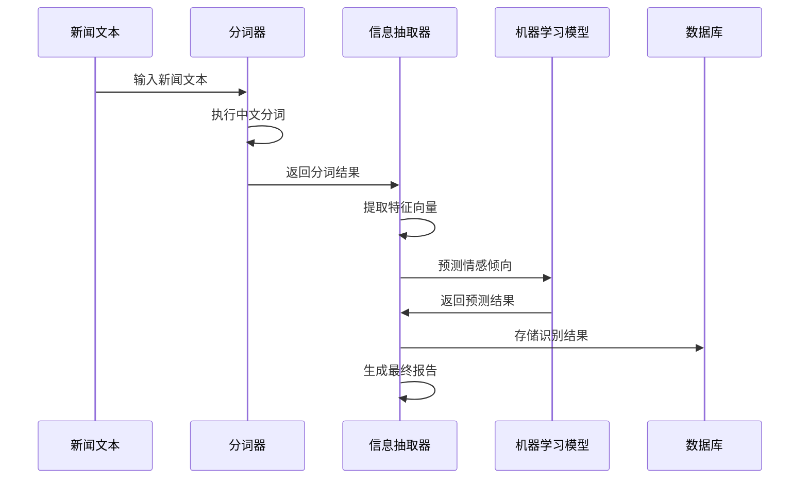
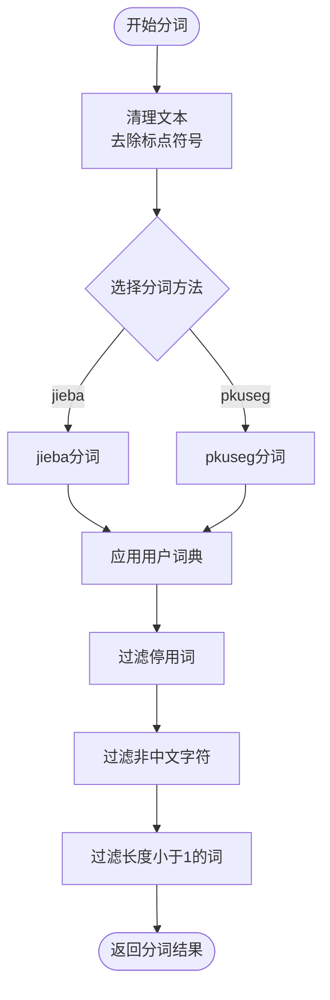
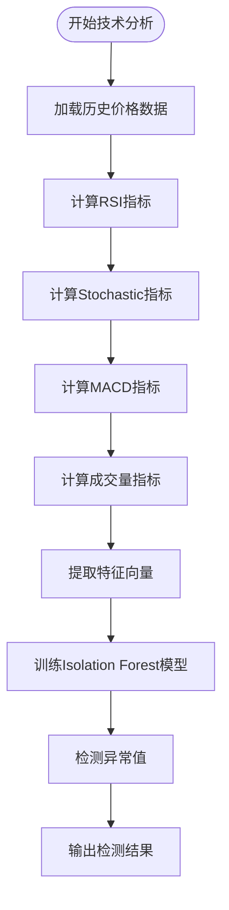
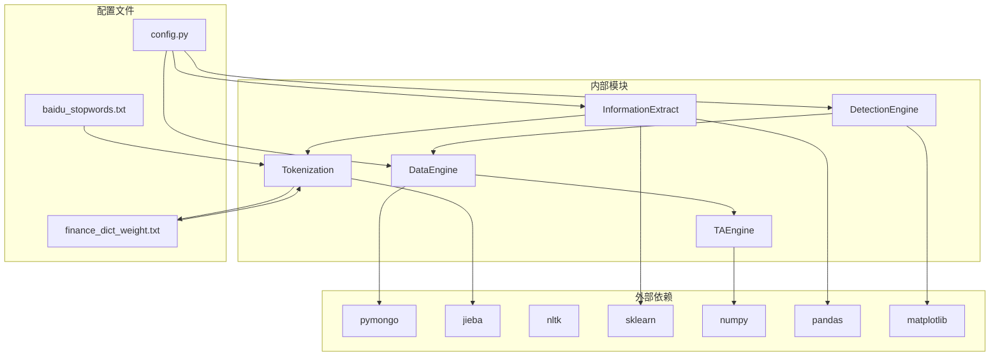

# 股票代码识别

<cite>
**本文档引用的文件**
- [information_extract.py](file://src/NlpModel/information_extract.py)
- [tokenization.py](file://src/NlpModel/tokenization.py)
- [detection_engine.py](file://src/ThirdPartyToolSurpriver/detection_engine.py)
- [data_loader.py](file://src/ThirdPartyToolSurpriver/data_loader.py)
- [feature_generator.py](file://src/ThirdPartyToolSurpriver/feature_generator.py)
- [config.py](file://src/Utils/config.py)
- [utils.py](file://src/Utils/utils.py)
- [database.py](file://src/Utils/database.py)
- [BaseSpider.py](file://src/MarketNewsSpiderWithScrapy/BaseSpider.py)
- [BuildStockNewsDb.py](file://src/MongoDbComTools/BuildStockNewsDb.py)
- [finance_dict_weight.txt](file://src/info/finance_dict_weight.txt)
- [baidu_stopwords.txt](file://src/info/stopwords/baidu_stopwords.txt)
- [stocks.txt](file://src/ThirdPartyToolSurpriver/stocks/stocks.txt)
</cite>

## 目录
1. [简介](#简介)
2. [项目结构](#项目结构)
3. [核心组件](#核心组件)
4. [架构概览](#架构概览)
5. [详细组件分析](#详细组件分析)
6. [依赖关系分析](#依赖关系分析)
7. [性能考虑](#性能考虑)
8. [故障排除指南](#故障排除指南)
9. [结论](#结论)

## 简介

本项目是一个综合性的股票代码识别系统，专门设计用于从新闻文本中自动提取和识别股票代码。该系统结合了多种技术方法，包括中文分词、机器学习分类、异常检测和情感分析，为量化投资和金融分析提供了强大的技术支持。

系统的核心功能包括：
- 自动从新闻文本中提取股票代码
- 多种识别策略的融合（基于规则、机器学习、深度学习）
- 实时情感分析和市场情绪预测
- 异常交易信号检测
- 数据库集成和批量处理能力

## 项目结构

该项目采用模块化的架构设计，主要分为以下几个核心模块：

**图表来源**
- [BaseSpider.py:35-130](file://src/MarketNewsSpiderWithScrapy/BaseSpider.py#L35-L130)
- [information_extract.py:26-60](file://src/NlpModel/information_extract.py#L26-L60)
- [detection_engine.py:158-187](file://src/ThirdPartyToolSurpriver/detection_engine.py#L158-L187)

**章节来源**
- [config.py:439-450](file://src/Utils/config.py#L439-L450)
- [BaseSpider.py:35-130](file://src/MarketNewsSpiderWithScrapy/BaseSpider.py#L35-L130)

## 核心组件

### 1. 信息抽取引擎 (InformationExtract)

信息抽取引擎是整个系统的核心组件，负责从新闻文本中提取相关信息并进行分类。

**主要功能：**
- 文本预处理和清洗
- 特征工程和向量化
- 机器学习模型训练和预测
- 情感分析和市场情绪判断

**关键特性：**
- 支持多种机器学习算法（朴素贝叶斯、SVM）
- TF-IDF文本向量化
- 动态模型加载和保存
- 批量数据处理能力

### 2. 分词引擎 (Tokenization)

分词引擎专门负责中文文本的分词处理，为股票代码识别提供基础的文本处理能力。

**主要功能：**
- 中文分词（支持jieba和pkuseg两种模式）
- 自定义词典加载
- 停用词过滤
- 股票代码和名称识别

**分词策略：**
- 使用正则表达式去除标点符号
- 支持用户自定义词典权重
- 多种分词算法可选

### 3. 异常检测引擎 (Surpriver)

异常检测引擎基于Isolation Forest算法，用于识别异常的股票交易行为。

**核心算法：**
- Isolation Forest异常检测
- 技术指标特征提取
- 机器学习模型训练
- 实时预测和预警

**技术指标：**
- RSI（相对强弱指数）
- Stochastic Oscillator（随机指标）
- MACD（指数平滑异同移动平均线）
- Volume（成交量）

**章节来源**
- [information_extract.py:26-60](file://src/NlpModel/information_extract.py#L26-L60)
- [tokenization.py:11-24](file://src/NlpModel/tokenization.py#L11-L24)
- [detection_engine.py:158-187](file://src/ThirdPartyToolSurpriver/detection_engine.py#L158-L187)

## 架构概览

系统采用分层架构设计，确保各组件之间的松耦合和高内聚：

**图表来源**
- [BaseSpider.py:59-130](file://src/MarketNewsSpiderWithScrapy/BaseSpider.py#L59-L130)
- [information_extract.py:237-258](file://src/NlpModel/information_extract.py#L237-L258)
- [detection_engine.py:272-305](file://src/ThirdPartyToolSurpriver/detection_engine.py#L272-L305)

## 详细组件分析

### 信息抽取引擎详细分析

#### 类结构图

**图表来源**
- [information_extract.py:26-60](file://src/NlpModel/information_extract.py#L26-L60)
- [tokenization.py:11-24](file://src/NlpModel/tokenization.py#L11-L24)

#### 工作流程序列图

**图表来源**
- [information_extract.py:219-236](file://src/NlpModel/information_extract.py#L219-L236)
- [tokenization.py:77-103](file://src/NlpModel/tokenization.py#L77-L103)

#### 性能优化策略

系统采用了多种性能优化策略：

1. **缓存机制**：模型和词汇表的持久化存储
2. **批处理**：支持大数据量的批量处理
3. **增量更新**：只处理新增数据
4. **内存管理**：合理的数据结构设计

**章节来源**
- [information_extract.py:97-107](file://src/NlpModel/information_extract.py#L97-L107)
- [information_extract.py:260-338](file://src/NlpModel/information_extract.py#L260-L338)

### 分词引擎详细分析

#### 分词算法流程

**图表来源**
- [tokenization.py:77-103](file://src/NlpModel/tokenization.py#L77-L103)

#### 股票代码识别算法

系统实现了多种股票代码识别策略：

1. **直接匹配法**：直接在原文中查找股票名称
2. **分词匹配法**：先分词再匹配股票代码
3. **混合匹配法**：结合多种策略提高准确率

**章节来源**
- [tokenization.py:27-75](file://src/NlpModel/tokenization.py#L27-L75)

### 异常检测引擎详细分析

#### 技术指标计算流程

**图表来源**
- [feature_generator.py:31-161](file://src/ThirdPartyToolSurpriver/feature_generator.py#L31-L161)
- [detection_engine.py:272-305](file://src/ThirdPartyToolSurpriver/detection_engine.py#L272-L305)

#### 异常检测参数配置

系统提供了丰富的参数配置选项：

| 参数名 | 默认值 | 描述 |
|--------|--------|------|
| top_n | 25 | 显示前N个预测结果 |
| min_volume | 5000 | 最低成交量过滤 |
| history_to_use | 7 | 使用的历史数据条数 |
| volatility_filter | 0.05 | 波动性过滤阈值 |
| data_granularity_minutes | 15 | 数据粒度（分钟） |

**章节来源**
- [detection_engine.py:24-98](file://src/ThirdPartyToolSurpriver/detection_engine.py#L24-L98)
- [data_loader.py:16-55](file://src/ThirdPartyToolSurpriver/data_loader.py#L16-L55)

## 依赖关系分析

### 核心依赖关系图

**图表来源**
- [information_extract.py:4-16](file://src/NlpModel/information_extract.py#L4-L16)
- [detection_engine.py:1-14](file://src/ThirdPartyToolSurpriver/detection_engine.py#L1-L14)
- [config.py:30-37](file://src/Utils/config.py#L30-L37)

### 数据流依赖关系

系统中的数据流遵循严格的依赖关系：

1. **数据采集** → **文本预处理** → **特征提取** → **模型预测** → **结果存储**

2. **股票信息** → **名称代码映射** → **识别匹配** → **上下文分析**

3. **技术分析** → **特征工程** → **异常检测** → **预警输出**

**章节来源**
- [BaseSpider.py:59-130](file://src/MarketNewsSpiderWithScrapy/BaseSpider.py#L59-L130)
- [data_loader.py:148-224](file://src/ThirdPartyToolSurpriver/data_loader.py#L148-L224)

## 性能考虑

### 内存优化策略

1. **数据分块处理**：对于大数据集采用分块处理策略
2. **惰性加载**：模型和数据采用按需加载
3. **垃圾回收**：及时释放不需要的对象引用

### 并行处理能力

系统支持多线程和异步处理：

- **分词并行化**：多个文本同时进行分词处理
- **模型预测并行化**：多个样本同时进行模型预测
- **数据库操作并行化**：批量数据的并发写入

### 缓存机制

1. **模型缓存**：训练好的模型持久化存储
2. **词汇表缓存**：分词词汇表的快速加载
3. **中间结果缓存**：避免重复计算相同结果

## 故障排除指南

### 常见问题及解决方案

#### 1. 分词效果不佳

**问题症状**：股票名称被错误分割或遗漏

**解决方案**：
- 检查用户词典配置
- 调整分词算法参数
- 增加自定义词典条目

#### 2. 模型预测准确率低

**问题症状**：情感分析结果与预期不符

**解决方案**：
- 增加训练数据量
- 调整特征工程参数
- 更新模型版本

#### 3. 数据库连接失败

**问题症状**：无法连接到MongoDB

**解决方案**：
- 检查网络连接状态
- 验证数据库凭据
- 调整连接超时设置

#### 4. 内存不足错误

**问题症状**：处理大数据时出现内存溢出

**解决方案**：
- 增加系统内存
- 优化数据处理流程
- 启用数据分块处理

### 调试工具和方法

系统提供了完善的调试和监控功能：

1. **日志记录**：详细的执行过程记录
2. **性能监控**：关键操作的执行时间统计
3. **错误追踪**：异常信息的完整堆栈跟踪
4. **数据验证**：中间结果的完整性检查

**章节来源**
- [utils.py:25-27](file://src/Utils/utils.py#L25-L27)
- [database.py:15-33](file://src/Utils/database.py#L15-L33)

## 结论

本股票代码识别系统通过整合多种先进技术，为金融数据分析提供了全面的解决方案。系统的主要优势包括：

1. **多策略融合**：结合规则匹配、机器学习和深度学习技术
2. **高性能架构**：支持大规模数据处理和实时分析
3. **灵活扩展**：模块化设计便于功能扩展和定制
4. **稳定可靠**：完善的错误处理和监控机制

未来的发展方向包括：
- 集成更多机器学习算法
- 支持多语言文本处理
- 增强实时处理能力
- 优化移动端适配

该系统为量化投资、金融分析和市场研究提供了强有力的技术支撑，具有广泛的应用前景和商业价值。