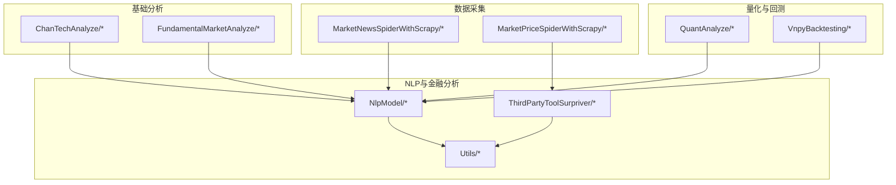
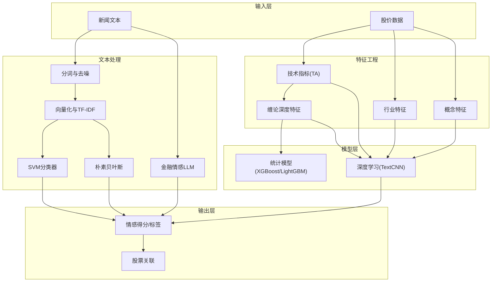
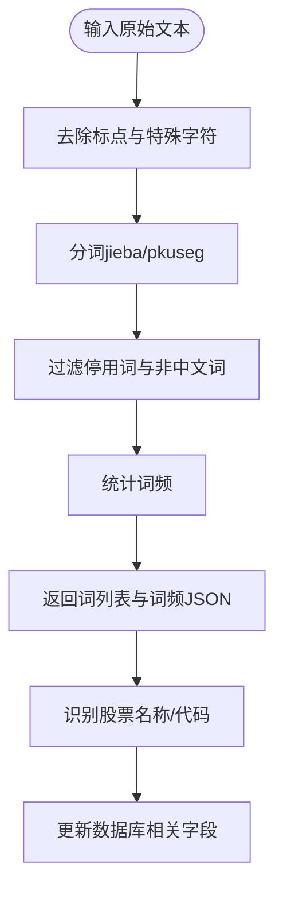
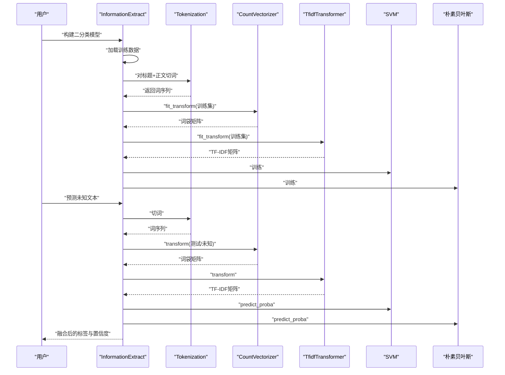
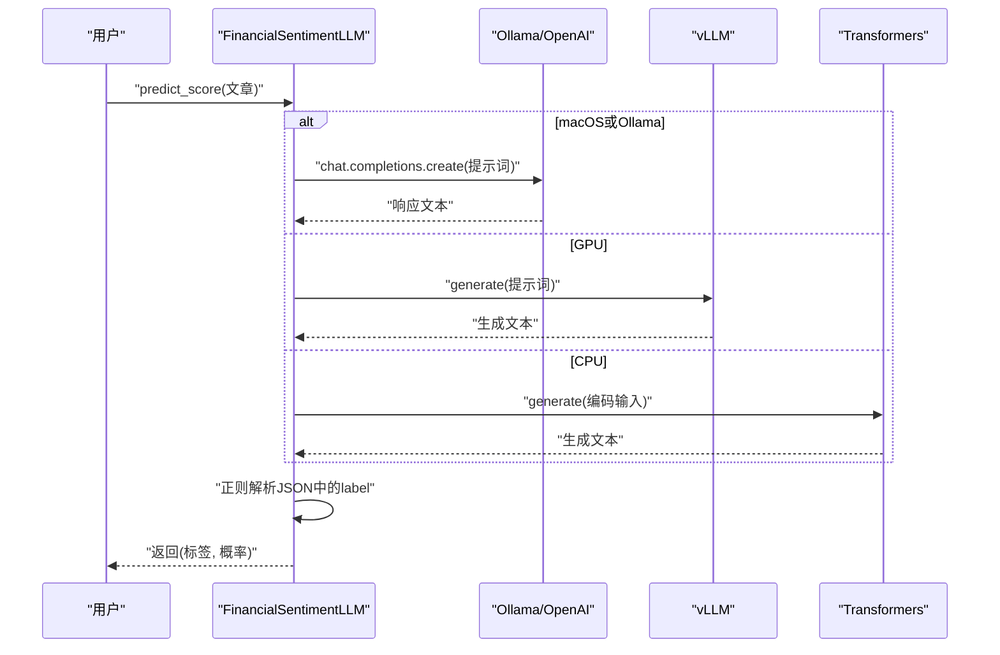
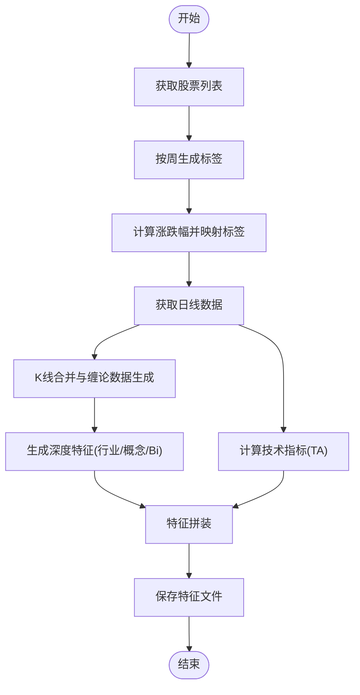
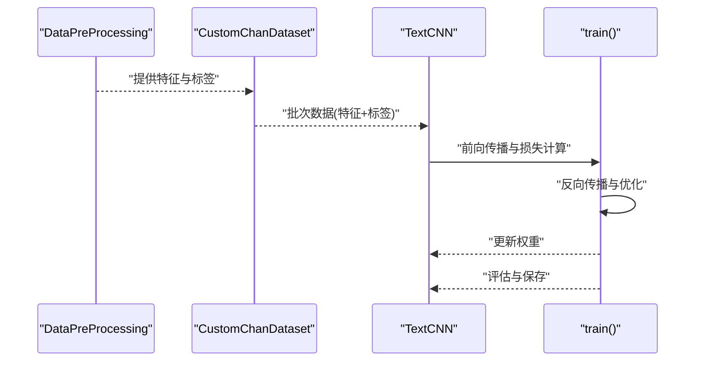
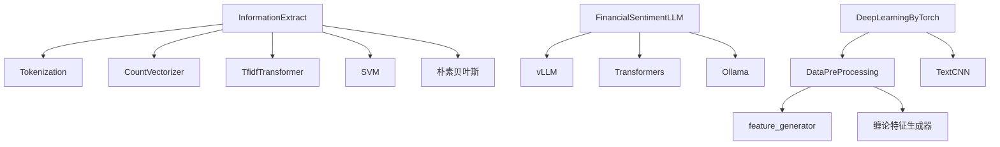

# 自然语言处理分析

<cite>
**本文档引用的文件**
- [README.md](file://README.md)
- [src/NlpModel/nlp_main.py](file://src/NlpModel/nlp_main.py)
- [src/NlpModel/FinancialSentimentLLM.py](file://src/NlpModel/FinancialSentimentLLM.py)
- [src/NlpModel/DataPreProcessing.py](file://src/NlpModel/DataPreProcessing.py)
- [src/NlpModel/information_extract.py](file://src/NlpModel/information_extract.py)
- [src/NlpModel/tokenization.py](file://src/NlpModel/tokenization.py)
- [src/NlpModel/StatisticMachineLearning.py](file://src/NlpModel/StatisticMachineLearning.py)
- [src/NlpModel/DeepLearningByTorch.py](file://src/NlpModel/DeepLearningByTorch.py)
- [src/NlpModel/TorchCnn.py](file://src/NlpModel/TorchCnn.py)
- [src/NlpModel/ChanBasedCnn.py](file://src/NlpModel/ChanBasedCnn.py)
- [src/NlpModel/ChanBasedLstm.py](file://src/NlpModel/ChanBasedLstm.py)
- [src/Utils/config.py](file://src/Utils/config.py)
- [src/ThirdPartyToolSurpriver/detection_engine.py](file://src/ThirdPartyToolSurpriver/detection_engine.py)
- [src/ThirdPartyToolSurpriver/feature_generator.py](file://src/ThirdPartyToolSurpriver/feature_generator.py)
</cite>

## 目录
1. [简介](#简介)
2. [项目结构](#项目结构)
3. [核心组件](#核心组件)
4. [架构总览](#架构总览)
5. [详细组件分析](#详细组件分析)
6. [依赖关系分析](#依赖关系分析)
7. [性能考量](#性能考量)
8. [故障排查指南](#故障排查指南)
9. [结论](#结论)
10. [附录](#附录)

## 简介
本项目是一个融合传统机器学习与深度学习的自然语言处理（NLP）分析系统，专注于金融新闻的情感分析与股票相关性挖掘。系统包含以下关键能力：
- 文本预处理与分词、去噪、特征提取
- 统计机器学习模型（SVM、朴素贝叶斯）在情感二分类中的应用
- 深度学习模型（CNN/LSTM）在文本与技术特征融合上的建模
- 基于LLM的金融情感评分引擎（FinancialSentimentLLM）
- 股票代码识别与关联标注
- 技术分析特征（TA）与行业/概念特征的融合

系统采用模块化设计，通过配置中心统一管理路径、字典与模型文件，便于扩展与维护。

## 项目结构
项目采用按功能域划分的目录结构，核心NLP与金融分析逻辑集中在NlpModel与ThirdPartyToolSurpriver目录中，工具与配置位于Utils目录，爬虫与数据采集位于MarketNewsSpiderWithScrapy等目录。

图表来源
- [src/NlpModel/nlp_main.py:1-70](file://src/NlpModel/nlp_main.py#L1-L70)
- [src/Utils/config.py:1-455](file://src/Utils/config.py#L1-L455)

章节来源
- [README.md:1-33](file://README.md#L1-L33)
- [src/Utils/config.py:1-455](file://src/Utils/config.py#L1-L455)

## 核心组件
- 文本预处理与分词（Tokenization）：支持jieba与pkuseg分词，内置中文停用词过滤与用户自定义词典加载。
- 信息抽取与情感建模（InformationExtract）：基于CountVectorizer+TF-IDF，训练SVM与朴素贝叶斯二分类模型，支持规则打标与模型集成预测。
- 金融情感LLM引擎（FinancialSentimentLLM）：根据设备类型自动选择GPU加速（vLLM）或CPU（Transformers）推理，支持Ollama后端。
- 数据预处理与特征工程（DataPreProcessing）：整合K线、缠论深度特征、技术指标（TA）与行业/概念特征，生成统一训练样本。
- 统计机器学习（StatisticMachineLearning）：封装XGBoost/LightGBM训练与评估流程。
- 深度学习（DeepLearningByTorch）：基于TextCNN融合技术特征与行业/概念嵌入，支持PyTorch训练与保存。
- 股票代码识别（Tokenization.update_news_database_rows）：从新闻文本中识别股票名称并映射到代码，写回数据库。

章节来源
- [src/NlpModel/tokenization.py:1-169](file://src/NlpModel/tokenization.py#L1-L169)
- [src/NlpModel/information_extract.py:1-424](file://src/NlpModel/information_extract.py#L1-L424)
- [src/NlpModel/FinancialSentimentLLM.py:1-167](file://src/NlpModel/FinancialSentimentLLM.py#L1-L167)
- [src/NlpModel/DataPreProcessing.py:1-304](file://src/NlpModel/DataPreProcessing.py#L1-L304)
- [src/NlpModel/StatisticMachineLearning.py:1-161](file://src/NlpModel/StatisticMachineLearning.py#L1-L161)
- [src/NlpModel/DeepLearningByTorch.py:1-119](file://src/NlpModel/DeepLearningByTorch.py#L1-L119)
- [src/NlpModel/ChanBasedCnn.py:1-390](file://src/NlpModel/ChanBasedCnn.py#L1-L390)

## 架构总览
系统整体由“数据采集—文本预处理—情感建模—特征融合—深度学习/统计模型—结果输出”构成闭环。LLM作为高阶情感评分器，与传统ML模型形成互补；技术分析特征与行业/概念特征与文本特征融合，提升预测稳定性。

图表来源
- [src/NlpModel/nlp_main.py:1-70](file://src/NlpModel/nlp_main.py#L1-L70)
- [src/NlpModel/FinancialSentimentLLM.py:1-167](file://src/NlpModel/FinancialSentimentLLM.py#L1-L167)
- [src/NlpModel/DataPreProcessing.py:1-304](file://src/NlpModel/DataPreProcessing.py#L1-L304)
- [src/NlpModel/ChanBasedCnn.py:1-390](file://src/NlpModel/ChanBasedCnn.py#L1-L390)

## 详细组件分析

### 文本预处理与分词（Tokenization）
- 功能要点
  - 支持jieba与pkuseg两种分词方式，可加载用户自定义词典与中文停用词表
  - 清洗标点与特殊字符，过滤非中文与长度小于阈值的词
  - 提供股票名称与代码识别接口，支持增量更新数据库中的相关股票字段
- 关键流程
  - 文本清洗与分词
  - 去停用词与过滤
  - 词频统计与JSON序列化
  - 股票名称/代码映射与批量更新

图表来源
- [src/NlpModel/tokenization.py:77-103](file://src/NlpModel/tokenization.py#L77-L103)
- [src/NlpModel/tokenization.py:105-149](file://src/NlpModel/tokenization.py#L105-L149)

章节来源
- [src/NlpModel/tokenization.py:1-169](file://src/NlpModel/tokenization.py#L1-L169)

### 信息抽取与情感建模（InformationExtract）
- 功能要点
  - 从多源数据库集合读取新闻数据，构造训练集与测试集
  - 规则打标与模型打标双路径，支持二分类（利好/利空/未知）
  - CountVectorizer+TF-IDF向量化，SVM与朴素贝叶斯训练与评估
  - 集成预测：对未知样本进行概率融合，输出情感标签与置信度
- 关键流程
  - 数据加载与合并
  - 规则打标与分类标签生成
  - 文本切词与向量化
  - 模型训练与评估
  - 集成预测与结果输出

图表来源
- [src/NlpModel/information_extract.py:260-338](file://src/NlpModel/information_extract.py#L260-L338)
- [src/NlpModel/information_extract.py:19-107](file://src/NlpModel/information_extract.py#L19-L107)

章节来源
- [src/NlpModel/information_extract.py:1-424](file://src/NlpModel/information_extract.py#L1-L424)

### 金融情感LLM引擎（FinancialSentimentLLM）
- 功能要点
  - 自动检测运行环境（Darwin/macOS使用Ollama，其他平台优先GPU，否则CPU）
  - GPU推理使用vLLM，CPU推理使用Transformers AutoModel/AutoTokenizer
  - 统一的推理接口，返回“利好/利空”标签与概率
- 关键流程
  - 初始化：根据设备类型选择后端与参数
  - 推理：构造提示词，调用后端生成，解析JSON中的数值并判定标签
  - 容错：异常捕获与默认返回

图表来源
- [src/NlpModel/FinancialSentimentLLM.py:108-167](file://src/NlpModel/FinancialSentimentLLM.py#L108-L167)

章节来源
- [src/NlpModel/FinancialSentimentLLM.py:1-167](file://src/NlpModel/FinancialSentimentLLM.py#L1-L167)

### 数据预处理与特征工程（DataPreProcessing）
- 功能要点
  - 获取股票基本信息与历史日线数据，生成周线标签
  - 生成缠论深度特征（Bi序列、行业、概念）与技术指标（TA）特征
  - 统一特征拼装与缺失值处理，支持直接加载特征文件
- 关键流程
  - 获取股票列表与基本信息
  - 按周生成标签（涨跌幅区间映射）
  - 计算TA特征并展开为固定维度
  - 生成深度特征（行业/概念嵌入）与Bi序列特征
  - 特征拼装与保存/加载

图表来源
- [src/NlpModel/DataPreProcessing.py:119-301](file://src/NlpModel/DataPreProcessing.py#L119-L301)

章节来源
- [src/NlpModel/DataPreProcessing.py:1-304](file://src/NlpModel/DataPreProcessing.py#L1-L304)

### 统计机器学习（StatisticMachineLearning）
- 功能要点
  - 命令行参数控制分类模式（二分类/多分类）、特征文件、时间窗口、市场类型
  - 使用XGBoost与LightGBM进行训练与评估，输出准确率、混淆矩阵、特征重要性
- 关键流程
  - 解析命令行参数
  - 通过DataPreProcessing加载或生成特征数据
  - 划分训练/测试集
  - 训练XGBoost与LightGBM
  - 输出评估指标与特征重要性

章节来源
- [src/NlpModel/StatisticMachineLearning.py:1-161](file://src/NlpModel/StatisticMachineLearning.py#L1-L161)

### 深度学习（DeepLearningByTorch）
- 功能要点
  - 基于TextCNN融合技术特征与行业/概念嵌入，支持自定义卷积核、嵌入维度、dropout等超参
  - 训练与验证流程，支持早停与模型保存
- 关键流程
  - 通过DataPreProcessing准备特征数据
  - 构造CustomChanDataset与DataLoader
  - 初始化TextCNN模型并训练
  - 评估与保存最佳模型

图表来源
- [src/NlpModel/DeepLearningByTorch.py:69-119](file://src/NlpModel/DeepLearningByTorch.py#L69-L119)
- [src/NlpModel/ChanBasedCnn.py:336-390](file://src/NlpModel/ChanBasedCnn.py#L336-L390)

章节来源
- [src/NlpModel/DeepLearningByTorch.py:1-119](file://src/NlpModel/DeepLearningByTorch.py#L1-L119)
- [src/NlpModel/ChanBasedCnn.py:1-390](file://src/NlpModel/ChanBasedCnn.py#L1-L390)

### 技术分析特征（feature_generator）
- 功能要点
  - 计算RSI、Stochastic、Accumulation Distribution、Ease of Movement、CCI、日对数收益、成交量变化等指标
  - 对指标序列计算斜率、R值、P值，作为趋势与强度特征
- 关键流程
  - 输入OHLCV数据
  - 计算各类技术指标
  - 截取最近N期并附加趋势统计
  - 输出特征列表

章节来源
- [src/ThirdPartyToolSurpriver/feature_generator.py:1-186](file://src/ThirdPartyToolSurpriver/feature_generator.py#L1-L186)

### 异常检测工具（ThirdPartyToolSurpriver）
- 功能要点
  - 基于IsolationForest的异常检测，输出异常分数与未来表现统计
  - 支持CLI/JSON输出格式，可配置最小成交量、波动率过滤等参数
- 关键流程
  - 参数校验
  - 数据收集与特征构造
  - 异常检测与排序
  - 结果输出与可视化

章节来源
- [src/ThirdPartyToolSurpriver/detection_engine.py:1-599](file://src/ThirdPartyToolSurpriver/detection_engine.py#L1-L599)

## 依赖关系分析
- 模块耦合
  - InformationExtract依赖Tokenization、CountVectorizer、TfidfTransformer、SVM、朴素贝叶斯
  - FinancialSentimentLLM独立于训练模块，仅依赖外部推理后端（vLLM/Transformers/Ollama）
  - DataPreProcessing依赖技术分析引擎（feature_generator）与缠论特征生成器
  - DeepLearningByTorch依赖DataPreProcessing与TextCNN
- 外部依赖
  - vLLM（GPU推理）、Transformers（CPU推理）、Ollama（macOS后端）
  - scikit-learn（SVM、朴素贝叶斯、IsolationForest）、xgboost、lightgbm
  - ta（技术指标计算）、jieba/pkuseg（分词）

图表来源
- [src/NlpModel/information_extract.py:1-424](file://src/NlpModel/information_extract.py#L1-L424)
- [src/NlpModel/FinancialSentimentLLM.py:1-167](file://src/NlpModel/FinancialSentimentLLM.py#L1-L167)
- [src/NlpModel/DataPreProcessing.py:1-304](file://src/NlpModel/DataPreProcessing.py#L1-L304)
- [src/NlpModel/DeepLearningByTorch.py:1-119](file://src/NlpModel/DeepLearningByTorch.py#L1-L119)
- [src/ThirdPartyToolSurpriver/feature_generator.py:1-186](file://src/ThirdPartyToolSurpriver/feature_generator.py#L1-L186)

章节来源
- [src/NlpModel/information_extract.py:1-424](file://src/NlpModel/information_extract.py#L1-L424)
- [src/NlpModel/FinancialSentimentLLM.py:1-167](file://src/NlpModel/FinancialSentimentLLM.py#L1-L167)
- [src/NlpModel/DataPreProcessing.py:1-304](file://src/NlpModel/DataPreProcessing.py#L1-L304)
- [src/NlpModel/DeepLearningByTorch.py:1-119](file://src/NlpModel/DeepLearningByTorch.py#L1-L119)
- [src/ThirdPartyToolSurpriver/feature_generator.py:1-186](file://src/ThirdPartyToolSurpriver/feature_generator.py#L1-L186)

## 性能考量
- 分词与向量化
  - 使用CountVectorizer+TfidfTransformer，注意词汇表复用与稀疏表示以降低内存占用
  - 建议对停用词与高频词进行裁剪，减少特征维度
- 模型训练
  - SVM与朴素贝叶斯适合中小规模数据，特征维度不宜过大
  - XGBoost/LightGBM在特征工程完善时表现稳定，建议使用早停与交叉验证
- 深度学习
  - TextCNN卷积核数量与嵌入维度需权衡精度与速度
  - 使用EmbeddingBag避免padding，提高序列处理效率
- LLM推理
  - GPU环境下优先使用vLLM，CPU下使用Transformers并启用bf16与缓存
  - 控制提示词长度与温度参数，平衡速度与稳定性

## 故障排查指南
- 分词异常
  - 检查用户词典与停用词路径是否正确
  - 确认文本清洗正则未误删有效字符
- 模型加载失败
  - 确认模型文件路径与pickle兼容性
  - 检查CountVectorizer词汇表一致性
- LLM推理失败
  - macOS平台确认Ollama服务可用与端口开放
  - GPU平台确认驱动与vLLM安装正确
- 特征拼装异常
  - 检查DataPreProcessing中TA特征长度与Bi序列长度是否一致
  - 确保缺失值处理与索引对齐

章节来源
- [src/NlpModel/tokenization.py:1-169](file://src/NlpModel/tokenization.py#L1-L169)
- [src/NlpModel/information_extract.py:97-107](file://src/NlpModel/information_extract.py#L97-L107)
- [src/NlpModel/FinancialSentimentLLM.py:50-105](file://src/NlpModel/FinancialSentimentLLM.py#L50-L105)
- [src/NlpModel/DataPreProcessing.py:247-287](file://src/NlpModel/DataPreProcessing.py#L247-L287)

## 结论
本系统通过“传统ML+深度学习+LLM”的多层次融合，实现了金融新闻情感分析与股票相关性的有效建模。Tokenization与InformationExtract提供了稳健的文本预处理与分类基线；FinancialSentimentLLM在跨平台部署与推理效率方面具备优势；DataPreProcessing与技术特征工程为深度学习模型提供了丰富的多源信号。建议在实际应用中：
- 以规则+模型双轨打标提升训练数据质量
- 在特征工程阶段充分挖掘技术面与主题面信号
- 根据硬件条件选择合适的LLM后端与深度学习框架
- 建立持续评估与模型迭代机制

## 附录
- 配置中心（config.py）集中管理路径、字典、模型文件与爬虫配置，便于跨模块共享
- 命令行参数与超参可通过各脚本入口灵活调整，便于快速实验与部署

章节来源
- [src/Utils/config.py:1-455](file://src/Utils/config.py#L1-L455)