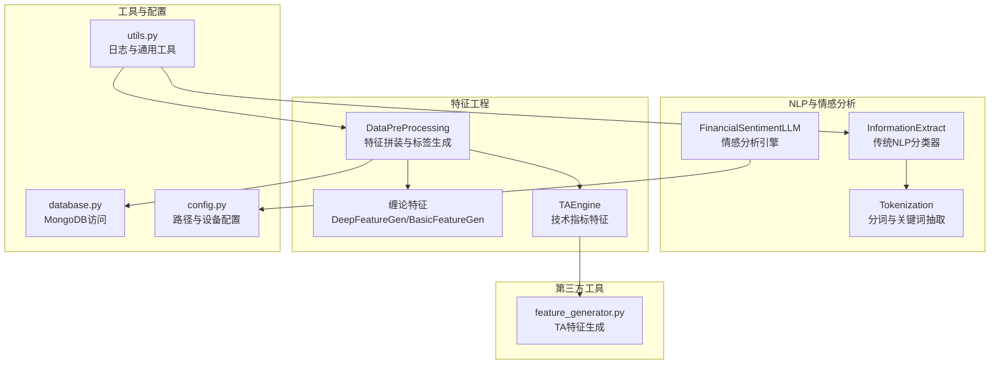
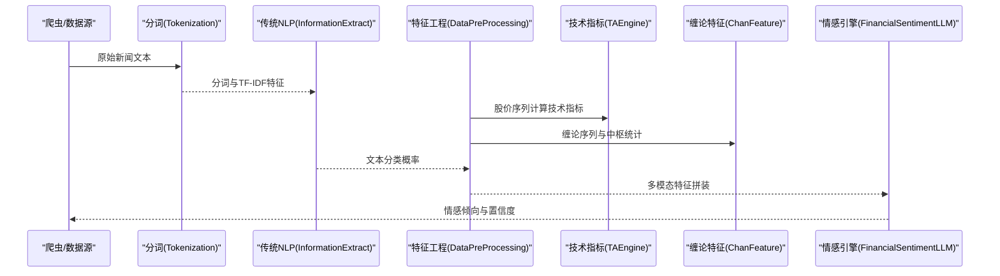
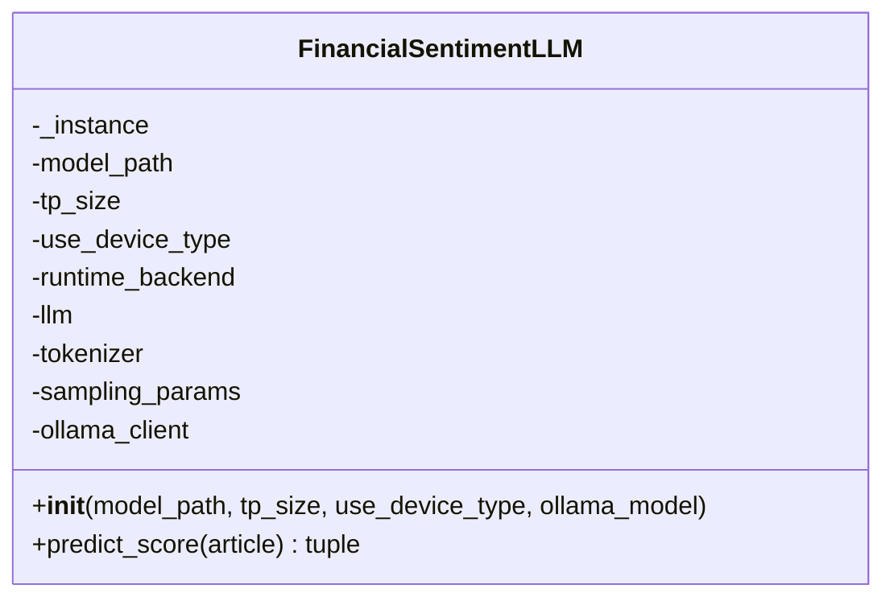
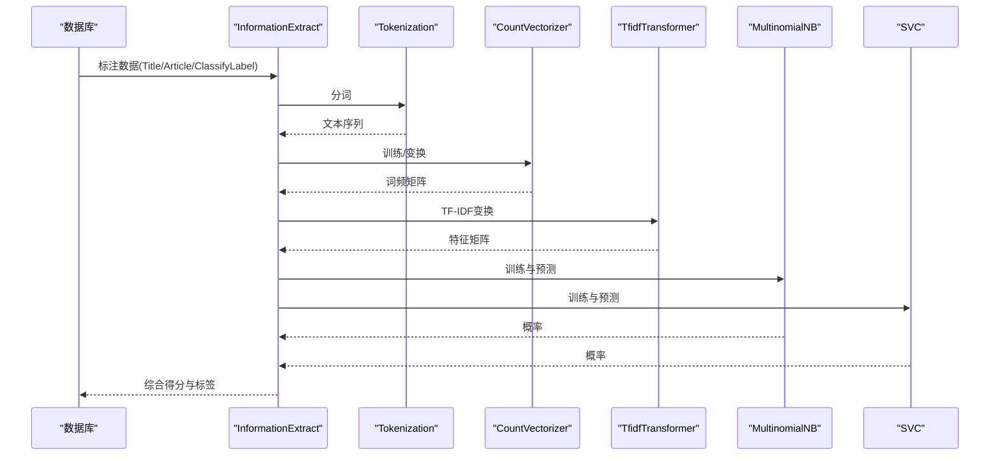
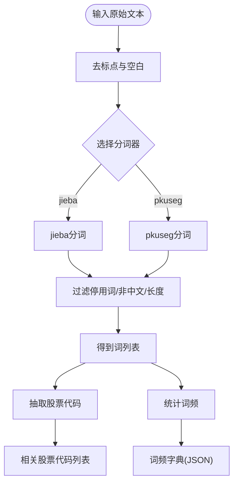
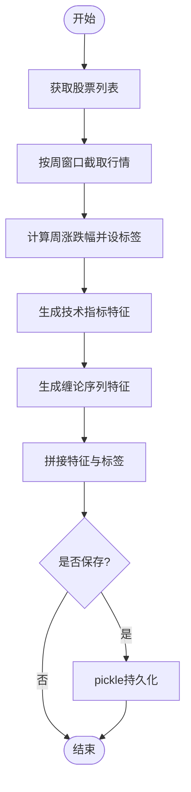
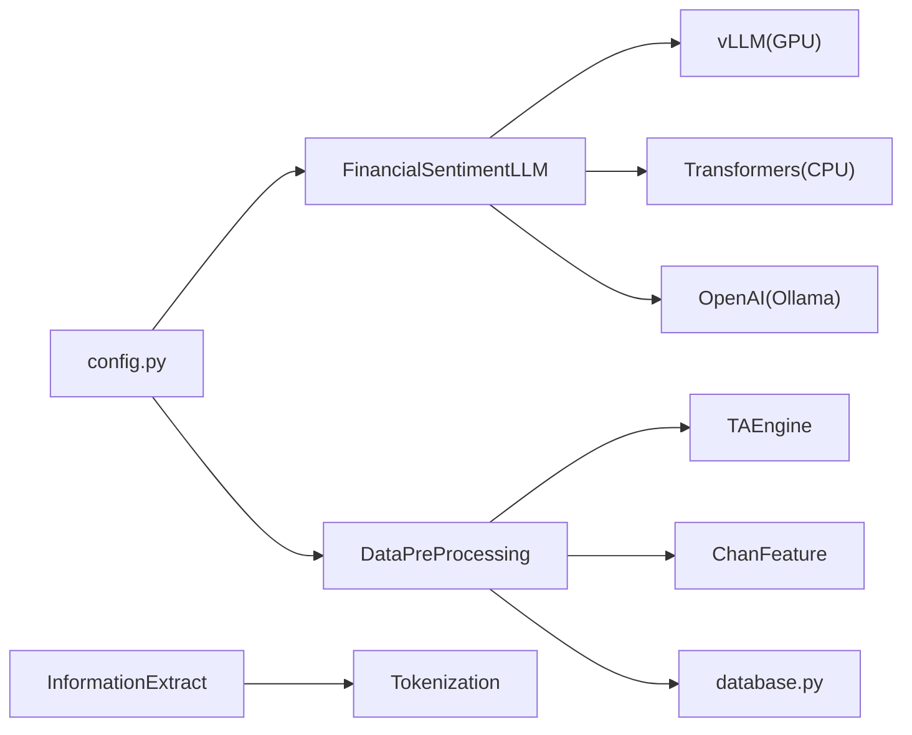

# 金融情感大模型

<cite>
**本文引用的文件**   
- [FinancialSentimentLLM.py](file://src/NlpModel/FinancialSentimentLLM.py)
- [information_extract.py](file://src/NlpModel/information_extract.py)
- [tokenization.py](file://src/NlpModel/tokenization.py)
- [DataPreProcessing.py](file://src/NlpModel/DataPreProcessing.py)
- [DeepLearningByTorch.py](file://src/NlpModel/DeepLearningByTorch.py)
- [ChanBasedLstm.py](file://src/NlpModel/ChanBasedLstm.py)
- [feature_generator.py](file://src/ThirdPartyToolSurpriver/feature_generator.py)
- [config.py](file://src/Utils/config.py)
- [utils.py](file://src/Utils/utils.py)
- [database.py](file://src/Utils/database.py)
- [README.md](file://README.md)
</cite>

## 目录
1. [简介](#简介)
2. [项目结构](#项目结构)
3. [核心组件](#核心组件)
4. [架构总览](#架构总览)
5. [详细组件分析](#详细组件分析)
6. [依赖关系分析](#依赖关系分析)
7. [性能考量](#性能考量)
8. [故障排查指南](#故障排查指南)
9. [结论](#结论)
10. [附录](#附录)

## 简介
本项目围绕“金融情感大模型”构建，目标是为金融新闻与公告提供高精度、可解释的情感倾向评分（利好/利空），并将其融入量化分析与选股体系。系统采用多模块协同：新闻采集与清洗、文本预处理与分词、传统机器学习与深度学习特征工程、以及大语言模型（LLM）情感打分。其中，FinancialSentimentLLM作为情感分析引擎，支持GPU、CPU与本地Ollama三种运行后端，具备单例模式与跨平台适配能力；同时配套传统NLP模块（InformationExtract、Tokenization）与技术分析特征（TAEngine、缠论特征）以形成完整的“文本+行情”双通道信号。

## 项目结构
项目采用按功能域划分的目录结构，NlpModel为核心NLP与情感分析模块，Utils提供通用工具与配置，ThirdPartyToolSurpriver提供技术分析特征生成器，其余目录涵盖技术分析、基本面分析、爬虫与数据处理等。

图表来源
- [FinancialSentimentLLM.py:1-167](file://src/NlpModel/FinancialSentimentLLM.py#L1-L167)
- [information_extract.py:1-424](file://src/NlpModel/information_extract.py#L1-L424)
- [tokenization.py:1-169](file://src/NlpModel/tokenization.py#L1-L169)
- [DataPreProcessing.py:1-304](file://src/NlpModel/DataPreProcessing.py#L1-L304)
- [feature_generator.py:1-186](file://src/ThirdPartyToolSurpriver/feature_generator.py#L1-L186)
- [config.py:1-455](file://src/Utils/config.py#L1-L455)
- [utils.py:1-251](file://src/Utils/utils.py#L1-L251)
- [database.py:1-176](file://src/Utils/database.py#L1-L176)

章节来源
- [README.md:1-33](file://README.md#L1-L33)
- [config.py:452-455](file://src/Utils/config.py#L452-L455)

## 核心组件
- FinancialSentimentLLM：情感分析引擎，支持GPU（vLLM）、CPU（Transformers）与本地Ollama后端，统一预测接口，返回“利好/利空”与置信度。
- InformationExtract：传统NLP分类器，结合朴素贝叶斯与SVM，基于分词与TF-IDF特征进行二分类（利好/利空），并提供模型持久化加载。
- Tokenization：中文分词与关键词抽取，支持jieba/pkuseg，内置停用词与用户词典，支持从新闻中抽取股票代码与高频词。
- DataPreProcessing：特征拼装与标签生成，整合技术分析特征（TAEngine）、缠论特征（DeepFeatureGen/BasicFeatureGen）与行情数据，生成可用于下游模型的训练/预测数据集。
- TAEngine：基于ta库计算RSI、Stochastic、CCI、EOM、AccDist等指标及其斜率/相关性统计，输出固定长度特征向量。
- 缠论特征：基于ChanLun理论生成笔/线段序列特征、中枢特征与MACD/Histogram统计特征，融合行业/概念嵌入。

章节来源
- [FinancialSentimentLLM.py:5-167](file://src/NlpModel/FinancialSentimentLLM.py#L5-L167)
- [information_extract.py:26-424](file://src/NlpModel/information_extract.py#L26-L424)
- [tokenization.py:11-169](file://src/NlpModel/tokenization.py#L11-L169)
- [DataPreProcessing.py:17-304](file://src/NlpModel/DataPreProcessing.py#L17-L304)
- [feature_generator.py:11-186](file://src/ThirdPartyToolSurpriver/feature_generator.py#L11-L186)
- [ChanFeature.py:64-325](file://src/ChanUtils/ChanFeature.py#L64-L325)

## 架构总览
金融情感大模型的整体流程由“数据采集—文本预处理—特征工程—情感打分—结果融合”构成。LLM负责最终的语义层面情感打分，传统NLP模块提供补充信号，技术分析特征与缠论特征为多模态输入提供价格行为参考。

图表来源
- [tokenization.py:77-103](file://src/NlpModel/tokenization.py#L77-L103)
- [information_extract.py:260-338](file://src/NlpModel/information_extract.py#L260-L338)
- [DataPreProcessing.py:34-102](file://src/NlpModel/DataPreProcessing.py#L34-L102)
- [feature_generator.py:31-161](file://src/ThirdPartyToolSurpriver/feature_generator.py#L31-L161)
- [ChanFeature.py:64-183](file://src/ChanUtils/ChanFeature.py#L64-L183)
- [FinancialSentimentLLM.py:108-167](file://src/NlpModel/FinancialSentimentLLM.py#L108-L167)

## 详细组件分析

### FinancialSentimentLLM 组件分析
- 设计要点
  - 单例模式避免多进程重复加载LLM，降低资源占用。
  - 自动后端选择：Darwin（macOS）默认Ollama，GPU优先vLLM，CPU使用Transformers部署。
  - 统一预测接口predict_score，返回“利好/利空”与置信度，内部解析JSON并进行阈值判定。
- 输入/输出
  - 输入：原始新闻文本（建议长度不超过4000字符）
  - 输出：二元情感标签与数值分数（0~1，越接近1表示利好概率越高）
- 关键参数
  - 温度、top_p、最大生成长度等采样参数在不同后端分别控制
  - Ollama后端支持独立的温度/采样参数与较短max_tokens
- 错误处理
  - 解析失败时返回默认“利好/0.5”，保证系统鲁棒性

图表来源
- [FinancialSentimentLLM.py:5-105](file://src/NlpModel/FinancialSentimentLLM.py#L5-L105)

章节来源
- [FinancialSentimentLLM.py:108-167](file://src/NlpModel/FinancialSentimentLLM.py#L108-L167)
- [config.py:452-455](file://src/Utils/config.py#L452-L455)

### InformationExtract 组件分析
- 设计要点
  - 基于CountVectorizer+TfidfTransformer构造文本特征，结合朴素贝叶斯与SVM进行二分类。
  - 支持从数据库集合读取标注数据，按规则生成标签，训练后持久化模型与向量化器。
  - 提供predict_score综合两个模型的概率，输出“利好/利空”与置信度。
- 数据流
  - 从多个新闻库集合读取标题/正文/词频，合并后生成规则标签与训练集。
  - 训练完成后，对未知样本进行预测并输出概率。

图表来源
- [information_extract.py:260-338](file://src/NlpModel/information_extract.py#L260-L338)
- [tokenization.py:77-103](file://src/NlpModel/tokenization.py#L77-L103)

章节来源
- [information_extract.py:26-424](file://src/NlpModel/information_extract.py#L26-L424)

### Tokenization 组件分析
- 功能
  - 中文分词（jieba/pkuseg），去除标点与停用词，保留中文词汇。
  - 从新闻中抽取股票名称对应的代码，统计词频并输出JSON。
- 应用场景
  - 为InformationExtract提供分词文本，也为数据库增量字段“相关股票代码”提供抽取能力。

图表来源
- [tokenization.py:77-103](file://src/NlpModel/tokenization.py#L77-L103)
- [tokenization.py:27-75](file://src/NlpModel/tokenization.py#L27-L75)

章节来源
- [tokenization.py:11-169](file://src/NlpModel/tokenization.py#L11-L169)

### DataPreProcessing 组件分析
- 功能
  - 从行情数据中截取指定时间窗口，生成周涨跌幅标签，二值化或四分位化。
  - 调用TAEngine与缠论特征生成器，拼接技术指标与序列特征，形成统一特征集。
  - 支持直接从pickle文件加载特征，加速离线训练/预测。
- 关键流程
  - 获取股票基础信息与行情数据 → 截取子序列 → 计算标签 → 生成特征 → 保存/加载数据集。

图表来源
- [DataPreProcessing.py:119-301](file://src/NlpModel/DataPreProcessing.py#L119-L301)
- [feature_generator.py:31-161](file://src/ThirdPartyToolSurpriver/feature_generator.py#L31-L161)
- [ChanFeature.py:64-183](file://src/ChanUtils/ChanFeature.py#L64-L183)

章节来源
- [DataPreProcessing.py:17-304](file://src/NlpModel/DataPreProcessing.py#L17-L304)

### 技术分析特征（TAEngine）与缠论特征（ChanFeature）
- TAEngine
  - 计算RSI、Stochastic、CCI、EOM、AccDist等指标，附加斜率与相关性统计，输出固定长度特征向量。
- 缠论特征
  - 生成笔/线段顶底序列、长度序列、角度序列、成交量序列与中枢统计特征，并融合行业/概念嵌入。

章节来源
- [feature_generator.py:11-186](file://src/ThirdPartyToolSurpriver/feature_generator.py#L11-L186)
- [ChanFeature.py:64-325](file://src/ChanUtils/ChanFeature.py#L64-L325)

### 深度学习与LSTM（可选）
- DeepLearningByTorch：基于TextCNN与自定义数据集进行训练，整合技术指标与缠论特征。
- ChanBasedLstm：LSTM字符级语言模型示例，展示序列建模思路（可迁移至文本序列建模）。

章节来源
- [DeepLearningByTorch.py:1-119](file://src/NlpModel/DeepLearningByTorch.py#L1-L119)
- [ChanBasedLstm.py:1-147](file://src/NlpModel/ChanBasedLstm.py#L1-L147)

## 依赖关系分析
- 运行时后端
  - GPU：vLLM + SamplingParams，适合大批量推理与低延迟。
  - CPU：Transformers AutoModel/AutoTokenizer，支持bf16与cache优化。
  - Ollama：通过OpenAI兼容客户端调用本地模型，适合轻量部署。
- 外部依赖
  - vLLM（GPU）、transformers（CPU）、openai（Ollama）、ta（技术指标）、pymongo（数据库）、joblib/pickle（模型持久化）。

图表来源
- [FinancialSentimentLLM.py:61-104](file://src/NlpModel/FinancialSentimentLLM.py#L61-L104)
- [DataPreProcessing.py:27-29](file://src/NlpModel/DataPreProcessing.py#L27-L29)
- [config.py:452-455](file://src/Utils/config.py#L452-L455)

章节来源
- [FinancialSentimentLLM.py:61-104](file://src/NlpModel/FinancialSentimentLLM.py#L61-L104)
- [config.py:9-9](file://src/Utils/config.py#L9-L9)

## 性能考量
- 推理性能
  - GPU后端建议使用vLLM并行张量（tensor_parallel_size）以提升吞吐；合理设置max_model_len与gpu_memory_utilization。
  - CPU后端启用bf16与use_cache，减少内存占用与推理时间。
  - Ollama后端可调低max_tokens与温度，提高响应速度。
- 数据与特征
  - 特征拼装阶段尽量复用pickle缓存，避免重复计算技术指标与缠论序列。
  - 对长文本进行截断（如限制4000字符），确保LLM输入稳定。
- 模型持久化
  - 传统NLP模型与向量化器持久化后可快速加载，减少训练开销。

## 故障排查指南
- 模型加载失败
  - 检查模型路径与设备类型配置，确认GPU/CPU/Ollama后端可用。
  - Darwin平台默认走Ollama，需确保本地Ollama服务与模型镜像可用。
- 推理异常
  - predict_score内部对JSON解析失败时会返回默认值，若持续异常，检查提示模板与输出格式一致性。
- 数据库连接问题
  - database.py提供自动重连装饰器，注意网络抖动与超时设置。
- 特征维度不一致
  - DataPreProcessing在拼接特征时会过滤空值与长度不一致样本，确保上游数据质量。

章节来源
- [FinancialSentimentLLM.py:108-167](file://src/NlpModel/FinancialSentimentLLM.py#L108-L167)
- [database.py:15-33](file://src/Utils/database.py#L15-L33)
- [DataPreProcessing.py:270-286](file://src/NlpModel/DataPreProcessing.py#L270-L286)

## 结论
本项目通过“传统NLP + 技术分析 + 大语言模型”的多路信号融合，构建了面向金融文本的情感分析体系。FinancialSentimentLLM作为核心引擎，具备跨平台部署能力与稳定的预测接口；InformationExtract与Tokenization提供互补的文本信号；DataPreProcessing与TAEngine/缠论特征为多模态输入奠定基础。建议在生产环境中结合GPU后端与特征缓存策略，以获得更高的吞吐与稳定性。

## 附录

### 使用示例与API调用方法
- 加载与预测（FinancialSentimentLLM）
  - 初始化：传入模型路径、设备类型与Ollama模型名
  - 调用：predict_score(article) 返回标签与置信度
- 传统NLP分类（InformationExtract）
  - 训练：build_2_class_classify_model(force_train_model)
  - 预测：predict_score(text) 返回“利好/利空”与概率
- 特征工程（DataPreProcessing）
  - 获取标签与特征：get_label(...)，随后拼接技术指标与缠论特征
- 分词与抽取（Tokenization）
  - 分词：cut_words(ori_text)
  - 股票代码抽取：find_relevant_stock_codes_in_article(...)

章节来源
- [FinancialSentimentLLM.py:19-105](file://src/NlpModel/FinancialSentimentLLM.py#L19-L105)
- [information_extract.py:260-338](file://src/NlpModel/information_extract.py#L260-L338)
- [DataPreProcessing.py:119-301](file://src/NlpModel/DataPreProcessing.py#L119-L301)
- [tokenization.py:77-103](file://src/NlpModel/tokenization.py#L77-L103)

### 模型版本管理与更新维护最佳实践
- 配置集中化：通过config.py统一管理模型路径、设备类型与Ollama模型名，便于切换与回滚。
- 持久化策略：传统NLP模型与向量化器使用joblib/pickle持久化，避免每次启动重新训练。
- 特征缓存：DataPreProcessing支持pickle缓存，减少重复计算成本。
- 后端切换：根据硬件条件自动选择GPU/CPU/Ollama，必要时手动覆盖use_device_type。
- 日志与监控：利用utils.py提供的日志配置，记录关键步骤与异常，便于追踪与排障。

章节来源
- [config.py:452-455](file://src/Utils/config.py#L452-L455)
- [utils.py:18-27](file://src/Utils/utils.py#L18-L27)
- [information_extract.py:104-107](file://src/NlpModel/information_extract.py#L104-L107)
- [DataPreProcessing.py:291-294](file://src/NlpModel/DataPreProcessing.py#L291-L294)