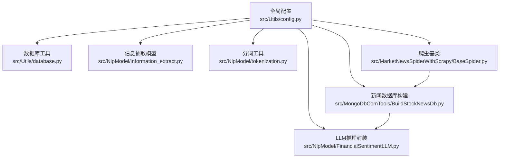
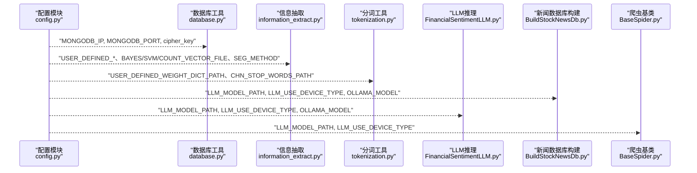
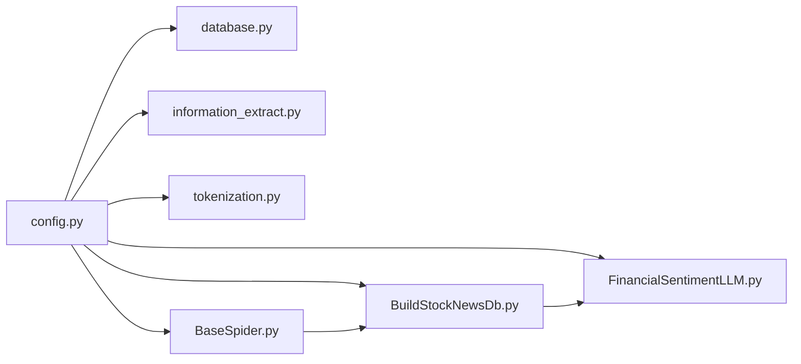

# 全局配置

<cite>
**本文引用的文件**
- [config.py](file://src/Utils/config.py)
- [database.py](file://src/Utils/database.py)
- [BuildStockNewsDb.py](file://src/MongoDbComTools/BuildStockNewsDb.py)
- [information_extract.py](file://src/NlpModel/information_extract.py)
- [tokenization.py](file://src/NlpModel/tokenization.py)
- [FinancialSentimentLLM.py](file://src/NlpModel/FinancialSentimentLLM.py)
- [BaseSpider.py](file://src/MarketNewsSpiderWithScrapy/BaseSpider.py)
</cite>

## 目录
1. [简介](#简介)
2. [项目结构与配置位置](#项目结构与配置位置)
3. [核心配置分类与作用域](#核心配置分类与作用域)
4. [架构概览与配置交互](#架构概览与配置交互)
5. [详细配置项分析](#详细配置项分析)
6. [依赖关系与耦合分析](#依赖关系与耦合分析)
7. [性能考量与优化建议](#性能考量与优化建议)
8. [故障排查与验证方法](#故障排查与验证方法)
9. [结论](#结论)

## 简介
本文件系统性梳理项目中的全局配置体系，重点围绕 src/Utils/config.py 中的配置常量与变量，解释其在数据库连接、路径配置、设备配置、模型配置等方面的用途与影响范围，并给出配置优先级规则、安全注意事项与验证方法，帮助开发者快速理解并正确使用这些核心配置参数。

## 项目结构与配置位置
- 全局配置集中于 src/Utils/config.py，被多个模块按需导入使用，包括数据库工具、NLP模型、爬虫框架等。
- 关键使用点包括：
  - 数据库连接：Utils/database.py 读取 MONGODB_IP、MONGODB_PORT、cipher_key
  - NLP模型与路径：NlpModel/information_extract.py、NlpModel/tokenization.py 读取 USER_DEFINED_DICT_PATH、USER_DEFINED_WEIGHT_DICT_PATH、CHN_STOP_WORDS_PATH、BAYES_MODEL_FILE、SVM_MODEL_FILE、COUNT_VECTOR_FILE、SEG_METHOD
  - LLM推理：MongoDbComTools/BuildStockNewsDb.py、NlpModel/FinancialSentimentLLM.py 读取 LLM_MODEL_PATH、LLM_USE_DEVICE_TYPE、OLLAMA_MODEL
  - 爬虫与新闻处理：MarketNewsSpiderWithScrapy/BaseSpider.py 使用 LLM_MODEL_PATH、LLM_USE_DEVICE_TYPE

**图表来源**
- [config.py:13-16](file://src/Utils/config.py#L13-L16)
- [config.py:30-37](file://src/Utils/config.py#L30-L37)
- [config.py:452-455](file://src/Utils/config.py#L452-L455)
- [database.py:38-40](file://src/Utils/database.py#L38-L40)
- [information_extract.py:47-51](file://src/NlpModel/information_extract.py#L47-L51)
- [tokenization.py:12-23](file://src/NlpModel/tokenization.py#L12-L23)
- [BuildStockNewsDb.py:46-52](file://src/MongoDbComTools/BuildStockNewsDb.py#L46-L52)
- [FinancialSentimentLLM.py:19-59](file://src/NlpModel/FinancialSentimentLLM.py#L19-L59)
- [BaseSpider.py:66-83](file://src/MarketNewsSpiderWithScrapy/BaseSpider.py#L66-L83)

**章节来源**
- [config.py:1-455](file://src/Utils/config.py#L1-L455)
- [database.py:1-176](file://src/Utils/database.py#L1-L176)
- [information_extract.py:1-424](file://src/NlpModel/information_extract.py#L1-L424)
- [tokenization.py:1-169](file://src/NlpModel/tokenization.py#L1-L169)
- [BuildStockNewsDb.py:1-241](file://src/MongoDbComTools/BuildStockNewsDb.py#L1-L241)
- [FinancialSentimentLLM.py:1-167](file://src/NlpModel/FinancialSentimentLLM.py#L1-L167)
- [BaseSpider.py:1-149](file://src/MarketNewsSpiderWithScrapy/BaseSpider.py#L1-L149)

## 核心配置分类与作用域
- 数据库配置
  - MONGODB_IP、MONGODB_PORT：MongoDB 连接地址与端口，由数据库工具模块读取并建立连接。
  - cipher_key：数据库认证密钥（加密存储），用于解密用户名与密码。
- 路径配置
  - USER_DEFINED_DICT_PATH、USER_DEFINED_WEIGHT_DICT_PATH：自定义词典与权重词典路径，供分词模块加载用户词典。
  - CHN_STOP_WORDS_PATH：中文停用词目录路径，供分词模块加载停用词。
  - BAYES_MODEL_FILE、SVM_MODEL_FILE、COUNT_VECTOR_FILE：朴素贝叶斯、SVM 分类模型与向量化器持久化文件路径。
  - LLM_MODEL_PATH：本地大语言模型路径；OLLAMA_MODEL：Ollama 模型名；LLM_USE_DEVICE_TYPE：推理设备类型（gpu/cpu）。
- 设备配置
  - GPU_MODE：根据操作系统自动设置 GPU 开关（Darwin/macOS 默认禁用 GPU，其他平台启用 GPU）。
- 数据库命名与集合配置
  - STOCK_DATABASE_NAME、COLLECTION_NAME_STOCK_BASIC_INFO 等：股票基础信息数据库与集合名称。
  - HK_STOCK_DATABASE_NAME、US_STOCK_DATABASE_NAME 等：港股、美股数据库与集合名称。
- 爬虫与新闻源配置
  - 多个新闻源的数据库名与集合字典（如 EAST_MONEY_NEWS_DB、JRJ_NEWS_DB 等），以及各站点的起始 URL、关键词、结束页等参数。
- 其他配置
  - LATEST_DAY_OR_PAGE_SETTING：最新新闻抓取的天数或页数设置。
  - CHROME_DRIVER：ChromeDriver 路径（根据操作系统选择）。

**章节来源**
- [config.py:9-16](file://src/Utils/config.py#L9-L16)
- [config.py:18-19](file://src/Utils/config.py#L18-L19)
- [config.py:21-23](file://src/Utils/config.py#L21-L23)
- [config.py:25-27](file://src/Utils/config.py#L25-L27)
- [config.py:29-37](file://src/Utils/config.py#L29-L37)
- [config.py:39-49](file://src/Utils/config.py#L39-L49)
- [config.py:452-455](file://src/Utils/config.py#L452-L455)

## 架构概览与配置交互
- 配置作为单一事实来源，被多个子系统读取：
  - 数据库层：database.py 读取 MONGODB_IP、MONGODB_PORT、cipher_key，建立 MongoDB 客户端。
  - NLP 层：information_extract.py 与 tokenization.py 读取词典、停用词、模型文件路径，构建与加载模型。
  - 推理层：BuildStockNewsDb.py 与 FinancialSentimentLLM.py 读取 LLM_MODEL_PATH、LLM_USE_DEVICE_TYPE、OLLAMA_MODEL，决定推理后端与设备。
  - 爬虫层：BaseSpider.py 使用 LLM_MODEL_PATH、LLM_USE_DEVICE_TYPE 进行新闻评分融合。

**图表来源**
- [config.py:13-16](file://src/Utils/config.py#L13-L16)
- [config.py:29-37](file://src/Utils/config.py#L29-L37)
- [config.py:452-455](file://src/Utils/config.py#L452-L455)
- [database.py:38-40](file://src/Utils/database.py#L38-L40)
- [information_extract.py:47-51](file://src/NlpModel/information_extract.py#L47-L51)
- [tokenization.py:12-23](file://src/NlpModel/tokenization.py#L12-L23)
- [BuildStockNewsDb.py:46-52](file://src/MongoDbComTools/BuildStockNewsDb.py#L46-L52)
- [FinancialSentimentLLM.py:19-59](file://src/NlpModel/FinancialSentimentLLM.py#L19-L59)
- [BaseSpider.py:66-83](file://src/MarketNewsSpiderWithScrapy/BaseSpider.py#L66-L83)

**章节来源**
- [database.py:36-60](file://src/Utils/database.py#L36-L60)
- [information_extract.py:26-60](file://src/NlpModel/information_extract.py#L26-L60)
- [tokenization.py:11-24](file://src/NlpModel/tokenization.py#L11-L24)
- [BuildStockNewsDb.py:19-52](file://src/MongoDbComTools/BuildStockNewsDb.py#L19-L52)
- [FinancialSentimentLLM.py:5-105](file://src/NlpModel/FinancialSentimentLLM.py#L5-L105)
- [BaseSpider.py:13-98](file://src/MarketNewsSpiderWithScrapy/BaseSpider.py#L13-L98)

## 详细配置项分析

### 数据库配置
- MONGODB_IP、MONGODB_PORT
  - 作用：指定 MongoDB 服务器地址与端口，供数据库工具初始化客户端。
  - 使用场景：数据库连接、集合查询与写入。
  - 影响范围：所有依赖数据库的模块。
  - 最佳实践：
    - 生产环境建议使用内网 IP 与防火墙限制访问。
    - 如需认证，结合 cipher_key 解密后的凭据使用。
- cipher_key
  - 作用：用于解密存储的用户名与密码（通过 Fernet 对称加密）。
  - 使用场景：数据库连接时解密凭据。
  - 最佳实践：
    - 严格保护 cipher_key，避免硬编码在仓库中。
    - 使用环境变量或密钥管理服务注入。

**章节来源**
- [config.py:13-16](file://src/Utils/config.py#L13-L16)
- [config.py](file://src/Utils/config.py#L25)
- [database.py:38-59](file://src/Utils/database.py#L38-L59)

### 路径配置
- USER_DEFINED_DICT_PATH、USER_DEFINED_WEIGHT_DICT_PATH
  - 作用：自定义词典与权重词典路径，用于 jieba 用户词典加载。
  - 使用场景：分词阶段提升金融领域识别精度。
  - 最佳实践：
    - 确保路径可读且文件存在。
    - 权重词典与普通词典配合使用，避免冲突。
- CHN_STOP_WORDS_PATH
  - 作用：中文停用词目录，供分词模块加载停用词列表。
  - 使用场景：过滤无意义词汇，提高特征质量。
  - 最佳实践：
    - 统一管理停用词集合，定期更新。
- BAYES_MODEL_FILE、SVM_MODEL_FILE、COUNT_VECTOR_FILE
  - 作用：朴素贝叶斯、SVM 分类模型与 CountVectorizer 的持久化文件路径。
  - 使用场景：文本分类与特征向量化。
  - 最佳实践：
    - 模型文件随项目版本管理，确保一致性。
    - 更新模型时同步更新对应文件路径。

**章节来源**
- [config.py:30-32](file://src/Utils/config.py#L30-L32)
- [config.py:34-37](file://src/Utils/config.py#L34-L37)
- [information_extract.py:47-51](file://src/NlpModel/information_extract.py#L47-L51)
- [information_extract.py:97-106](file://src/NlpModel/information_extract.py#L97-L106)
- [tokenization.py:12-23](file://src/NlpModel/tokenization.py#L12-L23)

### 设备配置
- GPU_MODE
  - 作用：根据操作系统自动设置 GPU 开关（Darwin/macOS 默认禁用 GPU，其他平台启用 GPU）。
  - 使用场景：控制后续推理后端选择（如 vLLM GPU 或 Transformers CPU）。
  - 最佳实践：
    - 在 macOS 上默认关闭 GPU，避免兼容性问题。
    - 如需强制启用 GPU，可在部署脚本中覆盖该行为。
- LLM_USE_DEVICE_TYPE
  - 作用：指定 LLM 推理设备类型（gpu/cpu），影响推理后端选择。
  - 使用场景：控制 vLLM GPU、Transformers CPU 或 Ollama 后端。
  - 最佳实践：
    - 与 LLM_MODEL_PATH 配合使用，确保模型与设备兼容。
    - 在资源受限环境下优先选择 CPU 后端。

**章节来源**
- [config.py](file://src/Utils/config.py#L9)
- [config.py:453-454](file://src/Utils/config.py#L453-L454)
- [FinancialSentimentLLM.py:19-59](file://src/NlpModel/FinancialSentimentLLM.py#L19-L59)

### 模型配置
- LLM_MODEL_PATH
  - 作用：本地大语言模型路径，用于 vLLM GPU 或 Transformers CPU 后端。
  - 使用场景：新闻情感评分与融合。
  - 最佳实践：
    - 确保模型路径存在且可读。
    - 根据显存大小选择合适模型（如 Qwen3-4B CPU 版本）。
- OLLAMA_MODEL
  - 作用：Ollama 后端使用的模型名。
  - 使用场景：macOS 平台默认走 Ollama。
  - 最佳实践：
    - 确保 Ollama 服务运行且可用。
    - 与 LLM_USE_DEVICE_TYPE 协同使用。

**章节来源**
- [config.py:452-455](file://src/Utils/config.py#L452-L455)
- [BuildStockNewsDb.py:46-52](file://src/MongoDbComTools/BuildStockNewsDb.py#L46-L52)
- [FinancialSentimentLLM.py:19-59](file://src/NlpModel/FinancialSentimentLLM.py#L19-L59)

### 数据库命名与集合配置
- STOCK_DATABASE_NAME、COLLECTION_NAME_STOCK_BASIC_INFO 等
  - 作用：股票基础信息数据库与集合名称，区分中国、港股、美股。
  - 使用场景：爬虫与数据库工具读取股票基础信息。
  - 最佳实践：
    - 不同市场使用独立数据库，避免命名冲突。
    - 集合命名规范统一，便于维护。

**章节来源**
- [config.py:39-49](file://src/Utils/config.py#L39-L49)

### 爬虫与新闻源配置
- 各新闻源数据库名与集合字典（如 EAST_MONEY_NEWS_DB、JRJ_NEWS_DB 等）
  - 作用：定义不同新闻源的数据库名、起始 URL、关键词、结束页等。
  - 使用场景：爬虫初始化与请求构造。
  - 最佳实践：
    - 定期检查目标站点结构变化，调整 end_page 与 URL。
    - 为每个站点维护清晰的配置注释。

**章节来源**
- [config.py:55-450](file://src/Utils/config.py#L55-L450)

## 依赖关系与耦合分析
- 配置模块与使用模块的耦合
  - database.py 直接依赖 config 中的数据库连接参数与密钥。
  - information_extract.py 与 tokenization.py 依赖词典、停用词与模型文件路径。
  - BuildStockNewsDb.py 与 FinancialSentimentLLM.py 依赖 LLM 路径与设备类型。
  - BaseSpider.py 依赖 LLM 路径与设备类型进行评分融合。
- 潜在风险
  - 配置路径错误会导致模块初始化失败。
  - 设备类型与模型不匹配可能导致推理异常。
  - 密钥泄露会危及数据库访问安全。

**图表来源**
- [config.py:1-455](file://src/Utils/config.py#L1-L455)
- [database.py:10-60](file://src/Utils/database.py#L10-L60)
- [information_extract.py:9-51](file://src/NlpModel/information_extract.py#L9-L51)
- [tokenization.py:4-23](file://src/NlpModel/tokenization.py#L4-L23)
- [BuildStockNewsDb.py:6-52](file://src/MongoDbComTools/BuildStockNewsDb.py#L6-L52)
- [FinancialSentimentLLM.py:5-59](file://src/NlpModel/FinancialSentimentLLM.py#L5-L59)
- [BaseSpider.py:5-33](file://src/MarketNewsSpiderWithScrapy/BaseSpider.py#L5-L33)

**章节来源**
- [database.py:36-60](file://src/Utils/database.py#L36-L60)
- [information_extract.py:26-60](file://src/NlpModel/information_extract.py#L26-L60)
- [tokenization.py:11-24](file://src/NlpModel/tokenization.py#L11-L24)
- [BuildStockNewsDb.py:19-52](file://src/MongoDbComTools/BuildStockNewsDb.py#L19-L52)
- [FinancialSentimentLLM.py:5-105](file://src/NlpModel/FinancialSentimentLLM.py#L5-L105)
- [BaseSpider.py:13-33](file://src/MarketNewsSpiderWithScrapy/BaseSpider.py#L13-L33)

## 性能考量与优化建议
- 数据库连接
  - 使用连接池与超时设置，避免频繁重建连接。
  - 在高并发场景下合理设置 maxPoolSize。
- 模型加载
  - 将模型文件放置在高速磁盘，减少加载时间。
  - 在 GPU 可用时优先使用 vLLM，CPU 场景使用 Transformers。
- 分词与特征
  - 合理使用用户词典与停用词，减少无效特征。
  - 模型文件持久化，避免重复训练。
- 设备选择
  - GPU_MODE 与 LLM_USE_DEVICE_TYPE 应与硬件能力匹配，避免过度占用资源。

[本节为通用建议，无需特定文件来源]

## 故障排查与验证方法
- 配置路径验证
  - 使用操作系统命令检查路径是否存在且可读。
  - 在模块初始化前打印关键路径，确认加载成功。
- 数据库连接验证
  - 使用 ping 或最小查询验证连接可用性。
  - 检查 cipher_key 是否正确解密凭据。
- 模型加载验证
  - 检查模型文件是否存在且可读。
  - 在推理前进行一次预热调用，捕获异常。
- 设备类型验证
  - 在推理初始化时打印 runtime_backend，确认后端选择正确。
- 日志与错误处理
  - 在关键流程添加日志记录，便于定位问题。
  - 对异常进行分类处理，避免程序崩溃。

**章节来源**
- [database.py:44-60](file://src/Utils/database.py#L44-L60)
- [information_extract.py:97-106](file://src/NlpModel/information_extract.py#L97-L106)
- [FinancialSentimentLLM.py:50-59](file://src/NlpModel/FinancialSentimentLLM.py#L50-L59)

## 结论
全局配置模块是系统运行的基础，贯穿数据库、NLP、推理与爬虫等多个环节。通过明确配置分类、作用域与使用场景，并遵循最佳实践与验证方法，可以有效降低配置错误带来的风险，提升系统的稳定性与可维护性。建议在团队内形成配置变更流程与文档，确保配置的一致性与安全性。