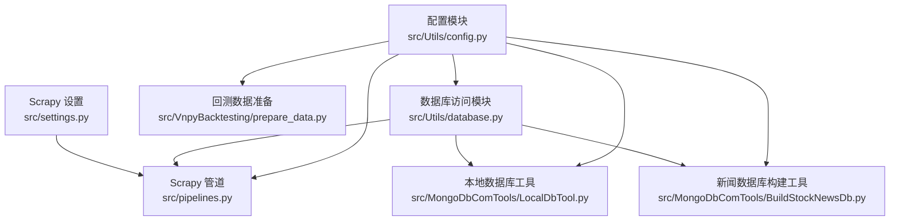
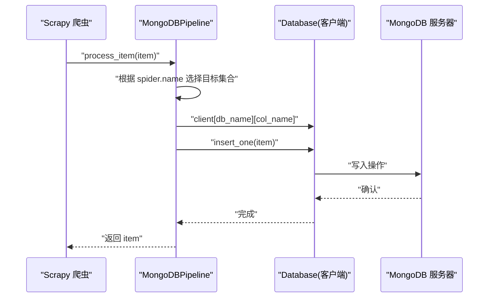
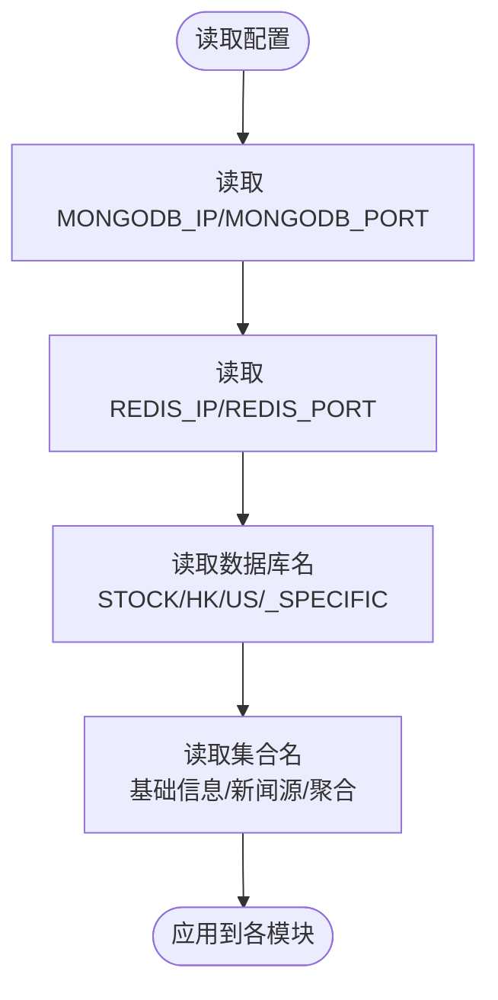
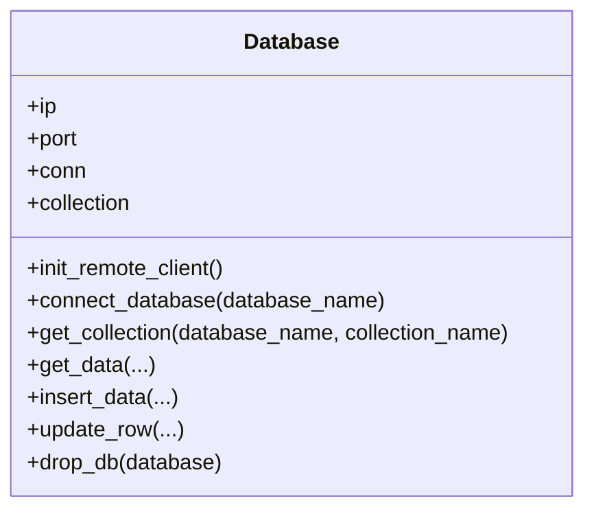
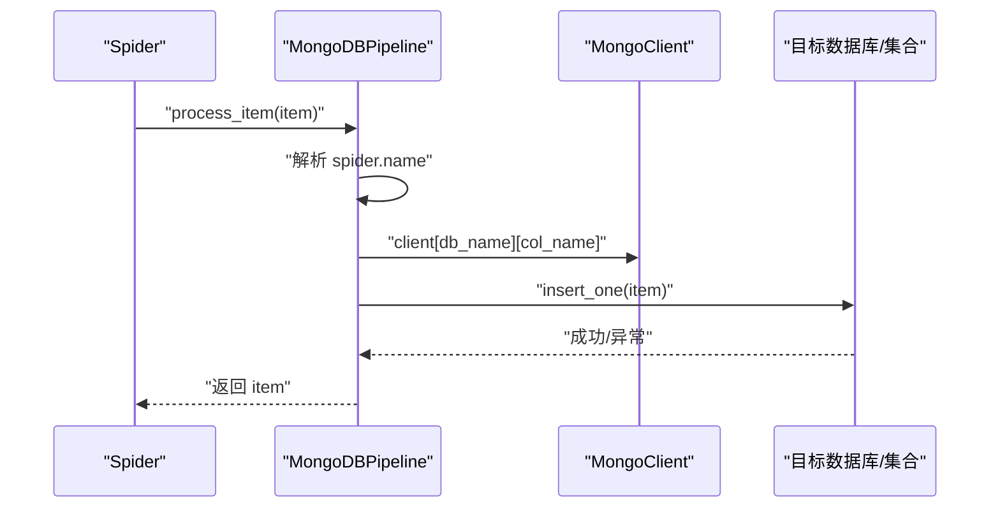
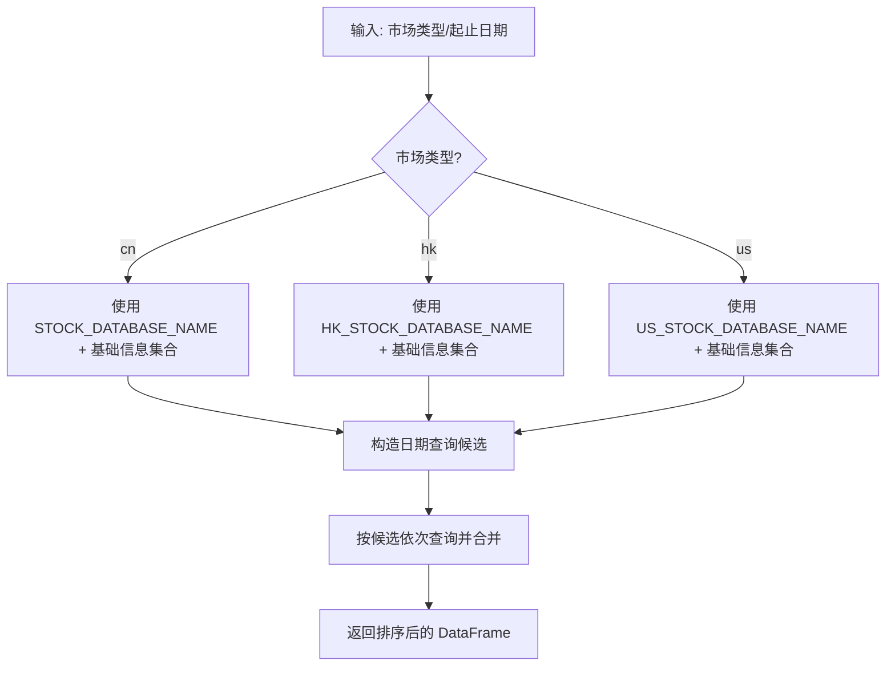
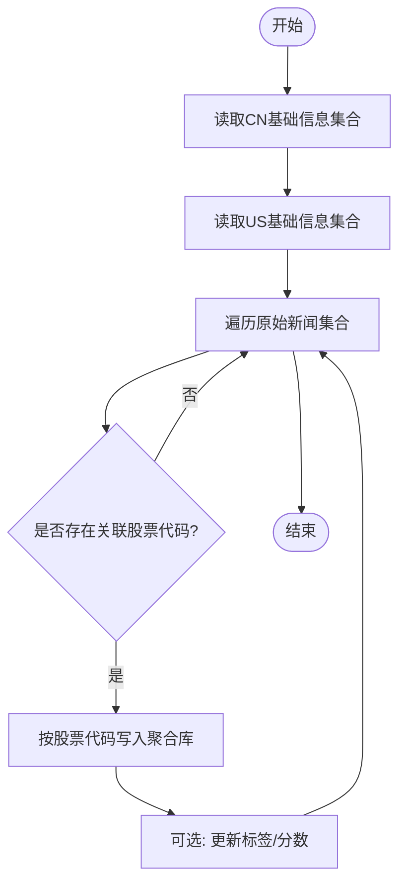
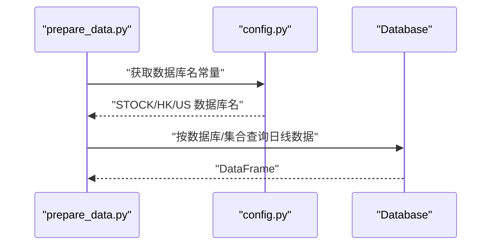
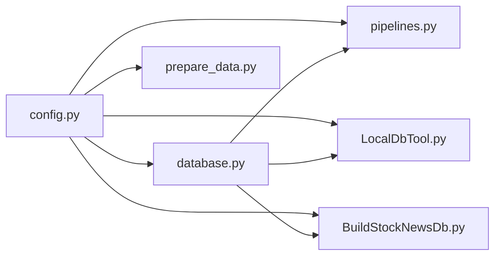

# 数据库配置

<cite>
**本文引用的文件**   
- [src/Utils/config.py](file://src/Utils/config.py)
- [src/Utils/database.py](file://src/Utils/database.py)
- [src/pipelines.py](file://src/pipelines.py)
- [src/MongoDbComTools/LocalDbTool.py](file://src/MongoDbComTools/LocalDbTool.py)
- [src/MongoDbComTools/BuildStockNewsDb.py](file://src/MongoDbComTools/BuildStockNewsDb.py)
- [src/VnpyBacktesting/prepare_data.py](file://src/VnpyBacktesting/prepare_data.py)
- [src/settings.py](file://src/settings.py)
</cite>

## 目录
1. [简介](#简介)
2. [项目结构](#项目结构)
3. [核心组件](#核心组件)
4. [架构总览](#架构总览)
5. [详细组件分析](#详细组件分析)
6. [依赖分析](#依赖分析)
7. [性能考量](#性能考量)
8. [故障排查指南](#故障排查指南)
9. [结论](#结论)
10. [附录](#附录)

## 简介
本文件系统性梳理该项目的数据库配置体系，重点覆盖以下方面：
- MongoDB 与 Redis 的配置参数（连接地址、端口、认证信息等）
- 数据库与集合命名规范（如 STOCK_DATABASE_NAME、COLLECTION_NAME_STOCK_BASIC_INFO 等）
- 不同地区股票数据库的配置差异（CN/HK/US）
- 数据库连接池配置与性能调优参数
- 环境变量支持与动态加载机制
- 备份与恢复策略建议
- 安全与访问控制注意事项
- 多数据库连接的正确配置与管理

## 项目结构
与数据库配置直接相关的模块分布如下：
- 配置层：集中于配置文件，定义数据库主机、端口、数据库名、集合名、加密密钥等
- 数据库访问层：封装 MongoDB 客户端初始化、连接池参数、自动重连与查询封装
- 爬虫与管道：Scrapy 管道将采集到的新闻数据写入 MongoDB 对应数据库/集合
- 工具与业务：本地数据库工具按市场类型选择数据库/集合；回测准备脚本按市场解析数据库名
- 配置与运行：settings.py 控制爬虫并发与中间件，间接影响数据库写入压力

**图表来源**
- [src/Utils/config.py:13-49](file://src/Utils/config.py#L13-L49)
- [src/Utils/database.py:36-60](file://src/Utils/database.py#L36-L60)
- [src/pipelines.py:8-22](file://src/pipelines.py#L8-L22)
- [src/MongoDbComTools/LocalDbTool.py:10-46](file://src/MongoDbComTools/LocalDbTool.py#L10-L46)
- [src/MongoDbComTools/BuildStockNewsDb.py:19-53](file://src/MongoDbComTools/BuildStockNewsDb.py#L19-L53)
- [src/VnpyBacktesting/prepare_data.py:306-317](file://src/VnpyBacktesting/prepare_data.py#L306-L317)
- [src/settings.py:18-34](file://src/settings.py#L18-L34)

**章节来源**
- [src/Utils/config.py:13-49](file://src/Utils/config.py#L13-L49)
- [src/Utils/database.py:36-60](file://src/Utils/database.py#L36-L60)
- [src/pipelines.py:8-22](file://src/pipelines.py#L8-L22)
- [src/MongoDbComTools/LocalDbTool.py:10-46](file://src/MongoDbComTools/LocalDbTool.py#L10-L46)
- [src/MongoDbComTools/BuildStockNewsDb.py:19-53](file://src/MongoDbComTools/BuildStockNewsDb.py#L19-L53)
- [src/VnpyBacktesting/prepare_data.py:306-317](file://src/VnpyBacktesting/prepare_data.py#L306-L317)
- [src/settings.py:18-34](file://src/settings.py#L18-L34)

## 核心组件
- 配置模块：集中定义 MongoDB 与 Redis 的 IP/端口、数据库名、集合名、加密密钥等
- 数据库访问类：封装 MongoClient 初始化、连接池参数、自动重连装饰器、通用查询与插入接口
- Scrapy 管道：根据爬虫名称将数据写入对应数据库/集合
- 本地数据库工具：按市场类型选择数据库/集合，支持日期范围查询与排序
- 新闻数据库构建工具：按股票维度聚合新闻，生成特定股票的新闻集合
- 回测准备脚本：按市场类型解析数据库名，读取日线数据

**章节来源**
- [src/Utils/config.py:13-49](file://src/Utils/config.py#L13-L49)
- [src/Utils/database.py:36-176](file://src/Utils/database.py#L36-L176)
- [src/pipelines.py:8-56](file://src/pipelines.py#L8-L56)
- [src/MongoDbComTools/LocalDbTool.py:10-276](file://src/MongoDbComTools/LocalDbTool.py#L10-L276)
- [src/MongoDbComTools/BuildStockNewsDb.py:19-241](file://src/MongoDbComTools/BuildStockNewsDb.py#L19-L241)
- [src/VnpyBacktesting/prepare_data.py:306-338](file://src/VnpyBacktesting/prepare_data.py#L306-L338)

## 架构总览
下图展示从配置到数据写入与读取的关键路径。

**图表来源**
- [src/pipelines.py:25-46](file://src/pipelines.py#L25-L46)
- [src/Utils/database.py:78-80](file://src/Utils/database.py#L78-L80)

**章节来源**
- [src/pipelines.py:8-56](file://src/pipelines.py#L8-L56)
- [src/Utils/database.py:36-80](file://src/Utils/database.py#L36-L80)

## 详细组件分析

### 配置模块（数据库与集合命名）
- MongoDB 连接参数
  - 主机与端口：通过配置文件统一设定，便于在不同环境切换
  - 认证信息：当前实现注释掉用户名/密码，未启用认证
- Redis 连接参数
  - 主机与端口：同样在配置文件中集中定义
- 数据库与集合命名
  - CN 股票基础信息：STOCK_DATABASE_NAME、COLLECTION_NAME_STOCK_BASIC_INFO
  - HK 股票基础信息：HK_STOCK_DATABASE_NAME、COLLECTION_NAME_STOCK_BASIC_INFO_HK
  - US 股票基础信息：US_STOCK_DATABASE_NAME、COLLECTION_NAME_STOCK_BASIC_INFO_US
  - 中国概念股相关集合：COLLECTION_NAME_STOCK_BASIC_INFO_US_ZH
  - 特定股票新闻聚合库：ALL_NEWS_OF_SPECIFIC_STOCK_DATABASE
- 新闻源数据库命名
  - 各新闻源（如 east_money、jrj、net_ease 等）在配置中定义独立数据库名，便于隔离与管理

**图表来源**
- [src/Utils/config.py:13-49](file://src/Utils/config.py#L13-L49)
- [src/Utils/config.py:39-49](file://src/Utils/config.py#L39-L49)

**章节来源**
- [src/Utils/config.py:13-49](file://src/Utils/config.py#L13-L49)
- [src/Utils/config.py:39-49](file://src/Utils/config.py#L39-L49)

### 数据库访问类（连接池与自动重连）
- 客户端初始化
  - 使用配置中的 IP/端口创建 MongoClient
  - 当前未启用用户名/密码认证（注释掉）
  - 关键连接池参数
    - serverSelectionTimeoutMS：服务器选择超时时间
    - maxPoolSize：连接池最大连接数
- 自动重连装饰器
  - 对数据库操作函数进行包装，指数退避重试，提升稳定性
- 查询与写入接口
  - get_data：支持条件查询、字段筛选、排序与上限限制
  - insert_data/update_row：插入与更新
  - get_collection/connect_database：按数据库/集合获取句柄

**图表来源**
- [src/Utils/database.py:36-176](file://src/Utils/database.py#L36-L176)

**章节来源**
- [src/Utils/database.py:36-176](file://src/Utils/database.py#L36-L176)

### Scrapy 管道（写入 MongoDB）
- 管道在初始化阶段持有已连接的客户端，并为每个新闻源数据库建立命名空间
- process_item 根据 spider.name 前缀匹配，将数据写入对应集合
- 插入失败（重复主键）会被静默忽略，避免中断流程

**图表来源**
- [src/pipelines.py:8-56](file://src/pipelines.py#L8-L56)

**章节来源**
- [src/pipelines.py:8-56](file://src/pipelines.py#L8-L56)

### 本地数据库工具（按市场类型读取）
- 支持 CN/HK/US 三地市场，按配置选择数据库与集合
- 提供日期范围查询候选构造、多候选查询尝试与结果排序
- 读取后可进行周线聚合等后续处理

**图表来源**
- [src/MongoDbComTools/LocalDbTool.py:226-276](file://src/MongoDbComTools/LocalDbTool.py#L226-L276)

**章节来源**
- [src/MongoDbComTools/LocalDbTool.py:10-276](file://src/MongoDbComTools/LocalDbTool.py#L10-L276)

### 新闻数据库构建工具（按股票聚合）
- 从基础信息集合读取股票名称/代码映射
- 遍历原始新闻集合，提取关联股票代码，按股票维度写入“特定股票新闻”聚合库
- 可选使用模型更新情感标签与分数

**图表来源**
- [src/MongoDbComTools/BuildStockNewsDb.py:31-53](file://src/MongoDbComTools/BuildStockNewsDb.py#L31-L53)
- [src/MongoDbComTools/BuildStockNewsDb.py:157-238](file://src/MongoDbComTools/BuildStockNewsDb.py#L157-L238)

**章节来源**
- [src/MongoDbComTools/BuildStockNewsDb.py:19-241](file://src/MongoDbComTools/BuildStockNewsDb.py#L19-L241)

### 回测准备脚本（按市场解析数据库名）
- 根据市场类型（cn/hk/us）解析对应的数据库名
- 读取指定日期范围的日线数据，供回测框架使用

**图表来源**
- [src/VnpyBacktesting/prepare_data.py:306-338](file://src/VnpyBacktesting/prepare_data.py#L306-L338)
- [src/Utils/config.py:39-49](file://src/Utils/config.py#L39-L49)
- [src/Utils/database.py:94-172](file://src/Utils/database.py#L94-L172)

**章节来源**
- [src/VnpyBacktesting/prepare_data.py:306-338](file://src/VnpyBacktesting/prepare_data.py#L306-L338)
- [src/Utils/config.py:39-49](file://src/Utils/config.py#L39-L49)
- [src/Utils/database.py:94-172](file://src/Utils/database.py#L94-L172)

## 依赖分析
- 组件耦合
  - 所有模块均依赖配置模块提供的数据库名与集合名
  - 数据库访问类被多个工具与管道复用
  - 回测准备脚本依赖配置模块解析数据库名
- 外部依赖
  - MongoDB：pymongo 客户端
  - Scrapy：pipeline 写入 MongoDB
  - 可选：加密库用于存储敏感凭据

**图表来源**
- [src/Utils/config.py:13-49](file://src/Utils/config.py#L13-L49)
- [src/Utils/database.py:36-60](file://src/Utils/database.py#L36-L60)
- [src/pipelines.py:8-22](file://src/pipelines.py#L8-L22)
- [src/MongoDbComTools/LocalDbTool.py:10-46](file://src/MongoDbComTools/LocalDbTool.py#L10-L46)
- [src/MongoDbComTools/BuildStockNewsDb.py:19-53](file://src/MongoDbComTools/BuildStockNewsDb.py#L19-L53)
- [src/VnpyBacktesting/prepare_data.py:306-317](file://src/VnpyBacktesting/prepare_data.py#L306-L317)

**章节来源**
- [src/Utils/config.py:13-49](file://src/Utils/config.py#L13-L49)
- [src/Utils/database.py:36-60](file://src/Utils/database.py#L36-L60)
- [src/pipelines.py:8-22](file://src/pipelines.py#L8-L22)
- [src/MongoDbComTools/LocalDbTool.py:10-46](file://src/MongoDbComTools/LocalDbTool.py#L10-L46)
- [src/MongoDbComTools/BuildStockNewsDb.py:19-53](file://src/MongoDbComTools/BuildStockNewsDb.py#L19-L53)
- [src/VnpyBacktesting/prepare_data.py:306-317](file://src/VnpyBacktesting/prepare_data.py#L306-L317)

## 性能考量
- 连接池参数
  - maxPoolSize：当前设为较大值，适合高并发写入场景，需结合服务器资源评估
  - serverSelectionTimeoutMS：缩短服务器选择超时，有助于快速失败与降级
- 自动重连与退避
  - graceful_auto_reconnect 装饰器对 AutoReconnect 异常进行指数退避重试，降低瞬断影响
- 查询优化
  - get_data 支持 keys 字段裁剪与 max_data_request 上限，减少网络与内存开销
  - 排序与分页建议在上层业务中明确索引策略
- 写入吞吐
  - 管道按源数据库批量写入，建议在上游控制并发（settings.py 中 CONCURRENT_REQUESTS）以平衡写入压力

**章节来源**
- [src/Utils/database.py:50-58](file://src/Utils/database.py#L50-L58)
- [src/Utils/database.py:94-172](file://src/Utils/database.py#L94-L172)
- [src/settings.py:18-23](file://src/settings.py#L18-L23)

## 故障排查指南
- 连接失败或超时
  - 检查 MONGODB_IP/MONGODB_PORT 是否可达
  - 观察 serverSelectionTimeoutMS 设置是否过短
- 写入异常
  - 管道对重复主键异常进行忽略，若出现数据缺失，检查唯一键约束与去重逻辑
- 自动重连频繁
  - 查看日志中 AutoReconnect 警告，适当增大 maxPoolSize 或调整网络
- 读取为空
  - 确认集合名与数据库名配置一致，检查查询条件与 keys 列表
- 认证问题
  - 当前未启用用户名/密码认证，若启用请取消注释并正确配置

**章节来源**
- [src/Utils/database.py:15-33](file://src/Utils/database.py#L15-L33)
- [src/pipelines.py:48-56](file://src/pipelines.py#L48-L56)
- [src/Utils/database.py:94-172](file://src/Utils/database.py#L94-L172)

## 结论
本项目的数据库配置采用集中式配置与模块化封装相结合的方式，实现了 CN/HK/US 三地数据库的清晰分离，并通过管道与工具层统一接入。当前连接池参数与自动重连机制满足一般生产需求，建议在部署环境中结合实际负载进一步调优连接池大小与网络超时参数，并按需启用认证与访问控制。

## 附录

### 数据库与集合命名规范
- CN 股票基础信息
  - 数据库名：STOCK_DATABASE_NAME
  - 集合名：COLLECTION_NAME_STOCK_BASIC_INFO
- HK 股票基础信息
  - 数据库名：HK_STOCK_DATABASE_NAME
  - 集合名：COLLECTION_NAME_STOCK_BASIC_INFO_HK
- US 股票基础信息
  - 数据库名：US_STOCK_DATABASE_NAME
  - 集合名：COLLECTION_NAME_STOCK_BASIC_INFO_US
- 中国概念股相关集合
  - 集合名：COLLECTION_NAME_STOCK_BASIC_INFO_US_ZH
- 特定股票新闻聚合库
  - 数据库名：ALL_NEWS_OF_SPECIFIC_STOCK_DATABASE

**章节来源**
- [src/Utils/config.py:39-49](file://src/Utils/config.py#L39-L49)

### 不同地区股票数据库的配置差异
- 解析逻辑
  - 回测准备脚本按市场类型解析数据库名
  - 本地数据库工具按市场类型选择数据库与集合
- 配置来源
  - CN：STOCK_DATABASE_NAME
  - HK：HK_STOCK_DATABASE_NAME
  - US：US_STOCK_DATABASE_NAME

**章节来源**
- [src/VnpyBacktesting/prepare_data.py:306-317](file://src/VnpyBacktesting/prepare_data.py#L306-L317)
- [src/MongoDbComTools/LocalDbTool.py:234-241](file://src/MongoDbComTools/LocalDbTool.py#L234-L241)

### 数据库连接池配置与性能调优
- 连接池参数
  - serverSelectionTimeoutMS：服务器选择超时
  - maxPoolSize：连接池最大连接数
- 自动重连
  - graceful_auto_reconnect 装饰器，指数退避重试
- 建议
  - 根据并发写入与查询峰值调整 maxPoolSize
  - 合理设置 serverSelectionTimeoutMS 以平衡可用性与延迟

**章节来源**
- [src/Utils/database.py:50-58](file://src/Utils/database.py#L50-L58)
- [src/Utils/database.py:15-33](file://src/Utils/database.py#L15-L33)

### 环境变量支持与动态加载机制
- 当前实现
  - 数据库主机与端口通过配置文件集中定义
  - 平台检测用于区分开发/生产环境默认值
- 建议
  - 引入环境变量覆盖配置（如 MONGODB_URI、REDIS_URL），并在启动时动态加载
  - 对敏感信息（如 cipher_key）使用环境变量注入

**章节来源**
- [src/Utils/config.py:6-15](file://src/Utils/config.py#L6-L15)

### 备份与恢复策略
- 备份
  - 使用 MongoDB 官方工具进行逻辑/物理备份
  - 对关键集合定期导出（如基础信息与新闻聚合库）
- 恢复
  - 按数据库/集合粒度进行恢复，注意集合索引重建
- 建议
  - 制定自动化备份计划与演练流程，确保可追溯与可验证

### 安全与访问控制
- 当前状态
  - 未启用用户名/密码认证
  - 敏感凭据通过加密存储，运行时解密使用
- 建议
  - 启用认证与授权（如 SCRAM-SHA-1）
  - 限制数据库访问 IP 与端口，启用 TLS
  - 将 cipher_key 等密钥纳入安全密钥管理系统

**章节来源**
- [src/Utils/database.py:44-58](file://src/Utils/database.py#L44-L58)
- [src/Utils/config.py:24-25](file://src/Utils/config.py#L24-L25)