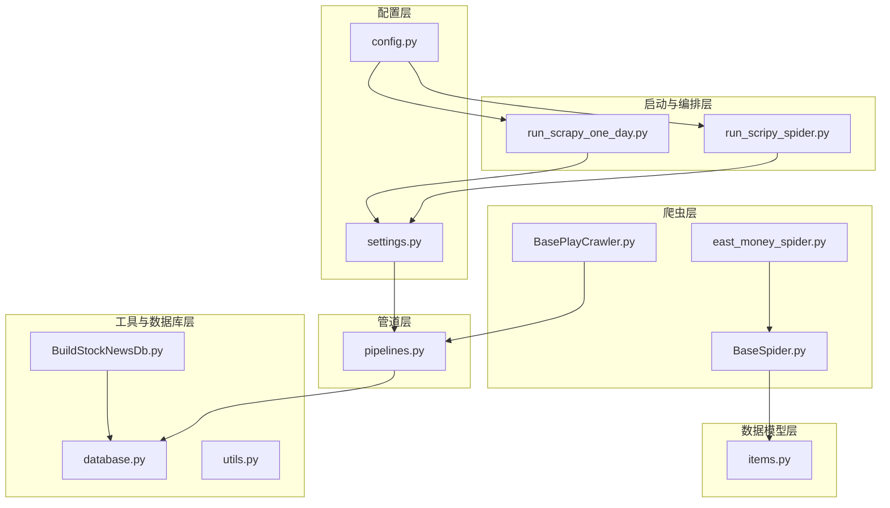
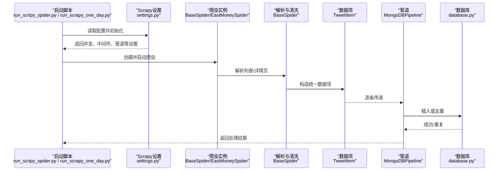
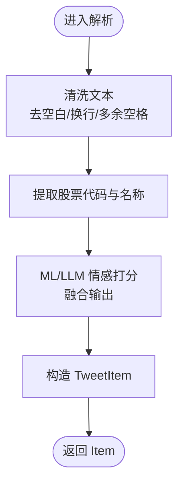
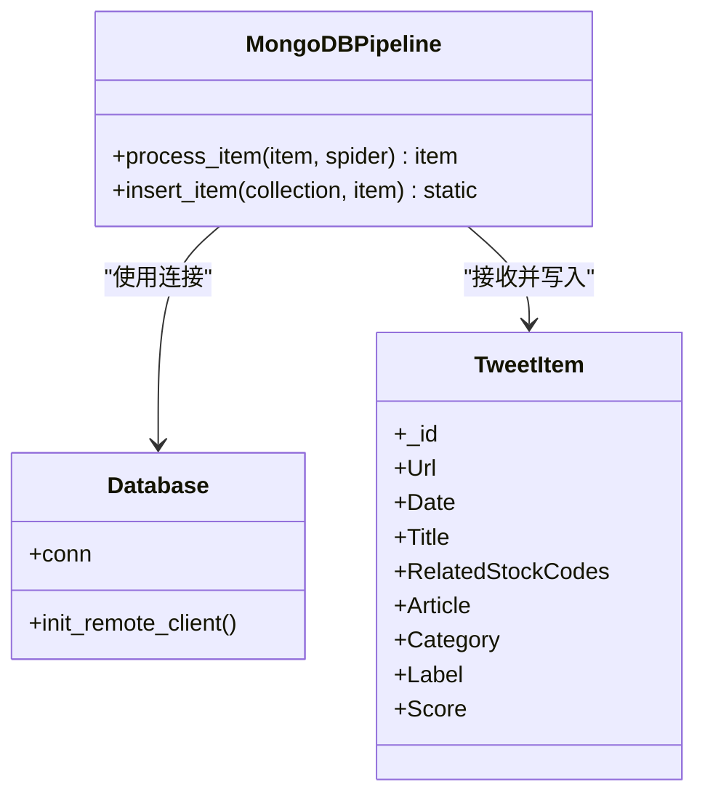
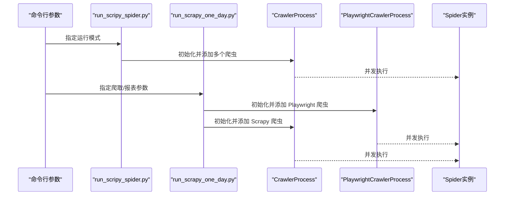
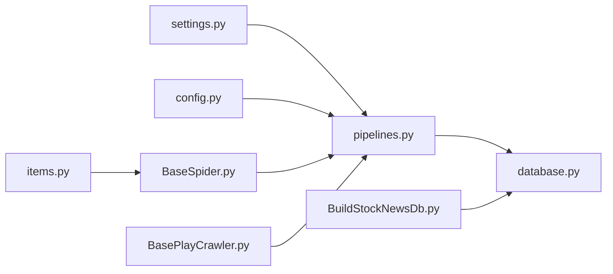

# 数据管道配置

<cite>
**本文引用的文件**
- [settings.py](file://src/settings.py)
- [pipelines.py](file://src/pipelines.py)
- [items.py](file://src/Utils/items.py)
- [BaseSpider.py](file://src/MarketNewsSpiderWithScrapy/BaseSpider.py)
- [BasePlayCrawler.py](file://src/MarketNewsSpiderWithScrapy/BasePlayCrawler.py)
- [run_scripy_spider.py](file://src/run_scripy_spider.py)
- [run_scrapy_one_day.py](file://src/run_scrapy_one_day.py)
- [config.py](file://src/Utils/config.py)
- [database.py](file://src/Utils/database.py)
- [BuildStockNewsDb.py](file://src/MongoDbComTools/BuildStockNewsDb.py)
- [utils.py](file://src/Utils/utils.py)
- [README.md](file://README.md)
</cite>

## 目录
1. [引言](#引言)
2. [项目结构](#项目结构)
3. [核心组件](#核心组件)
4. [架构总览](#架构总览)
5. [详细组件分析](#详细组件分析)
6. [依赖分析](#依赖分析)
7. [性能考虑](#性能考虑)
8. [故障排查指南](#故障排查指南)
9. [结论](#结论)
10. [附录](#附录)

## 引言
本文件面向开发者，系统性阐述基于 Scrapy 的数据管道配置与实现，覆盖以下主题：
- 数据管道的配置方法与自定义选项
- 数据清洗、验证、转换的处理流程与顺序
- 自定义管道的实现与参数配置
- 错误处理与异常捕获机制
- 性能优化与批量处理建议
- 与数据库的集成配置
- 测试与调试方法
- 最佳实践与常见问题解决方案

## 项目结构
该项目采用“功能模块 + 层次化目录”的组织方式，数据采集与处理链路主要分布在以下模块：
- 配置层：settings.py 定义 Scrapy 行为；config.py 统一管理各站点爬虫配置与数据库命名
- 爬虫层：MarketNewsSpiderWithScrapy 下的多个 Spider 实现具体站点的数据抽取
- 数据模型层：Utils/items.py 定义统一的 Item 字段
- 管道层：pipelines.py 实现 MongoDB 写入
- 工具与数据库层：Utils/database.py 提供数据库连接与重连策略；MongoDbComTools/BuildStockNewsDb.py 提供下游报表与归集逻辑
- 启动与编排层：run_scripy_spider.py 与 run_scrapy_one_day.py 控制爬虫生命周期与并发策略

图表来源
- [settings.py:1-49](file://src/settings.py#L1-L49)
- [pipelines.py:1-56](file://src/pipelines.py#L1-L56)
- [items.py:1-18](file://src/Utils/items.py#L1-L18)
- [BaseSpider.py:1-149](file://src/MarketNewsSpiderWithScrapy/BaseSpider.py#L1-L149)
- [BasePlayCrawler.py:1-120](file://src/MarketNewsSpiderWithScrapy/BasePlayCrawler.py#L1-L120)
- [run_scripy_spider.py:1-145](file://src/run_scripy_spider.py#L1-L145)
- [run_scrapy_one_day.py:1-195](file://src/run_scrapy_one_day.py#L1-L195)
- [config.py:1-455](file://src/Utils/config.py#L1-L455)
- [database.py:1-176](file://src/Utils/database.py#L1-L176)
- [BuildStockNewsDb.py:1-241](file://src/MongoDbComTools/BuildStockNewsDb.py#L1-L241)
- [utils.py:1-251](file://src/Utils/utils.py#L1-L251)

章节来源
- [README.md:1-33](file://README.md#L1-L33)
- [settings.py:1-49](file://src/settings.py#L1-L49)
- [config.py:1-455](file://src/Utils/config.py#L1-L455)

## 核心组件
- 数据项模型：统一字段定义，确保管道与下游处理一致性
- 爬虫基类：封装通用解析、清洗、情感打分与 Item 构造流程
- 自定义管道：按来源站点选择目标数据库与集合，执行去重与入库
- 数据库连接：提供自动重连与指数退避策略，增强稳定性
- 启动编排：支持多种并发策略与分批启动，便于扩展与运维

章节来源
- [items.py:1-18](file://src/Utils/items.py#L1-L18)
- [BaseSpider.py:1-149](file://src/MarketNewsSpiderWithScrapy/BaseSpider.py#L1-L149)
- [pipelines.py:1-56](file://src/pipelines.py#L1-L56)
- [database.py:1-176](file://src/Utils/database.py#L1-L176)
- [run_scripy_spider.py:1-145](file://src/run_scripy_spider.py#L1-L145)
- [run_scrapy_one_day.py:1-195](file://src/run_scrapy_one_day.py#L1-L195)

## 架构总览
下图展示从爬虫到管道再到数据库的整体流程，以及与配置中心的关系。

图表来源
- [run_scripy_spider.py:117-142](file://src/run_scripy_spider.py#L117-L142)
- [run_scrapy_one_day.py:32-79](file://src/run_scrapy_one_day.py#L32-L79)
- [settings.py:32-34](file://src/settings.py#L32-L34)
- [BaseSpider.py:41-98](file://src/MarketNewsSpiderWithScrapy/BaseSpider.py#L41-L98)
- [pipelines.py:25-46](file://src/pipelines.py#L25-L46)
- [database.py:36-61](file://src/Utils/database.py#L36-L61)

## 详细组件分析

### 数据项模型（TweetItem）
- 字段覆盖 URL、时间、标题、正文、相关股票代码、分类、标签、分数等
- 作为管道与下游处理的统一载体，保证跨站点一致性

章节来源
- [items.py:5-18](file://src/Utils/items.py#L5-L18)

### 爬虫基类（BaseSpider）
- 职责
  - 解析正文、清洗文本、提取股票代码与名称、进行情感打分（ML 与 LLM 融合）
  - 生成统一 Item 并返回
- 清洗与验证
  - 文本去空白、换行规范化、正则清理
  - 使用哈希生成唯一 ID，避免重复入库
- 情感打分
  - ML 与 LLM 结果融合，输出标签与分数

图表来源
- [BaseSpider.py:41-98](file://src/MarketNewsSpiderWithScrapy/BaseSpider.py#L41-L98)

章节来源
- [BaseSpider.py:13-149](file://src/MarketNewsSpiderWithScrapy/BaseSpider.py#L13-L149)

### 自定义管道（MongoDBPipeline）
- 职责
  - 根据爬虫名称选择对应数据库与集合
  - 执行单条插入，捕获重复键异常并忽略
- 集成点
  - 与配置中心的数据库命名常量配合
  - 与数据库连接类协作，确保连接稳定

图表来源
- [pipelines.py:8-56](file://src/pipelines.py#L8-L56)
- [database.py:36-61](file://src/Utils/database.py#L36-L61)
- [items.py:5-18](file://src/Utils/items.py#L5-L18)

章节来源
- [pipelines.py:8-56](file://src/pipelines.py#L8-L56)
- [config.py:55-400](file://src/Utils/config.py#L55-L400)

### 数据库连接与重连策略（Database）
- 特性
  - 自动重连装饰器，指数退避等待
  - 连接池大小与超时配置
  - 提供查询、更新、插入等通用接口
- 适用场景
  - 管道写入、下游报表生成、历史数据检索

章节来源
- [database.py:15-34](file://src/Utils/database.py#L15-L34)
- [database.py:44-61](file://src/Utils/database.py#L44-L61)
- [database.py:94-172](file://src/Utils/database.py#L94-L172)

### 启动与并发编排
- run_scripy_spider.py
  - 支持一次性启动多个站点爬虫，按配置批量添加
  - 通过 CrawlerProcess 控制并发与延迟
- run_scrapy_one_day.py
  - 分别启动 Playwright 与 Scrapy 爬虫进程
  - 支持生成报表与邮件发送（可选）

图表来源
- [run_scripy_spider.py:117-142](file://src/run_scripy_spider.py#L117-L142)
- [run_scrapy_one_day.py:47-79](file://src/run_scrapy_one_day.py#L47-L79)
- [BasePlayCrawler.py:21-62](file://src/MarketNewsSpiderWithScrapy/BasePlayCrawler.py#L21-L62)

章节来源
- [run_scripy_spider.py:1-145](file://src/run_scripy_spider.py#L1-L145)
- [run_scrapy_one_day.py:1-195](file://src/run_scrapy_one_day.py#L1-L195)

## 依赖分析
- 管道依赖
  - settings.py 中的 ITEM_PIPELINES 指定 MongoDBPipeline
  - config.py 提供数据库命名常量，驱动管道路由
- 爬虫依赖
  - BaseSpider 依赖 TweetItem 与下游 NLP 工具（情感打分）
  - BasePlayCrawler.py 与管道协同，直接调用 process_item
- 数据库依赖
  - database.py 提供连接与重连能力，被管道与下游模块复用

图表来源
- [settings.py:32-34](file://src/settings.py#L32-L34)
- [pipelines.py:8-56](file://src/pipelines.py#L8-L56)
- [config.py:55-400](file://src/Utils/config.py#L55-L400)
- [items.py:5-18](file://src/Utils/items.py#L5-L18)
- [BaseSpider.py:13-34](file://src/MarketNewsSpiderWithScrapy/BaseSpider.py#L13-L34)
- [BasePlayCrawler.py:21-26](file://src/MarketNewsSpiderWithScrapy/BasePlayCrawler.py#L21-L26)
- [database.py:36-61](file://src/Utils/database.py#L36-L61)
- [BuildStockNewsDb.py:19-53](file://src/MongoDbComTools/BuildStockNewsDb.py#L19-L53)

章节来源
- [settings.py:32-34](file://src/settings.py#L32-L34)
- [pipelines.py:8-56](file://src/pipelines.py#L8-L56)
- [config.py:55-400](file://src/Utils/config.py#L55-L400)
- [items.py:5-18](file://src/Utils/items.py#L5-L18)
- [BaseSpider.py:13-34](file://src/MarketNewsSpiderWithScrapy/BaseSpider.py#L13-L34)
- [BasePlayCrawler.py:21-26](file://src/MarketNewsSpiderWithScrapy/BasePlayCrawler.py#L21-L26)
- [database.py:36-61](file://src/Utils/database.py#L36-L61)
- [BuildStockNewsDb.py:19-53](file://src/MongoDbComTools/BuildStockNewsDb.py#L19-L53)

## 性能考虑
- 并发与延迟
  - settings.py 中 CONCURRENT_REQUESTS、DOWNLOAD_DELAY、DOWNLOAD_TIMEOUT 影响整体吞吐与稳定性
- 连接池与重连
  - database.py 提供自动重连与指数退避，降低网络抖动影响
- 批量写入建议
  - 当前管道为单条插入；若需提升写入性能，可在管道中引入批量写入（如 bulk_write）并设置合理的批次阈值与超时
- 缓存与去重
  - 管道已对重复键进行忽略；可结合业务增加布隆过滤器或 Redis 去重缓存，减少重复写入

章节来源
- [settings.py:18-24](file://src/settings.py#L18-L24)
- [database.py:15-34](file://src/Utils/database.py#L15-L34)
- [pipelines.py:48-56](file://src/pipelines.py#L48-L56)

## 故障排查指南
- 管道未生效
  - 检查 settings.py 中 ITEM_PIPELINES 是否正确配置
- 插入异常
  - 查看数据库连接与权限；确认自动重连装饰器是否覆盖异常类型
- 重复数据
  - 管道已捕获重复键异常；如仍出现重复，检查唯一索引与去重逻辑
- 爬虫崩溃
  - 在 BasePlayCrawler.py 的异步调度中增加更详细的异常日志与重试策略
- 报表生成失败
  - 检查 BuildStockNewsDb 的数据库连接与集合存在性；确认下游 LLM 模型路径与设备类型配置

章节来源
- [settings.py:32-34](file://src/settings.py#L32-L34)
- [database.py:15-34](file://src/Utils/database.py#L15-L34)
- [pipelines.py:48-56](file://src/pipelines.py#L48-L56)
- [BasePlayCrawler.py:113-115](file://src/MarketNewsSpiderWithScrapy/BasePlayCrawler.py#L113-L115)
- [BuildStockNewsDb.py:19-53](file://src/MongoDbComTools/BuildStockNewsDb.py#L19-L53)

## 结论
本项目通过清晰的模块划分与配置中心，实现了可扩展的数据采集与处理流水线。自定义管道与数据库连接层提供了稳定的入库能力；爬虫基类统一了数据清洗与情感打分流程。建议在保持现有结构的基础上，进一步引入批量写入、去重缓存与更完善的异常监控，以提升整体性能与可靠性。

## 附录

### 数据管道配置清单
- 管道启用
  - 在 settings.py 的 ITEM_PIPELINES 中注册 MongoDBPipeline
- 数据库命名
  - 通过 config.py 的常量映射不同站点到不同数据库/集合
- 爬虫参数
  - 通过 config.py 的各站点配置字典传入爬虫构造函数
- 并发与延迟
  - 调整 settings.py 中的并发与下载参数以平衡速度与稳定性

章节来源
- [settings.py:32-34](file://src/settings.py#L32-L34)
- [config.py:55-400](file://src/Utils/config.py#L55-L400)
- [run_scripy_spider.py:17-114](file://src/run_scripy_spider.py#L17-L114)
- [run_scrapy_one_day.py:43-79](file://src/run_scrapy_one_day.py#L43-L79)