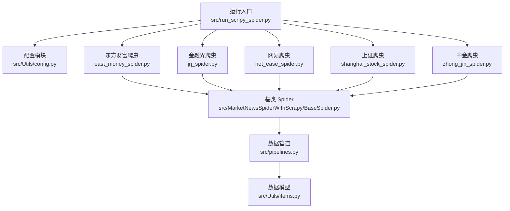
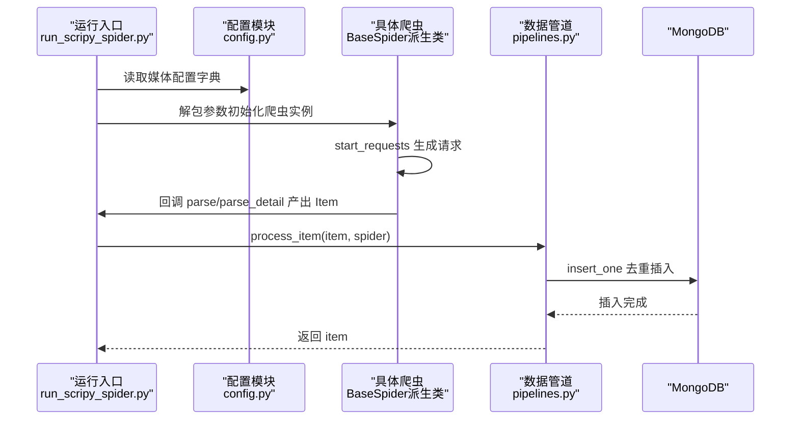
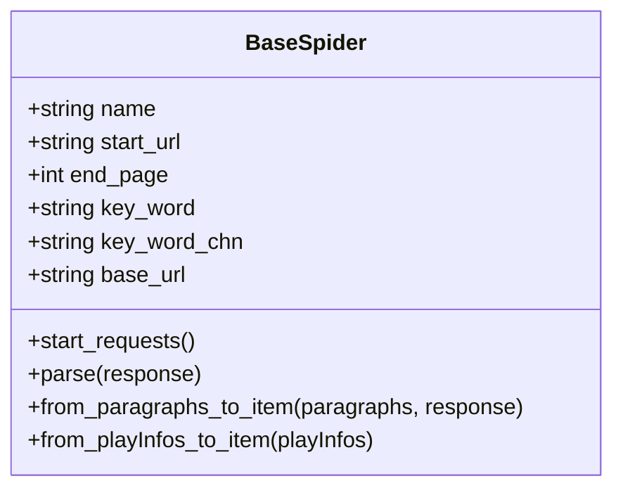
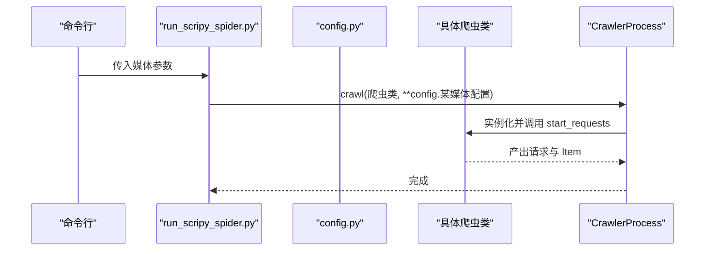
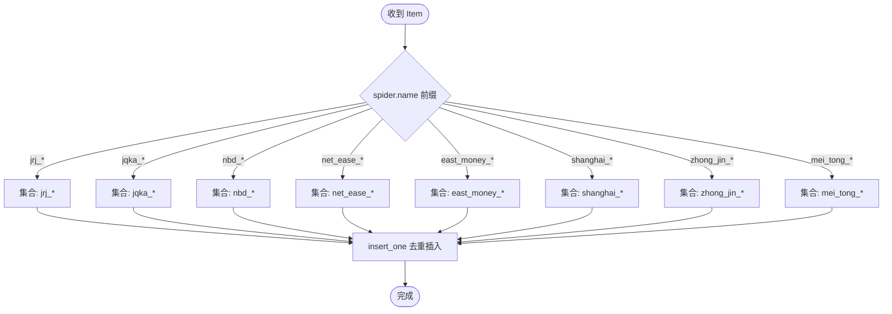

# 爬虫配置

<cite>
**本文引用的文件**
- [src/Utils/config.py](file://src/Utils/config.py)
- [src/MarketNewsSpiderWithScrapy/BaseSpider.py](file://src/MarketNewsSpiderWithScrapy/BaseSpider.py)
- [src/MarketNewsSpiderWithScrapy/BasePlayCrawler.py](file://src/MarketNewsSpiderWithScrapy/BasePlayCrawler.py)
- [src/MarketNewsSpiderWithScrapy/east_money_spider.py](file://src/MarketNewsSpiderWithScrapy/east_money_spider.py)
- [src/MarketNewsSpiderWithScrapy/jrj_spider.py](file://src/MarketNewsSpiderWithScrapy/jrj_spider.py)
- [src/MarketNewsSpiderWithScrapy/net_ease_spider.py](file://src/MarketNewsSpiderWithScrapy/net_ease_spider.py)
- [src/MarketNewsSpiderWithScrapy/shanghai_stock_spider.py](file://src/MarketNewsSpiderWithScrapy/shanghai_stock_spider.py)
- [src/MarketNewsSpiderWithScrapy/zhong_jin_spider.py](file://src/MarketNewsSpiderWithScrapy/zhong_jin_spider.py)
- [src/run_scripy_spider.py](file://src/run_scripy_spider.py)
- [src/pipelines.py](file://src/pipelines.py)
- [src/Utils/items.py](file://src/Utils/items.py)
- [README.md](file://README.md)
</cite>

## 目录
1. [简介](#简介)
2. [项目结构](#项目结构)
3. [核心组件](#核心组件)
4. [架构总览](#架构总览)
5. [详细组件分析](#详细组件分析)
6. [依赖分析](#依赖分析)
7. [性能考虑](#性能考虑)
8. [故障排查指南](#故障排查指南)
9. [结论](#结论)
10. [附录](#附录)

## 简介
本文件面向多源财经媒体新闻爬虫配置系统，系统基于 Scrapy 与 Playwright/Selenium 技术栈，统一通过配置字典驱动各媒体爬虫的初始化与运行。配置字典定义了每个爬虫的名称、起始 URL、关键词、中文分类、基础 URL 与最大页码等关键参数；并通过集中配置容器组织不同媒体的多个子配置，形成可扩展的配置体系。本文将深入解释配置结构、参数语义、数据组织方式、增删改流程、验证与错误处理机制，并提供新配置创建模板与最佳实践，帮助开发者正确配置与管理多源新闻爬虫。

## 项目结构
- 配置层：集中定义各媒体的配置字典与聚合容器，位于 [src/Utils/config.py](file://src/Utils/config.py)
- 爬虫基类：统一接收配置参数并封装通用解析与入库逻辑，位于 [src/MarketNewsSpiderWithScrapy/BaseSpider.py](file://src/MarketNewsSpiderWithScrapy/BaseSpider.py)
- 爬虫实现：各媒体具体爬虫继承基类并实现列表页/详情页解析，位于 [src/MarketNewsSpiderWithScrapy/east_money_spider.py](file://src/MarketNewsSpiderWithScrapy/east_money_spider.py)、[src/MarketNewsSpiderWithScrapy/jrj_spider.py](file://src/MarketNewsSpiderWithScrapy/jrj_spider.py)、[src/MarketNewsSpiderWithScrapy/net_ease_spider.py](file://src/MarketNewsSpiderWithScrapy/net_ease_spider.py)、[src/MarketNewsSpiderWithScrapy/shanghai_stock_spider.py](file://src/MarketNewsSpiderWithScrapy/shanghai_stock_spider.py)、[src/MarketNewsSpiderWithScrapy/zhong_jin_spider.py](file://src/MarketNewsSpiderWithScrapy/zhong_jin_spider.py)
- 运行入口：按媒体类别批量注册爬虫并启动，位于 [src/run_scripy_spider.py](file://src/run_scripy_spider.py)
- 数据管道：统一入库与去重，位于 [src/pipelines.py](file://src/pipelines.py)
- 数据模型：统一输出字段，位于 [src/Utils/items.py](file://src/Utils/items.py)

图表来源
- [src/Utils/config.py](file://src/Utils/config.py)
- [src/MarketNewsSpiderWithScrapy/BaseSpider.py](file://src/MarketNewsSpiderWithScrapy/BaseSpider.py)
- [src/run_scripy_spider.py](file://src/run_scripy_spider.py)
- [src/pipelines.py](file://src/pipelines.py)
- [src/Utils/items.py](file://src/Utils/items.py)

章节来源
- [README.md](file://README.md)
- [src/Utils/config.py](file://src/Utils/config.py)
- [src/run_scripy_spider.py](file://src/run_scripy_spider.py)

## 核心组件
- 配置字典结构
  - name：爬虫名称标识，用于区分不同任务与入库集合命名
  - start_url：起始列表页 URL
  - key_word：英文关键词标签，用于过滤与分类
  - key_word_chn：中文关键词标签，用于展示与分类
  - base_url：站点基础 URL，用于相对链接补全或域名约束
  - end_page：最大页码或加载轮次，决定列表页遍历深度
- 配置容器
  - 各媒体的子配置列表（如 EAST_MONEY_SPIDER_LIST、JRJ_SPIDER_LIST 等）
  - 聚合容器 ALL_SPIDER_LIST_OF_DICT，键为数据库名，值为对应媒体的配置列表
- 爬虫基类
  - 统一接收上述参数并初始化，内置通用解析与入库逻辑（如 from_paragraphs_to_item、from_playInfos_to_item）
- 运行入口
  - 通过 run_scripy_spider.py 按媒体类别批量注册爬虫，使用 **config.* 参数解包传入
- 数据管道
  - 根据 spider.name 自动选择数据库与集合，执行去重插入

章节来源
- [src/Utils/config.py](file://src/Utils/config.py)
- [src/MarketNewsSpiderWithScrapy/BaseSpider.py](file://src/MarketNewsSpiderWithScrapy/BaseSpider.py)
- [src/run_scripy_spider.py](file://src/run_scripy_spider.py)
- [src/pipelines.py](file://src/pipelines.py)

## 架构总览
系统采用“配置驱动 + 继承复用”的架构：配置字典定义行为，基类封装通用能力，具体爬虫专注页面解析细节，运行入口负责编排与启动，数据管道负责入库与去重。

图表来源
- [src/run_scripy_spider.py](file://src/run_scripy_spider.py)
- [src/Utils/config.py](file://src/Utils/config.py)
- [src/MarketNewsSpiderWithScrapy/BaseSpider.py](file://src/MarketNewsSpiderWithScrapy/BaseSpider.py)
- [src/pipelines.py](file://src/pipelines.py)

## 详细组件分析

### 配置字典与参数详解
- 字段说明
  - name：唯一标识，影响数据库集合命名与日志输出
  - start_url：必须可访问，支持分页模板替换
  - key_word/key_word_chn：用于后续分类与展示
  - base_url：用于链接补全或站点约束
  - end_page：决定列表页遍历轮次或最大页码
- 组织方式
  - 每个媒体定义若干子配置（如 EAST_MONEY_A_STOCK_NEWS 等）
  - 每个媒体配置列表汇总到对应常量（如 EAST_MONEY_SPIDER_LIST）
  - 最终由 ALL_SPIDER_LIST_OF_DICT 聚合，键为数据库名，值为配置列表

章节来源
- [src/Utils/config.py](file://src/Utils/config.py)

### 基类 BaseSpider 设计
- 参数注入与初始化
  - 接收 name、start_url、end_page、key_word、key_word_chn、base_url
  - 初始化数据库与 NLP 工具，准备股票代码映射
- 通用解析与建模
  - from_paragraphs_to_item：从 HTML 段落提取正文，识别股票代码与分词，调用 ML/LLM 模型打分，构造 TweetItem
  - from_playInfos_to_item：从异步解析结果构造 TweetItem，逻辑同上
- 继承关系示意

图表来源
- [src/MarketNewsSpiderWithScrapy/BaseSpider.py](file://src/MarketNewsSpiderWithScrapy/BaseSpider.py)

章节来源
- [src/MarketNewsSpiderWithScrapy/BaseSpider.py](file://src/MarketNewsSpiderWithScrapy/BaseSpider.py)
- [src/Utils/items.py](file://src/Utils/items.py)

### 各媒体爬虫实现要点
- 东方财富（EastMoneySpider）
  - start_requests：根据 end_page 生成分页 URL 列表
  - parse：等待列表元素加载，提取标题/时间/链接，发起详情页请求
  - parse_detail：等待正文元素加载，提取正文，构造 playInfos，交由基类转换为 Item
- 金融界（JRJSpider）
  - start_requests：直接访问起始页
  - parse：处理“加载更多”，定位新闻项，提取标题与链接，传递元数据
  - parse_detail：提取发布时间与正文，构造 Item
- 网易（NetEaseSpider）
  - start_requests：根据 end_page 生成分页 URL 列表（BeautifulSoup）
  - parse：解析列表页，提取子链接与时间，发起详情页请求
  - parse_further_information：解析详情页正文，调用基类转换为 Item
- 上证（ShanghaiStockSpider）
  - start_requests：直接访问起始页
  - parse：拦截 AJAX 返回，模拟滚动加载，抽取 JSON 数据，构造 Item
- 中金（ZhongJinStockSpider）
  - start_requests：使用 Selenium 打开页面，循环点击“加载更多”
  - parse：解析页面，提取标题/时间/链接，发起详情页请求
  - parse（详情）：解析正文，调用基类转换为 Item

章节来源
- [src/MarketNewsSpiderWithScrapy/east_money_spider.py](file://src/MarketNewsSpiderWithScrapy/east_money_spider.py)
- [src/MarketNewsSpiderWithScrapy/jrj_spider.py](file://src/MarketNewsSpiderWithScrapy/jrj_spider.py)
- [src/MarketNewsSpiderWithScrapy/net_ease_spider.py](file://src/MarketNewsSpiderWithScrapy/net_ease_spider.py)
- [src/MarketNewsSpiderWithScrapy/shanghai_stock_spider.py](file://src/MarketNewsSpiderWithScrapy/shanghai_stock_spider.py)
- [src/MarketNewsSpiderWithScrapy/zhong_jin_spider.py](file://src/MarketNewsSpiderWithScrapy/zhong_jin_spider.py)

### 运行入口与配置绑定
- run_scripy_spider.py
  - 按媒体类别调用 process.crawl，将 config.* 配置字典解包传入爬虫构造函数
  - 支持命令行参数选择运行范围（如 all、nbd、east_money、zhongjin、shanghai 等）

图表来源
- [src/run_scripy_spider.py](file://src/run_scripy_spider.py)
- [src/Utils/config.py](file://src/Utils/config.py)

章节来源
- [src/run_scripy_spider.py](file://src/run_scripy_spider.py)

### 数据管道与入库
- pipelines.py
  - 根据 spider.name 前缀选择数据库与集合
  - insert_one 去重插入，DuplicateKeyError 忽略

图表来源
- [src/pipelines.py](file://src/pipelines.py)

章节来源
- [src/pipelines.py](file://src/pipelines.py)

## 依赖分析
- 配置到爬虫
  - run_scripy_spider.py 依赖 config.py 提供的配置字典
  - 各媒体爬虫类继承 BaseSpider，复用统一解析与建模逻辑
- 爬虫到管道
  - BaseSpider 产出 Item，pipelines.py 根据 spider.name 决定入库集合
- 爬虫到页面解析
  - 不同媒体采用不同解析策略：BeautifulSoup、Playwright、Selenium

图表来源
- [src/Utils/config.py](file://src/Utils/config.py)
- [src/run_scripy_spider.py](file://src/run_scripy_spider.py)
- [src/MarketNewsSpiderWithScrapy/BaseSpider.py](file://src/MarketNewsSpiderWithScrapy/BaseSpider.py)
- [src/pipelines.py](file://src/pipelines.py)

章节来源
- [src/Utils/config.py](file://src/Utils/config.py)
- [src/run_scripy_spider.py](file://src/run_scripy_spider.py)
- [src/MarketNewsSpiderWithScrapy/BaseSpider.py](file://src/MarketNewsSpiderWithScrapy/BaseSpider.py)
- [src/pipelines.py](file://src/pipelines.py)

## 性能考虑
- 分页策略
  - end_page 控制遍历深度，建议按媒体实际列表规模合理设置，避免无效请求
- 异步与并发
  - 部分爬虫使用 Playwright 异步解析，注意网络超时与等待条件设置
- 数据去重
  - 使用 insert_one 去重，减少重复入库成本
- 资源限制
  - Selenium/ChromeDriver 需要稳定环境，建议在容器或 CI 中统一配置

## 故障排查指南
- 页面元素未加载
  - 检查 parse/parse_detail 中的等待选择器与超时设置
  - 示例：等待列表元素加载后再提取，避免空结果
- 详情页正文为空
  - 确认正文选择器是否适配目标站点，必要时增加兼容分支
- 入库异常
  - DuplicateKeyError 为预期行为，表示重复数据忽略；若出现其他异常，请检查集合索引与字段类型
- 配置参数错误
  - start_url 无法访问、end_page 过大导致超时、key_word/key_word_chn 不一致导致分类异常

章节来源
- [src/MarketNewsSpiderWithScrapy/east_money_spider.py](file://src/MarketNewsSpiderWithScrapy/east_money_spider.py)
- [src/MarketNewsSpiderWithScrapy/jrj_spider.py](file://src/MarketNewsSpiderWithScrapy/jrj_spider.py)
- [src/MarketNewsSpiderWithScrapy/net_ease_spider.py](file://src/MarketNewsSpiderWithScrapy/net_ease_spider.py)
- [src/MarketNewsSpiderWithScrapy/shanghai_stock_spider.py](file://src/MarketNewsSpiderWithScrapy/shanghai_stock_spider.py)
- [src/MarketNewsSpiderWithScrapy/zhong_jin_spider.py](file://src/MarketNewsSpiderWithScrapy/zhong_jin_spider.py)
- [src/pipelines.py](file://src/pipelines.py)

## 结论
本配置系统通过“配置字典 + 基类 + 具体实现 + 运行入口 + 管道”的分层设计，实现了多源财经媒体爬虫的标准化与可扩展性。开发者只需维护配置字典与少量页面解析逻辑，即可快速接入新媒体或调整现有配置。建议在新增配置时遵循模板与规范，确保参数一致性与可维护性。

## 附录

### 配置字典模板与最佳实践
- 模板字段
  - name：唯一标识，建议形如 “媒体_业务_场景_spider”
  - start_url：起始列表页 URL，支持分页模板
  - key_word：英文关键词，便于过滤与统计
  - key_word_chn：中文关键词，便于展示与分类
  - base_url：站点基础 URL
  - end_page：最大页码或加载轮次
- 新增媒体步骤
  - 在 config.py 中新增媒体常量与子配置字典
  - 将子配置加入媒体配置列表
  - 在 ALL_SPIDER_LIST_OF_DICT 中登记媒体键
  - 编写或复用爬虫类，实现 start_requests 与 parse/parse_detail
  - 在 run_scripy_spider.py 中注册该媒体的配置
  - 启动运行入口，验证入库与去重
- 参数校验建议
  - start_url 可访问性测试
  - end_page 合理性评估（结合媒体列表规模）
  - key_word 与 key_word_chn 一致性核对
  - base_url 与链接补全逻辑匹配
- 错误处理建议
  - 列表页等待超时与重试策略
  - 详情页正文提取失败的降级方案
  - 管道插入异常的监控与日志记录

章节来源
- [src/Utils/config.py](file://src/Utils/config.py)
- [src/run_scripy_spider.py](file://src/run_scripy_spider.py)
- [src/MarketNewsSpiderWithScrapy/BaseSpider.py](file://src/MarketNewsSpiderWithScrapy/BaseSpider.py)