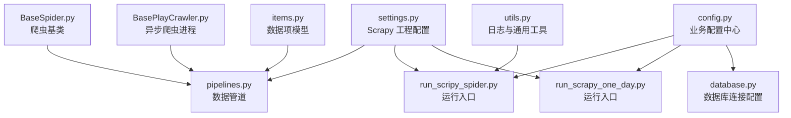
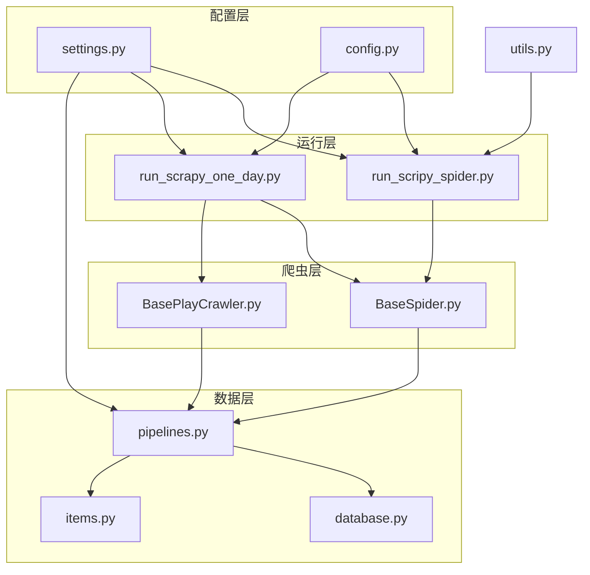
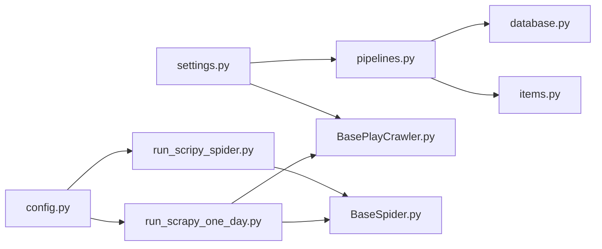

# 配置管理

<cite>
**本文引用的文件**
- [settings.py](file://src/settings.py)
- [config.py](file://src/Utils/config.py)
- [pipelines.py](file://src/pipelines.py)
- [run_scrapy_one_day.py](file://src/run_scrapy_one_day.py)
- [run_scripy_spider.py](file://src/run_scripy_spider.py)
- [database.py](file://src/Utils/database.py)
- [BasePlayCrawler.py](file://src/MarketNewsSpiderWithScrapy/BasePlayCrawler.py)
- [BaseSpider.py](file://src/MarketNewsSpiderWithScrapy/BaseSpider.py)
- [items.py](file://src/Utils/items.py)
- [utils.py](file://src/Utils/utils.py)
</cite>

## 目录
1. [简介](#简介)
2. [项目结构](#项目结构)
3. [核心组件](#核心组件)
4. [架构总览](#架构总览)
5. [详细组件分析](#详细组件分析)
6. [依赖分析](#依赖分析)
7. [性能考量](#性能考量)
8. [故障排查指南](#故障排查指南)
9. [结论](#结论)
10. [附录](#附录)

## 简介
本文件面向“配置管理”的主题，系统性梳理本仓库中与配置相关的全局设计、Scrapy 项目配置方法、数据管道配置与自定义方式、环境变量使用与优先级、配置模板与示例、动态更新与热加载机制、配置验证与错误检查、最佳实践与安全注意事项。目标是帮助开发者正确配置与管理系统的各项参数，确保系统稳定运行。

## 项目结构
本项目采用“Scrapy 工程 + 自定义工具模块”的组织方式，配置相关的关键位置包括：
- Scrapy 工程配置入口：src/settings.py
- 业务配置中心：src/Utils/config.py
- 数据管道：src/pipelines.py
- 运行入口与配置注入：src/run_scrapy_one_day.py、src/run_scripy_spider.py
- 数据库连接与配置：src/Utils/database.py
- 爬虫基类与异步爬虫流程：src/MarketNewsSpiderWithScrapy/BaseSpider.py、src/MarketNewsSpiderWithScrapy/BasePlayCrawler.py
- 数据项模型：src/Utils/items.py
- 通用工具与日志：src/Utils/utils.py

**图示来源**
- [settings.py](file://src/settings.py)
- [pipelines.py](file://src/pipelines.py)
- [run_scripy_spider.py](file://src/run_scripy_spider.py)
- [run_scrapy_one_day.py](file://src/run_scrapy_one_day.py)
- [config.py](file://src/Utils/config.py)
- [database.py](file://src/Utils/database.py)
- [BaseSpider.py](file://src/MarketNewsSpiderWithScrapy/BaseSpider.py)
- [BasePlayCrawler.py](file://src/MarketNewsSpiderWithScrapy/BasePlayCrawler.py)
- [items.py](file://src/Utils/items.py)
- [utils.py](file://src/Utils/utils.py)

**章节来源**
- [settings.py](file://src/settings.py)
- [config.py](file://src/Utils/config.py)
- [pipelines.py](file://src/pipelines.py)
- [run_scripy_spider.py](file://src/run_scripy_spider.py)
- [run_scrapy_one_day.py](file://src/run_scrapy_one_day.py)
- [database.py](file://src/Utils/database.py)
- [BaseSpider.py](file://src/MarketNewsSpiderWithScrapy/BaseSpider.py)
- [BasePlayCrawler.py](file://src/MarketNewsSpiderWithScrapy/BasePlayCrawler.py)
- [items.py](file://src/Utils/items.py)
- [utils.py](file://src/Utils/utils.py)

## 核心组件
- Scrapy 工程配置（settings.py）
  - 包含机器人协议、并发、下载延迟、请求头、中间件、数据管道等关键参数。
  - 示例路径：[settings.py](file://src/settings.py)
- 业务配置中心（config.py）
  - 统一管理数据库地址、端口、模型路径、字典路径、爬虫集合等。
  - 示例路径：[config.py](file://src/Utils/config.py)
- 数据管道（pipelines.py）
  - 将不同来源的新闻数据写入对应数据库集合。
  - 示例路径：[pipelines.py](file://src/pipelines.py)
- 运行入口（run_scrapy_one_day.py、run_scripy_spider.py）
  - 注入环境变量 SCRAPY_SETTINGS_MODULE，并读取工程配置，驱动爬虫运行。
  - 示例路径：[run_scrapy_one_day.py](file://src/run_scrapy_one_day.py)、[run_scripy_spider.py](file://src/run_scripy_spider.py)
- 数据库连接（database.py）
  - 基于配置进行连接初始化、异常重连策略、集合操作封装。
  - 示例路径：[database.py](file://src/Utils/database.py)
- 爬虫基类与异步爬虫（BaseSpider.py、BasePlayCrawler.py）
  - 爬虫基类负责数据项构造与评分融合；异步爬虫进程从 settings 读取 UA 列表与 headless 等参数。
  - 示例路径：[BaseSpider.py](file://src/MarketNewsSpiderWithScrapy/BaseSpider.py)、[BasePlayCrawler.py](file://src/MarketNewsSpiderWithScrapy/BasePlayCrawler.py)
- 数据项模型（items.py）
  - 定义统一的数据字段结构，供管道与下游使用。
  - 示例路径：[items.py](file://src/Utils/items.py)
- 通用工具（utils.py）
  - 日志配置、邮件发送、日期计算等辅助能力。
  - 示例路径：[utils.py](file://src/Utils/utils.py)

**章节来源**
- [settings.py](file://src/settings.py)
- [config.py](file://src/Utils/config.py)
- [pipelines.py](file://src/pipelines.py)
- [run_scrapy_one_day.py](file://src/run_scrapy_one_day.py)
- [run_scripy_spider.py](file://src/run_scripy_spider.py)
- [database.py](file://src/Utils/database.py)
- [BaseSpider.py](file://src/MarketNewsSpiderWithScrapy/BaseSpider.py)
- [BasePlayCrawler.py](file://src/MarketNewsSpiderWithScrapy/BasePlayCrawler.py)
- [items.py](file://src/Utils/items.py)
- [utils.py](file://src/Utils/utils.py)

## 架构总览
下图展示配置在系统中的流向与耦合关系：

**图示来源**
- [settings.py](file://src/settings.py)
- [config.py](file://src/Utils/config.py)
- [run_scripy_spider.py](file://src/run_scripy_spider.py)
- [run_scrapy_one_day.py](file://src/run_scrapy_one_day.py)
- [BaseSpider.py](file://src/MarketNewsSpiderWithScrapy/BaseSpider.py)
- [BasePlayCrawler.py](file://src/MarketNewsSpiderWithScrapy/BasePlayCrawler.py)
- [pipelines.py](file://src/pipelines.py)
- [database.py](file://src/Utils/database.py)
- [items.py](file://src/Utils/items.py)
- [utils.py](file://src/Utils/utils.py)

## 详细组件分析

### Scrapy 工程配置（settings.py）
- 关键点
  - 机器人协议、并发、下载延迟、Cookie、请求头、中间件、数据管道、UA 列表等。
  - 数据管道注册：将 MongoDBPipeline 注册到 ITEM_PIPELINES。
  - 中间件禁用/启用：例如禁用 CookiesMiddleware、RedirectMiddleware，启用 HttpProxyMiddleware。
- 使用建议
  - 将可变参数（如并发、延迟、UA 列表）集中管理，便于按环境切换。
  - 中间件顺序与权重需谨慎调整，避免冲突。
- 示例路径
  - [settings.py](file://src/settings.py)

**章节来源**
- [settings.py](file://src/settings.py)

### 业务配置中心（config.py）
- 关键点
  - 数据库 IP/端口、Redis 地址、ChromeDriver 路径、模型与词典路径、各站点爬虫集合等。
  - 支持平台差异（Darwin/Linux），自动选择 MONGODB_IP、CHROME_DRIVER。
  - 统一管理多个新闻源的数据库名与集合名映射。
- 使用建议
  - 将敏感信息（如密钥）放入加密存储或环境变量，避免硬编码。
  - 将“默认值”与“覆盖值”分离，便于测试与生产环境差异化。
- 示例路径
  - [config.py](file://src/Utils/config.py)

**章节来源**
- [config.py](file://src/Utils/config.py)

### 数据管道（pipelines.py）
- 关键点
  - 根据 spider.name 动态选择数据库与集合，将 item 写入对应集合。
  - 使用 insert_one 插入，捕获重复键异常并忽略。
- 使用建议
  - 在 process_item 中增加校验（如必填字段、URL 去重策略）。
  - 对不同来源的集合建立唯一索引，提升去重效率。
- 示例路径
  - [pipelines.py](file://src/pipelines.py)

**章节来源**
- [pipelines.py](file://src/pipelines.py)

### 运行入口与配置注入（run_scrapy_one_day.py、run_scripy_spider.py）
- 关键点
  - 通过 os.environ 设置 SCRAPY_SETTINGS_MODULE，使工程能正确加载 settings.py。
  - 读取工程配置（get_project_settings），并基于 config.py 中的爬虫集合启动爬虫。
  - 支持 Playwright 与传统 Scrapy 爬虫混合运行。
- 使用建议
  - 在 CI/CD 中通过环境变量注入配置，避免修改源码。
  - 将“爬虫集合”抽象为可配置清单，便于动态扩展。
- 示例路径
  - [run_scrapy_one_day.py](file://src/run_scrapy_one_day.py)
  - [run_scripy_spider.py](file://src/run_scripy_spider.py)

**章节来源**
- [run_scrapy_one_day.py](file://src/run_scrapy_one_day.py)
- [run_scripy_spider.py](file://src/run_scripy_spider.py)

### 数据库连接（database.py）
- 关键点
  - 基于 config.py 初始化连接，支持自动重连装饰器与指数退避。
  - 提供集合查询、插入、更新、最大值查找等常用接口。
- 使用建议
  - 对长查询设置超时与分页，避免阻塞。
  - 在高并发场景下合理设置连接池大小与超时时间。
- 示例路径
  - [database.py](file://src/Utils/database.py)

**章节来源**
- [database.py](file://src/Utils/database.py)

### 爬虫基类与异步爬虫（BaseSpider.py、BasePlayCrawler.py）
- 关键点
  - BaseSpider：构造 TweetItem，融合 ML 与 LLM 评分，生成标准化字段。
  - BasePlayCrawler：从 settings 读取 headless 与 UA 列表，异步并发调度爬虫。
- 使用建议
  - 在 settings 中维护 UA 列表，避免固定 UA 导致反爬。
  - 对异步爬虫增加超时与重试策略，提升鲁棒性。
- 示例路径
  - [BaseSpider.py](file://src/MarketNewsSpiderWithScrapy/BaseSpider.py)
  - [BasePlayCrawler.py](file://src/MarketNewsSpiderWithScrapy/BasePlayCrawler.py)

**章节来源**
- [BaseSpider.py](file://src/MarketNewsSpiderWithScrapy/BaseSpider.py)
- [BasePlayCrawler.py](file://src/MarketNewsSpiderWithScrapy/BasePlayCrawler.py)

### 数据项模型（items.py）
- 关键点
  - 定义统一字段（如 _id、Url、Date、Title、Article、Label、Score 等）。
- 使用建议
  - 在 pipeline 中对缺失字段进行补全或抛错，保证数据一致性。
- 示例路径
  - [items.py](file://src/Utils/items.py)

**章节来源**
- [items.py](file://src/Utils/items.py)

### 通用工具（utils.py）
- 关键点
  - 日志配置、邮件发送、日期范围生成、中文分词辅助等。
- 使用建议
  - 将日志级别与输出格式作为可配置项，便于调试与生产监控。
- 示例路径
  - [utils.py](file://src/Utils/utils.py)

**章节来源**
- [utils.py](file://src/Utils/utils.py)

## 依赖分析
- 配置耦合关系
  - settings.py 与 pipelines.py：通过 ITEM_PIPELINES 关联。
  - config.py 与 run_*：通过爬虫集合与数据库配置关联。
  - BasePlayCrawler.py 与 settings.py：通过 USER_AGENTS、headless 等参数关联。
  - pipelines.py 与 database.py：通过 Database 类连接与写入。
- 潜在风险
  - 环境变量注入顺序不当可能导致配置未生效。
  - 中间件禁用/启用不当可能影响代理或 Cookie 行为。
  - 数据库连接参数与池大小需与并发策略匹配。

**图示来源**
- [settings.py](file://src/settings.py)
- [pipelines.py](file://src/pipelines.py)
- [config.py](file://src/Utils/config.py)
- [run_scripy_spider.py](file://src/run_scripy_spider.py)
- [run_scrapy_one_day.py](file://src/run_scrapy_one_day.py)
- [BaseSpider.py](file://src/MarketNewsSpiderWithScrapy/BaseSpider.py)
- [BasePlayCrawler.py](file://src/MarketNewsSpiderWithScrapy/BasePlayCrawler.py)
- [database.py](file://src/Utils/database.py)
- [items.py](file://src/Utils/items.py)

**章节来源**
- [settings.py](file://src/settings.py)
- [pipelines.py](file://src/pipelines.py)
- [config.py](file://src/Utils/config.py)
- [run_scripy_spider.py](file://src/run_scripy_spider.py)
- [run_scrapy_one_day.py](file://src/run_scrapy_one_day.py)
- [BaseSpider.py](file://src/MarketNewsSpiderWithScrapy/BaseSpider.py)
- [BasePlayCrawler.py](file://src/MarketNewsSpiderWithScrapy/BasePlayCrawler.py)
- [database.py](file://src/Utils/database.py)
- [items.py](file://src/Utils/items.py)

## 性能考量
- 并发与延迟
  - settings 中的并发与下载延迟直接影响抓取吞吐与目标站点稳定性，应结合目标站点限流策略调优。
- 数据库连接
  - database.py 提供自动重连与指数退避，建议配合连接池上限与查询超时使用。
- 爬虫异步化
  - BasePlayCrawler 使用异步并发，建议限制并发数量并设置页面等待超时，避免资源耗尽。
- 管道写入
  - pipelines.py 使用 insert_one，建议为高频集合建立唯一索引，减少重复写入成本。

[本节为通用指导，无需列出具体文件来源]

## 故障排查指南
- 环境变量未生效
  - 确认运行前已设置 SCRAPY_SETTINGS_MODULE，否则工程无法加载 settings.py。
  - 参考路径：[run_scripy_spider.py](file://src/run_scripy_spider.py)、[run_scrapy_one_day.py](file://src/run_scrapy_one_day.py)
- 数据库连接失败
  - 检查 config.py 中的 MONGODB_IP/PORT 与 network 权限，确认 database.py 初始化成功。
  - 参考路径：[config.py](file://src/Utils/config.py)、[database.py](file://src/Utils/database.py)
- 管道写入异常
  - pipelines.py 捕获重复键异常并忽略，若出现数据缺失，检查 item 字段与集合索引。
  - 参考路径：[pipelines.py](file://src/pipelines.py)
- 中间件冲突
  - settings 中禁用/启用中间件需与代理/重定向行为一致，避免请求被意外拦截。
  - 参考路径：[settings.py](file://src/settings.py)
- 日志与告警
  - utils.py 提供日志配置，建议在生产环境开启更详细的日志级别与输出。
  - 参考路径：[utils.py](file://src/Utils/utils.py)

**章节来源**
- [run_scripy_spider.py](file://src/run_scripy_spider.py)
- [run_scrapy_one_day.py](file://src/run_scrapy_one_day.py)
- [config.py](file://src/Utils/config.py)
- [database.py](file://src/Utils/database.py)
- [pipelines.py](file://src/pipelines.py)
- [settings.py](file://src/settings.py)
- [utils.py](file://src/Utils/utils.py)

## 结论
本项目的配置体系以 settings.py 为工程入口，config.py 为业务配置中心，辅以运行入口与数据管道、数据库连接、爬虫基类与异步爬虫进程共同构成完整的配置链路。通过明确的环境变量注入、中间件与并发参数管理、以及数据库连接与异常重连策略，系统具备较好的可维护性与可扩展性。建议在后续迭代中进一步完善配置验证、动态更新与热加载机制，以满足更复杂的运维需求。

[本节为总结性内容，无需列出具体文件来源]

## 附录

### 配置项说明（摘录）
- Scrapy 工程配置（settings.py）
  - BOT_NAME、SPIDER_MODULES、NEWSPIDER_MODULE、ROBOTSTXT_OBEY
  - DEFAULT_REQUEST_HEADERS、CONCURRENT_REQUESTS、DOWNLOAD_DELAY、DOWNLOAD_TIMEOUT
  - COOKIES_ENABLED、DOWNLOADER_MIDDLEWARES、ITEM_PIPELINES、USER_AGENTS
  - 示例路径：[settings.py](file://src/settings.py)
- 业务配置（config.py）
  - MONGODB_IP、MONGODB_PORT、REDIS_IP、REDIS_PORT
  - CHROME_DRIVER、STOCK_PRICE_REQUEST_DEFAULT_DATE
  - USER_DEFINED_DICT_PATH、USER_DEFINED_WEIGHT_DICT_PATH、CHN_STOP_WORDS_PATH
  - SEG_METHOD、BAYES_MODEL_FILE、SVM_MODEL_FILE、COUNT_VECTOR_FILE
  - 各数据库名与集合名常量、爬虫集合列表
  - 示例路径：[config.py](file://src/Utils/config.py)
- 数据管道（pipelines.py）
  - ITEM_PIPELINES 注册、process_item 中的集合选择与写入
  - 示例路径：[pipelines.py](file://src/pipelines.py)
- 运行入口（run_scrapy_one_day.py、run_scripy_spider.py）
  - SCRAPY_SETTINGS_MODULE 注入、get_project_settings 使用、爬虫集合遍历
  - 示例路径：[run_scrapy_one_day.py](file://src/run_scrapy_one_day.py)、[run_scripy_spider.py](file://src/run_scripy_spider.py)
- 数据库连接（database.py）
  - init_remote_client、graceful_auto_reconnect、集合操作封装
  - 示例路径：[database.py](file://src/Utils/database.py)
- 爬虫基类与异步爬虫（BaseSpider.py、BasePlayCrawler.py）
  - TweetItem 构造、ML/LLM 评分融合、异步并发调度
  - 示例路径：[BaseSpider.py](file://src/MarketNewsSpiderWithScrapy/BaseSpider.py)、[BasePlayCrawler.py](file://src/MarketNewsSpiderWithScrapy/BasePlayCrawler.py)
- 数据项模型（items.py）
  - 统一字段定义
  - 示例路径：[items.py](file://src/Utils/items.py)
- 通用工具（utils.py）
  - 日志配置、邮件发送、日期计算
  - 示例路径：[utils.py](file://src/Utils/utils.py)

**章节来源**
- [settings.py](file://src/settings.py)
- [config.py](file://src/Utils/config.py)
- [pipelines.py](file://src/pipelines.py)
- [run_scrapy_one_day.py](file://src/run_scrapy_one_day.py)
- [run_scripy_spider.py](file://src/run_scripy_spider.py)
- [database.py](file://src/Utils/database.py)
- [BaseSpider.py](file://src/MarketNewsSpiderWithScrapy/BaseSpider.py)
- [BasePlayCrawler.py](file://src/MarketNewsSpiderWithScrapy/BasePlayCrawler.py)
- [items.py](file://src/Utils/items.py)
- [utils.py](file://src/Utils/utils.py)

### 配置模板与示例
- 环境变量模板
  - SCRAPY_SETTINGS_MODULE：指向 settings.py 所在模块路径
  - 示例路径：[run_scripy_spider.py](file://src/run_scripy_spider.py)、[run_scrapy_one_day.py](file://src/run_scrapy_one_day.py)
- Scrapy 工程配置模板（settings.py）
  - 包括并发、延迟、请求头、中间件、数据管道、UA 列表等
  - 示例路径：[settings.py](file://src/settings.py)
- 业务配置模板（config.py）
  - 数据库与模型路径、爬虫集合、平台差异处理
  - 示例路径：[config.py](file://src/Utils/config.py)
- 数据管道模板（pipelines.py）
  - 基于 spider.name 的集合选择与写入
  - 示例路径：[pipelines.py](file://src/pipelines.py)

**章节来源**
- [run_scripy_spider.py](file://src/run_scripy_spider.py)
- [run_scrapy_one_day.py](file://src/run_scrapy_one_day.py)
- [settings.py](file://src/settings.py)
- [config.py](file://src/Utils/config.py)
- [pipelines.py](file://src/pipelines.py)

### 动态更新与热加载机制
- 当前实现
  - 运行入口通过 get_project_settings 获取配置快照，未见显式的“热重载”逻辑。
- 建议
  - 在 CI/CD 中通过重新启动进程应用新配置。
  - 对于非敏感参数（如 UA 列表、延迟），可在运行期通过环境变量或外部配置中心注入后重启。
  - 对于数据库连接参数，建议在连接层增加“连接池重建”逻辑，避免重启。

[本节为通用建议，无需列出具体文件来源]

### 配置验证与错误检查
- 建议流程
  - 启动前：校验环境变量是否存在、路径是否存在、权限是否足够。
  - 运行中：记录关键配置项（如并发、延迟、UA 列表长度），并在日志中打印。
  - 失败时：捕获并记录异常（如数据库连接失败、中间件冲突、管道写入异常）。
- 参考实现
  - utils.py 提供日志配置与异常捕获基础能力。
  - database.py 提供自动重连与警告日志。
  - pipelines.py 捕获重复键异常。
- 示例路径
  - [utils.py](file://src/Utils/utils.py)
  - [database.py](file://src/Utils/database.py)
  - [pipelines.py](file://src/pipelines.py)

**章节来源**
- [utils.py](file://src/Utils/utils.py)
- [database.py](file://src/Utils/database.py)
- [pipelines.py](file://src/pipelines.py)

### 最佳实践与安全考虑
- 最佳实践
  - 将“默认值”与“覆盖值”分离，便于测试与生产环境差异化。
  - 将敏感信息（如密钥、密码）放入加密存储或环境变量，避免硬编码。
  - 对高并发场景下的数据库连接池、超时与重试策略进行压测与调优。
  - 在 CI/CD 中通过环境变量注入配置，避免修改源码。
- 安全考虑
  - settings.py 中避免暴露真实凭据；config.py 中涉及密文解密时，确保密钥安全存储。
  - 中间件禁用/启用需最小权限原则，避免引入不必要的风险。
  - 日志中避免输出敏感字段（如密码、Token）。

[本节为通用指导，无需列出具体文件来源]