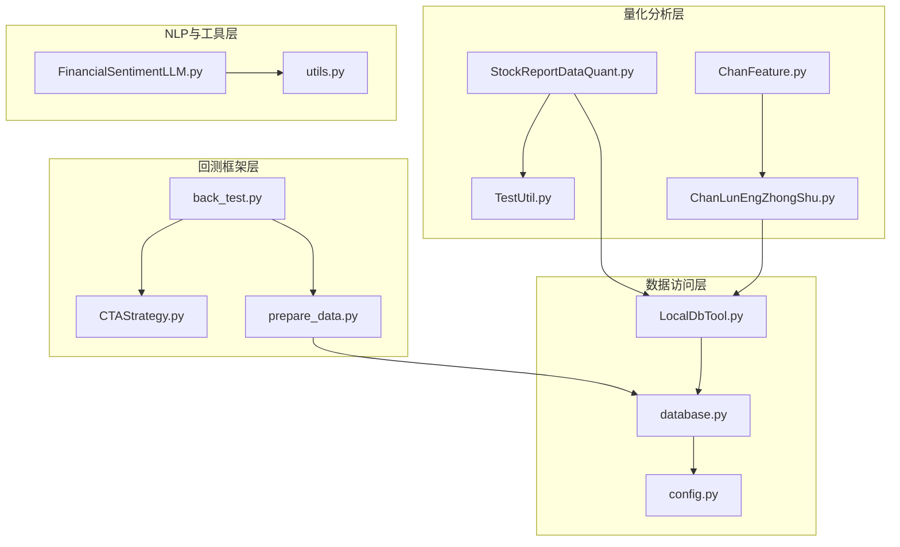
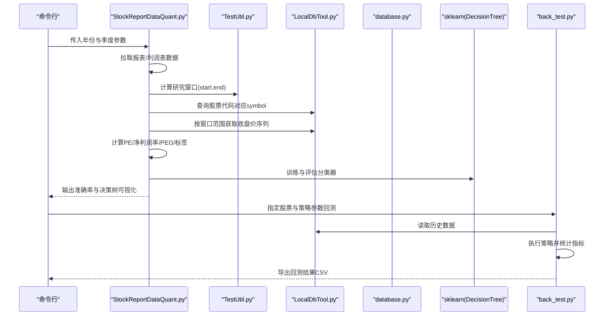
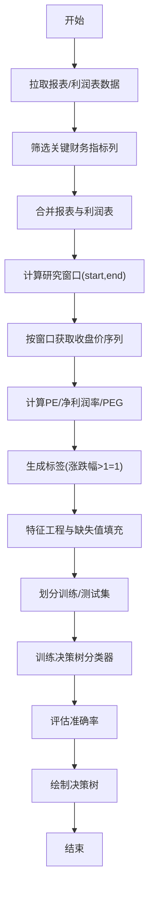
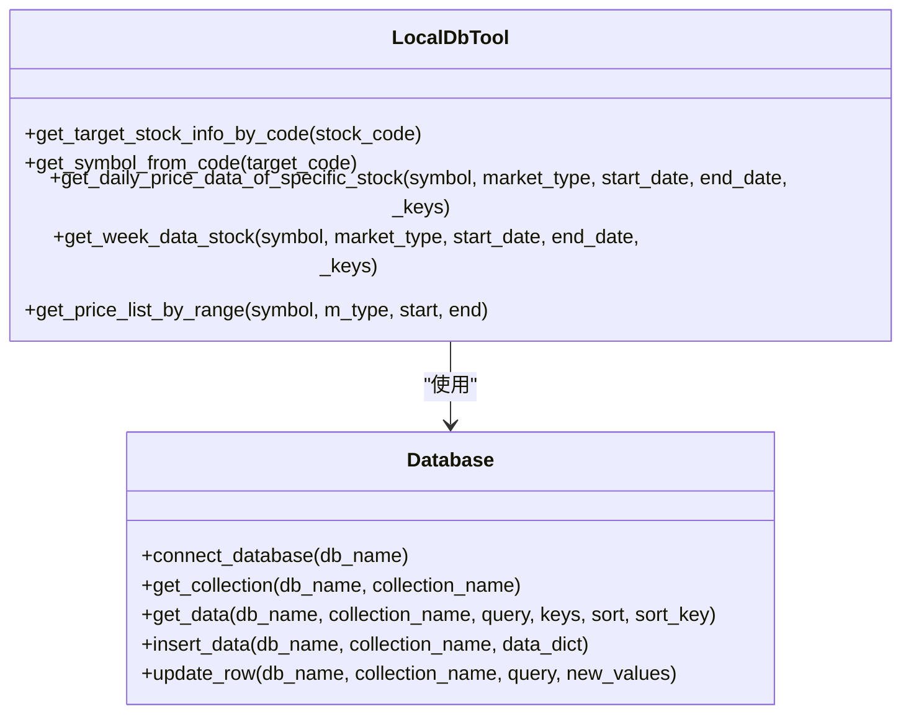
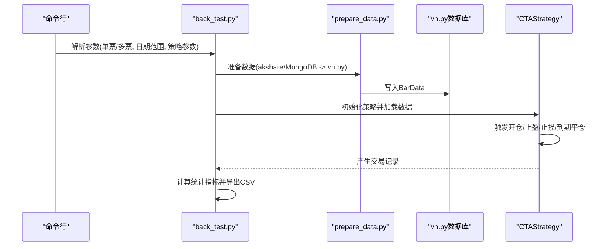
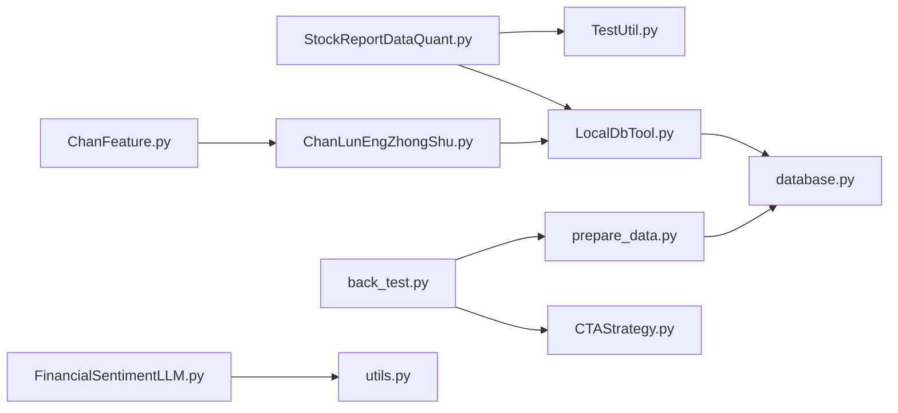

# 量化分析模块

<cite>
**本文引用的文件**
- [StockReportDataQuant.py](file://src/QuantAnalyze/StockReportDataQuant.py)
- [TestUtil.py](file://src/QuantAnalyze/TestUtil.py)
- [LocalDbTool.py](file://src/MongoDbComTools/LocalDbTool.py)
- [JointQuantTool.py](file://src/MongoDbComTools/JointQuantTool.py)
- [back_test.py](file://src/VnpyBacktesting/back_test.py)
- [CTAStrategy.py](file://src/VnpyBacktesting/CTAStrategy.py)
- [prepare_data.py](file://src/VnpyBacktesting/prepare_data.py)
- [utils.py](file://src/Utils/utils.py)
- [database.py](file://src/Utils/database.py)
- [config.py](file://src/Utils/config.py)
- [ChanLunEngZhongShu.py](file://src/ChanTechAnalyze/ChanLunEngZhongShu.py)
- [ChanFeature.py](file://src/ChanUtils/ChanFeature.py)
- [FinancialSentimentLLM.py](file://src/NlpModel/FinancialSentimentLLM.py)
- [README.md](file://README.md)
</cite>

## 目录
1. [引言](#引言)
2. [项目结构](#项目结构)
3. [核心组件](#核心组件)
4. [架构总览](#架构总览)
5. [详细组件分析](#详细组件分析)
6. [依赖分析](#依赖分析)
7. [性能考虑](#性能考虑)
8. [故障排查指南](#故障排查指南)
9. [结论](#结论)
10. [附录](#附录)

## 引言
本文件面向量化分析师与开发者，系统性梳理仓库中的量化分析模块，覆盖以下主题：
- 股票报告数据的量化处理与统计分析流程
- 测试工具与回测框架的实现原理与使用方法
- 量化指标的计算公式与业务含义
- 数据统计分析的算法实现与性能优化策略
- 量化分析在投资决策中的应用场景与价值
- 统计检验与假设验证的实现思路
- 实际量化分析案例与结果解读路径

## 项目结构
项目采用按功能域划分的模块化组织方式，量化分析相关的核心模块如下：
- QuantAnalyze：量化分析入口与测试工具
- MongoDbComTools：本地数据库与行情数据访问工具
- VnpyBacktesting：基于vn.py的回测框架
- Utils：通用工具、数据库封装与配置
- ChanTechAnalyze / ChanUtils：缠论技术分析与特征工程
- NlpModel：新闻情感与LLM推理能力
- MarketNewsSpiderWithScrapy / MarketPriceSpiderWithScrapy：新闻与价格数据采集（与量化分析间接相关）

**图表来源**
- [StockReportDataQuant.py:1-198](file://src/QuantAnalyze/StockReportDataQuant.py#L1-L198)
- [LocalDbTool.py:1-288](file://src/MongoDbComTools/LocalDbTool.py#L1-L288)
- [back_test.py:1-287](file://src/VnpyBacktesting/back_test.py#L1-L287)
- [prepare_data.py:1-570](file://src/VnpyBacktesting/prepare_data.py#L1-L570)
- [ChanLunEngZhongShu.py:1-185](file://src/ChanTechAnalyze/ChanLunEngZhongShu.py#L1-L185)
- [ChanFeature.py:1-325](file://src/ChanUtils/ChanFeature.py#L1-L325)
- [FinancialSentimentLLM.py:1-167](file://src/NlpModel/FinancialSentimentLLM.py#L1-L167)
- [utils.py:1-251](file://src/Utils/utils.py#L1-L251)
- [database.py:1-176](file://src/Utils/database.py#L1-L176)
- [config.py:1-455](file://src/Utils/config.py#L1-L455)

**章节来源**
- [README.md:1-33](file://README.md#L1-L33)

## 核心组件
- 股票报告数据量化处理器：从外部接口拉取报表与利润表数据，构造特征集，计算PE、净利润率、PEG等指标，并以决策树分类器进行训练与评估。
- 测试工具：提供日期区间的辅助函数，便于在财报发布前后设定研究窗口。
- 本地数据库工具：封装MongoDB访问、行情数据读取与索引规范化，支持周线聚合与复权金额计算。
- 回测框架：基于vn.py，提供策略参数化、数据准备、回测执行与结果统计导出。
- 技术分析与特征工程：缠论K线合并、中枢识别与买卖点判定，以及序列与统计特征提取。
- 新闻情感LLM：基于不同运行后端（GPU/Ollama/CPU）的金融新闻情感评分推理。

**章节来源**
- [StockReportDataQuant.py:1-198](file://src/QuantAnalyze/StockReportDataQuant.py#L1-L198)
- [TestUtil.py:1-40](file://src/QuantAnalyze/TestUtil.py#L1-L40)
- [LocalDbTool.py:1-288](file://src/MongoDbComTools/LocalDbTool.py#L1-L288)
- [back_test.py:1-287](file://src/VnpyBacktesting/back_test.py#L1-L287)
- [prepare_data.py:1-570](file://src/VnpyBacktesting/prepare_data.py#L1-L570)
- [ChanLunEngZhongShu.py:1-185](file://src/ChanTechAnalyze/ChanLunEngZhongShu.py#L1-L185)
- [ChanFeature.py:1-325](file://src/ChanUtils/ChanFeature.py#L1-L325)
- [FinancialSentimentLLM.py:1-167](file://src/NlpModel/FinancialSentimentLLM.py#L1-L167)

## 架构总览
量化分析模块由“数据获取—特征工程—建模评估—回测验证—可视化输出”构成闭环。数据层通过LocalDbTool与database封装访问MongoDB与外部接口；特征层结合财务报表与技术分析；建模层使用sklearn进行分类；回测层基于vn.py执行策略并输出统计指标。

**图表来源**
- [StockReportDataQuant.py:20-198](file://src/QuantAnalyze/StockReportDataQuant.py#L20-L198)
- [TestUtil.py:8-17](file://src/QuantAnalyze/TestUtil.py#L8-L17)
- [LocalDbTool.py:77-276](file://src/MongoDbComTools/LocalDbTool.py#L77-L276)
- [back_test.py:123-287](file://src/VnpyBacktesting/back_test.py#L123-L287)

## 详细组件分析

### 股票报告数据量化处理与统计分析
- 数据来源与清洗
  - 通过外部接口获取报表与利润表数据，筛选关键财务指标列。
  - 合并报表与利润表，过滤缺失或异常记录。
- 研究窗口与价格序列
  - 使用TestUtil提供的日期工具，按目标财报日前后若干天构造研究窗口。
  - 通过LocalDbTool按symbol与日期范围获取收盘价序列，形成时间序列特征。
- 指标计算与标签生成
  - PE = 股价 / 每股收益（收益>0时有效）
  - 净利润率 = 净利润 / 营业收入（收入>0时有效）
  - PEG = PE / 营收同比增长（PE>0时有效）
  - 标签 = 1（后N日涨跌幅>1），否则=0
- 特征工程与建模
  - 选择财务与支出类指标作为特征，填充缺失值。
  - 划分训练/测试集，使用决策树分类器训练并评估准确率。
  - 可视化决策树以解释特征重要性与分割规则。

**图表来源**
- [StockReportDataQuant.py:41-198](file://src/QuantAnalyze/StockReportDataQuant.py#L41-L198)
- [TestUtil.py:8-17](file://src/QuantAnalyze/TestUtil.py#L8-L17)
- [LocalDbTool.py:77-114](file://src/MongoDbComTools/LocalDbTool.py#L77-L114)

**章节来源**
- [StockReportDataQuant.py:41-198](file://src/QuantAnalyze/StockReportDataQuant.py#L41-L198)
- [TestUtil.py:8-17](file://src/QuantAnalyze/TestUtil.py#L8-L17)
- [LocalDbTool.py:77-114](file://src/MongoDbComTools/LocalDbTool.py#L77-L114)

### 测试工具与使用方法
- 功能概述
  - 提供日期偏移计算函数，支持财报发布日前后窗口的灵活设置。
  - 提供本地数据库工具的集成测试样例，验证symbol映射与价格序列读取。
- 使用建议
  - 在进行财报驱动的量化研究时，先调用日期工具确定研究窗口，再通过LocalDbTool读取对应时间序列。
  - 对于新上市股票或数据缺失场景，注意过滤无效symbol与空序列。

**章节来源**
- [TestUtil.py:8-39](file://src/QuantAnalyze/TestUtil.py#L8-L39)
- [LocalDbTool.py:69-114](file://src/MongoDbComTools/LocalDbTool.py#L69-L114)

### 本地数据库与行情数据访问
- 数据库封装
  - Database类提供连接、查询、插入、更新等通用操作，并内置自动重连机制。
  - 支持键值过滤、排序与最大条数限制，返回DataFrame以便后续分析。
- 本地工具
  - LocalDbTool封装cn/hk/us市场的基础信息与行情数据读取。
  - 支持周线聚合、复权金额计算、日期候选标准化与多格式兼容。
- 性能要点
  - 使用管道查询与候选日期集合减少无效查询。
  - 对空结果返回空DataFrame，避免上层逻辑异常。

**图表来源**
- [database.py:36-176](file://src/Utils/database.py#L36-L176)
- [LocalDbTool.py:10-276](file://src/MongoDbComTools/LocalDbTool.py#L10-L276)

**章节来源**
- [database.py:36-176](file://src/Utils/database.py#L36-L176)
- [LocalDbTool.py:10-276](file://src/MongoDbComTools/LocalDbTool.py#L10-L276)

### 回测框架与策略实现
- 回测引擎
  - back_test.py负责参数解析、数据准备、策略执行与结果统计导出。
  - 支持单票或多票回测，自动生成资金曲线、回撤与每日净盈亏图表。
- 策略模板
  - CTAStrategy实现严格单次开仓策略：指定买入日期强制开仓、固定止损、组合止盈（固定止盈+回撤止盈）、持有期限控制。
  - 自动计算可承受手数，避免超仓。
- 数据准备
  - prepare_data.py负责从akshare或MongoDB拉取日线数据，转换为vn.py BarData并写入数据库，支持复权类型与多市场。

**图表来源**
- [back_test.py:123-287](file://src/VnpyBacktesting/back_test.py#L123-L287)
- [prepare_data.py:478-529](file://src/VnpyBacktesting/prepare_data.py#L478-L529)
- [CTAStrategy.py:15-185](file://src/VnpyBacktesting/CTAStrategy.py#L15-L185)

**章节来源**
- [back_test.py:123-287](file://src/VnpyBacktesting/back_test.py#L123-L287)
- [prepare_data.py:364-437](file://src/VnpyBacktesting/prepare_data.py#L364-L437)
- [CTAStrategy.py:15-185](file://src/VnpyBacktesting/CTAStrategy.py#L15-L185)

### 缠论技术分析与特征工程
- K线与中枢处理
  - ChanLunEngZhongShu.py支持日线/周线/分钟线，完成K线合并、中枢识别与买卖点判定。
  - 支持多市场(symbol/code)输入与多级别(K线级别)分析。
- 特征工程
  - ChanFeature.py提供两类特征：
    - 序列特征：笔/线段的顶底方向、长度、角度、成交量、柱状图与MACD子序列统计。
    - 统计特征：中枢数量与统计量、MACD方差/标准差、最后笔/线段方向等。
- 应用建议
  - 将技术特征与财务特征拼接，提升分类器判别力。
  - 注意序列长度归一化与缺失值处理。

**章节来源**
- [ChanLunEngZhongShu.py:26-185](file://src/ChanTechAnalyze/ChanLunEngZhongShu.py#L26-L185)
- [ChanFeature.py:64-325](file://src/ChanUtils/ChanFeature.py#L64-L325)

### 新闻情感与LLM推理
- 功能概述
  - FinancialSentimentLLM根据运行环境选择GPU、Ollama或CPU后端，对金融新闻进行情感打分。
  - 输出类别与概率，便于构建情绪因子。
- 使用建议
  - 在资源受限环境下优先使用Ollama或CPU部署，确保推理稳定性。
  - 对长文本截断至合理长度，避免上下文溢出。

**章节来源**
- [FinancialSentimentLLM.py:19-167](file://src/NlpModel/FinancialSentimentLLM.py#L19-L167)

## 依赖分析
- 外部依赖
  - 数据获取：akshare、MongoDB(pymongo)、第三方认证(jqdatasdk)。
  - 机器学习：scikit-learn、matplotlib。
  - 回测：vn.py、vnpy_ctastrategy。
  - NLP：vLLM/transformers/openai(Ollama)。
- 内部耦合
  - QuantAnalyze依赖LocalDbTool与TestUtil；回测模块依赖prepare_data与LocalDbTool；技术分析模块依赖LocalDbTool与Utils。
- 潜在循环依赖
  - 当前模块间为单向依赖，未见明显循环。

**图表来源**
- [StockReportDataQuant.py:1-198](file://src/QuantAnalyze/StockReportDataQuant.py#L1-L198)
- [TestUtil.py:1-40](file://src/QuantAnalyze/TestUtil.py#L1-L40)
- [LocalDbTool.py:1-288](file://src/MongoDbComTools/LocalDbTool.py#L1-L288)
- [database.py:1-176](file://src/Utils/database.py#L1-L176)
- [back_test.py:1-287](file://src/VnpyBacktesting/back_test.py#L1-L287)
- [prepare_data.py:1-570](file://src/VnpyBacktesting/prepare_data.py#L1-L570)
- [CTAStrategy.py:1-185](file://src/VnpyBacktesting/CTAStrategy.py#L1-L185)
- [ChanLunEngZhongShu.py:1-185](file://src/ChanTechAnalyze/ChanLunEngZhongShu.py#L1-L185)
- [ChanFeature.py:1-325](file://src/ChanUtils/ChanFeature.py#L1-L325)
- [FinancialSentimentLLM.py:1-167](file://src/NlpModel/FinancialSentimentLLM.py#L1-L167)
- [utils.py:1-251](file://src/Utils/utils.py#L1-L251)

**章节来源**
- [StockReportDataQuant.py:1-198](file://src/QuantAnalyze/StockReportDataQuant.py#L1-L198)
- [back_test.py:1-287](file://src/VnpyBacktesting/back_test.py#L1-L287)
- [prepare_data.py:1-570](file://src/VnpyBacktesting/prepare_data.py#L1-L570)
- [ChanLunEngZhongShu.py:1-185](file://src/ChanTechAnalyze/ChanLunEngZhongShu.py#L1-L185)
- [ChanFeature.py:1-325](file://src/ChanUtils/ChanFeature.py#L1-L325)
- [FinancialSentimentLLM.py:1-167](file://src/NlpModel/FinancialSentimentLLM.py#L1-L167)
- [utils.py:1-251](file://src/Utils/utils.py#L1-L251)
- [database.py:1-176](file://src/Utils/database.py#L1-L176)

## 性能考虑
- 数据访问
  - 使用候选日期集合与多格式兼容，减少无效查询；对空结果快速返回，避免上层阻塞。
  - 复权金额计算采用向量化运算，降低循环开销。
- 机器学习
  - 决策树深度与叶子节点数可控，避免过拟合；特征填充为0，保证训练稳定性。
- 回测
  - 数据准备阶段支持清理旧数据与追加模式，减少冗余写入。
  - 策略侧仅在指定日期开仓一次，降低交易频率与滑点影响。
- 推理
  - LLM推理根据系统类型自动选择后端，GPU模式使用vLLM，CPU模式使用transformers，Ollama模式适配轻量部署。

**章节来源**
- [LocalDbTool.py:263-276](file://src/MongoDbComTools/LocalDbTool.py#L263-L276)
- [StockReportDataQuant.py:175-198](file://src/QuantAnalyze/StockReportDataQuant.py#L175-L198)
- [prepare_data.py:478-529](file://src/VnpyBacktesting/prepare_data.py#L478-L529)
- [CTAStrategy.py:105-129](file://src/VnpyBacktesting/CTAStrategy.py#L105-L129)
- [FinancialSentimentLLM.py:50-105](file://src/NlpModel/FinancialSentimentLLM.py#L50-L105)

## 故障排查指南
- MongoDB连接异常
  - 现象：查询失败或超时。
  - 处理：检查IP/端口配置与网络连通；确认自动重连机制是否生效。
- 日期格式不一致
  - 现象：查询不到数据或排序异常。
  - 处理：使用日期候选标准化函数，确保多种格式兼容。
- 新股或数据缺失
  - 现象：symbol映射为0或价格序列为空。
  - 处理：过滤无效symbol与空序列，保留有效样本。
- 回测无历史数据
  - 现象：回测引擎无历史数据，直接返回错误信息。
  - 处理：检查数据准备步骤与日期范围，确认vn.py数据库中是否存在BarData。
- LLM推理失败
  - 现象：解析JSON失败或模型加载异常。
  - 处理：检查后端选择与模型路径，缩短输入文本长度，确保Ollama服务可用。

**章节来源**
- [database.py:15-34](file://src/Utils/database.py#L15-L34)
- [LocalDbTool.py:127-173](file://src/MongoDbComTools/LocalDbTool.py#L127-L173)
- [LocalDbTool.py:77-114](file://src/MongoDbComTools/LocalDbTool.py#L77-L114)
- [back_test.py:146-154](file://src/VnpyBacktesting/back_test.py#L146-L154)
- [FinancialSentimentLLM.py:126-167](file://src/NlpModel/FinancialSentimentLLM.py#L126-L167)

## 结论
本量化分析模块通过“财务报表+技术分析+回测验证”的闭环，为投资决策提供了数据驱动的方法论支撑。模块具备良好的扩展性与可维护性，适合进一步引入更多因子（如新闻情感）与高级模型（如深度学习）。建议在实际应用中持续优化特征工程与回测策略参数，结合统计检验方法验证策略稳健性。

## 附录
- 量化指标与业务含义
  - PE：估值水平参考，收益>0时有效。
  - 净利润率：盈利能力与成本控制的综合体现。
  - PEG：结合成长性的估值指标，PE与营收增速的比值。
  - 标签：后N日涨跌幅阈值定义的二分类目标。
- 统计检验与假设验证
  - 建议在训练/测试集之外增加独立验证集，使用交叉验证与A/B测试评估策略稳定性。
  - 对策略收益分布进行正态性检验与显著性检验，控制回撤与最大回撤率。
- 实际案例与结果解读
  - 案例路径：选择某一季度财报日，使用TestUtil设定研究窗口，通过LocalDbTool读取价格序列，计算指标并训练分类器，得到准确率与决策树；随后在back_test中指定策略参数与回测周期，导出统计指标CSV，解读夏普比率、胜率、最大回撤等关键指标。

**章节来源**
- [StockReportDataQuant.py:122-142](file://src/QuantAnalyze/StockReportDataQuant.py#L122-L142)
- [back_test.py:26-35](file://src/VnpyBacktesting/back_test.py#L26-L35)