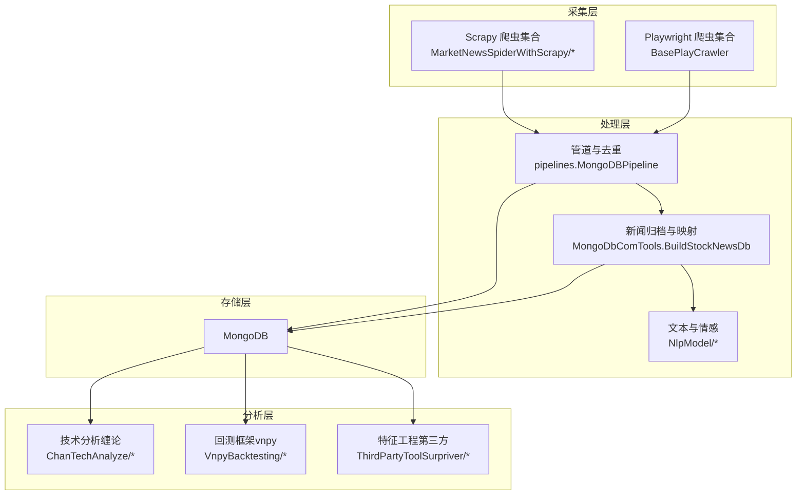
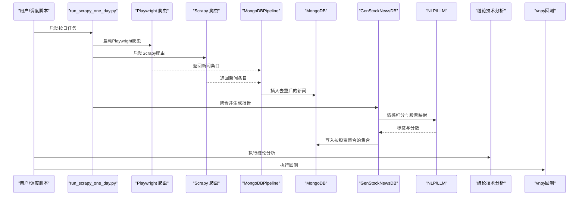
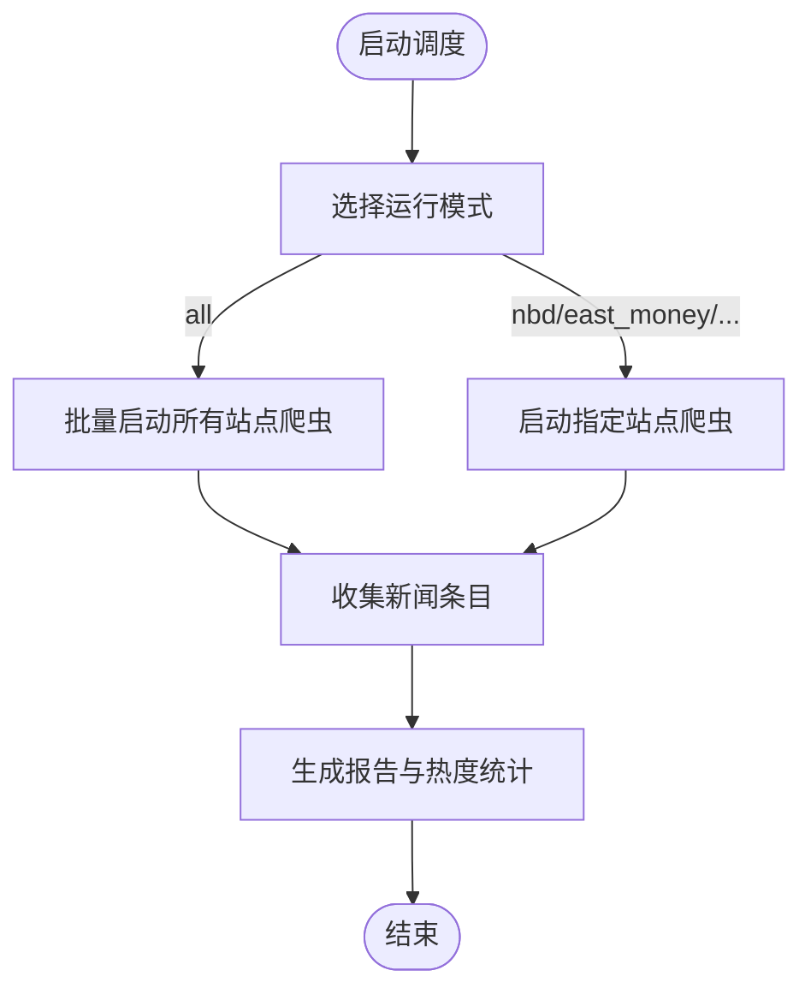
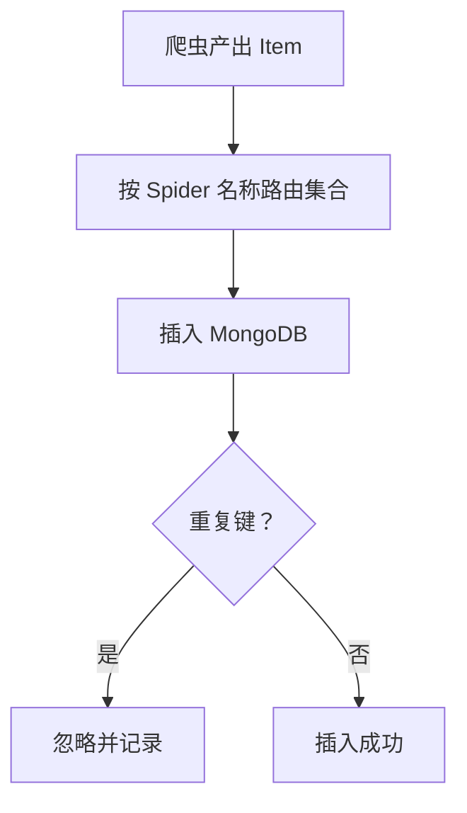
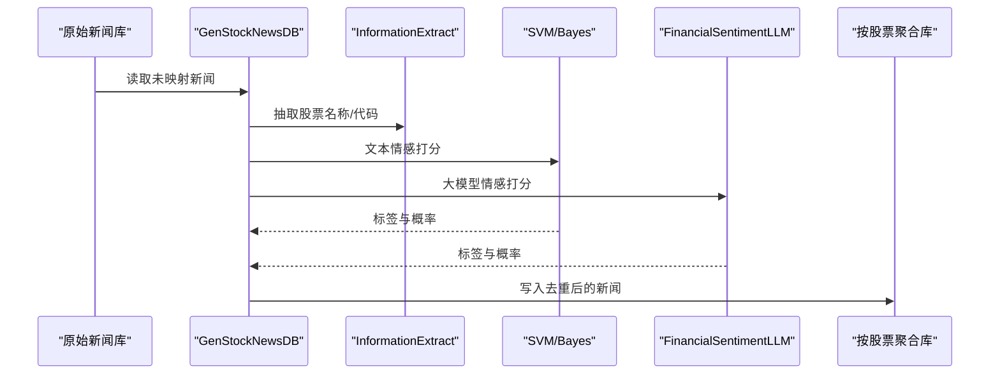
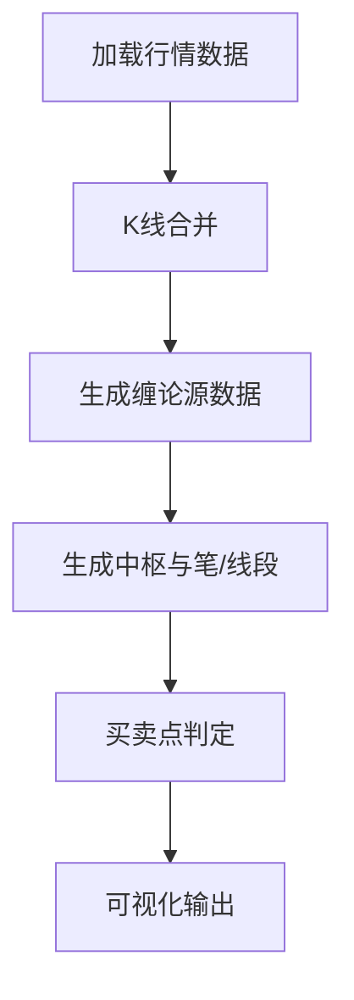
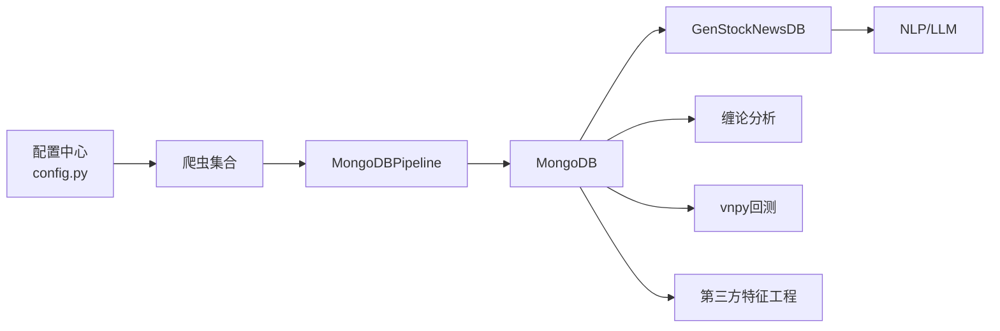

# 项目概述

<cite>
**本文引用的文件**   
- [README.md](file://README.md)
- [ProblemSolve.md](file://ProblemSolve.md)
- [src/Utils/config.py](file://src/Utils/config.py)
- [src/settings.py](file://src/settings.py)
- [src/pipelines.py](file://src/pipelines.py)
- [src/run_scripy_spider.py](file://src/run_scripy_spider.py)
- [src/run_scrapy_one_day.py](file://src/run_scrapy_one_day.py)
- [src/MarketNewsSpiderWithScrapy/BaseSpider.py](file://src/MarketNewsSpiderWithScrapy/BaseSpider.py)
- [src/NlpModel/nlp_main.py](file://src/NlpModel/nlp_main.py)
- [src/ChanTechAnalyze/ChanLunEngZhongShu.py](file://src/ChanTechAnalyze/ChanLunEngZhongShu.py)
- [src/MongoDbComTools/BuildStockNewsDb.py](file://src/MongoDbComTools/BuildStockNewsDb.py)
- [src/Utils/database.py](file://src/Utils/database.py)
- [src/VnpyBacktesting/back_test.py](file://src/VnpyBacktesting/back_test.py)
- [src/ThirdPartyToolSurpriver/data_loader.py](file://src/ThirdPartyToolSurpriver/data_loader.py)
</cite>

## 目录
1. [引言](#引言)
2. [项目结构](#项目结构)
3. [核心组件](#核心组件)
4. [架构总览](#架构总览)
5. [详细组件分析](#详细组件分析)
6. [依赖分析](#依赖分析)
7. [性能考虑](#性能考虑)
8. [故障排查指南](#故障排查指南)
9. [结论](#结论)
10. [附录](#附录)

## 引言
本项目面向量化投资者，提供“新闻爬取—文本分析—情感计算—技术分析—基本面分析—回测验证”的一体化流水线。系统通过Scrapy与Playwright并行抓取多家财经网站的股票相关新闻，结合传统NLP与大语言模型进行新闻情感打分，再将新闻按股票映射归档至MongoDB。随后，系统支持按日生成汇总报告、统计“利好/利空”热度，并提供缠论技术分析与回测框架，辅助量化策略研发与决策。

项目目标与价值：
- 降低信息搜集成本：统一抓取渠道，标准化入库，便于后续分析。
- 提升信号质量：融合多模型情感打分，减少噪声干扰。
- 支撑策略闭环：从数据到分析再到回测，形成可复用的工程化流程。
- 适配多市场：覆盖A股、港股、美股及中概股基础信息与数据。

## 项目结构
项目采用按功能域划分的层次化组织方式，核心模块包括：
- 新闻爬取与调度：Scrapy与Playwright双通道，配置化管理多个站点。
- 文本分析与情感计算：NLP工具链与LLM情感模型协同。
- 数据存储与检索：MongoDB统一存储，管道去重与索引。
- 技术分析：缠论K线合并与买卖点识别。
- 基础设施：数据库连接、配置中心、回测引擎、第三方特征工程。

**图表来源**
- [src/run_scripy_spider.py:117-145](file://src/run_scripy_spider.py#L117-L145)
- [src/run_scrapy_one_day.py:30-80](file://src/run_scrapy_one_day.py#L30-L80)
- [src/pipelines.py:8-56](file://src/pipelines.py#L8-L56)
- [src/MongoDbComTools/BuildStockNewsDb.py:19-53](file://src/MongoDbComTools/BuildStockNewsDb.py#L19-L53)
- [src/ChanTechAnalyze/ChanLunEngZhongShu.py:26-185](file://src/ChanTechAnalyze/ChanLunEngZhongShu.py#L26-L185)
- [src/VnpyBacktesting/back_test.py:19-287](file://src/VnpyBacktesting/back_test.py#L19-L287)
- [src/ThirdPartyToolSurpriver/data_loader.py:16-293](file://src/ThirdPartyToolSurpriver/data_loader.py#L16-L293)

**章节来源**
- [README.md:1-33](file://README.md#L1-L33)
- [src/settings.py:1-49](file://src/settings.py#L1-L49)
- [src/Utils/config.py:439-455](file://src/Utils/config.py#L439-L455)

## 核心组件
- 配置中心与站点清单
  - 统一管理各新闻站点的数据库名、集合名、起始URL、关键词、页码等，便于扩展与维护。
  - 关键字段：数据库名、集合名、站点名称、起始URL、关键词、中文分类名、最大页数等。
- Scrapy与Playwright爬虫调度
  - run_scripy_spider.py：一次性全量启动多个站点爬虫。
  - run_scrapy_one_day.py：按日增量抓取，生成汇总报告与热度统计。
- 管道与去重
  - pipelines.MongoDBPipeline：按站点名路由入库，自动去重（DuplicateKeyError）。
- 新闻归档与映射
  - BuildStockNewsDB：抽取新闻中的股票名称/代码，构建“利好/利空”评分，写入按股票聚合的集合。
- 文本与情感
  - NlpModel：分词、特征向量化、SVM/贝叶斯分类与LLM情感打分融合。
- 技术分析（缠论）
  - ChanLunEngZhongShu：K线合并、中枢生成、买卖点校验与可视化。
- 回测框架
  - back_test.py：基于vnpy回测引擎，支持单/多股票、自定义参数、图表导出。
- 特征工程（第三方）
  - data_loader：加载MongoDB历史行情，计算技术指标，构造训练样本。

**章节来源**
- [src/Utils/config.py:55-450](file://src/Utils/config.py#L55-L450)
- [src/run_scripy_spider.py:117-145](file://src/run_scripy_spider.py#L117-L145)
- [src/run_scrapy_one_day.py:30-80](file://src/run_scrapy_one_day.py#L30-L80)
- [src/pipelines.py:8-56](file://src/pipelines.py#L8-L56)
- [src/MongoDbComTools/BuildStockNewsDb.py:19-241](file://src/MongoDbComTools/BuildStockNewsDb.py#L19-L241)
- [src/NlpModel/nlp_main.py:17-70](file://src/NlpModel/nlp_main.py#L17-L70)
- [src/ChanTechAnalyze/ChanLunEngZhongShu.py:26-185](file://src/ChanTechAnalyze/ChanLunEngZhongShu.py#L26-L185)
- [src/VnpyBacktesting/back_test.py:19-287](file://src/VnpyBacktesting/back_test.py#L19-L287)
- [src/ThirdPartyToolSurpriver/data_loader.py:16-293](file://src/ThirdPartyToolSurpriver/data_loader.py#L16-L293)

## 架构总览
系统采用“采集-处理-分析-回测”的分层架构，数据流自上而下贯穿各模块，最终落于MongoDB并被分析与回测模块消费。

**图表来源**
- [src/run_scrapy_one_day.py:30-80](file://src/run_scrapy_one_day.py#L30-L80)
- [src/pipelines.py:25-46](file://src/pipelines.py#L25-L46)
- [src/MongoDbComTools/BuildStockNewsDb.py:157-241](file://src/MongoDbComTools/BuildStockNewsDb.py#L157-L241)
- [src/ChanTechAnalyze/ChanLunEngZhongShu.py:113-185](file://src/ChanTechAnalyze/ChanLunEngZhongShu.py#L113-L185)
- [src/VnpyBacktesting/back_test.py:123-187](file://src/VnpyBacktesting/back_test.py#L123-L187)

## 详细组件分析

### 新闻爬取与调度
- 双通道并行：Playwright用于需要JS渲染或反爬严格的站点；Scrapy用于常规站点，高并发低延迟。
- 配置化：通过config.py集中管理站点参数，新增站点只需扩展字典即可。
- 调度入口：
  - run_scripy_spider.py：一次性启动全量站点，适合初始化或补数据。
  - run_scrapy_one_day.py：按日增量抓取，生成Excel报告与热度TopN。

**图表来源**
- [src/run_scripy_spider.py:117-145](file://src/run_scripy_spider.py#L117-L145)
- [src/run_scrapy_one_day.py:30-80](file://src/run_scrapy_one_day.py#L30-L80)

**章节来源**
- [src/Utils/config.py:439-450](file://src/Utils/config.py#L439-L450)
- [src/run_scripy_spider.py:117-145](file://src/run_scripy_spider.py#L117-L145)
- [src/run_scrapy_one_day.py:30-80](file://src/run_scrapy_one_day.py#L30-L80)

### 管道与去重入库
- 按站点名动态路由集合，避免跨站点冲突。
- 自动去重：基于MD5主键，重复条目忽略。
- 与配置中心联动，确保不同站点写入对应数据库。

**图表来源**
- [src/pipelines.py:25-46](file://src/pipelines.py#L25-L46)

**章节来源**
- [src/pipelines.py:8-56](file://src/pipelines.py#L8-L56)

### 新闻归档与映射（按股票聚合）
- 信息抽取：从文章中识别股票名称与代码，生成JSON映射。
- 情感打分：ML模型与LLM打分融合，输出“利好/利空”标签与置信度。
- 聚合写入：按股票代码建立集合，去重后写入，便于后续按股票维度分析。

**图表来源**
- [src/MongoDbComTools/BuildStockNewsDb.py:157-241](file://src/MongoDbComTools/BuildStockNewsDb.py#L157-L241)
- [src/MarketNewsSpiderWithScrapy/BaseSpider.py:66-98](file://src/MarketNewsSpiderWithScrapy/BaseSpider.py#L66-L98)

**章节来源**
- [src/MongoDbComTools/BuildStockNewsDb.py:19-53](file://src/MongoDbComTools/BuildStockNewsDb.py#L19-L53)
- [src/MarketNewsSpiderWithScrapy/BaseSpider.py:41-146](file://src/MarketNewsSpiderWithScrapy/BaseSpider.py#L41-L146)

### 文本与情感（NLP与LLM）
- 分词与特征：使用jieba等工具，构建词典与向量空间。
- 分类模型：SVM与朴素贝叶斯二分类，输出“利好/利空”。
- LLM融合：可选启用本地/远程大模型，与传统模型打分融合，提升鲁棒性。
- 输出：每条新闻附带标签与分数，供后续分析与回测使用。

**章节来源**
- [src/NlpModel/nlp_main.py:17-70](file://src/NlpModel/nlp_main.py#L17-L70)
- [src/MarketNewsSpiderWithScrapy/BaseSpider.py:66-98](file://src/MarketNewsSpiderWithScrapy/BaseSpider.py#L66-L98)

### 技术分析（缠论）
- K线处理：合并分钟/日线K线，生成中枢与买卖点序列。
- 判定逻辑：交叉、高低点、距离与方差等指标综合判定有效买卖点。
- 可视化：绘制K线与中枢图形，辅助人工复核。

**图表来源**
- [src/ChanTechAnalyze/ChanLunEngZhongShu.py:149-185](file://src/ChanTechAnalyze/ChanLunEngZhongShu.py#L149-L185)

**章节来源**
- [src/ChanTechAnalyze/ChanLunEngZhongShu.py:26-185](file://src/ChanTechAnalyze/ChanLunEngZhongShu.py#L26-L185)

### 回测框架（vnpy）
- 参数化：支持固定止盈止损、移动止损、持有周期、下单手数等。
- 多股票：支持单票或多票回测，输出统计指标与图表。
- 数据准备：可按需准备历史数据，支持复权类型与市场类型切换。

**章节来源**
- [src/VnpyBacktesting/back_test.py:19-287](file://src/VnpyBacktesting/back_test.py#L19-L287)

### 特征工程（第三方）
- 数据加载：从MongoDB读取历史行情，清洗与转换。
- 技术指标：计算多种技术指标，构造特征矩阵。
- 训练样本：按未来N周期涨跌幅构造标签，形成监督学习样本。

**章节来源**
- [src/ThirdPartyToolSurpriver/data_loader.py:16-293](file://src/ThirdPartyToolSurpriver/data_loader.py#L16-L293)

## 依赖分析
- 组件耦合
  - 爬虫与管道：强耦合（Scrapy/Playwright → Pipeline），通过配置解耦站点。
  - 管道与存储：强耦合（Pipeline → MongoDB），通过路由集合弱化耦合。
  - 归档与NLP：弱耦合（GenStockNewsDB ←→ NLP），通过接口抽象。
  - 分析与存储：弱耦合（分析模块 ←→ MongoDB），通过查询接口。
- 外部依赖
  - MongoDB：持久化存储与查询。
  - vnpy：回测引擎。
  - 第三方库：Scrapy、Playwright、pymongo、akshare等。

**图表来源**
- [src/Utils/config.py:439-450](file://src/Utils/config.py#L439-L450)
- [src/pipelines.py:25-46](file://src/pipelines.py#L25-L46)
- [src/MongoDbComTools/BuildStockNewsDb.py:157-241](file://src/MongoDbComTools/BuildStockNewsDb.py#L157-L241)
- [src/VnpyBacktesting/back_test.py:123-187](file://src/VnpyBacktesting/back_test.py#L123-L187)
- [src/ThirdPartyToolSurpriver/data_loader.py:16-293](file://src/ThirdPartyToolSurpriver/data_loader.py#L16-L293)

**章节来源**
- [src/Utils/config.py:55-450](file://src/Utils/config.py#L55-L450)
- [src/settings.py:8-34](file://src/settings.py#L8-L34)
- [src/pipelines.py:8-56](file://src/pipelines.py#L8-L56)

## 性能考虑
- 并发与限速
  - settings.py中设置并发请求与下载延迟，平衡抓取效率与目标站点稳定性。
- 存储优化
  - 使用唯一索引与MD5主键避免重复写入；合理分集合（按站点/按股票）降低查询压力。
- 模型推理
  - LLM情感打分可选启用，兼顾精度与延迟；建议在资源允许时开启融合打分。
- 数据规模
  - 大规模回测前建议预处理数据，控制特征维度与样本数量。

[本节为通用指导，无需列出具体文件来源]

## 故障排查指南
- MongoDB连接与句柄限制
  - macOS默认文件句柄上限过低，需调高；参考问题解决文档中的命令与链接。
- ChromeDriver权限与版本
  - Playwright相关站点可能因驱动权限或版本不匹配导致异常，按文档指引修正。
- 字体与图表显示
  - Matplotlib字体缺失或配置不当会导致图表异常，按文档调整字体路径与配置。
- 数据去重与空值
  - 确保URL+时间组合唯一性；入库前清理多余空白字符，避免重复数据。

**章节来源**
- [ProblemSolve.md:1-68](file://ProblemSolve.md#L1-L68)

## 结论
本项目构建了从“新闻采集—文本分析—情感计算—技术分析—回测验证”的完整链路，具备良好的扩展性与工程化能力。通过配置化管理站点、统一入库与去重、多模型情感融合、缠论技术分析与vnpy回测，能够为量化投资者提供稳定可靠的数据与分析基础，支撑策略研发与实盘验证。

[本节为总结性内容，无需列出具体文件来源]

## 附录
- 应用场景
  - 量化研究员：获取并标注新闻，辅助事件驱动策略。
  - 策略工程师：结合技术分析与回测，验证信号有效性。
  - 投资者：按日汇总热点与情绪，辅助择时与选股。
- 价值定位
  - 降低信息噪音，提升信号质量；提供可复用的工程化流水线，缩短从数据到策略的周期。

[本节为概念性内容，无需列出具体文件来源]